# Advanced Retrieval Techniques

## Introduction

Beyond basic search, advanced retrieval techniques address specific challenges: getting enough context, filtering by metadata, and improving ranking quality. This lesson covers parent-child retrieval, attribute filtering, and reranking strategies.

### What We'll Cover

- Parent-child document retrieval
- Attribute and metadata filtering
- Reranking with Cohere and cross-encoders
- Combining techniques for production systems

### Prerequisites

- Understanding of chunking strategies
- Basic vector search experience
- Familiarity with document metadata

---

## Parent-Child Retrieval

The core dilemma: small chunks match queries better, but large chunks provide better context.

```mermaid
flowchart TD
    subgraph Problem["The Chunking Dilemma"]
        Small["Small Chunks<br/>✓ Better match<br/>✗ Less context"]
        Large["Large Chunks<br/>✗ Worse match<br/>✓ More context"]
    end
    
    subgraph Solution["Parent-Child Solution"]
        Match["Match on small<br/>(child chunks)"]
        Return["Return large<br/>(parent chunks)"]
        Match --> Return
    end
```



### How It Works

1. **Index small chunks** (children) for matching
2. **Store parent references** in metadata
3. **Search children** for best matches
4. **Return parents** for full context

### Implementation

```python
from openai import OpenAI
from dataclasses import dataclass

client = OpenAI()

@dataclass
class Chunk:
    id: str
    text: str
    parent_id: str
    chunk_index: int

@dataclass
class Document:
    id: str
    text: str
    chunks: list[Chunk]

def create_parent_child_structure(
    doc_id: str,
    text: str,
    parent_size: int = 2000,
    child_size: int = 400,
    child_overlap: int = 50
) -> Document:
    """
    Split document into parent and child chunks.
    
    Args:
        doc_id: Document identifier
        text: Full document text
        parent_size: Characters per parent chunk
        child_size: Characters per child chunk
        child_overlap: Overlap between children
    """
    # Create parent chunks
    parent_chunks = []
    for i in range(0, len(text), parent_size):
        parent_chunks.append({
            "id": f"{doc_id}_parent_{i // parent_size}",
            "text": text[i:i + parent_size]
        })
    
    # Create child chunks with parent references
    all_children = []
    
    for parent in parent_chunks:
        parent_text = parent["text"]
        parent_id = parent["id"]
        
        for j in range(0, len(parent_text), child_size - child_overlap):
            child_text = parent_text[j:j + child_size]
            
            if len(child_text.strip()) > 50:  # Skip tiny chunks
                child = Chunk(
                    id=f"{parent_id}_child_{j // (child_size - child_overlap)}",
                    text=child_text,
                    parent_id=parent_id,
                    chunk_index=j // (child_size - child_overlap)
                )
                all_children.append(child)
    
    return Document(id=doc_id, text=text, chunks=all_children)

def index_with_parent_refs(
    documents: list[Document]
) -> dict[str, str]:
    """
    Index children with parent metadata.
    
    Returns mapping of parent_id -> parent_text
    """
    parent_store = {}
    
    for doc in documents:
        # Store parent text
        for i in range(0, len(doc.text), 2000):
            parent_id = f"{doc.id}_parent_{i // 2000}"
            parent_store[parent_id] = doc.text[i:i + 2000]
        
        # Index children (would upload to vector store)
        for chunk in doc.chunks:
            # In practice, upload to OpenAI vector store with metadata
            print(f"Indexing: {chunk.id} (parent: {chunk.parent_id})")
    
    return parent_store
```

### Search and Expand to Parents

```python
def search_with_parent_expansion(
    vector_store_id: str,
    query: str,
    parent_store: dict[str, str],
    max_children: int = 10,
    max_parents: int = 5
) -> list[dict]:
    """
    Search children, return unique parents.
    """
    # Search children
    results = client.vector_stores.search(
        vector_store_id=vector_store_id,
        query=query,
        max_num_results=max_children
    )
    
    # Group by parent
    parent_scores = {}
    
    for r in results.data:
        # Extract parent_id from metadata (assumed structure)
        parent_id = r.file_id.rsplit("_child_", 1)[0]
        
        if parent_id not in parent_scores:
            parent_scores[parent_id] = {
                "parent_id": parent_id,
                "max_score": r.score,
                "child_hits": 1,
                "matching_children": [r.file_id]
            }
        else:
            parent_scores[parent_id]["max_score"] = max(
                parent_scores[parent_id]["max_score"],
                r.score
            )
            parent_scores[parent_id]["child_hits"] += 1
            parent_scores[parent_id]["matching_children"].append(r.file_id)
    
    # Rank parents by child hits, then by max score
    ranked_parents = sorted(
        parent_scores.values(),
        key=lambda x: (x["child_hits"], x["max_score"]),
        reverse=True
    )
    
    # Expand to full parent text
    results = []
    for parent_info in ranked_parents[:max_parents]:
        parent_id = parent_info["parent_id"]
        results.append({
            "parent_id": parent_id,
            "text": parent_store.get(parent_id, ""),
            "relevance_score": parent_info["max_score"],
            "child_hits": parent_info["child_hits"]
        })
    
    return results
```

---

## Attribute Filtering

Filter results by metadata before or during search:


### OpenAI Attribute Filters

OpenAI supports comparison and compound filters:

```python
from openai import OpenAI

client = OpenAI()

def search_with_filters(
    vector_store_id: str,
    query: str,
    filters: dict,
    max_results: int = 10
) -> list[dict]:
    """
    Search with attribute filtering.
    
    Filter examples:
    - {"type": "eq", "key": "category", "value": "technical"}
    - {"type": "gt", "key": "date", "value": "2024-01-01"}
    - {"type": "in", "key": "tags", "value": ["python", "ml"]}
    """
    results = client.vector_stores.search(
        vector_store_id=vector_store_id,
        query=query,
        max_num_results=max_results,
        filters=filters
    )
    
    return [
        {
            "file_id": r.file_id,
            "score": r.score,
            "content": [c.text for c in r.content]
        }
        for r in results.data
    ]
```

### Filter Types

| Filter Type | Operator | Example |
|-------------|----------|---------|
| **Equals** | `eq` | `{"type": "eq", "key": "status", "value": "published"}` |
| **Not equals** | `ne` | `{"type": "ne", "key": "status", "value": "draft"}` |
| **Greater than** | `gt` | `{"type": "gt", "key": "date", "value": "2024-01-01"}` |
| **Greater or equal** | `gte` | `{"type": "gte", "key": "version", "value": 2}` |
| **Less than** | `lt` | `{"type": "lt", "key": "price", "value": 100}` |
| **Less or equal** | `lte` | `{"type": "lte", "key": "priority", "value": 5}` |
| **In list** | `in` | `{"type": "in", "key": "category", "value": ["tech", "science"]}` |
| **Not in list** | `nin` | `{"type": "nin", "key": "status", "value": ["deleted", "archived"]}` |

### Compound Filters

Combine multiple conditions:

```python
def search_with_compound_filters(
    vector_store_id: str,
    query: str,
    category: str = None,
    min_date: str = None,
    exclude_drafts: bool = True
) -> list[dict]:
    """
    Build compound filters from parameters.
    """
    conditions = []
    
    if category:
        conditions.append({
            "type": "eq",
            "key": "category",
            "value": category
        })
    
    if min_date:
        conditions.append({
            "type": "gte",
            "key": "published_date",
            "value": min_date
        })
    
    if exclude_drafts:
        conditions.append({
            "type": "ne",
            "key": "status",
            "value": "draft"
        })
    
    # Combine with AND
    if len(conditions) > 1:
        filters = {
            "type": "and",
            "filters": conditions
        }
    elif conditions:
        filters = conditions[0]
    else:
        filters = None
    
    return search_with_filters(
        vector_store_id,
        query,
        filters=filters
    )

# Example: Technical docs from 2024, excluding drafts
results = search_with_compound_filters(
    "vs_abc123",
    "machine learning best practices",
    category="technical",
    min_date="2024-01-01",
    exclude_drafts=True
)
```

### OR Filters

```python
def search_multiple_categories(
    vector_store_id: str,
    query: str,
    categories: list[str]
) -> list[dict]:
    """
    Search across multiple categories.
    """
    # Use 'in' for simple OR on same field
    filters = {
        "type": "in",
        "key": "category",
        "value": categories
    }
    
    return search_with_filters(vector_store_id, query, filters)

# Or use explicit OR for different fields
def search_with_or_filters(
    vector_store_id: str,
    query: str
) -> list[dict]:
    """
    Example: technical docs OR high priority
    """
    filters = {
        "type": "or",
        "filters": [
            {"type": "eq", "key": "category", "value": "technical"},
            {"type": "gte", "key": "priority", "value": 8}
        ]
    }
    
    return search_with_filters(vector_store_id, query, filters)
```

---

## Reranking

Reranking uses a more powerful model to re-score initial results:


### Why Rerank?

| Stage | Model | Speed | Accuracy |
|-------|-------|-------|----------|
| Initial retrieval | Bi-encoder | Fast | Good |
| Reranking | Cross-encoder | Slow | Better |

### Cohere Reranking

```python
import cohere

co = cohere.Client("YOUR_API_KEY")

def rerank_results(
    query: str,
    documents: list[str],
    top_n: int = 5,
    model: str = "rerank-v3.5"
) -> list[dict]:
    """
    Rerank documents using Cohere.
    
    Args:
        query: Search query
        documents: List of document texts
        top_n: Number of results to return
        model: Reranking model
    """
    response = co.rerank(
        model=model,
        query=query,
        documents=documents,
        top_n=top_n
    )
    
    return [
        {
            "index": r.index,
            "text": documents[r.index],
            "relevance_score": r.relevance_score
        }
        for r in response.results
    ]

# Usage
documents = [
    "Machine learning best practices include data quality...",
    "Deep learning neural networks are powerful...",
    "Python is commonly used for ML development...",
    # ... more documents
]

reranked = rerank_results(
    "machine learning best practices",
    documents,
    top_n=3
)

for r in reranked:
    print(f"[{r['relevance_score']:.3f}] {r['text'][:50]}...")
```

### Search + Rerank Pipeline

```python
from openai import OpenAI
import cohere

class SearchWithRerank:
    """
    Two-stage retrieval: vector search + reranking.
    """
    
    def __init__(
        self,
        vector_store_id: str,
        openai_client: OpenAI = None,
        cohere_client: cohere.Client = None
    ):
        self.vector_store_id = vector_store_id
        self.openai = openai_client or OpenAI()
        self.cohere = cohere_client or cohere.Client()
    
    def search(
        self,
        query: str,
        fetch_k: int = 20,
        final_k: int = 5,
        rerank_model: str = "rerank-v3.5",
        score_threshold: float = 0.0
    ) -> list[dict]:
        """
        Search with reranking.
        
        Args:
            query: Search query
            fetch_k: Candidates to fetch from vector store
            final_k: Final results after reranking
            rerank_model: Cohere rerank model
            score_threshold: Minimum rerank score
        """
        # Stage 1: Vector search
        vs_results = self.openai.vector_stores.search(
            vector_store_id=self.vector_store_id,
            query=query,
            max_num_results=fetch_k
        )
        
        if not vs_results.data:
            return []
        
        # Extract texts for reranking
        candidates = [
            {
                "file_id": r.file_id,
                "text": " ".join([c.text for c in r.content]),
                "original_score": r.score
            }
            for r in vs_results.data
        ]
        
        # Stage 2: Rerank
        rerank_response = self.cohere.rerank(
            model=rerank_model,
            query=query,
            documents=[c["text"] for c in candidates],
            top_n=min(final_k, len(candidates))
        )
        
        # Build final results
        results = []
        for r in rerank_response.results:
            if r.relevance_score >= score_threshold:
                candidate = candidates[r.index]
                results.append({
                    "file_id": candidate["file_id"],
                    "text": candidate["text"],
                    "rerank_score": r.relevance_score,
                    "original_score": candidate["original_score"]
                })
        
        return results

# Usage
searcher = SearchWithRerank("vs_abc123")

results = searcher.search(
    "how to optimize database queries",
    fetch_k=20,
    final_k=5,
    score_threshold=0.5
)

for r in results:
    print(f"Rerank: {r['rerank_score']:.3f} | Original: {r['original_score']:.3f}")
    print(f"  {r['text'][:80]}...")
```

---

## Cross-Encoder Reranking

For self-hosted reranking without external APIs:

```python
from sentence_transformers import CrossEncoder

class LocalReranker:
    """
    Local cross-encoder reranking.
    """
    
    def __init__(self, model_name: str = "cross-encoder/ms-marco-MiniLM-L-6-v2"):
        self.model = CrossEncoder(model_name)
    
    def rerank(
        self,
        query: str,
        documents: list[str],
        top_n: int = 5
    ) -> list[dict]:
        """
        Rerank using local cross-encoder.
        """
        # Create query-document pairs
        pairs = [[query, doc] for doc in documents]
        
        # Score all pairs
        scores = self.model.predict(pairs)
        
        # Sort by score
        scored_docs = [
            {"index": i, "text": doc, "score": float(score)}
            for i, (doc, score) in enumerate(zip(documents, scores))
        ]
        
        scored_docs.sort(key=lambda x: x["score"], reverse=True)
        
        return scored_docs[:top_n]

# Usage
reranker = LocalReranker()

documents = [
    "Python is great for machine learning",
    "JavaScript is used for web development",
    "Machine learning with Python tutorial"
]

results = reranker.rerank(
    "machine learning python",
    documents,
    top_n=2
)

for r in results:
    print(f"[{r['score']:.3f}] {r['text']}")
```

---

## Combining Techniques

Production systems often combine multiple techniques:

```python
from openai import OpenAI
import cohere
from typing import Optional

class AdvancedRetriever:
    """
    Production retrieval with all techniques.
    """
    
    def __init__(
        self,
        vector_store_id: str,
        parent_store: dict[str, str] = None
    ):
        self.openai = OpenAI()
        self.cohere = cohere.Client()
        self.vector_store_id = vector_store_id
        self.parent_store = parent_store or {}
    
    def retrieve(
        self,
        query: str,
        k: int = 5,
        filters: dict = None,
        use_parent_expansion: bool = False,
        use_reranking: bool = True,
        rerank_threshold: float = 0.3
    ) -> list[dict]:
        """
        Full retrieval pipeline.
        
        Args:
            query: Search query
            k: Final number of results
            filters: Attribute filters
            use_parent_expansion: Expand to parent chunks
            use_reranking: Apply Cohere reranking
            rerank_threshold: Minimum rerank score
        """
        # Stage 1: Vector search with filters
        fetch_k = k * 4 if use_reranking else k * 2
        
        vs_results = self.openai.vector_stores.search(
            vector_store_id=self.vector_store_id,
            query=query,
            max_num_results=fetch_k,
            filters=filters
        )
        
        if not vs_results.data:
            return []
        
        # Stage 2: Optional parent expansion
        if use_parent_expansion and self.parent_store:
            candidates = self._expand_to_parents(vs_results.data)
        else:
            candidates = [
                {
                    "id": r.file_id,
                    "text": " ".join([c.text for c in r.content]),
                    "original_score": r.score
                }
                for r in vs_results.data
            ]
        
        # Stage 3: Optional reranking
        if use_reranking:
            results = self._rerank(query, candidates, k, rerank_threshold)
        else:
            results = sorted(
                candidates,
                key=lambda x: x["original_score"],
                reverse=True
            )[:k]
        
        return results
    
    def _expand_to_parents(self, results) -> list[dict]:
        """Expand child results to parent chunks."""
        parent_hits = {}
        
        for r in results:
            # Extract parent ID (assuming naming convention)
            file_id = r.file_id
            if "_child_" in file_id:
                parent_id = file_id.rsplit("_child_", 1)[0]
            else:
                parent_id = file_id
            
            if parent_id not in parent_hits:
                parent_text = self.parent_store.get(parent_id, "")
                if not parent_text:
                    parent_text = " ".join([c.text for c in r.content])
                
                parent_hits[parent_id] = {
                    "id": parent_id,
                    "text": parent_text,
                    "original_score": r.score,
                    "child_count": 1
                }
            else:
                parent_hits[parent_id]["original_score"] = max(
                    parent_hits[parent_id]["original_score"],
                    r.score
                )
                parent_hits[parent_id]["child_count"] += 1
        
        return list(parent_hits.values())
    
    def _rerank(
        self,
        query: str,
        candidates: list[dict],
        k: int,
        threshold: float
    ) -> list[dict]:
        """Rerank with Cohere."""
        if not candidates:
            return []
        
        response = self.cohere.rerank(
            model="rerank-v3.5",
            query=query,
            documents=[c["text"] for c in candidates],
            top_n=min(k, len(candidates))
        )
        
        results = []
        for r in response.results:
            if r.relevance_score >= threshold:
                candidate = candidates[r.index]
                results.append({
                    "id": candidate["id"],
                    "text": candidate["text"],
                    "rerank_score": r.relevance_score,
                    "original_score": candidate.get("original_score", 0)
                })
        
        return results

# Usage
retriever = AdvancedRetriever(
    vector_store_id="vs_abc123",
    parent_store={"doc1_parent_0": "Full parent text..."}
)

# Full pipeline: filter + parent expansion + reranking
results = retriever.retrieve(
    query="machine learning best practices",
    k=5,
    filters={"type": "eq", "key": "category", "value": "technical"},
    use_parent_expansion=True,
    use_reranking=True,
    rerank_threshold=0.4
)
```

---

## Hands-on Exercise

### Your Task

Build a `ProductionRetriever` class that:
1. Supports configurable filtering
2. Optionally expands to parent chunks
3. Optionally reranks results
4. Reports retrieval statistics

### Requirements

```python
class ProductionRetriever:
    def retrieve(
        self,
        query: str,
        config: RetrievalConfig
    ) -> RetrievalResult:
        """
        RetrievalConfig:
            - k: int
            - filters: dict | None
            - use_parents: bool
            - use_reranking: bool
        
        RetrievalResult:
            - results: list[dict]
            - stats: dict  # timing, counts, etc.
        """
        pass
```

<details>
<summary>💡 Hints</summary>

- Track timing at each stage
- Count documents at each stage (fetched, filtered, reranked)
- Handle empty results gracefully
- Use dataclasses for config and result

</details>

<details>
<summary>✅ Solution</summary>

```python
from dataclasses import dataclass
from openai import OpenAI
import cohere
import time
from typing import Optional

@dataclass
class RetrievalConfig:
    k: int = 5
    filters: dict = None
    use_parents: bool = False
    use_reranking: bool = True
    rerank_threshold: float = 0.3

@dataclass
class RetrievalResult:
    results: list[dict]
    stats: dict

class ProductionRetriever:
    def __init__(
        self,
        vector_store_id: str,
        parent_store: dict[str, str] = None
    ):
        self.openai = OpenAI()
        self.cohere = cohere.Client()
        self.vector_store_id = vector_store_id
        self.parent_store = parent_store or {}
    
    def retrieve(
        self,
        query: str,
        config: RetrievalConfig
    ) -> RetrievalResult:
        stats = {
            "query": query,
            "config": {
                "k": config.k,
                "use_parents": config.use_parents,
                "use_reranking": config.use_reranking
            },
            "timing_ms": {},
            "counts": {}
        }
        
        total_start = time.time()
        
        # Stage 1: Vector search
        stage_start = time.time()
        fetch_k = config.k * 4 if config.use_reranking else config.k
        
        vs_results = self.openai.vector_stores.search(
            vector_store_id=self.vector_store_id,
            query=query,
            max_num_results=fetch_k,
            filters=config.filters
        )
        
        stats["timing_ms"]["vector_search"] = int((time.time() - stage_start) * 1000)
        stats["counts"]["fetched"] = len(vs_results.data) if vs_results.data else 0
        
        if not vs_results.data:
            stats["timing_ms"]["total"] = int((time.time() - total_start) * 1000)
            return RetrievalResult(results=[], stats=stats)
        
        # Build candidates
        candidates = [
            {
                "id": r.file_id,
                "text": " ".join([c.text for c in r.content]),
                "original_score": r.score
            }
            for r in vs_results.data
        ]
        
        # Stage 2: Parent expansion
        if config.use_parents and self.parent_store:
            stage_start = time.time()
            candidates = self._expand_parents(candidates)
            stats["timing_ms"]["parent_expansion"] = int((time.time() - stage_start) * 1000)
            stats["counts"]["after_parent_expansion"] = len(candidates)
        
        # Stage 3: Reranking
        if config.use_reranking:
            stage_start = time.time()
            results = self._rerank(query, candidates, config.k, config.rerank_threshold)
            stats["timing_ms"]["reranking"] = int((time.time() - stage_start) * 1000)
            stats["counts"]["after_reranking"] = len(results)
        else:
            results = sorted(
                candidates,
                key=lambda x: x["original_score"],
                reverse=True
            )[:config.k]
        
        stats["timing_ms"]["total"] = int((time.time() - total_start) * 1000)
        stats["counts"]["final"] = len(results)
        
        return RetrievalResult(results=results, stats=stats)
    
    def _expand_parents(self, candidates: list[dict]) -> list[dict]:
        parent_hits = {}
        
        for c in candidates:
            if "_child_" in c["id"]:
                parent_id = c["id"].rsplit("_child_", 1)[0]
            else:
                parent_id = c["id"]
            
            parent_text = self.parent_store.get(parent_id, c["text"])
            
            if parent_id not in parent_hits:
                parent_hits[parent_id] = {
                    "id": parent_id,
                    "text": parent_text,
                    "original_score": c["original_score"]
                }
            else:
                parent_hits[parent_id]["original_score"] = max(
                    parent_hits[parent_id]["original_score"],
                    c["original_score"]
                )
        
        return list(parent_hits.values())
    
    def _rerank(
        self,
        query: str,
        candidates: list[dict],
        k: int,
        threshold: float
    ) -> list[dict]:
        response = self.cohere.rerank(
            model="rerank-v3.5",
            query=query,
            documents=[c["text"] for c in candidates],
            top_n=min(k, len(candidates))
        )
        
        results = []
        for r in response.results:
            if r.relevance_score >= threshold:
                c = candidates[r.index]
                results.append({
                    "id": c["id"],
                    "text": c["text"],
                    "rerank_score": r.relevance_score,
                    "original_score": c["original_score"]
                })
        
        return results

# Test
retriever = ProductionRetriever("vs_abc123")

config = RetrievalConfig(
    k=5,
    filters={"type": "eq", "key": "category", "value": "technical"},
    use_parents=False,
    use_reranking=True,
    rerank_threshold=0.4
)

result = retriever.retrieve("machine learning best practices", config)

print("Stats:", result.stats)
print(f"Found {len(result.results)} results")
for r in result.results:
    print(f"  [{r['rerank_score']:.3f}] {r['text'][:50]}...")
```

</details>

---

## Summary

Advanced retrieval techniques solve specific challenges:

✅ **Parent-child retrieval** — Match on small chunks, return large context
✅ **Attribute filtering** — Pre-filter by metadata (category, date, status)
✅ **Reranking** — Use cross-encoders for more accurate final ranking
✅ **Combined pipelines** — Chain techniques for production quality

**Next:** [Context Assembly](./06-context-assembly.md) (or return to [Retrieval Strategies Overview](./00-retrieval-strategies.md))

---

## Further Reading

- [OpenAI Vector Store Filters](https://platform.openai.com/docs/guides/retrieval) - Attribute filtering
- [Cohere Rerank](https://docs.cohere.com/docs/rerank-2) - Reranking API
- [Sentence Transformers](https://www.sbert.net/docs/pretrained_cross-encoders.html) - Local cross-encoders

<!--
Sources Consulted:
- OpenAI retrieval and vector store documentation (filters, ranking_options)
- Cohere rerank API documentation
- Sentence Transformers cross-encoder documentation
-->
