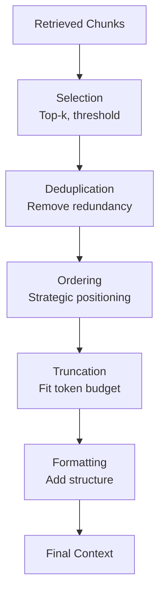
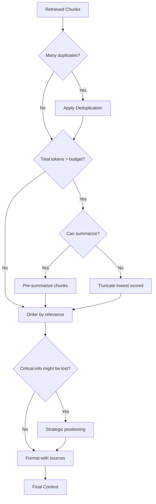

# Context Construction

## Introduction

After retrieving relevant documents, you need to assemble them into a coherent context for the LLM. Poor context construction leads to hallucinations, missed information, and wasted tokens. Good context construction maximizes the value of every token in your context window.

This lesson covers how to select, order, deduplicate, and optimize retrieved content for LLM consumption.

### What We'll Cover

- Chunk selection and budget allocation
- Content ordering strategies
- Token counting and context window management
- Deduplication techniques
- Summarization for long contexts

### Prerequisites

- Understanding of retrieval strategies
- Familiarity with embeddings and vector search
- Basic prompt engineering concepts

---

## Quick Start

```python
from openai import OpenAI
import tiktoken

client = OpenAI()

def build_context(
    retrieved_chunks: list[dict],
    max_tokens: int = 4000,
    model: str = "gpt-4o"
) -> str:
    """
    Build optimized context from retrieved chunks.
    
    Args:
        retrieved_chunks: List of {text, score, source} dicts
        max_tokens: Maximum tokens for context
        model: Model for token counting
    """
    # Get tokenizer
    encoding = tiktoken.encoding_for_model(model)
    
    # Deduplicate
    unique_chunks = deduplicate(retrieved_chunks)
    
    # Sort by relevance
    sorted_chunks = sorted(unique_chunks, key=lambda x: x["score"], reverse=True)
    
    # Build context within budget
    context_parts = []
    current_tokens = 0
    
    for chunk in sorted_chunks:
        chunk_tokens = len(encoding.encode(chunk["text"]))
        
        if current_tokens + chunk_tokens > max_tokens:
            break
        
        context_parts.append(format_chunk(chunk))
        current_tokens += chunk_tokens
    
    return "\n\n".join(context_parts)

def deduplicate(chunks: list[dict]) -> list[dict]:
    """Remove exact duplicates."""
    seen = set()
    unique = []
    
    for chunk in chunks:
        text_hash = hash(chunk["text"].strip().lower())
        if text_hash not in seen:
            seen.add(text_hash)
            unique.append(chunk)
    
    return unique

def format_chunk(chunk: dict) -> str:
    """Format chunk with source metadata."""
    source = chunk.get("source", "Unknown")
    return f"[Source: {source}]\n{chunk['text']}"
```

---

## The Context Construction Pipeline



---

## Strategy Comparison

| Strategy | Purpose | When to Use |
|----------|---------|-------------|
| **Relevance ordering** | Most important first | Default for most cases |
| **Chronological ordering** | Time-based context | News, conversations, logs |
| **Source grouping** | Group by document | Multi-document Q&A |
| **Strategic positioning** | Best at start/end | Avoid "lost in the middle" |
| **Exact dedup** | Remove identical chunks | Always |
| **Semantic dedup** | Remove similar chunks | Diverse sources |
| **Pre-summarization** | Compress before inclusion | Very long documents |
| **Hierarchical summarization** | Multi-level compression | Entire document sets |

---

## Decision Flowchart



---

## Key Concepts

| Concept | Description |
|---------|-------------|
| **Context budget** | Token allocation for retrieved content |
| **Token counting** | Measure tokens before insertion |
| **Lost in the middle** | LLMs pay less attention to middle content |
| **Semantic deduplication** | Remove chunks with similar meaning |
| **Hierarchical summarization** | Summarize chunks, then summarize summaries |
| **Source attribution** | Track which source each chunk came from |

---

## Lesson Structure

| File | Topic |
|------|-------|
| [01-chunk-selection.md](./01-chunk-selection.md) | Relevance scoring, selection criteria, budget allocation |
| [02-content-ordering.md](./02-content-ordering.md) | Ordering strategies, "lost in the middle" problem |
| [03-context-window-management.md](./03-context-window-management.md) | Token counting, truncation, dynamic sizing |
| [04-deduplication-strategies.md](./04-deduplication-strategies.md) | Exact, near-duplicate, semantic deduplication |
| [05-summarization-compression.md](./05-summarization-compression.md) | Pre-summarization, compression techniques |

---

## Summary

Context construction bridges retrieval and generation:

✅ **Select** — Choose the most relevant chunks
✅ **Deduplicate** — Remove redundant content
✅ **Order** — Position content strategically
✅ **Fit budget** — Count tokens, truncate if needed
✅ **Format** — Add structure and source info

**Next:** [Chunk Selection](./01-chunk-selection.md)

---

## Further Reading

- [OpenAI Tiktoken](https://cookbook.openai.com/examples/how_to_count_tokens_with_tiktoken) - Token counting
- [Lost in the Middle](https://arxiv.org/abs/2307.03172) - Position effects in long contexts
- [Anthropic Context Windows](https://docs.anthropic.com/en/docs/build-with-claude/context-windows) - Context window concepts

<!--
Sources Consulted:
- OpenAI prompt engineering documentation
- OpenAI tiktoken cookbook
- Anthropic context windows documentation
-->
