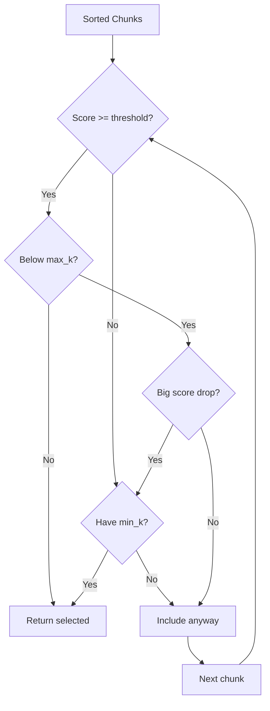

# Chunk Selection

## Introduction

Not every retrieved chunk deserves a spot in your context. Chunk selection determines which pieces of retrieved content provide enough value to justify their token cost. Good selection maximizes relevance while minimizing noise.

This lesson covers relevance scoring, selection criteria, and context budget allocation strategies.

### What We'll Cover

- Relevance scoring interpretation
- Top-k vs threshold-based selection
- Context budget allocation
- Quality vs quantity trade-offs

### Prerequisites

- Understanding of similarity search
- Familiarity with retrieval scores
- Basic token concepts

---

## Relevance Scoring

Retrieved chunks come with similarity scores. Understanding these scores helps you make informed selection decisions.

### Score Interpretation

| Score Range | Interpretation | Action |
|-------------|---------------|--------|
| **0.90+** | Highly relevant, direct match | Always include |
| **0.80-0.90** | Good match, related content | Include if budget allows |
| **0.70-0.80** | Moderately relevant | Include with caution |
| **0.60-0.70** | Tangentially related | Usually skip |
| **< 0.60** | Low relevance | Skip |

> **Note:** These thresholds vary by embedding model and domain. Calibrate based on your specific use case.

### Normalized Scoring

```python
def normalize_scores(chunks: list[dict]) -> list[dict]:
    """
    Normalize scores to 0-1 range for consistent thresholding.
    
    Useful when combining results from multiple retrieval methods.
    """
    if not chunks:
        return chunks
    
    scores = [c["score"] for c in chunks]
    min_score = min(scores)
    max_score = max(scores)
    
    if max_score == min_score:
        # All same score
        for c in chunks:
            c["normalized_score"] = 1.0
    else:
        for c in chunks:
            c["normalized_score"] = (c["score"] - min_score) / (max_score - min_score)
    
    return chunks
```

---

## Selection Strategies

### Top-K Selection

Always include the top K results regardless of score:

```python
def top_k_selection(
    chunks: list[dict],
    k: int = 5
) -> list[dict]:
    """
    Select top-k chunks by score.
    
    Simple but may include low-quality results.
    """
    sorted_chunks = sorted(chunks, key=lambda x: x["score"], reverse=True)
    return sorted_chunks[:k]
```

**Pros:**
- Simple, predictable
- Guaranteed result count

**Cons:**
- May include irrelevant content
- Doesn't adapt to query difficulty

### Threshold-Based Selection

Include only chunks above a score threshold:

```python
def threshold_selection(
    chunks: list[dict],
    threshold: float = 0.75
) -> list[dict]:
    """
    Select chunks above score threshold.
    
    Ensures minimum quality but may return few/no results.
    """
    return [c for c in chunks if c["score"] >= threshold]
```

**Pros:**
- Guarantees minimum quality
- No irrelevant filler

**Cons:**
- May return empty results
- Threshold requires tuning

### Adaptive Selection

Combine both approaches:

```python
def adaptive_selection(
    chunks: list[dict],
    min_k: int = 2,
    max_k: int = 10,
    threshold: float = 0.70,
    score_drop_ratio: float = 0.8
) -> list[dict]:
    """
    Adaptive selection based on score patterns.
    
    Args:
        min_k: Minimum results to return
        max_k: Maximum results to return
        threshold: Minimum acceptable score
        score_drop_ratio: Stop if score drops below this ratio of previous
    """
    sorted_chunks = sorted(chunks, key=lambda x: x["score"], reverse=True)
    
    selected = []
    prev_score = None
    
    for chunk in sorted_chunks:
        # Stop if we hit max
        if len(selected) >= max_k:
            break
        
        # Check threshold (but ensure min_k)
        if chunk["score"] < threshold and len(selected) >= min_k:
            break
        
        # Check for score cliff
        if prev_score is not None:
            if chunk["score"] < prev_score * score_drop_ratio and len(selected) >= min_k:
                break
        
        selected.append(chunk)
        prev_score = chunk["score"]
    
    return selected
```



---

## Context Budget Allocation

Allocate your token budget across different content types:

```python
from dataclasses import dataclass

@dataclass
class ContextBudget:
    """Define token allocation for different content types."""
    system_prompt: int = 500
    retrieved_context: int = 4000
    conversation_history: int = 2000
    user_query: int = 500
    response_buffer: int = 1000
    
    @property
    def total(self) -> int:
        return (
            self.system_prompt +
            self.retrieved_context +
            self.conversation_history +
            self.user_query +
            self.response_buffer
        )
    
    def fits_model(self, model_context_window: int) -> bool:
        return self.total <= model_context_window

def allocate_budget(
    total_tokens: int,
    conversation_turns: int = 0,
    system_prompt_tokens: int = 500
) -> ContextBudget:
    """
    Dynamically allocate context budget.
    
    Args:
        total_tokens: Model's context window size
        conversation_turns: Number of conversation turns
        system_prompt_tokens: Tokens used by system prompt
    """
    # Reserve space for response
    response_buffer = min(2000, total_tokens // 8)
    
    # System prompt (fixed)
    system_prompt = system_prompt_tokens
    
    # User query (estimate)
    user_query = 500
    
    # Conversation history (grows with turns)
    if conversation_turns > 0:
        conversation_history = min(
            conversation_turns * 500,  # ~500 tokens per turn
            total_tokens // 4  # Max 25% for history
        )
    else:
        conversation_history = 0
    
    # Retrieved context gets the rest
    retrieved_context = (
        total_tokens -
        response_buffer -
        system_prompt -
        user_query -
        conversation_history
    )
    
    return ContextBudget(
        system_prompt=system_prompt,
        retrieved_context=max(0, retrieved_context),
        conversation_history=conversation_history,
        user_query=user_query,
        response_buffer=response_buffer
    )

# Example
budget = allocate_budget(
    total_tokens=128000,  # GPT-4o
    conversation_turns=5,
    system_prompt_tokens=800
)

print(f"Retrieved context budget: {budget.retrieved_context} tokens")
print(f"Total budget: {budget.total} tokens")
```

---

## Quality vs Quantity Trade-offs

### The Trade-off

| Approach | Pros | Cons |
|----------|------|------|
| **More chunks** | Higher recall, more coverage | Noise, diluted attention |
| **Fewer chunks** | Higher precision, focused | May miss relevant info |

### When to Prefer Quality (Fewer Chunks)

- Specific factual questions
- Limited context window
- High-stakes applications
- Clear, focused queries

### When to Prefer Quantity (More Chunks)

- Exploratory questions
- Large context window models
- Multi-faceted topics
- Research/synthesis tasks

### Adaptive Strategy

```python
def select_by_query_type(
    chunks: list[dict],
    query: str,
    max_tokens: int
) -> list[dict]:
    """
    Adjust selection strategy based on query characteristics.
    """
    # Analyze query
    is_specific = len(query.split()) < 10
    is_factual = any(q in query.lower() for q in ["what is", "when", "who", "how many"])
    is_exploratory = any(q in query.lower() for q in ["explain", "describe", "overview", "compare"])
    
    # Set parameters based on query type
    if is_factual and is_specific:
        # Precision-focused
        min_k = 2
        max_k = 5
        threshold = 0.80
    elif is_exploratory:
        # Coverage-focused
        min_k = 5
        max_k = 15
        threshold = 0.65
    else:
        # Balanced
        min_k = 3
        max_k = 10
        threshold = 0.70
    
    return adaptive_selection(
        chunks,
        min_k=min_k,
        max_k=max_k,
        threshold=threshold
    )
```

---

## Chunk Scoring Enhancements

### Boost by Metadata

```python
def score_with_metadata_boost(
    chunk: dict,
    query_metadata: dict = None
) -> float:
    """
    Enhance relevance score with metadata signals.
    """
    base_score = chunk["score"]
    boost = 0.0
    
    # Recency boost
    if "date" in chunk.get("metadata", {}):
        from datetime import datetime, timedelta
        chunk_date = chunk["metadata"]["date"]
        days_old = (datetime.now() - chunk_date).days
        
        if days_old < 30:
            boost += 0.05
        elif days_old < 90:
            boost += 0.02
    
    # Source authority boost
    if chunk.get("metadata", {}).get("source_type") == "official":
        boost += 0.03
    
    # Category match boost
    if query_metadata and "category" in query_metadata:
        if chunk.get("metadata", {}).get("category") == query_metadata["category"]:
            boost += 0.05
    
    return min(1.0, base_score + boost)
```

### Multi-Signal Ranking

```python
def multi_signal_rank(
    chunks: list[dict],
    weights: dict = None
) -> list[dict]:
    """
    Rank chunks using multiple signals.
    
    Args:
        weights: Signal weights (default balanced)
    """
    weights = weights or {
        "semantic": 0.5,    # Embedding similarity
        "keyword": 0.2,     # BM25/keyword match
        "recency": 0.15,    # How recent
        "authority": 0.15   # Source authority
    }
    
    for chunk in chunks:
        signals = {
            "semantic": chunk.get("score", 0),
            "keyword": chunk.get("keyword_score", 0),
            "recency": chunk.get("recency_score", 0),
            "authority": chunk.get("authority_score", 0.5)
        }
        
        chunk["combined_score"] = sum(
            signals[key] * weight
            for key, weight in weights.items()
        )
    
    return sorted(chunks, key=lambda x: x["combined_score"], reverse=True)
```

---

## Hands-on Exercise

### Your Task

Implement a `ChunkSelector` class that:
1. Supports multiple selection strategies
2. Respects token budgets
3. Provides selection statistics

### Requirements

```python
class ChunkSelector:
    def select(
        self,
        chunks: list[dict],
        strategy: str = "adaptive",  # "top_k", "threshold", "adaptive"
        max_tokens: int = 4000,
        **kwargs
    ) -> dict:
        """
        Returns:
        {
            "selected": list of chunks,
            "stats": {
                "input_count": int,
                "selected_count": int,
                "tokens_used": int,
                "avg_score": float
            }
        }
        """
        pass
```

<details>
<summary>💡 Hints</summary>

- Use tiktoken for token counting
- Track statistics as you go
- Handle empty input gracefully
- Support configurable parameters via kwargs

</details>

<details>
<summary>✅ Solution</summary>

```python
import tiktoken
from typing import Literal

class ChunkSelector:
    def __init__(self, model: str = "gpt-4o"):
        self.encoding = tiktoken.encoding_for_model(model)
    
    def select(
        self,
        chunks: list[dict],
        strategy: Literal["top_k", "threshold", "adaptive"] = "adaptive",
        max_tokens: int = 4000,
        **kwargs
    ) -> dict:
        if not chunks:
            return {
                "selected": [],
                "stats": {
                    "input_count": 0,
                    "selected_count": 0,
                    "tokens_used": 0,
                    "avg_score": 0.0
                }
            }
        
        # Apply strategy
        if strategy == "top_k":
            k = kwargs.get("k", 5)
            candidates = self._top_k(chunks, k)
        elif strategy == "threshold":
            threshold = kwargs.get("threshold", 0.75)
            candidates = self._threshold(chunks, threshold)
        else:  # adaptive
            candidates = self._adaptive(
                chunks,
                min_k=kwargs.get("min_k", 2),
                max_k=kwargs.get("max_k", 10),
                threshold=kwargs.get("threshold", 0.70)
            )
        
        # Fit to token budget
        selected = []
        tokens_used = 0
        
        for chunk in candidates:
            chunk_tokens = len(self.encoding.encode(chunk["text"]))
            
            if tokens_used + chunk_tokens > max_tokens:
                break
            
            selected.append(chunk)
            tokens_used += chunk_tokens
        
        # Calculate stats
        avg_score = (
            sum(c["score"] for c in selected) / len(selected)
            if selected else 0.0
        )
        
        return {
            "selected": selected,
            "stats": {
                "input_count": len(chunks),
                "selected_count": len(selected),
                "tokens_used": tokens_used,
                "avg_score": round(avg_score, 3)
            }
        }
    
    def _top_k(self, chunks: list[dict], k: int) -> list[dict]:
        sorted_chunks = sorted(chunks, key=lambda x: x["score"], reverse=True)
        return sorted_chunks[:k]
    
    def _threshold(self, chunks: list[dict], threshold: float) -> list[dict]:
        filtered = [c for c in chunks if c["score"] >= threshold]
        return sorted(filtered, key=lambda x: x["score"], reverse=True)
    
    def _adaptive(
        self,
        chunks: list[dict],
        min_k: int,
        max_k: int,
        threshold: float
    ) -> list[dict]:
        sorted_chunks = sorted(chunks, key=lambda x: x["score"], reverse=True)
        
        selected = []
        prev_score = None
        
        for chunk in sorted_chunks:
            if len(selected) >= max_k:
                break
            
            if chunk["score"] < threshold and len(selected) >= min_k:
                break
            
            if prev_score and chunk["score"] < prev_score * 0.8:
                if len(selected) >= min_k:
                    break
            
            selected.append(chunk)
            prev_score = chunk["score"]
        
        return selected

# Test
chunks = [
    {"text": "Machine learning is a subset of AI.", "score": 0.92},
    {"text": "Deep learning uses neural networks.", "score": 0.88},
    {"text": "Python is popular for ML.", "score": 0.75},
    {"text": "Weather today is sunny.", "score": 0.45},
]

selector = ChunkSelector()

result = selector.select(chunks, strategy="adaptive", max_tokens=500)

print(f"Selected {result['stats']['selected_count']} of {result['stats']['input_count']}")
print(f"Tokens used: {result['stats']['tokens_used']}")
print(f"Average score: {result['stats']['avg_score']}")
```

</details>

---

## Summary

Chunk selection balances relevance with resource constraints:

✅ **Score interpretation** — Understand what scores mean
✅ **Top-k vs threshold** — Different strategies for different needs
✅ **Adaptive selection** — Combine approaches for robustness
✅ **Budget allocation** — Plan token distribution
✅ **Quality vs quantity** — Match strategy to query type

**Next:** [Content Ordering](./02-content-ordering.md)

---

## Further Reading

- [Retrieval Quality Metrics](https://en.wikipedia.org/wiki/Precision_and_recall) - Precision vs recall trade-offs
- [Context Window Optimization](https://platform.openai.com/docs/guides/prompt-caching) - Efficient token usage

<!--
Sources Consulted:
- OpenAI prompt engineering documentation
- RAG evaluation best practices
-->
