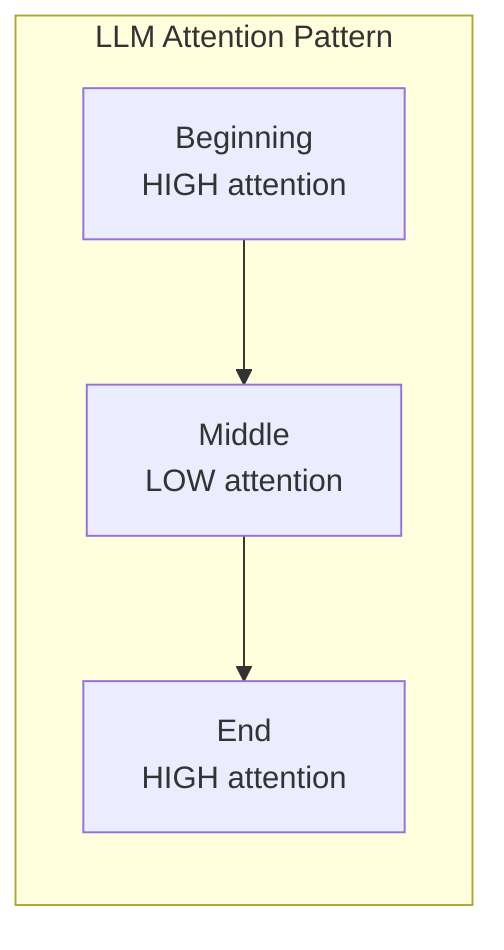
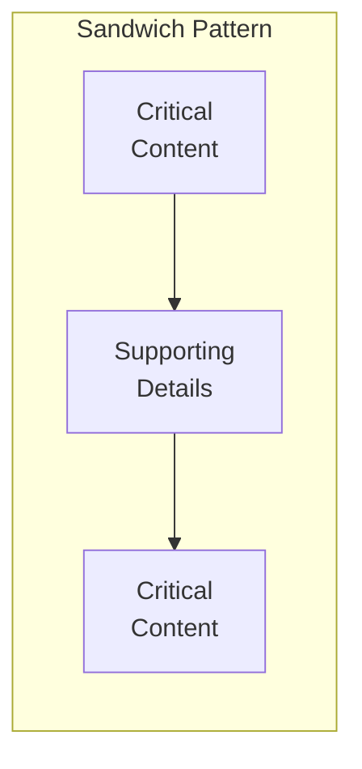

# Content Ordering

## Introduction

Where you place retrieved content in the context matters significantly. Research shows LLMs pay more attention to content at the beginning and end of long contexts, often missing information in the middle. Strategic ordering maximizes the impact of your retrieved content.

This lesson covers ordering strategies and techniques to avoid the "lost in the middle" problem.

### What We'll Cover

- Relevance-based ordering
- Chronological ordering
- Source grouping
- Strategic positioning for attention
- The "lost in the middle" phenomenon

### Prerequisites

- Understanding of chunk selection
- Basic prompt structure knowledge
- Familiarity with context windows

---

## The "Lost in the Middle" Problem

Research demonstrates that LLMs struggle with information placed in the middle of long contexts:



| Position | Attention Level | Use For |
|----------|-----------------|---------|
| **Beginning** | High | Most critical information |
| **Middle** | Low | Supporting details |
| **End** | High | Important context, recency |

> **Warning:** Placing your most relevant content in the middle of a long context can lead to the LLM ignoring or forgetting it.

---

## Ordering Strategies

### Relevance Order (Default)

Place highest-scoring chunks first:

```python
def order_by_relevance(chunks: list[dict]) -> list[dict]:
    """
    Order chunks by relevance score, highest first.
    
    Best for: Most use cases, factual Q&A
    """
    return sorted(chunks, key=lambda x: x["score"], reverse=True)
```

**When to use:**
- General Q&A
- Factual lookups
- When most relevant content should be seen first

### Chronological Order

Order by time for temporal queries:

```python
from datetime import datetime

def order_chronologically(
    chunks: list[dict],
    ascending: bool = True
) -> list[dict]:
    """
    Order chunks by date/time.
    
    Args:
        ascending: True for oldest first, False for newest first
    
    Best for: News, conversations, event timelines
    """
    def get_date(chunk: dict) -> datetime:
        date_str = chunk.get("metadata", {}).get("date")
        if date_str:
            return datetime.fromisoformat(date_str)
        return datetime.min if ascending else datetime.max
    
    return sorted(chunks, key=get_date, reverse=not ascending)

# Example: News about a developing story
chunks = [
    {"text": "Company announces merger", "metadata": {"date": "2024-01-15"}},
    {"text": "Merger completed successfully", "metadata": {"date": "2024-03-20"}},
    {"text": "Initial merger discussions begin", "metadata": {"date": "2024-01-01"}},
]

ordered = order_chronologically(chunks)
# Returns in order: Jan 1 → Jan 15 → Mar 20
```

**When to use:**
- News and current events
- Conversation history
- Process/timeline questions
- Legal/historical research

### Source Grouping

Group chunks by their source document:

```python
from collections import defaultdict

def order_by_source(
    chunks: list[dict],
    source_priority: list[str] = None
) -> list[dict]:
    """
    Group chunks by source, maintaining relevance within groups.
    
    Args:
        source_priority: Ordered list of source names (highest priority first)
    
    Best for: Multi-document Q&A, citing sources
    """
    # Group by source
    by_source = defaultdict(list)
    for chunk in chunks:
        source = chunk.get("source", "Unknown")
        by_source[source].append(chunk)
    
    # Sort within each group by relevance
    for source in by_source:
        by_source[source].sort(key=lambda x: x["score"], reverse=True)
    
    # Order sources
    if source_priority:
        sources = source_priority + [s for s in by_source if s not in source_priority]
    else:
        # Order by average score of chunks in each source
        sources = sorted(
            by_source.keys(),
            key=lambda s: sum(c["score"] for c in by_source[s]) / len(by_source[s]),
            reverse=True
        )
    
    # Flatten
    ordered = []
    for source in sources:
        if source in by_source:
            ordered.extend(by_source[source])
    
    return ordered
```

**When to use:**
- Comparing multiple documents
- Research synthesis
- When source attribution matters
- Multi-document summarization

---

## Strategic Positioning

Combat the "lost in the middle" problem with strategic placement:

### Sandwich Pattern

Place critical content at start AND end:

```python
def sandwich_order(
    chunks: list[dict],
    critical_ratio: float = 0.3
) -> list[dict]:
    """
    Place most relevant chunks at beginning and end.
    
    Args:
        critical_ratio: Fraction of chunks considered critical
    
    Pattern: [Critical] [Supporting] [Critical]
    """
    sorted_chunks = sorted(chunks, key=lambda x: x["score"], reverse=True)
    
    n = len(sorted_chunks)
    critical_count = max(2, int(n * critical_ratio))
    
    # Split into critical and supporting
    critical = sorted_chunks[:critical_count]
    supporting = sorted_chunks[critical_count:]
    
    # Distribute critical to start and end
    start_critical = critical[:len(critical)//2]
    end_critical = critical[len(critical)//2:]
    
    return start_critical + supporting + end_critical

# Visualization
# Input:  [1, 2, 3, 4, 5, 6, 7, 8, 9, 10] (by score)
# Output: [1, 2, 3] + [4, 5, 6, 7] + [8, 9, 10]
#         ^critical   ^supporting   ^critical
```



### Interleaved Priority

Alternate between high and lower priority content:

```python
def interleaved_order(
    chunks: list[dict],
    high_priority_ratio: float = 0.5
) -> list[dict]:
    """
    Interleave high and lower priority chunks.
    
    Ensures high-priority content is distributed throughout.
    """
    sorted_chunks = sorted(chunks, key=lambda x: x["score"], reverse=True)
    
    split_point = int(len(sorted_chunks) * high_priority_ratio)
    high_priority = sorted_chunks[:split_point]
    lower_priority = sorted_chunks[split_point:]
    
    result = []
    h_idx, l_idx = 0, 0
    
    while h_idx < len(high_priority) or l_idx < len(lower_priority):
        # Add high priority
        if h_idx < len(high_priority):
            result.append(high_priority[h_idx])
            h_idx += 1
        
        # Add lower priority
        if l_idx < len(lower_priority):
            result.append(lower_priority[l_idx])
            l_idx += 1
    
    return result
```

### Recency Bias

Place most recent information at the end (closest to query):

```python
def recency_biased_order(
    chunks: list[dict],
    recency_weight: float = 0.3
) -> list[dict]:
    """
    Balance relevance with recency, placing recent content near end.
    
    Args:
        recency_weight: How much to weight recency (0-1)
    """
    from datetime import datetime
    
    # Calculate combined scores
    now = datetime.now()
    max_age_days = 365  # Normalize to 1 year
    
    for chunk in chunks:
        relevance = chunk["score"]
        
        date_str = chunk.get("metadata", {}).get("date")
        if date_str:
            chunk_date = datetime.fromisoformat(date_str)
            age_days = (now - chunk_date).days
            recency_score = max(0, 1 - (age_days / max_age_days))
        else:
            recency_score = 0.5  # Default for unknown dates
        
        chunk["combined_score"] = (
            (1 - recency_weight) * relevance +
            recency_weight * recency_score
        )
    
    return sorted(chunks, key=lambda x: x["combined_score"], reverse=True)
```

---

## Context Position Optimization

### Position-Aware Formatting

Add explicit position markers:

```python
def format_with_position_markers(
    chunks: list[dict]
) -> str:
    """
    Add position markers to help LLM track content location.
    """
    parts = []
    total = len(chunks)
    
    for i, chunk in enumerate(chunks):
        position = i + 1
        source = chunk.get("source", "Unknown")
        
        # Position indicator
        if position == 1:
            marker = "📌 MOST RELEVANT"
        elif position <= 3:
            marker = f"🔹 #{position}"
        elif position == total:
            marker = "📎 ADDITIONAL CONTEXT"
        else:
            marker = f"#{position}"
        
        formatted = f"""[{marker} | Source: {source}]
{chunk['text']}"""
        
        parts.append(formatted)
    
    return "\n\n---\n\n".join(parts)
```

### Query-Position Relationship

Place most relevant content close to where the query appears:

```python
def build_context_with_query_proximity(
    chunks: list[dict],
    query: str,
    query_position: str = "end"  # "start", "middle", "end"
) -> str:
    """
    Arrange content based on where query will appear.
    
    If query is at end (common), place best content just before it.
    """
    sorted_chunks = sorted(chunks, key=lambda x: x["score"], reverse=True)
    
    if query_position == "end":
        # Best content at the end, just before query
        context = "\n\n".join(c["text"] for c in sorted_chunks)
    
    elif query_position == "start":
        # Best content at the start, after query
        context = "\n\n".join(c["text"] for c in sorted_chunks)
    
    else:  # middle - use sandwich
        ordered = sandwich_order(sorted_chunks)
        context = "\n\n".join(c["text"] for c in ordered)
    
    return context
```

---

## Combined Ordering Strategy

```python
from enum import Enum

class OrderingStrategy(Enum):
    RELEVANCE = "relevance"
    CHRONOLOGICAL = "chronological"
    CHRONOLOGICAL_DESC = "chronological_desc"
    SOURCE_GROUPED = "source_grouped"
    SANDWICH = "sandwich"
    INTERLEAVED = "interleaved"

class ContentOrderer:
    """
    Flexible content ordering with multiple strategies.
    """
    
    def order(
        self,
        chunks: list[dict],
        strategy: OrderingStrategy = OrderingStrategy.RELEVANCE,
        **kwargs
    ) -> list[dict]:
        """
        Order chunks using specified strategy.
        """
        if strategy == OrderingStrategy.RELEVANCE:
            return self._relevance(chunks)
        
        elif strategy == OrderingStrategy.CHRONOLOGICAL:
            return self._chronological(chunks, ascending=True)
        
        elif strategy == OrderingStrategy.CHRONOLOGICAL_DESC:
            return self._chronological(chunks, ascending=False)
        
        elif strategy == OrderingStrategy.SOURCE_GROUPED:
            return self._source_grouped(chunks, kwargs.get("source_priority"))
        
        elif strategy == OrderingStrategy.SANDWICH:
            return self._sandwich(chunks, kwargs.get("critical_ratio", 0.3))
        
        elif strategy == OrderingStrategy.INTERLEAVED:
            return self._interleaved(chunks)
        
        return chunks
    
    def _relevance(self, chunks: list[dict]) -> list[dict]:
        return sorted(chunks, key=lambda x: x["score"], reverse=True)
    
    def _chronological(self, chunks: list[dict], ascending: bool) -> list[dict]:
        from datetime import datetime
        
        def get_date(c):
            d = c.get("metadata", {}).get("date")
            return datetime.fromisoformat(d) if d else datetime.min
        
        return sorted(chunks, key=get_date, reverse=not ascending)
    
    def _source_grouped(
        self,
        chunks: list[dict],
        priority: list[str] = None
    ) -> list[dict]:
        from collections import defaultdict
        
        by_source = defaultdict(list)
        for c in chunks:
            by_source[c.get("source", "Unknown")].append(c)
        
        for source in by_source:
            by_source[source].sort(key=lambda x: x["score"], reverse=True)
        
        if priority:
            sources = priority + [s for s in by_source if s not in priority]
        else:
            sources = sorted(
                by_source.keys(),
                key=lambda s: max(c["score"] for c in by_source[s]),
                reverse=True
            )
        
        result = []
        for s in sources:
            if s in by_source:
                result.extend(by_source[s])
        return result
    
    def _sandwich(self, chunks: list[dict], ratio: float) -> list[dict]:
        sorted_chunks = sorted(chunks, key=lambda x: x["score"], reverse=True)
        n = len(sorted_chunks)
        critical_n = max(2, int(n * ratio))
        
        critical = sorted_chunks[:critical_n]
        supporting = sorted_chunks[critical_n:]
        
        mid = len(critical) // 2
        return critical[:mid] + supporting + critical[mid:]
    
    def _interleaved(self, chunks: list[dict]) -> list[dict]:
        sorted_chunks = sorted(chunks, key=lambda x: x["score"], reverse=True)
        mid = len(sorted_chunks) // 2
        
        high = sorted_chunks[:mid]
        low = sorted_chunks[mid:]
        
        result = []
        for h, l in zip(high, low):
            result.extend([h, l])
        
        # Handle odd lengths
        if len(high) > len(low):
            result.append(high[-1])
        elif len(low) > len(high):
            result.append(low[-1])
        
        return result

# Usage
orderer = ContentOrderer()

# Different queries need different orderings
factual_ordered = orderer.order(chunks, OrderingStrategy.RELEVANCE)
timeline_ordered = orderer.order(chunks, OrderingStrategy.CHRONOLOGICAL)
research_ordered = orderer.order(chunks, OrderingStrategy.SOURCE_GROUPED)
long_context_ordered = orderer.order(chunks, OrderingStrategy.SANDWICH)
```

---

## Hands-on Exercise

### Your Task

Implement a `SmartOrderer` that:
1. Analyzes the query to determine best ordering strategy
2. Applies the appropriate strategy
3. Formats the output with position markers

### Requirements

```python
class SmartOrderer:
    def order_for_query(
        self,
        chunks: list[dict],
        query: str
    ) -> dict:
        """
        Returns:
        {
            "strategy_used": str,
            "ordered_chunks": list,
            "formatted_context": str
        }
        """
        pass
```

<details>
<summary>💡 Hints</summary>

- Look for temporal keywords ("recent", "latest", "history")
- Look for comparison keywords ("compare", "difference")
- Use sandwich for long chunk lists
- Add source markers to formatted output

</details>

<details>
<summary>✅ Solution</summary>

```python
class SmartOrderer:
    def order_for_query(
        self,
        chunks: list[dict],
        query: str
    ) -> dict:
        # Determine strategy
        strategy = self._analyze_query(query, len(chunks))
        
        # Apply ordering
        ordered = self._apply_strategy(chunks, strategy)
        
        # Format with markers
        formatted = self._format(ordered)
        
        return {
            "strategy_used": strategy,
            "ordered_chunks": ordered,
            "formatted_context": formatted
        }
    
    def _analyze_query(self, query: str, chunk_count: int) -> str:
        q = query.lower()
        
        # Temporal queries
        if any(w in q for w in ["recent", "latest", "newest", "update"]):
            return "chronological_desc"
        if any(w in q for w in ["history", "timeline", "evolution", "over time"]):
            return "chronological"
        
        # Comparison queries
        if any(w in q for w in ["compare", "difference", "versus", "vs"]):
            return "source_grouped"
        
        # Long context - use sandwich
        if chunk_count > 8:
            return "sandwich"
        
        # Default
        return "relevance"
    
    def _apply_strategy(self, chunks: list[dict], strategy: str) -> list[dict]:
        from datetime import datetime
        
        if strategy == "relevance":
            return sorted(chunks, key=lambda x: x["score"], reverse=True)
        
        elif strategy == "chronological":
            return sorted(
                chunks,
                key=lambda x: x.get("metadata", {}).get("date", ""),
            )
        
        elif strategy == "chronological_desc":
            return sorted(
                chunks,
                key=lambda x: x.get("metadata", {}).get("date", ""),
                reverse=True
            )
        
        elif strategy == "source_grouped":
            from collections import defaultdict
            by_source = defaultdict(list)
            for c in chunks:
                by_source[c.get("source", "Unknown")].append(c)
            
            result = []
            for source in sorted(by_source.keys()):
                group = sorted(by_source[source], key=lambda x: x["score"], reverse=True)
                result.extend(group)
            return result
        
        elif strategy == "sandwich":
            sorted_chunks = sorted(chunks, key=lambda x: x["score"], reverse=True)
            n = len(sorted_chunks)
            critical_n = max(2, n // 3)
            
            critical = sorted_chunks[:critical_n]
            supporting = sorted_chunks[critical_n:]
            
            mid = len(critical) // 2
            return critical[:mid] + supporting + critical[mid:]
        
        return chunks
    
    def _format(self, chunks: list[dict]) -> str:
        parts = []
        
        for i, chunk in enumerate(chunks):
            position = i + 1
            source = chunk.get("source", "Unknown")
            
            if position == 1:
                marker = "📌 PRIMARY"
            elif position == len(chunks):
                marker = "📎 FINAL"
            else:
                marker = f"#{position}"
            
            part = f"[{marker} | {source}]\n{chunk['text']}"
            parts.append(part)
        
        return "\n\n---\n\n".join(parts)

# Test
chunks = [
    {"text": "Latest update on the project", "score": 0.85, "source": "Report A", "metadata": {"date": "2024-03-01"}},
    {"text": "Initial project proposal", "score": 0.90, "source": "Report A", "metadata": {"date": "2024-01-01"}},
    {"text": "Mid-project review", "score": 0.80, "source": "Report B", "metadata": {"date": "2024-02-15"}},
]

orderer = SmartOrderer()

# Test with timeline query
result = orderer.order_for_query(chunks, "What's the history of the project?")
print(f"Strategy: {result['strategy_used']}")
print(result['formatted_context'])
```

</details>

---

## Summary

Content ordering significantly impacts LLM comprehension:

✅ **Relevance order** — Default for most queries
✅ **Chronological** — For temporal/historical queries
✅ **Source grouping** — For comparisons and citations
✅ **Sandwich pattern** — Critical content at start AND end
✅ **Position markers** — Help LLM track content location

**Next:** [Context Window Management](./03-context-window-management.md)

---

## Further Reading

- [Lost in the Middle Paper](https://arxiv.org/abs/2307.03172) - Research on position effects
- [OpenAI Prompt Engineering](https://platform.openai.com/docs/guides/prompt-engineering) - Context structuring

<!--
Sources Consulted:
- Liu et al. (2023) "Lost in the Middle" paper
- OpenAI prompt engineering documentation
- Anthropic context windows documentation
-->
