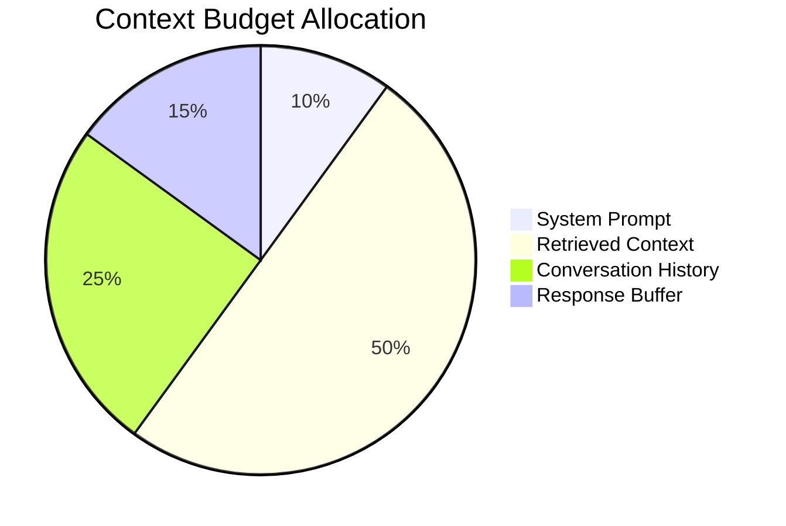

# Context Window Management

## Introduction

Every LLM has a maximum context window—the total tokens it can process in a single request. Effective context management ensures you maximize information density while staying within limits and controlling costs.

This lesson covers token counting, budget allocation, and dynamic context sizing strategies.

### What We'll Cover

- Token counting with tiktoken
- Context window budget allocation
- Truncation strategies
- Priority-based inclusion
- Dynamic sizing based on query complexity

### Prerequisites

- Understanding of tokens vs characters
- Basic prompt structure knowledge
- Familiarity with chunk selection

---

## Understanding Token Limits

Different models have different context windows:

| Model | Context Window | Notes |
|-------|---------------|-------|
| GPT-4o | 128K tokens | Best for long context |
| GPT-4 Turbo | 128K tokens | cl100k_base encoding |
| GPT-3.5 Turbo | 16K tokens | Cost-effective |
| Claude 3.5 Sonnet | 200K tokens | Standard tier |
| Claude (Tier 4) | 1M tokens | Extended beta |

> **🤖 AI Context:** Token limits include BOTH input and output. Reserve space for the model's response.

---

## Token Counting with Tiktoken

```python
import tiktoken

def count_tokens(text: str, model: str = "gpt-4o") -> int:
    """
    Count tokens for a given text and model.
    
    Uses the appropriate encoding for the model.
    """
    try:
        encoding = tiktoken.encoding_for_model(model)
    except KeyError:
        # Fallback for unknown models
        encoding = tiktoken.get_encoding("cl100k_base")
    
    return len(encoding.encode(text))

# Example
text = "Hello, world! This is a test message."
tokens = count_tokens(text)
print(f"Text: {len(text)} chars, {tokens} tokens")
```

**Output:**
```
Text: 38 chars, 9 tokens
```

### Encoding Types

| Encoding | Models | Notes |
|----------|--------|-------|
| `o200k_base` | GPT-4o, GPT-4o-mini | Newest, most efficient |
| `cl100k_base` | GPT-4, GPT-3.5-turbo | Widely used |
| `p50k_base` | Codex, text-davinci | Legacy |

```python
import tiktoken

def get_encoding_for_model(model: str) -> tiktoken.Encoding:
    """
    Get the appropriate encoding for a model.
    """
    try:
        return tiktoken.encoding_for_model(model)
    except KeyError:
        # Model mappings for common cases
        if "gpt-4o" in model:
            return tiktoken.get_encoding("o200k_base")
        elif "gpt-4" in model or "gpt-3.5" in model:
            return tiktoken.get_encoding("cl100k_base")
        else:
            return tiktoken.get_encoding("cl100k_base")
```

### Counting Message Tokens

Messages have overhead beyond just content:

```python
import tiktoken

def count_message_tokens(
    messages: list[dict],
    model: str = "gpt-4o"
) -> int:
    """
    Count tokens for a list of chat messages.
    
    Accounts for message formatting overhead.
    """
    encoding = tiktoken.encoding_for_model(model)
    
    # Overhead varies by model
    if "gpt-4o" in model:
        tokens_per_message = 3  # <|start|>role<|sep|>content<|end|>
        tokens_per_name = 1
    else:
        tokens_per_message = 3
        tokens_per_name = 1
    
    total = 0
    for message in messages:
        total += tokens_per_message
        
        for key, value in message.items():
            total += len(encoding.encode(str(value)))
            if key == "name":
                total += tokens_per_name
    
    # Account for assistant reply priming
    total += 3
    
    return total

# Example
messages = [
    {"role": "system", "content": "You are a helpful assistant."},
    {"role": "user", "content": "What is the capital of France?"}
]

tokens = count_message_tokens(messages)
print(f"Messages: {tokens} tokens")
```

**Output:**
```
Messages: 27 tokens
```

---

## Context Budget Allocation

Allocate your context window strategically:



```python
from dataclasses import dataclass, field

@dataclass
class ContextBudget:
    """
    Manages token allocation across context components.
    """
    total_context_window: int
    
    # Allocation percentages
    system_prompt_pct: float = 0.10
    retrieved_context_pct: float = 0.50
    conversation_history_pct: float = 0.25
    response_buffer_pct: float = 0.15
    
    def get_allocations(self) -> dict:
        """Calculate token allocations."""
        return {
            "system_prompt": int(self.total_context_window * self.system_prompt_pct),
            "retrieved_context": int(self.total_context_window * self.retrieved_context_pct),
            "conversation_history": int(self.total_context_window * self.conversation_history_pct),
            "response_buffer": int(self.total_context_window * self.response_buffer_pct),
        }

# Example for GPT-4o
budget = ContextBudget(total_context_window=128000)
allocations = budget.get_allocations()

for component, tokens in allocations.items():
    print(f"{component}: {tokens:,} tokens")
```

**Output:**
```
system_prompt: 12,800 tokens
retrieved_context: 64,000 tokens
conversation_history: 32,000 tokens
response_buffer: 19,200 tokens
```

### Dynamic Budget Allocation

Adjust allocation based on query complexity:

```python
import tiktoken

@dataclass
class DynamicContextBudget:
    """
    Dynamically allocate context budget based on usage.
    """
    model: str
    max_context: int
    min_response_buffer: int = 1024
    
    def __post_init__(self):
        self.encoding = tiktoken.encoding_for_model(self.model)
    
    def allocate(
        self,
        system_prompt: str,
        conversation_history: list[dict],
        query: str,
        target_response_tokens: int = 2048
    ) -> dict:
        """
        Calculate available tokens for retrieved context.
        """
        # Count fixed costs
        system_tokens = len(self.encoding.encode(system_prompt))
        query_tokens = len(self.encoding.encode(query))
        
        history_tokens = 0
        for msg in conversation_history:
            history_tokens += len(self.encoding.encode(msg.get("content", "")))
            history_tokens += 3  # Message overhead
        
        # Calculate available for retrieval
        used = system_tokens + history_tokens + query_tokens
        response_buffer = max(self.min_response_buffer, target_response_tokens)
        available = self.max_context - used - response_buffer
        
        return {
            "system_tokens": system_tokens,
            "history_tokens": history_tokens,
            "query_tokens": query_tokens,
            "response_buffer": response_buffer,
            "available_for_context": max(0, available),
            "total_used": used,
            "utilization_pct": (used / self.max_context) * 100
        }

# Example
budget = DynamicContextBudget(model="gpt-4o", max_context=128000)

allocation = budget.allocate(
    system_prompt="You are a helpful assistant.",
    conversation_history=[
        {"role": "user", "content": "Tell me about Python."},
        {"role": "assistant", "content": "Python is a programming language..."}
    ],
    query="What are Python decorators?",
    target_response_tokens=2048
)

print(f"Available for context: {allocation['available_for_context']:,} tokens")
print(f"Current utilization: {allocation['utilization_pct']:.1f}%")
```

---

## Truncation Strategies

When content exceeds budget, truncate intelligently:

### End Truncation (Simple)

```python
import tiktoken

def truncate_to_tokens(
    text: str,
    max_tokens: int,
    model: str = "gpt-4o"
) -> str:
    """
    Truncate text to fit within token limit.
    
    Simple end truncation - may cut mid-sentence.
    """
    encoding = tiktoken.encoding_for_model(model)
    tokens = encoding.encode(text)
    
    if len(tokens) <= max_tokens:
        return text
    
    truncated_tokens = tokens[:max_tokens]
    return encoding.decode(truncated_tokens)
```

### Sentence-Aware Truncation

```python
import tiktoken
import re

def truncate_by_sentence(
    text: str,
    max_tokens: int,
    model: str = "gpt-4o"
) -> str:
    """
    Truncate at sentence boundaries.
    
    Preserves complete sentences up to token limit.
    """
    encoding = tiktoken.encoding_for_model(model)
    
    # Split into sentences
    sentences = re.split(r'(?<=[.!?])\s+', text)
    
    result = []
    current_tokens = 0
    
    for sentence in sentences:
        sentence_tokens = len(encoding.encode(sentence))
        
        if current_tokens + sentence_tokens > max_tokens:
            break
        
        result.append(sentence)
        current_tokens += sentence_tokens
    
    return " ".join(result)

# Example
text = "This is sentence one. This is sentence two. This is sentence three. This is sentence four."
truncated = truncate_by_sentence(text, 15)
print(truncated)
```

### Chunk-Level Truncation

For RAG, truncate at chunk boundaries:

```python
import tiktoken

def truncate_chunks(
    chunks: list[dict],
    max_tokens: int,
    model: str = "gpt-4o"
) -> list[dict]:
    """
    Include as many complete chunks as possible within token limit.
    
    Assumes chunks are already ordered by priority.
    """
    encoding = tiktoken.encoding_for_model(model)
    
    selected = []
    current_tokens = 0
    
    for chunk in chunks:
        chunk_tokens = len(encoding.encode(chunk["text"]))
        
        if current_tokens + chunk_tokens > max_tokens:
            # Check if we can fit a truncated version
            remaining = max_tokens - current_tokens
            if remaining > 100:  # Minimum useful size
                truncated_text = truncate_by_sentence(
                    chunk["text"],
                    remaining,
                    model
                )
                if truncated_text:
                    truncated_chunk = {**chunk, "text": truncated_text, "truncated": True}
                    selected.append(truncated_chunk)
            break
        
        selected.append(chunk)
        current_tokens += chunk_tokens
    
    return selected
```

---

## Priority-Based Inclusion

Include content based on importance:

```python
from dataclasses import dataclass
from enum import IntEnum
import tiktoken

class Priority(IntEnum):
    CRITICAL = 1    # Always include
    HIGH = 2        # Include if space
    MEDIUM = 3      # Include if plenty of space
    LOW = 4         # Include only if room left

@dataclass
class PrioritizedContent:
    text: str
    priority: Priority
    source: str = ""
    
    def token_count(self, encoding) -> int:
        return len(encoding.encode(self.text))

def build_prioritized_context(
    contents: list[PrioritizedContent],
    max_tokens: int,
    model: str = "gpt-4o"
) -> list[PrioritizedContent]:
    """
    Build context by priority, fitting as much as possible.
    """
    encoding = tiktoken.encoding_for_model(model)
    
    # Sort by priority
    sorted_contents = sorted(contents, key=lambda x: x.priority)
    
    selected = []
    remaining_tokens = max_tokens
    
    for content in sorted_contents:
        tokens = content.token_count(encoding)
        
        if content.priority == Priority.CRITICAL:
            # Always include critical, even if over budget
            selected.append(content)
            remaining_tokens -= tokens
        elif tokens <= remaining_tokens:
            selected.append(content)
            remaining_tokens -= tokens
    
    return selected

# Example
contents = [
    PrioritizedContent("System instructions...", Priority.CRITICAL),
    PrioritizedContent("Main relevant chunk...", Priority.HIGH),
    PrioritizedContent("Supporting detail...", Priority.MEDIUM),
    PrioritizedContent("Additional context...", Priority.LOW),
]

selected = build_prioritized_context(contents, max_tokens=1000)
```

---

## Dynamic Context Sizing

Adjust context based on query complexity:

```python
import tiktoken

class DynamicContextManager:
    """
    Dynamically size context based on query analysis.
    """
    
    def __init__(self, model: str = "gpt-4o", max_context: int = 128000):
        self.model = model
        self.max_context = max_context
        self.encoding = tiktoken.encoding_for_model(model)
    
    def analyze_query(self, query: str) -> dict:
        """
        Analyze query to determine context needs.
        """
        query_lower = query.lower()
        
        # Complexity indicators
        is_simple = len(query.split()) < 10
        needs_detail = any(w in query_lower for w in [
            "explain", "detail", "comprehensive", "thorough"
        ])
        needs_comparison = any(w in query_lower for w in [
            "compare", "difference", "versus", "vs"
        ])
        needs_examples = any(w in query_lower for w in [
            "example", "show", "demonstrate", "how to"
        ])
        
        return {
            "is_simple": is_simple,
            "needs_detail": needs_detail,
            "needs_comparison": needs_comparison,
            "needs_examples": needs_examples
        }
    
    def get_optimal_context_size(
        self,
        query: str,
        available_chunks: int
    ) -> dict:
        """
        Determine optimal context size for query.
        """
        analysis = self.analyze_query(query)
        
        # Base allocation
        base_pct = 0.50
        
        # Adjustments
        if analysis["is_simple"]:
            base_pct = 0.30  # Less context needed
        
        if analysis["needs_detail"]:
            base_pct = min(0.70, base_pct + 0.15)
        
        if analysis["needs_comparison"]:
            base_pct = min(0.65, base_pct + 0.10)
        
        if analysis["needs_examples"]:
            base_pct = min(0.60, base_pct + 0.05)
        
        # Calculate tokens
        context_tokens = int(self.max_context * base_pct)
        
        # Calculate chunk limit (estimate 500 tokens per chunk)
        avg_chunk_tokens = 500
        max_chunks = min(
            available_chunks,
            context_tokens // avg_chunk_tokens
        )
        
        return {
            "context_allocation_pct": base_pct,
            "context_tokens": context_tokens,
            "recommended_chunks": max_chunks,
            "analysis": analysis
        }
    
    def build_context(
        self,
        query: str,
        chunks: list[dict],
        system_prompt: str
    ) -> dict:
        """
        Build optimally-sized context for the query.
        """
        sizing = self.get_optimal_context_size(query, len(chunks))
        
        # Count system prompt tokens
        system_tokens = len(self.encoding.encode(system_prompt))
        query_tokens = len(self.encoding.encode(query))
        
        # Available for context
        response_buffer = 2048
        available = (
            sizing["context_tokens"] - 
            system_tokens - 
            query_tokens - 
            response_buffer
        )
        
        # Select chunks
        selected_chunks = []
        current_tokens = 0
        
        for chunk in chunks[:sizing["recommended_chunks"]]:
            chunk_tokens = len(self.encoding.encode(chunk["text"]))
            if current_tokens + chunk_tokens <= available:
                selected_chunks.append(chunk)
                current_tokens += chunk_tokens
        
        # Build context string
        context = "\n\n".join(c["text"] for c in selected_chunks)
        
        return {
            "context": context,
            "chunks_used": len(selected_chunks),
            "tokens_used": current_tokens,
            "tokens_available": available,
            "utilization_pct": (current_tokens / available) * 100 if available > 0 else 0
        }

# Usage
manager = DynamicContextManager(model="gpt-4o")

# Simple query - less context needed
simple_result = manager.get_optimal_context_size(
    "What is Python?",
    available_chunks=20
)
print(f"Simple query: {simple_result['context_allocation_pct']*100:.0f}% allocation")

# Complex query - more context needed
complex_result = manager.get_optimal_context_size(
    "Explain in detail the differences between Python and JavaScript with examples",
    available_chunks=20
)
print(f"Complex query: {complex_result['context_allocation_pct']*100:.0f}% allocation")
```

**Output:**
```
Simple query: 30% allocation
Complex query: 70% allocation
```

---

## Complete Context Manager

```python
import tiktoken
from dataclasses import dataclass
from typing import Optional

@dataclass
class ContextConfig:
    model: str = "gpt-4o"
    max_context: int = 128000
    min_response_buffer: int = 1024
    max_response_buffer: int = 4096
    system_prompt_limit: int = 2000
    min_chunk_tokens: int = 50

class ContextWindowManager:
    """
    Complete context window management for RAG.
    """
    
    def __init__(self, config: ContextConfig = None):
        self.config = config or ContextConfig()
        self.encoding = tiktoken.encoding_for_model(self.config.model)
    
    def count_tokens(self, text: str) -> int:
        return len(self.encoding.encode(text))
    
    def build_context(
        self,
        system_prompt: str,
        query: str,
        chunks: list[dict],
        conversation_history: list[dict] = None,
        target_response_tokens: int = 2048
    ) -> dict:
        """
        Build complete context with all components.
        """
        # Count fixed components
        system_tokens = min(
            self.count_tokens(system_prompt),
            self.config.system_prompt_limit
        )
        query_tokens = self.count_tokens(query)
        
        history_tokens = 0
        if conversation_history:
            for msg in conversation_history:
                history_tokens += self.count_tokens(msg.get("content", ""))
                history_tokens += 4  # Message overhead
        
        # Response buffer
        response_buffer = min(
            max(self.config.min_response_buffer, target_response_tokens),
            self.config.max_response_buffer
        )
        
        # Calculate available for context
        fixed_cost = system_tokens + query_tokens + history_tokens + response_buffer
        available = self.config.max_context - fixed_cost
        
        # Select chunks
        selected = self._select_chunks(chunks, available)
        
        # Build final context
        context_text = self._format_chunks(selected["chunks"])
        
        return {
            "context": context_text,
            "chunks_included": len(selected["chunks"]),
            "chunks_dropped": len(chunks) - len(selected["chunks"]),
            "tokens": {
                "system": system_tokens,
                "query": query_tokens,
                "history": history_tokens,
                "context": selected["tokens_used"],
                "response_buffer": response_buffer,
                "total": fixed_cost + selected["tokens_used"],
            },
            "utilization_pct": (
                (fixed_cost + selected["tokens_used"]) / 
                self.config.max_context * 100
            )
        }
    
    def _select_chunks(
        self,
        chunks: list[dict],
        max_tokens: int
    ) -> dict:
        """Select chunks within token budget."""
        selected = []
        tokens_used = 0
        
        for chunk in chunks:
            chunk_tokens = self.count_tokens(chunk["text"])
            
            if chunk_tokens < self.config.min_chunk_tokens:
                continue  # Skip tiny chunks
            
            if tokens_used + chunk_tokens <= max_tokens:
                selected.append(chunk)
                tokens_used += chunk_tokens
        
        return {"chunks": selected, "tokens_used": tokens_used}
    
    def _format_chunks(self, chunks: list[dict]) -> str:
        """Format chunks into context string."""
        parts = []
        for i, chunk in enumerate(chunks):
            source = chunk.get("source", "Document")
            text = chunk["text"]
            parts.append(f"[Source: {source}]\n{text}")
        
        return "\n\n---\n\n".join(parts)

# Usage
manager = ContextWindowManager()

result = manager.build_context(
    system_prompt="You are a helpful assistant that answers questions based on the provided context.",
    query="What are the key features of Python?",
    chunks=[
        {"text": "Python is a high-level programming language...", "source": "Doc 1"},
        {"text": "Python supports multiple programming paradigms...", "source": "Doc 1"},
        {"text": "Key features include dynamic typing...", "source": "Doc 2"},
    ],
    conversation_history=[],
    target_response_tokens=2048
)

print(f"Chunks included: {result['chunks_included']}")
print(f"Context utilization: {result['utilization_pct']:.1f}%")
```

---

## Hands-on Exercise

### Your Task

Implement a `TokenBudgetOptimizer` that:
1. Takes chunks and a strict token limit
2. Maximizes information while staying under budget
3. Reports what was included vs dropped

### Requirements

```python
class TokenBudgetOptimizer:
    def optimize(
        self,
        chunks: list[dict],
        max_tokens: int,
        model: str = "gpt-4o"
    ) -> dict:
        """
        Returns:
        {
            "included": list[dict],
            "dropped": list[dict],
            "tokens_used": int,
            "tokens_remaining": int
        }
        """
        pass
```

<details>
<summary>💡 Hints</summary>

- Use tiktoken for accurate counting
- Consider chunk score when deciding what to drop
- Track both included and dropped chunks
- Calculate remaining budget

</details>

<details>
<summary>✅ Solution</summary>

```python
import tiktoken

class TokenBudgetOptimizer:
    def optimize(
        self,
        chunks: list[dict],
        max_tokens: int,
        model: str = "gpt-4o"
    ) -> dict:
        encoding = tiktoken.encoding_for_model(model)
        
        # Sort by score (highest first)
        sorted_chunks = sorted(
            chunks,
            key=lambda x: x.get("score", 0),
            reverse=True
        )
        
        included = []
        dropped = []
        tokens_used = 0
        
        for chunk in sorted_chunks:
            chunk_tokens = len(encoding.encode(chunk["text"]))
            
            if tokens_used + chunk_tokens <= max_tokens:
                chunk_with_tokens = {**chunk, "tokens": chunk_tokens}
                included.append(chunk_with_tokens)
                tokens_used += chunk_tokens
            else:
                dropped.append({
                    **chunk,
                    "tokens": chunk_tokens,
                    "reason": "exceeded_budget"
                })
        
        return {
            "included": included,
            "dropped": dropped,
            "tokens_used": tokens_used,
            "tokens_remaining": max_tokens - tokens_used,
            "inclusion_rate": len(included) / len(chunks) * 100 if chunks else 0
        }

# Test
optimizer = TokenBudgetOptimizer()

chunks = [
    {"text": "Python is a programming language.", "score": 0.95},
    {"text": "It supports multiple paradigms.", "score": 0.85},
    {"text": "Python was created by Guido.", "score": 0.75},
]

result = optimizer.optimize(chunks, max_tokens=50)
print(f"Included: {len(result['included'])} chunks")
print(f"Dropped: {len(result['dropped'])} chunks")
print(f"Tokens used: {result['tokens_used']}/{50}")
```

</details>

---

## Summary

Context window management is critical for RAG performance:

✅ **Token counting** — Use tiktoken for accurate model-specific counts
✅ **Budget allocation** — Plan for system, context, history, and response
✅ **Smart truncation** — Prefer sentence/chunk boundaries over mid-text cuts
✅ **Priority inclusion** — Critical content first, then fill with lower priority
✅ **Dynamic sizing** — Adjust allocation based on query complexity

**Next:** [Deduplication Strategies](./04-deduplication-strategies.md)

---

## Further Reading

- [OpenAI Tiktoken](https://github.com/openai/tiktoken) - Token counting library
- [OpenAI Prompt Caching](https://platform.openai.com/docs/guides/prompt-caching) - Cost optimization
- [Anthropic Context Windows](https://docs.anthropic.com/en/docs/build-with-claude/context-windows) - Large context handling

<!--
Sources Consulted:
- OpenAI tiktoken cookbook documentation
- OpenAI prompt caching guide
- Anthropic context windows documentation
- OpenAI prompt engineering best practices
-->
