# Deduplication Strategies

## Introduction

When retrieving multiple chunks from large document collections, you often get duplicate or highly similar content. Deduplication removes redundancy, maximizes information density, and prevents the LLM from seeing repetitive context.

This lesson covers techniques from exact matching to semantic similarity for efficient deduplication.

### What We'll Cover

- Exact duplicate detection (hash-based)
- Near-duplicate detection (edit distance, shingles)
- Semantic deduplication (embedding similarity)
- Source-aware deduplication
- Choosing the right strategy

### Prerequisites

- Understanding of chunk selection
- Basic hashing concepts
- Familiarity with embeddings

---

## Why Deduplication Matters

| Problem | Impact |
|---------|--------|
| Wasted tokens | Same content repeated consumes budget |
| Confused LLM | Repetition can cause model confusion |
| Poor retrieval | Duplicates push out diverse, useful content |
| Higher costs | More tokens = higher API costs |

> **Warning:** Without deduplication, 20-40% of your context window can be wasted on redundant information.

---

## Exact Duplicate Detection

The simplest and fastest approach—hash the content and compare:

```python
import hashlib
from typing import Callable

def hash_content(text: str) -> str:
    """Generate MD5 hash of normalized text."""
    normalized = text.strip().lower()
    return hashlib.md5(normalized.encode()).hexdigest()

def remove_exact_duplicates(chunks: list[dict]) -> list[dict]:
    """
    Remove chunks with identical content.
    
    Fast O(n) approach using hash set.
    """
    seen_hashes = set()
    unique_chunks = []
    
    for chunk in chunks:
        content_hash = hash_content(chunk["text"])
        
        if content_hash not in seen_hashes:
            seen_hashes.add(content_hash)
            unique_chunks.append(chunk)
    
    return unique_chunks

# Example
chunks = [
    {"text": "Python is great.", "source": "doc1"},
    {"text": "Python is great.", "source": "doc2"},  # Exact duplicate
    {"text": "Python is excellent.", "source": "doc3"},
]

unique = remove_exact_duplicates(chunks)
print(f"Before: {len(chunks)}, After: {len(unique)}")
```

**Output:**
```
Before: 3, After: 2
```

### Customizable Hash Functions

```python
def create_hash_function(
    normalize_whitespace: bool = True,
    case_insensitive: bool = True,
    remove_punctuation: bool = False
) -> Callable[[str], str]:
    """
    Create a customizable hash function.
    """
    import re
    
    def hash_func(text: str) -> str:
        normalized = text
        
        if case_insensitive:
            normalized = normalized.lower()
        
        if normalize_whitespace:
            normalized = " ".join(normalized.split())
        
        if remove_punctuation:
            normalized = re.sub(r'[^\w\s]', '', normalized)
        
        return hashlib.md5(normalized.encode()).hexdigest()
    
    return hash_func

# More aggressive normalization
aggressive_hash = create_hash_function(
    normalize_whitespace=True,
    case_insensitive=True,
    remove_punctuation=True
)

# These now match
text1 = "Python is great!"
text2 = "python is great"
print(aggressive_hash(text1) == aggressive_hash(text2))  # True
```

---

## Near-Duplicate Detection

Catch content that's similar but not identical:

### Edit Distance (Levenshtein)

```python
def levenshtein_distance(s1: str, s2: str) -> int:
    """
    Calculate edit distance between two strings.
    
    Number of insertions, deletions, substitutions needed.
    """
    if len(s1) < len(s2):
        s1, s2 = s2, s1
    
    if len(s2) == 0:
        return len(s1)
    
    prev_row = range(len(s2) + 1)
    
    for i, c1 in enumerate(s1):
        curr_row = [i + 1]
        for j, c2 in enumerate(s2):
            insertions = prev_row[j + 1] + 1
            deletions = curr_row[j] + 1
            substitutions = prev_row[j] + (c1 != c2)
            curr_row.append(min(insertions, deletions, substitutions))
        prev_row = curr_row
    
    return prev_row[-1]

def is_near_duplicate(
    text1: str,
    text2: str,
    threshold: float = 0.9
) -> bool:
    """
    Check if texts are near-duplicates using edit distance.
    
    threshold: Similarity ratio (0.9 = 90% similar)
    """
    max_len = max(len(text1), len(text2))
    if max_len == 0:
        return True
    
    distance = levenshtein_distance(text1.lower(), text2.lower())
    similarity = 1 - (distance / max_len)
    
    return similarity >= threshold

# Example
text1 = "Python is a programming language"
text2 = "Python is a programming languages"  # Minor difference
print(f"Near duplicate: {is_near_duplicate(text1, text2, 0.9)}")  # True
```

### Shingling (N-gram Based)

More efficient for longer texts:

```python
def get_shingles(text: str, n: int = 3) -> set:
    """
    Generate n-gram shingles from text.
    
    n=3 gives character trigrams (good for typos)
    n=5 for word sequences use word shingles
    """
    text = text.lower().strip()
    return set(text[i:i+n] for i in range(len(text) - n + 1))

def jaccard_similarity(set1: set, set2: set) -> float:
    """
    Calculate Jaccard similarity between two sets.
    
    |A ∩ B| / |A ∪ B|
    """
    if not set1 and not set2:
        return 1.0
    
    intersection = len(set1 & set2)
    union = len(set1 | set2)
    
    return intersection / union if union > 0 else 0.0

def shingled_similarity(
    text1: str,
    text2: str,
    shingle_size: int = 3
) -> float:
    """
    Compare texts using shingling.
    """
    shingles1 = get_shingles(text1, shingle_size)
    shingles2 = get_shingles(text2, shingle_size)
    
    return jaccard_similarity(shingles1, shingles2)

# Word-level shingles for better semantic matching
def get_word_shingles(text: str, n: int = 2) -> set:
    """Word n-grams for semantic similarity."""
    words = text.lower().split()
    return set(tuple(words[i:i+n]) for i in range(len(words) - n + 1))

# Example
text1 = "Python is a popular programming language"
text2 = "Python is a popular coding language"

char_sim = shingled_similarity(text1, text2, 3)
word_sim = jaccard_similarity(
    get_word_shingles(text1, 2),
    get_word_shingles(text2, 2)
)

print(f"Character shingle similarity: {char_sim:.2f}")
print(f"Word shingle similarity: {word_sim:.2f}")
```

### MinHash for Scalability

When comparing many documents:

```python
import hashlib
import random

class MinHasher:
    """
    MinHash for efficient near-duplicate detection at scale.
    """
    
    def __init__(self, num_hashes: int = 128):
        self.num_hashes = num_hashes
        # Generate random hash functions
        self.hash_coeffs = [
            (random.randint(1, 2**32), random.randint(0, 2**32))
            for _ in range(num_hashes)
        ]
    
    def _hash_shingle(self, shingle: str, a: int, b: int) -> int:
        """Apply a hash function to a shingle."""
        h = int(hashlib.md5(shingle.encode()).hexdigest(), 16)
        return (a * h + b) % (2**32)
    
    def signature(self, text: str, shingle_size: int = 3) -> list:
        """Generate MinHash signature for text."""
        shingles = get_shingles(text, shingle_size)
        
        signature = []
        for a, b in self.hash_coeffs:
            min_hash = min(
                self._hash_shingle(s, a, b) 
                for s in shingles
            ) if shingles else 0
            signature.append(min_hash)
        
        return signature
    
    def estimate_similarity(self, sig1: list, sig2: list) -> float:
        """Estimate Jaccard similarity from signatures."""
        matches = sum(1 for a, b in zip(sig1, sig2) if a == b)
        return matches / len(sig1)

# Usage
hasher = MinHasher(num_hashes=128)

sig1 = hasher.signature("Python is a programming language")
sig2 = hasher.signature("Python is a programming language used for AI")
sig3 = hasher.signature("JavaScript is used for web development")

print(f"Sim 1-2: {hasher.estimate_similarity(sig1, sig2):.2f}")
print(f"Sim 1-3: {hasher.estimate_similarity(sig1, sig3):.2f}")
```

---

## Semantic Deduplication

Use embeddings to find semantically similar content:

```python
import numpy as np

def cosine_similarity(v1: np.ndarray, v2: np.ndarray) -> float:
    """Calculate cosine similarity between vectors."""
    dot_product = np.dot(v1, v2)
    norm1 = np.linalg.norm(v1)
    norm2 = np.linalg.norm(v2)
    
    if norm1 == 0 or norm2 == 0:
        return 0.0
    
    return dot_product / (norm1 * norm2)

def semantic_deduplicate(
    chunks: list[dict],
    similarity_threshold: float = 0.95
) -> list[dict]:
    """
    Remove semantically similar chunks.
    
    Assumes chunks have 'embedding' field.
    """
    if not chunks:
        return []
    
    unique = [chunks[0]]  # Keep first chunk
    
    for chunk in chunks[1:]:
        is_duplicate = False
        chunk_embedding = np.array(chunk["embedding"])
        
        for unique_chunk in unique:
            unique_embedding = np.array(unique_chunk["embedding"])
            similarity = cosine_similarity(chunk_embedding, unique_embedding)
            
            if similarity >= similarity_threshold:
                is_duplicate = True
                break
        
        if not is_duplicate:
            unique.append(chunk)
    
    return unique
```

### Clustering-Based Deduplication

Group similar chunks and keep representatives:

```python
import numpy as np
from typing import Optional

def cluster_deduplicate(
    chunks: list[dict],
    similarity_threshold: float = 0.90,
    keep_strategy: str = "highest_score"
) -> list[dict]:
    """
    Cluster similar chunks and keep one representative per cluster.
    
    keep_strategy: 'highest_score', 'first', 'longest'
    """
    if not chunks:
        return []
    
    n = len(chunks)
    embeddings = np.array([c["embedding"] for c in chunks])
    
    # Build similarity matrix
    similarities = np.zeros((n, n))
    for i in range(n):
        for j in range(i + 1, n):
            sim = cosine_similarity(embeddings[i], embeddings[j])
            similarities[i, j] = sim
            similarities[j, i] = sim
    
    # Simple clustering: assign to clusters
    cluster_assignments = [-1] * n
    current_cluster = 0
    
    for i in range(n):
        if cluster_assignments[i] == -1:
            cluster_assignments[i] = current_cluster
            
            # Find all similar items
            for j in range(i + 1, n):
                if cluster_assignments[j] == -1:
                    if similarities[i, j] >= similarity_threshold:
                        cluster_assignments[j] = current_cluster
            
            current_cluster += 1
    
    # Select representative from each cluster
    clusters = {}
    for i, cluster_id in enumerate(cluster_assignments):
        if cluster_id not in clusters:
            clusters[cluster_id] = []
        clusters[cluster_id].append(chunks[i])
    
    representatives = []
    for cluster_chunks in clusters.values():
        if keep_strategy == "highest_score":
            rep = max(cluster_chunks, key=lambda c: c.get("score", 0))
        elif keep_strategy == "first":
            rep = cluster_chunks[0]
        elif keep_strategy == "longest":
            rep = max(cluster_chunks, key=lambda c: len(c["text"]))
        else:
            rep = cluster_chunks[0]
        
        representatives.append(rep)
    
    # Sort by original order or score
    return sorted(representatives, key=lambda c: c.get("score", 0), reverse=True)

# Usage
chunks = [
    {"text": "Python is great for AI", "score": 0.95, "embedding": [0.1, 0.2, 0.3]},
    {"text": "Python is excellent for AI", "score": 0.90, "embedding": [0.11, 0.21, 0.31]},  # Similar
    {"text": "JavaScript runs in browsers", "score": 0.85, "embedding": [0.5, 0.6, 0.7]},
]

unique = cluster_deduplicate(chunks, similarity_threshold=0.90)
print(f"Clusters: {len(unique)}")  # 2 clusters
```

---

## Source-Aware Deduplication

Consider document sources when deduplicating:

```python
from collections import defaultdict

def source_aware_deduplicate(
    chunks: list[dict],
    within_source_threshold: float = 0.95,
    cross_source_threshold: float = 0.85,
    prefer_primary_sources: list[str] = None
) -> list[dict]:
    """
    Deduplicate with awareness of content sources.
    
    Uses stricter threshold within same source (expected duplicates)
    and looser threshold across sources (legitimate overlap).
    """
    if not chunks:
        return []
    
    # Group by source
    by_source = defaultdict(list)
    for chunk in chunks:
        source = chunk.get("source", "unknown")
        by_source[source].append(chunk)
    
    # Dedupe within each source
    deduped_by_source = {}
    for source, source_chunks in by_source.items():
        deduped = semantic_deduplicate(
            source_chunks,
            similarity_threshold=within_source_threshold
        )
        deduped_by_source[source] = deduped
    
    # Flatten and dedupe across sources
    all_deduped = []
    
    # Process preferred sources first
    if prefer_primary_sources:
        for source in prefer_primary_sources:
            if source in deduped_by_source:
                all_deduped.extend(deduped_by_source[source])
                del deduped_by_source[source]
    
    # Add remaining sources
    for source_chunks in deduped_by_source.values():
        all_deduped.extend(source_chunks)
    
    # Final cross-source deduplication
    final = semantic_deduplicate(
        all_deduped,
        similarity_threshold=cross_source_threshold
    )
    
    return final

# Example: Prefer official docs over blog posts
chunks = [
    {"text": "Python is...", "source": "official_docs", "score": 0.9, "embedding": [...]},
    {"text": "Python is...", "source": "blog_post", "score": 0.95, "embedding": [...]},
]

unique = source_aware_deduplicate(
    chunks,
    prefer_primary_sources=["official_docs", "wikipedia"]
)
```

---

## Complete Deduplication Pipeline

```python
import hashlib
import numpy as np
from typing import Optional

class DeduplicationPipeline:
    """
    Multi-stage deduplication with configurable strategies.
    """
    
    def __init__(
        self,
        exact_match: bool = True,
        near_duplicate: bool = True,
        semantic: bool = True,
        near_threshold: float = 0.9,
        semantic_threshold: float = 0.92
    ):
        self.exact_match = exact_match
        self.near_duplicate = near_duplicate
        self.semantic = semantic
        self.near_threshold = near_threshold
        self.semantic_threshold = semantic_threshold
    
    def deduplicate(
        self,
        chunks: list[dict]
    ) -> dict:
        """
        Run full deduplication pipeline.
        
        Returns stats and deduplicated chunks.
        """
        original_count = len(chunks)
        current = chunks
        stats = {"original": original_count}
        
        # Stage 1: Exact duplicates (fast)
        if self.exact_match:
            current = self._exact_dedupe(current)
            stats["after_exact"] = len(current)
        
        # Stage 2: Near-duplicates (medium)
        if self.near_duplicate:
            current = self._near_dedupe(current)
            stats["after_near"] = len(current)
        
        # Stage 3: Semantic (slow but thorough)
        if self.semantic and all("embedding" in c for c in current):
            current = self._semantic_dedupe(current)
            stats["after_semantic"] = len(current)
        
        stats["final"] = len(current)
        stats["removed"] = original_count - len(current)
        stats["reduction_pct"] = (
            (original_count - len(current)) / original_count * 100
            if original_count > 0 else 0
        )
        
        return {
            "chunks": current,
            "stats": stats
        }
    
    def _exact_dedupe(self, chunks: list[dict]) -> list[dict]:
        seen = set()
        unique = []
        
        for chunk in chunks:
            h = hashlib.md5(chunk["text"].strip().lower().encode()).hexdigest()
            if h not in seen:
                seen.add(h)
                unique.append(chunk)
        
        return unique
    
    def _near_dedupe(self, chunks: list[dict]) -> list[dict]:
        unique = []
        
        for chunk in chunks:
            is_dup = False
            chunk_shingles = get_shingles(chunk["text"].lower(), 3)
            
            for unique_chunk in unique:
                unique_shingles = get_shingles(unique_chunk["text"].lower(), 3)
                sim = jaccard_similarity(chunk_shingles, unique_shingles)
                
                if sim >= self.near_threshold:
                    is_dup = True
                    break
            
            if not is_dup:
                unique.append(chunk)
        
        return unique
    
    def _semantic_dedupe(self, chunks: list[dict]) -> list[dict]:
        unique = []
        
        for chunk in chunks:
            is_dup = False
            chunk_emb = np.array(chunk["embedding"])
            
            for unique_chunk in unique:
                unique_emb = np.array(unique_chunk["embedding"])
                sim = cosine_similarity(chunk_emb, unique_emb)
                
                if sim >= self.semantic_threshold:
                    is_dup = True
                    break
            
            if not is_dup:
                unique.append(chunk)
        
        return unique

# Usage
pipeline = DeduplicationPipeline(
    exact_match=True,
    near_duplicate=True,
    semantic=True,
    semantic_threshold=0.92
)

result = pipeline.deduplicate(chunks)
print(f"Removed {result['stats']['removed']} duplicates")
print(f"Reduction: {result['stats']['reduction_pct']:.1f}%")
```

---

## Choosing a Strategy

```mermaid
flowchart TD
    Start["Have duplicates?"] --> Q1{"Exact same text?"}
    Q1 -->|Yes| Hash["Hash-based<br/>O(n) fast"]
    Q1 -->|No| Q2{"Minor variations?<br/>(typos, formatting)"}
    Q2 -->|Yes| Shingle["Shingling<br/>O(n²) medium"]
    Q2 -->|No| Q3{"Same meaning?<br/>(rephrased)"}
    Q3 -->|Yes| Semantic["Semantic<br/>O(n²) slow"]
    Q3 -->|No| NoDup["Not duplicates"]
```



| Strategy | Speed | Catches | Use When |
|----------|-------|---------|----------|
| **Hash-based** | O(n) | Exact matches | Always (first pass) |
| **Shingling** | O(n²) | Typos, minor edits | Text variations expected |
| **Semantic** | O(n²) | Paraphrases | Need meaning-based dedup |
| **Clustering** | O(n log n) | Groups similar | Large collections |

---

## Hands-on Exercise

### Your Task

Implement a `SmartDeduplicator` that:
1. Auto-detects the best deduplication strategy
2. Provides detailed stats on what was removed
3. Preserves the highest-scoring chunk from duplicates

### Requirements

```python
class SmartDeduplicator:
    def deduplicate(
        self,
        chunks: list[dict]
    ) -> dict:
        """
        Returns:
        {
            "unique_chunks": list,
            "duplicate_groups": list[list[dict]],  # Groups of duplicates
            "stats": dict
        }
        """
        pass
```

<details>
<summary>💡 Hints</summary>

- Check if embeddings are available for semantic dedup
- Run exact match first (always catches something)
- Group duplicates before removing
- Keep the chunk with highest score in each group

</details>

<details>
<summary>✅ Solution</summary>

```python
import hashlib
import numpy as np
from collections import defaultdict

class SmartDeduplicator:
    def __init__(self, similarity_threshold: float = 0.92):
        self.similarity_threshold = similarity_threshold
    
    def deduplicate(self, chunks: list[dict]) -> dict:
        if not chunks:
            return {"unique_chunks": [], "duplicate_groups": [], "stats": {}}
        
        has_embeddings = all("embedding" in c for c in chunks)
        
        # Group duplicates
        groups = self._find_duplicate_groups(chunks, has_embeddings)
        
        # Select best from each group
        unique = []
        duplicate_groups = []
        
        for group in groups:
            if len(group) == 1:
                unique.append(group[0])
            else:
                # Keep highest scoring
                best = max(group, key=lambda c: c.get("score", 0))
                unique.append(best)
                duplicate_groups.append(group)
        
        # Sort by score
        unique.sort(key=lambda c: c.get("score", 0), reverse=True)
        
        stats = {
            "original_count": len(chunks),
            "unique_count": len(unique),
            "duplicate_groups": len(duplicate_groups),
            "total_duplicates_removed": len(chunks) - len(unique),
            "strategy_used": "semantic" if has_embeddings else "text_similarity",
            "reduction_pct": (len(chunks) - len(unique)) / len(chunks) * 100
        }
        
        return {
            "unique_chunks": unique,
            "duplicate_groups": duplicate_groups,
            "stats": stats
        }
    
    def _find_duplicate_groups(
        self,
        chunks: list[dict],
        use_semantic: bool
    ) -> list[list[dict]]:
        n = len(chunks)
        assigned = [False] * n
        groups = []
        
        for i in range(n):
            if assigned[i]:
                continue
            
            group = [chunks[i]]
            assigned[i] = True
            
            for j in range(i + 1, n):
                if assigned[j]:
                    continue
                
                is_dup = self._is_duplicate(chunks[i], chunks[j], use_semantic)
                
                if is_dup:
                    group.append(chunks[j])
                    assigned[j] = True
            
            groups.append(group)
        
        return groups
    
    def _is_duplicate(
        self,
        chunk1: dict,
        chunk2: dict,
        use_semantic: bool
    ) -> bool:
        # Exact match check first
        h1 = hashlib.md5(chunk1["text"].lower().strip().encode()).hexdigest()
        h2 = hashlib.md5(chunk2["text"].lower().strip().encode()).hexdigest()
        
        if h1 == h2:
            return True
        
        if use_semantic:
            emb1 = np.array(chunk1["embedding"])
            emb2 = np.array(chunk2["embedding"])
            sim = np.dot(emb1, emb2) / (np.linalg.norm(emb1) * np.linalg.norm(emb2))
            return sim >= self.similarity_threshold
        else:
            # Text similarity fallback
            shingles1 = set(chunk1["text"].lower()[i:i+3] for i in range(len(chunk1["text"]) - 2))
            shingles2 = set(chunk2["text"].lower()[i:i+3] for i in range(len(chunk2["text"]) - 2))
            
            if not shingles1 or not shingles2:
                return False
            
            jaccard = len(shingles1 & shingles2) / len(shingles1 | shingles2)
            return jaccard >= 0.8
        
        return False

# Test
chunks = [
    {"text": "Python is great for AI", "score": 0.95, "embedding": [0.1, 0.2, 0.3]},
    {"text": "Python is great for AI", "score": 0.90, "embedding": [0.1, 0.2, 0.3]},  # Exact dup
    {"text": "Python is excellent for AI", "score": 0.88, "embedding": [0.11, 0.21, 0.31]},  # Semantic dup
    {"text": "JavaScript for web", "score": 0.85, "embedding": [0.5, 0.6, 0.7]},
]

deduper = SmartDeduplicator(similarity_threshold=0.90)
result = deduper.deduplicate(chunks)

print(f"Unique: {len(result['unique_chunks'])}")
print(f"Duplicate groups found: {result['stats']['duplicate_groups']}")
print(f"Reduction: {result['stats']['reduction_pct']:.1f}%")
```

</details>

---

## Summary

Effective deduplication maximizes context quality:

✅ **Hash-based** — Fast O(n) for exact duplicates
✅ **Shingling** — Catches near-duplicates with minor variations
✅ **Semantic** — Finds paraphrased content using embeddings
✅ **Source-aware** — Different thresholds for same vs different sources
✅ **Multi-stage pipeline** — Combine strategies for best results

**Next:** [Summarization and Compression](./05-summarization-compression.md)

---

## Further Reading

- [MinHash Algorithm](https://en.wikipedia.org/wiki/MinHash) - Scalable similarity detection
- [Locality-Sensitive Hashing](https://en.wikipedia.org/wiki/Locality-sensitive_hashing) - Efficient nearest neighbors

<!--
Sources Consulted:
- MinHash algorithm literature
- Jaccard similarity and shingling techniques
- Embedding-based similarity from OpenAI documentation
-->
