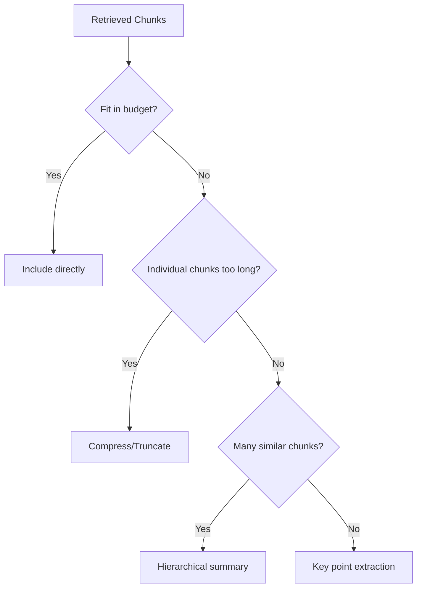
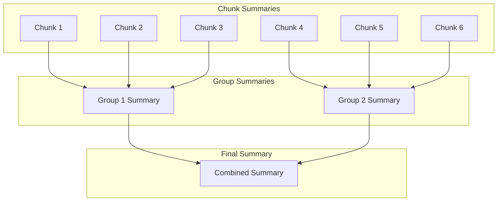

# Summarization and Compression

## Introduction

When retrieved content exceeds your context budget, summarization and compression can preserve essential information while reducing token count. These techniques let you include more sources while staying within limits.

This lesson covers summarization strategies, from simple extraction to LLM-powered compression.

### What We'll Cover

- Pre-summarization at indexing time
- On-the-fly summarization during retrieval
- Hierarchical summarization
- Key point extraction
- Compression techniques

### Prerequisites

- Understanding of context window management
- Familiarity with LLM API calls
- Basic prompt engineering

---

## When to Summarize

| Scenario | Approach |
|----------|----------|
| Chunks too long individually | Summarize before inclusion |
| Too many relevant chunks | Summarize groups |
| Need broad coverage | Hierarchical summarization |
| Token budget tight | Compress all content |



---

## Pre-Summarization (Index Time)

Create summaries when indexing documents for faster retrieval:

```python
from openai import OpenAI

client = OpenAI()

def create_chunk_summary(
    chunk_text: str,
    max_summary_tokens: int = 100
) -> str:
    """
    Create a summary of a chunk at indexing time.
    
    Stored alongside the full text for quick access.
    """
    response = client.chat.completions.create(
        model="gpt-4o-mini",  # Cost-effective for summaries
        messages=[
            {
                "role": "system",
                "content": "Summarize the following text concisely. "
                          "Focus on key facts and main points. "
                          "Keep technical terms and numbers."
            },
            {
                "role": "user",
                "content": chunk_text
            }
        ],
        max_tokens=max_summary_tokens
    )
    
    return response.choices[0].message.content

def index_chunk_with_summary(chunk: dict) -> dict:
    """
    Enhance chunk with pre-computed summary.
    """
    summary = create_chunk_summary(chunk["text"])
    
    return {
        **chunk,
        "summary": summary,
        "summary_tokens": len(summary.split()) * 1.3  # Rough estimate
    }

# Usage at indexing time
chunk = {
    "text": "Python is a high-level programming language created by Guido van Rossum...",
    "source": "python_intro.md"
}

indexed = index_chunk_with_summary(chunk)
# Now stored: full text + summary
```

### Using Pre-Summaries at Query Time

```python
def select_chunks_with_summaries(
    chunks: list[dict],
    max_tokens: int,
    use_summaries: bool = False
) -> str:
    """
    Build context using full text or summaries based on budget.
    """
    if not use_summaries:
        # Use full text
        return "\n\n".join(c["text"] for c in chunks)
    
    # Mix: full text for top chunks, summaries for rest
    result = []
    tokens_used = 0
    
    for i, chunk in enumerate(chunks):
        if i < 3:  # Top 3 get full text
            text = chunk["text"]
        else:
            text = chunk.get("summary", chunk["text"])
        
        chunk_tokens = len(text.split()) * 1.3
        if tokens_used + chunk_tokens > max_tokens:
            break
        
        result.append(text)
        tokens_used += chunk_tokens
    
    return "\n\n".join(result)
```

---

## On-the-Fly Summarization

Summarize during retrieval when needed:

```python
from openai import OpenAI

client = OpenAI()

def summarize_for_query(
    chunks: list[dict],
    query: str,
    target_tokens: int = 500
) -> str:
    """
    Summarize chunks with focus on the specific query.
    
    Query-focused summarization preserves most relevant info.
    """
    combined_text = "\n\n---\n\n".join(c["text"] for c in chunks)
    
    response = client.chat.completions.create(
        model="gpt-4o-mini",
        messages=[
            {
                "role": "system",
                "content": f"""Summarize the following content to approximately {target_tokens} tokens.
Focus on information relevant to this question: {query}
Preserve key facts, numbers, and technical details."""
            },
            {
                "role": "user",
                "content": combined_text
            }
        ],
        max_tokens=target_tokens
    )
    
    return response.choices[0].message.content

# Example
chunks = [
    {"text": "Python 3.12 introduced new performance features..."},
    {"text": "The typing module has been enhanced..."},
    {"text": "Python's GIL improvements allow better concurrency..."},
]

summary = summarize_for_query(
    chunks,
    query="What are the performance improvements in Python 3.12?",
    target_tokens=200
)
```

### Adaptive Summarization

Automatically decide when to summarize:

```python
import tiktoken

class AdaptiveSummarizer:
    """
    Summarize only when content exceeds budget.
    """
    
    def __init__(
        self,
        model: str = "gpt-4o",
        summary_model: str = "gpt-4o-mini"
    ):
        self.model = model
        self.summary_model = summary_model
        self.encoding = tiktoken.encoding_for_model(model)
        self.client = OpenAI()
    
    def fit_to_budget(
        self,
        chunks: list[dict],
        max_tokens: int,
        query: str = ""
    ) -> dict:
        """
        Fit chunks to token budget, summarizing if needed.
        """
        total_tokens = sum(
            len(self.encoding.encode(c["text"]))
            for c in chunks
        )
        
        if total_tokens <= max_tokens:
            # Fits without summarization
            return {
                "content": "\n\n".join(c["text"] for c in chunks),
                "summarized": False,
                "original_tokens": total_tokens,
                "final_tokens": total_tokens
            }
        
        # Need to summarize
        compression_ratio = max_tokens / total_tokens
        
        if compression_ratio > 0.5:
            # Light compression - truncate least relevant
            content = self._truncate_chunks(chunks, max_tokens)
            method = "truncation"
        else:
            # Heavy compression - summarize
            content = self._summarize_chunks(chunks, max_tokens, query)
            method = "summarization"
        
        final_tokens = len(self.encoding.encode(content))
        
        return {
            "content": content,
            "summarized": True,
            "method": method,
            "original_tokens": total_tokens,
            "final_tokens": final_tokens,
            "compression_ratio": final_tokens / total_tokens
        }
    
    def _truncate_chunks(
        self,
        chunks: list[dict],
        max_tokens: int
    ) -> str:
        """Keep as many complete chunks as possible."""
        selected = []
        tokens = 0
        
        for chunk in chunks:
            chunk_tokens = len(self.encoding.encode(chunk["text"]))
            if tokens + chunk_tokens <= max_tokens:
                selected.append(chunk["text"])
                tokens += chunk_tokens
        
        return "\n\n".join(selected)
    
    def _summarize_chunks(
        self,
        chunks: list[dict],
        max_tokens: int,
        query: str
    ) -> str:
        """Summarize all chunks to fit budget."""
        combined = "\n\n---\n\n".join(c["text"] for c in chunks)
        
        prompt = "Summarize the following content concisely."
        if query:
            prompt += f" Focus on information relevant to: {query}"
        
        response = self.client.chat.completions.create(
            model=self.summary_model,
            messages=[
                {"role": "system", "content": prompt},
                {"role": "user", "content": combined}
            ],
            max_tokens=max_tokens
        )
        
        return response.choices[0].message.content

# Usage
summarizer = AdaptiveSummarizer()

result = summarizer.fit_to_budget(
    chunks=chunks,
    max_tokens=500,
    query="Python performance"
)

print(f"Summarized: {result['summarized']}")
print(f"Compression: {result.get('compression_ratio', 1):.1%}")
```

---

## Hierarchical Summarization

For large document sets, use a tree structure:



```python
from openai import OpenAI
import math

class HierarchicalSummarizer:
    """
    Multi-level summarization for large content sets.
    """
    
    def __init__(self, model: str = "gpt-4o-mini"):
        self.model = model
        self.client = OpenAI()
    
    def summarize(
        self,
        chunks: list[dict],
        target_tokens: int = 1000,
        group_size: int = 5
    ) -> dict:
        """
        Hierarchically summarize chunks to target size.
        """
        if len(chunks) <= group_size:
            # Base case: direct summarization
            summary = self._summarize_group(chunks, target_tokens)
            return {
                "summary": summary,
                "levels": 1,
                "chunks_processed": len(chunks)
            }
        
        # Recursive case: group and summarize
        groups = self._create_groups(chunks, group_size)
        
        # Summarize each group
        group_tokens = target_tokens // len(groups)
        group_summaries = []
        
        for group in groups:
            summary = self._summarize_group(group, group_tokens * 2)
            group_summaries.append({"text": summary, "source": "group_summary"})
        
        # Recursively summarize the summaries
        result = self.summarize(
            group_summaries,
            target_tokens=target_tokens,
            group_size=group_size
        )
        
        result["levels"] += 1
        result["chunks_processed"] = len(chunks)
        
        return result
    
    def _create_groups(
        self,
        chunks: list[dict],
        group_size: int
    ) -> list[list[dict]]:
        """Split chunks into groups."""
        groups = []
        for i in range(0, len(chunks), group_size):
            groups.append(chunks[i:i + group_size])
        return groups
    
    def _summarize_group(
        self,
        chunks: list[dict],
        max_tokens: int
    ) -> str:
        """Summarize a group of chunks."""
        combined = "\n\n---\n\n".join(c["text"] for c in chunks)
        
        response = self.client.chat.completions.create(
            model=self.model,
            messages=[
                {
                    "role": "system",
                    "content": "Summarize the following content. "
                              "Preserve key facts, numbers, and main points."
                },
                {
                    "role": "user",
                    "content": combined
                }
            ],
            max_tokens=max_tokens
        )
        
        return response.choices[0].message.content

# Usage
summarizer = HierarchicalSummarizer()

# Summarize 20 chunks into ~500 tokens
result = summarizer.summarize(
    chunks=chunks,  # 20 chunks
    target_tokens=500,
    group_size=4
)

print(f"Levels used: {result['levels']}")
print(f"Summary: {result['summary'][:200]}...")
```

---

## Key Point Extraction

Extract and preserve only the most important points:

```python
from openai import OpenAI

client = OpenAI()

def extract_key_points(
    chunks: list[dict],
    query: str,
    max_points: int = 10
) -> list[str]:
    """
    Extract key points relevant to the query.
    
    Returns bullet points rather than prose summary.
    """
    combined = "\n\n---\n\n".join(c["text"] for c in chunks)
    
    response = client.chat.completions.create(
        model="gpt-4o-mini",
        messages=[
            {
                "role": "system",
                "content": f"""Extract the {max_points} most important points from the content.
Focus on information relevant to: {query}

Format as a numbered list:
1. Point one
2. Point two
..."""
            },
            {
                "role": "user",
                "content": combined
            }
        ],
        max_tokens=500
    )
    
    # Parse points from response
    content = response.choices[0].message.content
    points = []
    
    for line in content.strip().split("\n"):
        line = line.strip()
        if line and line[0].isdigit():
            # Remove numbering
            point = line.split(".", 1)[-1].strip()
            points.append(point)
    
    return points[:max_points]

def format_key_points_context(points: list[str]) -> str:
    """Format key points for context inclusion."""
    return "Key information:\n" + "\n".join(f"• {p}" for p in points)

# Usage
points = extract_key_points(
    chunks,
    query="Python async features",
    max_points=5
)

context = format_key_points_context(points)
# Output:
# Key information:
# • Python 3.12 introduced performance improvements
# • asyncio now supports TaskGroups
# • ...
```

### Structured Extraction

Extract specific types of information:

```python
from openai import OpenAI
import json

client = OpenAI()

def extract_structured_info(
    chunks: list[dict],
    schema: dict
) -> dict:
    """
    Extract information into a structured format.
    
    schema defines what to extract.
    """
    combined = "\n\n".join(c["text"] for c in chunks)
    
    schema_description = json.dumps(schema, indent=2)
    
    response = client.chat.completions.create(
        model="gpt-4o-mini",
        messages=[
            {
                "role": "system",
                "content": f"""Extract information from the content into this structure:
{schema_description}

Return valid JSON matching this schema. Use null for missing values."""
            },
            {
                "role": "user",
                "content": combined
            }
        ],
        response_format={"type": "json_object"}
    )
    
    return json.loads(response.choices[0].message.content)

# Example schema
schema = {
    "topic": "string - main topic",
    "key_facts": ["list of important facts"],
    "dates": ["any dates mentioned"],
    "entities": ["people, organizations, or products"],
    "recommendations": ["any recommendations or best practices"]
}

extracted = extract_structured_info(chunks, schema)
```

---

## Compression Techniques

### Extractive Compression

Keep original text but remove less important parts:

```python
import re

def extractive_compress(
    text: str,
    target_ratio: float = 0.5
) -> str:
    """
    Compress by removing less important sentences.
    
    Uses simple heuristics (production would use ML).
    """
    sentences = re.split(r'(?<=[.!?])\s+', text)
    
    if len(sentences) <= 2:
        return text
    
    # Score sentences by position and content
    scored = []
    for i, sent in enumerate(sentences):
        score = 0
        
        # Position scoring (first and last are important)
        if i == 0:
            score += 2
        elif i == len(sentences) - 1:
            score += 1.5
        
        # Length penalty for very short sentences
        if len(sent.split()) < 5:
            score -= 0.5
        
        # Boost for sentences with numbers (likely facts)
        if re.search(r'\d+', sent):
            score += 1
        
        # Boost for definitive statements
        if any(word in sent.lower() for word in ["is", "are", "means", "defined"]):
            score += 0.5
        
        scored.append((score, sent))
    
    # Sort by score and keep top portion
    scored.sort(reverse=True)
    keep_count = max(1, int(len(scored) * target_ratio))
    kept = scored[:keep_count]
    
    # Restore original order
    kept.sort(key=lambda x: sentences.index(x[1]))
    
    return " ".join(sent for _, sent in kept)

# Example
text = """Python is a programming language. It was created by Guido van Rossum.
Python is widely used in AI and data science. The language is known for readability.
Many developers prefer Python for quick prototyping."""

compressed = extractive_compress(text, target_ratio=0.6)
print(compressed)
```

### Abstractive Compression

Rewrite content more concisely:

```python
from openai import OpenAI

client = OpenAI()

def abstractive_compress(
    text: str,
    compression_ratio: float = 0.5
) -> str:
    """
    Compress by rewriting more concisely.
    
    Creates new text rather than selecting from original.
    """
    original_words = len(text.split())
    target_words = int(original_words * compression_ratio)
    
    response = client.chat.completions.create(
        model="gpt-4o-mini",
        messages=[
            {
                "role": "system",
                "content": f"""Rewrite this content in approximately {target_words} words.
Preserve all key information but be more concise.
Use shorter sentences. Remove redundancy."""
            },
            {
                "role": "user",
                "content": text
            }
        ],
        max_tokens=target_words * 2
    )
    
    return response.choices[0].message.content
```

---

## Complete Compression Pipeline

```python
from openai import OpenAI
import tiktoken
from enum import Enum

class CompressionStrategy(Enum):
    NONE = "none"
    TRUNCATE = "truncate"
    EXTRACTIVE = "extractive"
    SUMMARIZE = "summarize"
    HIERARCHICAL = "hierarchical"

class ContentCompressor:
    """
    Complete content compression with multiple strategies.
    """
    
    def __init__(
        self,
        model: str = "gpt-4o",
        compression_model: str = "gpt-4o-mini"
    ):
        self.model = model
        self.compression_model = compression_model
        self.encoding = tiktoken.encoding_for_model(model)
        self.client = OpenAI()
    
    def compress(
        self,
        chunks: list[dict],
        max_tokens: int,
        query: str = "",
        strategy: CompressionStrategy = None
    ) -> dict:
        """
        Compress chunks to fit token budget.
        """
        current_tokens = sum(
            len(self.encoding.encode(c["text"]))
            for c in chunks
        )
        
        # Auto-select strategy if not specified
        if strategy is None:
            strategy = self._select_strategy(
                current_tokens,
                max_tokens,
                len(chunks)
            )
        
        if strategy == CompressionStrategy.NONE:
            content = "\n\n".join(c["text"] for c in chunks)
        
        elif strategy == CompressionStrategy.TRUNCATE:
            content = self._truncate(chunks, max_tokens)
        
        elif strategy == CompressionStrategy.EXTRACTIVE:
            content = self._extractive_compress(chunks, max_tokens)
        
        elif strategy == CompressionStrategy.SUMMARIZE:
            content = self._summarize(chunks, max_tokens, query)
        
        elif strategy == CompressionStrategy.HIERARCHICAL:
            content = self._hierarchical(chunks, max_tokens, query)
        
        final_tokens = len(self.encoding.encode(content))
        
        return {
            "content": content,
            "strategy": strategy.value,
            "original_tokens": current_tokens,
            "final_tokens": final_tokens,
            "compression_ratio": final_tokens / current_tokens if current_tokens > 0 else 1
        }
    
    def _select_strategy(
        self,
        current: int,
        target: int,
        num_chunks: int
    ) -> CompressionStrategy:
        """Auto-select best compression strategy."""
        ratio = target / current if current > 0 else 1
        
        if ratio >= 1:
            return CompressionStrategy.NONE
        elif ratio >= 0.7:
            return CompressionStrategy.TRUNCATE
        elif ratio >= 0.4:
            return CompressionStrategy.EXTRACTIVE
        elif num_chunks > 10:
            return CompressionStrategy.HIERARCHICAL
        else:
            return CompressionStrategy.SUMMARIZE
    
    def _truncate(
        self,
        chunks: list[dict],
        max_tokens: int
    ) -> str:
        """Simple truncation of chunks."""
        result = []
        tokens = 0
        
        for chunk in chunks:
            chunk_tokens = len(self.encoding.encode(chunk["text"]))
            if tokens + chunk_tokens <= max_tokens:
                result.append(chunk["text"])
                tokens += chunk_tokens
        
        return "\n\n".join(result)
    
    def _extractive_compress(
        self,
        chunks: list[dict],
        max_tokens: int
    ) -> str:
        """Extractive compression within each chunk."""
        total_tokens = sum(
            len(self.encoding.encode(c["text"]))
            for c in chunks
        )
        target_ratio = max_tokens / total_tokens
        
        compressed = []
        for chunk in chunks:
            comp_text = extractive_compress(chunk["text"], target_ratio)
            compressed.append(comp_text)
        
        return "\n\n".join(compressed)
    
    def _summarize(
        self,
        chunks: list[dict],
        max_tokens: int,
        query: str
    ) -> str:
        """LLM summarization."""
        combined = "\n\n---\n\n".join(c["text"] for c in chunks)
        
        prompt = f"Summarize in ~{max_tokens} tokens."
        if query:
            prompt += f" Focus on: {query}"
        
        response = self.client.chat.completions.create(
            model=self.compression_model,
            messages=[
                {"role": "system", "content": prompt},
                {"role": "user", "content": combined}
            ],
            max_tokens=max_tokens
        )
        
        return response.choices[0].message.content
    
    def _hierarchical(
        self,
        chunks: list[dict],
        max_tokens: int,
        query: str
    ) -> str:
        """Hierarchical summarization."""
        group_size = 4
        groups = [chunks[i:i+group_size] for i in range(0, len(chunks), group_size)]
        
        tokens_per_group = max_tokens // len(groups)
        
        summaries = []
        for group in groups:
            summary = self._summarize(group, tokens_per_group, query)
            summaries.append({"text": summary})
        
        # Final combination
        if len(summaries) > 1:
            return self._summarize(summaries, max_tokens, query)
        
        return summaries[0]["text"] if summaries else ""

# Usage
compressor = ContentCompressor()

result = compressor.compress(
    chunks=chunks,
    max_tokens=500,
    query="Python features",
    strategy=None  # Auto-select
)

print(f"Strategy: {result['strategy']}")
print(f"Compression: {result['compression_ratio']:.1%}")
```

---

## Hands-on Exercise

### Your Task

Implement a `ContextOptimizer` that combines selection, ordering, deduplication, and compression:

### Requirements

```python
class ContextOptimizer:
    def optimize(
        self,
        chunks: list[dict],
        max_tokens: int,
        query: str
    ) -> dict:
        """
        Returns optimized context with:
        {
            "context": str,
            "chunks_used": int,
            "tokens": int,
            "operations": list[str]  # What was done
        }
        """
        pass
```

<details>
<summary>💡 Hints</summary>

- Start with deduplication (removes waste)
- Then select top chunks by score
- Order strategically
- Compress only if still over budget
- Track each operation performed

</details>

<details>
<summary>✅ Solution</summary>

```python
import tiktoken
import hashlib
from openai import OpenAI

class ContextOptimizer:
    def __init__(self, model: str = "gpt-4o"):
        self.model = model
        self.encoding = tiktoken.encoding_for_model(model)
        self.client = OpenAI()
    
    def optimize(
        self,
        chunks: list[dict],
        max_tokens: int,
        query: str
    ) -> dict:
        operations = []
        current = chunks
        
        # Step 1: Deduplicate
        before = len(current)
        current = self._deduplicate(current)
        if len(current) < before:
            operations.append(f"Deduplicated: {before} → {len(current)} chunks")
        
        # Step 2: Sort by score
        current = sorted(current, key=lambda x: x.get("score", 0), reverse=True)
        operations.append("Sorted by relevance score")
        
        # Step 3: Select within budget
        selected, tokens_used = self._select_to_budget(current, max_tokens)
        operations.append(f"Selected {len(selected)}/{len(current)} chunks")
        
        # Step 4: Check if compression needed
        if tokens_used > max_tokens and selected:
            selected = self._compress(selected, max_tokens, query)
            tokens_used = len(self.encoding.encode(selected))
            operations.append("Applied compression")
            context = selected
        else:
            context = "\n\n".join(c["text"] for c in selected)
            tokens_used = len(self.encoding.encode(context))
        
        return {
            "context": context,
            "chunks_used": len(selected) if isinstance(selected, list) else 1,
            "tokens": tokens_used,
            "operations": operations
        }
    
    def _deduplicate(self, chunks: list[dict]) -> list[dict]:
        seen = set()
        unique = []
        
        for chunk in chunks:
            h = hashlib.md5(chunk["text"].lower().strip().encode()).hexdigest()
            if h not in seen:
                seen.add(h)
                unique.append(chunk)
        
        return unique
    
    def _select_to_budget(
        self,
        chunks: list[dict],
        max_tokens: int
    ) -> tuple[list[dict], int]:
        selected = []
        tokens = 0
        
        for chunk in chunks:
            chunk_tokens = len(self.encoding.encode(chunk["text"]))
            if tokens + chunk_tokens <= max_tokens:
                selected.append(chunk)
                tokens += chunk_tokens
        
        return selected, tokens
    
    def _compress(
        self,
        chunks: list[dict],
        max_tokens: int,
        query: str
    ) -> str:
        combined = "\n\n".join(c["text"] for c in chunks)
        
        response = self.client.chat.completions.create(
            model="gpt-4o-mini",
            messages=[
                {
                    "role": "system",
                    "content": f"Summarize in ~{max_tokens} tokens. Focus: {query}"
                },
                {"role": "user", "content": combined}
            ],
            max_tokens=max_tokens
        )
        
        return response.choices[0].message.content

# Test
optimizer = ContextOptimizer()

result = optimizer.optimize(
    chunks=[
        {"text": "Python is great for AI.", "score": 0.9},
        {"text": "Python is great for AI.", "score": 0.85},  # Duplicate
        {"text": "JavaScript runs in browsers.", "score": 0.7},
    ],
    max_tokens=100,
    query="Python capabilities"
)

print(f"Chunks used: {result['chunks_used']}")
print(f"Operations: {result['operations']}")
```

</details>

---

## Summary

Summarization and compression maximize context value:

✅ **Pre-summarization** — Create summaries at index time for speed
✅ **Query-focused** — Summarize with the query in mind
✅ **Hierarchical** — Handle large document sets with tree summarization
✅ **Key point extraction** — Structured extraction for specific info needs
✅ **Adaptive strategy** — Choose compression level based on budget

**Next:** [Back to Context Construction Overview](./00-context-construction.md)

---

## Further Reading

- [Text Summarization Techniques](https://huggingface.co/tasks/summarization) - HuggingFace overview
- [Extractive vs Abstractive](https://arxiv.org/abs/2005.14165) - Summarization approaches
- [LongRAG](https://arxiv.org/abs/2406.15319) - Handling long context in RAG

<!--
Sources Consulted:
- OpenAI API documentation for chat completions
- Text summarization research papers
- RAG optimization best practices
-->
