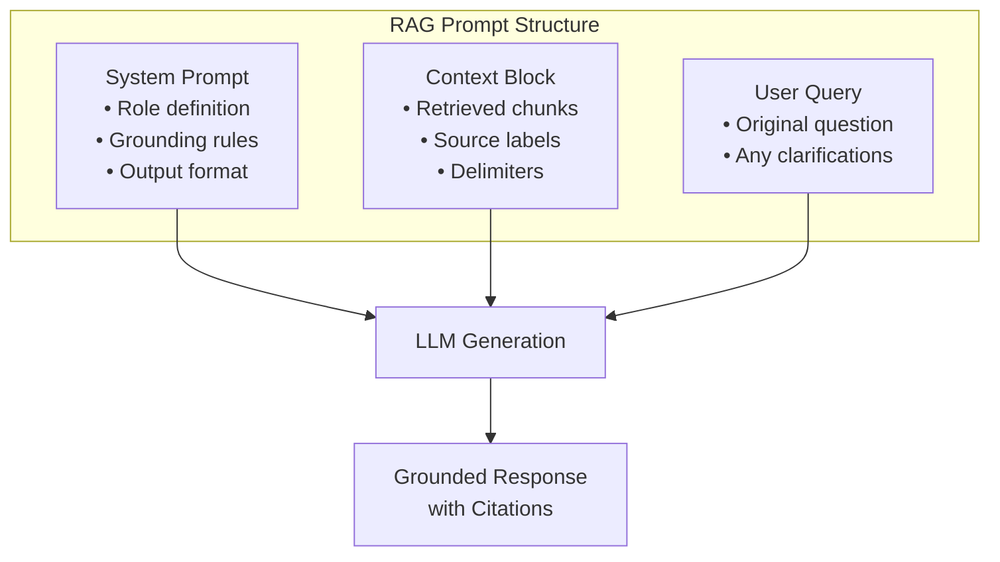
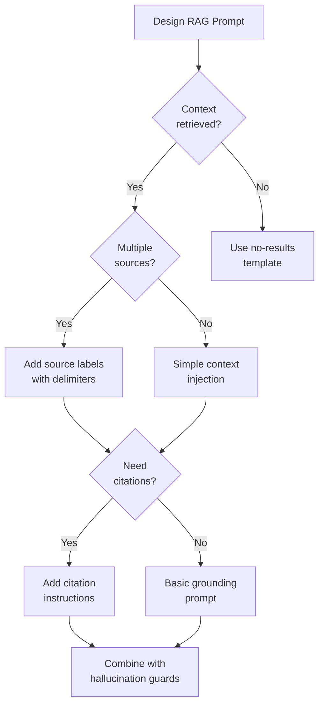

# Prompt Design for RAG

## Introduction

The prompt is where retrieval meets generation. A well-designed RAG prompt transforms retrieved chunks into accurate, grounded responses. Poor prompt design leads to hallucination, ignored sources, and unreliable answers—even with perfect retrieval.

This lesson covers prompt engineering techniques specifically for RAG systems, from system prompt design to handling edge cases like empty results.

### What We'll Cover

- System prompts for RAG applications
- Context injection patterns
- Instructing source usage
- Handling no-results scenarios
- Preventing hallucination about sources

### Prerequisites

- Context construction knowledge (Lesson 6)
- Basic prompt engineering (Unit 6)
- Understanding of chat completions API

---

## Quick Start

A minimal RAG prompt structure:

```python
from openai import OpenAI

client = OpenAI()

def generate_rag_response(
    query: str,
    context: str,
    system_prompt: str = None
) -> str:
    """
    Generate a grounded response using retrieved context.
    """
    if system_prompt is None:
        system_prompt = """You are a helpful assistant that answers questions 
based on the provided context. 

Rules:
1. Only use information from the context to answer
2. If the context doesn't contain the answer, say so
3. Cite your sources when possible
4. Be concise and accurate"""
    
    messages = [
        {"role": "system", "content": system_prompt},
        {"role": "user", "content": f"""Context:
{context}

Question: {query}"""}
    ]
    
    response = client.chat.completions.create(
        model="gpt-4o",
        messages=messages,
        temperature=0.3  # Lower for factual accuracy
    )
    
    return response.choices[0].message.content

# Usage
context = """
[Source: Python Documentation]
Python 3.12 introduced several performance improvements including
faster startup time and optimized comprehensions.

[Source: Release Notes]
The match statement was enhanced in Python 3.12 with better
pattern matching capabilities.
"""

answer = generate_rag_response(
    query="What's new in Python 3.12?",
    context=context
)
print(answer)
```

---

## RAG Prompt Architecture



---

## Prompt Component Comparison

| Component | Purpose | Position | Priority |
|-----------|---------|----------|----------|
| **System Prompt** | Define behavior, rules | First | Highest |
| **Context Block** | Provide retrieved information | After system | High |
| **User Query** | State the question | After context | Standard |
| **Output Format** | Specify response structure | In system or user | Medium |

---

## Decision Flowchart



---

## Key Concepts

| Concept | Description | Example |
|---------|-------------|---------|
| **Grounding** | Constraining responses to retrieved context | "Answer only from the provided documents" |
| **Context Injection** | Placing retrieved content in prompt | Using `<context>` XML tags |
| **Source Attribution** | Citing which document information came from | "[Source: doc.pdf, page 3]" |
| **Hallucination Guard** | Preventing fabricated information | "If not in context, say 'I don't know'" |
| **No-Results Handling** | Graceful response when retrieval fails | "I couldn't find information about..." |

---

## Lesson Structure

This lesson is organized into focused sub-lessons:

| Lesson | Topic | Key Skills |
|--------|-------|------------|
| [01-system-prompts-for-rag](./01-system-prompts-for-rag.md) | System Prompts | Role definition, grounding rules |
| [02-context-injection-patterns](./02-context-injection-patterns.md) | Context Injection | Formatting, delimiters, positioning |
| [03-instructing-source-usage](./03-instructing-source-usage.md) | Source Usage | Citations, quoting, attribution |
| [04-no-results-handling](./04-no-results-handling.md) | No Results | Empty result detection, fallbacks |
| [05-hallucination-prevention](./05-hallucination-prevention.md) | Hallucination Prevention | Guards, verification, confidence |

---

## Summary

Effective RAG prompts require:

✅ **Clear grounding rules** — Tell the model to use only provided context
✅ **Structured context** — Use delimiters and source labels
✅ **Citation instructions** — Specify how to attribute sources
✅ **Edge case handling** — Plan for empty or irrelevant results
✅ **Hallucination guards** — Explicit instructions to prevent fabrication

**Next:** [System Prompts for RAG](./01-system-prompts-for-rag.md)

---

## Further Reading

- [OpenAI Prompt Engineering](https://platform.openai.com/docs/guides/prompt-engineering) - General best practices
- [Anthropic Prompt Engineering](https://platform.claude.com/docs/en/build-with-claude/prompt-engineering/overview) - Claude-specific guidance
- [Cohere Grounded Generation](https://docs.cohere.com/docs/crafting-effective-prompts) - Citation and grounding

<!--
Sources Consulted:
- OpenAI prompt engineering documentation
- Anthropic Claude prompt engineering overview
- Cohere grounded generation documentation
-->
