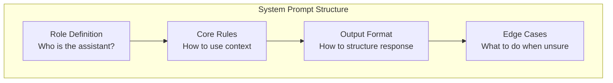

# System Prompts for RAG

## Introduction

The system prompt establishes the ground rules for your RAG system. It defines how the model should treat retrieved context, when to cite sources, and what to do when information is missing. A well-crafted system prompt is the foundation of reliable, grounded responses.

This lesson covers RAG-specific system prompt patterns that reduce hallucination and improve response quality.

### What We'll Cover

- RAG-specific instruction design
- Source usage guidance
- Answer format specification
- Hallucination prevention in system prompts
- Temperature and parameter tuning

### Prerequisites

- Understanding of chat completions API
- Basic prompt engineering knowledge
- Context construction fundamentals

---

## Basic RAG System Prompt

Start with a minimal but effective template:

```python
RAG_SYSTEM_PROMPT = """You are a helpful assistant that answers questions based on the provided context.

## Core Rules
1. ONLY use information from the context to answer questions
2. If the context doesn't contain relevant information, say "I don't have information about that in the provided documents"
3. Cite sources when referencing specific information
4. Be concise and accurate

## Context Format
You will receive context as labeled sections from various documents. 
Each section includes a source identifier you should use for citations."""
```

---

## System Prompt Components

A comprehensive RAG system prompt has these sections:



| Section | Purpose | Example |
|---------|---------|---------|
| **Role** | Define assistant identity | "You are a technical support agent..." |
| **Rules** | Set grounding constraints | "Only answer from provided context" |
| **Format** | Specify output structure | "Use bullet points for lists" |
| **Edge Cases** | Handle exceptions | "If unsure, ask for clarification" |

---

## Role Definition Patterns

### Domain-Specific Roles

```python
# Technical Documentation
TECH_DOCS_ROLE = """You are a technical documentation assistant for our API platform.
Your role is to help developers understand our APIs, SDKs, and integration patterns.
You have access to our official documentation provided in the context."""

# Customer Support
SUPPORT_ROLE = """You are a customer support specialist for Acme Corp.
Your role is to help customers with product questions, troubleshooting, and account issues.
You have access to our support knowledge base provided in the context."""

# Legal Research
LEGAL_ROLE = """You are a legal research assistant.
Your role is to help find relevant case law and statutory information.
You have access to legal documents provided in the context.
IMPORTANT: You provide information, not legal advice."""

# Medical Information
MEDICAL_ROLE = """You are a medical information assistant.
Your role is to provide information from medical literature.
You have access to peer-reviewed articles provided in the context.
IMPORTANT: Always remind users to consult healthcare professionals for medical advice."""
```

### Role + Context Awareness

```python
def build_role_prompt(
    role: str,
    domain: str,
    sources: list[str]
) -> str:
    """
    Build a role-aware system prompt.
    """
    source_list = "\n".join(f"- {s}" for s in sources)
    
    return f"""You are a {role} specializing in {domain}.

## Available Sources
You have access to information from these sources:
{source_list}

## Your Responsibilities
1. Answer questions accurately using only the provided context
2. Reference the source when citing specific information
3. Acknowledge when information is outside your available sources
4. Maintain a helpful and professional tone"""

# Usage
prompt = build_role_prompt(
    role="knowledge assistant",
    domain="Python programming",
    sources=["Python Official Documentation", "PEP Documents", "Release Notes"]
)
```

---

## Grounding Rules

### Strict Grounding

For high-stakes domains where accuracy is critical:

```python
STRICT_GROUNDING = """## Grounding Rules (CRITICAL)

You MUST follow these rules without exception:

1. **Context-Only Answers**: Your response must be based ENTIRELY on the provided context
2. **No External Knowledge**: Do NOT use information from your training data
3. **Explicit Uncertainty**: If the context doesn't contain the answer, respond with:
   "Based on the provided documents, I don't have information about [topic]."
4. **No Assumptions**: Do not infer or extrapolate beyond what is explicitly stated
5. **Quote When Possible**: Use direct quotes from the context when applicable

Violation of these rules is considered a critical error."""
```

### Flexible Grounding

For general Q&A where some general knowledge is acceptable:

```python
FLEXIBLE_GROUNDING = """## Grounding Rules

Follow these guidelines:

1. **Primary Source**: Prioritize information from the provided context
2. **Context First**: Always check the context before using general knowledge
3. **Distinguish Sources**: Clearly indicate when using context vs. general knowledge
   - "According to the documentation..." (from context)
   - "Generally speaking..." (from training)
4. **Preference for Context**: When context and general knowledge conflict, prefer context
5. **Acknowledge Limits**: Indicate when the context doesn't fully address the question"""
```

### Comparison Table

| Approach | Use When | Trade-offs |
|----------|----------|------------|
| **Strict** | Legal, medical, compliance | May refuse to answer more often |
| **Flexible** | General Q&A, customer support | Higher hallucination risk |
| **Hybrid** | Most applications | Balance between helpfulness and accuracy |

---

## Output Format Specification

### Structured Response Format

```python
STRUCTURED_FORMAT = """## Response Format

Structure your response as follows:

### Answer
[Provide the direct answer to the question]

### Sources
[List the sources used, with specific citations]

### Additional Notes
[Optional: Add relevant context or caveats]

Example:
---
### Answer
Python 3.12 introduced pattern matching enhancements and performance improvements.

### Sources
- Python 3.12 Release Notes, Section 2.1
- PEP 636: Structural Pattern Matching

### Additional Notes
These features build on the match statement introduced in Python 3.10.
---"""
```

### Concise Response Format

```python
CONCISE_FORMAT = """## Response Format

- Be concise and direct
- Use 1-3 sentences for simple questions
- Use bullet points for multi-part answers
- Include source in parentheses at the end: (Source: document name)
- Do not include preambles like "Based on the context..."
- Do not repeat the question"""
```

### JSON Response Format

```python
JSON_FORMAT = """## Response Format

Respond in valid JSON format:

```json
{
  "answer": "Your answer here",
  "confidence": "high|medium|low",
  "sources": [
    {
      "document": "Document name",
      "section": "Section reference",
      "quote": "Relevant quote if applicable"
    }
  ],
  "requires_followup": true/false,
  "followup_question": "Optional clarifying question"
}
```

Always output valid JSON. Do not include any text outside the JSON object."""
```

---

## Complete System Prompt Templates

### Production RAG Prompt

```python
def build_production_rag_prompt(
    domain: str,
    strictness: str = "high",
    output_format: str = "natural",
    include_citations: bool = True
) -> str:
    """
    Build a production-ready RAG system prompt.
    """
    base = f"""You are a knowledgeable assistant specializing in {domain}.

## Your Role
Help users find accurate information from the provided documents.
Be helpful, accurate, and professional."""

    # Add grounding rules based on strictness
    if strictness == "high":
        grounding = """

## Grounding Rules (STRICT)
1. ONLY use information from the provided context
2. Never use external knowledge or make assumptions
3. If unsure, say "I don't have that information in the provided documents"
4. Quote directly when referencing specific facts"""
    else:
        grounding = """

## Grounding Rules
1. Prioritize information from the provided context
2. You may use general knowledge for clarification
3. Always distinguish between context-based and general information
4. When uncertain, acknowledge the limitation"""

    # Add citation instructions if needed
    if include_citations:
        citations = """

## Citations
- Cite sources for factual claims: (Source: document name)
- Use direct quotes for important statements
- Reference specific sections when available"""
    else:
        citations = ""

    # Add output format
    if output_format == "json":
        format_spec = """

## Output Format
Respond in JSON: {"answer": "...", "sources": [...], "confidence": "high|medium|low"}"""
    elif output_format == "structured":
        format_spec = """

## Output Format
Structure your response with these sections:
**Answer:** [Your response]
**Sources:** [List sources used]"""
    else:
        format_spec = """

## Output Format
- Be concise and direct
- Use natural language
- Include source references inline"""

    return base + grounding + citations + format_spec

# Usage
prompt = build_production_rag_prompt(
    domain="software development",
    strictness="high",
    output_format="natural",
    include_citations=True
)
```

### Multi-Language Support

```python
def build_multilingual_rag_prompt(
    language: str = "en",
    domain: str = "general"
) -> str:
    """
    Build a system prompt with language awareness.
    """
    language_instructions = {
        "en": "Respond in English.",
        "es": "Responde en español.",
        "fr": "Répondez en français.",
        "de": "Antworten Sie auf Deutsch.",
        "auto": "Respond in the same language as the user's question."
    }
    
    lang_instruction = language_instructions.get(language, language_instructions["en"])
    
    return f"""You are a helpful assistant for {domain} queries.

## Language
{lang_instruction}

## Grounding Rules
1. Answer using only the provided context
2. If the context is in a different language than the response language, translate accurately
3. Maintain technical terms in their original language when appropriate
4. Cite sources using their original titles"""
```

---

## Temperature and Parameter Guidance

Include parameter recommendations in your system:

```python
RAG_PARAMETERS = """
Recommended parameters for RAG:

| Parameter | Value | Rationale |
|-----------|-------|-----------|
| temperature | 0.3-0.5 | Lower for factual accuracy |
| max_tokens | Varies | Based on expected response length |
| top_p | 0.9 | Slight diversity while staying focused |
| frequency_penalty | 0.0 | No penalty needed for grounded responses |
| presence_penalty | 0.0 | No penalty needed |
"""

# Usage in API call
response = client.chat.completions.create(
    model="gpt-4o",
    messages=messages,
    temperature=0.3,  # Low for factual accuracy
    top_p=0.9,
    max_tokens=1024
)
```

---

## Hands-on Exercise

### Your Task

Create a `SystemPromptBuilder` class that:
1. Takes configuration options
2. Builds a complete RAG system prompt
3. Validates the prompt has required components

### Requirements

```python
class SystemPromptBuilder:
    def build(
        self,
        role: str,
        domain: str,
        strictness: str = "high",
        output_format: str = "natural",
        include_citations: bool = True,
        max_response_length: str = None
    ) -> str:
        pass
    
    def validate(self, prompt: str) -> dict:
        """Check prompt has required components."""
        pass
```

<details>
<summary>💡 Hints</summary>

- Use template sections for each component
- Check for grounding keywords in validation
- Consider edge cases like empty domains
- Make the builder extensible

</details>

<details>
<summary>✅ Solution</summary>

```python
class SystemPromptBuilder:
    def __init__(self):
        self.required_components = [
            "grounding",
            "uncertainty",
            "format"
        ]
    
    def build(
        self,
        role: str,
        domain: str,
        strictness: str = "high",
        output_format: str = "natural",
        include_citations: bool = True,
        max_response_length: str = None
    ) -> str:
        sections = []
        
        # Role section
        sections.append(f"""You are a {role} specializing in {domain}.
Help users find accurate information from the provided documents.""")
        
        # Grounding section
        if strictness == "high":
            sections.append("""
## Grounding Rules (STRICT)
1. ONLY use information from the provided context
2. Never use external knowledge or assumptions
3. Quote directly when referencing specific facts
4. If information is not in context, say "I don't have that information in the provided documents" """)
        else:
            sections.append("""
## Grounding Rules
1. Prioritize information from the provided context
2. Distinguish between context-based and general information
3. When uncertain, acknowledge the limitation""")
        
        # Citations
        if include_citations:
            sections.append("""
## Citations
- Cite sources for factual claims: (Source: document name)
- Use direct quotes for important statements""")
        
        # Output format
        if output_format == "json":
            sections.append("""
## Output Format
Respond in valid JSON: {"answer": "...", "sources": [...], "confidence": "high|medium|low"}""")
        elif output_format == "structured":
            sections.append("""
## Output Format
**Answer:** [Your response]
**Sources:** [List sources used]""")
        else:
            sections.append("""
## Output Format
- Be concise and direct
- Use natural language
- Include source references inline""")
        
        # Length constraint
        if max_response_length:
            sections.append(f"""
## Length
Keep your response to {max_response_length}.""")
        
        return "\n".join(sections)
    
    def validate(self, prompt: str) -> dict:
        """Check prompt has required components."""
        prompt_lower = prompt.lower()
        
        checks = {
            "has_grounding": any(word in prompt_lower for word in [
                "context", "provided", "only use", "grounding"
            ]),
            "has_uncertainty_handling": any(word in prompt_lower for word in [
                "don't have", "uncertain", "not in context", "if unsure"
            ]),
            "has_format_spec": any(word in prompt_lower for word in [
                "format", "structure", "respond", "output"
            ]),
            "has_role": any(word in prompt_lower for word in [
                "you are", "your role", "assistant"
            ])
        }
        
        checks["is_valid"] = all([
            checks["has_grounding"],
            checks["has_uncertainty_handling"]
        ])
        
        return checks

# Test
builder = SystemPromptBuilder()

prompt = builder.build(
    role="technical support specialist",
    domain="cloud computing",
    strictness="high",
    include_citations=True
)

validation = builder.validate(prompt)
print(f"Valid: {validation['is_valid']}")
print(prompt[:500])
```

</details>

---

## Summary

Effective RAG system prompts include:

✅ **Clear role definition** — Domain-specific identity and expertise
✅ **Grounding rules** — Explicit instructions to use only context
✅ **Output format** — Consistent structure for responses
✅ **Uncertainty handling** — What to do when context is insufficient
✅ **Citation instructions** — How to reference sources

**Next:** [Context Injection Patterns](./02-context-injection-patterns.md)

---

## Further Reading

- [OpenAI Message Roles](https://platform.openai.com/docs/guides/prompt-engineering) - Developer vs user messages
- [Anthropic System Prompts](https://platform.claude.com/docs/en/build-with-claude/prompt-engineering/system-prompts) - Claude-specific guidance

<!--
Sources Consulted:
- OpenAI prompt engineering guide
- Anthropic prompt engineering overview
- Cohere grounded generation documentation
-->
