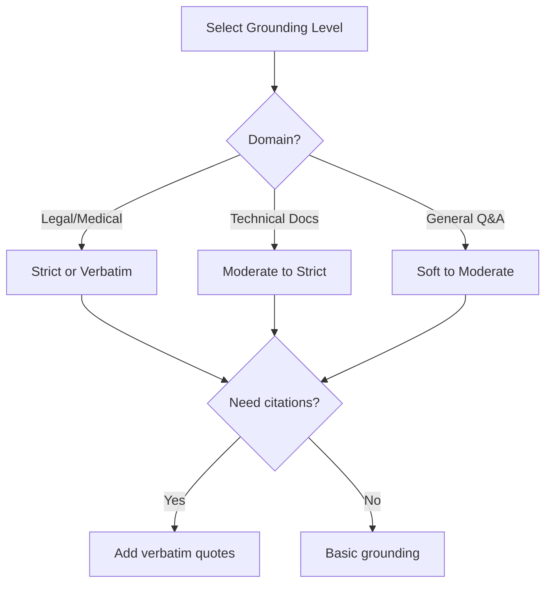

# Instructing Source Usage

## Introduction

How you instruct the model to use sources determines the quality of citations and the trustworthiness of responses. Clear source usage instructions lead to verifiable answers, while vague instructions lead to unsourced claims and potential hallucination.

This lesson covers techniques for instructing models to properly cite, quote, and acknowledge sources.

### What We'll Cover

- "Answer based only on..." patterns
- Quoting source text
- Citing specific sections
- Acknowledging uncertainty
- Citation formats

### Prerequisites

- Context injection patterns
- System prompt design
- Understanding of grounding

---

## "Answer Based Only On" Patterns

### Basic Grounding Instruction

```python
BASIC_GROUNDING = """Answer the question based ONLY on the provided context.
Do not use any external knowledge or information not present in the context."""
```

### Progressive Grounding Levels

```python
# Level 1: Soft grounding (allows general knowledge)
SOFT_GROUNDING = """Answer the question primarily using the provided context.
You may supplement with general knowledge when the context is insufficient,
but clearly indicate when you're doing so."""

# Level 2: Moderate grounding (prefers context)
MODERATE_GROUNDING = """Answer the question using the provided context.
If the context doesn't fully answer the question, you may use general knowledge
to fill small gaps, but the core answer must come from the context."""

# Level 3: Strict grounding (context only)
STRICT_GROUNDING = """Answer the question using ONLY the provided context.
Do not use any information not explicitly stated in the context.
If the context doesn't contain the answer, say "I don't have that information
in the provided documents."""

# Level 4: Verbatim grounding (quotes only)
VERBATIM_GROUNDING = """Answer the question using ONLY direct quotes from the context.
Your entire response should be composed of quoted text from the provided documents.
Use quotation marks around all quoted material and cite the source."""
```

### Grounding Level Selection



| Level | Use Case | Risk of Hallucination | User Experience |
|-------|----------|----------------------|-----------------|
| **Soft** | General chat, casual Q&A | Higher | More helpful |
| **Moderate** | Product support, general docs | Medium | Balanced |
| **Strict** | Technical docs, compliance | Lower | May refuse more |
| **Verbatim** | Legal, medical, quotes needed | Lowest | Most restrictive |

---

## Quoting Source Text

### Direct Quote Instructions

```python
QUOTE_INSTRUCTIONS = """When citing information from the context:

1. Use exact quotes for key facts and statements
2. Format quotes with quotation marks: "quoted text"
3. Include the source after each quote: (Source: document name)
4. Keep quotes concise - extract the relevant portion only

Example:
According to the documentation, "Python 3.12 introduced pattern matching 
enhancements" (Source: Python Release Notes).
"""
```

### Quote Extraction Prompt

```python
def build_quote_extraction_prompt(
    context: str,
    question: str
) -> str:
    """
    Prompt that emphasizes quote extraction.
    """
    return f"""Extract relevant quotes from the context to answer the question.

Context:
{context}

Question: {question}

Instructions:
1. Find all quotes relevant to the question
2. List each quote with its source
3. Then provide a synthesized answer using those quotes

Response format:
## Relevant Quotes
1. "[quote]" - Source: [source name]
2. "[quote]" - Source: [source name]

## Answer
[Your answer incorporating the quotes above]"""
```

### Quote Formatting Patterns

```python
# Pattern 1: Inline quotes
INLINE_QUOTE = """Use inline quotes: The documentation states that "quote here" (Source).
"""

# Pattern 2: Block quotes
BLOCK_QUOTE = """Use block quotes for longer excerpts:

> "This is a longer quote from the source document that spans
> multiple lines and provides important context."
> — Source: Document Name

"""

# Pattern 3: Numbered quotes
NUMBERED_QUOTE = """Number your quotes for reference:

[1] "First relevant quote" - Source A
[2] "Second relevant quote" - Source B

Then reference them: As stated in [1] and supported by [2]...
"""
```

---

## Citing Specific Sections

### Section Citation Format

```python
SECTION_CITATION = """When citing sources, include specific references:

- Document name
- Section or chapter (if available)
- Page number (if available)
- Paragraph or line (if relevant)

Example formats:
- (Source: API Documentation, Authentication section)
- (Source: User Manual, Chapter 3, p. 45)
- (Source: README.md, Installation section, lines 23-28)
"""
```

### Structured Citation Builder

```python
def build_citation_instructions(
    citation_style: str = "inline"
) -> str:
    """
    Build citation instructions based on style.
    """
    styles = {
        "inline": """Cite inline: "quote" (Source: Document, Section).
Use this format immediately after each cited statement.""",
        
        "footnote": """Use footnote-style citations:
Make a statement.[1]

References:
[1] Document Name, Section, Page X""",
        
        "endnote": """List all sources at the end:
Make statements referencing [Doc1] and [Doc2].

Sources Used:
- [Doc1] Full Document Name, relevant section
- [Doc2] Full Document Name, relevant section""",
        
        "academic": """Use academic citation style:
Statement here (Author, Year, p. X).
Or: Author (Year) states that "quote" (p. X)."""
    }
    
    return styles.get(citation_style, styles["inline"])
```

### Multi-Source Attribution

```python
MULTI_SOURCE_CITATION = """When multiple sources support a statement:

1. Cite all relevant sources: (Sources: [1], [2], [3])
2. Note when sources agree: "All sources confirm that..."
3. Note discrepancies: "Source A states X, while Source B indicates Y"
4. Indicate primary sources: "According to the official documentation [1], 
   with additional context from the blog post [2]..."

When sources conflict:
- Present both perspectives
- Indicate which source is authoritative
- Let the user decide if uncertain
"""
```

---

## Acknowledging Uncertainty

### Uncertainty Expressions

```python
UNCERTAINTY_PATTERNS = """Express uncertainty appropriately:

When context partially addresses the question:
- "Based on the available information..."
- "The context suggests, but doesn't confirm..."
- "While not explicitly stated, the evidence indicates..."

When context is insufficient:
- "I don't have specific information about [topic] in the provided documents"
- "The provided context doesn't address [specific aspect]"
- "I cannot find information about [topic] in the sources"

When information might be outdated:
- "According to [source dated X], ... (Note: this may have changed)"
- "The documentation from [date] states..."

NEVER:
- Make up information not in the context
- State uncertain information with false confidence
- Ignore the question when context is missing
"""
```

### Confidence Levels

```python
def build_confidence_aware_prompt(
    require_confidence: bool = True
) -> str:
    """
    Add confidence level requirements to prompts.
    """
    if not require_confidence:
        return ""
    
    return """
After your answer, indicate your confidence level:

- **HIGH**: Answer is directly stated in the context with clear sources
- **MEDIUM**: Answer is implied or synthesized from multiple context sections  
- **LOW**: Answer is partially supported; some inference required
- **NONE**: Cannot answer reliably from the provided context

Format: [Confidence: HIGH/MEDIUM/LOW/NONE]

If confidence is LOW or NONE, explain what additional information would help.
"""

# Usage in prompt
prompt = f"""Answer the question using the provided context.

{build_confidence_aware_prompt(True)}

Context:
{context}

Question: {question}
"""
```

### Graceful Uncertainty Responses

```python
GRACEFUL_UNCERTAINTY = """When you cannot fully answer the question:

1. Acknowledge what you CAN answer from the context
2. Clearly state what's missing
3. Suggest what information would help
4. Offer to help with related questions you CAN answer

Example response:
"I found information about [related topic] in the documents, but I don't have 
specific details about [asked topic]. The documentation covers [what's available]. 
Would you like me to elaborate on any of these areas?"
"""
```

---

## Complete Source Usage System

```python
from dataclasses import dataclass
from enum import Enum
from typing import Optional

class GroundingLevel(Enum):
    SOFT = "soft"
    MODERATE = "moderate"
    STRICT = "strict"
    VERBATIM = "verbatim"

class CitationStyle(Enum):
    INLINE = "inline"
    FOOTNOTE = "footnote"
    ENDNOTE = "endnote"
    NONE = "none"

@dataclass
class SourceUsageConfig:
    grounding_level: GroundingLevel = GroundingLevel.STRICT
    citation_style: CitationStyle = CitationStyle.INLINE
    require_quotes: bool = True
    show_confidence: bool = True
    allow_synthesis: bool = True  # Combine info from multiple sources

class SourceUsageInstructor:
    """
    Generate source usage instructions for RAG prompts.
    """
    
    def __init__(self, config: SourceUsageConfig = None):
        self.config = config or SourceUsageConfig()
    
    def build_instructions(self) -> str:
        """
        Build complete source usage instructions.
        """
        sections = []
        
        # Grounding rules
        sections.append(self._grounding_rules())
        
        # Citation format
        if self.config.citation_style != CitationStyle.NONE:
            sections.append(self._citation_format())
        
        # Quote requirements
        if self.config.require_quotes:
            sections.append(self._quote_requirements())
        
        # Synthesis rules
        if self.config.allow_synthesis:
            sections.append(self._synthesis_rules())
        
        # Uncertainty handling
        sections.append(self._uncertainty_rules())
        
        # Confidence indicators
        if self.config.show_confidence:
            sections.append(self._confidence_rules())
        
        return "\n\n".join(sections)
    
    def _grounding_rules(self) -> str:
        rules = {
            GroundingLevel.SOFT: """## Source Usage
Prioritize the provided context when answering. 
You may supplement with general knowledge, but indicate when doing so.""",
            
            GroundingLevel.MODERATE: """## Source Usage
Answer using the provided context. Use general knowledge only to fill minor gaps.
The core answer must come from the context.""",
            
            GroundingLevel.STRICT: """## Source Usage (STRICT)
Answer using ONLY the provided context. 
Do not use external knowledge. If the answer isn't in the context, say so.""",
            
            GroundingLevel.VERBATIM: """## Source Usage (VERBATIM)
Answer using ONLY direct quotes from the context.
Every claim must be a quoted excerpt with source attribution."""
        }
        
        return rules[self.config.grounding_level]
    
    def _citation_format(self) -> str:
        formats = {
            CitationStyle.INLINE: """## Citations
Use inline citations: "quoted text" (Source: Document Name, Section)""",
            
            CitationStyle.FOOTNOTE: """## Citations
Use footnote citations: statement[1]
List references at the end: [1] Document Name, Section""",
            
            CitationStyle.ENDNOTE: """## Citations
Reference sources as [Doc1], [Doc2] inline.
List all sources at the end of your response."""
        }
        
        return formats.get(self.config.citation_style, "")
    
    def _quote_requirements(self) -> str:
        return """## Quoting
- Use exact quotes for key facts
- Format: "quoted text" (Source)
- Keep quotes concise and relevant"""
    
    def _synthesis_rules(self) -> str:
        return """## Synthesis
When combining information from multiple sources:
- Cite all relevant sources
- Note agreements and conflicts
- Indicate which source is primary"""
    
    def _uncertainty_rules(self) -> str:
        return """## Uncertainty
When context is insufficient:
- State what information is available
- Clearly indicate what's missing
- Never fabricate information"""
    
    def _confidence_rules(self) -> str:
        return """## Confidence
End your response with:
[Confidence: HIGH/MEDIUM/LOW] based on how well the context supports your answer."""

# Usage
config = SourceUsageConfig(
    grounding_level=GroundingLevel.STRICT,
    citation_style=CitationStyle.INLINE,
    require_quotes=True,
    show_confidence=True
)

instructor = SourceUsageInstructor(config)
instructions = instructor.build_instructions()
print(instructions)
```

---

## Practical Examples

### Technical Documentation RAG

```python
TECH_DOCS_SOURCE_USAGE = """## Source Usage for Technical Documentation

### Quoting Code
When referencing code examples:
```language
// Code from source
```
(Source: File name, line numbers)

### API References
For API details, quote the exact signature:
`function_name(param1: type, param2: type) -> return_type`
(Source: API Reference, Section)

### Version Specifics
Always note version information:
"As of version X.Y, ..." (Source: Changelog)

### Deprecation Warnings
Highlight deprecated features:
⚠️ DEPRECATED: "Feature X is deprecated as of v2.0" (Source: Migration Guide)
"""
```

### Legal Document RAG

```python
LEGAL_SOURCE_USAGE = """## Source Usage for Legal Documents

### Citation Requirements
Every legal statement MUST include:
- Document name
- Section/Article number
- Paragraph/Clause
- Date of document

Format: (Source: [Document], [Section], [Paragraph], dated [Date])

### Verbatim Requirement
Legal interpretations require exact quotes:
> "The party shall..." 
> — Contract, Section 5.2(a)

### Uncertainty Protocol
For legal questions:
- Quote relevant provisions
- Note any ambiguity
- Recommend professional review
- NEVER provide legal advice

Disclaimer: This information is for reference only and does not constitute legal advice.
"""
```

---

## Hands-on Exercise

### Your Task

Create a `SourceUsagePromptBuilder` that:
1. Configures source usage rules
2. Generates appropriate instructions
3. Validates responses follow the rules

### Requirements

```python
class SourceUsagePromptBuilder:
    def build_prompt(
        self,
        grounding: str = "strict",
        citations: bool = True,
        quotes: bool = True
    ) -> str:
        pass
    
    def validate_response(
        self,
        response: str
    ) -> dict:
        """
        Check if response follows source usage rules.
        Returns: {"has_citations": bool, "has_quotes": bool, ...}
        """
        pass
```

<details>
<summary>💡 Hints</summary>

- Check for citation patterns like "(Source:" or "[1]"
- Look for quotation marks for quotes
- Check for uncertainty phrases
- Validate confidence indicators if required

</details>

<details>
<summary>✅ Solution</summary>

```python
import re

class SourceUsagePromptBuilder:
    def __init__(self):
        self.grounding_templates = {
            "soft": "Prioritize context, supplement with general knowledge.",
            "moderate": "Use context primarily, general knowledge for gaps.",
            "strict": "Use ONLY the provided context. Say 'I don't know' if not found.",
            "verbatim": "Use ONLY direct quotes from the context."
        }
    
    def build_prompt(
        self,
        grounding: str = "strict",
        citations: bool = True,
        quotes: bool = True,
        confidence: bool = True
    ) -> str:
        sections = []
        
        # Grounding
        sections.append(f"## Grounding\n{self.grounding_templates.get(grounding, self.grounding_templates['strict'])}")
        
        # Citations
        if citations:
            sections.append("""## Citations
Cite sources inline: (Source: Document Name, Section)
Use [1], [2] notation for multiple references.""")
        
        # Quotes
        if quotes:
            sections.append("""## Quotes
Use exact quotes for key facts: "quoted text"
Keep quotes concise and relevant.""")
        
        # Confidence
        if confidence:
            sections.append("""## Confidence
End with: [Confidence: HIGH/MEDIUM/LOW]""")
        
        # Uncertainty
        sections.append("""## Uncertainty
If information is missing, acknowledge it clearly.
Never fabricate information.""")
        
        return "\n\n".join(sections)
    
    def validate_response(
        self,
        response: str,
        require_citations: bool = True,
        require_quotes: bool = True,
        require_confidence: bool = True
    ) -> dict:
        """Check if response follows source usage rules."""
        
        # Check for citations
        citation_patterns = [
            r'\(Source:.*?\)',  # (Source: ...)
            r'\[Source:.*?\]',  # [Source: ...]
            r'\[\d+\]',         # [1], [2], etc.
        ]
        has_citations = any(
            re.search(pattern, response)
            for pattern in citation_patterns
        )
        
        # Check for quotes
        quote_patterns = [
            r'"[^"]{10,}"',     # "quoted text" (min 10 chars)
            r"'[^']{10,}'",     # 'quoted text'
        ]
        has_quotes = any(
            re.search(pattern, response)
            for pattern in quote_patterns
        )
        
        # Check for confidence
        confidence_pattern = r'\[Confidence:\s*(HIGH|MEDIUM|LOW)\]'
        has_confidence = bool(re.search(confidence_pattern, response, re.IGNORECASE))
        
        # Check for uncertainty acknowledgment
        uncertainty_phrases = [
            "don't have",
            "not in the",
            "cannot find",
            "insufficient",
            "unclear"
        ]
        has_uncertainty = any(
            phrase.lower() in response.lower()
            for phrase in uncertainty_phrases
        )
        
        # Validation results
        issues = []
        if require_citations and not has_citations:
            issues.append("Missing citations")
        if require_quotes and not has_quotes:
            issues.append("Missing quotes")
        if require_confidence and not has_confidence:
            issues.append("Missing confidence indicator")
        
        return {
            "has_citations": has_citations,
            "has_quotes": has_quotes,
            "has_confidence": has_confidence,
            "has_uncertainty_ack": has_uncertainty,
            "is_valid": len(issues) == 0,
            "issues": issues
        }

# Test
builder = SourceUsagePromptBuilder()

# Build prompt
prompt = builder.build_prompt(
    grounding="strict",
    citations=True,
    quotes=True
)
print(prompt)

# Validate a response
response = '''According to the documentation, "Python 3.12 introduced 
performance improvements" (Source: Release Notes, Section 2).
[Confidence: HIGH]'''

validation = builder.validate_response(response)
print(f"\nValidation: {validation}")
```

</details>

---

## Summary

Effective source usage instructions include:

✅ **Clear grounding level** — Specify how strictly to use context
✅ **Citation format** — Consistent format for source attribution
✅ **Quote requirements** — When and how to quote directly
✅ **Uncertainty handling** — Graceful acknowledgment of limits
✅ **Confidence indicators** — Signal reliability of answers

**Next:** [Handling No-Results Scenarios](./04-no-results-handling.md)

---

## Further Reading

- [OpenAI Prompt Engineering](https://platform.openai.com/docs/guides/prompt-engineering) - Context and instructions
- [Cohere Grounded Generation](https://docs.cohere.com/docs/crafting-effective-prompts) - Citation best practices

<!--
Sources Consulted:
- OpenAI prompt engineering guide
- Cohere grounded generation documentation
- RAG best practices research
-->
