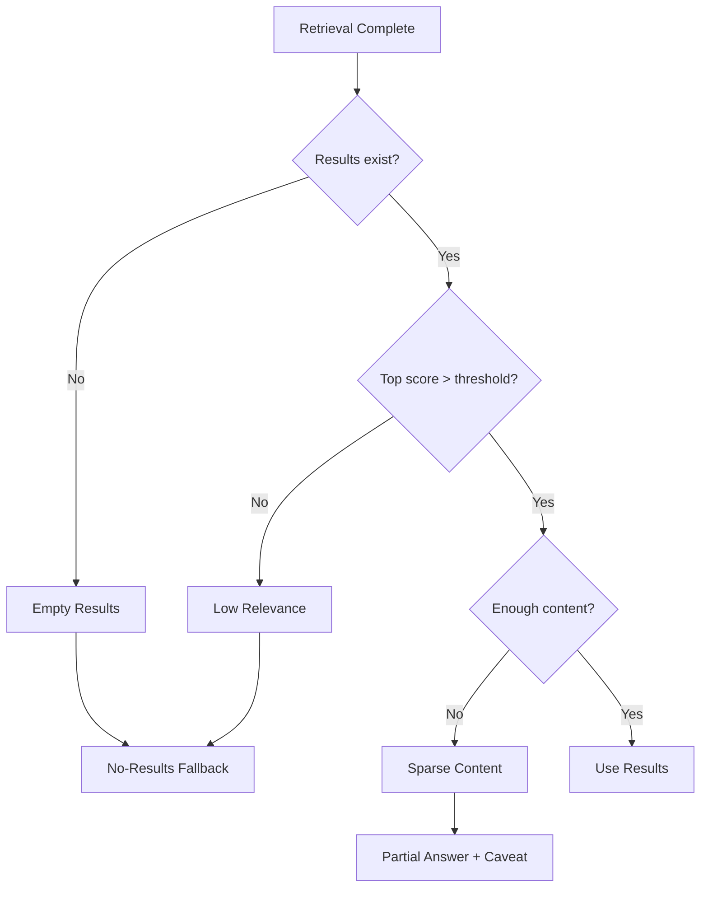

# Handling No-Results Scenarios

## Introduction

One of the most critical moments in a RAG system is when retrieval returns no relevant documents. How you handle this determines whether users receive a helpful response or a frustrating dead end.

This lesson covers techniques for detecting empty results, crafting graceful fallbacks, and guiding users toward successful interactions.

### What We'll Cover

- Detecting empty or low-quality results
- Graceful fallback responses
- User guidance and redirection
- Alternative suggestions
- Escalation patterns

### Prerequisites

- Context injection patterns
- Source usage instructions
- Understanding of retrieval scoring

---

## Detecting Empty Results

### Result Quality Thresholds

```python
from dataclasses import dataclass
from typing import Optional

@dataclass
class RetrievalResult:
    content: str
    source: str
    score: float  # Similarity score (0-1)
    
@dataclass
class QualityThresholds:
    min_score: float = 0.7          # Minimum relevance score
    min_results: int = 1            # Minimum number of results
    min_content_length: int = 50    # Minimum content length
    max_score_gap: float = 0.3      # Max gap between top results

def assess_results(
    results: list[RetrievalResult],
    thresholds: QualityThresholds = None
) -> dict:
    """
    Assess quality of retrieval results.
    """
    thresholds = thresholds or QualityThresholds()
    
    # Empty check
    if not results:
        return {
            "status": "empty",
            "usable": False,
            "reason": "No documents retrieved"
        }
    
    # Score check
    top_score = max(r.score for r in results)
    if top_score < thresholds.min_score:
        return {
            "status": "low_relevance",
            "usable": False,
            "top_score": top_score,
            "reason": f"Top score {top_score:.2f} below threshold {thresholds.min_score}"
        }
    
    # Content length check
    total_content = sum(len(r.content) for r in results)
    if total_content < thresholds.min_content_length:
        return {
            "status": "insufficient_content",
            "usable": False,
            "reason": "Retrieved content too short"
        }
    
    # Filter usable results
    usable = [r for r in results if r.score >= thresholds.min_score]
    
    return {
        "status": "ok",
        "usable": True,
        "usable_count": len(usable),
        "top_score": top_score
    }
```

### Decision Flow



---

## Graceful Fallback Responses

### Response Templates by Scenario

```python
NO_RESULTS_TEMPLATES = {
    "empty": """I don't have any information about {topic} in my knowledge base.

This could mean:
- The topic isn't covered in the available documentation
- Try rephrasing your question with different keywords
- The specific feature or topic may be documented elsewhere

Would you like me to help you with a related topic?""",

    "low_relevance": """I found some documents, but they don't seem directly relevant to your question about {topic}.

The closest matches discuss {related_topics}, which may not be what you're looking for.

Could you:
- Rephrase your question?
- Provide more context?
- Ask about a more specific aspect?""",

    "partial": """I found some information that partially addresses your question, but I don't have complete details about {topic}.

Here's what I found:
{partial_info}

For more comprehensive information, you might want to:
- Check the official documentation
- Contact support
- Explore related topics: {suggestions}""",

    "out_of_scope": """Your question about {topic} appears to be outside the scope of my knowledge base.

I'm designed to help with:
{in_scope_topics}

Is there something else I can assist you with?"""
}

def generate_fallback(
    scenario: str,
    topic: str,
    **kwargs
) -> str:
    """
    Generate appropriate fallback response.
    """
    template = NO_RESULTS_TEMPLATES.get(scenario, NO_RESULTS_TEMPLATES["empty"])
    return template.format(topic=topic, **kwargs)
```

### Prompt Instructions for No-Results

```python
NO_RESULTS_SYSTEM_PROMPT = """## When Context is Insufficient

If the provided context doesn't contain information to answer the question:

1. **Acknowledge clearly**: Start with "I don't have information about..."
2. **Explain why**: "The provided documents discuss X, but not Y"
3. **Stay honest**: Never fabricate information
4. **Be helpful**: Suggest alternatives or related topics
5. **Guide forward**: Offer to help with what IS available

### Response Format for No-Results

❌ DON'T: "I cannot answer that."
✅ DO: "I don't have specific information about [topic] in the provided documents. 
       The documentation covers [related topics]. Would you like details on those?"

❌ DON'T: Make up an answer when context is missing
✅ DO: Acknowledge the gap and redirect constructively
"""
```

---

## User Guidance and Redirection

### Suggesting Reformulations

```python
REFORMULATION_SUGGESTIONS = """## Helping Users Rephrase

When a query doesn't match available content, suggest reformulations:

### For Overly Broad Questions
"Your question about 'how does the API work' is quite broad. 
Could you ask about a specific aspect, such as:
- Authentication methods
- Rate limiting
- Error handling
- Specific endpoints"

### For Overly Specific Questions
"I don't have details about 'error code 42 on Windows 11 with Python 3.12.1'.
Could you ask more generally about:
- Common error codes and their meanings
- Windows-specific setup issues
- Python version compatibility"

### For Misspellings/Wrong Terms
"I don't have information about 'asyncronous'. 
Did you mean 'asynchronous'? I have documentation on:
- Asynchronous programming
- Async/await syntax
- Concurrent operations"
"""

def suggest_reformulations(
    query: str,
    available_topics: list[str]
) -> list[str]:
    """
    Generate query reformulation suggestions.
    """
    suggestions = []
    
    # Find related topics
    query_words = set(query.lower().split())
    for topic in available_topics:
        topic_words = set(topic.lower().split())
        if query_words & topic_words:  # Any overlap
            suggestions.append(f"Try asking about: {topic}")
    
    return suggestions[:3]  # Top 3 suggestions
```

### Available Topics Prompt

```python
def build_scoped_prompt(
    available_topics: list[str],
    max_topics: int = 10
) -> str:
    """
    Include available topics in system prompt.
    """
    topics_str = "\n".join(f"- {t}" for t in available_topics[:max_topics])
    
    return f"""## Knowledge Base Scope

I can help with the following topics:
{topics_str}

If asked about topics not in this list, I should:
1. Acknowledge the topic is outside my current knowledge
2. Suggest related topics I CAN help with
3. Offer to assist with available topics
"""
```

---

## Alternative Suggestions

### Suggesting Related Content

```python
def build_suggestions_prompt(
    context_topics: list[str]
) -> str:
    """
    Prompt that encourages suggesting alternatives.
    """
    return f"""## Suggesting Alternatives

When you cannot fully answer a question, suggest related content:

### Available Topics from Retrieved Context:
{chr(10).join(f'- {topic}' for topic in context_topics)}

### Response Pattern:
"I don't have specific information about [asked topic], but I found related content about:
- [Related topic 1]: Brief description
- [Related topic 2]: Brief description

Would any of these help?"

### Priority Order:
1. Most semantically similar topics
2. Topics from the same category
3. Prerequisite or foundational topics
4. Broader topics that might contain the answer
"""
```

### Dynamic Suggestion System

```python
from typing import Callable

class SuggestionEngine:
    """
    Generate contextual suggestions for no-results scenarios.
    """
    
    def __init__(
        self,
        search_fn: Callable[[str], list[str]]
    ):
        self.search = search_fn
    
    def get_suggestions(
        self,
        failed_query: str,
        num_suggestions: int = 3
    ) -> dict:
        """
        Generate suggestions based on failed query.
        """
        suggestions = {
            "similar_queries": [],
            "related_topics": [],
            "broader_topics": []
        }
        
        # Extract keywords
        keywords = self._extract_keywords(failed_query)
        
        # Search for each keyword
        for keyword in keywords:
            results = self.search(keyword)
            if results:
                suggestions["related_topics"].extend(results[:2])
        
        # Broaden the search
        broader = self._broaden_query(failed_query)
        broader_results = self.search(broader)
        suggestions["broader_topics"] = broader_results[:num_suggestions]
        
        # Deduplicate
        for key in suggestions:
            suggestions[key] = list(dict.fromkeys(suggestions[key]))[:num_suggestions]
        
        return suggestions
    
    def _extract_keywords(self, query: str) -> list[str]:
        """Extract significant keywords from query."""
        stopwords = {'how', 'what', 'why', 'when', 'where', 'the', 'a', 'an', 'is', 'are', 'to', 'for'}
        words = query.lower().split()
        return [w for w in words if w not in stopwords and len(w) > 2]
    
    def _broaden_query(self, query: str) -> str:
        """Create a broader version of the query."""
        keywords = self._extract_keywords(query)
        return " ".join(keywords[:2]) if len(keywords) > 2 else query
    
    def format_suggestions(self, suggestions: dict) -> str:
        """Format suggestions for display."""
        output = []
        
        if suggestions["related_topics"]:
            output.append("**Related topics:**")
            for topic in suggestions["related_topics"]:
                output.append(f"  - {topic}")
        
        if suggestions["broader_topics"]:
            output.append("\n**Broader topics that might help:**")
            for topic in suggestions["broader_topics"]:
                output.append(f"  - {topic}")
        
        return "\n".join(output) if output else "No suggestions available."
```

---

## Escalation Patterns

### When to Escalate

```python
from enum import Enum

class EscalationLevel(Enum):
    NONE = "none"           # Can answer from context
    SUGGEST = "suggest"      # Suggest alternatives
    REDIRECT = "redirect"    # Redirect to other resources
    HUMAN = "human"         # Escalate to human support

def determine_escalation(
    query: str,
    retrieval_status: str,
    attempt_count: int = 1
) -> EscalationLevel:
    """
    Determine appropriate escalation level.
    """
    # Immediate human escalation triggers
    urgent_keywords = ['urgent', 'emergency', 'critical', 'security', 'breach']
    if any(kw in query.lower() for kw in urgent_keywords):
        return EscalationLevel.HUMAN
    
    # Based on retrieval status
    if retrieval_status == "ok":
        return EscalationLevel.NONE
    
    if retrieval_status == "partial":
        return EscalationLevel.SUGGEST
    
    # Multiple failed attempts
    if attempt_count >= 3:
        return EscalationLevel.HUMAN
    
    if retrieval_status in ["empty", "low_relevance"]:
        return EscalationLevel.REDIRECT
    
    return EscalationLevel.SUGGEST
```

### Escalation Response Templates

```python
ESCALATION_TEMPLATES = {
    EscalationLevel.SUGGEST: """I couldn't find a direct answer, but here are some suggestions:

{suggestions}

Would you like to explore any of these?""",

    EscalationLevel.REDIRECT: """I don't have this information in my knowledge base.

Here are some resources that might help:
- Official documentation: {docs_url}
- Community forum: {forum_url}
- FAQ section: {faq_url}

Alternatively, you can rephrase your question.""",

    EscalationLevel.HUMAN: """I'm unable to help with this request from my available information.

**Next steps:**
- For urgent issues: Contact support at {support_email}
- For technical questions: Post in the developer forum
- For account issues: Use the help center

A human representative can better assist you with this."""
}

def build_escalation_response(
    level: EscalationLevel,
    **kwargs
) -> str:
    """
    Build escalation response with context.
    """
    if level == EscalationLevel.NONE:
        return ""  # No escalation needed
    
    template = ESCALATION_TEMPLATES.get(level, ESCALATION_TEMPLATES[EscalationLevel.REDIRECT])
    
    # Fill in defaults for missing values
    defaults = {
        "suggestions": "No specific suggestions available.",
        "docs_url": "docs.example.com",
        "forum_url": "community.example.com",
        "faq_url": "example.com/faq",
        "support_email": "support@example.com"
    }
    
    for key, value in defaults.items():
        if key not in kwargs:
            kwargs[key] = value
    
    return template.format(**kwargs)
```

---

## Complete No-Results Handler

```python
from dataclasses import dataclass
from typing import Optional
from enum import Enum

class ResultStatus(Enum):
    OK = "ok"
    PARTIAL = "partial"
    LOW_RELEVANCE = "low_relevance"
    EMPTY = "empty"

@dataclass
class NoResultsConfig:
    min_score_threshold: float = 0.7
    suggest_alternatives: bool = True
    max_suggestions: int = 3
    allow_escalation: bool = True
    support_email: Optional[str] = None

class NoResultsHandler:
    """
    Handle scenarios when retrieval returns no usable results.
    """
    
    def __init__(self, config: NoResultsConfig = None):
        self.config = config or NoResultsConfig()
    
    def handle(
        self,
        query: str,
        results: list[dict],
        available_topics: list[str] = None
    ) -> dict:
        """
        Process no-results scenario and generate response.
        """
        # Assess results
        status = self._assess_results(results)
        
        # Generate response components
        response = {
            "status": status.value,
            "can_answer": status == ResultStatus.OK,
            "message": "",
            "suggestions": [],
            "escalation": None
        }
        
        if status == ResultStatus.OK:
            response["message"] = "Ready to answer from context."
            return response
        
        # Generate appropriate message
        response["message"] = self._generate_message(status, query)
        
        # Add suggestions
        if self.config.suggest_alternatives and available_topics:
            response["suggestions"] = self._get_suggestions(
                query, available_topics
            )
        
        # Check for escalation
        if self.config.allow_escalation:
            response["escalation"] = self._check_escalation(query, status)
        
        return response
    
    def _assess_results(self, results: list[dict]) -> ResultStatus:
        """Assess quality of retrieval results."""
        if not results:
            return ResultStatus.EMPTY
        
        # Check scores
        top_score = max(r.get("score", 0) for r in results)
        
        if top_score < self.config.min_score_threshold * 0.5:
            return ResultStatus.EMPTY
        elif top_score < self.config.min_score_threshold:
            return ResultStatus.LOW_RELEVANCE
        elif top_score < self.config.min_score_threshold + 0.1:
            return ResultStatus.PARTIAL
        
        return ResultStatus.OK
    
    def _generate_message(self, status: ResultStatus, query: str) -> str:
        """Generate user-facing message."""
        messages = {
            ResultStatus.EMPTY: f"I don't have information about this topic in my knowledge base.",
            ResultStatus.LOW_RELEVANCE: f"I found some documents, but they may not fully address your question.",
            ResultStatus.PARTIAL: f"I found partial information that may help, but it might not be complete."
        }
        return messages.get(status, "Unable to find relevant information.")
    
    def _get_suggestions(
        self,
        query: str,
        topics: list[str]
    ) -> list[str]:
        """Get topic suggestions based on query."""
        query_lower = query.lower()
        
        # Simple keyword matching
        matches = []
        for topic in topics:
            topic_lower = topic.lower()
            # Check for word overlap
            query_words = set(query_lower.split())
            topic_words = set(topic_lower.split())
            if query_words & topic_words:
                matches.append(topic)
        
        return matches[:self.config.max_suggestions]
    
    def _check_escalation(
        self,
        query: str,
        status: ResultStatus
    ) -> Optional[str]:
        """Determine if escalation is needed."""
        urgent_keywords = ['urgent', 'critical', 'emergency', 'security']
        
        if any(kw in query.lower() for kw in urgent_keywords):
            return f"Please contact support: {self.config.support_email or 'support@example.com'}"
        
        if status == ResultStatus.EMPTY:
            return "Consider checking the official documentation or contacting support."
        
        return None
    
    def format_response(self, result: dict) -> str:
        """Format the no-results response for display."""
        parts = [result["message"]]
        
        if result["suggestions"]:
            parts.append("\n**You might try asking about:**")
            for suggestion in result["suggestions"]:
                parts.append(f"- {suggestion}")
        
        if result["escalation"]:
            parts.append(f"\n**Need more help?** {result['escalation']}")
        
        return "\n".join(parts)

# Usage
handler = NoResultsHandler(NoResultsConfig(
    min_score_threshold=0.7,
    suggest_alternatives=True,
    support_email="help@example.com"
))

# Simulate empty results
result = handler.handle(
    query="How do I configure OAuth2?",
    results=[],
    available_topics=["Authentication basics", "API keys", "OAuth overview"]
)

print(handler.format_response(result))
```

---

## Hands-on Exercise

### Your Task

Build a `SmartFallbackSystem` that:
1. Detects result quality
2. Generates appropriate fallback messages
3. Provides contextual suggestions
4. Handles escalation

### Requirements

```python
class SmartFallbackSystem:
    def process(
        self,
        query: str,
        results: list[dict],
        available_topics: list[str]
    ) -> str:
        """
        Return formatted fallback message or 
        None if results are usable.
        """
        pass
```

<details>
<summary>💡 Hints</summary>

- Use score thresholds for quality assessment
- Match query keywords to available topics
- Provide actionable next steps
- Keep messages friendly and helpful

</details>

<details>
<summary>✅ Solution</summary>

```python
class SmartFallbackSystem:
    def __init__(
        self,
        score_threshold: float = 0.7,
        escalation_email: str = "support@example.com"
    ):
        self.score_threshold = score_threshold
        self.escalation_email = escalation_email
    
    def process(
        self,
        query: str,
        results: list[dict],
        available_topics: list[str]
    ) -> str | None:
        """Return fallback message or None if results are usable."""
        
        # Assess results
        status = self._assess(results)
        
        if status == "ok":
            return None  # Results are usable
        
        # Build fallback message
        message_parts = []
        
        # Opening acknowledgment
        if status == "empty":
            message_parts.append(
                f"I don't have information about this topic in my knowledge base."
            )
        elif status == "low_relevance":
            message_parts.append(
                "I found some documents, but they may not directly answer your question."
            )
        
        # Suggestions
        suggestions = self._find_suggestions(query, available_topics)
        if suggestions:
            message_parts.append("\n**Related topics I can help with:**")
            for topic in suggestions:
                message_parts.append(f"- {topic}")
        
        # Guidance
        message_parts.append("\n**Tips:**")
        message_parts.append("- Try rephrasing with different keywords")
        message_parts.append("- Ask about a more specific aspect")
        message_parts.append("- Check if the topic is in a different category")
        
        # Escalation for empty results
        if status == "empty":
            message_parts.append(
                f"\n**Still need help?** Contact {self.escalation_email}"
            )
        
        return "\n".join(message_parts)
    
    def _assess(self, results: list[dict]) -> str:
        """Assess result quality."""
        if not results:
            return "empty"
        
        top_score = max(r.get("score", 0) for r in results)
        
        if top_score < self.score_threshold * 0.5:
            return "empty"
        elif top_score < self.score_threshold:
            return "low_relevance"
        
        return "ok"
    
    def _find_suggestions(
        self,
        query: str,
        topics: list[str],
        max_suggestions: int = 3
    ) -> list[str]:
        """Find relevant topic suggestions."""
        query_words = set(query.lower().split())
        stopwords = {'how', 'what', 'why', 'the', 'a', 'to', 'for', 'is'}
        query_words -= stopwords
        
        scored = []
        for topic in topics:
            topic_words = set(topic.lower().split())
            overlap = len(query_words & topic_words)
            if overlap > 0:
                scored.append((overlap, topic))
        
        scored.sort(reverse=True)
        return [topic for _, topic in scored[:max_suggestions]]

# Test
system = SmartFallbackSystem(
    score_threshold=0.7,
    escalation_email="help@acme.com"
)

# Empty results scenario
fallback = system.process(
    query="How do I implement OAuth2 authentication?",
    results=[],
    available_topics=[
        "Basic authentication",
        "API key authentication",
        "OAuth overview",
        "Session management"
    ]
)

if fallback:
    print(fallback)
else:
    print("Results are usable - proceed with answer")
```

</details>

---

## Summary

Handling no-results gracefully:

✅ **Detect quality** — Use score thresholds to assess results
✅ **Acknowledge honestly** — Never pretend to have answers
✅ **Suggest alternatives** — Match queries to available topics
✅ **Guide users** — Offer reformulation tips
✅ **Escalate when needed** — Know when to involve humans

**Next:** [Hallucination Prevention Techniques](./05-hallucination-prevention.md)

---

## Further Reading

- [OpenAI Best Practices](https://platform.openai.com/docs/guides/prompt-engineering) - Handling edge cases
- [Cohere Grounded Generation](https://docs.cohere.com/docs/crafting-effective-prompts) - Fallback strategies

<!--
Sources Consulted:
- OpenAI prompt engineering guide
- RAG system design best practices
- User experience patterns for conversational AI
-->
