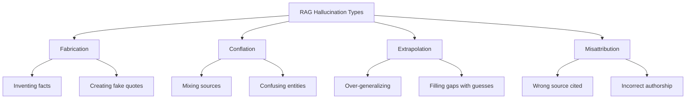

# Hallucination Prevention Techniques

## Introduction

Hallucination—when a model generates plausible-sounding but incorrect information—is one of the biggest risks in RAG systems. Even with perfect retrieval, a model can fabricate facts, misattribute quotes, or confidently state things not in the source material.

This lesson covers prompt engineering techniques to minimize hallucination and maximize grounding in retrieved context.

### What We'll Cover

- Understanding hallucination causes
- Explicit grounding instructions
- Verification prompt patterns
- "If not in context" rules
- Confidence expression
- Fact-checking approaches

### Prerequisites

- Source usage instructions
- No-results handling
- Understanding of LLM behavior

---

## Understanding Hallucination

### Types of RAG Hallucination



| Type | Description | Example |
|------|-------------|---------|
| **Fabrication** | Creating facts not in any source | "The API supports 50 concurrent connections" (when context says nothing about limits) |
| **Conflation** | Mixing information from different sources | Combining features from v1 and v2 docs into non-existent v1.5 |
| **Extrapolation** | Extending beyond what's stated | "Since Python supports X, it also supports Y" (when Y isn't mentioned) |
| **Misattribution** | Crediting wrong source | Attributing a quote to Document A when it came from Document B |

### Why LLMs Hallucinate in RAG

```python
HALLUCINATION_CAUSES = {
    "training_bias": """
        LLMs are trained to always provide helpful answers.
        This bias toward completion can override grounding.
    """,
    
    "context_confusion": """
        With multiple documents, models may blend or confuse sources.
        Similar content from different sources gets mixed.
    """,
    
    "knowledge_bleeding": """
        Pre-training knowledge can override retrieved context.
        Model "remembers" old info instead of using new context.
    """,
    
    "instruction_ambiguity": """
        Vague instructions allow the model to fill gaps.
        "Answer the question" doesn't prevent fabrication.
    """
}
```

---

## Explicit Grounding Instructions

### The Anti-Hallucination Prompt

```python
ANTI_HALLUCINATION_PROMPT = """## Grounding Rules (CRITICAL)

You MUST follow these rules without exception:

1. **ONLY use information explicitly stated in the provided context**
2. **NEVER add information from your training data**
3. **NEVER infer beyond what's directly stated**
4. **NEVER create quotes or statistics not in the context**

### Verification Before Each Claim

Before making any statement, verify:
- Is this EXACTLY stated in the context? → Include it
- Is this implied but not stated? → Say "this is implied but not confirmed"
- Is this not in the context at all? → Do NOT include it

### Forbidden Phrases (Unless Directly Quoted)
- "typically", "usually", "often" (implies general knowledge)
- "it's likely that", "probably" (implies inference)
- Specific numbers/dates not in context
- Named entities not mentioned in context

### When You Don't Know
Say: "The provided context doesn't contain information about [topic]."
Do NOT try to be helpful by guessing or using prior knowledge.
"""
```

### Layered Grounding Approach

```python
def build_layered_grounding_prompt(
    strictness: str = "high"
) -> str:
    """
    Build grounding prompts with different strictness levels.
    """
    layers = {
        "low": """Answer the question using the provided context.
You may supplement with general knowledge when helpful.""",
        
        "medium": """Answer using the provided context as your primary source.
If the context is insufficient, say so rather than guessing.
Clearly distinguish between context-based and general statements.""",
        
        "high": """Answer using ONLY the provided context.
- Do not use any information not in the context
- Do not make inferences beyond what's stated
- Say "I don't have that information" rather than guess""",
        
        "maximum": """Answer using ONLY direct quotes from the context.
- Every claim must be an exact quote
- Use quotation marks and cite sources
- If the answer isn't directly quoted, say so
- No paraphrasing, synthesis, or interpretation"""
    }
    
    base = layers.get(strictness, layers["high"])
    
    return f"""## Grounding Instructions
{base}

## Violation Check
Before responding, verify: "Can I point to the exact text that supports this?"
If not, do not include the statement."""
```

---

## Verification Prompt Patterns

### Pre-Response Verification

```python
VERIFICATION_PROMPT = """## Answer Verification Process

Before providing your final answer, complete these steps:

### Step 1: List Evidence
For each claim you want to make, list the supporting quote:
- Claim: [what you want to say]
- Evidence: "[exact quote from context]" (Source: [name])

### Step 2: Gap Analysis
List any parts of the question NOT addressed by the context:
- [aspect 1]: Not found in context
- [aspect 2]: Partially addressed

### Step 3: Final Answer
Only include claims with evidence from Step 1.
Acknowledge gaps from Step 2.

---

Now apply this process:
"""

def build_verification_chain(context: str, question: str) -> str:
    """
    Build a prompt that forces verification before answering.
    """
    return f"""{VERIFICATION_PROMPT}

Context:
{context}

Question: {question}

Begin with Step 1 (List Evidence):"""
```

### Chain of Verification (CoV)

```python
CHAIN_OF_VERIFICATION = """## Chain of Verification

Answer in two phases:

### Phase 1: Draft Answer
Write your initial answer based on the context.

### Phase 2: Verification Questions
Generate 3-5 questions to verify your answer:
1. Is [claim 1] stated in the context?
2. Does the context support [claim 2]?
3. Is [quote] accurate?

### Phase 3: Answer Verification Questions
For each question:
- YES: [quote supporting evidence]
- NO: [remove this claim from final answer]

### Phase 4: Final Verified Answer
Only include verified claims.

---

Apply this process now:
"""
```

---

## "If Not in Context" Rules

### Explicit Fallback Instructions

```python
IF_NOT_IN_CONTEXT = """## When Information Is Missing

If the context doesn't contain the answer:

✅ DO:
- Say "I don't have information about [specific topic] in the provided documents"
- State what related information IS available
- Suggest what additional information would help
- Offer to answer related questions you CAN answer

❌ DON'T:
- Make up an answer
- Use your training knowledge to fill gaps
- Say "I think" or "probably" without evidence
- Provide partial answers disguised as complete ones

### Response Template for Missing Information
"The provided context doesn't address [specific question]. 
It does include information about [related topics]. 
Would you like me to share what's available about those areas?"
"""

def build_fallback_prompt(
    available_topics: list[str]
) -> str:
    """
    Build prompt with explicit fallback behavior.
    """
    topics_str = ", ".join(available_topics[:5])
    
    return f"""## Handling Missing Information

If the question can't be answered from context:
1. Acknowledge clearly: "The documents don't address this"
2. Share available topics: {topics_str}
3. Offer alternatives: "I can help with [related topic]"

NEVER fabricate an answer when information is missing.
"""
```

### Structured Missing Information Response

```python
MISSING_INFO_STRUCTURE = """## Structure for Missing Information

When information is not in context, use this format:

### Available Information
[What the context DOES contain relevant to the topic]

### Missing Information
[Specifically what was asked that isn't in the context]

### Recommendations
- [Suggestion 1]
- [Suggestion 2]

### What I Can Help With
[Related questions you CAN answer from context]

---

Never skip to "I don't know" without providing value.
Always help the user with what IS available.
"""
```

---

## Confidence Expression

### Confidence Indicators

```python
CONFIDENCE_LEVELS = """## Expressing Confidence

Add confidence indicators to your responses:

### HIGH Confidence (use when):
- Direct quote from context
- Explicit statement in documents
- Multiple sources agree

Format: "According to [source], [claim]." [HIGH]

### MEDIUM Confidence (use when):
- Synthesized from multiple parts
- Implied but not directly stated
- Single source, no corroboration

Format: "Based on [source], it appears that [claim]." [MEDIUM]

### LOW Confidence (use when):
- Extrapolated from context
- Tangentially related information
- Ambiguous source material

Format: "The context suggests [claim], though this isn't explicitly confirmed." [LOW]

### NO Confidence (use when):
- Not in context
- Conflicting information
- Question unanswerable from context

Format: "I cannot confirm [claim] from the provided documents."
"""

def build_confidence_aware_response(
    claim: str,
    evidence: str | None,
    confidence: str
) -> str:
    """
    Format a claim with appropriate confidence expression.
    """
    templates = {
        "high": f'According to the documentation, "{evidence}" This confirms that {claim}. [Confidence: HIGH]',
        "medium": f'Based on the context, {claim}. This is supported by: "{evidence}" [Confidence: MEDIUM]',
        "low": f'The context suggests {claim}, though this isn\'t explicitly stated. [Confidence: LOW]',
        "none": f'I cannot confirm information about this topic from the provided documents.'
    }
    
    return templates.get(confidence.lower(), templates["medium"])
```

### Automatic Confidence Scoring

```python
def score_confidence(
    response: str,
    context: str,
    claims: list[str]
) -> dict:
    """
    Heuristic confidence scoring for response claims.
    """
    results = {}
    
    for claim in claims:
        # Check for exact match
        if claim.lower() in context.lower():
            results[claim] = {"score": "high", "reason": "exact match"}
        # Check for partial match
        elif any(word in context.lower() for word in claim.lower().split()):
            results[claim] = {"score": "medium", "reason": "partial match"}
        else:
            results[claim] = {"score": "low", "reason": "no match found"}
    
    return results

# Usage
context = "Python 3.12 introduced pattern matching improvements."
claims = [
    "Python 3.12 introduced pattern matching",
    "Pattern matching is faster in 3.12"
]

scores = score_confidence("", context, claims)
# First claim: high (exact match)
# Second claim: low (speed not mentioned)
```

---

## Fact-Checking Approaches

### Self-Critique Pattern

```python
SELF_CRITIQUE_PROMPT = """## Self-Critique Before Final Answer

After drafting your answer, critique it:

### Claim Review
For each claim in your answer, ask:
1. Can I quote the exact source text?
2. Am I adding interpretation beyond the source?
3. Would an auditor find this in the context?

### Red Flags to Catch
- Specific numbers not in context
- "Typically" or "usually" statements
- Attributions without source quotes
- Conclusions not directly stated

### Revision
Remove or qualify any statement that:
- Can't be directly quoted
- Extends beyond the context
- Relies on general knowledge

Provide your critique, then your revised answer.
"""
```

### Multi-Pass Verification

```python
class MultiPassVerifier:
    """
    Verify response accuracy through multiple passes.
    """
    
    def __init__(self, llm_client):
        self.client = llm_client
    
    async def verify_response(
        self,
        response: str,
        context: str,
        question: str
    ) -> dict:
        """
        Multi-pass verification of response accuracy.
        """
        results = {
            "original_response": response,
            "claims_verified": [],
            "claims_unverified": [],
            "suggested_revisions": []
        }
        
        # Pass 1: Extract claims
        claims = await self._extract_claims(response)
        
        # Pass 2: Verify each claim
        for claim in claims:
            verification = await self._verify_claim(claim, context)
            if verification["verified"]:
                results["claims_verified"].append({
                    "claim": claim,
                    "evidence": verification["evidence"]
                })
            else:
                results["claims_unverified"].append({
                    "claim": claim,
                    "reason": verification["reason"]
                })
                results["suggested_revisions"].append({
                    "original": claim,
                    "revision": verification.get("suggested_revision", "Remove claim")
                })
        
        # Pass 3: Generate clean response
        results["verified_response"] = await self._generate_clean_response(
            results["claims_verified"],
            question
        )
        
        return results
    
    async def _extract_claims(self, response: str) -> list[str]:
        """Extract factual claims from response."""
        prompt = f"""Extract all factual claims from this response.
Return each claim on a new line.

Response:
{response}

Claims:"""
        
        result = await self.client.chat.completions.create(
            model="gpt-4o",
            messages=[{"role": "user", "content": prompt}],
            temperature=0
        )
        
        return result.choices[0].message.content.strip().split("\n")
    
    async def _verify_claim(
        self,
        claim: str,
        context: str
    ) -> dict:
        """Verify a single claim against context."""
        prompt = f"""Verify if this claim is supported by the context.

Claim: {claim}

Context:
{context}

Response format:
VERIFIED: [yes/no]
EVIDENCE: [exact quote if verified, "none" if not]
REASON: [explanation]
SUGGESTED_REVISION: [if not verified, how to fix]"""
        
        result = await self.client.chat.completions.create(
            model="gpt-4o",
            messages=[{"role": "user", "content": prompt}],
            temperature=0
        )
        
        # Parse response (simplified)
        text = result.choices[0].message.content
        return {
            "verified": "VERIFIED: yes" in text.lower(),
            "evidence": self._extract_field(text, "EVIDENCE"),
            "reason": self._extract_field(text, "REASON"),
            "suggested_revision": self._extract_field(text, "SUGGESTED_REVISION")
        }
    
    def _extract_field(self, text: str, field: str) -> str:
        """Extract a field value from structured text."""
        for line in text.split("\n"):
            if line.upper().startswith(field):
                return line.split(":", 1)[-1].strip()
        return ""
    
    async def _generate_clean_response(
        self,
        verified_claims: list[dict],
        question: str
    ) -> str:
        """Generate response using only verified claims."""
        claims_text = "\n".join(
            f"- {c['claim']} (Evidence: {c['evidence']})"
            for c in verified_claims
        )
        
        prompt = f"""Generate a response using ONLY these verified claims.

Question: {question}

Verified Claims:
{claims_text}

Write a coherent response using only the verified claims above:"""
        
        result = await self.client.chat.completions.create(
            model="gpt-4o",
            messages=[{"role": "user", "content": prompt}],
            temperature=0.3
        )
        
        return result.choices[0].message.content
```

---

## Complete Anti-Hallucination System

```python
from dataclasses import dataclass
from typing import Optional
from enum import Enum

class GroundingMode(Enum):
    RELAXED = "relaxed"
    STRICT = "strict"
    PARANOID = "paranoid"

@dataclass
class AntiHallucinationConfig:
    mode: GroundingMode = GroundingMode.STRICT
    require_quotes: bool = True
    require_confidence: bool = True
    enable_self_critique: bool = True
    max_inference_allowed: bool = False

class AntiHallucinationSystem:
    """
    Comprehensive system to prevent LLM hallucination in RAG.
    """
    
    def __init__(self, config: AntiHallucinationConfig = None):
        self.config = config or AntiHallucinationConfig()
    
    def build_system_prompt(self) -> str:
        """Build complete anti-hallucination system prompt."""
        sections = []
        
        # Core grounding rules
        sections.append(self._grounding_rules())
        
        # Quote requirements
        if self.config.require_quotes:
            sections.append(self._quote_rules())
        
        # Confidence requirements
        if self.config.require_confidence:
            sections.append(self._confidence_rules())
        
        # Self-critique
        if self.config.enable_self_critique:
            sections.append(self._self_critique_rules())
        
        # Missing information handling
        sections.append(self._missing_info_rules())
        
        return "\n\n".join(sections)
    
    def _grounding_rules(self) -> str:
        rules = {
            GroundingMode.RELAXED: """## Grounding
Use the provided context as your primary source. 
You may supplement with general knowledge when context is insufficient,
but clearly indicate when doing so.""",
            
            GroundingMode.STRICT: """## Grounding (STRICT MODE)
Answer using ONLY the provided context.
- Do NOT use information from your training data
- Do NOT make inferences beyond what's stated
- Do NOT fabricate quotes, statistics, or facts
- If the answer isn't in context, say so""",
            
            GroundingMode.PARANOID: """## Grounding (PARANOID MODE)
CRITICAL: Answer using ONLY direct quotes from context.

Rules:
1. Every statement must be a quoted excerpt
2. No paraphrasing or interpretation
3. No synthesis across sources
4. No inference or extrapolation
5. Quote source for EVERY claim

If you cannot quote it directly, do not say it."""
        }
        
        return rules[self.config.mode]
    
    def _quote_rules(self) -> str:
        return """## Quotation Requirements
- Support each claim with a direct quote
- Format: "quoted text" (Source: Document Name)
- Keep quotes accurate - do not modify them
- If you can't quote it, don't claim it"""
    
    def _confidence_rules(self) -> str:
        return """## Confidence Indicators
End your response with a confidence level:
- [HIGH]: Directly quoted from context
- [MEDIUM]: Synthesized from context
- [LOW]: Partially supported
- Explain any LOW confidence ratings"""
    
    def _self_critique_rules(self) -> str:
        return """## Self-Critique (Before Finalizing)
Before your final answer, verify:
1. Can I point to the exact quote for each claim?
2. Am I adding anything not in the documents?
3. Would a human auditor find my sources?

Remove any statement you cannot verify."""
    
    def _missing_info_rules(self) -> str:
        return """## When Information Is Missing
If context doesn't answer the question:
1. Say "The documents don't contain information about [topic]"
2. Share what related info IS available
3. Never fabricate to fill gaps
4. Offer help with what you CAN answer"""
    
    def format_response_template(self) -> str:
        """Template for grounded responses."""
        return """## Response Format

### Answer
[Your response using only quoted context]

### Sources Used
1. [Quote 1] - Source: [Name]
2. [Quote 2] - Source: [Name]

### Information Not Available
[What the question asked that isn't in context]

### Confidence
[HIGH/MEDIUM/LOW] - [Explanation]
"""

# Usage
config = AntiHallucinationConfig(
    mode=GroundingMode.STRICT,
    require_quotes=True,
    require_confidence=True,
    enable_self_critique=True
)

system = AntiHallucinationSystem(config)
system_prompt = system.build_system_prompt()
print(system_prompt)
```

---

## Hands-on Exercise

### Your Task

Build a `HallucinationDetector` that:
1. Analyzes a response for potential hallucinations
2. Checks claims against provided context
3. Flags ungrounded statements
4. Suggests corrections

### Requirements

```python
class HallucinationDetector:
    def analyze(
        self,
        response: str,
        context: str
    ) -> dict:
        """
        Detect potential hallucinations.
        Returns: {
            "claims": [...],
            "grounded_claims": [...],
            "ungrounded_claims": [...],
            "risk_score": float,
            "suggestions": [...]
        }
        """
        pass
```

<details>
<summary>💡 Hints</summary>

- Split response into individual claims (sentences)
- Check if key terms from each claim appear in context
- Look for "red flag" words like "typically", "usually", "likely"
- Calculate risk score as ratio of ungrounded claims

</details>

<details>
<summary>✅ Solution</summary>

```python
import re

class HallucinationDetector:
    def __init__(self):
        # Words that often indicate ungrounded inference
        self.red_flag_words = [
            "typically", "usually", "often", "generally",
            "probably", "likely", "might", "could be",
            "it's possible", "in most cases"
        ]
    
    def analyze(
        self,
        response: str,
        context: str
    ) -> dict:
        """Detect potential hallucinations in response."""
        
        # Extract claims (sentences)
        claims = self._extract_claims(response)
        
        grounded = []
        ungrounded = []
        suggestions = []
        
        context_lower = context.lower()
        
        for claim in claims:
            result = self._check_claim(claim, context_lower)
            
            if result["grounded"]:
                grounded.append({
                    "claim": claim,
                    "evidence": result["evidence"]
                })
            else:
                ungrounded.append({
                    "claim": claim,
                    "reason": result["reason"],
                    "red_flags": result.get("red_flags", [])
                })
                suggestions.append({
                    "original": claim,
                    "suggestion": self._suggest_fix(claim, result["reason"])
                })
        
        total = len(claims) if claims else 1
        risk_score = len(ungrounded) / total
        
        return {
            "claims": claims,
            "grounded_claims": grounded,
            "ungrounded_claims": ungrounded,
            "risk_score": round(risk_score, 2),
            "risk_level": self._risk_level(risk_score),
            "suggestions": suggestions
        }
    
    def _extract_claims(self, response: str) -> list[str]:
        """Split response into individual claims."""
        # Split on sentence boundaries
        sentences = re.split(r'(?<=[.!?])\s+', response)
        # Filter out empty and very short sentences
        return [s.strip() for s in sentences if len(s.strip()) > 10]
    
    def _check_claim(
        self,
        claim: str,
        context: str
    ) -> dict:
        """Check if a claim is grounded in context."""
        claim_lower = claim.lower()
        
        # Check for red flags
        red_flags = [
            word for word in self.red_flag_words
            if word in claim_lower
        ]
        
        if red_flags:
            return {
                "grounded": False,
                "reason": "Contains inference language",
                "red_flags": red_flags
            }
        
        # Extract key terms (nouns, numbers)
        key_terms = self._extract_key_terms(claim)
        
        if not key_terms:
            return {"grounded": True, "evidence": "General statement"}
        
        # Check how many key terms appear in context
        found_terms = [t for t in key_terms if t.lower() in context]
        match_ratio = len(found_terms) / len(key_terms)
        
        if match_ratio >= 0.6:
            return {
                "grounded": True,
                "evidence": f"Key terms found: {found_terms}"
            }
        else:
            missing = [t for t in key_terms if t.lower() not in context]
            return {
                "grounded": False,
                "reason": f"Key terms not in context: {missing}"
            }
    
    def _extract_key_terms(self, claim: str) -> list[str]:
        """Extract key terms from a claim."""
        # Remove common words
        stopwords = {
            'the', 'a', 'an', 'is', 'are', 'was', 'were', 
            'be', 'been', 'being', 'have', 'has', 'had',
            'do', 'does', 'did', 'will', 'would', 'could',
            'should', 'may', 'might', 'must', 'shall',
            'to', 'of', 'in', 'for', 'on', 'with', 'at',
            'by', 'from', 'up', 'about', 'into', 'through',
            'this', 'that', 'these', 'those', 'it', 'its'
        }
        
        # Extract words and numbers
        words = re.findall(r'\b[a-zA-Z]+\b|\b\d+\b', claim)
        return [w for w in words if w.lower() not in stopwords and len(w) > 2]
    
    def _suggest_fix(self, claim: str, reason: str) -> str:
        """Suggest a fix for an ungrounded claim."""
        if "inference language" in reason:
            return "Remove qualifiers like 'typically' or 'usually', or add 'based on the context'"
        elif "not in context" in reason:
            return "Verify this claim exists in the source documents, or remove it"
        return "Add source citation or remove unverified claim"
    
    def _risk_level(self, score: float) -> str:
        """Convert risk score to level."""
        if score < 0.2:
            return "low"
        elif score < 0.5:
            return "medium"
        else:
            return "high"

# Test
detector = HallucinationDetector()

context = """
Python 3.12 introduced improvements to pattern matching.
The release included performance optimizations for the interpreter.
Support for Python 3.11 continues until October 2027.
"""

response = """
Python 3.12 introduced improvements to pattern matching.
The performance improvements typically result in 20% faster execution.
Usually, upgrading is straightforward for most projects.
Python 3.11 is supported until October 2027.
"""

result = detector.analyze(response, context)

print(f"Risk Score: {result['risk_score']} ({result['risk_level']})")
print(f"\nGrounded Claims ({len(result['grounded_claims'])}):")
for c in result['grounded_claims']:
    print(f"  ✓ {c['claim'][:60]}...")

print(f"\nUngrounded Claims ({len(result['ungrounded_claims'])}):")
for c in result['ungrounded_claims']:
    print(f"  ✗ {c['claim'][:60]}...")
    print(f"    Reason: {c['reason']}")
```

</details>

---

## Summary

Preventing hallucination requires:

✅ **Explicit grounding** — Clear instructions to use only context
✅ **Quote requirements** — Force evidence-based claims
✅ **Verification steps** — Check claims before responding
✅ **"If not in context"** — Graceful handling of missing info
✅ **Confidence expression** — Signal reliability of each claim
✅ **Self-critique** — Internal review before final answer

**Next:** [Response Generation and Formatting](../08-response-generation/00-response-generation.md)

---

## Further Reading

- [OpenAI Prompt Engineering](https://platform.openai.com/docs/guides/prompt-engineering) - Grounding techniques
- [Anthropic Claude Prompt Guide](https://docs.anthropic.com/en/docs/build-with-claude/prompt-engineering/overview) - XML and structure
- [Cohere Grounded Generation](https://docs.cohere.com/docs/crafting-effective-prompts) - Citation enforcement

<!--
Sources Consulted:
- OpenAI prompt engineering documentation
- Anthropic prompt engineering guidelines
- Cohere grounded generation docs
- RAG hallucination research papers
-->
