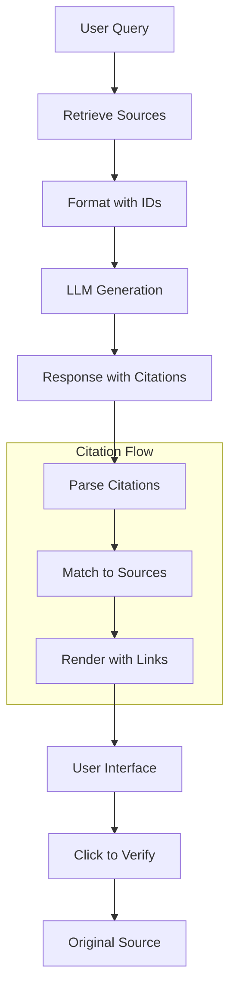

# Source Attribution

## Introduction

Source attribution transforms RAG from "the AI said it" to "the documentation states it." When users can verify claims against original sources, trust increases dramatically and hallucinations become immediately detectable.

This lesson covers techniques for citing sources, linking to documents, and building verifiable AI responses.

### What We'll Cover

- Citation formats (inline, footnotes, academic)
- Deep linking to source documents
- Confidence scoring and display
- Provider-specific patterns (Gemini, OpenAI, Cohere)
- Verifiability features and UX

### Prerequisites

- Prompt design for RAG
- Understanding of retrieval results
- Basic frontend/backend concepts

---

## Quick Start

```python
from openai import OpenAI

client = OpenAI()

def generate_cited_response(
    query: str,
    sources: list[dict]
) -> dict:
    """
    Generate a response with inline citations.
    """
    # Format sources with identifiers
    formatted_sources = format_sources_for_prompt(sources)
    
    response = client.chat.completions.create(
        model="gpt-4o",
        messages=[
            {
                "role": "developer",
                "content": """You are a helpful assistant that answers questions 
using the provided sources. 

CITATION RULES:
- Cite sources using [1], [2], etc. after relevant statements
- Every factual claim must have a citation
- Use multiple citations [1][2] when sources agree
- If sources conflict, note this explicitly
- Say "I don't have information about..." if sources don't cover the topic"""
            },
            {
                "role": "user",
                "content": f"""Sources:
{formatted_sources}

Question: {query}

Provide a well-cited answer:"""
            }
        ],
        temperature=0.3
    )
    
    answer = response.choices[0].message.content
    
    return {
        "answer": answer,
        "sources": sources,
        "citations": extract_citations(answer)
    }

def format_sources_for_prompt(sources: list[dict]) -> str:
    """Format sources with numbered references."""
    formatted = []
    for i, source in enumerate(sources, 1):
        formatted.append(f"[{i}] {source['title']}\n{source['content']}")
    return "\n\n".join(formatted)

def extract_citations(text: str) -> list[int]:
    """Extract citation numbers from response."""
    import re
    citations = re.findall(r'\[(\d+)\]', text)
    return sorted(set(int(c) for c in citations))

# Usage
sources = [
    {
        "title": "Python 3.12 Release Notes",
        "content": "Python 3.12 introduced improved error messages...",
        "url": "https://docs.python.org/3.12/whatsnew.html"
    },
    {
        "title": "Python Performance Guide", 
        "content": "The 3.12 release includes 5-10% performance improvements...",
        "url": "https://speed.python.org/about/"
    }
]

result = generate_cited_response(
    "What's new in Python 3.12?",
    sources
)

print(result["answer"])
# Python 3.12 introduced improved error messages [1] and includes 
# 5-10% performance improvements [2].
```

---

## Source Attribution Architecture



---

## Citation Approaches Comparison

| Approach | Format | Best For | Example |
|----------|--------|----------|---------|
| **Inline Numbers** | `[1]`, `[2]` | Technical docs, research | "The API supports streaming [1]." |
| **Inline Names** | `(Author, Year)` | Academic, formal | "(Smith, 2024)" |
| **Superscript** | `text¹` | Clean UI, articles | "The feature works¹" |
| **Footnotes** | End of response | Long-form content | See references below |
| **Embedded Links** | Hyperlinks | Web interfaces | [Learn more](url) |

---

## Provider Patterns Overview

| Provider | Pattern | Key Features |
|----------|---------|--------------|
| **Gemini** | `groundingMetadata` | Segment-based citations with start/end indices |
| **OpenAI** | `file_citation` annotations | file_id, filename, index position |
| **Cohere** | `documents` parameter | Automatic citation with document IDs |

---

## Key Concepts

| Concept | Description |
|---------|-------------|
| **Grounding** | Connecting responses to verifiable sources |
| **Attribution** | Crediting sources for information |
| **Citation** | Specific reference format (e.g., [1]) |
| **Verification** | User ability to check original source |
| **Confidence** | Score indicating reliability |

---

## Lesson Structure

This lesson is organized into focused sub-lessons:

| Lesson | Topic | What You'll Learn |
|--------|-------|-------------------|
| [01-citation-formats](./01-citation-formats.md) | Citation Formats | Inline, footnote, academic styles |
| [02-linking-to-sources](./02-linking-to-sources.md) | Source Linking | Deep links, page refs, highlights |
| [03-confidence-scoring](./03-confidence-scoring.md) | Confidence Scoring | Retrieval and answer confidence |
| [04-gemini-openai-patterns](./04-gemini-openai-patterns.md) | Provider Patterns | Gemini, OpenAI, Cohere implementations |
| [05-verifiability-features](./05-verifiability-features.md) | Verifiability | Preview, comparison, fact-checking |

---

## Summary

Source attribution is essential for trustworthy RAG:

✅ **Citation formats** — Consistent reference styles
✅ **Deep linking** — Direct access to source content
✅ **Confidence scoring** — Transparency about reliability
✅ **Provider patterns** — Platform-specific implementations
✅ **Verifiability** — User ability to confirm claims

**Next:** [Citation Formats](./01-citation-formats.md)

---

## Further Reading

- [Gemini Grounding with Google Search](https://ai.google.dev/gemini-api/docs/grounding) - groundingMetadata
- [OpenAI File Search](https://platform.openai.com/docs/guides/tools-file-search) - file_citation annotations
- [OpenAI Retrieval API](https://platform.openai.com/docs/guides/retrieval) - Vector store search

<!--
Sources Consulted:
- Gemini API grounding documentation
- OpenAI file search and retrieval docs
- Cohere Chat API reference
-->
