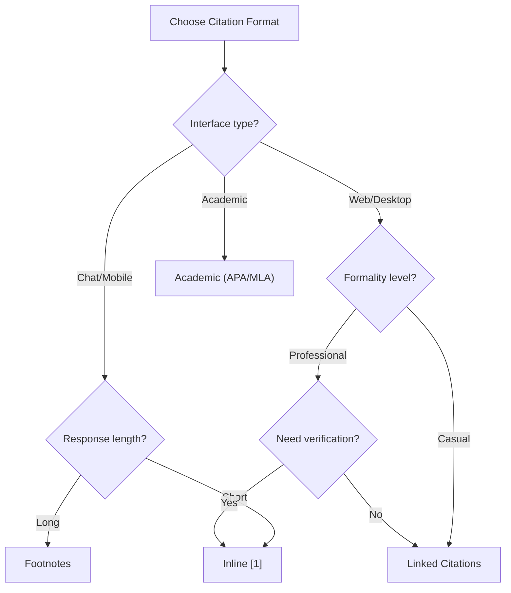

# Citation Formats

## Introduction

Citation format determines how sources are referenced in AI-generated responses. The right format depends on your use case, audience, and interface design. Academic contexts need formal citations, while chat interfaces benefit from simple numbered references.

This lesson covers the major citation formats and when to use each.

### What We'll Cover

- Inline numbered citations [1]
- Footnote-style citations
- Academic citations (Author, Year)
- Document link citations
- Choosing the right format

### Prerequisites

- Understanding of RAG responses
- Basic prompt design
- Source formatting concepts

---

## Inline Numbered Citations

The most common format for RAG systems—simple, scannable, and familiar.

### Basic Pattern

```python
def format_inline_citations(
    sources: list[dict]
) -> tuple[str, str]:
    """
    Format sources for inline numbered citation.
    
    Returns:
        - Formatted sources for prompt
        - Reference list for response footer
    """
    prompt_sources = []
    references = []
    
    for i, source in enumerate(sources, 1):
        # For prompt
        prompt_sources.append(
            f"[{i}] {source['title']}\n{source['content']}"
        )
        
        # For reference list
        references.append(
            f"[{i}] {source['title']} - {source.get('url', 'N/A')}"
        )
    
    return (
        "\n\n".join(prompt_sources),
        "\n".join(references)
    )

# Citation instruction for prompt
INLINE_CITATION_INSTRUCTION = """Cite sources using [1], [2], etc.
- Place citations immediately after the relevant statement
- Use multiple citations [1][2] when sources agree
- Every factual claim needs a citation
- Don't cite for general knowledge statements"""
```

### Example Output

```
Python 3.12 introduced improved error messages [1] and performance 
improvements of 5-10% [2]. The release also includes pattern matching 
enhancements [1][2].

References:
[1] Python 3.12 Release Notes - https://docs.python.org/3.12/
[2] Python Performance Guide - https://speed.python.org/
```

### When to Use

| ✅ Best For | ❌ Avoid When |
|-------------|--------------|
| Chat interfaces | Long-form articles |
| Technical documentation | Academic papers |
| Customer support | Legal documents |
| Quick Q&A | Formal reports |

---

## Footnote-Style Citations

Citations appear at the end of the response, keeping the main text clean.

### Implementation

```python
def format_footnote_citations(
    sources: list[dict]
) -> str:
    """
    Format sources for footnote-style citation.
    """
    source_content = []
    footnotes = []
    
    for i, source in enumerate(sources, 1):
        source_content.append(
            f"Source {i}: {source['title']}\n{source['content']}"
        )
        
        footnotes.append(
            f"{i}. {source['title']}\n"
            f"   URL: {source.get('url', 'N/A')}\n"
            f"   Retrieved: {source.get('date', 'Unknown')}"
        )
    
    return {
        "sources": "\n\n".join(source_content),
        "footnotes": "\n\n".join(footnotes)
    }

FOOTNOTE_INSTRUCTION = """Use superscript numbers¹ ² ³ for citations.
Place all source details in a "References" section at the end.
Number references in order of first appearance."""
```

### Example Output

```
Python 3.12 introduced improved error messages¹ and includes significant 
performance improvements². The release focuses on developer experience 
and runtime efficiency.

---
References:

1. Python 3.12 Release Notes
   URL: https://docs.python.org/3.12/whatsnew/
   Retrieved: January 2026

2. Python Performance Benchmarks
   URL: https://speed.python.org/
   Retrieved: January 2026
```

### When to Use

| ✅ Best For | ❌ Avoid When |
|-------------|--------------|
| Long-form content | Quick chat responses |
| Blog posts | Real-time interactions |
| Documentation | Mobile interfaces |
| Reports | Brief answers |

---

## Academic Citations

Formal citation styles for scholarly or professional contexts.

### Implementation

```python
from dataclasses import dataclass
from typing import Optional

@dataclass
class AcademicSource:
    author: str
    year: int
    title: str
    publication: Optional[str] = None
    url: Optional[str] = None
    pages: Optional[str] = None

def format_apa_citation(source: AcademicSource) -> str:
    """
    Format source in APA style.
    """
    citation = f"{source.author} ({source.year}). {source.title}."
    
    if source.publication:
        citation += f" {source.publication}."
    
    if source.pages:
        citation += f" (pp. {source.pages})."
    
    if source.url:
        citation += f" Retrieved from {source.url}"
    
    return citation

def format_inline_academic(source: AcademicSource) -> str:
    """
    Format inline academic citation.
    """
    return f"({source.author}, {source.year})"

# Citation styles
CITATION_STYLES = {
    "apa": {
        "inline": "(Author, Year)",
        "example": "(Smith, 2024)",
        "instruction": "Cite using (Author, Year) format inline."
    },
    "mla": {
        "inline": "(Author Page)",
        "example": "(Smith 45)",
        "instruction": "Cite using (Author Page) format inline."
    },
    "chicago": {
        "inline": "Footnote number",
        "example": "Statement.¹",
        "instruction": "Use numbered footnotes for citations."
    }
}

ACADEMIC_CITATION_INSTRUCTION = """Use academic citation format:
- Inline: (Author, Year) immediately after the statement
- If quoting directly: (Author, Year, p. X)
- Full reference in References section
- Follow APA 7th edition guidelines"""
```

### Example Output

```
Recent research indicates that large language models can exhibit 
emergent capabilities at scale (Wei et al., 2022). This phenomenon 
has been observed across multiple model families (Brown et al., 2020; 
Chowdhery et al., 2023).

References:
Brown, T., et al. (2020). Language models are few-shot learners. 
   Advances in Neural Information Processing Systems.

Chowdhery, A., et al. (2023). PaLM: Scaling language modeling with 
   pathways. Journal of Machine Learning Research.

Wei, J., et al. (2022). Emergent abilities of large language models. 
   Transactions on Machine Learning Research.
```

### When to Use

| ✅ Best For | ❌ Avoid When |
|-------------|--------------|
| Research tools | Casual chat |
| Academic assistants | Customer support |
| Legal research | Quick lookups |
| Medical information | General Q&A |

---

## Document Link Citations

Hyperlinked citations for web interfaces.

### Implementation

```python
def format_linked_citations(
    sources: list[dict],
    link_style: str = "markdown"
) -> str:
    """
    Format sources with clickable links.
    """
    formatted = []
    
    for i, source in enumerate(sources, 1):
        title = source['title']
        url = source.get('url', '#')
        
        if link_style == "markdown":
            formatted.append(f"[{i}] [{title}]({url})\n{source['content']}")
        
        elif link_style == "html":
            formatted.append(
                f'[{i}] <a href="{url}" target="_blank">{title}</a>\n'
                f'{source["content"]}'
            )
        
        elif link_style == "reference":
            formatted.append(
                f"[{i}] {title}\n"
                f"    Link: {url}\n"
                f"    {source['content']}"
            )
    
    return "\n\n".join(formatted)

LINKED_CITATION_INSTRUCTION = """When citing sources:
- Use [Source Title](url) for direct links
- Or use [1] with a linked reference list
- Make citations clickable when possible
- Include deep links to specific sections when available"""
```

### Example Output (Markdown)

```
Python 3.12 introduced improved error messages [1] and performance 
improvements [2].

**Sources:**
1. [Python 3.12 Release Notes](https://docs.python.org/3.12/)
2. [Python Speed Center](https://speed.python.org/)
```

---

## Choosing the Right Format



### Decision Matrix

| Factor | Inline [1] | Footnotes | Academic | Links |
|--------|------------|-----------|----------|-------|
| **Speed to verify** | Fast | Medium | Slow | Fastest |
| **Visual clutter** | Low | Very Low | Medium | Low |
| **Formality** | Medium | Medium | High | Low |
| **Mobile-friendly** | Yes | Okay | No | Yes |
| **Copy-paste safe** | Yes | Yes | Yes | No |

---

## Citation Formatter Class

```python
from enum import Enum
from dataclasses import dataclass
from typing import Optional

class CitationStyle(Enum):
    INLINE = "inline"
    FOOTNOTE = "footnote"
    ACADEMIC = "academic"
    LINKED = "linked"

@dataclass
class Source:
    id: str
    title: str
    content: str
    url: Optional[str] = None
    author: Optional[str] = None
    date: Optional[str] = None
    page: Optional[str] = None

class CitationFormatter:
    """
    Format citations in various styles.
    """
    
    def __init__(self, style: CitationStyle = CitationStyle.INLINE):
        self.style = style
    
    def format_sources(
        self,
        sources: list[Source]
    ) -> dict:
        """
        Format sources according to configured style.
        """
        formatters = {
            CitationStyle.INLINE: self._format_inline,
            CitationStyle.FOOTNOTE: self._format_footnote,
            CitationStyle.ACADEMIC: self._format_academic,
            CitationStyle.LINKED: self._format_linked,
        }
        
        formatter = formatters[self.style]
        return formatter(sources)
    
    def get_instruction(self) -> str:
        """
        Get citation instruction for prompt.
        """
        instructions = {
            CitationStyle.INLINE: (
                "Cite sources using [1], [2] immediately after statements. "
                "Use multiple citations [1][2] when sources agree."
            ),
            CitationStyle.FOOTNOTE: (
                "Use superscript numbers¹² for citations. "
                "List all references at the end of your response."
            ),
            CitationStyle.ACADEMIC: (
                "Use academic citations: (Author, Year). "
                "Include full references in APA format at the end."
            ),
            CitationStyle.LINKED: (
                "Cite using [Source Title](url) format. "
                "Make all citations clickable links."
            ),
        }
        return instructions[self.style]
    
    def _format_inline(self, sources: list[Source]) -> dict:
        prompt_sources = []
        references = []
        
        for i, source in enumerate(sources, 1):
            prompt_sources.append(f"[{i}] {source.title}\n{source.content}")
            ref = f"[{i}] {source.title}"
            if source.url:
                ref += f" - {source.url}"
            references.append(ref)
        
        return {
            "prompt_sources": "\n\n".join(prompt_sources),
            "references": "\n".join(references),
            "instruction": self.get_instruction()
        }
    
    def _format_footnote(self, sources: list[Source]) -> dict:
        prompt_sources = []
        footnotes = []
        
        for i, source in enumerate(sources, 1):
            prompt_sources.append(f"Source {i}: {source.title}\n{source.content}")
            footnote = f"{i}. {source.title}"
            if source.url:
                footnote += f"\n   URL: {source.url}"
            if source.date:
                footnote += f"\n   Retrieved: {source.date}"
            footnotes.append(footnote)
        
        return {
            "prompt_sources": "\n\n".join(prompt_sources),
            "footnotes": "\n\n".join(footnotes),
            "instruction": self.get_instruction()
        }
    
    def _format_academic(self, sources: list[Source]) -> dict:
        prompt_sources = []
        references = []
        
        for source in sources:
            author = source.author or "Unknown"
            year = source.date[:4] if source.date else "n.d."
            
            prompt_sources.append(
                f"{author} ({year}): {source.title}\n{source.content}"
            )
            
            ref = f"{author} ({year}). {source.title}."
            if source.url:
                ref += f" Retrieved from {source.url}"
            references.append(ref)
        
        return {
            "prompt_sources": "\n\n".join(prompt_sources),
            "references": "\n\n".join(references),
            "instruction": self.get_instruction()
        }
    
    def _format_linked(self, sources: list[Source]) -> dict:
        prompt_sources = []
        
        for i, source in enumerate(sources, 1):
            url = source.url or "#"
            prompt_sources.append(
                f"[{i}] [{source.title}]({url})\n{source.content}"
            )
        
        return {
            "prompt_sources": "\n\n".join(prompt_sources),
            "instruction": self.get_instruction()
        }

# Usage
sources = [
    Source(
        id="1",
        title="Python 3.12 Release Notes",
        content="Python 3.12 introduces improved error messages...",
        url="https://docs.python.org/3.12/",
        author="Python Core Team",
        date="2024-10-01"
    ),
]

formatter = CitationFormatter(CitationStyle.INLINE)
formatted = formatter.format_sources(sources)
print(formatted["prompt_sources"])
print(formatted["instruction"])
```

---

## Hands-on Exercise

### Your Task

Create a `MultiStyleCitationSystem` that:
1. Supports multiple citation styles
2. Converts between formats
3. Validates citations in responses
4. Generates appropriate prompts

### Requirements

```python
class MultiStyleCitationSystem:
    def format_for_style(
        self,
        sources: list[dict],
        style: str
    ) -> dict:
        """Format sources for specified style."""
        pass
    
    def validate_citations(
        self,
        response: str,
        sources: list[dict],
        style: str
    ) -> dict:
        """Check if response properly cites sources."""
        pass
```

<details>
<summary>💡 Hints</summary>

- Use regex to detect citation patterns
- Check that citation numbers don't exceed source count
- Validate that key claims have citations
- Consider partial citations (some but not all)

</details>

<details>
<summary>✅ Solution</summary>

```python
import re
from typing import Optional

class MultiStyleCitationSystem:
    def __init__(self):
        self.styles = {
            "inline": {
                "pattern": r'\[(\d+)\]',
                "format": lambda i, s: f"[{i}] {s['title']}\n{s['content']}"
            },
            "footnote": {
                "pattern": r'[¹²³⁴⁵⁶⁷⁸⁹⁰]+',
                "format": lambda i, s: f"Source {i}: {s['title']}\n{s['content']}"
            },
            "academic": {
                "pattern": r'\([A-Za-z]+(?:\s+et\s+al\.)?,\s*\d{4}\)',
                "format": lambda i, s: f"{s.get('author', 'Unknown')} ({s.get('year', 'n.d.')}): {s['content']}"
            },
            "linked": {
                "pattern": r'\[([^\]]+)\]\([^\)]+\)',
                "format": lambda i, s: f"[{s['title']}]({s.get('url', '#')})\n{s['content']}"
            }
        }
    
    def format_for_style(
        self,
        sources: list[dict],
        style: str
    ) -> dict:
        """Format sources for specified style."""
        if style not in self.styles:
            raise ValueError(f"Unknown style: {style}")
        
        style_config = self.styles[style]
        formatted_sources = []
        
        for i, source in enumerate(sources, 1):
            formatted_sources.append(
                style_config["format"](i, source)
            )
        
        # Generate instruction
        instructions = {
            "inline": "Cite using [1], [2] after statements.",
            "footnote": "Use superscript ¹² for citations, list at end.",
            "academic": "Cite using (Author, Year) format.",
            "linked": "Cite using [Title](url) markdown links."
        }
        
        return {
            "sources": "\n\n".join(formatted_sources),
            "instruction": instructions[style],
            "style": style
        }
    
    def validate_citations(
        self,
        response: str,
        sources: list[dict],
        style: str
    ) -> dict:
        """Check if response properly cites sources."""
        if style not in self.styles:
            raise ValueError(f"Unknown style: {style}")
        
        pattern = self.styles[style]["pattern"]
        matches = re.findall(pattern, response)
        
        result = {
            "style": style,
            "has_citations": len(matches) > 0,
            "citation_count": len(matches),
            "source_count": len(sources),
            "issues": []
        }
        
        # Style-specific validation
        if style == "inline":
            citation_nums = [int(m) for m in matches if m.isdigit()]
            max_citation = max(citation_nums) if citation_nums else 0
            
            if max_citation > len(sources):
                result["issues"].append(
                    f"Citation [{max_citation}] exceeds source count ({len(sources)})"
                )
            
            # Check for unused sources
            used = set(citation_nums)
            unused = set(range(1, len(sources) + 1)) - used
            if unused:
                result["issues"].append(
                    f"Sources not cited: {sorted(unused)}"
                )
        
        elif style == "academic":
            # Check if author names match sources
            source_authors = {s.get("author", "").split()[0].lower() for s in sources}
            cited_authors = {m.split(",")[0].strip("()").lower() for m in matches}
            
            unknown = cited_authors - source_authors - {"et"}
            if unknown:
                result["issues"].append(
                    f"Unknown authors cited: {unknown}"
                )
        
        # Overall assessment
        result["is_valid"] = len(result["issues"]) == 0 and result["has_citations"]
        
        return result
    
    def convert_style(
        self,
        response: str,
        sources: list[dict],
        from_style: str,
        to_style: str
    ) -> str:
        """Convert citations from one style to another."""
        # This is a simplified conversion
        # Full implementation would need more sophisticated parsing
        
        if from_style == "inline" and to_style == "academic":
            # Convert [1] to (Author, Year)
            for i, source in enumerate(sources, 1):
                author = source.get("author", "Unknown").split()[0]
                year = source.get("year", "n.d.")
                response = response.replace(f"[{i}]", f"({author}, {year})")
        
        elif from_style == "inline" and to_style == "linked":
            # Convert [1] to [Title](url)
            for i, source in enumerate(sources, 1):
                title = source.get("title", f"Source {i}")
                url = source.get("url", "#")
                response = response.replace(f"[{i}]", f"[{title}]({url})")
        
        return response

# Test
system = MultiStyleCitationSystem()

sources = [
    {"title": "Python Docs", "content": "...", "author": "PSF", "year": "2024", "url": "https://python.org"},
    {"title": "Performance Guide", "content": "...", "author": "Smith", "year": "2023", "url": "https://example.com"}
]

# Format for inline
formatted = system.format_for_style(sources, "inline")
print(formatted["instruction"])

# Validate a response
response = "Python improved error messages [1] and performance [2][3]."
validation = system.validate_citations(response, sources, "inline")
print(f"Valid: {validation['is_valid']}")
print(f"Issues: {validation['issues']}")

# Convert style
converted = system.convert_style(
    "The documentation states [1].",
    sources,
    "inline",
    "linked"
)
print(converted)
```

</details>

---

## Summary

Citation format affects usability and trust:

✅ **Inline [1]** — Fast, scannable, best for chat
✅ **Footnotes** — Clean text, best for long-form
✅ **Academic** — Formal, best for research
✅ **Linked** — Interactive, best for web

**Next:** [Linking to Source Documents](./02-linking-to-sources.md)

---

## Further Reading

- [APA Citation Guide](https://apastyle.apa.org/) - Academic style reference
- [Chicago Manual of Style](https://www.chicagomanualofstyle.org/) - Footnote conventions

<!--
Sources Consulted:
- APA style guidelines
- Common RAG citation patterns
- UX research on source attribution
-->
