# Confidence Scoring

## Introduction

Not all sources are equally relevant, and not all answers are equally reliable. Confidence scoring provides transparency about how well sources match the query and how much trust users should place in the response.

This lesson covers techniques for calculating, displaying, and acting on confidence scores.

### What We'll Cover

- Retrieval confidence scores
- Answer confidence scoring
- Threshold-based decisions
- Displaying confidence to users
- Warning systems

### Prerequisites

- Understanding of vector similarity
- Retrieval strategies
- Source attribution basics

---

## Retrieval Confidence Scores

### Understanding Similarity Scores

```python
from dataclasses import dataclass
from typing import Optional

@dataclass
class RetrievalResult:
    content: str
    source: str
    score: float  # Similarity score (0-1 for cosine, varies for others)
    
    @property
    def confidence_level(self) -> str:
        """Convert score to human-readable confidence."""
        if self.score >= 0.85:
            return "HIGH"
        elif self.score >= 0.70:
            return "MEDIUM"
        elif self.score >= 0.50:
            return "LOW"
        else:
            return "VERY_LOW"

def normalize_score(
    score: float,
    score_type: str = "cosine"
) -> float:
    """
    Normalize different score types to 0-1 range.
    """
    if score_type == "cosine":
        # Cosine similarity: -1 to 1, but usually 0 to 1 for normalized vectors
        return max(0, min(1, score))
    
    elif score_type == "dot_product":
        # Dot product can be any value; apply sigmoid
        import math
        return 1 / (1 + math.exp(-score))
    
    elif score_type == "euclidean":
        # Euclidean distance: 0 to inf, lower is better
        # Convert to similarity
        return 1 / (1 + score)
    
    elif score_type == "bm25":
        # BM25: 0 to inf, apply normalization
        return min(1, score / 20)  # Rough normalization
    
    return score
```

### Score Interpretation

| Score Range | Confidence | Interpretation |
|-------------|------------|----------------|
| 0.85 - 1.00 | HIGH | Very relevant, likely contains answer |
| 0.70 - 0.84 | MEDIUM | Relevant, may need synthesis |
| 0.50 - 0.69 | LOW | Partially relevant, use with caution |
| 0.00 - 0.49 | VERY_LOW | Weak match, may not answer query |

### Aggregate Retrieval Confidence

```python
from dataclasses import dataclass
from typing import Optional
import statistics

@dataclass
class RetrievalConfidence:
    """
    Aggregate confidence metrics for retrieval results.
    """
    top_score: float
    mean_score: float
    score_spread: float
    result_count: int
    above_threshold_count: int

def calculate_retrieval_confidence(
    results: list[dict],
    threshold: float = 0.7
) -> RetrievalConfidence:
    """
    Calculate aggregate confidence from retrieval results.
    """
    if not results:
        return RetrievalConfidence(
            top_score=0.0,
            mean_score=0.0,
            score_spread=0.0,
            result_count=0,
            above_threshold_count=0
        )
    
    scores = [r["score"] for r in results]
    
    return RetrievalConfidence(
        top_score=max(scores),
        mean_score=statistics.mean(scores),
        score_spread=max(scores) - min(scores) if len(scores) > 1 else 0,
        result_count=len(results),
        above_threshold_count=sum(1 for s in scores if s >= threshold)
    )

def interpret_retrieval_confidence(
    conf: RetrievalConfidence
) -> dict:
    """
    Interpret retrieval confidence for decision making.
    """
    interpretation = {
        "can_answer": False,
        "confidence_level": "LOW",
        "recommendation": "",
        "warnings": []
    }
    
    # High confidence: top result is very relevant
    if conf.top_score >= 0.85:
        interpretation["can_answer"] = True
        interpretation["confidence_level"] = "HIGH"
        interpretation["recommendation"] = "Answer directly from sources"
    
    # Medium confidence: good results available
    elif conf.top_score >= 0.70:
        interpretation["can_answer"] = True
        interpretation["confidence_level"] = "MEDIUM"
        interpretation["recommendation"] = "Answer with appropriate caveats"
        
        if conf.score_spread > 0.3:
            interpretation["warnings"].append(
                "Large score variance - sources may have conflicting relevance"
            )
    
    # Low confidence: marginal results
    elif conf.top_score >= 0.50:
        interpretation["can_answer"] = True
        interpretation["confidence_level"] = "LOW"
        interpretation["recommendation"] = "Answer with low-confidence warning"
        interpretation["warnings"].append(
            "Results are only partially relevant"
        )
    
    # Very low confidence: poor results
    else:
        interpretation["can_answer"] = False
        interpretation["confidence_level"] = "VERY_LOW"
        interpretation["recommendation"] = "Decline to answer or ask for clarification"
        interpretation["warnings"].append(
            "No sufficiently relevant sources found"
        )
    
    return interpretation
```

---

## Answer Confidence Scoring

### Claim-Level Confidence

```python
from dataclasses import dataclass
from typing import Optional

@dataclass
class AnswerClaim:
    """
    Individual claim in an answer with confidence.
    """
    text: str
    source_citations: list[int]
    confidence: float
    evidence_type: str  # "direct_quote", "synthesis", "inference"

@dataclass
class AnswerConfidence:
    """
    Confidence assessment for complete answer.
    """
    overall_score: float
    claims: list[AnswerClaim]
    grounding_ratio: float  # % of claims with citations
    source_coverage: float  # % of sources used

def assess_answer_confidence(
    answer: str,
    sources: list[dict],
    citations_found: list[int]
) -> AnswerConfidence:
    """
    Assess confidence of generated answer.
    """
    # Simple sentence-based claim extraction
    import re
    sentences = re.split(r'(?<=[.!?])\s+', answer)
    
    claims = []
    for sentence in sentences:
        if len(sentence) < 10:  # Skip very short sentences
            continue
        
        # Find citations in this sentence
        citation_nums = [int(c) for c in re.findall(r'\[(\d+)\]', sentence)]
        
        # Determine evidence type
        if citation_nums:
            evidence_type = "direct" if len(citation_nums) == 1 else "synthesis"
            confidence = 0.9 if evidence_type == "direct" else 0.8
        else:
            evidence_type = "unsupported"
            confidence = 0.3
        
        claims.append(AnswerClaim(
            text=sentence,
            source_citations=citation_nums,
            confidence=confidence,
            evidence_type=evidence_type
        ))
    
    # Calculate overall metrics
    cited_claims = sum(1 for c in claims if c.source_citations)
    grounding_ratio = cited_claims / len(claims) if claims else 0
    
    sources_used = set(citations_found)
    source_coverage = len(sources_used) / len(sources) if sources else 0
    
    # Overall score
    claim_scores = [c.confidence for c in claims]
    overall = sum(claim_scores) / len(claim_scores) if claim_scores else 0
    
    return AnswerConfidence(
        overall_score=overall,
        claims=claims,
        grounding_ratio=grounding_ratio,
        source_coverage=source_coverage
    )
```

### Confidence Factors

```mermaid
flowchart TD
    Answer["Answer Confidence"] --> F1["Source Quality"]
    Answer --> F2["Citation Coverage"]
    Answer --> F3["Claim Consistency"]
    Answer --> F4["Evidence Type"]
    
    F1 --> Q1["High retrieval scores?"]
    F2 --> Q2["All claims cited?"]
    F3 --> Q3["No contradictions?"]
    F4 --> Q4["Direct quotes?"]
    
    Q1 -->|Yes| High1["↑ Confidence"]
    Q2 -->|Yes| High2["↑ Confidence"]
    Q3 -->|Yes| High3["↑ Confidence"]
    Q4 -->|Yes| High4["↑ Confidence"]
```



---

## Threshold-Based Decisions

### Configurable Thresholds

```python
from dataclasses import dataclass
from enum import Enum

class ResponseAction(Enum):
    ANSWER_DIRECT = "answer_directly"
    ANSWER_WITH_CAVEAT = "answer_with_caveat"
    ANSWER_LOW_CONFIDENCE = "answer_low_confidence"
    DECLINE_SUGGEST = "decline_and_suggest"
    DECLINE_ESCALATE = "decline_and_escalate"

@dataclass
class ConfidenceThresholds:
    """
    Configurable thresholds for confidence-based decisions.
    """
    high_confidence: float = 0.85
    medium_confidence: float = 0.70
    low_confidence: float = 0.50
    minimum_confidence: float = 0.30
    
    min_sources_required: int = 1
    min_grounding_ratio: float = 0.7

def determine_action(
    retrieval_confidence: RetrievalConfidence,
    answer_confidence: AnswerConfidence,
    thresholds: ConfidenceThresholds
) -> ResponseAction:
    """
    Determine response action based on confidence.
    """
    ret_score = retrieval_confidence.top_score
    ans_score = answer_confidence.overall_score
    grounding = answer_confidence.grounding_ratio
    
    # High confidence path
    if (ret_score >= thresholds.high_confidence and 
        ans_score >= thresholds.high_confidence and
        grounding >= thresholds.min_grounding_ratio):
        return ResponseAction.ANSWER_DIRECT
    
    # Medium confidence path
    if (ret_score >= thresholds.medium_confidence and
        ans_score >= thresholds.medium_confidence):
        return ResponseAction.ANSWER_WITH_CAVEAT
    
    # Low confidence path
    if (ret_score >= thresholds.low_confidence and
        ans_score >= thresholds.low_confidence):
        return ResponseAction.ANSWER_LOW_CONFIDENCE
    
    # Below minimum - decline
    if ret_score >= thresholds.minimum_confidence:
        return ResponseAction.DECLINE_SUGGEST
    
    return ResponseAction.DECLINE_ESCALATE
```

### Action Templates

```python
ACTION_TEMPLATES = {
    ResponseAction.ANSWER_DIRECT: {
        "prefix": "",
        "suffix": "",
        "show_confidence": False
    },
    ResponseAction.ANSWER_WITH_CAVEAT: {
        "prefix": "Based on the available documentation, ",
        "suffix": "\n\n*Note: This answer is based on available sources and may not be complete.*",
        "show_confidence": True
    },
    ResponseAction.ANSWER_LOW_CONFIDENCE: {
        "prefix": "⚠️ **Limited information available:**\n\n",
        "suffix": (
            "\n\n*This response has lower confidence. "
            "Please verify with official documentation.*"
        ),
        "show_confidence": True
    },
    ResponseAction.DECLINE_SUGGEST: {
        "prefix": "",
        "suffix": "",
        "message": (
            "I don't have enough reliable information to answer this question. "
            "Here are some suggestions:\n{suggestions}"
        ),
        "show_confidence": False
    },
    ResponseAction.DECLINE_ESCALATE: {
        "prefix": "",
        "suffix": "",
        "message": (
            "I cannot find relevant information in my knowledge base. "
            "Please contact support or check the official documentation."
        ),
        "show_confidence": False
    }
}

def apply_action_template(
    action: ResponseAction,
    answer: str = "",
    confidence: Optional[float] = None,
    suggestions: Optional[list[str]] = None
) -> str:
    """
    Apply action template to response.
    """
    template = ACTION_TEMPLATES[action]
    
    if "message" in template:
        # Decline actions
        msg = template["message"]
        if suggestions:
            suggestion_text = "\n".join(f"- {s}" for s in suggestions)
            msg = msg.format(suggestions=suggestion_text)
        return msg
    
    # Answer actions
    result = template["prefix"] + answer + template["suffix"]
    
    if template["show_confidence"] and confidence:
        result += f"\n\n📊 Confidence: {confidence:.0%}"
    
    return result
```

---

## Displaying Confidence to Users

### Visual Indicators

```python
def format_confidence_indicator(
    score: float,
    style: str = "emoji"
) -> str:
    """
    Format confidence as visual indicator.
    """
    if style == "emoji":
        if score >= 0.85:
            return "🟢 High confidence"
        elif score >= 0.70:
            return "🟡 Medium confidence"
        elif score >= 0.50:
            return "🟠 Low confidence"
        else:
            return "🔴 Very low confidence"
    
    elif style == "bar":
        filled = int(score * 10)
        empty = 10 - filled
        return f"[{'█' * filled}{'░' * empty}] {score:.0%}"
    
    elif style == "stars":
        stars = int(score * 5)
        return "★" * stars + "☆" * (5 - stars)
    
    elif style == "text":
        if score >= 0.85:
            return "HIGH"
        elif score >= 0.70:
            return "MEDIUM"
        elif score >= 0.50:
            return "LOW"
        else:
            return "VERY LOW"
    
    return f"{score:.0%}"

# Examples
print(format_confidence_indicator(0.88, "emoji"))   # 🟢 High confidence
print(format_confidence_indicator(0.75, "bar"))     # [███████░░░] 75%
print(format_confidence_indicator(0.90, "stars"))   # ★★★★☆
```

### Confidence in Citations

```python
def format_citation_with_confidence(
    citation_num: int,
    source_title: str,
    confidence: float
) -> str:
    """
    Format citation with confidence indicator.
    """
    indicator = format_confidence_indicator(confidence, "emoji").split()[0]
    return f"[{citation_num}] {indicator} {source_title}"

def build_sources_section(
    sources: list[dict]
) -> str:
    """
    Build sources section with confidence scores.
    """
    lines = ["### Sources"]
    
    for i, source in enumerate(sources, 1):
        score = source.get("score", 0)
        title = source.get("title", "Unknown")
        url = source.get("url", "")
        
        indicator = format_confidence_indicator(score, "emoji").split()[0]
        
        if url:
            lines.append(f"{indicator} [{i}] [{title}]({url}) ({score:.0%})")
        else:
            lines.append(f"{indicator} [{i}] {title} ({score:.0%})")
    
    return "\n".join(lines)

# Example output:
# ### Sources
# 🟢 [1] [Python 3.12 Release](url) (89%)
# 🟡 [2] [Performance Guide](url) (72%)
# 🟠 [3] [FAQ](url) (58%)
```

---

## Warning Systems

### Threshold-Based Warnings

```python
from dataclasses import dataclass
from enum import Enum
from typing import Optional

class WarningLevel(Enum):
    INFO = "info"
    CAUTION = "caution"
    WARNING = "warning"
    CRITICAL = "critical"

@dataclass
class ConfidenceWarning:
    level: WarningLevel
    message: str
    details: Optional[str] = None

def generate_warnings(
    retrieval_conf: RetrievalConfidence,
    answer_conf: AnswerConfidence
) -> list[ConfidenceWarning]:
    """
    Generate appropriate warnings based on confidence.
    """
    warnings = []
    
    # Low retrieval confidence
    if retrieval_conf.top_score < 0.5:
        warnings.append(ConfidenceWarning(
            level=WarningLevel.WARNING,
            message="Source relevance is low",
            details="The retrieved documents may not directly answer your question."
        ))
    elif retrieval_conf.top_score < 0.7:
        warnings.append(ConfidenceWarning(
            level=WarningLevel.CAUTION,
            message="Moderate source relevance",
            details="Some information may be inferred rather than directly stated."
        ))
    
    # Low grounding
    if answer_conf.grounding_ratio < 0.5:
        warnings.append(ConfidenceWarning(
            level=WarningLevel.WARNING,
            message="Limited source citations",
            details="Many statements in this answer are not directly cited."
        ))
    
    # Single source
    if retrieval_conf.above_threshold_count == 1:
        warnings.append(ConfidenceWarning(
            level=WarningLevel.INFO,
            message="Single source answer",
            details="This answer is based on only one source document."
        ))
    
    # Large score spread
    if retrieval_conf.score_spread > 0.4:
        warnings.append(ConfidenceWarning(
            level=WarningLevel.CAUTION,
            message="Variable source quality",
            details="Retrieved sources have significantly different relevance scores."
        ))
    
    return warnings

def format_warnings(
    warnings: list[ConfidenceWarning]
) -> str:
    """
    Format warnings for display.
    """
    if not warnings:
        return ""
    
    icons = {
        WarningLevel.INFO: "ℹ️",
        WarningLevel.CAUTION: "⚠️",
        WarningLevel.WARNING: "🔶",
        WarningLevel.CRITICAL: "🔴"
    }
    
    lines = []
    for warning in warnings:
        icon = icons[warning.level]
        lines.append(f"{icon} **{warning.message}**")
        if warning.details:
            lines.append(f"   {warning.details}")
    
    return "\n".join(lines)
```

---

## Complete Confidence System

```python
from dataclasses import dataclass
from typing import Optional
from enum import Enum

@dataclass
class ConfidenceConfig:
    """Configuration for confidence scoring."""
    high_threshold: float = 0.85
    medium_threshold: float = 0.70
    low_threshold: float = 0.50
    min_grounding_ratio: float = 0.7
    show_scores: bool = True
    show_warnings: bool = True

class ConfidenceSystem:
    """
    Complete confidence scoring and display system.
    """
    
    def __init__(self, config: ConfidenceConfig = None):
        self.config = config or ConfidenceConfig()
    
    def assess_response(
        self,
        sources: list[dict],
        answer: str,
        citations: list[int]
    ) -> dict:
        """
        Complete assessment of response confidence.
        """
        # Calculate retrieval confidence
        retrieval_conf = calculate_retrieval_confidence(
            sources,
            threshold=self.config.medium_threshold
        )
        
        # Calculate answer confidence
        answer_conf = assess_answer_confidence(answer, sources, citations)
        
        # Determine action
        action = determine_action(
            retrieval_conf,
            answer_conf,
            ConfidenceThresholds(
                high_confidence=self.config.high_threshold,
                medium_confidence=self.config.medium_threshold,
                low_confidence=self.config.low_threshold,
                min_grounding_ratio=self.config.min_grounding_ratio
            )
        )
        
        # Generate warnings
        warnings = generate_warnings(retrieval_conf, answer_conf)
        
        # Calculate overall score
        overall_score = (
            retrieval_conf.top_score * 0.4 +
            answer_conf.overall_score * 0.4 +
            answer_conf.grounding_ratio * 0.2
        )
        
        return {
            "overall_score": overall_score,
            "retrieval_confidence": retrieval_conf,
            "answer_confidence": answer_conf,
            "action": action,
            "warnings": warnings,
            "display": self._format_display(overall_score, warnings)
        }
    
    def format_response(
        self,
        answer: str,
        assessment: dict
    ) -> str:
        """
        Format response with confidence information.
        """
        action = assessment["action"]
        result = apply_action_template(
            action,
            answer,
            confidence=assessment["overall_score"]
        )
        
        # Add warnings
        if self.config.show_warnings and assessment["warnings"]:
            result += "\n\n---\n" + format_warnings(assessment["warnings"])
        
        return result
    
    def _format_display(
        self,
        score: float,
        warnings: list
    ) -> dict:
        """
        Format display elements.
        """
        return {
            "score_text": format_confidence_indicator(score, "text"),
            "score_emoji": format_confidence_indicator(score, "emoji"),
            "score_bar": format_confidence_indicator(score, "bar"),
            "has_warnings": len(warnings) > 0,
            "warning_count": len(warnings)
        }

# Usage
system = ConfidenceSystem(ConfidenceConfig(
    show_scores=True,
    show_warnings=True
))

sources = [
    {"title": "Python Docs", "score": 0.88, "content": "..."},
    {"title": "Performance Guide", "score": 0.72, "content": "..."}
]

answer = "Python 3.12 includes improvements [1] and performance gains [2]."
citations = [1, 2]

assessment = system.assess_response(sources, answer, citations)
final_response = system.format_response(answer, assessment)
print(final_response)
print(f"\nConfidence: {assessment['display']['score_emoji']}")
```

---

## Hands-on Exercise

### Your Task

Build a `ConfidenceAwareRAG` class that:
1. Calculates confidence from retrieval results
2. Adjusts response based on confidence
3. Displays appropriate warnings
4. Formats output with indicators

### Requirements

```python
class ConfidenceAwareRAG:
    def process(
        self,
        query: str,
        sources: list[dict],
        answer: str
    ) -> dict:
        """
        Returns: {
            "answer": str,  # Possibly modified
            "confidence": float,
            "warnings": list[str],
            "should_display": bool
        }
        """
        pass
```

<details>
<summary>💡 Hints</summary>

- Use source scores to calculate retrieval confidence
- Check citation coverage in the answer
- Apply different templates based on confidence level
- Include actionable warnings

</details>

<details>
<summary>✅ Solution</summary>

```python
import re
from dataclasses import dataclass

class ConfidenceAwareRAG:
    def __init__(
        self,
        high_threshold: float = 0.85,
        medium_threshold: float = 0.70,
        low_threshold: float = 0.50
    ):
        self.high_threshold = high_threshold
        self.medium_threshold = medium_threshold
        self.low_threshold = low_threshold
    
    def process(
        self,
        query: str,
        sources: list[dict],
        answer: str
    ) -> dict:
        """Process answer with confidence awareness."""
        
        # Calculate retrieval confidence
        if not sources:
            return self._no_sources_response()
        
        scores = [s.get("score", 0) for s in sources]
        retrieval_conf = max(scores)
        avg_score = sum(scores) / len(scores)
        
        # Calculate citation coverage
        citations = re.findall(r'\[(\d+)\]', answer)
        citation_nums = set(int(c) for c in citations)
        grounding = len(citation_nums) / len(sources) if sources else 0
        
        # Overall confidence
        confidence = (retrieval_conf * 0.5 + grounding * 0.3 + avg_score * 0.2)
        
        # Generate warnings
        warnings = self._generate_warnings(
            retrieval_conf, grounding, len(sources), citation_nums
        )
        
        # Modify answer based on confidence
        modified_answer = self._apply_confidence_template(
            answer, confidence, warnings
        )
        
        return {
            "answer": modified_answer,
            "confidence": confidence,
            "confidence_level": self._confidence_level(confidence),
            "warnings": warnings,
            "should_display": retrieval_conf >= self.low_threshold
        }
    
    def _no_sources_response(self) -> dict:
        return {
            "answer": "I couldn't find relevant information to answer this question.",
            "confidence": 0.0,
            "confidence_level": "NONE",
            "warnings": ["No sources found"],
            "should_display": False
        }
    
    def _generate_warnings(
        self,
        retrieval_conf: float,
        grounding: float,
        source_count: int,
        citations_used: set
    ) -> list[str]:
        warnings = []
        
        if retrieval_conf < self.medium_threshold:
            warnings.append("Source relevance is below optimal level")
        
        if grounding < 0.5:
            warnings.append("Some statements may not be directly supported by sources")
        
        if source_count == 1:
            warnings.append("Based on a single source")
        
        if len(citations_used) < source_count and source_count > 1:
            unused = source_count - len(citations_used)
            warnings.append(f"{unused} source(s) not cited in response")
        
        return warnings
    
    def _confidence_level(self, confidence: float) -> str:
        if confidence >= self.high_threshold:
            return "HIGH"
        elif confidence >= self.medium_threshold:
            return "MEDIUM"
        elif confidence >= self.low_threshold:
            return "LOW"
        return "VERY_LOW"
    
    def _apply_confidence_template(
        self,
        answer: str,
        confidence: float,
        warnings: list[str]
    ) -> str:
        level = self._confidence_level(confidence)
        
        if level == "HIGH":
            return answer
        
        elif level == "MEDIUM":
            return (
                f"Based on the available documentation:\n\n{answer}\n\n"
                f"📊 Confidence: {confidence:.0%}"
            )
        
        elif level == "LOW":
            warning_text = "\n".join(f"⚠️ {w}" for w in warnings)
            return (
                f"⚠️ **Limited confidence answer:**\n\n{answer}\n\n"
                f"📊 Confidence: {confidence:.0%}\n\n"
                f"**Warnings:**\n{warning_text}"
            )
        
        else:
            return (
                f"🔴 **Very low confidence - please verify:**\n\n{answer}\n\n"
                f"This response may not accurately address your question."
            )

# Test
rag = ConfidenceAwareRAG()

sources = [
    {"title": "Doc 1", "score": 0.88, "content": "..."},
    {"title": "Doc 2", "score": 0.75, "content": "..."}
]

answer = "Python 3.12 improves error messages [1] and performance [2]."

result = rag.process("What's new in Python 3.12?", sources, answer)
print(result["answer"])
print(f"\nLevel: {result['confidence_level']}")
print(f"Warnings: {result['warnings']}")
```

</details>

---

## Summary

Confidence scoring builds trust through transparency:

✅ **Retrieval confidence** — How relevant are the sources
✅ **Answer confidence** — How well-grounded is the response
✅ **Thresholds** — When to answer, caveat, or decline
✅ **Visual indicators** — Clear confidence communication
✅ **Warnings** — Actionable alerts for edge cases

**Next:** [Provider-Specific Patterns](./04-gemini-openai-patterns.md)

---

## Further Reading

- [Vector Similarity Metrics](https://www.pinecone.io/learn/vector-similarity/) - Score interpretation
- [Calibrating Language Model Confidence](https://arxiv.org/abs/2311.08901) - Academic research

<!--
Sources Consulted:
- Vector database documentation
- RAG evaluation best practices
- UX research on confidence display
-->
