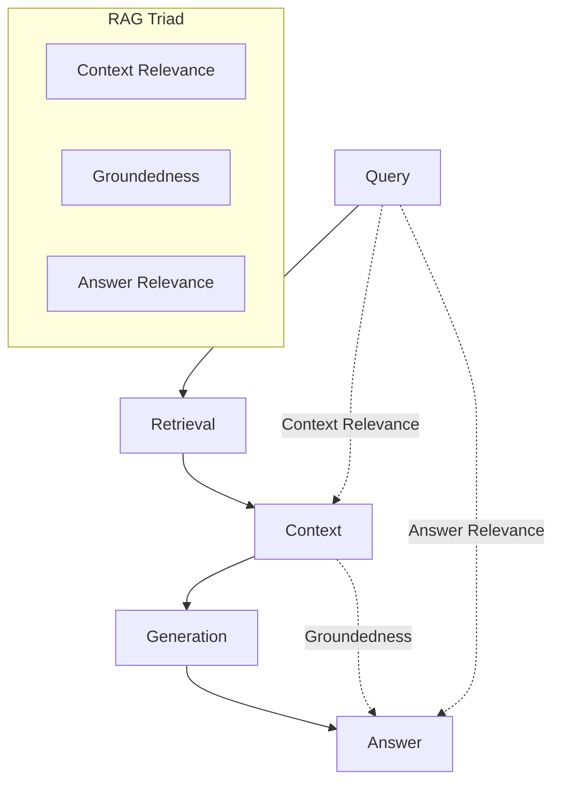
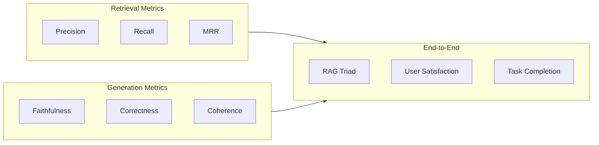

# Evaluation & Quality

## Introduction

RAG systems require specialized evaluation to ensure both retrieval and generation work correctly. Standard LLM metrics don't capture whether retrieved context was relevant or whether the answer faithfully reflected the sources.

This lesson covers the complete evaluation toolkit for RAG systems, from component-level metrics to end-to-end quality assessment.

### What We'll Cover

- The RAG Triad evaluation framework
- Retrieval and generation metrics
- RAGAS framework for automated evaluation
- Ground truth testing and user feedback
- LLM-as-judge patterns

### Prerequisites

- Understanding of RAG architecture
- Basic statistics (precision, recall)
- Python fundamentals

---

## Quick Start

```python
from openai import AsyncOpenAI
from ragas.llms import llm_factory
from ragas.metrics.collections import (
    ContextPrecision,
    Faithfulness,
    AnswerRelevancy
)

# Setup evaluator LLM
client = AsyncOpenAI()
llm = llm_factory("gpt-4o-mini", client=client)

# Create metrics
precision = ContextPrecision(llm=llm)
faithfulness = Faithfulness(llm=llm)

# Evaluate a RAG response
async def evaluate_rag_response(
    query: str,
    response: str,
    contexts: list[str],
    reference: str = None
) -> dict:
    """Evaluate RAG response quality."""
    
    # Context precision: Are retrieved chunks relevant?
    precision_result = await precision.ascore(
        user_input=query,
        retrieved_contexts=contexts,
        reference=reference or response
    )
    
    # Faithfulness: Is response grounded in context?
    faith_result = await faithfulness.ascore(
        user_input=query,
        response=response,
        retrieved_contexts=contexts
    )
    
    return {
        "context_precision": precision_result.value,
        "faithfulness": faith_result.value,
        "overall": (precision_result.value + faith_result.value) / 2
    }

# Usage
scores = await evaluate_rag_response(
    query="When was the first Super Bowl?",
    response="The first Super Bowl was held on January 15, 1967.",
    contexts=["The First AFL-NFL World Championship Game was played on January 15, 1967."],
    reference="The first Super Bowl was on January 15, 1967."
)
print(f"Faithfulness: {scores['faithfulness']:.2f}")
```

**Output:**
```
Faithfulness: 1.00
```

---

## The RAG Triad

The RAG Triad is an industry-standard framework for evaluating RAG quality across three dimensions:



### Three Dimensions

| Dimension | Question | Evaluates |
|-----------|----------|-----------|
| **Context Relevance** | Did we retrieve the right information? | Retrieval quality |
| **Groundedness** | Is the answer supported by the context? | Faithfulness |
| **Answer Relevance** | Does the answer address the question? | Response quality |

### Why All Three Matter

```python
from dataclasses import dataclass
from enum import Enum

class QualityIssue(Enum):
    RETRIEVAL_FAILURE = "retrieval_failure"
    HALLUCINATION = "hallucination"
    OFF_TOPIC = "off_topic"
    GOOD = "good"

@dataclass
class TriadScore:
    context_relevance: float
    groundedness: float
    answer_relevance: float
    
    def diagnose(self) -> QualityIssue:
        """Diagnose the primary quality issue."""
        if self.context_relevance < 0.5:
            return QualityIssue.RETRIEVAL_FAILURE
        if self.groundedness < 0.5:
            return QualityIssue.HALLUCINATION
        if self.answer_relevance < 0.5:
            return QualityIssue.OFF_TOPIC
        return QualityIssue.GOOD
    
    @property
    def overall(self) -> float:
        """Harmonic mean of all three scores."""
        scores = [self.context_relevance, self.groundedness, self.answer_relevance]
        if 0 in scores:
            return 0.0
        return 3 / sum(1/s for s in scores)

# Example diagnosis
score = TriadScore(
    context_relevance=0.9,
    groundedness=0.3,
    answer_relevance=0.8
)
print(f"Issue: {score.diagnose().value}")  # hallucination
```

---

## Evaluation Categories

RAG evaluation spans multiple categories:



### Metric Categories

| Category | Focus | Key Metrics |
|----------|-------|-------------|
| **Retrieval** | Finding relevant documents | Precision, Recall, MRR, NDCG |
| **Context** | Quality of retrieved context | Context Relevance, Coverage |
| **Generation** | Answer quality | Faithfulness, Correctness, Coherence |
| **End-to-End** | Overall system | RAG Triad, User feedback |

---

## RAGAS Framework Overview

RAGAS (Retrieval Augmented Generation Assessment) is the industry-standard library for RAG evaluation:

### Core Retrieval Metrics

| Metric | Purpose | Requires |
|--------|---------|----------|
| **Context Precision** | Are retrieved chunks relevant? | Query, contexts, reference |
| **Context Recall** | Did we find all relevant info? | Query, contexts, reference |
| **Context Entities Recall** | Are key entities retrieved? | Query, contexts, reference |
| **Noise Sensitivity** | Robustness to irrelevant content | Query, contexts, response |

### Core Generation Metrics

| Metric | Purpose | Requires |
|--------|---------|----------|
| **Faithfulness** | Is answer grounded in context? | Query, response, contexts |
| **Response Relevancy** | Does answer address query? | Query, response |
| **Factual Correctness** | Are claims accurate? | Response, reference |

### Basic RAGAS Usage

```python
from ragas import evaluate
from ragas.dataset_schema import SingleTurnSample
from ragas.metrics import (
    LLMContextPrecisionWithoutReference,
    Faithfulness,
    ResponseRelevancy
)

# Create evaluation samples
samples = [
    SingleTurnSample(
        user_input="What is the capital of France?",
        response="Paris is the capital of France.",
        retrieved_contexts=["Paris is the capital city of France."]
    ),
    SingleTurnSample(
        user_input="When was Python created?",
        response="Python was created in 1991 by Guido van Rossum.",
        retrieved_contexts=["Python was first released in 1991."]
    )
]

# Define metrics
metrics = [
    LLMContextPrecisionWithoutReference(llm=evaluator_llm),
    Faithfulness(llm=evaluator_llm),
    ResponseRelevancy(llm=evaluator_llm, embeddings=evaluator_embeddings)
]

# Run evaluation
results = evaluate(dataset=samples, metrics=metrics)
print(results.to_pandas())
```

---

## Lesson Structure

This lesson is organized into focused sub-lessons:

| Lesson | Topic | Key Concepts |
|--------|-------|--------------|
| [01-rag-metrics](./01-rag-metrics.md) | RAG-Specific Metrics | Context relevance, faithfulness, answer relevance |
| [02-retrieval-quality](./02-retrieval-quality.md) | Retrieval Evaluation | Precision, recall, MRR, ranking |
| [03-answer-quality](./03-answer-quality.md) | Answer Evaluation | Correctness, completeness, coherence |
| [04-faithfulness-checking](./04-faithfulness-checking.md) | Faithfulness | LLM-as-judge, NLI, claim extraction |
| [05-ground-truth-testing](./05-ground-truth-testing.md) | Ground Truth | Golden datasets, regression testing |
| [06-user-feedback](./06-user-feedback.md) | User Feedback | Thumbs, forms, implicit signals |
| [07-ragas-framework](./07-ragas-framework.md) | RAGAS Deep Dive | Full framework, testset generation |
| [08-llm-as-judge](./08-llm-as-judge.md) | LLM-as-Judge | Pairwise, rubrics, calibration |

---

## Key Concepts

| Concept | Definition |
|---------|------------|
| **Context Precision** | Ratio of relevant chunks in retrieved context |
| **Context Recall** | Ratio of relevant info actually retrieved |
| **Faithfulness** | Degree to which answer is grounded in context |
| **Groundedness** | Same as faithfulness (alternative term) |
| **Answer Relevancy** | How well answer addresses the question |
| **MRR** | Mean Reciprocal Rank - measures ranking quality |
| **Golden Dataset** | Curated test set with expected answers |

---

## Summary

Effective RAG evaluation requires measuring quality at multiple levels:

✅ **RAG Triad** — Context relevance, groundedness, answer relevance
✅ **Retrieval metrics** — Precision, recall, ranking quality
✅ **Generation metrics** — Faithfulness, correctness, coherence
✅ **RAGAS framework** — Industry-standard automated evaluation

**Next:** [RAG-Specific Metrics](./01-rag-metrics.md)

---

## Further Reading

- [RAGAS Documentation](https://docs.ragas.io/)
- [RAG Evaluation Best Practices](https://www.trulens.org/rag_evaluation/)
- [LLM-as-Judge Research](https://arxiv.org/abs/2306.05685)

<!--
Sources Consulted:
- RAGAS official documentation (2026-02)
- RAG Triad concept papers
- LLM evaluation research
-->
