# Faithfulness Checking

## Introduction

Faithfulness is arguably the most critical metric in RAG—it measures whether the answer is grounded in the retrieved context. An unfaithful answer contains hallucinations: information that sounds plausible but isn't supported by the source material.

This lesson covers techniques for detecting and preventing hallucinations in RAG systems.

### What We'll Cover

- Claim extraction and verification
- LLM-as-judge for faithfulness
- NLI-based approaches
- HHEM and specialized models

### Prerequisites

- Understanding of RAG generation
- LLM API usage
- Lesson 01: RAG-Specific Metrics

---

## The Faithfulness Problem

```mermaid
flowchart LR
    Context["Retrieved Context"] --> LLM["LLM Generation"]
    LLM --> Answer["Generated Answer"]
    
    Answer --> Check{"Faithfulness\nCheck"}
    Check -->|Grounded| Good["✅ Faithful"]
    Check -->|Not Grounded| Bad["❌ Hallucination"]
```



### Types of Hallucinations

| Type | Description | Example |
|------|-------------|---------|
| **Fabrication** | Inventing facts not in context | Adding statistics that don't exist |
| **Contradiction** | Stating the opposite of context | "The product costs $50" when context says $100 |
| **Extrapolation** | Going beyond what context supports | Drawing conclusions not implied |
| **Conflation** | Mixing up entities or facts | Attributing one person's action to another |

---

## Claim Extraction and Verification

The standard approach: break the answer into claims, verify each against context.

### Step 1: Extract Claims

```python
from dataclasses import dataclass
from typing import List
from openai import AsyncOpenAI
import json

@dataclass
class Claim:
    text: str
    claim_type: str  # factual, opinion, definition
    importance: str  # high, medium, low

async def extract_claims(
    answer: str,
    client: AsyncOpenAI
) -> List[Claim]:
    """
    Extract individual verifiable claims from an answer.
    """
    prompt = f"""Extract all factual claims from this text.

Text: {answer}

For each claim:
- Extract the specific factual assertion
- Classify as: factual, opinion, or definition
- Rate importance: high, medium, or low

Return JSON:
{{
    "claims": [
        {{"text": "claim text", "type": "factual", "importance": "high"}},
        ...
    ]
}}

Rules:
- One atomic fact per claim
- Skip filler phrases and transitions
- Include numbers, names, relationships
"""
    
    response = await client.chat.completions.create(
        model="gpt-4o-mini",
        messages=[{"role": "user", "content": prompt}],
        response_format={"type": "json_object"}
    )
    
    result = json.loads(response.choices[0].message.content)
    
    return [
        Claim(
            text=c["text"],
            claim_type=c["type"],
            importance=c["importance"]
        )
        for c in result["claims"]
    ]

# Example
answer = """Python was created by Guido van Rossum in 1991. 
It is the most popular programming language in the world.
Python uses indentation for code blocks."""

claims = await extract_claims(answer, client)
for claim in claims:
    print(f"[{claim.importance}] {claim.text}")

# Output:
# [high] Python was created by Guido van Rossum
# [high] Python was created in 1991
# [medium] Python is the most popular programming language
# [medium] Python uses indentation for code blocks
```

### Step 2: Verify Each Claim

```python
from enum import Enum

class VerificationResult(Enum):
    SUPPORTED = "supported"
    CONTRADICTED = "contradicted"
    NOT_MENTIONED = "not_mentioned"
    PARTIALLY_SUPPORTED = "partially_supported"

@dataclass
class ClaimVerification:
    claim: Claim
    result: VerificationResult
    evidence: str  # Quote from context
    confidence: float
    explanation: str

async def verify_claim(
    claim: Claim,
    context: str,
    client: AsyncOpenAI
) -> ClaimVerification:
    """
    Verify a single claim against the context.
    """
    prompt = f"""Verify if this claim is supported by the context.

Claim: {claim.text}

Context:
{context}

Determine:
1. Is this claim SUPPORTED, CONTRADICTED, NOT_MENTIONED, or PARTIALLY_SUPPORTED?
2. Quote the relevant evidence from context (or "N/A" if not found)
3. How confident are you? (0.0 to 1.0)

Return JSON:
{{
    "result": "supported|contradicted|not_mentioned|partially_supported",
    "evidence": "quote from context or N/A",
    "confidence": 0.0-1.0,
    "explanation": "brief explanation"
}}
"""
    
    response = await client.chat.completions.create(
        model="gpt-4o-mini",
        messages=[{"role": "user", "content": prompt}],
        response_format={"type": "json_object"}
    )
    
    result = json.loads(response.choices[0].message.content)
    
    return ClaimVerification(
        claim=claim,
        result=VerificationResult(result["result"]),
        evidence=result["evidence"],
        confidence=result["confidence"],
        explanation=result["explanation"]
    )

# Example
context = """Python is a programming language created by Guido van Rossum.
The first version was released in 1991. Python emphasizes code readability
and uses significant indentation to delimit code blocks."""

claim = Claim(text="Python was created by Guido van Rossum", claim_type="factual", importance="high")
verification = await verify_claim(claim, context, client)

print(f"Result: {verification.result.value}")
print(f"Evidence: {verification.evidence}")
print(f"Confidence: {verification.confidence}")
```

### Step 3: Calculate Faithfulness Score

```python
from dataclasses import dataclass
from typing import List, Dict

@dataclass
class FaithfulnessResult:
    score: float  # 0.0 to 1.0
    supported_claims: int
    contradicted_claims: int
    unverifiable_claims: int
    total_claims: int
    verifications: List[ClaimVerification]
    
    @property
    def is_faithful(self) -> bool:
        return self.contradicted_claims == 0 and self.score >= 0.7

async def evaluate_faithfulness(
    answer: str,
    context: str,
    client: AsyncOpenAI
) -> FaithfulnessResult:
    """
    Complete faithfulness evaluation pipeline.
    """
    # Extract claims
    claims = await extract_claims(answer, client)
    
    if not claims:
        return FaithfulnessResult(
            score=1.0,
            supported_claims=0,
            contradicted_claims=0,
            unverifiable_claims=0,
            total_claims=0,
            verifications=[]
        )
    
    # Verify each claim
    verifications = []
    for claim in claims:
        verification = await verify_claim(claim, context, client)
        verifications.append(verification)
    
    # Count results
    supported = sum(1 for v in verifications if v.result == VerificationResult.SUPPORTED)
    contradicted = sum(1 for v in verifications if v.result == VerificationResult.CONTRADICTED)
    partial = sum(1 for v in verifications if v.result == VerificationResult.PARTIALLY_SUPPORTED)
    not_mentioned = sum(1 for v in verifications if v.result == VerificationResult.NOT_MENTIONED)
    
    # Calculate score
    # Supported = 1.0, Partial = 0.5, Not mentioned = 0.0, Contradicted = -1.0
    total = len(verifications)
    raw_score = (supported + 0.5 * partial - contradicted) / total
    score = max(0.0, min(1.0, raw_score))  # Clamp to [0, 1]
    
    return FaithfulnessResult(
        score=score,
        supported_claims=supported,
        contradicted_claims=contradicted,
        unverifiable_claims=not_mentioned,
        total_claims=total,
        verifications=verifications
    )

# Usage
result = await evaluate_faithfulness(
    answer="Python was created by Guido van Rossum in 1991. It runs on Windows only.",
    context="Python was created by Guido van Rossum and released in 1991. It runs on Windows, macOS, and Linux.",
    client=client
)

print(f"Faithfulness Score: {result.score:.2f}")
print(f"Supported: {result.supported_claims}/{result.total_claims}")
print(f"Contradicted: {result.contradicted_claims}")
print(f"Is Faithful: {result.is_faithful}")
```

---

## NLI-Based Faithfulness

Natural Language Inference (NLI) models classify if a hypothesis follows from a premise.

### Using NLI for Claim Verification

```python
from transformers import pipeline

class NLIFaithfulnessChecker:
    """
    Use NLI model to check claim entailment.
    """
    
    def __init__(self, model_name: str = "facebook/bart-large-mnli"):
        self.nli = pipeline("zero-shot-classification", model=model_name)
    
    def check_claim(
        self,
        claim: str,
        context: str
    ) -> tuple[str, float]:
        """
        Check if context entails the claim.
        
        Returns: (label, confidence)
        - "entailment": Context supports claim
        - "contradiction": Context contradicts claim
        - "neutral": Context doesn't address claim
        """
        result = self.nli(
            sequences=claim,
            candidate_labels=["entailment", "contradiction", "neutral"],
            hypothesis_template="This is {}.",
            multi_label=False
        )
        
        # Get top label and score
        top_label = result["labels"][0]
        top_score = result["scores"][0]
        
        return top_label, top_score
    
    def evaluate_faithfulness(
        self,
        claims: list[str],
        context: str
    ) -> dict:
        """
        Evaluate multiple claims against context.
        """
        results = {
            "entailment": [],
            "contradiction": [],
            "neutral": []
        }
        
        for claim in claims:
            label, score = self.check_claim(claim, context)
            results[label].append({
                "claim": claim,
                "confidence": score
            })
        
        # Calculate faithfulness score
        total = len(claims)
        entailed = len(results["entailment"])
        contradicted = len(results["contradiction"])
        
        score = (entailed / total) if total > 0 else 1.0
        
        return {
            "score": score,
            "results": results,
            "has_contradictions": contradicted > 0
        }

# Usage
checker = NLIFaithfulnessChecker()

context = "The Earth orbits the Sun in approximately 365.25 days."
claims = [
    "The Earth goes around the Sun.",
    "A year is about 365 days.",
    "The Moon orbits the Earth in 365 days."
]

result = checker.evaluate_faithfulness(claims, context)
print(f"Score: {result['score']:.2f}")
print(f"Contradictions: {result['has_contradictions']}")
```

---

## HHEM: Hughes Hallucination Evaluation Model

Vectara's HHEM is specialized for hallucination detection.

### Using HHEM

```python
from transformers import AutoModelForSequenceClassification, AutoTokenizer
import torch

class HHEMChecker:
    """
    Vectara's HHEM-2.1-Open for hallucination detection.
    """
    
    def __init__(self):
        model_name = "vectara/hallucination_evaluation_model"
        self.tokenizer = AutoTokenizer.from_pretrained(model_name)
        self.model = AutoModelForSequenceClassification.from_pretrained(model_name)
        self.model.eval()
    
    def check_faithfulness(
        self,
        answer: str,
        context: str
    ) -> tuple[float, str]:
        """
        Check if answer is faithful to context.
        
        Returns: (score, label)
        - score: 0.0 (hallucination) to 1.0 (faithful)
        - label: "faithful" or "hallucination"
        """
        # Format input as premise-hypothesis pair
        input_text = f"{context} [SEP] {answer}"
        
        inputs = self.tokenizer(
            input_text,
            return_tensors="pt",
            truncation=True,
            max_length=512
        )
        
        with torch.no_grad():
            outputs = self.model(**inputs)
            probs = torch.softmax(outputs.logits, dim=1)
            
            # Index 0 = hallucination, Index 1 = faithful
            faithful_prob = probs[0][1].item()
        
        label = "faithful" if faithful_prob >= 0.5 else "hallucination"
        
        return faithful_prob, label
    
    def evaluate_sentences(
        self,
        sentences: list[str],
        context: str
    ) -> list[dict]:
        """
        Evaluate faithfulness of individual sentences.
        """
        results = []
        
        for sentence in sentences:
            score, label = self.check_faithfulness(sentence, context)
            results.append({
                "sentence": sentence,
                "score": score,
                "label": label
            })
        
        return results

# Usage
checker = HHEMChecker()

context = "Tesla was founded in 2003 by Martin Eberhard and Marc Tarpenning."
answer = "Tesla was founded by Elon Musk in 2003."

score, label = checker.check_faithfulness(answer, context)
print(f"Score: {score:.3f}")
print(f"Label: {label}")
# Lower score because answer attributes founding to wrong person
```

---

## Sentence-Level Faithfulness

Check each sentence independently for finer granularity.

```python
import re
from dataclasses import dataclass
from typing import List

@dataclass
class SentenceVerification:
    sentence: str
    is_faithful: bool
    score: float
    problematic_phrases: List[str]

async def evaluate_sentence_faithfulness(
    answer: str,
    context: str,
    client: AsyncOpenAI
) -> List[SentenceVerification]:
    """
    Evaluate faithfulness at sentence level.
    """
    # Split into sentences
    sentences = re.split(r'(?<=[.!?])\s+', answer.strip())
    sentences = [s for s in sentences if s.strip()]
    
    prompt = f"""Check each sentence for faithfulness to the context.

Context:
{context}

Sentences to verify:
{json.dumps(sentences, indent=2)}

For each sentence, determine:
1. Is it faithful (fully supported by context)?
2. What is the faithfulness score (0.0 to 1.0)?
3. What phrases are problematic (if any)?

Return JSON:
{{
    "verifications": [
        {{
            "sentence": "...",
            "is_faithful": true/false,
            "score": 0.0-1.0,
            "problematic_phrases": ["phrase1", ...]
        }},
        ...
    ]
}}
"""
    
    response = await client.chat.completions.create(
        model="gpt-4o-mini",
        messages=[{"role": "user", "content": prompt}],
        response_format={"type": "json_object"}
    )
    
    result = json.loads(response.choices[0].message.content)
    
    return [
        SentenceVerification(
            sentence=v["sentence"],
            is_faithful=v["is_faithful"],
            score=v["score"],
            problematic_phrases=v["problematic_phrases"]
        )
        for v in result["verifications"]
    ]

# Usage
verifications = await evaluate_sentence_faithfulness(
    answer="Python is fast. It was created in 1991. Python is a compiled language.",
    context="Python was created by Guido van Rossum in 1991. It is an interpreted language known for readability.",
    client=client
)

for v in verifications:
    status = "✅" if v.is_faithful else "❌"
    print(f"{status} [{v.score:.2f}] {v.sentence}")
    if v.problematic_phrases:
        print(f"   Problems: {v.problematic_phrases}")
```

---

## Combined Faithfulness Evaluator

```python
from dataclasses import dataclass
from typing import List, Optional
from enum import Enum

class HallucinationType(Enum):
    NONE = "none"
    FABRICATION = "fabrication"
    CONTRADICTION = "contradiction"
    EXTRAPOLATION = "extrapolation"
    CONFLATION = "conflation"

@dataclass
class HallucinationDetail:
    text: str
    hallucination_type: HallucinationType
    severity: str  # high, medium, low
    correction: Optional[str]

@dataclass
class ComprehensiveFaithfulnessResult:
    # Overall score
    score: float
    is_faithful: bool
    
    # Claim-level
    total_claims: int
    supported_claims: int
    unsupported_claims: int
    
    # Hallucinations
    hallucinations: List[HallucinationDetail]
    hallucination_rate: float
    
    # Recommendations
    suggestions: List[str]

class ComprehensiveFaithfulnessEvaluator:
    """
    Full faithfulness evaluation with hallucination detection.
    """
    
    def __init__(self, client: AsyncOpenAI):
        self.client = client
    
    async def evaluate(
        self,
        question: str,
        answer: str,
        context: str
    ) -> ComprehensiveFaithfulnessResult:
        """
        Comprehensive faithfulness evaluation.
        """
        prompt = f"""Evaluate the faithfulness of this answer to the context.

Question: {question}
Context: {context}
Answer: {answer}

Analyze:
1. Extract all claims from the answer
2. Check each claim against the context
3. Identify any hallucinations with their type:
   - fabrication: Information invented (not in context)
   - contradiction: Opposite of what context says
   - extrapolation: Conclusions not supported by context
   - conflation: Mixing up different entities/facts

Return JSON:
{{
    "total_claims": number,
    "supported_claims": number,
    "unsupported_claims": number,
    "faithfulness_score": 0.0-1.0,
    "hallucinations": [
        {{
            "text": "the problematic text",
            "type": "fabrication|contradiction|extrapolation|conflation",
            "severity": "high|medium|low",
            "correction": "what it should say (or null)"
        }}
    ],
    "suggestions": ["suggestion1", "suggestion2"]
}}
"""
        
        response = await self.client.chat.completions.create(
            model="gpt-4o-mini",
            messages=[{"role": "user", "content": prompt}],
            response_format={"type": "json_object"}
        )
        
        result = json.loads(response.choices[0].message.content)
        
        hallucinations = [
            HallucinationDetail(
                text=h["text"],
                hallucination_type=HallucinationType(h["type"]),
                severity=h["severity"],
                correction=h.get("correction")
            )
            for h in result["hallucinations"]
        ]
        
        total = result["total_claims"]
        hallucination_rate = len(hallucinations) / total if total > 0 else 0.0
        
        return ComprehensiveFaithfulnessResult(
            score=result["faithfulness_score"],
            is_faithful=result["faithfulness_score"] >= 0.8 and not hallucinations,
            total_claims=total,
            supported_claims=result["supported_claims"],
            unsupported_claims=result["unsupported_claims"],
            hallucinations=hallucinations,
            hallucination_rate=hallucination_rate,
            suggestions=result["suggestions"]
        )

# Usage
evaluator = ComprehensiveFaithfulnessEvaluator(client)

result = await evaluator.evaluate(
    question="Who founded Python?",
    answer="Python was founded by Elon Musk in 1991 as a replacement for Java.",
    context="Python is a programming language created by Guido van Rossum and first released in 1991."
)

print(f"Faithfulness: {result.score:.2f}")
print(f"Is Faithful: {result.is_faithful}")
print(f"\nHallucinations ({len(result.hallucinations)}):")
for h in result.hallucinations:
    print(f"  [{h.severity}] {h.hallucination_type.value}: {h.text}")
    if h.correction:
        print(f"    Correction: {h.correction}")
```

---

## Hands-on Exercise

### Your Task

Build a `FaithfulnessGuard` class that:
1. Checks answer faithfulness before returning to user
2. Highlights unfaithful portions
3. Suggests corrections
4. Blocks responses below threshold

### Requirements

```python
class FaithfulnessGuard:
    def __init__(self, threshold: float = 0.7):
        pass
    
    async def check(
        self,
        answer: str,
        context: str
    ) -> GuardResult:
        pass
    
    async def correct(
        self,
        answer: str,
        context: str
    ) -> str:
        """Return corrected version of answer."""
        pass

@dataclass
class GuardResult:
    passed: bool
    score: float
    highlighted_answer: str  # With <mark> tags around problems
    issues: list[str]
```

<details>
<summary>💡 Hints</summary>

- Use sentence-level checking for granularity
- Highlight with HTML `<mark>` tags
- Correction can regenerate unfaithful sentences
- Threshold determines pass/fail

</details>

<details>
<summary>✅ Solution</summary>

```python
from dataclasses import dataclass
from typing import List
import re
import json
from openai import AsyncOpenAI

@dataclass
class GuardResult:
    passed: bool
    score: float
    highlighted_answer: str
    issues: List[str]
    original_answer: str

class FaithfulnessGuard:
    def __init__(
        self,
        client: AsyncOpenAI,
        threshold: float = 0.7
    ):
        self.client = client
        self.threshold = threshold
    
    async def check(
        self,
        answer: str,
        context: str
    ) -> GuardResult:
        """Check faithfulness and highlight issues."""
        
        prompt = f"""Check this answer for faithfulness to the context.

Context:
{context}

Answer:
{answer}

Identify unfaithful parts and return JSON:
{{
    "faithfulness_score": 0.0-1.0,
    "unfaithful_spans": [
        {{"text": "exact text from answer", "issue": "why it's unfaithful"}}
    ],
    "issues": ["summary of each issue"]
}}
"""
        
        response = await self.client.chat.completions.create(
            model="gpt-4o-mini",
            messages=[{"role": "user", "content": prompt}],
            response_format={"type": "json_object"}
        )
        
        result = json.loads(response.choices[0].message.content)
        
        # Highlight unfaithful spans
        highlighted = answer
        for span in result["unfaithful_spans"]:
            text = span["text"]
            if text in highlighted:
                highlighted = highlighted.replace(
                    text,
                    f'<mark title="{span["issue"]}">{text}</mark>'
                )
        
        score = result["faithfulness_score"]
        
        return GuardResult(
            passed=score >= self.threshold,
            score=score,
            highlighted_answer=highlighted,
            issues=result["issues"],
            original_answer=answer
        )
    
    async def correct(
        self,
        answer: str,
        context: str
    ) -> str:
        """Generate corrected version of answer."""
        
        prompt = f"""Correct this answer to be faithful to the context.

Context:
{context}

Original Answer (may contain unfaithful information):
{answer}

Rules:
1. Keep information that IS supported by context
2. Remove or correct information NOT supported
3. Do not add new information not in context
4. Maintain similar length and style

Return ONLY the corrected answer, no explanations.
"""
        
        response = await self.client.chat.completions.create(
            model="gpt-4o-mini",
            messages=[{"role": "user", "content": prompt}]
        )
        
        return response.choices[0].message.content.strip()
    
    async def guard_and_correct(
        self,
        answer: str,
        context: str
    ) -> tuple[str, GuardResult]:
        """
        Check and correct if needed.
        Returns (final_answer, check_result)
        """
        result = await self.check(answer, context)
        
        if result.passed:
            return answer, result
        
        # Correct if failed
        corrected = await self.correct(answer, context)
        
        # Re-check the correction
        corrected_result = await self.check(corrected, context)
        
        return corrected, corrected_result

# Usage
async def demo():
    client = AsyncOpenAI()
    guard = FaithfulnessGuard(client, threshold=0.7)
    
    context = "Python was created by Guido van Rossum in 1991."
    answer = "Python was created by Guido van Rossum and Elon Musk in 1995."
    
    # Check
    result = await guard.check(answer, context)
    print(f"Passed: {result.passed}")
    print(f"Score: {result.score:.2f}")
    print(f"Highlighted: {result.highlighted_answer}")
    print(f"Issues: {result.issues}")
    
    if not result.passed:
        # Correct
        corrected = await guard.correct(answer, context)
        print(f"\nCorrected: {corrected}")

import asyncio
asyncio.run(demo())
```

</details>

---

## Summary

Faithfulness checking prevents hallucinations in RAG:

✅ **Claim extraction** — Break answer into verifiable atomic facts
✅ **Verification** — Check each claim against context
✅ **NLI models** — Natural language inference for entailment
✅ **HHEM** — Specialized hallucination detection model

**Key insight:** Faithfulness ≠ Correctness. An answer can be faithful (grounded in context) but incorrect (context was wrong).

**Next:** [Ground Truth Testing](./05-ground-truth-testing.md)

---

## Further Reading

- [RAGAS Faithfulness Metrics](https://docs.ragas.io/en/latest/concepts/metrics/faithfulness.html)
- [Vectara HHEM Model](https://huggingface.co/vectara/hallucination_evaluation_model)
- [Hallucination in LLMs Survey](https://arxiv.org/abs/2311.05232)

<!--
Sources Consulted:
- RAGAS faithfulness documentation
- Vectara HHEM model card
- NLI-based verification papers
-->
