# User Feedback Loops

## Introduction

While automated metrics provide objective measurements, user feedback reveals what actually matters: whether users find your RAG system helpful. User feedback bridges the gap between technical metrics and real-world utility.

This lesson covers how to collect, process, and learn from user feedback.

### What We'll Cover

- Explicit feedback mechanisms
- Implicit signals from user behavior
- Feedback aggregation and analysis
- Closing the feedback loop

### Prerequisites

- Understanding of RAG evaluation
- Basic analytics concepts
- Frontend/backend integration knowledge

---

## Types of User Feedback

```mermaid
flowchart TD
    Feedback["User Feedback"]
    
    Feedback --> Explicit["Explicit Feedback"]
    Feedback --> Implicit["Implicit Signals"]
    
    Explicit --> Thumbs["👍👎 Thumbs"]
    Explicit --> Rating["⭐ Ratings"]
    Explicit --> Text["💬 Comments"]
    Explicit --> Report["🚨 Reports"]
    
    Implicit --> Copy["📋 Copy/Use"]
    Implicit --> Rephrase["🔄 Rephrased Query"]
    Implicit --> Abandon["🚪 Abandonment"]
    Implicit --> Time["⏱️ Time on Answer"]
```



---

## Explicit Feedback: Thumbs Up/Down

The simplest and most common feedback mechanism.

### Data Model

```python
from dataclasses import dataclass, field
from datetime import datetime
from typing import Optional, List
from enum import Enum
import uuid

class FeedbackType(Enum):
    THUMBS_UP = "thumbs_up"
    THUMBS_DOWN = "thumbs_down"

class FeedbackReason(Enum):
    # Positive reasons
    ACCURATE = "accurate"
    HELPFUL = "helpful"
    WELL_WRITTEN = "well_written"
    FAST = "fast"
    
    # Negative reasons
    INACCURATE = "inaccurate"
    INCOMPLETE = "incomplete"
    IRRELEVANT = "irrelevant"
    CONFUSING = "confusing"
    WRONG_SOURCES = "wrong_sources"
    HALLUCINATION = "hallucination"

@dataclass
class ThumbsFeedback:
    id: str = field(default_factory=lambda: str(uuid.uuid4()))
    
    # Context
    conversation_id: str = ""
    message_id: str = ""
    query: str = ""
    response: str = ""
    
    # Feedback
    feedback_type: FeedbackType = FeedbackType.THUMBS_UP
    reasons: List[FeedbackReason] = field(default_factory=list)
    comment: Optional[str] = None
    
    # Metadata
    user_id: Optional[str] = None
    timestamp: datetime = field(default_factory=datetime.now)
    session_id: Optional[str] = None

# Example
feedback = ThumbsFeedback(
    conversation_id="conv_123",
    message_id="msg_456",
    query="How do I reset my password?",
    response="To reset your password, go to Settings > Security...",
    feedback_type=FeedbackType.THUMBS_DOWN,
    reasons=[FeedbackReason.INCOMPLETE, FeedbackReason.CONFUSING],
    comment="Didn't explain what to do if I forgot my email"
)
```

### Feedback Collector Service

```python
from dataclasses import dataclass
from typing import List, Optional, Dict
from datetime import datetime, timedelta
import json

class FeedbackCollector:
    """Collect and store user feedback."""
    
    def __init__(self, storage_path: str = "feedback.jsonl"):
        self.storage_path = storage_path
        self._cache: List[ThumbsFeedback] = []
    
    def submit_feedback(
        self,
        conversation_id: str,
        message_id: str,
        query: str,
        response: str,
        feedback_type: FeedbackType,
        reasons: List[FeedbackReason] = None,
        comment: str = None,
        user_id: str = None
    ) -> str:
        """Submit user feedback."""
        
        feedback = ThumbsFeedback(
            conversation_id=conversation_id,
            message_id=message_id,
            query=query,
            response=response,
            feedback_type=feedback_type,
            reasons=reasons or [],
            comment=comment,
            user_id=user_id
        )
        
        self._cache.append(feedback)
        self._persist(feedback)
        
        return feedback.id
    
    def _persist(self, feedback: ThumbsFeedback):
        """Append feedback to storage."""
        data = {
            "id": feedback.id,
            "conversation_id": feedback.conversation_id,
            "message_id": feedback.message_id,
            "query": feedback.query,
            "response": feedback.response,
            "feedback_type": feedback.feedback_type.value,
            "reasons": [r.value for r in feedback.reasons],
            "comment": feedback.comment,
            "user_id": feedback.user_id,
            "timestamp": feedback.timestamp.isoformat()
        }
        
        with open(self.storage_path, 'a') as f:
            f.write(json.dumps(data) + "\n")
    
    def get_feedback_rate(
        self,
        days: int = 7
    ) -> Dict[str, float]:
        """Calculate feedback rates."""
        cutoff = datetime.now() - timedelta(days=days)
        recent = [f for f in self._cache if f.timestamp >= cutoff]
        
        if not recent:
            return {"positive_rate": 0, "negative_rate": 0, "total": 0}
        
        positive = sum(1 for f in recent if f.feedback_type == FeedbackType.THUMBS_UP)
        negative = sum(1 for f in recent if f.feedback_type == FeedbackType.THUMBS_DOWN)
        total = len(recent)
        
        return {
            "positive_rate": positive / total,
            "negative_rate": negative / total,
            "total": total,
            "positive_count": positive,
            "negative_count": negative
        }
    
    def get_common_issues(
        self,
        top_n: int = 5
    ) -> List[tuple]:
        """Get most common negative feedback reasons."""
        reason_counts: Dict[FeedbackReason, int] = {}
        
        for feedback in self._cache:
            if feedback.feedback_type == FeedbackType.THUMBS_DOWN:
                for reason in feedback.reasons:
                    reason_counts[reason] = reason_counts.get(reason, 0) + 1
        
        sorted_reasons = sorted(
            reason_counts.items(),
            key=lambda x: x[1],
            reverse=True
        )
        
        return [(r.value, count) for r, count in sorted_reasons[:top_n]]

# Usage
collector = FeedbackCollector()

# Submit feedback
collector.submit_feedback(
    conversation_id="conv_123",
    message_id="msg_456",
    query="How do I configure SSL?",
    response="To configure SSL...",
    feedback_type=FeedbackType.THUMBS_UP,
    reasons=[FeedbackReason.ACCURATE, FeedbackReason.HELPFUL]
)

# Get rates
rates = collector.get_feedback_rate()
print(f"Positive rate: {rates['positive_rate']:.1%}")

# Get issues
issues = collector.get_common_issues()
for reason, count in issues:
    print(f"  {reason}: {count}")
```

---

## Detailed Feedback Forms

For more nuanced feedback beyond thumbs up/down.

```python
from dataclasses import dataclass
from typing import Optional, Dict
from enum import IntEnum

class SatisfactionLevel(IntEnum):
    VERY_DISSATISFIED = 1
    DISSATISFIED = 2
    NEUTRAL = 3
    SATISFIED = 4
    VERY_SATISFIED = 5

@dataclass
class DetailedFeedback:
    """Detailed multi-aspect feedback form."""
    
    # Identifiers
    id: str
    conversation_id: str
    message_id: str
    
    # Ratings (1-5)
    overall_satisfaction: SatisfactionLevel
    accuracy_rating: Optional[int] = None  # 1-5
    completeness_rating: Optional[int] = None  # 1-5
    clarity_rating: Optional[int] = None  # 1-5
    helpfulness_rating: Optional[int] = None  # 1-5
    
    # Open-ended
    what_went_well: Optional[str] = None
    what_could_improve: Optional[str] = None
    expected_answer: Optional[str] = None
    
    # Context
    user_id: Optional[str] = None
    timestamp: datetime = None

class DetailedFeedbackCollector:
    """Collect detailed survey-style feedback."""
    
    def __init__(self):
        self.feedback: List[DetailedFeedback] = []
    
    def submit(self, feedback: DetailedFeedback) -> str:
        """Submit detailed feedback."""
        self.feedback.append(feedback)
        return feedback.id
    
    def get_average_ratings(self) -> Dict[str, float]:
        """Calculate average ratings across dimensions."""
        dimensions = [
            "overall_satisfaction",
            "accuracy_rating",
            "completeness_rating",
            "clarity_rating",
            "helpfulness_rating"
        ]
        
        averages = {}
        
        for dim in dimensions:
            values = [
                getattr(f, dim)
                for f in self.feedback
                if getattr(f, dim) is not None
            ]
            
            if values:
                averages[dim] = sum(values) / len(values)
        
        return averages
    
    def get_improvement_themes(self) -> List[str]:
        """Extract common themes from improvement suggestions."""
        suggestions = [
            f.what_could_improve
            for f in self.feedback
            if f.what_could_improve
        ]
        
        # In practice, use LLM to cluster/summarize themes
        return suggestions

# Usage
collector = DetailedFeedbackCollector()

feedback = DetailedFeedback(
    id="fb_001",
    conversation_id="conv_123",
    message_id="msg_456",
    overall_satisfaction=SatisfactionLevel.SATISFIED,
    accuracy_rating=4,
    completeness_rating=3,
    clarity_rating=5,
    helpfulness_rating=4,
    what_went_well="Clear explanation with examples",
    what_could_improve="Could include code samples",
    timestamp=datetime.now()
)

collector.submit(feedback)
print(collector.get_average_ratings())
```

---

## Implicit Feedback Signals

User behavior often reveals more than explicit feedback.

```python
from dataclasses import dataclass
from datetime import datetime
from typing import Optional, List
from enum import Enum

class ImplicitSignal(Enum):
    # Positive signals
    COPIED_RESPONSE = "copied_response"
    FOLLOWED_LINK = "followed_link"
    LONG_READ_TIME = "long_read_time"
    NO_REPHRASE = "no_rephrase"
    RETURNED_USER = "returned_user"
    
    # Negative signals
    QUICK_DISMISS = "quick_dismiss"
    REPHRASED_QUERY = "rephrased_query"
    ABANDONED_SESSION = "abandoned_session"
    SWITCHED_TO_SEARCH = "switched_to_search"
    MULTIPLE_RETRIES = "multiple_retries"

@dataclass
class InteractionEvent:
    """Track user interactions with responses."""
    
    id: str
    conversation_id: str
    message_id: str
    
    event_type: str
    timestamp: datetime
    
    # Event-specific data
    data: dict = None

class ImplicitFeedbackTracker:
    """Track and interpret implicit user signals."""
    
    def __init__(self):
        self.events: List[InteractionEvent] = []
        
        # Signal definitions
        self.positive_signals = {
            ImplicitSignal.COPIED_RESPONSE,
            ImplicitSignal.FOLLOWED_LINK,
            ImplicitSignal.LONG_READ_TIME,
            ImplicitSignal.NO_REPHRASE,
            ImplicitSignal.RETURNED_USER
        }
        
        self.negative_signals = {
            ImplicitSignal.QUICK_DISMISS,
            ImplicitSignal.REPHRASED_QUERY,
            ImplicitSignal.ABANDONED_SESSION,
            ImplicitSignal.SWITCHED_TO_SEARCH,
            ImplicitSignal.MULTIPLE_RETRIES
        }
    
    def track_event(
        self,
        conversation_id: str,
        message_id: str,
        event_type: str,
        data: dict = None
    ):
        """Track a user interaction event."""
        event = InteractionEvent(
            id=str(uuid.uuid4()),
            conversation_id=conversation_id,
            message_id=message_id,
            event_type=event_type,
            timestamp=datetime.now(),
            data=data or {}
        )
        self.events.append(event)
    
    def infer_signals(
        self,
        message_id: str
    ) -> List[ImplicitSignal]:
        """Infer feedback signals from events."""
        message_events = [
            e for e in self.events
            if e.message_id == message_id
        ]
        
        signals = []
        
        for event in message_events:
            # Copy detection
            if event.event_type == "copy":
                signals.append(ImplicitSignal.COPIED_RESPONSE)
            
            # Link following
            elif event.event_type == "link_click":
                signals.append(ImplicitSignal.FOLLOWED_LINK)
            
            # Read time analysis
            elif event.event_type == "read_time":
                read_time = event.data.get("duration_seconds", 0)
                response_length = event.data.get("response_length", 100)
                
                # Estimate expected read time (200 words/minute)
                expected_time = (response_length / 5) / 200 * 60
                
                if read_time > expected_time * 1.5:
                    signals.append(ImplicitSignal.LONG_READ_TIME)
                elif read_time < expected_time * 0.3:
                    signals.append(ImplicitSignal.QUICK_DISMISS)
            
            # Query rephrase
            elif event.event_type == "new_query":
                if event.data.get("is_rephrase"):
                    signals.append(ImplicitSignal.REPHRASED_QUERY)
        
        return signals
    
    def calculate_satisfaction_score(
        self,
        message_id: str
    ) -> float:
        """Calculate inferred satisfaction from signals."""
        signals = self.infer_signals(message_id)
        
        if not signals:
            return 0.5  # Neutral
        
        positive_count = sum(
            1 for s in signals
            if s in self.positive_signals
        )
        negative_count = sum(
            1 for s in signals
            if s in self.negative_signals
        )
        
        total = positive_count + negative_count
        if total == 0:
            return 0.5
        
        return positive_count / total

# Usage
tracker = ImplicitFeedbackTracker()

# Track events
tracker.track_event(
    conversation_id="conv_123",
    message_id="msg_456",
    event_type="copy",
    data={"copied_text": "To configure SSL..."}
)

tracker.track_event(
    conversation_id="conv_123",
    message_id="msg_456",
    event_type="read_time",
    data={"duration_seconds": 45, "response_length": 500}
)

# Infer signals
signals = tracker.infer_signals("msg_456")
print(f"Signals: {[s.value for s in signals]}")

score = tracker.calculate_satisfaction_score("msg_456")
print(f"Satisfaction: {score:.2f}")
```

---

## Feedback Aggregation

Combine multiple feedback sources for a complete picture.

```python
from dataclasses import dataclass
from typing import Dict, List, Optional
from datetime import datetime, timedelta

@dataclass
class AggregatedFeedback:
    """Combined feedback metrics for a query or response."""
    
    message_id: str
    
    # Explicit metrics
    thumbs_up_count: int = 0
    thumbs_down_count: int = 0
    average_rating: Optional[float] = None
    
    # Implicit metrics
    copy_rate: float = 0.0
    rephrase_rate: float = 0.0
    average_read_time: float = 0.0
    
    # Combined
    satisfaction_score: float = 0.5
    confidence: float = 0.0  # How confident based on sample size

class FeedbackAggregator:
    """Aggregate feedback from multiple sources."""
    
    def __init__(
        self,
        explicit_collector: FeedbackCollector,
        implicit_tracker: ImplicitFeedbackTracker
    ):
        self.explicit = explicit_collector
        self.implicit = implicit_tracker
        
        # Weights for combining sources
        self.weights = {
            "explicit_thumbs": 0.4,
            "explicit_rating": 0.2,
            "implicit_signals": 0.4
        }
    
    def aggregate_for_message(
        self,
        message_id: str
    ) -> AggregatedFeedback:
        """Aggregate all feedback for a specific message."""
        
        # Explicit feedback
        explicit = [
            f for f in self.explicit._cache
            if f.message_id == message_id
        ]
        
        thumbs_up = sum(
            1 for f in explicit
            if f.feedback_type == FeedbackType.THUMBS_UP
        )
        thumbs_down = sum(
            1 for f in explicit
            if f.feedback_type == FeedbackType.THUMBS_DOWN
        )
        
        # Implicit signals
        signals = self.implicit.infer_signals(message_id)
        implicit_score = self.implicit.calculate_satisfaction_score(message_id)
        
        # Calculate combined score
        explicit_score = self._calculate_explicit_score(thumbs_up, thumbs_down)
        
        satisfaction = (
            self.weights["explicit_thumbs"] * explicit_score +
            self.weights["implicit_signals"] * implicit_score
        )
        
        # Normalize to remaining weight if explicit rating missing
        if explicit_score is not None:
            total_weight = sum(self.weights.values()) - self.weights["explicit_rating"]
            satisfaction = satisfaction / total_weight
        
        # Confidence based on sample size
        sample_size = thumbs_up + thumbs_down + len(signals)
        confidence = min(1.0, sample_size / 10)  # Max confidence at 10 samples
        
        return AggregatedFeedback(
            message_id=message_id,
            thumbs_up_count=thumbs_up,
            thumbs_down_count=thumbs_down,
            satisfaction_score=satisfaction,
            confidence=confidence
        )
    
    def _calculate_explicit_score(
        self,
        positive: int,
        negative: int
    ) -> Optional[float]:
        """Calculate score from explicit feedback."""
        total = positive + negative
        if total == 0:
            return None
        return positive / total
    
    def get_weekly_trends(self) -> Dict:
        """Get feedback trends for the past week."""
        # Implementation would aggregate by day
        pass

# Usage
aggregator = FeedbackAggregator(
    explicit_collector=collector,
    implicit_tracker=tracker
)

feedback = aggregator.aggregate_for_message("msg_456")
print(f"Satisfaction: {feedback.satisfaction_score:.2f}")
print(f"Confidence: {feedback.confidence:.2f}")
print(f"👍 {feedback.thumbs_up_count} | 👎 {feedback.thumbs_down_count}")
```

---

## Closing the Feedback Loop

Use feedback to improve the RAG system.

```python
from dataclasses import dataclass
from typing import List, Optional, Callable
from openai import AsyncOpenAI
import json

@dataclass
class ImprovementAction:
    """A suggested improvement based on feedback."""
    
    category: str
    description: str
    priority: str  # high, medium, low
    affected_queries: List[str]
    suggested_fix: str

class FeedbackLearner:
    """Learn from feedback to improve RAG system."""
    
    def __init__(
        self,
        aggregator: FeedbackAggregator,
        client: AsyncOpenAI
    ):
        self.aggregator = aggregator
        self.client = client
    
    async def analyze_negative_feedback(
        self,
        min_count: int = 5
    ) -> List[ImprovementAction]:
        """Analyze negative feedback patterns and suggest improvements."""
        
        # Get negative feedback
        negative = [
            f for f in self.aggregator.explicit._cache
            if f.feedback_type == FeedbackType.THUMBS_DOWN
        ]
        
        if len(negative) < min_count:
            return []
        
        # Group by reason
        by_reason: Dict[FeedbackReason, List[ThumbsFeedback]] = {}
        for f in negative:
            for reason in f.reasons:
                if reason not in by_reason:
                    by_reason[reason] = []
                by_reason[reason].append(f)
        
        actions = []
        
        for reason, feedback_list in by_reason.items():
            if len(feedback_list) < min_count:
                continue
            
            # Analyze with LLM
            samples = [
                {"query": f.query, "response": f.response, "comment": f.comment}
                for f in feedback_list[:10]
            ]
            
            action = await self._suggest_action(reason, samples)
            if action:
                actions.append(action)
        
        return actions
    
    async def _suggest_action(
        self,
        reason: FeedbackReason,
        samples: List[dict]
    ) -> Optional[ImprovementAction]:
        """Use LLM to suggest improvement action."""
        
        prompt = f"""Analyze these negative feedback samples and suggest an improvement.

Feedback Reason: {reason.value}

Samples:
{json.dumps(samples, indent=2)}

Based on patterns in this feedback, suggest ONE specific improvement action.

Return JSON:
{{
    "category": "retrieval|generation|prompt|sources|other",
    "description": "What is the problem",
    "priority": "high|medium|low",
    "suggested_fix": "Specific actionable suggestion"
}}
"""
        
        response = await self.client.chat.completions.create(
            model="gpt-4o-mini",
            messages=[{"role": "user", "content": prompt}],
            response_format={"type": "json_object"}
        )
        
        result = json.loads(response.choices[0].message.content)
        
        return ImprovementAction(
            category=result["category"],
            description=result["description"],
            priority=result["priority"],
            affected_queries=[s["query"] for s in samples],
            suggested_fix=result["suggested_fix"]
        )
    
    async def identify_knowledge_gaps(self) -> List[str]:
        """Identify topics where the system performs poorly."""
        
        # Get low-satisfaction queries
        low_satisfaction = []
        
        for feedback in self.aggregator.explicit._cache:
            agg = self.aggregator.aggregate_for_message(feedback.message_id)
            if agg.satisfaction_score < 0.5 and agg.confidence > 0.3:
                low_satisfaction.append(feedback.query)
        
        if len(low_satisfaction) < 5:
            return []
        
        # Cluster topics with LLM
        prompt = f"""Group these underperforming queries by topic/theme.

Queries:
{json.dumps(low_satisfaction, indent=2)}

Identify 3-5 topic areas where the system struggles.

Return JSON:
{{
    "knowledge_gaps": [
        {{
            "topic": "topic name",
            "queries": ["query1", "query2"],
            "suggestion": "what knowledge is missing"
        }}
    ]
}}
"""
        
        response = await self.client.chat.completions.create(
            model="gpt-4o-mini",
            messages=[{"role": "user", "content": prompt}],
            response_format={"type": "json_object"}
        )
        
        result = json.loads(response.choices[0].message.content)
        
        return [gap["topic"] for gap in result["knowledge_gaps"]]

# Usage
learner = FeedbackLearner(aggregator, client)

# Get improvement suggestions
actions = await learner.analyze_negative_feedback()
for action in actions:
    print(f"[{action.priority}] {action.category}: {action.description}")
    print(f"  Fix: {action.suggested_fix}")

# Find knowledge gaps
gaps = await learner.identify_knowledge_gaps()
print(f"Knowledge gaps: {gaps}")
```

---

## Hands-on Exercise

### Your Task

Build a `FeedbackDashboard` class that:
1. Displays key feedback metrics
2. Shows trends over time
3. Highlights problem areas
4. Suggests next actions

### Requirements

```python
class FeedbackDashboard:
    def __init__(self, aggregator: FeedbackAggregator):
        pass
    
    def get_summary(self) -> dict:
        """Get high-level metrics."""
        pass
    
    def get_problem_areas(self) -> list:
        """Identify areas needing attention."""
        pass
    
    def render_markdown(self) -> str:
        """Render dashboard as markdown."""
        pass
```

<details>
<summary>💡 Hints</summary>

- Calculate satisfaction over different time periods
- Group feedback by category/topic
- Highlight significant drops
- Use tables for readability

</details>

<details>
<summary>✅ Solution</summary>

```python
from dataclasses import dataclass
from typing import Dict, List
from datetime import datetime, timedelta

@dataclass
class ProblemArea:
    topic: str
    satisfaction: float
    sample_count: int
    top_issues: List[str]
    trend: str  # "improving", "stable", "declining"

class FeedbackDashboard:
    def __init__(self, aggregator: FeedbackAggregator):
        self.aggregator = aggregator
    
    def get_summary(self, days: int = 7) -> dict:
        """Get high-level metrics."""
        cutoff = datetime.now() - timedelta(days=days)
        
        # Get recent feedback
        recent_explicit = [
            f for f in self.aggregator.explicit._cache
            if f.timestamp >= cutoff
        ]
        
        if not recent_explicit:
            return {
                "period_days": days,
                "total_feedback": 0,
                "satisfaction_rate": None,
                "feedback_rate": None
            }
        
        positive = sum(
            1 for f in recent_explicit
            if f.feedback_type == FeedbackType.THUMBS_UP
        )
        negative = sum(
            1 for f in recent_explicit
            if f.feedback_type == FeedbackType.THUMBS_DOWN
        )
        total = positive + negative
        
        # Get previous period for comparison
        prev_cutoff = cutoff - timedelta(days=days)
        prev_explicit = [
            f for f in self.aggregator.explicit._cache
            if prev_cutoff <= f.timestamp < cutoff
        ]
        
        prev_positive = sum(
            1 for f in prev_explicit
            if f.feedback_type == FeedbackType.THUMBS_UP
        )
        prev_total = len(prev_explicit)
        prev_rate = prev_positive / prev_total if prev_total > 0 else 0
        
        current_rate = positive / total if total > 0 else 0
        change = current_rate - prev_rate
        
        return {
            "period_days": days,
            "total_feedback": total,
            "positive": positive,
            "negative": negative,
            "satisfaction_rate": current_rate,
            "previous_rate": prev_rate,
            "change": change,
            "trend": "📈" if change > 0.05 else "📉" if change < -0.05 else "➡️"
        }
    
    def get_problem_areas(self, min_samples: int = 3) -> List[ProblemArea]:
        """Identify areas needing attention."""
        
        # Group by reasons
        by_reason: Dict[FeedbackReason, List[ThumbsFeedback]] = {}
        
        for f in self.aggregator.explicit._cache:
            if f.feedback_type == FeedbackType.THUMBS_DOWN:
                for reason in f.reasons:
                    if reason not in by_reason:
                        by_reason[reason] = []
                    by_reason[reason].append(f)
        
        problems = []
        
        for reason, feedback_list in by_reason.items():
            if len(feedback_list) < min_samples:
                continue
            
            # Calculate satisfaction for this issue
            all_with_topic = [
                f for f in self.aggregator.explicit._cache
                if reason in f.reasons
            ]
            
            positive = sum(
                1 for f in all_with_topic
                if f.feedback_type == FeedbackType.THUMBS_UP
            )
            satisfaction = positive / len(all_with_topic) if all_with_topic else 0
            
            problems.append(ProblemArea(
                topic=reason.value,
                satisfaction=satisfaction,
                sample_count=len(feedback_list),
                top_issues=[f.comment for f in feedback_list[:3] if f.comment],
                trend="stable"  # Would calculate from time series
            ))
        
        # Sort by satisfaction (worst first)
        return sorted(problems, key=lambda p: p.satisfaction)
    
    def render_markdown(self) -> str:
        """Render dashboard as markdown."""
        summary = self.get_summary()
        problems = self.get_problem_areas()
        
        lines = [
            "# Feedback Dashboard",
            "",
            "## Summary (Last 7 Days)",
            "",
            f"| Metric | Value |",
            f"|--------|-------|",
            f"| Total Feedback | {summary['total_feedback']} |",
            f"| 👍 Positive | {summary.get('positive', 0)} |",
            f"| 👎 Negative | {summary.get('negative', 0)} |",
        ]
        
        if summary['satisfaction_rate'] is not None:
            lines.append(
                f"| Satisfaction | {summary['satisfaction_rate']:.1%} "
                f"{summary.get('trend', '')} |"
            )
        
        if problems:
            lines.extend([
                "",
                "## ⚠️ Problem Areas",
                "",
                "| Issue | Satisfaction | Count |",
                "|-------|--------------|-------|"
            ])
            
            for p in problems[:5]:
                lines.append(
                    f"| {p.topic} | {p.satisfaction:.1%} | {p.sample_count} |"
                )
                
                if p.top_issues:
                    for issue in p.top_issues[:2]:
                        lines.append(f'| └─ "{issue[:50]}..." | | |')
        
        # Next actions
        lines.extend([
            "",
            "## 📋 Recommended Actions",
            ""
        ])
        
        if problems:
            top_problem = problems[0]
            lines.append(
                f"1. **Address {top_problem.topic}** - "
                f"Lowest satisfaction ({top_problem.satisfaction:.1%})"
            )
        
        if summary.get('change', 0) < -0.05:
            lines.append(
                "2. **Investigate decline** - "
                f"Satisfaction dropped {abs(summary['change']):.1%}"
            )
        
        return "\n".join(lines)

# Usage
dashboard = FeedbackDashboard(aggregator)

# Get summary
summary = dashboard.get_summary()
print(f"Satisfaction: {summary['satisfaction_rate']:.1%}")

# Render dashboard
print(dashboard.render_markdown())
```

</details>

---

## Summary

User feedback is essential for real-world RAG evaluation:

✅ **Explicit feedback** — Thumbs, ratings, comments from users
✅ **Implicit signals** — Behavior like copying, rephrasing, abandonment
✅ **Aggregation** — Combine sources for complete picture
✅ **Closing the loop** — Use feedback to drive improvements

**Key insight:** A system with 90% automated accuracy but 60% user satisfaction is failing. Always prioritize user feedback.

**Next:** [RAGAS Framework](./07-ragas-framework.md)

---

## Further Reading

- [Building Feedback Loops](https://eugeneyan.com/writing/llm-patterns/#evals)
- [Implicit Feedback in Search](https://research.google/pubs/pub45530/)
- [Human-in-the-Loop ML](https://hai.stanford.edu/news/human-loop-machine-learning)

<!--
Sources Consulted:
- Industry practices for user feedback
- Google search quality guidelines
- ML feedback loop patterns
-->
