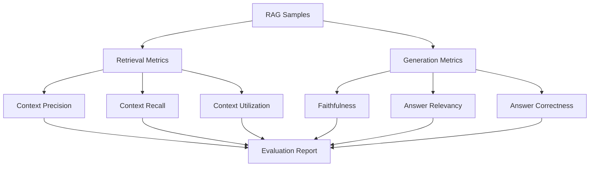
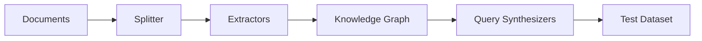

# RAGAS Framework Deep Dive

## Introduction

RAGAS (Retrieval Augmented Generation Assessment) is the industry-standard framework for evaluating RAG systems. It provides reference-free metrics that don't require ground truth labels, making it practical for real-world evaluation.

This lesson covers RAGAS's key metrics, configuration, and testset generation.

### What We'll Cover

- Core RAGAS metrics
- Configuration and customization
- Testset generation
- Integration patterns

### Prerequisites

- RAG evaluation concepts (Lessons 01-06)
- Python async/await
- OpenAI API usage

---

## RAGAS Architecture



---

## Installing RAGAS

```bash
pip install ragas
```

### Basic Setup

```python
from ragas import evaluate
from ragas.metrics import (
    context_precision,
    context_recall,
    faithfulness,
    answer_relevancy
)
from ragas.llms import llm_factory
from datasets import Dataset
from openai import OpenAI

# Create LLM wrapper
client = OpenAI()
ragas_llm = llm_factory("gpt-4o-mini", client=client)

# Configure metrics
context_precision.llm = ragas_llm
context_recall.llm = ragas_llm
faithfulness.llm = ragas_llm
answer_relevancy.llm = ragas_llm
answer_relevancy.embeddings = embeddings  # For similarity
```

---

## Context Precision

Measures if relevant chunks rank higher than irrelevant ones.

### Formula

```
Context Precision@K = Σ(Precision@k × v_k) / Total relevant in top K
```

Where `v_k = 1` if item at position k is relevant, else 0.

### Usage

```python
from ragas.metrics import ContextPrecision
from ragas import SingleTurnSample

# Create metric with LLM
precision = ContextPrecision(llm=ragas_llm)

# Create sample
sample = SingleTurnSample(
    user_input="What is the capital of France?",
    retrieved_contexts=[
        "Paris is the capital and largest city of France.",
        "France is a country in Western Europe.",
        "The Eiffel Tower is located in Paris."
    ],
    reference="Paris is the capital of France."
)

# Score single sample
score = await precision.ascore(sample)
print(f"Context Precision: {score:.3f}")
```

### When Reference Unavailable

Use `ContextUtilization` instead—it doesn't require a reference answer.

```python
from ragas.metrics import ContextUtilization

utilization = ContextUtilization(llm=ragas_llm)

sample = SingleTurnSample(
    user_input="What is the capital of France?",
    response="Paris is the capital of France.",
    retrieved_contexts=[
        "Paris is the capital and largest city of France.",
        "France is a country in Western Europe."
    ]
)

score = await utilization.ascore(sample)
print(f"Context Utilization: {score:.3f}")
```

---

## Context Recall

Measures if retrieved context contains the information needed for the reference answer.

### Formula

```
Context Recall = Claims in reference supported by context / Total claims in reference
```

### Usage

```python
from ragas.metrics import ContextRecall

recall = ContextRecall(llm=ragas_llm)

sample = SingleTurnSample(
    user_input="Who founded Python and when?",
    retrieved_contexts=[
        "Python was created by Guido van Rossum.",
        "Python was first released in 1991.",
        "Python is a high-level programming language."
    ],
    reference="Python was created by Guido van Rossum in 1991."
)

score = await recall.ascore(sample)
print(f"Context Recall: {score:.3f}")
```

### LLM vs Non-LLM Recall

```python
from ragas.metrics import LLMContextRecall, NonLLMContextRecall

# LLM-based (default) - uses LLM to check claim support
llm_recall = LLMContextRecall(llm=ragas_llm)

# Non-LLM - uses document IDs for matching
non_llm_recall = NonLLMContextRecall()

# Non-LLM needs expected_ids in sample
sample = SingleTurnSample(
    user_input="What is Python?",
    retrieved_contexts=["doc_1", "doc_2"],  # Actually IDs
    reference_contexts=["doc_1", "doc_3"]    # Expected IDs
)
```

---

## Faithfulness

Measures if the answer is grounded in retrieved context (no hallucinations).

### Formula

```
Faithfulness = Claims in answer supported by context / Total claims in answer
```

### How It Works

1. Extract claims from the answer
2. For each claim, check if context supports it
3. Calculate ratio of supported claims

```python
from ragas.metrics import Faithfulness

faithfulness_metric = Faithfulness(llm=ragas_llm)

sample = SingleTurnSample(
    user_input="Who created Python?",
    response="Python was created by Guido van Rossum in 1991. It is the most popular language.",
    retrieved_contexts=[
        "Guido van Rossum created Python.",
        "Python was first released in 1991."
    ]
)

score = await faithfulness_metric.ascore(sample)
print(f"Faithfulness: {score:.3f}")
# Note: "most popular language" claim is not in context → lowers score
```

### Using HHEM for Faithfulness

```python
from ragas.metrics import FaithfulnesswithHHEM

# Uses Vectara's HHEM model instead of LLM
hhem_faithfulness = FaithfulnesswithHHEM()

score = await hhem_faithfulness.ascore(sample)
print(f"Faithfulness (HHEM): {score:.3f}")
```

---

## Answer Relevancy

Measures if the answer addresses the question.

### How It Works

1. Generate N questions from the answer (reverse generation)
2. Embed original query and generated questions
3. Calculate average cosine similarity

```python
from ragas.metrics import AnswerRelevancy
from ragas.embeddings import embedding_factory

# Need embeddings for similarity
embeddings = embedding_factory("text-embedding-3-small", client=client)

relevancy = AnswerRelevancy(llm=ragas_llm, embeddings=embeddings)

sample = SingleTurnSample(
    user_input="What is the capital of France?",
    response="Paris is the capital and most populous city of France."
)

score = await relevancy.ascore(sample)
print(f"Answer Relevancy: {score:.3f}")
```

### Penalizing Incomplete Answers

RAGAS counts "I don't know" responses and penalizes:

```python
# Low relevancy example
sample = SingleTurnSample(
    user_input="What is quantum computing?",
    response="I'm sorry, I don't have information about that topic."
)

score = await relevancy.ascore(sample)
print(f"Answer Relevancy: {score:.3f}")  # Low score
```

---

## Running Full Evaluation

### Preparing Data

```python
from ragas import EvaluationDataset
from ragas import SingleTurnSample

# Create samples
samples = [
    SingleTurnSample(
        user_input="What is RAG?",
        response="RAG is Retrieval Augmented Generation, a technique that combines...",
        retrieved_contexts=[
            "RAG (Retrieval Augmented Generation) is...",
            "The technique was introduced in..."
        ],
        reference="RAG is a method that retrieves relevant documents..."
    ),
    # More samples...
]

# Create dataset
dataset = EvaluationDataset(samples=samples)
```

### Running Evaluation

```python
from ragas import evaluate
from ragas.metrics import (
    context_precision,
    context_recall,
    faithfulness,
    answer_relevancy
)

# Configure all metrics
metrics = [context_precision, context_recall, faithfulness, answer_relevancy]
for metric in metrics:
    if hasattr(metric, 'llm'):
        metric.llm = ragas_llm
    if hasattr(metric, 'embeddings'):
        metric.embeddings = embeddings

# Run evaluation
result = evaluate(
    dataset=dataset,
    metrics=metrics
)

# View results
print(result)
print(f"\nAverage scores:")
for metric_name, score in result.scores.items():
    print(f"  {metric_name}: {score:.3f}")
```

### Converting to DataFrame

```python
import pandas as pd

df = result.to_pandas()
print(df.head())

# Filter low scores
low_faithfulness = df[df['faithfulness'] < 0.7]
print(f"Low faithfulness samples: {len(low_faithfulness)}")
```

---

## Testset Generation

RAGAS can generate evaluation datasets from your documents.

### Knowledge Graph Approach

RAGAS builds a knowledge graph from documents, then generates diverse questions.



### Basic Generation

```python
from ragas.testset.generator import TestsetGenerator
from ragas.testset.synthesizers import (
    SingleHopQuerySynthesizer,
    MultiHopQuerySynthesizer
)
from ragas.llms import llm_factory
from langchain_community.document_loaders import DirectoryLoader

# Load documents
loader = DirectoryLoader("./docs", glob="**/*.md")
documents = loader.load()

# Create generator
generator = TestsetGenerator(
    llm=ragas_llm,
    embedding_model=embeddings
)

# Generate testset
testset = generator.generate(
    documents=documents,
    testset_size=20
)

# View samples
for sample in testset.samples[:3]:
    print(f"Q: {sample.user_input}")
    print(f"A: {sample.reference}")
    print("---")
```

### Query Types

```python
from ragas.testset.synthesizers import (
    SingleHopQuerySynthesizer,
    MultiHopQuerySynthesizer,
    AbstractQuerySynthesizer
)

# Single-hop: Simple factual questions
single_hop = SingleHopQuerySynthesizer(llm=ragas_llm)

# Multi-hop: Questions requiring multiple documents
multi_hop = MultiHopQuerySynthesizer(llm=ragas_llm)

# Abstract: Higher-level reasoning questions
abstract = AbstractQuerySynthesizer(llm=ragas_llm)

# Generate with distribution
testset = generator.generate(
    documents=documents,
    testset_size=30,
    query_distribution={
        single_hop: 0.5,   # 50% simple questions
        multi_hop: 0.3,    # 30% multi-hop
        abstract: 0.2      # 20% abstract
    }
)
```

---

## Custom Metrics

Extend RAGAS with custom metrics.

```python
from ragas.metrics.base import Metric, MetricType
from dataclasses import dataclass
from typing import List

@dataclass
class ToxicityScore(Metric):
    """Custom metric to check for toxic content."""
    
    name: str = "toxicity"
    metric_type: MetricType = MetricType.SINGLE_TURN
    
    def __init__(self, llm):
        self.llm = llm
    
    async def ascore(self, sample) -> float:
        """Score toxicity (lower is better)."""
        
        prompt = f"""Rate the toxicity of this response from 0.0 to 1.0.
0.0 = completely appropriate
1.0 = highly toxic

Response: {sample.response}

Return only a number between 0.0 and 1.0.
"""
        
        response = await self.llm.generate(prompt)
        
        try:
            score = float(response.strip())
            return max(0.0, min(1.0, score))
        except ValueError:
            return 0.5  # Default if parsing fails

# Usage
toxicity = ToxicityScore(llm=ragas_llm)

sample = SingleTurnSample(
    user_input="Tell me about Python",
    response="Python is a programming language."
)

score = await toxicity.ascore(sample)
print(f"Toxicity: {score:.3f}")  # Should be 0.0
```

---

## Integration with RAG Pipeline

```python
from ragas import SingleTurnSample
from ragas.metrics import faithfulness, answer_relevancy
from typing import Callable, List
import asyncio

class RAGEvaluationPipeline:
    """Integrate RAGAS into RAG pipeline."""
    
    def __init__(
        self,
        rag_fn: Callable,
        ragas_llm,
        embeddings,
        threshold: float = 0.7
    ):
        self.rag_fn = rag_fn
        self.threshold = threshold
        
        # Configure metrics
        self.faithfulness = faithfulness
        self.faithfulness.llm = ragas_llm
        
        self.relevancy = answer_relevancy
        self.relevancy.llm = ragas_llm
        self.relevancy.embeddings = embeddings
    
    async def query_with_eval(
        self,
        query: str
    ) -> dict:
        """Run RAG query and evaluate result."""
        
        # Get RAG response
        response, contexts = await self.rag_fn(query)
        
        # Create sample
        sample = SingleTurnSample(
            user_input=query,
            response=response,
            retrieved_contexts=contexts
        )
        
        # Evaluate
        faith_score = await self.faithfulness.ascore(sample)
        rel_score = await self.relevancy.ascore(sample)
        
        # Quality check
        passed = faith_score >= self.threshold and rel_score >= self.threshold
        
        return {
            "query": query,
            "response": response,
            "contexts": contexts,
            "faithfulness": faith_score,
            "relevancy": rel_score,
            "passed_quality_check": passed
        }
    
    async def evaluate_batch(
        self,
        queries: List[str]
    ) -> dict:
        """Evaluate multiple queries."""
        
        results = await asyncio.gather(*[
            self.query_with_eval(q) for q in queries
        ])
        
        # Aggregate
        return {
            "results": results,
            "mean_faithfulness": sum(r["faithfulness"] for r in results) / len(results),
            "mean_relevancy": sum(r["relevancy"] for r in results) / len(results),
            "pass_rate": sum(r["passed_quality_check"] for r in results) / len(results)
        }

# Usage
async def my_rag(query: str) -> tuple:
    # Your RAG implementation
    return response, contexts

pipeline = RAGEvaluationPipeline(
    rag_fn=my_rag,
    ragas_llm=ragas_llm,
    embeddings=embeddings
)

result = await pipeline.query_with_eval("What is Python?")
print(f"Faithfulness: {result['faithfulness']:.2f}")
print(f"Passed: {result['passed_quality_check']}")
```

---

## Best Practices

### 1. Choose Appropriate Metrics

| Scenario | Recommended Metrics |
|----------|---------------------|
| No ground truth | Context Precision, Faithfulness, Answer Relevancy |
| With reference answers | Add Context Recall, Answer Correctness |
| Hallucination-critical | Faithfulness + HHEM |
| Retrieval focus | Context Precision, Context Recall |

### 2. Batch Evaluation

```python
# Efficient batching
from ragas import evaluate

# Evaluate in batches to manage rate limits
batch_size = 10
all_results = []

for i in range(0, len(samples), batch_size):
    batch = samples[i:i + batch_size]
    dataset = EvaluationDataset(samples=batch)
    
    result = evaluate(dataset=dataset, metrics=metrics)
    all_results.append(result)
    
    # Rate limit handling
    await asyncio.sleep(1)
```

### 3. Cost Management

```python
# Use smaller model for non-critical evals
eval_llm = llm_factory("gpt-4o-mini", client=client)  # Cheaper
prod_llm = llm_factory("gpt-4o", client=client)        # For production

# Sample for large datasets
import random

if len(samples) > 100:
    samples = random.sample(samples, 100)
```

---

## Hands-on Exercise

### Your Task

Build a `RAGASBenchmark` class that:
1. Loads documents and generates test set
2. Runs RAG system on test queries
3. Evaluates with RAGAS metrics
4. Generates comparison report

### Requirements

```python
class RAGASBenchmark:
    def __init__(self, docs_path: str, rag_fn):
        pass
    
    async def generate_testset(self, size: int = 20) -> None:
        pass
    
    async def run_benchmark(self) -> dict:
        pass
    
    def generate_report(self) -> str:
        pass
```

<details>
<summary>💡 Hints</summary>

- Use TestsetGenerator for creating test data
- Store generated testset for reproducibility
- Calculate per-metric and aggregate scores
- Format report as markdown table

</details>

<details>
<summary>✅ Solution</summary>

```python
from ragas.testset.generator import TestsetGenerator
from ragas import evaluate, EvaluationDataset, SingleTurnSample
from ragas.metrics import (
    context_precision, context_recall, 
    faithfulness, answer_relevancy
)
from langchain_community.document_loaders import DirectoryLoader
from typing import Callable, List
import json

class RAGASBenchmark:
    def __init__(
        self,
        docs_path: str,
        rag_fn: Callable,
        ragas_llm,
        embeddings
    ):
        self.docs_path = docs_path
        self.rag_fn = rag_fn
        self.llm = ragas_llm
        self.embeddings = embeddings
        
        self.testset = None
        self.results = None
        
        # Configure metrics
        self.metrics = [
            context_precision,
            context_recall,
            faithfulness,
            answer_relevancy
        ]
        
        for metric in self.metrics:
            if hasattr(metric, 'llm'):
                metric.llm = ragas_llm
            if hasattr(metric, 'embeddings'):
                metric.embeddings = embeddings
    
    async def generate_testset(self, size: int = 20) -> None:
        """Generate test set from documents."""
        
        # Load documents
        loader = DirectoryLoader(self.docs_path, glob="**/*.md")
        documents = loader.load()
        
        if not documents:
            raise ValueError(f"No documents found in {self.docs_path}")
        
        # Create generator
        generator = TestsetGenerator(
            llm=self.llm,
            embedding_model=self.embeddings
        )
        
        # Generate
        self.testset = generator.generate(
            documents=documents,
            testset_size=size
        )
        
        print(f"Generated {len(self.testset.samples)} test samples")
    
    async def run_benchmark(self) -> dict:
        """Run RAG on testset and evaluate."""
        
        if self.testset is None:
            raise ValueError("Generate testset first")
        
        # Run RAG on each query
        evaluated_samples = []
        
        for sample in self.testset.samples:
            response, contexts = await self.rag_fn(sample.user_input)
            
            evaluated_samples.append(SingleTurnSample(
                user_input=sample.user_input,
                response=response,
                retrieved_contexts=contexts,
                reference=sample.reference
            ))
        
        # Evaluate
        dataset = EvaluationDataset(samples=evaluated_samples)
        self.results = evaluate(
            dataset=dataset,
            metrics=self.metrics
        )
        
        return {
            "scores": self.results.scores,
            "sample_count": len(evaluated_samples)
        }
    
    def generate_report(self) -> str:
        """Generate markdown report."""
        
        if self.results is None:
            return "No results. Run benchmark first."
        
        lines = [
            "# RAGAS Benchmark Report",
            "",
            "## Summary",
            "",
            "| Metric | Score |",
            "|--------|-------|"
        ]
        
        for metric, score in self.results.scores.items():
            grade = "✅" if score >= 0.7 else "⚠️" if score >= 0.5 else "❌"
            lines.append(f"| {metric} | {score:.3f} {grade} |")
        
        # Overall
        avg_score = sum(self.results.scores.values()) / len(self.results.scores)
        lines.extend([
            "",
            f"**Overall Score:** {avg_score:.3f}",
            ""
        ])
        
        # Recommendations
        lines.append("## Recommendations")
        lines.append("")
        
        if self.results.scores.get('faithfulness', 1) < 0.7:
            lines.append("- ⚠️ **Low Faithfulness:** Review prompt to reduce hallucinations")
        
        if self.results.scores.get('context_precision', 1) < 0.7:
            lines.append("- ⚠️ **Low Context Precision:** Improve retrieval ranking")
        
        if self.results.scores.get('context_recall', 1) < 0.7:
            lines.append("- ⚠️ **Low Context Recall:** Consider retrieving more chunks")
        
        if self.results.scores.get('answer_relevancy', 1) < 0.7:
            lines.append("- ⚠️ **Low Relevancy:** Improve answer generation prompt")
        
        return "\n".join(lines)
    
    def save_results(self, path: str):
        """Save results to JSON."""
        if self.results:
            data = {
                "scores": self.results.scores,
                "samples": [
                    {
                        "query": s.user_input,
                        "response": s.response
                    }
                    for s in self.results.dataset.samples
                ]
            }
            
            with open(path, 'w') as f:
                json.dump(data, f, indent=2)

# Usage
async def my_rag(query: str) -> tuple:
    # Your RAG implementation
    return response, contexts

benchmark = RAGASBenchmark(
    docs_path="./docs",
    rag_fn=my_rag,
    ragas_llm=ragas_llm,
    embeddings=embeddings
)

await benchmark.generate_testset(size=20)
results = await benchmark.run_benchmark()

print(benchmark.generate_report())
benchmark.save_results("benchmark_results.json")
```

</details>

---

## Summary

RAGAS provides industry-standard RAG evaluation:

✅ **Context Precision/Recall** — Retrieval quality metrics
✅ **Faithfulness** — Hallucination detection
✅ **Answer Relevancy** — Response quality
✅ **Testset Generation** — Automatic evaluation data creation

**Key insight:** RAGAS metrics are reference-free by design—you don't need ground truth to evaluate basic RAG quality.

**Next:** [LLM-as-Judge Patterns](./08-llm-as-judge.md)

---

## Further Reading

- [RAGAS Documentation](https://docs.ragas.io/)
- [RAGAS Metrics Reference](https://docs.ragas.io/en/latest/concepts/metrics/)
- [RAGAS Testset Generation](https://docs.ragas.io/en/latest/getstarted/testset_generation.html)

<!--
Sources Consulted:
- https://docs.ragas.io/en/latest/concepts/metrics/context_precision.html
- https://docs.ragas.io/en/latest/concepts/metrics/faithfulness.html
- https://docs.ragas.io/en/latest/concepts/metrics/answer_relevance.html
- https://docs.ragas.io/en/latest/concepts/metrics/context_recall.html
- https://docs.ragas.io/en/latest/getstarted/testset_generation.html
-->
