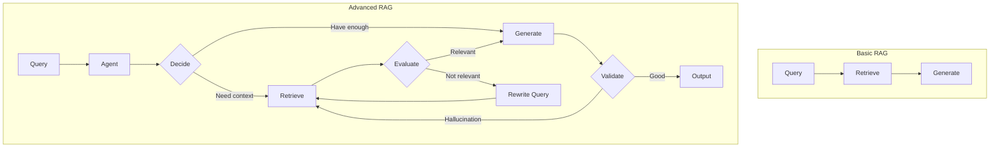
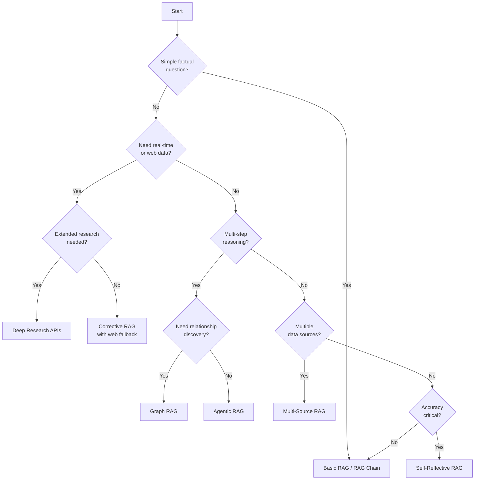

# Advanced RAG Patterns

## Introduction

Basic RAG retrieves documents and generates responses in a single pass. But what happens when the first retrieval misses relevant information? What if the query is ambiguous or requires synthesizing knowledge from multiple sources? Advanced RAG patterns address these challenges by adding intelligence, feedback loops, and multi-step reasoning to the retrieval process.

This lesson explores the cutting-edge patterns that transform RAG from a simple retrieve-and-generate pipeline into a sophisticated, self-correcting system that approaches human-like research capabilities.

### What We'll Cover

- **Agentic RAG** — Multi-step retrieval with query decomposition and dynamic refinement
- **LangChain RAG Agents** — Modern 2025 patterns using retrieval as a tool
- **RAG Chains** — Single-pass patterns for low-latency applications
- **Self-Reflective RAG** — Answer quality checking and retry loops
- **Corrective RAG (CRAG)** — Error detection and correction strategies
- **Graph RAG** — Microsoft's knowledge graph approach for holistic understanding
- **Multi-Source RAG** — Routing across multiple knowledge bases
- **Conversational RAG** — Memory and context accumulation
- **Deep Research APIs** — OpenAI and Gemini autonomous research agents

### Prerequisites

Before diving into advanced patterns, ensure you understand:

- Basic RAG concepts (retrieval, embedding, generation)
- Vector stores and similarity search
- LangChain fundamentals (chains, tools, agents)
- Python async programming basics

---

## Evolution of RAG Architecture

### The Limitations of Basic RAG

| Challenge | Basic RAG Limitation | Advanced RAG Solution |
|-----------|---------------------|----------------------|
| Complex queries | Single retrieval may miss context | Query decomposition, multiple retrievals |
| Irrelevant results | No quality check on retrieved docs | Document grading and filtering |
| Hallucinations | No validation of generated answers | Self-reflection and fact-checking |
| Context gaps | Fixed retrieval strategy | Dynamic query refinement |
| Multi-hop reasoning | Cannot traverse relationships | Graph RAG, iterative retrieval |
| Knowledge freshness | Static knowledge base only | Web search fallback, deep research |

---

## Pattern Categories

### 1. Agent-Based Patterns

Agent-based patterns give an LLM control over when and how to retrieve information:

| Pattern | Description | Best For |
|---------|-------------|----------|
| **Agentic RAG** | LLM decides when to search, what to search for | Complex multi-step questions |
| **LangChain RAG Agents** | Retrieval as a tool the agent can invoke | General-purpose Q&A |
| **Tool-Augmented RAG** | Combine retrieval with other tools (calculators, APIs) | Multi-capability assistants |

### 2. Self-Correcting Patterns

Self-correcting patterns add feedback loops to improve quality:

| Pattern | Description | Best For |
|---------|-------------|----------|
| **Self-Reflective RAG** | Check if answer is grounded in retrieved docs | High-accuracy requirements |
| **Corrective RAG** | Detect errors and fallback to web search | Production systems with fallbacks |
| **Query Rewriting** | Improve queries when initial retrieval fails | Ambiguous user queries |

### 3. Knowledge Structure Patterns

Knowledge structure patterns leverage relationships in data:

| Pattern | Description | Best For |
|---------|-------------|----------|
| **Graph RAG** | Build knowledge graphs from documents | Holistic corpus understanding |
| **Multi-Source RAG** | Route queries to appropriate knowledge bases | Enterprise with multiple domains |
| **Hierarchical RAG** | Community detection and summarization | Large document collections |

### 4. Memory & Context Patterns

Memory patterns handle multi-turn conversations:

| Pattern | Description | Best For |
|---------|-------------|----------|
| **Conversational RAG** | Track conversation history | Chatbots, assistants |
| **Memory Summarization** | Compress long conversations | Extended dialogues |
| **Context Accumulation** | Build context across turns | Research workflows |

### 5. Autonomous Research Patterns

Autonomous patterns perform extended research:

| Pattern | Description | Best For |
|---------|-------------|----------|
| **Deep Research** | Multi-step web research with synthesis | Competitive analysis, literature review |
| **Agentic Search** | Agent-controlled web browsing | Real-time information needs |

---

## Choosing the Right Pattern

### Decision Matrix

| Use Case | Recommended Pattern | Latency | Accuracy | Complexity |
|----------|---------------------|---------|----------|------------|
| Customer support FAQ | RAG Chains | ⏱️ Low | ✅ Good | 🟢 Simple |
| Legal document Q&A | Self-Reflective RAG | ⏱️ Medium | ✅✅ High | 🟡 Moderate |
| Market research | Deep Research | ⏱️⏱️ High | ✅✅✅ Very High | 🔴 Complex |
| Multi-domain enterprise | Multi-Source RAG | ⏱️ Medium | ✅✅ High | 🟡 Moderate |
| Knowledge base exploration | Graph RAG | ⏱️⏱️ High | ✅✅ High | 🔴 Complex |
| Conversational assistant | Conversational RAG | ⏱️ Low | ✅ Good | 🟡 Moderate |

---

## Lessons in This Section

1. [Agentic RAG](./01-agentic-rag.md) — Multi-step retrieval with query decomposition
2. [LangChain RAG Agents](./02-langchain-rag-agents.md) — Modern retrieval-as-tool patterns
3. [RAG Chains](./03-rag-chains.md) — Low-latency single-pass retrieval
4. [Self-Reflective RAG](./04-self-reflective-rag.md) — Answer grounding and quality checks
5. [Corrective RAG](./05-corrective-rag.md) — Error detection and web search fallback
6. [Graph RAG](./06-graph-rag.md) — Microsoft's knowledge graph approach
7. [Multi-Source RAG](./07-multi-source-rag.md) — Cross-knowledge-base routing
8. [Conversational RAG](./08-conversational-rag.md) — Memory and history tracking
9. [Deep Research APIs](./09-deep-research-apis.md) — OpenAI and Gemini research agents

---

## Summary

✅ Advanced RAG patterns add intelligence, feedback loops, and multi-step reasoning to basic retrieval  
✅ Agent-based patterns let LLMs decide when and how to retrieve information  
✅ Self-correcting patterns improve answer quality through grading and validation  
✅ Graph RAG enables holistic understanding of large document collections  
✅ Deep Research APIs automate extended research tasks that would take humans hours  

**Next:** [Agentic RAG](./01-agentic-rag.md) — Learn how agents dynamically control the retrieval process

---

## Further Reading

- [LangChain RAG Tutorial](https://python.langchain.com/docs/tutorials/rag/) — Official LangChain documentation
- [LangGraph Agentic RAG](https://docs.langchain.com/oss/python/langgraph/agentic-rag) — Building custom RAG agents
- [Microsoft GraphRAG](https://microsoft.github.io/graphrag/) — Knowledge graph enhanced RAG
- [Self-RAG Paper](https://arxiv.org/abs/2310.11511) — Academic foundation for self-reflective patterns
- [CRAG Paper](https://arxiv.org/pdf/2401.15884.pdf) — Corrective RAG methodology

<!-- 
Sources Consulted:
- LangChain RAG Tutorial: https://python.langchain.com/docs/tutorials/rag/
- LangGraph Agentic RAG: https://docs.langchain.com/oss/python/langgraph/agentic-rag
- LangGraph Self-RAG: https://langchain-ai.github.io/langgraph/tutorials/rag/langgraph_self_rag/
- LangGraph CRAG: https://langchain-ai.github.io/langgraph/tutorials/rag/langgraph_crag/
- Microsoft GraphRAG: https://microsoft.github.io/graphrag/
- OpenAI Responses API: https://platform.openai.com/docs/api-reference/responses
- Gemini Deep Research: https://ai.google.dev/gemini-api/docs/deep-research
-->
