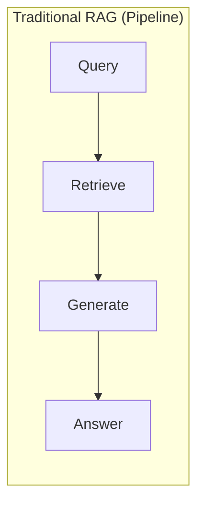
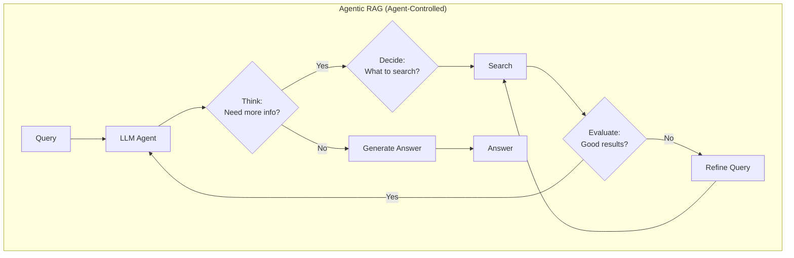
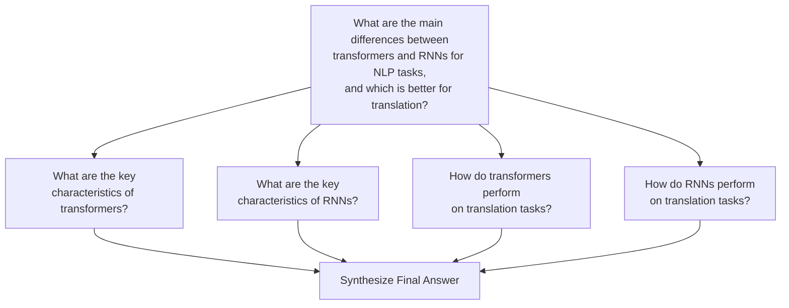
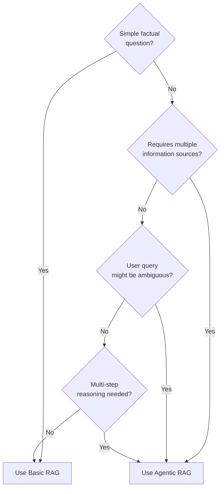

# Agentic RAG

## Introduction

Traditional RAG follows a fixed pattern: retrieve documents, then generate a response. But what if the initial retrieval doesn't find relevant information? What if a complex question requires multiple searches across different topics? Agentic RAG solves these problems by giving an LLM control over the retrieval process itself.

In Agentic RAG, the LLM acts as an intelligent agent that decides *when* to search, *what* to search for, and *whether* the retrieved information is sufficient before generating a final answer. This transforms RAG from a rigid pipeline into an adaptive, multi-step reasoning system.

### What We'll Cover

- Understanding the agentic RAG paradigm
- Query decomposition for complex questions
- Iterative retrieval with refinement
- Tool-augmented RAG patterns
- Implementing a basic agentic RAG system

### Prerequisites

- Understanding of basic RAG concepts
- Familiarity with LangChain agents
- Knowledge of function calling / tool use

---

## The Agentic RAG Paradigm

### From Pipeline to Agent





### Key Differences

| Aspect | Traditional RAG | Agentic RAG |
|--------|-----------------|-------------|
| Control flow | Fixed pipeline | Agent decides |
| Search decisions | Always search once | Search when needed |
| Query formulation | Use original query | Generate optimal queries |
| Retrieval count | Single retrieval | Multiple as needed |
| Error handling | None | Detect and retry |

---

## Core Concepts

### 1. Query Decomposition

Complex questions often require information from multiple topics. Query decomposition breaks a complex question into simpler sub-questions that can be answered independently.



**Example implementation:**

```python
from langchain_openai import ChatOpenAI
from pydantic import BaseModel, Field

class SubQuestions(BaseModel):
    """Decomposed sub-questions from a complex query."""
    questions: list[str] = Field(
        description="List of simpler sub-questions"
    )

llm = ChatOpenAI(model="gpt-4o-mini", temperature=0)
decomposer = llm.with_structured_output(SubQuestions)

def decompose_query(complex_question: str) -> list[str]:
    """Break a complex question into searchable sub-questions."""
    prompt = f"""Decompose this complex question into 2-4 simpler 
    sub-questions that can be answered independently:
    
    Question: {complex_question}
    
    Generate sub-questions that together will provide enough 
    information to answer the original question."""
    
    result = decomposer.invoke(prompt)
    return result.questions

# Example usage
complex_q = "How does GPT-4's architecture differ from BERT, and which is better for classification?"
sub_questions = decompose_query(complex_q)
# ['What is the architecture of GPT-4?',
#  'What is the architecture of BERT?', 
#  'How does GPT-4 perform on classification tasks?',
#  'How does BERT perform on classification tasks?']
```

### 2. Iterative Retrieval

Instead of a single retrieval, the agent performs multiple rounds of retrieval, using information from earlier rounds to inform later queries.

```python
from langchain_core.vectorstores import InMemoryVectorStore
from langchain_openai import OpenAIEmbeddings

class IterativeRetriever:
    """Performs multiple rounds of retrieval with query refinement."""
    
    def __init__(self, vector_store, llm, max_iterations: int = 3):
        self.retriever = vector_store.as_retriever(search_kwargs={"k": 3})
        self.llm = llm
        self.max_iterations = max_iterations
    
    def retrieve_iteratively(self, query: str) -> dict:
        """Retrieve documents with iterative refinement."""
        all_docs = []
        queries_used = [query]
        current_query = query
        
        for i in range(self.max_iterations):
            # Retrieve documents
            docs = self.retriever.invoke(current_query)
            all_docs.extend(docs)
            
            # Check if we have enough information
            context = "\n".join([d.page_content for d in all_docs])
            
            check_prompt = f"""Based on the retrieved context, determine if 
            we have enough information to answer the original question.
            
            Original question: {query}
            Retrieved context: {context}
            
            Respond with either:
            - "SUFFICIENT" if we can answer the question
            - "NEED_MORE: <refined query>" if more information is needed
            """
            
            result = self.llm.invoke(check_prompt).content
            
            if result.startswith("SUFFICIENT"):
                break
            elif result.startswith("NEED_MORE:"):
                current_query = result.replace("NEED_MORE:", "").strip()
                queries_used.append(current_query)
        
        # Deduplicate documents
        unique_docs = list({d.page_content: d for d in all_docs}.values())
        
        return {
            "documents": unique_docs,
            "queries_used": queries_used,
            "iterations": i + 1
        }
```

### 3. Tool-Augmented RAG

In tool-augmented RAG, retrieval is one of several tools the agent can use. The agent combines retrieval with other capabilities like calculations, API calls, or code execution.

```python
from langchain.tools import tool
from langchain.agents import create_agent

@tool
def search_knowledge_base(query: str) -> str:
    """Search the internal knowledge base for information."""
    docs = retriever.invoke(query)
    return "\n\n".join([d.page_content for d in docs])

@tool
def calculate(expression: str) -> str:
    """Evaluate a mathematical expression."""
    try:
        result = eval(expression)  # Use safer evaluation in production
        return str(result)
    except Exception as e:
        return f"Error: {e}"

@tool
def get_current_date() -> str:
    """Get the current date and time."""
    from datetime import datetime
    return datetime.now().isoformat()

# Create agent with multiple tools
agent = create_agent(
    model="gpt-4o",
    tools=[search_knowledge_base, calculate, get_current_date],
    system_prompt="""You are a helpful assistant that can search a knowledge 
    base, perform calculations, and get the current date. Use these tools 
    as needed to answer user questions accurately."""
)

# The agent decides which tools to use
response = agent.invoke({
    "messages": [{"role": "user", 
                  "content": "What's the price of product X and what's 20% off that price?"}]
})
```

### 4. Dynamic Query Refinement

When initial retrieval doesn't return relevant results, the agent reformulates the query:

```python
from pydantic import BaseModel

class QueryRefinement(BaseModel):
    """Refined query based on initial results."""
    is_relevant: bool = Field(description="Are the current results relevant?")
    refined_query: str = Field(description="Improved query if needed")
    reasoning: str = Field(description="Why the refinement was made")

def refine_query_if_needed(
    original_query: str,
    retrieved_docs: list,
    llm
) -> dict:
    """Check relevance and refine query if needed."""
    
    context = "\n".join([d.page_content for d in retrieved_docs[:3]])
    
    prompt = f"""Evaluate if the retrieved documents are relevant to the query.
    If not, suggest a better query.
    
    Original query: {original_query}
    Retrieved content: {context}
    
    Determine:
    1. Are these documents relevant to answering the query?
    2. If not, what query would find better results?
    """
    
    refiner = llm.with_structured_output(QueryRefinement)
    result = refiner.invoke(prompt)
    
    return {
        "is_relevant": result.is_relevant,
        "refined_query": result.refined_query,
        "reasoning": result.reasoning
    }
```

---

## Implementing Agentic RAG with LangGraph

LangGraph provides the best foundation for building agentic RAG systems with explicit control flow:

```python
from langgraph.graph import StateGraph, START, END
from typing import TypedDict, Annotated
from operator import add

class AgenticRAGState(TypedDict):
    """State for the agentic RAG graph."""
    question: str
    sub_questions: list[str]
    retrieved_docs: Annotated[list, add]
    current_query: str
    iteration: int
    final_answer: str

def decompose_question(state: AgenticRAGState) -> dict:
    """Decompose complex question into sub-questions."""
    question = state["question"]
    
    # Use LLM to decompose
    sub_questions = decompose_query(question)
    
    return {
        "sub_questions": sub_questions,
        "current_query": sub_questions[0] if sub_questions else question,
        "iteration": 0
    }

def retrieve_documents(state: AgenticRAGState) -> dict:
    """Retrieve documents for current query."""
    query = state["current_query"]
    docs = retriever.invoke(query)
    
    return {
        "retrieved_docs": docs,
        "iteration": state["iteration"] + 1
    }

def check_sufficiency(state: AgenticRAGState) -> str:
    """Determine if we have enough information or need more retrieval."""
    docs = state["retrieved_docs"]
    question = state["question"]
    iteration = state["iteration"]
    
    # Check if we've processed all sub-questions
    if iteration >= len(state.get("sub_questions", [])):
        return "generate"
    
    # Move to next sub-question
    return "continue"

def get_next_query(state: AgenticRAGState) -> dict:
    """Get the next sub-question to process."""
    iteration = state["iteration"]
    sub_questions = state["sub_questions"]
    
    if iteration < len(sub_questions):
        return {"current_query": sub_questions[iteration]}
    
    return {}

def generate_answer(state: AgenticRAGState) -> dict:
    """Generate final answer from all retrieved documents."""
    question = state["question"]
    docs = state["retrieved_docs"]
    
    context = "\n\n".join([d.page_content for d in docs])
    
    prompt = f"""Answer the following question using the provided context.
    
    Question: {question}
    
    Context:
    {context}
    
    Provide a comprehensive answer based on the context."""
    
    answer = llm.invoke(prompt).content
    
    return {"final_answer": answer}

# Build the graph
workflow = StateGraph(AgenticRAGState)

workflow.add_node("decompose", decompose_question)
workflow.add_node("retrieve", retrieve_documents)
workflow.add_node("next_query", get_next_query)
workflow.add_node("generate", generate_answer)

workflow.add_edge(START, "decompose")
workflow.add_edge("decompose", "retrieve")
workflow.add_conditional_edges(
    "retrieve",
    check_sufficiency,
    {
        "continue": "next_query",
        "generate": "generate"
    }
)
workflow.add_edge("next_query", "retrieve")
workflow.add_edge("generate", END)

# Compile and run
agentic_rag = workflow.compile()

result = agentic_rag.invoke({
    "question": "Compare the architectures and use cases of BERT and GPT-4"
})
print(result["final_answer"])
```

---

## Best Practices

| Practice | Description |
|----------|-------------|
| Limit iterations | Set a maximum (3-5) to prevent infinite loops |
| Track query history | Avoid searching with the same query twice |
| Deduplicate results | Remove duplicate documents across iterations |
| Monitor costs | Multiple LLM calls add up quickly |
| Cache intermediate results | Reuse sub-question answers when possible |

---

## Common Pitfalls

| ❌ Mistake | ✅ Solution |
|-----------|-------------|
| No iteration limit | Always set `max_iterations` |
| Ignoring relevance | Check document relevance before using |
| Over-decomposition | 2-4 sub-questions usually sufficient |
| Losing context | Pass conversation history to each step |
| Not handling failures | Add fallback for when no results found |

---

## When to Use Agentic RAG



---

## Hands-on Exercise

### Your Task

Build an agentic RAG system that can answer questions about a technical topic by decomposing complex queries and performing iterative retrieval.

### Requirements

1. Implement query decomposition for complex questions
2. Create an iterative retrieval loop with a maximum of 3 iterations
3. Add relevance checking after each retrieval
4. Synthesize a final answer from all retrieved documents

### Expected Result

The system should handle questions like "Compare X and Y, and explain when to use each" by:
- Breaking into sub-questions about X and Y separately
- Retrieving relevant information for each
- Synthesizing a comparative answer

<details>
<summary>💡 Hints</summary>

- Use structured outputs for query decomposition
- Track which sub-questions have been answered
- Deduplicate retrieved documents before synthesis

</details>

<details>
<summary>✅ Solution Outline</summary>

```python
# 1. Define state with sub_questions, retrieved_docs, iteration
# 2. Create decompose node using structured output
# 3. Create retrieve node that fetches docs for current query
# 4. Create check node that decides continue vs generate
# 5. Create generate node that synthesizes from all docs
# 6. Connect with conditional edges
# See the LangGraph implementation above for full details
```

</details>

---

## Summary

✅ Agentic RAG gives the LLM control over when and how to retrieve information  
✅ Query decomposition breaks complex questions into searchable sub-questions  
✅ Iterative retrieval refines queries based on initial results  
✅ Tool-augmented RAG combines retrieval with other capabilities  
✅ LangGraph provides the best framework for implementing agentic RAG  

**Next:** [LangChain RAG Agents](./02-langchain-rag-agents.md) — Modern 2025 patterns using retrieval as a tool

---

## Further Reading

- [LangGraph Agentic RAG Tutorial](https://docs.langchain.com/oss/python/langgraph/agentic-rag) — Official LangGraph documentation
- [ReAct Pattern](https://arxiv.org/abs/2210.03629) — Reasoning and Acting in LLMs
- [Chain-of-Thought Retrieval](https://arxiv.org/abs/2305.14283) — Multi-step reasoning with retrieval

<!-- 
Sources Consulted:
- LangGraph Agentic RAG: https://docs.langchain.com/oss/python/langgraph/agentic-rag
- LangChain RAG Tutorial: https://python.langchain.com/docs/tutorials/rag/
- LangChain Agents Documentation: https://docs.langchain.com/oss/python/langchain/agents
-->
