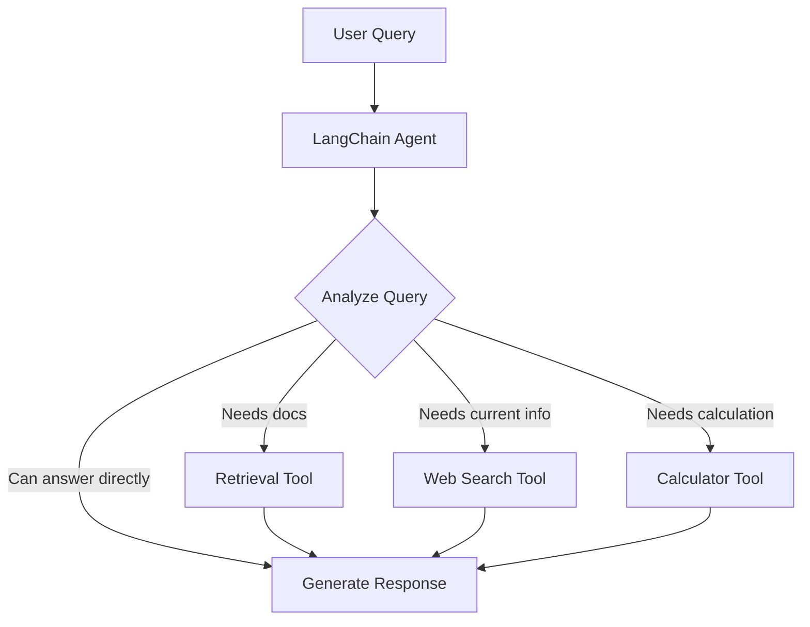

# LangChain RAG Agents

## Introduction

LangChain RAG Agents represent the modern approach to retrieval-augmented generation in 2025. Rather than forcing every query through a retrieval pipeline, agents treat retrieval as just another tool they can choose to use—alongside web search, calculators, or any other capability you provide.

This pattern recognizes a fundamental truth: not every question requires document retrieval. An agent can decide whether to search your knowledge base, query the web, perform calculations, or simply answer from its training knowledge.

### What We'll Cover

- Modern LangChain agent architecture for RAG
- Retrieval as a tool pattern
- Building agents with multiple retrieval tools
- Agent memory and conversation handling
- Production patterns and best practices

### Prerequisites

- Understanding of LangChain fundamentals
- Familiarity with function calling / tool use
- Basic understanding of vector stores

---

## The Retrieval-as-Tool Pattern

### Why Treat Retrieval as a Tool?

In traditional RAG, every query goes through retrieval—even simple greetings or follow-up questions. This wastes resources and can introduce irrelevant context. The retrieval-as-tool pattern lets the agent decide when retrieval is actually helpful.



### Basic Agent with Retrieval Tool

```python
from langchain_openai import ChatOpenAI, OpenAIEmbeddings
from langchain_core.vectorstores import InMemoryVectorStore
from langchain_core.tools import tool
from langchain.agents import create_tool_calling_agent, AgentExecutor
from langchain_core.prompts import ChatPromptTemplate

# Initialize components
llm = ChatOpenAI(model="gpt-4o-mini", temperature=0)
embeddings = OpenAIEmbeddings(model="text-embedding-3-small")
vector_store = InMemoryVectorStore(embeddings)

# Add documents to the vector store
documents = [
    "Our return policy allows returns within 30 days of purchase.",
    "Shipping takes 3-5 business days for standard delivery.",
    "Premium members get free expedited shipping on all orders.",
    "Customer support is available 24/7 via chat or phone.",
]
vector_store.add_texts(documents)

# Create retrieval tool
@tool
def search_knowledge_base(query: str) -> str:
    """Search the company knowledge base for information about 
    policies, products, and procedures.
    
    Args:
        query: The search query to find relevant information
    """
    retriever = vector_store.as_retriever(search_kwargs={"k": 3})
    docs = retriever.invoke(query)
    return "\n\n".join([doc.page_content for doc in docs])

# Define agent prompt
prompt = ChatPromptTemplate.from_messages([
    ("system", """You are a helpful customer service assistant. 
    Use the search_knowledge_base tool when you need information 
    about company policies, products, or procedures.
    
    For general conversation or questions you can answer from 
    common knowledge, respond directly without using tools."""),
    ("placeholder", "{chat_history}"),
    ("human", "{input}"),
    ("placeholder", "{agent_scratchpad}"),
])

# Create agent
tools = [search_knowledge_base]
agent = create_tool_calling_agent(llm, tools, prompt)
agent_executor = AgentExecutor(agent=agent, tools=tools, verbose=True)

# Example usage
response = agent_executor.invoke({"input": "What's your return policy?"})
print(response["output"])
# Agent uses the tool: "Our return policy allows returns within 30 days..."

response = agent_executor.invoke({"input": "Thanks!"})
print(response["output"])
# Agent responds directly without tool: "You're welcome! Let me know if..."
```

---

## Multiple Retrieval Tools

Real applications often have multiple knowledge bases or document collections. Agents can route queries to the appropriate source.

### Multi-Source RAG Agent

```python
from langchain_core.tools import tool
from langchain_core.vectorstores import InMemoryVectorStore

# Create separate vector stores for different domains
product_store = InMemoryVectorStore(embeddings)
policy_store = InMemoryVectorStore(embeddings)
technical_store = InMemoryVectorStore(embeddings)

# Populate stores
product_store.add_texts([
    "The ProMax 500 has a 5000mAh battery with 65W fast charging.",
    "The UltraSlim X weighs only 150g with an AMOLED display.",
    "The BudgetPhone SE offers great value at $299.",
])

policy_store.add_texts([
    "Returns accepted within 30 days with original packaging.",
    "Warranty covers manufacturing defects for 2 years.",
    "Price matching available within 14 days of purchase.",
])

technical_store.add_texts([
    "To reset your device, hold power + volume down for 10 seconds.",
    "Battery calibration: drain to 0%, charge to 100% without interruption.",
    "Software updates are pushed automatically when connected to WiFi.",
])

@tool
def search_products(query: str) -> str:
    """Search for product specifications, features, and comparisons.
    Use this for questions about specific products or product recommendations.
    
    Args:
        query: Search query about products
    """
    docs = product_store.as_retriever(search_kwargs={"k": 2}).invoke(query)
    return "\n\n".join([d.page_content for d in docs])

@tool
def search_policies(query: str) -> str:
    """Search for company policies including returns, warranty, and pricing.
    Use this for questions about what customers can or cannot do.
    
    Args:
        query: Search query about policies
    """
    docs = policy_store.as_retriever(search_kwargs={"k": 2}).invoke(query)
    return "\n\n".join([d.page_content for d in docs])

@tool
def search_technical_support(query: str) -> str:
    """Search for technical support and troubleshooting guides.
    Use this for how-to questions and fixing problems.
    
    Args:
        query: Search query about technical issues
    """
    docs = technical_store.as_retriever(search_kwargs={"k": 2}).invoke(query)
    return "\n\n".join([d.page_content for d in docs])

# Create multi-tool agent
tools = [search_products, search_policies, search_technical_support]
agent = create_tool_calling_agent(llm, tools, prompt)
agent_executor = AgentExecutor(agent=agent, tools=tools, verbose=True)

# The agent routes to the appropriate tool
agent_executor.invoke({"input": "How do I reset my phone?"})
# Uses search_technical_support

agent_executor.invoke({"input": "What's your return policy?"})
# Uses search_policies

agent_executor.invoke({"input": "Which phone has the best battery?"})
# Uses search_products
```

---

## LangGraph RAG Agent

For more complex workflows, LangGraph provides fine-grained control over the agent's decision process.

```python
from typing import Annotated, TypedDict
from langgraph.graph import StateGraph, START, END
from langgraph.graph.message import add_messages
from langgraph.prebuilt import ToolNode, tools_condition
from langchain_core.messages import SystemMessage

class AgentState(TypedDict):
    """State for the RAG agent."""
    messages: Annotated[list, add_messages]

# Create the agent node
def agent_node(state: AgentState) -> AgentState:
    """The agent decides whether to use tools or respond."""
    llm_with_tools = llm.bind_tools(tools)
    
    system = SystemMessage(content="""You are a helpful assistant 
    with access to a knowledge base. Use the search tools when you 
    need specific information. Respond directly for greetings, 
    thanks, or general questions.""")
    
    response = llm_with_tools.invoke([system] + state["messages"])
    return {"messages": [response]}

# Build the graph
graph = StateGraph(AgentState)

# Add nodes
graph.add_node("agent", agent_node)
graph.add_node("tools", ToolNode(tools))

# Add edges
graph.add_edge(START, "agent")
graph.add_conditional_edges(
    "agent",
    tools_condition,  # Routes to tools if tool call, else END
)
graph.add_edge("tools", "agent")

# Compile
rag_agent = graph.compile()

# Use the agent
from langchain_core.messages import HumanMessage

result = rag_agent.invoke({
    "messages": [HumanMessage(content="What products do you have?")]
})
print(result["messages"][-1].content)
```

---

## Adding Memory to RAG Agents

Conversational agents need to remember previous interactions. LangGraph makes this easy with checkpointing.

```python
from langgraph.checkpoint.memory import MemorySaver

# Add memory to the graph
memory = MemorySaver()
rag_agent_with_memory = graph.compile(checkpointer=memory)

# Configuration with thread_id for conversation tracking
config = {"configurable": {"thread_id": "user-123"}}

# First message
result = rag_agent_with_memory.invoke(
    {"messages": [HumanMessage(content="What's your best phone?")]},
    config=config
)
print(result["messages"][-1].content)
# "Our ProMax 500 has excellent features including..."

# Follow-up uses context from previous message
result = rag_agent_with_memory.invoke(
    {"messages": [HumanMessage(content="What's its battery life?")]},
    config=config
)
print(result["messages"][-1].content)
# "The ProMax 500 has a 5000mAh battery..." (remembers context)
```

---

## Production Patterns

### Parallel Tool Execution

When multiple tools can be called independently, execute them in parallel:

```python
from langchain_core.runnables import RunnableParallel

async def parallel_retrieval(queries: list[str]) -> list[str]:
    """Execute multiple retrievals in parallel."""
    tasks = [
        search_knowledge_base.ainvoke(query) 
        for query in queries
    ]
    results = await asyncio.gather(*tasks)
    return results
```

### Retrieval with Reranking

Improve retrieval quality by reranking results:

```python
from langchain.retrievers import ContextualCompressionRetriever
from langchain_cohere import CohereRerank

@tool
def search_with_rerank(query: str) -> str:
    """Search and rerank results for better relevance."""
    base_retriever = vector_store.as_retriever(search_kwargs={"k": 10})
    
    # Use Cohere reranker
    reranker = CohereRerank(model="rerank-v3.5", top_n=3)
    
    compression_retriever = ContextualCompressionRetriever(
        base_compressor=reranker,
        base_retriever=base_retriever
    )
    
    docs = compression_retriever.invoke(query)
    return "\n\n".join([d.page_content for d in docs])
```

### Error Handling

Wrap tools with error handling for production reliability:

```python
from langchain_core.tools import ToolException

@tool
def safe_search(query: str) -> str:
    """Search with error handling."""
    try:
        docs = retriever.invoke(query)
        if not docs:
            return "No relevant documents found for your query."
        return "\n\n".join([d.page_content for d in docs])
    except Exception as e:
        raise ToolException(f"Search failed: {str(e)}")
```

---

## Best Practices

### Tool Description Quality

Good tool descriptions help the agent make better decisions:

```python
# ❌ Bad: Vague description
@tool
def search(query: str) -> str:
    """Search for stuff."""
    pass

# ✅ Good: Clear, specific description
@tool
def search_product_catalog(query: str) -> str:
    """Search the product catalog for specifications, prices, and availability.
    
    Use this tool when users ask about:
    - Product features or specifications
    - Pricing information
    - Stock availability
    - Product comparisons
    
    Do NOT use for policies, support issues, or general questions.
    
    Args:
        query: A specific search query about products
        
    Returns:
        Relevant product information as text
    """
    pass
```

### Retrieval Chunking Strategy

| Content Type | Chunk Size | Overlap | Notes |
|-------------|-----------|---------|-------|
| Product docs | 500-800 | 100 | Keep specs together |
| Policies | 200-400 | 50 | Granular for precision |
| Technical guides | 800-1200 | 150 | Keep procedures intact |
| FAQs | Full Q&A | 0 | Don't split Q from A |

---

## Hands-On Exercise

Build a customer service agent with three knowledge domains:

1. **Product catalog** — Specifications, features, pricing
2. **Policies** — Returns, warranty, shipping
3. **FAQs** — Common questions and answers

Requirements:
- Agent should route to appropriate knowledge base
- Handle multi-turn conversations
- Provide helpful responses when no documents match

<details>
<summary>💡 Hints</summary>

- Use descriptive tool names and descriptions
- Include examples in the system prompt
- Handle the "no results" case gracefully
- Test with queries that shouldn't trigger retrieval

</details>

<details>
<summary>✅ Solution Outline</summary>

```python
# 1. Create three vector stores with sample data
# 2. Define three search tools with clear descriptions
# 3. Create agent with appropriate system prompt
# 4. Add memory for conversation handling
# 5. Test routing with different query types
# See examples above for implementation details
```

</details>

---

## Summary

✅ LangChain RAG Agents treat retrieval as a tool the agent chooses to use  
✅ Multiple retrieval tools enable routing to appropriate knowledge bases  
✅ LangGraph provides fine-grained control for complex agent workflows  
✅ Memory enables multi-turn conversations with context  
✅ Good tool descriptions are critical for agent decision-making  

**Next:** [RAG Chains](./03-rag-chains.md) — Low-latency single-pass retrieval patterns

---

## Further Reading

- [LangChain Agents Documentation](https://python.langchain.com/docs/concepts/agents/) — Official agent concepts
- [LangGraph Agent Tutorial](https://langchain-ai.github.io/langgraph/tutorials/introduction/) — Building agents with LangGraph
- [Tool Calling Guide](https://python.langchain.com/docs/concepts/tool_calling/) — Best practices for tools

<!-- 
Sources Consulted:
- LangChain RAG Tutorial: https://python.langchain.com/docs/tutorials/rag/
- LangChain Agents: https://python.langchain.com/docs/concepts/agents/
- LangGraph Tutorials: https://langchain-ai.github.io/langgraph/tutorials/
-->
