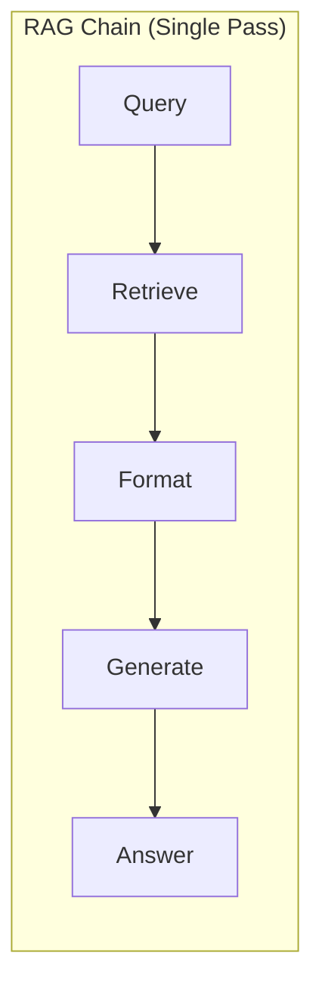
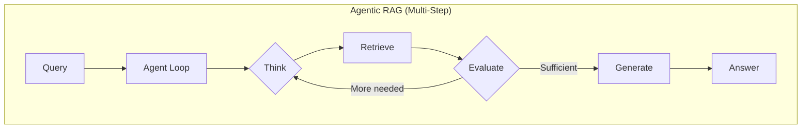
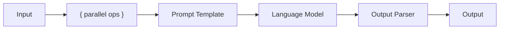

# RAG Chains

## Introduction

While agentic RAG patterns excel at complex, multi-step queries, many applications need fast, predictable responses. RAG Chains provide low-latency, single-pass retrieval that's perfect for production systems where response time matters more than handling edge cases.

RAG Chains follow a fixed pipeline: retrieve documents, format them as context, and generate a response. No agent loop, no iteration—just straightforward question answering. This simplicity makes them easier to debug, faster to execute, and more predictable in production.

### What We'll Cover

- When to use RAG Chains vs. Agentic RAG
- LangChain Expression Language (LCEL) for RAG
- Building efficient retrieval chains
- Prompt engineering for RAG
- Production optimizations

### Prerequisites

- Basic understanding of RAG concepts
- Familiarity with LangChain basics
- Understanding of vector stores

---

## RAG Chains vs. Agentic RAG





### When to Use Each

| Factor | RAG Chain | Agentic RAG |
|--------|-----------|-------------|
| **Latency** | 1-3 seconds | 5-30 seconds |
| **Cost** | Lower (fewer LLM calls) | Higher (multiple calls) |
| **Complexity** | Simple questions | Complex, multi-part |
| **Predictability** | High | Variable |
| **Debugging** | Easy | Challenging |
| **Use cases** | FAQ, support, search | Research, analysis |

---

## Basic RAG Chain

The simplest RAG chain uses LangChain Expression Language (LCEL) to compose retrieval and generation:

```python
from langchain_openai import ChatOpenAI, OpenAIEmbeddings
from langchain_core.vectorstores import InMemoryVectorStore
from langchain_core.prompts import ChatPromptTemplate
from langchain_core.output_parsers import StrOutputParser
from langchain_core.runnables import RunnablePassthrough

# Initialize components
llm = ChatOpenAI(model="gpt-4o-mini", temperature=0)
embeddings = OpenAIEmbeddings(model="text-embedding-3-small")
vector_store = InMemoryVectorStore(embeddings)

# Add documents
documents = [
    "Python was created by Guido van Rossum and first released in 1991.",
    "JavaScript was created by Brendan Eich in 1995 for Netscape Navigator.",
    "TypeScript was developed by Microsoft and released in 2012.",
    "Rust was originally designed by Graydon Hoare at Mozilla in 2010.",
]
vector_store.add_texts(documents)

# Create retriever
retriever = vector_store.as_retriever(search_kwargs={"k": 2})

# Define prompt template
prompt = ChatPromptTemplate.from_template("""Answer the question based only on the following context:

Context:
{context}

Question: {question}

Answer:""")

# Helper function to format documents
def format_docs(docs):
    return "\n\n".join(doc.page_content for doc in docs)

# Build the chain
rag_chain = (
    {"context": retriever | format_docs, "question": RunnablePassthrough()}
    | prompt
    | llm
    | StrOutputParser()
)

# Use the chain
answer = rag_chain.invoke("Who created Python?")
print(answer)
# "Python was created by Guido van Rossum and first released in 1991."
```

---

## Understanding LCEL

LangChain Expression Language lets you compose chains declaratively using the pipe (`|`) operator.

### Chain Components



### Parallel Execution

The dictionary syntax `{...}` executes operations in parallel:

```python
# These run in parallel:
{
    "context": retriever | format_docs,  # Retrieve and format
    "question": RunnablePassthrough()     # Pass through query
}
```

### Building Blocks

| Component | Purpose | Example |
|-----------|---------|---------|
| `RunnablePassthrough()` | Pass input unchanged | Pass question to prompt |
| `RunnableLambda(fn)` | Apply custom function | Format documents |
| `RunnableParallel({})` | Run operations in parallel | Retrieve + pass query |
| `| operator` | Chain operations sequentially | prompt \| llm |

---

## Enhanced RAG Chain Patterns

### Pattern 1: With Source Citations

Include source documents in the response:

```python
from langchain_core.runnables import RunnableParallel

def format_docs_with_sources(docs):
    """Format documents with source citations."""
    formatted = []
    for i, doc in enumerate(docs, 1):
        source = doc.metadata.get("source", "Unknown")
        formatted.append(f"[{i}] {doc.page_content}\nSource: {source}")
    return "\n\n".join(formatted)

prompt_with_sources = ChatPromptTemplate.from_template("""Answer the question based on the following context. 
Include citation numbers [1], [2], etc. when referencing information.

Context:
{context}

Question: {question}

Answer with citations:""")

rag_chain_with_sources = (
    RunnableParallel(
        context=retriever | format_docs_with_sources,
        question=RunnablePassthrough(),
        docs=retriever  # Also pass raw docs for metadata
    )
    | RunnablePassthrough.assign(
        answer=prompt_with_sources | llm | StrOutputParser()
    )
)

result = rag_chain_with_sources.invoke("Who created Python?")
print(result["answer"])
# "Python was created by Guido van Rossum [1] and was first released in 1991."
print(result["docs"])
# Access to source documents
```

### Pattern 2: With Confidence Scores

Return relevance scores with the answer:

```python
from pydantic import BaseModel, Field

class AnswerWithConfidence(BaseModel):
    """Answer with confidence assessment."""
    answer: str = Field(description="The answer to the question")
    confidence: str = Field(description="HIGH, MEDIUM, or LOW")
    reasoning: str = Field(description="Why this confidence level")

structured_llm = llm.with_structured_output(AnswerWithConfidence)

prompt_confidence = ChatPromptTemplate.from_template("""Based on the context, answer the question.
Assess your confidence:
- HIGH: Context directly answers the question
- MEDIUM: Context is related but requires inference
- LOW: Context doesn't adequately address the question

Context:
{context}

Question: {question}""")

rag_chain_confidence = (
    {"context": retriever | format_docs, "question": RunnablePassthrough()}
    | prompt_confidence
    | structured_llm
)

result = rag_chain_confidence.invoke("Who created Python?")
print(f"Answer: {result.answer}")
print(f"Confidence: {result.confidence}")
print(f"Reasoning: {result.reasoning}")
```

### Pattern 3: With Query Expansion

Improve retrieval by expanding the query:

```python
from langchain_core.runnables import RunnableLambda

def expand_query(query: str) -> list[str]:
    """Generate query variations for better retrieval."""
    expansion_prompt = ChatPromptTemplate.from_template(
        """Generate 3 alternative versions of this search query 
        that might help find relevant information:
        
        Query: {query}
        
        Return only the 3 alternative queries, one per line."""
    )
    
    result = (expansion_prompt | llm | StrOutputParser()).invoke({"query": query})
    variations = [query] + result.strip().split("\n")
    return variations[:4]  # Original + 3 variations

def retrieve_with_expansion(query: str) -> list:
    """Retrieve using expanded queries."""
    queries = expand_query(query)
    all_docs = []
    seen_content = set()
    
    for q in queries:
        docs = retriever.invoke(q)
        for doc in docs:
            if doc.page_content not in seen_content:
                all_docs.append(doc)
                seen_content.add(doc.page_content)
    
    return all_docs[:5]  # Return top 5 unique docs

expanded_rag_chain = (
    {"context": RunnableLambda(retrieve_with_expansion) | format_docs, 
     "question": RunnablePassthrough()}
    | prompt
    | llm
    | StrOutputParser()
)
```

---

## Streaming RAG Chains

For better user experience, stream responses as they're generated:

```python
import asyncio

async def stream_rag_response(question: str):
    """Stream the RAG response token by token."""
    async for chunk in rag_chain.astream(question):
        print(chunk, end="", flush=True)
    print()  # Newline at end

# Usage
asyncio.run(stream_rag_response("Who created Python?"))
```

### Streaming with Events

Track retrieval and generation separately:

```python
async def stream_with_events(question: str):
    """Stream with event tracking."""
    async for event in rag_chain.astream_events(question, version="v2"):
        if event["event"] == "on_retriever_end":
            print(f"Retrieved {len(event['data']['output'])} documents")
        elif event["event"] == "on_chat_model_stream":
            print(event["data"]["chunk"].content, end="", flush=True)
```

---

## Prompt Engineering for RAG

The prompt template significantly impacts RAG quality.

### Effective RAG Prompts

```python
# Basic prompt
basic_prompt = """Answer the question based on the context.

Context: {context}

Question: {question}"""

# Better: With instructions
improved_prompt = """You are a helpful assistant. Answer the question 
based ONLY on the provided context. If the context doesn't contain 
enough information, say "I don't have enough information to answer that."

Context:
{context}

Question: {question}

Answer:"""

# Best: With format and behavior guidance
production_prompt = """You are a knowledgeable assistant for our product documentation.

INSTRUCTIONS:
- Answer based ONLY on the provided context
- If information is incomplete, acknowledge what you know and what's missing
- Use bullet points for multi-part answers
- Keep responses concise but complete
- Never make up information not in the context

CONTEXT:
{context}

USER QUESTION: {question}

RESPONSE:"""
```

### Domain-Specific Prompts

| Domain | Key Prompt Elements |
|--------|-------------------|
| **Customer Support** | Friendly tone, action items, escalation guidance |
| **Technical Docs** | Code formatting, version specifics, examples |
| **Legal/Compliance** | Precise language, disclaimers, citations |
| **Medical** | Safety warnings, professional consultation advice |

---

## Production Optimizations

### Caching Embeddings

Avoid re-computing embeddings for repeated queries:

```python
from langchain.globals import set_llm_cache
from langchain_community.cache import InMemoryCache

# Enable caching
set_llm_cache(InMemoryCache())

# Or use Redis for distributed caching
from langchain_community.cache import RedisSemanticCache

set_llm_cache(RedisSemanticCache(
    redis_url="redis://localhost:6379",
    embedding=embeddings
))
```

### Batch Processing

Process multiple questions efficiently:

```python
async def batch_rag(questions: list[str]) -> list[str]:
    """Process multiple questions in parallel."""
    tasks = [rag_chain.ainvoke(q) for q in questions]
    return await asyncio.gather(*tasks)

# Usage
questions = [
    "Who created Python?",
    "When was JavaScript released?",
    "What company made TypeScript?"
]
answers = asyncio.run(batch_rag(questions))
```

### Retrieval Optimization

| Technique | Benefit | Trade-off |
|-----------|---------|-----------|
| **Smaller k** | Faster, less tokens | May miss relevant docs |
| **Larger chunks** | More context per doc | Higher token cost |
| **Metadata filtering** | Precise retrieval | Requires good metadata |
| **Hybrid search** | Better recall | More complex setup |

---

## Error Handling

Build resilient chains with proper error handling:

```python
from langchain_core.runnables import RunnableConfig

def safe_format_docs(docs):
    """Safely format documents with fallback."""
    if not docs:
        return "No relevant documents found."
    return "\n\n".join(doc.page_content for doc in docs)

# Add fallback behavior
rag_chain_safe = (
    {"context": retriever | safe_format_docs, "question": RunnablePassthrough()}
    | prompt
    | llm
    | StrOutputParser()
).with_fallbacks([
    # Fallback to direct LLM if chain fails
    ChatPromptTemplate.from_template(
        "I couldn't search the knowledge base. Based on general knowledge: {question}"
    ) | llm | StrOutputParser()
])
```

---

## Hands-On Exercise

Build a documentation RAG chain with the following features:

1. **Query expansion** — Generate 2 alternative queries
2. **Source citations** — Include document sources in answer
3. **Confidence scoring** — Assess answer reliability
4. **Streaming** — Stream the response to the user

<details>
<summary>💡 Hints</summary>

- Combine patterns from this lesson
- Use structured output for confidence scores
- Use `astream` for token-by-token streaming
- Track retrieved docs separately from the answer

</details>

<details>
<summary>✅ Solution Outline</summary>

```python
# 1. Create expansion function to generate query variants
# 2. Retrieve docs using all variants, deduplicate
# 3. Format docs with source metadata
# 4. Use structured output for answer + confidence
# 5. Wrap in async function with streaming
# See patterns above for implementation details
```

</details>

---

## Summary

✅ RAG Chains provide fast, predictable single-pass retrieval  
✅ LCEL enables declarative chain composition with the pipe operator  
✅ Enhanced patterns add citations, confidence scores, and query expansion  
✅ Streaming improves user experience for longer responses  
✅ Production optimizations include caching, batching, and error handling  

**Next:** [Self-Reflective RAG](./04-self-reflective-rag.md) — Answer grounding and quality checks

---

## Further Reading

- [LangChain RAG Tutorial](https://python.langchain.com/docs/tutorials/rag/) — Official RAG documentation
- [LCEL Conceptual Guide](https://python.langchain.com/docs/concepts/lcel/) — Understanding LangChain Expression Language
- [Retriever Documentation](https://python.langchain.com/docs/concepts/retrievers/) — Retriever patterns and options

<!-- 
Sources Consulted:
- LangChain RAG Tutorial: https://python.langchain.com/docs/tutorials/rag/
- LangChain LCEL: https://python.langchain.com/docs/concepts/lcel/
- LangChain Retrievers: https://python.langchain.com/docs/concepts/retrievers/
-->
