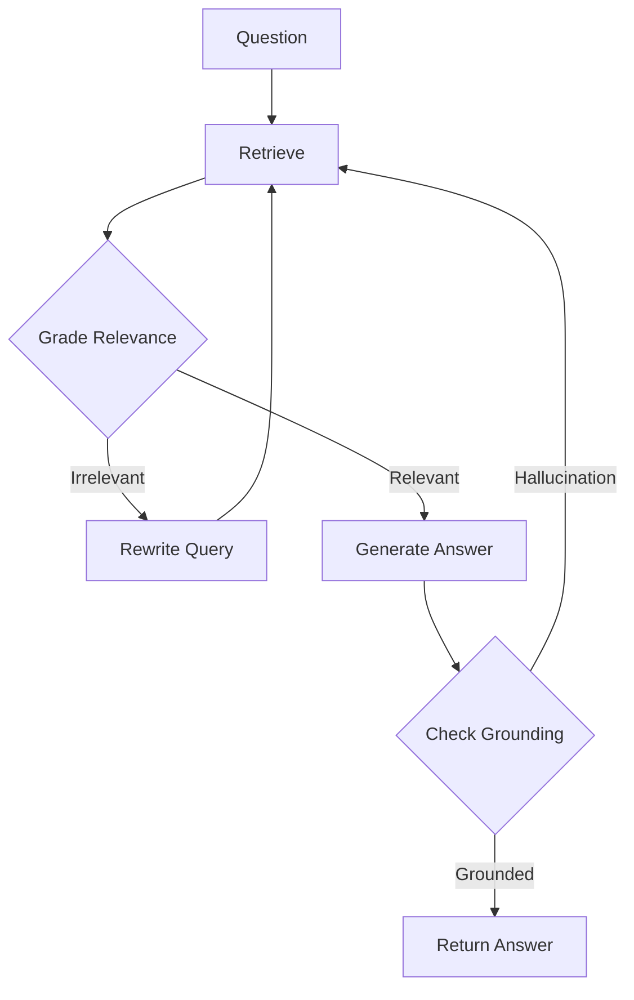
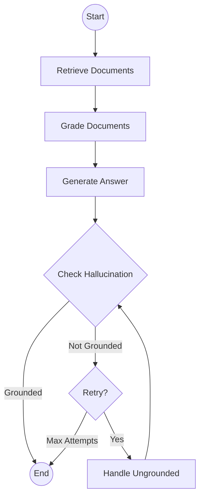

# Self-Reflective RAG

## Introduction

Standard RAG systems have a critical blind spot: they generate answers without checking if those answers are actually grounded in the retrieved documents. This leads to hallucinations—confident-sounding responses that aren't supported by the source material.

Self-Reflective RAG (also known as Self-RAG) adds an introspection layer that evaluates both retrieval quality and answer faithfulness before returning a response. The system asks itself: "Did I retrieve relevant documents? Is my answer actually supported by these documents?"

### What We'll Cover

- Understanding hallucination in RAG systems
- Document relevance grading
- Answer grounding verification
- Implementing self-reflection loops
- LangGraph implementation of Self-RAG

### Prerequisites

- Basic RAG implementation experience
- Understanding of LangGraph concepts
- Familiarity with structured outputs

---

## The Hallucination Problem

### Why RAG Systems Hallucinate

Even with retrieved context, LLMs can hallucinate because:

1. **Irrelevant retrievals** — Documents don't actually answer the question
2. **Partial information** — Context hints at an answer but doesn't confirm it
3. **Model knowledge bleed** — LLM uses training data instead of context
4. **Instruction following** — Model tries to be helpful even without evidence

```mermaid
flowchart TD
    Q[Question: What's our refund policy?]
    R[Retrieved: "We offer free shipping on orders over $50"]
    G[Generated: "Our refund policy allows returns within 30 days"]
    H[❌ HALLUCINATION: Answer not in context!]
    
    Q --> R --> G --> H
```

### Self-Reflection Solution



---

## Core Components

### 1. Document Relevance Grader

First, evaluate if retrieved documents are actually relevant to the question:

```python
from langchain_openai import ChatOpenAI
from pydantic import BaseModel, Field

llm = ChatOpenAI(model="gpt-4o-mini", temperature=0)

class RelevanceGrade(BaseModel):
    """Grade for document relevance."""
    is_relevant: bool = Field(
        description="Whether the document is relevant to the question"
    )
    reasoning: str = Field(
        description="Brief explanation of the relevance assessment"
    )

relevance_grader = llm.with_structured_output(RelevanceGrade)

def grade_document_relevance(document: str, question: str) -> RelevanceGrade:
    """Assess if a document is relevant to the question."""
    prompt = f"""Assess whether this document contains information 
    relevant to answering the question.
    
    Document: {document}
    
    Question: {question}
    
    Consider: Does this document help answer the question, even partially?
    Be generous - if there's any useful information, mark as relevant."""
    
    return relevance_grader.invoke(prompt)

# Example
doc = "Our return policy allows returns within 30 days with receipt."
question = "Can I return an item?"
grade = grade_document_relevance(doc, question)
print(f"Relevant: {grade.is_relevant}, Reason: {grade.reasoning}")
# Relevant: True, Reason: Document directly addresses return policy
```

### 2. Hallucination Detector

Check if the generated answer is supported by the documents:

```python
class GroundingGrade(BaseModel):
    """Assessment of answer grounding in documents."""
    is_grounded: bool = Field(
        description="Whether the answer is fully supported by the documents"
    )
    unsupported_claims: list[str] = Field(
        default_factory=list,
        description="Claims in the answer not supported by documents"
    )
    confidence: str = Field(
        description="HIGH, MEDIUM, or LOW confidence in grounding"
    )

grounding_checker = llm.with_structured_output(GroundingGrade)

def check_grounding(documents: str, answer: str, question: str) -> GroundingGrade:
    """Check if answer is grounded in the retrieved documents."""
    prompt = f"""Verify that every claim in the answer is supported 
    by the provided documents.
    
    Documents:
    {documents}
    
    Question: {question}
    
    Answer to verify: {answer}
    
    Check each factual claim in the answer. If ANY claim is not 
    explicitly supported by the documents, the answer is NOT grounded."""
    
    return grounding_checker.invoke(prompt)

# Example
docs = "Returns are accepted within 30 days. Original receipt required."
answer = "You can return items within 30 days with receipt. Refunds are processed in 5-7 business days."
question = "What's your return policy?"

grade = check_grounding(docs, answer, question)
print(f"Grounded: {grade.is_grounded}")
print(f"Unsupported claims: {grade.unsupported_claims}")
# Grounded: False
# Unsupported claims: ["Refunds are processed in 5-7 business days"]
```

### 3. Answer Quality Checker

Assess if the answer actually addresses the question:

```python
class AnswerQuality(BaseModel):
    """Assessment of answer quality."""
    answers_question: bool = Field(
        description="Whether the answer addresses the user's question"
    )
    is_complete: bool = Field(
        description="Whether the answer is complete or partial"
    )
    quality_score: int = Field(
        description="Quality score from 1-5",
        ge=1, le=5
    )

quality_checker = llm.with_structured_output(AnswerQuality)

def check_answer_quality(question: str, answer: str) -> AnswerQuality:
    """Assess if the answer adequately addresses the question."""
    prompt = f"""Evaluate if this answer adequately addresses the question.
    
    Question: {question}
    
    Answer: {answer}
    
    Consider:
    - Does it directly answer what was asked?
    - Is it complete or missing important information?
    - Is it clear and useful?"""
    
    return quality_checker.invoke(prompt)
```

---

## Complete Self-Reflective RAG Implementation

### Using LangGraph

```python
from typing import Annotated, TypedDict
from langgraph.graph import StateGraph, START, END
from langchain_openai import OpenAIEmbeddings
from langchain_core.vectorstores import InMemoryVectorStore

# Initialize components
embeddings = OpenAIEmbeddings(model="text-embedding-3-small")
vector_store = InMemoryVectorStore(embeddings)

# Add documents
documents = [
    "Our return policy allows returns within 30 days of purchase.",
    "Returns require the original receipt and packaging.",
    "Refunds are processed to the original payment method.",
    "Damaged items can be returned at any time with proof of damage.",
]
vector_store.add_texts(documents)
retriever = vector_store.as_retriever(search_kwargs={"k": 3})

class SelfRAGState(TypedDict):
    """State for self-reflective RAG."""
    question: str
    documents: list[str]
    relevant_docs: list[str]
    answer: str
    is_grounded: bool
    attempt: int
    max_attempts: int

def retrieve(state: SelfRAGState) -> SelfRAGState:
    """Retrieve documents for the question."""
    docs = retriever.invoke(state["question"])
    return {
        "documents": [doc.page_content for doc in docs]
    }

def grade_documents(state: SelfRAGState) -> SelfRAGState:
    """Grade each document for relevance."""
    relevant = []
    for doc in state["documents"]:
        grade = grade_document_relevance(doc, state["question"])
        if grade.is_relevant:
            relevant.append(doc)
    
    return {"relevant_docs": relevant}

def generate_answer(state: SelfRAGState) -> SelfRAGState:
    """Generate answer from relevant documents."""
    context = "\n\n".join(state["relevant_docs"])
    
    if not context:
        return {"answer": "I don't have enough relevant information to answer this question."}
    
    prompt = f"""Answer the question based ONLY on the provided context.
    If the context doesn't contain enough information, say so.
    
    Context:
    {context}
    
    Question: {state["question"]}"""
    
    response = llm.invoke(prompt)
    return {
        "answer": response.content,
        "attempt": state.get("attempt", 0) + 1
    }

def check_hallucination(state: SelfRAGState) -> SelfRAGState:
    """Check if answer is grounded in documents."""
    if not state["relevant_docs"]:
        return {"is_grounded": True}  # "No info" answer is grounded
    
    context = "\n\n".join(state["relevant_docs"])
    grade = check_grounding(context, state["answer"], state["question"])
    
    return {"is_grounded": grade.is_grounded}

def should_retry(state: SelfRAGState) -> str:
    """Decide whether to retry or return answer."""
    if state["is_grounded"]:
        return "grounded"
    if state.get("attempt", 0) >= state.get("max_attempts", 2):
        return "max_attempts"
    return "retry"

def handle_ungrounded(state: SelfRAGState) -> SelfRAGState:
    """Handle ungrounded answer by regenerating."""
    context = "\n\n".join(state["relevant_docs"])
    
    prompt = f"""Your previous answer contained information not in the context.
    Generate a new answer using ONLY facts from the context.
    If you cannot fully answer, acknowledge the limitation.
    
    Context:
    {context}
    
    Question: {state["question"]}
    
    Important: Only include facts explicitly stated in the context."""
    
    response = llm.invoke(prompt)
    return {"answer": response.content}

# Build the graph
graph = StateGraph(SelfRAGState)

# Add nodes
graph.add_node("retrieve", retrieve)
graph.add_node("grade_documents", grade_documents)
graph.add_node("generate", generate_answer)
graph.add_node("check_hallucination", check_hallucination)
graph.add_node("handle_ungrounded", handle_ungrounded)

# Add edges
graph.add_edge(START, "retrieve")
graph.add_edge("retrieve", "grade_documents")
graph.add_edge("grade_documents", "generate")
graph.add_edge("generate", "check_hallucination")

graph.add_conditional_edges(
    "check_hallucination",
    should_retry,
    {
        "grounded": END,
        "retry": "handle_ungrounded",
        "max_attempts": END
    }
)
graph.add_edge("handle_ungrounded", "check_hallucination")

# Compile
self_rag = graph.compile()
```

### Visualization



---

## Running Self-Reflective RAG

```python
# Example usage
result = self_rag.invoke({
    "question": "What's the return policy?",
    "documents": [],
    "relevant_docs": [],
    "answer": "",
    "is_grounded": False,
    "attempt": 0,
    "max_attempts": 2
})

print(f"Answer: {result['answer']}")
print(f"Grounded: {result['is_grounded']}")
print(f"Attempts: {result['attempt']}")
```

### With Streaming Events

```python
async def run_with_events(question: str):
    """Run Self-RAG with event streaming."""
    initial_state = {
        "question": question,
        "documents": [],
        "relevant_docs": [],
        "answer": "",
        "is_grounded": False,
        "attempt": 0,
        "max_attempts": 2
    }
    
    async for event in self_rag.astream_events(initial_state, version="v2"):
        if event["event"] == "on_chain_end":
            node = event.get("name", "")
            if node == "grade_documents":
                relevant_count = len(event["data"]["output"].get("relevant_docs", []))
                print(f"📄 Found {relevant_count} relevant documents")
            elif node == "check_hallucination":
                is_grounded = event["data"]["output"].get("is_grounded", False)
                print(f"✅ Grounded: {is_grounded}")
```

---

## Advanced Patterns

### Pattern 1: Confidence-Based Fallback

```python
class GradedAnswer(BaseModel):
    """Answer with confidence assessment."""
    answer: str
    confidence: str  # HIGH, MEDIUM, LOW
    sources_used: list[int]

def generate_with_confidence(state: SelfRAGState) -> SelfRAGState:
    """Generate answer with confidence score."""
    context = "\n\n".join(
        f"[{i+1}] {doc}" 
        for i, doc in enumerate(state["relevant_docs"])
    )
    
    prompt = f"""Answer based ONLY on the provided context.
    Rate your confidence:
    - HIGH: Context directly answers the question
    - MEDIUM: Context partially answers, some inference needed
    - LOW: Context barely addresses the question
    
    Context:
    {context}
    
    Question: {state["question"]}"""
    
    graded_llm = llm.with_structured_output(GradedAnswer)
    result = graded_llm.invoke(prompt)
    
    return {
        "answer": result.answer,
        "confidence": result.confidence,
        "sources": result.sources_used
    }
```

### Pattern 2: Query Transformation on Poor Retrieval

```python
class QueryRewrite(BaseModel):
    """Rewritten query for better retrieval."""
    rewritten_query: str
    reasoning: str

def rewrite_query(state: SelfRAGState) -> SelfRAGState:
    """Rewrite query when retrieval is poor."""
    prompt = f"""The original query didn't retrieve relevant documents.
    Rewrite it to better match potential document content.
    
    Original query: {state["question"]}
    
    Retrieved (not relevant):
    {chr(10).join(state["documents"][:2])}
    
    Generate a better search query that might find relevant information."""
    
    rewriter = llm.with_structured_output(QueryRewrite)
    result = rewriter.invoke(prompt)
    
    return {"question": result.rewritten_query}
```

### Pattern 3: Multi-Pass Verification

```python
def verify_multiple_times(answer: str, context: str, question: str, 
                          passes: int = 3) -> bool:
    """Run multiple verification passes for high-stakes answers."""
    grounded_count = 0
    
    for _ in range(passes):
        grade = check_grounding(context, answer, question)
        if grade.is_grounded:
            grounded_count += 1
    
    # Require majority agreement
    return grounded_count > passes // 2
```

---

## Performance Considerations

### Cost vs. Quality Trade-offs

| Approach | LLM Calls | Accuracy | Use Case |
|----------|-----------|----------|----------|
| Basic RAG | 1 | Low | Low-stakes, high-volume |
| Single reflection | 2-3 | Medium | General Q&A |
| Full Self-RAG | 4-6 | High | Critical applications |
| Multi-pass | 6-10 | Very High | Legal, medical, financial |

### Optimization Strategies

```python
# 1. Batch document grading
async def grade_documents_batch(docs: list[str], question: str) -> list[bool]:
    """Grade all documents in parallel."""
    tasks = [
        asyncio.create_task(
            asyncio.to_thread(grade_document_relevance, doc, question)
        )
        for doc in docs
    ]
    results = await asyncio.gather(*tasks)
    return [r.is_relevant for r in results]

# 2. Early exit on high confidence
def should_skip_verification(confidence: str) -> bool:
    """Skip verification for very high confidence answers."""
    return confidence == "HIGH"

# 3. Cached grading results
from functools import lru_cache

@lru_cache(maxsize=1000)
def cached_relevance_check(doc_hash: str, question_hash: str) -> bool:
    """Cache relevance checks for repeated queries."""
    # Implementation would use actual document/question
    pass
```

---

## Hands-On Exercise

Build a Self-Reflective RAG system for a FAQ bot with these features:

1. **Document grading** — Filter irrelevant retrievals
2. **Hallucination detection** — Verify answer grounding
3. **Query rewriting** — Transform queries on poor retrieval
4. **Confidence scoring** — Rate answer reliability

Test with edge cases:
- Questions not covered by documents
- Questions partially covered
- Ambiguous questions

<details>
<summary>💡 Hints</summary>

- Use structured outputs for all grading tasks
- Track metrics: relevance rate, grounding rate, rewrites needed
- Test with deliberately tricky questions
- Add appropriate fallback messages

</details>

<details>
<summary>✅ Solution Outline</summary>

```python
# 1. Define all grading components with Pydantic models
# 2. Build LangGraph with nodes: retrieve, grade, generate, verify
# 3. Add conditional edges for retry logic
# 4. Include query rewriting on relevance failure
# 5. Add confidence scoring to final answer
# See implementation patterns above for details
```

</details>

---

## Summary

✅ Self-Reflective RAG adds introspection to detect and prevent hallucinations  
✅ Document grading filters irrelevant retrievals before generation  
✅ Grounding verification ensures answers are supported by documents  
✅ LangGraph provides the control flow for reflection loops  
✅ Balance verification depth with latency and cost requirements  

**Next:** [Corrective RAG](./05-corrective-rag.md) — Error detection with web search fallback

---

## Further Reading

- [Self-RAG Paper](https://arxiv.org/abs/2310.11511) — Original academic research
- [LangGraph Self-RAG Tutorial](https://langchain-ai.github.io/langgraph/tutorials/rag/langgraph_self_rag/) — Implementation guide
- [Hallucination Detection](https://arxiv.org/abs/2311.09000) — Survey of hallucination detection methods

<!-- 
Sources Consulted:
- Self-RAG Paper: https://arxiv.org/abs/2310.11511
- LangGraph Self-RAG: https://langchain-ai.github.io/langgraph/tutorials/rag/langgraph_self_rag/
- LangChain RAG Tutorial: https://python.langchain.com/docs/tutorials/rag/
-->
