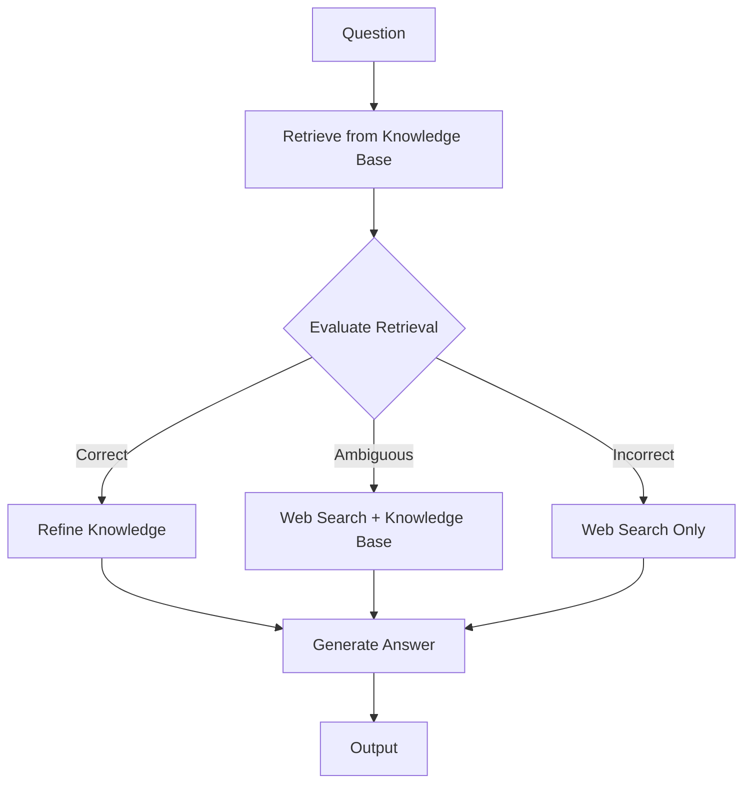
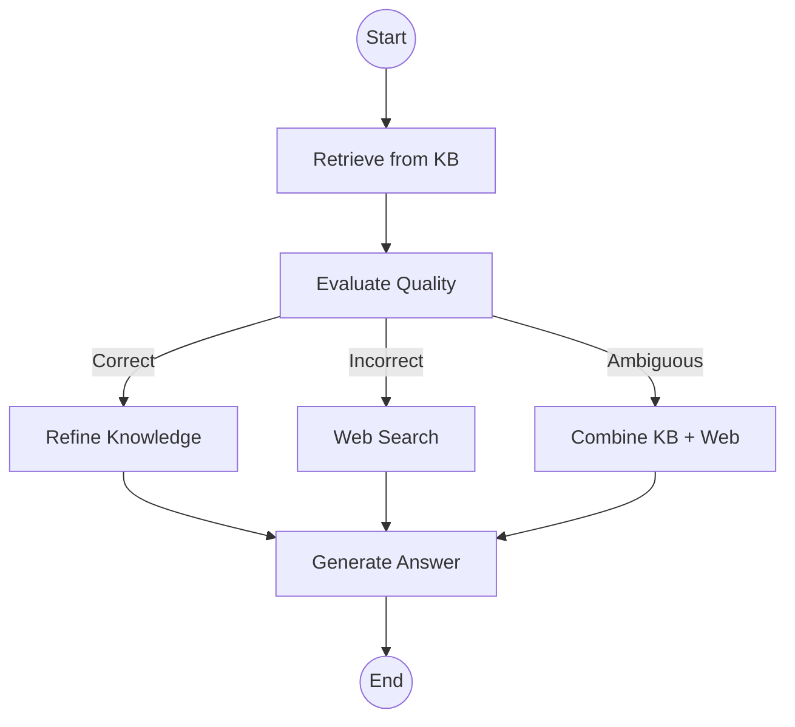

# Corrective RAG (CRAG)

## Introduction

Self-Reflective RAG catches hallucinations, but what happens when your knowledge base simply doesn't have the answer? Corrective RAG (CRAG) takes the next logical step: when local retrieval fails, fall back to web search to find the information.

CRAG implements a sophisticated error-correction mechanism that evaluates retrieval quality and dynamically switches between knowledge sources. This makes RAG systems more robust and ensures users get answers even when documents are incomplete or outdated.

### What We'll Cover

- Understanding CRAG architecture and flow
- Implementing retrieval confidence scoring
- Web search fallback integration
- Knowledge refinement and synthesis
- Complete CRAG implementation with LangGraph

### Prerequisites

- Understanding of Self-Reflective RAG
- Familiarity with web search APIs
- LangGraph basics

---

## CRAG Architecture

### The CRAG Flow



### Retrieval Evaluation Categories

| Category | Condition | Action |
|----------|-----------|--------|
| **Correct** | At least one relevant document | Use retrieved documents |
| **Ambiguous** | Partially relevant documents | Combine KB + web search |
| **Incorrect** | No relevant documents | Fall back to web search |

---

## Core Components

### 1. Retrieval Quality Evaluator

```python
from langchain_openai import ChatOpenAI
from pydantic import BaseModel, Field
from enum import Enum

class RetrievalQuality(str, Enum):
    CORRECT = "correct"
    AMBIGUOUS = "ambiguous"
    INCORRECT = "incorrect"

class RetrievalEvaluation(BaseModel):
    """Evaluation of retrieval quality."""
    quality: RetrievalQuality = Field(
        description="Overall quality: correct, ambiguous, or incorrect"
    )
    relevant_docs: list[int] = Field(
        description="Indices of relevant documents (0-indexed)"
    )
    reasoning: str = Field(
        description="Explanation of the evaluation"
    )

llm = ChatOpenAI(model="gpt-4o-mini", temperature=0)
evaluator = llm.with_structured_output(RetrievalEvaluation)

def evaluate_retrieval(question: str, documents: list[str]) -> RetrievalEvaluation:
    """Evaluate if retrieved documents can answer the question."""
    docs_text = "\n\n".join(
        f"[{i}] {doc}" for i, doc in enumerate(documents)
    )
    
    prompt = f"""Evaluate if these documents can answer the question.

Question: {question}

Documents:
{docs_text}

Evaluate:
- CORRECT: At least one document directly answers the question
- AMBIGUOUS: Documents are related but don't fully answer
- INCORRECT: Documents are not relevant to the question

Identify which document indices (0-indexed) are relevant."""
    
    return evaluator.invoke(prompt)

# Example
docs = [
    "Python 3.12 was released in October 2023.",
    "JavaScript is the most popular programming language.",
    "Python uses indentation for code blocks.",
]
result = evaluate_retrieval("When was Python 3.12 released?", docs)
print(f"Quality: {result.quality}")  # CORRECT
print(f"Relevant docs: {result.relevant_docs}")  # [0]
```

### 2. Web Search Integration

```python
from langchain_community.tools import TavilySearchResults

# Initialize web search tool
web_search = TavilySearchResults(
    max_results=3,
    search_depth="advanced",
    include_answer=True
)

async def search_web(query: str) -> list[str]:
    """Search the web for information."""
    results = await web_search.ainvoke({"query": query})
    
    # Extract content from results
    return [
        result.get("content", result.get("snippet", ""))
        for result in results
        if result.get("content") or result.get("snippet")
    ]

# Alternative: Using DuckDuckGo (free, no API key)
from langchain_community.tools import DuckDuckGoSearchResults

ddg_search = DuckDuckGoSearchResults(num_results=3)

def search_web_ddg(query: str) -> list[str]:
    """Search using DuckDuckGo."""
    results = ddg_search.invoke(query)
    # Parse results (returns a string of results)
    return [results]  # Simplified - parse as needed
```

### 3. Knowledge Refiner

The refiner extracts only the relevant portions of retrieved documents:

```python
class RefinedKnowledge(BaseModel):
    """Refined, relevant knowledge extracted from documents."""
    key_facts: list[str] = Field(
        description="Key facts relevant to the question"
    )
    summary: str = Field(
        description="Concise summary of relevant information"
    )

refiner = llm.with_structured_output(RefinedKnowledge)

def refine_knowledge(question: str, documents: list[str]) -> RefinedKnowledge:
    """Extract and refine relevant knowledge from documents."""
    docs_text = "\n\n".join(documents)
    
    prompt = f"""Extract only the information relevant to answering this question.
    Remove any irrelevant details, tangents, or filler content.
    
    Question: {question}
    
    Documents:
    {docs_text}
    
    Extract key facts and provide a focused summary."""
    
    return refiner.invoke(prompt)
```

---

## Complete CRAG Implementation

### Using LangGraph

```python
from typing import Annotated, TypedDict, Literal
from langgraph.graph import StateGraph, START, END
from langchain_openai import OpenAIEmbeddings
from langchain_core.vectorstores import InMemoryVectorStore

# Initialize components
embeddings = OpenAIEmbeddings(model="text-embedding-3-small")
vector_store = InMemoryVectorStore(embeddings)

# Add documents to knowledge base
knowledge_base = [
    "Our company was founded in 2010 in San Francisco.",
    "We offer three pricing tiers: Basic ($10/mo), Pro ($25/mo), Enterprise (custom).",
    "Customer support is available Monday-Friday, 9 AM - 5 PM PST.",
    "Our product integrates with Slack, Jira, and GitHub.",
]
vector_store.add_texts(knowledge_base)
retriever = vector_store.as_retriever(search_kwargs={"k": 3})

class CRAGState(TypedDict):
    """State for Corrective RAG."""
    question: str
    documents: list[str]
    web_results: list[str]
    retrieval_quality: str
    refined_knowledge: str
    answer: str

def retrieve_documents(state: CRAGState) -> CRAGState:
    """Retrieve from knowledge base."""
    docs = retriever.invoke(state["question"])
    return {"documents": [doc.page_content for doc in docs]}

def evaluate_documents(state: CRAGState) -> CRAGState:
    """Evaluate retrieval quality."""
    evaluation = evaluate_retrieval(state["question"], state["documents"])
    
    # Filter to only relevant documents
    if evaluation.relevant_docs:
        relevant = [
            state["documents"][i] 
            for i in evaluation.relevant_docs 
            if i < len(state["documents"])
        ]
        return {
            "documents": relevant,
            "retrieval_quality": evaluation.quality.value
        }
    
    return {"retrieval_quality": evaluation.quality.value}

def route_by_quality(state: CRAGState) -> Literal["refine", "web_search", "web_and_refine"]:
    """Route based on retrieval quality."""
    quality = state["retrieval_quality"]
    if quality == "correct":
        return "refine"
    elif quality == "incorrect":
        return "web_search"
    else:  # ambiguous
        return "web_and_refine"

def refine_documents(state: CRAGState) -> CRAGState:
    """Refine retrieved documents."""
    refined = refine_knowledge(state["question"], state["documents"])
    return {"refined_knowledge": refined.summary}

def search_web_node(state: CRAGState) -> CRAGState:
    """Search the web for additional information."""
    import asyncio
    results = asyncio.run(search_web(state["question"]))
    return {"web_results": results}

def combine_sources(state: CRAGState) -> CRAGState:
    """Combine knowledge base and web results."""
    # Refine both sources
    all_docs = state.get("documents", []) + state.get("web_results", [])
    if all_docs:
        refined = refine_knowledge(state["question"], all_docs)
        return {"refined_knowledge": refined.summary}
    return {"refined_knowledge": ""}

def generate_answer(state: CRAGState) -> CRAGState:
    """Generate final answer from refined knowledge."""
    knowledge = state.get("refined_knowledge", "")
    web_results = state.get("web_results", [])
    
    # Determine source for context
    if knowledge:
        context = knowledge
        source_note = ""
    elif web_results:
        context = "\n\n".join(web_results)
        source_note = "\n\n(Note: This answer is based on web search results.)"
    else:
        context = ""
        source_note = ""
    
    if not context:
        return {"answer": "I couldn't find relevant information to answer your question."}
    
    prompt = f"""Answer the question based on the following information.
    Be concise and accurate.
    
    Information:
    {context}
    
    Question: {state["question"]}"""
    
    response = llm.invoke(prompt)
    return {"answer": response.content + source_note}

# Build the graph
graph = StateGraph(CRAGState)

# Add nodes
graph.add_node("retrieve", retrieve_documents)
graph.add_node("evaluate", evaluate_documents)
graph.add_node("refine", refine_documents)
graph.add_node("web_search", search_web_node)
graph.add_node("combine", combine_sources)
graph.add_node("generate", generate_answer)

# Add edges
graph.add_edge(START, "retrieve")
graph.add_edge("retrieve", "evaluate")

graph.add_conditional_edges(
    "evaluate",
    route_by_quality,
    {
        "refine": "refine",
        "web_search": "web_search",
        "web_and_refine": "combine"
    }
)

# Handle the ambiguous case - need web search first
graph.add_edge("refine", "generate")
graph.add_edge("web_search", "generate")
graph.add_edge("combine", "generate")
graph.add_edge("generate", END)

# Compile
crag = graph.compile()
```

### Visualization



---

## Running CRAG

```python
# Test with different scenarios
def test_crag(question: str):
    """Test CRAG with a question."""
    result = crag.invoke({
        "question": question,
        "documents": [],
        "web_results": [],
        "retrieval_quality": "",
        "refined_knowledge": "",
        "answer": ""
    })
    
    print(f"Question: {question}")
    print(f"Quality: {result['retrieval_quality']}")
    print(f"Answer: {result['answer']}")
    print("-" * 50)

# Scenario 1: Question answered by KB
test_crag("What are your pricing tiers?")
# Quality: correct
# Answer: We offer three pricing tiers: Basic ($10/mo), Pro ($25/mo)...

# Scenario 2: Question not in KB
test_crag("What's the current weather in San Francisco?")
# Quality: incorrect
# Answer: [Web search result about weather]

# Scenario 3: Partially answered
test_crag("What integrations do you support and how do I set them up?")
# Quality: ambiguous
# Answer: [Combined KB + web info]
```

---

## Advanced CRAG Patterns

### Pattern 1: Confidence-Based Web Search

```python
class ConfidenceScore(BaseModel):
    """Confidence in the answer."""
    score: float = Field(ge=0.0, le=1.0)
    needs_web_search: bool

def should_supplement_with_web(
    question: str, 
    answer: str, 
    threshold: float = 0.7
) -> bool:
    """Check if web search should supplement KB answer."""
    prompt = f"""Rate your confidence that this answer fully addresses the question.
    
    Question: {question}
    Answer: {answer}
    
    Score from 0.0 (no confidence) to 1.0 (fully confident).
    Set needs_web_search=true if score < {threshold}."""
    
    scorer = llm.with_structured_output(ConfidenceScore)
    result = scorer.invoke(prompt)
    return result.needs_web_search
```

### Pattern 2: Query Decomposition for Web Search

```python
class SearchQueries(BaseModel):
    """Optimized queries for web search."""
    queries: list[str] = Field(
        description="2-3 specific search queries"
    )

def generate_search_queries(question: str, context: str = "") -> list[str]:
    """Generate optimized web search queries."""
    prompt = f"""Generate 2-3 specific search queries to find information 
    that would help answer this question.
    
    Question: {question}
    
    {"Existing context (find what's missing):" + context if context else ""}
    
    Make queries specific and searchable."""
    
    generator = llm.with_structured_output(SearchQueries)
    result = generator.invoke(prompt)
    return result.queries
```

### Pattern 3: Source Attribution

```python
class SourcedAnswer(BaseModel):
    """Answer with source attribution."""
    answer: str
    kb_sources: list[str] = Field(default_factory=list)
    web_sources: list[str] = Field(default_factory=list)
    confidence: str

def generate_with_sources(
    question: str,
    kb_docs: list[str],
    web_results: list[str]
) -> SourcedAnswer:
    """Generate answer with clear source attribution."""
    prompt = f"""Answer the question using the provided sources.
    Clearly indicate which sources support each claim.
    
    Knowledge Base Documents:
    {chr(10).join(f'[KB-{i}] {d}' for i, d in enumerate(kb_docs))}
    
    Web Results:
    {chr(10).join(f'[WEB-{i}] {d}' for i, d in enumerate(web_results))}
    
    Question: {question}
    
    Provide the answer and list which sources (KB-0, WEB-1, etc.) you used."""
    
    sourced_llm = llm.with_structured_output(SourcedAnswer)
    return sourced_llm.invoke(prompt)
```

---

## Web Search Providers

### Comparison of Options

| Provider | API Key | Cost | Quality | Speed |
|----------|---------|------|---------|-------|
| **Tavily** | Required | ~$0.01/search | High | Fast |
| **Serper** | Required | ~$0.004/search | High | Fast |
| **DuckDuckGo** | None | Free | Medium | Slow |
| **Google Search API** | Required | ~$0.005/search | High | Fast |
| **Bing Search** | Required | ~$0.005/search | High | Fast |

### Implementation Examples

```python
# Tavily (recommended)
from langchain_community.tools import TavilySearchResults
tavily = TavilySearchResults(max_results=3)

# Serper (Google results)
from langchain_community.utilities import GoogleSerperAPIWrapper
serper = GoogleSerperAPIWrapper()

# DuckDuckGo (free, no API key)
from langchain_community.tools import DuckDuckGoSearchRun
ddg = DuckDuckGoSearchRun()

# Unified interface
async def web_search(query: str, provider: str = "tavily") -> list[str]:
    """Search web using specified provider."""
    if provider == "tavily":
        results = await tavily.ainvoke(query)
        return [r["content"] for r in results]
    elif provider == "serper":
        results = serper.run(query)
        return [results]
    elif provider == "ddg":
        results = ddg.run(query)
        return [results]
```

---

## Error Handling and Fallbacks

```python
import asyncio
from typing import Optional

async def robust_web_search(
    query: str, 
    timeout: float = 10.0,
    fallback_providers: list[str] = ["tavily", "ddg"]
) -> list[str]:
    """Web search with timeout and fallbacks."""
    
    for provider in fallback_providers:
        try:
            results = await asyncio.wait_for(
                web_search(query, provider),
                timeout=timeout
            )
            if results:
                return results
        except asyncio.TimeoutError:
            print(f"Timeout with {provider}, trying next...")
            continue
        except Exception as e:
            print(f"Error with {provider}: {e}")
            continue
    
    return []  # All providers failed

# Use in CRAG
async def search_web_robust(state: CRAGState) -> CRAGState:
    """Robust web search with fallbacks."""
    results = await robust_web_search(
        state["question"],
        timeout=10.0,
        fallback_providers=["tavily", "ddg"]
    )
    
    if not results:
        return {
            "web_results": [],
            "answer": "Unable to search the web. Please try again later."
        }
    
    return {"web_results": results}
```

---

## Hands-On Exercise

Build a complete CRAG system with these features:

1. **Three-tier evaluation** — Correct, Ambiguous, Incorrect
2. **Web search fallback** — When KB fails
3. **Source attribution** — Track KB vs. web sources
4. **Graceful degradation** — Handle search failures

Test scenarios:
- Questions fully answered by KB
- Questions requiring web search
- Questions needing both sources
- Edge case: web search timeout

<details>
<summary>💡 Hints</summary>

- Use Tavily or DuckDuckGo for web search
- Track source type in metadata
- Add timeout handling for web requests
- Consider caching web results

</details>

<details>
<summary>✅ Solution Outline</summary>

```python
# 1. Set up retrieval evaluator with three categories
# 2. Configure web search with fallback providers
# 3. Build LangGraph with conditional routing
# 4. Add source tracking throughout the pipeline
# 5. Implement robust error handling
# See implementation above for complete details
```

</details>

---

## Summary

✅ CRAG adds web search fallback when knowledge base retrieval fails  
✅ Three-tier evaluation (correct/ambiguous/incorrect) guides the routing  
✅ Knowledge refinement extracts only relevant information  
✅ Multiple web search providers offer different cost/quality trade-offs  
✅ Robust error handling ensures graceful degradation  

**Next:** [Graph RAG](./06-graph-rag.md) — Microsoft's knowledge graph approach

---

## Further Reading

- [CRAG Paper](https://arxiv.org/pdf/2401.15884.pdf) — Original Corrective RAG research
- [LangGraph CRAG Tutorial](https://langchain-ai.github.io/langgraph/tutorials/rag/langgraph_crag/) — Implementation guide
- [Tavily Search](https://tavily.com/) — AI-optimized search API

<!-- 
Sources Consulted:
- CRAG Paper: https://arxiv.org/pdf/2401.15884.pdf
- LangGraph CRAG: https://langchain-ai.github.io/langgraph/tutorials/rag/langgraph_crag/
- Tavily Documentation: https://docs.tavily.com/
-->
