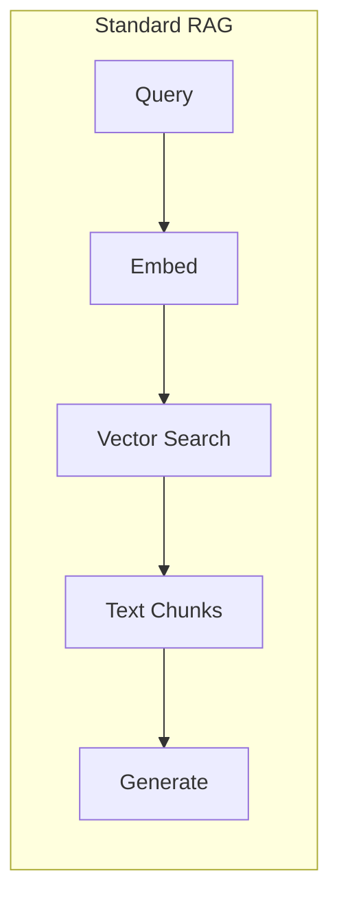
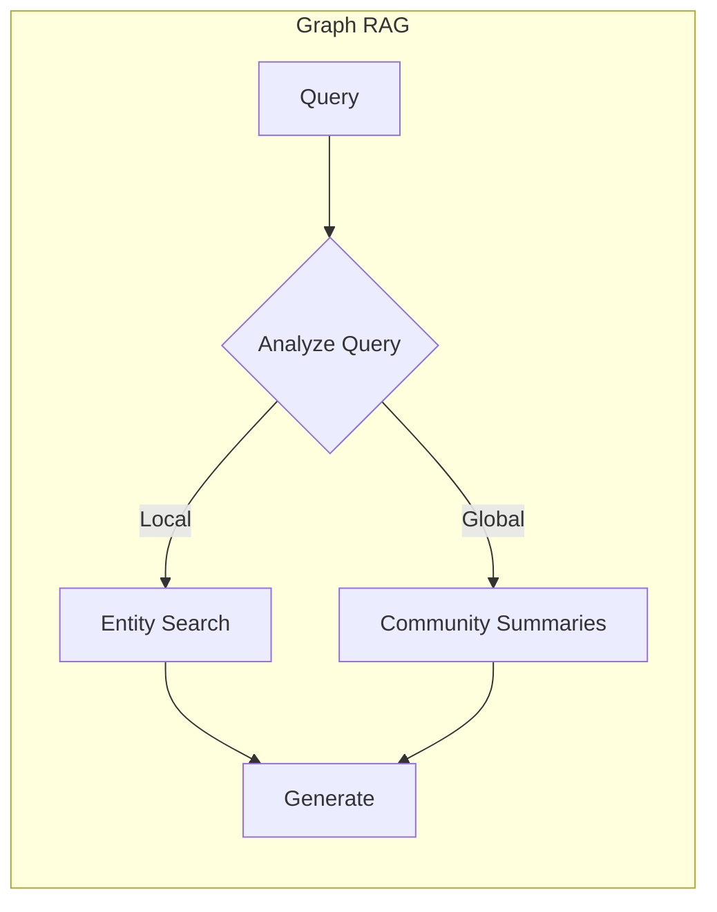
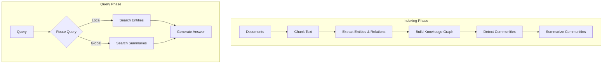

# Graph RAG

## Introduction

Traditional RAG excels at finding specific facts, but struggles with questions that require understanding relationships across your entire document collection. "What are the main themes in this research corpus?" or "How do different departments collaborate?" requires synthesizing information that no single chunk contains.

Graph RAG, pioneered by Microsoft Research, solves this by building a knowledge graph from your documents, detecting communities of related entities, and creating hierarchical summaries. This enables both precise retrieval and holistic understanding of large document collections.

### What We'll Cover

- Understanding the Graph RAG approach
- Entity and relationship extraction
- Community detection and summarization
- Implementing Graph RAG pipelines
- When to use Graph RAG vs. standard RAG

### Prerequisites

- Familiarity with knowledge graphs
- Understanding of basic RAG concepts
- Experience with document processing

---

## The Graph RAG Approach

### Why Knowledge Graphs?

Standard RAG works like searching a library index—great for specific facts, but missing the big picture. Graph RAG works like having a research assistant who has read everything and understands how concepts connect.





### Two Query Modes

| Mode | Question Type | Approach | Example |
|------|--------------|----------|---------|
| **Local** | Specific entity facts | Search entities & neighbors | "What projects does Alice lead?" |
| **Global** | Corpus-wide themes | Use community summaries | "What are the main research themes?" |

---

## Graph RAG Pipeline

### Overview



---

## Building a Knowledge Graph

### Step 1: Entity and Relationship Extraction

```python
from langchain_openai import ChatOpenAI
from pydantic import BaseModel, Field

llm = ChatOpenAI(model="gpt-4o-mini", temperature=0)

class Entity(BaseModel):
    """An entity extracted from text."""
    name: str = Field(description="The entity name")
    type: str = Field(description="Entity type: PERSON, ORG, CONCEPT, LOCATION, etc.")
    description: str = Field(description="Brief description of the entity")

class Relationship(BaseModel):
    """A relationship between entities."""
    source: str = Field(description="Source entity name")
    target: str = Field(description="Target entity name")
    relationship: str = Field(description="Type of relationship")
    description: str = Field(description="Description of the relationship")

class ExtractionResult(BaseModel):
    """Entities and relationships extracted from text."""
    entities: list[Entity]
    relationships: list[Relationship]

extractor = llm.with_structured_output(ExtractionResult)

def extract_graph_elements(text: str) -> ExtractionResult:
    """Extract entities and relationships from text."""
    prompt = f"""Extract all entities and relationships from this text.
    
    For entities, identify:
    - People, organizations, locations
    - Key concepts, projects, products
    - Technologies, methodologies
    
    For relationships, identify how entities connect:
    - Works for, manages, created
    - Located in, part of, uses
    - Collaborates with, depends on
    
    Text:
    {text}"""
    
    return extractor.invoke(prompt)

# Example
text = """
Dr. Sarah Chen leads the AI Research team at TechCorp. 
The team is developing Project Atlas, a machine learning platform 
that uses PyTorch for deep learning. TechCorp is headquartered 
in San Francisco and collaborates with Stanford University 
on natural language processing research.
"""

result = extract_graph_elements(text)

for entity in result.entities:
    print(f"Entity: {entity.name} ({entity.type})")
# Entity: Dr. Sarah Chen (PERSON)
# Entity: TechCorp (ORG)
# Entity: Project Atlas (PROJECT)
# ...

for rel in result.relationships:
    print(f"Relationship: {rel.source} --[{rel.relationship}]--> {rel.target}")
# Relationship: Dr. Sarah Chen --[leads]--> AI Research team
# Relationship: TechCorp --[collaborates with]--> Stanford University
```

### Step 2: Building the Graph

```python
import networkx as nx
from collections import defaultdict

class KnowledgeGraph:
    """A knowledge graph for Graph RAG."""
    
    def __init__(self):
        self.graph = nx.DiGraph()
        self.entity_info = {}
    
    def add_extraction(self, result: ExtractionResult):
        """Add extracted entities and relationships to the graph."""
        # Add entities as nodes
        for entity in result.entities:
            self.graph.add_node(
                entity.name,
                type=entity.type,
                description=entity.description
            )
            self.entity_info[entity.name] = entity
        
        # Add relationships as edges
        for rel in result.relationships:
            self.graph.add_edge(
                rel.source,
                rel.target,
                relationship=rel.relationship,
                description=rel.description
            )
    
    def get_entity_context(self, entity_name: str, depth: int = 2) -> dict:
        """Get an entity and its neighborhood."""
        if entity_name not in self.graph:
            return None
        
        # Get subgraph within depth
        nodes = {entity_name}
        current_level = {entity_name}
        
        for _ in range(depth):
            next_level = set()
            for node in current_level:
                next_level.update(self.graph.predecessors(node))
                next_level.update(self.graph.successors(node))
            nodes.update(next_level)
            current_level = next_level
        
        subgraph = self.graph.subgraph(nodes)
        
        return {
            "entity": self.entity_info.get(entity_name),
            "neighbors": [self.entity_info.get(n) for n in nodes if n != entity_name],
            "relationships": list(subgraph.edges(data=True))
        }
    
    def get_all_entities(self) -> list[Entity]:
        """Get all entities in the graph."""
        return list(self.entity_info.values())

# Build graph from documents
kg = KnowledgeGraph()

documents = [
    "Dr. Sarah Chen leads AI Research at TechCorp...",
    "TechCorp's CEO, Michael Park, announced a partnership...",
    "Project Atlas uses transformer architectures..."
]

for doc in documents:
    extraction = extract_graph_elements(doc)
    kg.add_extraction(extraction)

print(f"Graph has {kg.graph.number_of_nodes()} entities")
print(f"Graph has {kg.graph.number_of_edges()} relationships")
```

### Step 3: Community Detection

Communities are clusters of related entities. Detecting them enables answering global questions.

```python
import community as community_louvain  # python-louvain package

class GraphWithCommunities(KnowledgeGraph):
    """Knowledge graph with community detection."""
    
    def __init__(self):
        super().__init__()
        self.communities = {}
        self.community_summaries = {}
    
    def detect_communities(self):
        """Detect communities using Louvain algorithm."""
        # Convert to undirected for community detection
        undirected = self.graph.to_undirected()
        
        # Detect communities
        partition = community_louvain.best_partition(undirected)
        
        # Group entities by community
        self.communities = defaultdict(list)
        for entity, community_id in partition.items():
            self.communities[community_id].append(entity)
        
        return self.communities
    
    def summarize_community(self, community_id: int) -> str:
        """Generate a summary of a community."""
        entities = self.communities.get(community_id, [])
        if not entities:
            return ""
        
        # Gather entity info
        entity_descriptions = []
        for name in entities:
            entity = self.entity_info.get(name)
            if entity:
                entity_descriptions.append(
                    f"- {entity.name} ({entity.type}): {entity.description}"
                )
        
        # Gather relationships within community
        relationships = []
        for source, target, data in self.graph.edges(data=True):
            if source in entities and target in entities:
                relationships.append(
                    f"- {source} {data['relationship']} {target}"
                )
        
        prompt = f"""Summarize this community of related entities:

Entities:
{chr(10).join(entity_descriptions)}

Relationships:
{chr(10).join(relationships)}

Provide a 2-3 sentence summary describing what this community represents 
and the key themes or activities it encompasses."""
        
        summary = llm.invoke(prompt).content
        self.community_summaries[community_id] = summary
        return summary
    
    def summarize_all_communities(self):
        """Generate summaries for all communities."""
        for community_id in self.communities:
            self.summarize_community(community_id)
        return self.community_summaries

# Usage
kg = GraphWithCommunities()
# ... add documents ...
kg.detect_communities()
summaries = kg.summarize_all_communities()

for cid, summary in summaries.items():
    print(f"Community {cid}: {summary[:100]}...")
```

---

## Graph RAG Query Modes

### Local Search

For specific entity questions, search the graph directly:

```python
def local_search(kg: GraphWithCommunities, query: str) -> str:
    """Search for specific entity information."""
    
    # 1. Extract entities from query
    query_extraction = extract_graph_elements(query)
    query_entities = [e.name for e in query_extraction.entities]
    
    # 2. Find matching entities in graph
    context_parts = []
    for entity_name in query_entities:
        # Fuzzy match against graph entities
        for graph_entity in kg.get_all_entities():
            if entity_name.lower() in graph_entity.name.lower():
                context = kg.get_entity_context(graph_entity.name)
                if context:
                    context_parts.append(format_entity_context(context))
    
    if not context_parts:
        return "No relevant entities found in the knowledge graph."
    
    # 3. Generate answer from entity context
    prompt = f"""Answer the question using this knowledge graph context:

Context:
{chr(10).join(context_parts)}

Question: {query}"""
    
    return llm.invoke(prompt).content

def format_entity_context(context: dict) -> str:
    """Format entity context for the prompt."""
    entity = context["entity"]
    parts = [f"## {entity.name} ({entity.type})", entity.description]
    
    parts.append("\nRelationships:")
    for source, target, data in context["relationships"]:
        parts.append(f"- {source} {data['relationship']} {target}")
    
    return "\n".join(parts)
```

### Global Search

For corpus-wide questions, use community summaries:

```python
def global_search(kg: GraphWithCommunities, query: str) -> str:
    """Answer using community summaries for global questions."""
    
    # 1. Gather all community summaries
    summaries = list(kg.community_summaries.values())
    
    if not summaries:
        return "No community summaries available."
    
    # 2. Generate answer from summaries
    prompt = f"""Answer this high-level question using these summaries 
of different topic areas in the knowledge base:

Community Summaries:
{chr(10).join(f'- {s}' for s in summaries)}

Question: {query}

Synthesize information across communities to provide a comprehensive answer."""
    
    return llm.invoke(prompt).content

# Example usage
# Local query
local_answer = local_search(kg, "What projects does Dr. Chen lead?")
# Uses entity graph to find Dr. Chen and connected projects

# Global query  
global_answer = global_search(kg, "What are the main research themes?")
# Uses community summaries to identify themes across the corpus
```

---

## Using Microsoft GraphRAG

Microsoft provides an open-source implementation of Graph RAG:

```bash
# Install
pip install graphrag

# Initialize a project
python -m graphrag init --root ./my_project
```

### Configuration

```yaml
# settings.yaml
llm:
  type: openai_chat
  model: gpt-4o-mini
  api_key: ${OPENAI_API_KEY}

embeddings:
  type: openai_embedding
  model: text-embedding-3-small

chunks:
  size: 1200
  overlap: 100

entity_extraction:
  max_gleanings: 1

community_reports:
  max_length: 2000
```

### Indexing Documents

```bash
# Index your documents
python -m graphrag index --root ./my_project
```

### Querying

```python
import asyncio
from graphrag.query.llm.oai.chat_openai import ChatOpenAI
from graphrag.query.context_builder.entity_extraction import EntityVectorStoreKey
from graphrag.query.indexer_adapters import (
    read_indexer_entities,
    read_indexer_relationships,
    read_indexer_reports,
    read_indexer_text_units,
)
from graphrag.query.structured_search.local_search.mixed_context import LocalSearchMixedContext
from graphrag.query.structured_search.global_search.community_context import GlobalCommunityContext
from graphrag.query.structured_search.local_search.search import LocalSearch
from graphrag.query.structured_search.global_search.search import GlobalSearch

# Load indexed data
entities = read_indexer_entities("./my_project/output")
relationships = read_indexer_relationships("./my_project/output")
reports = read_indexer_reports("./my_project/output")

# Create search engines
local_search = LocalSearch(
    llm=ChatOpenAI(model="gpt-4o-mini"),
    context_builder=LocalSearchMixedContext(...),
    # ... configuration
)

global_search = GlobalSearch(
    llm=ChatOpenAI(model="gpt-4o-mini"),
    context_builder=GlobalCommunityContext(...),
    # ... configuration
)

# Query
async def query_graph_rag(question: str, mode: str = "local"):
    if mode == "local":
        result = await local_search.asearch(question)
    else:
        result = await global_search.asearch(question)
    return result.response

# Run
answer = asyncio.run(query_graph_rag("What are the main themes?", mode="global"))
print(answer)
```

---

## Graph RAG vs. Standard RAG

### When to Use Graph RAG

| Use Case | Standard RAG | Graph RAG |
|----------|-------------|-----------|
| "What is X?" | ✅ Good | ✅ Good |
| "How does X relate to Y?" | ⚠️ Limited | ✅ Excellent |
| "What are the main themes?" | ❌ Poor | ✅ Excellent |
| "Who collaborates with whom?" | ⚠️ Limited | ✅ Excellent |
| Real-time updates needed | ✅ Easy | ⚠️ Requires reindexing |
| Simple FAQ | ✅ Ideal | ⚠️ Overkill |

### Trade-offs

| Factor | Standard RAG | Graph RAG |
|--------|-------------|-----------|
| **Indexing cost** | Low | High (entity extraction) |
| **Indexing time** | Minutes | Hours for large corpora |
| **Query latency** | Low | Medium (graph traversal) |
| **Relationship discovery** | No | Yes |
| **Global understanding** | No | Yes |
| **Maintenance** | Easy | Complex |

---

## Hybrid Approach

Combine Graph RAG with standard RAG for the best of both worlds:

```python
from langchain_core.vectorstores import InMemoryVectorStore
from langchain_openai import OpenAIEmbeddings

class HybridRAG:
    """Combines vector search with knowledge graph."""
    
    def __init__(self):
        self.vector_store = InMemoryVectorStore(OpenAIEmbeddings())
        self.knowledge_graph = GraphWithCommunities()
    
    def index_document(self, text: str, metadata: dict = None):
        """Index in both vector store and knowledge graph."""
        # Vector store
        self.vector_store.add_texts([text], metadatas=[metadata or {}])
        
        # Knowledge graph
        extraction = extract_graph_elements(text)
        self.knowledge_graph.add_extraction(extraction)
    
    def finalize_index(self):
        """Finalize graph index with communities."""
        self.knowledge_graph.detect_communities()
        self.knowledge_graph.summarize_all_communities()
    
    def query(self, question: str) -> str:
        """Route to appropriate search method."""
        query_type = self._classify_query(question)
        
        if query_type == "global":
            return global_search(self.knowledge_graph, question)
        elif query_type == "relationship":
            return local_search(self.knowledge_graph, question)
        else:
            return self._vector_search(question)
    
    def _classify_query(self, question: str) -> str:
        """Classify query type."""
        prompt = f"""Classify this question:
        
Question: {question}

Types:
- "global": Asks about themes, patterns, or corpus-wide information
- "relationship": Asks how entities relate or connect
- "factual": Asks for specific facts about an entity

Return only: global, relationship, or factual"""
        
        return llm.invoke(prompt).content.strip().lower()
    
    def _vector_search(self, question: str) -> str:
        """Standard vector search."""
        docs = self.vector_store.similarity_search(question, k=3)
        context = "\n\n".join([d.page_content for d in docs])
        
        prompt = f"""Answer based on this context:

{context}

Question: {question}"""
        
        return llm.invoke(prompt).content
```

---

## Hands-On Exercise

Build a Graph RAG system for a document collection:

1. **Entity extraction** — Extract entities and relationships from documents
2. **Graph construction** — Build a knowledge graph
3. **Community detection** — Identify topic clusters
4. **Dual search** — Support both local and global queries

Test with:
- Entity-specific questions (local search)
- Theme/pattern questions (global search)
- Relationship questions

<details>
<summary>💡 Hints</summary>

- Start with a small document set (5-10 documents)
- Use structured output for consistent extraction
- NetworkX makes graph operations easy
- python-louvain handles community detection

</details>

<details>
<summary>✅ Solution Outline</summary>

```python
# 1. Create Entity/Relationship Pydantic models
# 2. Build extractor with structured output
# 3. Create KnowledgeGraph class with NetworkX
# 4. Add community detection with Louvain
# 5. Implement local_search and global_search functions
# 6. Create query router based on question type
# See implementation above for details
```

</details>

---

## Summary

✅ Graph RAG builds knowledge graphs from documents for deeper understanding  
✅ Entity and relationship extraction creates the graph structure  
✅ Community detection identifies topic clusters for global queries  
✅ Local search answers entity-specific questions via graph traversal  
✅ Global search uses community summaries for corpus-wide questions  

**Next:** [Multi-Source RAG](./07-multi-source-rag.md) — Routing across multiple knowledge bases

---

## Further Reading

- [Microsoft GraphRAG](https://microsoft.github.io/graphrag/) — Official documentation
- [GraphRAG Paper](https://arxiv.org/abs/2404.16130) — Academic foundation
- [NetworkX Documentation](https://networkx.org/) — Graph library for Python
- [Community Detection](https://python-louvain.readthedocs.io/) — Louvain algorithm

<!-- 
Sources Consulted:
- Microsoft GraphRAG: https://microsoft.github.io/graphrag/
- GraphRAG Paper: https://arxiv.org/abs/2404.16130
- LangChain Documentation: https://python.langchain.com/
-->
