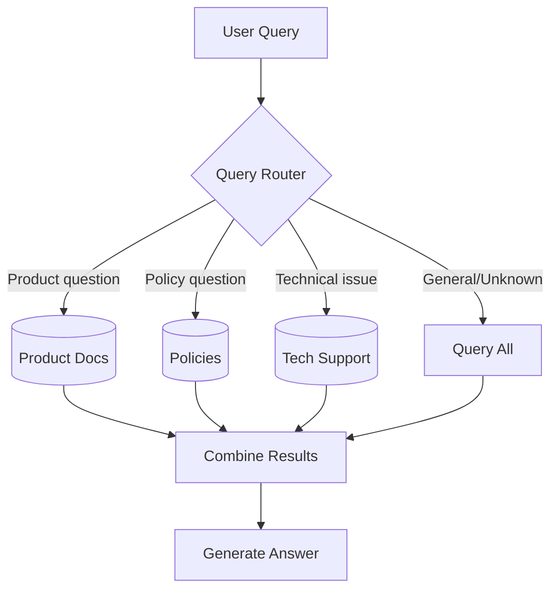

# Multi-Source RAG

## Introduction

Real-world applications rarely have just one knowledge base. A customer support system might need to search product docs, FAQs, and internal wikis. A research assistant might query papers, patents, and company reports. Multi-Source RAG handles these scenarios by intelligently routing queries to the appropriate knowledge sources.

This lesson covers techniques for building RAG systems that work across multiple, diverse knowledge bases—each potentially with different schemas, formats, and optimal retrieval strategies.

### What We'll Cover

- Query routing strategies
- Multiple retriever architectures
- Metadata-based source selection
- Fusion and re-ranking across sources
- Building a multi-source RAG system

### Prerequisites

- Understanding of basic RAG
- Familiarity with vector stores
- Experience with LangChain retrievers

---

## Multi-Source Architecture

### The Routing Challenge

When queries can target multiple sources, the system must decide:
- Which source(s) contain relevant information?
- Should we query one source or multiple?
- How do we combine results from different sources?



### Routing Strategies

| Strategy | Description | Best For |
|----------|-------------|----------|
| **LLM Router** | LLM decides which source to query | Complex decisions, mixed queries |
| **Semantic Router** | Embed query, match to source embeddings | Fast, scalable routing |
| **Keyword Router** | Pattern matching on query | Simple, predictable domains |
| **Multi-Query** | Query all sources, merge results | Thorough retrieval, uncertain routing |

---

## LLM-Based Query Router

The most flexible approach uses an LLM to analyze the query and select sources:

```python
from langchain_openai import ChatOpenAI
from pydantic import BaseModel, Field
from enum import Enum

class DataSource(str, Enum):
    PRODUCTS = "products"
    POLICIES = "policies"
    TECHNICAL = "technical"
    ALL = "all"

class RouteDecision(BaseModel):
    """Decision about which data source to query."""
    source: DataSource = Field(description="The data source to query")
    reasoning: str = Field(description="Brief explanation of the choice")
    sub_query: str = Field(description="Optimized query for the selected source")

llm = ChatOpenAI(model="gpt-4o-mini", temperature=0)
router = llm.with_structured_output(RouteDecision)

def route_query(query: str) -> RouteDecision:
    """Route a query to the appropriate data source."""
    prompt = f"""Analyze this query and decide which data source to search.

Available sources:
- products: Product specifications, features, pricing, comparisons
- policies: Return policies, warranties, shipping, terms of service
- technical: Troubleshooting guides, setup instructions, error messages
- all: Query all sources (use when unclear or query spans multiple areas)

Query: {query}

Choose the most appropriate source and optimize the query for that source."""

    return router.invoke(prompt)

# Examples
result = route_query("How do I return a defective product?")
print(f"Source: {result.source}, Query: {result.sub_query}")
# Source: policies, Query: return policy defective items

result = route_query("My device won't turn on after the update")
print(f"Source: {result.source}")
# Source: technical
```

---

## Semantic Router

For lower latency, use embeddings to match queries to source descriptions:

```python
from langchain_openai import OpenAIEmbeddings
import numpy as np

class SemanticRouter:
    """Route queries using semantic similarity."""
    
    def __init__(self, sources: dict[str, str]):
        """
        Args:
            sources: Dict mapping source name to description
        """
        self.embeddings = OpenAIEmbeddings(model="text-embedding-3-small")
        self.sources = sources
        self.source_embeddings = self._embed_sources()
    
    def _embed_sources(self) -> dict[str, list[float]]:
        """Embed source descriptions."""
        embeddings = {}
        for name, description in self.sources.items():
            embeddings[name] = self.embeddings.embed_query(description)
        return embeddings
    
    def route(self, query: str, threshold: float = 0.7) -> list[str]:
        """Route query to matching sources."""
        query_embedding = self.embeddings.embed_query(query)
        
        scores = {}
        for name, source_embedding in self.source_embeddings.items():
            score = self._cosine_similarity(query_embedding, source_embedding)
            scores[name] = score
        
        # Return sources above threshold, or best match if none
        matches = [name for name, score in scores.items() if score >= threshold]
        
        if not matches:
            best = max(scores.items(), key=lambda x: x[1])
            return [best[0]]
        
        return matches
    
    def _cosine_similarity(self, a: list[float], b: list[float]) -> float:
        """Calculate cosine similarity between vectors."""
        a, b = np.array(a), np.array(b)
        return np.dot(a, b) / (np.linalg.norm(a) * np.linalg.norm(b))

# Setup
sources = {
    "products": "Product specifications, features, pricing, availability, comparisons between products",
    "policies": "Return policy, refund process, warranty information, shipping details, terms of service",
    "technical": "Troubleshooting, setup guides, error messages, software updates, device configuration"
}

semantic_router = SemanticRouter(sources)

# Route queries
print(semantic_router.route("What's the battery life of the Pro model?"))
# ['products']

print(semantic_router.route("Can I get a refund after 30 days?"))
# ['policies']
```

---

## Building Multi-Source Retrievers

### Individual Source Retrievers

```python
from langchain_core.vectorstores import InMemoryVectorStore
from langchain_openai import OpenAIEmbeddings

embeddings = OpenAIEmbeddings(model="text-embedding-3-small")

# Create separate vector stores for each source
class MultiSourceRetriever:
    """Manages multiple retrieval sources."""
    
    def __init__(self):
        self.stores = {}
        self.retrievers = {}
    
    def add_source(self, name: str, documents: list[str], 
                   metadata: list[dict] = None):
        """Add a new data source."""
        store = InMemoryVectorStore(embeddings)
        
        # Add source metadata to each document
        if metadata is None:
            metadata = [{}] * len(documents)
        
        for i, m in enumerate(metadata):
            m["source"] = name
        
        store.add_texts(documents, metadatas=metadata)
        
        self.stores[name] = store
        self.retrievers[name] = store.as_retriever(search_kwargs={"k": 3})
    
    def retrieve_from_source(self, query: str, source: str) -> list:
        """Retrieve from a specific source."""
        if source not in self.retrievers:
            return []
        return self.retrievers[source].invoke(query)
    
    def retrieve_from_all(self, query: str) -> list:
        """Retrieve from all sources."""
        all_docs = []
        for name, retriever in self.retrievers.items():
            docs = retriever.invoke(query)
            all_docs.extend(docs)
        return all_docs

# Setup sources
multi_retriever = MultiSourceRetriever()

multi_retriever.add_source("products", [
    "The ProMax 500 has a 5000mAh battery lasting up to 2 days.",
    "The UltraSlim X weighs only 150g with a 4.7-inch display.",
    "The BudgetPhone SE offers 64GB storage at $299.",
])

multi_retriever.add_source("policies", [
    "Returns accepted within 30 days with original receipt.",
    "Extended warranty available for $49/year.",
    "Free shipping on orders over $50.",
])

multi_retriever.add_source("technical", [
    "To factory reset: Settings > System > Reset > Factory Reset.",
    "If device won't charge, try a different cable and power adapter.",
    "Software updates install automatically when connected to WiFi.",
])
```

### Routed Retrieval

```python
class RoutedMultiSourceRAG:
    """RAG system with intelligent source routing."""
    
    def __init__(self):
        self.multi_retriever = MultiSourceRetriever()
        self.llm = ChatOpenAI(model="gpt-4o-mini", temperature=0)
        self.sources_description = {}
    
    def add_source(self, name: str, description: str, documents: list[str]):
        """Add a data source with description."""
        self.multi_retriever.add_source(name, documents)
        self.sources_description[name] = description
    
    def query(self, question: str) -> dict:
        """Route and answer a query."""
        # 1. Route the query
        route = self._route(question)
        
        # 2. Retrieve from selected source(s)
        if route.source == DataSource.ALL:
            docs = self.multi_retriever.retrieve_from_all(route.sub_query)
        else:
            docs = self.multi_retriever.retrieve_from_source(
                route.sub_query, route.source.value
            )
        
        # 3. Generate answer
        context = "\n\n".join([d.page_content for d in docs])
        sources_used = list(set([d.metadata.get("source", "unknown") for d in docs]))
        
        answer = self._generate(question, context)
        
        return {
            "answer": answer,
            "sources_used": sources_used,
            "route_reasoning": route.reasoning,
            "documents_retrieved": len(docs)
        }
    
    def _route(self, query: str) -> RouteDecision:
        """Route query to appropriate source."""
        sources_text = "\n".join([
            f"- {name}: {desc}" 
            for name, desc in self.sources_description.items()
        ])
        
        prompt = f"""Route this query to the appropriate data source.

Available sources:
{sources_text}
- all: Query all sources

Query: {query}"""
        
        return router.invoke(prompt)
    
    def _generate(self, question: str, context: str) -> str:
        """Generate answer from context."""
        if not context:
            return "I couldn't find relevant information to answer your question."
        
        prompt = f"""Answer based on this context:

{context}

Question: {question}"""
        
        return self.llm.invoke(prompt).content

# Usage
rag = RoutedMultiSourceRAG()

rag.add_source(
    "products", 
    "Product specifications, features, and pricing",
    ["The ProMax 500 has a 5000mAh battery...", "..."]
)

rag.add_source(
    "policies",
    "Return policies, warranties, and shipping",
    ["Returns accepted within 30 days...", "..."]
)

result = rag.query("What's the battery capacity of the ProMax?")
print(f"Answer: {result['answer']}")
print(f"Sources: {result['sources_used']}")
```

---

## Fusion Retrieval

When querying multiple sources, merge and re-rank results:

```python
from langchain.retrievers import EnsembleRetriever
from langchain_cohere import CohereRerank
from langchain.retrievers import ContextualCompressionRetriever

class FusionMultiSourceRAG:
    """Multi-source RAG with result fusion."""
    
    def __init__(self):
        self.retrievers = {}
        self.llm = ChatOpenAI(model="gpt-4o-mini", temperature=0)
    
    def add_source(self, name: str, documents: list[str], weight: float = 1.0):
        """Add source with retrieval weight."""
        store = InMemoryVectorStore(embeddings)
        store.add_texts(documents)
        self.retrievers[name] = {
            "retriever": store.as_retriever(search_kwargs={"k": 5}),
            "weight": weight
        }
    
    def get_ensemble_retriever(self) -> EnsembleRetriever:
        """Create ensemble retriever from all sources."""
        retrievers = [r["retriever"] for r in self.retrievers.values()]
        weights = [r["weight"] for r in self.retrievers.values()]
        
        # Normalize weights
        total = sum(weights)
        weights = [w / total for w in weights]
        
        return EnsembleRetriever(
            retrievers=retrievers,
            weights=weights
        )
    
    def get_reranking_retriever(self) -> ContextualCompressionRetriever:
        """Create retriever with reranking."""
        base = self.get_ensemble_retriever()
        reranker = CohereRerank(model="rerank-v3.5", top_n=5)
        
        return ContextualCompressionRetriever(
            base_compressor=reranker,
            base_retriever=base
        )
    
    def query(self, question: str, use_reranking: bool = True) -> str:
        """Query with fusion retrieval."""
        if use_reranking:
            retriever = self.get_reranking_retriever()
        else:
            retriever = self.get_ensemble_retriever()
        
        docs = retriever.invoke(question)
        context = "\n\n".join([d.page_content for d in docs])
        
        prompt = f"""Answer based on this context:

{context}

Question: {question}"""
        
        return self.llm.invoke(prompt).content
```

---

## Reciprocal Rank Fusion

A popular technique for merging ranked lists from multiple sources:

```python
def reciprocal_rank_fusion(
    result_lists: list[list[str]], 
    k: int = 60
) -> list[str]:
    """Merge multiple ranked lists using RRF.
    
    Args:
        result_lists: List of ranked result lists
        k: Constant to prevent high ranks from dominating (default 60)
    
    Returns:
        Merged and reranked list
    """
    scores = {}
    
    for results in result_lists:
        for rank, doc in enumerate(results):
            if doc not in scores:
                scores[doc] = 0
            # RRF formula: 1 / (k + rank)
            scores[doc] += 1 / (k + rank + 1)  # +1 for 0-indexed
    
    # Sort by score descending
    sorted_docs = sorted(scores.items(), key=lambda x: x[1], reverse=True)
    return [doc for doc, score in sorted_docs]

# Example
from_products = ["doc_a", "doc_b", "doc_c"]
from_policies = ["doc_d", "doc_b", "doc_e"]
from_technical = ["doc_c", "doc_f", "doc_a"]

merged = reciprocal_rank_fusion([from_products, from_policies, from_technical])
print(merged)
# doc_b and doc_a likely rank high (appear in multiple lists)
```

---

## LangGraph Multi-Source RAG

For complex routing logic, use LangGraph:

```python
from typing import Annotated, TypedDict, Literal
from langgraph.graph import StateGraph, START, END

class MultiSourceState(TypedDict):
    """State for multi-source RAG."""
    question: str
    route: str
    documents: list[str]
    sources_queried: list[str]
    answer: str

def route_node(state: MultiSourceState) -> MultiSourceState:
    """Determine which source(s) to query."""
    route = route_query(state["question"])
    return {"route": route.source.value}

def should_query_source(state: MultiSourceState) -> Literal["products", "policies", "technical", "all"]:
    """Routing function for conditional edges."""
    return state["route"]

def query_products(state: MultiSourceState) -> MultiSourceState:
    """Query products source."""
    docs = multi_retriever.retrieve_from_source(state["question"], "products")
    return {
        "documents": [d.page_content for d in docs],
        "sources_queried": ["products"]
    }

def query_policies(state: MultiSourceState) -> MultiSourceState:
    """Query policies source."""
    docs = multi_retriever.retrieve_from_source(state["question"], "policies")
    return {
        "documents": [d.page_content for d in docs],
        "sources_queried": ["policies"]
    }

def query_technical(state: MultiSourceState) -> MultiSourceState:
    """Query technical source."""
    docs = multi_retriever.retrieve_from_source(state["question"], "technical")
    return {
        "documents": [d.page_content for d in docs],
        "sources_queried": ["technical"]
    }

def query_all(state: MultiSourceState) -> MultiSourceState:
    """Query all sources."""
    docs = multi_retriever.retrieve_from_all(state["question"])
    return {
        "documents": [d.page_content for d in docs],
        "sources_queried": ["products", "policies", "technical"]
    }

def generate(state: MultiSourceState) -> MultiSourceState:
    """Generate answer from documents."""
    context = "\n\n".join(state["documents"])
    
    prompt = f"""Answer based on this context:

{context}

Question: {state["question"]}"""
    
    answer = llm.invoke(prompt).content
    return {"answer": answer}

# Build graph
graph = StateGraph(MultiSourceState)

graph.add_node("route", route_node)
graph.add_node("query_products", query_products)
graph.add_node("query_policies", query_policies)
graph.add_node("query_technical", query_technical)
graph.add_node("query_all", query_all)
graph.add_node("generate", generate)

graph.add_edge(START, "route")

graph.add_conditional_edges(
    "route",
    should_query_source,
    {
        "products": "query_products",
        "policies": "query_policies",
        "technical": "query_technical",
        "all": "query_all"
    }
)

for node in ["query_products", "query_policies", "query_technical", "query_all"]:
    graph.add_edge(node, "generate")

graph.add_edge("generate", END)

multi_source_rag = graph.compile()
```

---

## Best Practices

### Source Organization

| Factor | Recommendation |
|--------|---------------|
| **Overlap** | Minimize document overlap between sources |
| **Naming** | Use clear, descriptive source names |
| **Descriptions** | Write detailed descriptions for routing |
| **Metadata** | Include source in document metadata |

### Routing Optimization

```python
# Track routing accuracy
class RouterWithMetrics:
    """Router with accuracy tracking."""
    
    def __init__(self):
        self.decisions = []
    
    def route_and_track(self, query: str, correct_source: str = None):
        """Route and optionally track accuracy."""
        decision = route_query(query)
        
        if correct_source:
            self.decisions.append({
                "query": query,
                "predicted": decision.source.value,
                "correct": correct_source,
                "accurate": decision.source.value == correct_source
            })
        
        return decision
    
    def get_accuracy(self) -> float:
        """Calculate routing accuracy."""
        if not self.decisions:
            return 0.0
        accurate = sum(1 for d in self.decisions if d["accurate"])
        return accurate / len(self.decisions)
```

---

## Hands-On Exercise

Build a multi-source RAG system for a company with:

1. **Product documentation** — Specs, features, comparisons
2. **HR policies** — Leave, benefits, guidelines
3. **IT knowledge base** — Troubleshooting, setup guides

Requirements:
- Intelligent routing based on query type
- Fallback to multi-source when uncertain
- Source attribution in answers

<details>
<summary>💡 Hints</summary>

- Use LLM router with detailed source descriptions
- Add source metadata to all documents
- Consider semantic router for latency-sensitive cases
- Test with ambiguous queries that could go either way

</details>

<details>
<summary>✅ Solution Outline</summary>

```python
# 1. Create three vector stores with sample documents
# 2. Implement LLM router with source descriptions
# 3. Build RoutedMultiSourceRAG with routing logic
# 4. Add source tracking to response
# 5. Test with queries for each source + ambiguous queries
# See implementation above for details
```

</details>

---

## Summary

✅ Multi-Source RAG routes queries to appropriate knowledge bases  
✅ LLM routing provides flexible, context-aware decisions  
✅ Semantic routing offers fast, embedding-based source selection  
✅ Fusion techniques merge results from multiple sources  
✅ Reciprocal Rank Fusion effectively combines ranked lists  

**Next:** [Conversational RAG](./08-conversational-rag.md) — Memory and context accumulation

---

## Further Reading

- [LangChain Multi-Query Retriever](https://python.langchain.com/docs/how_to/MultiQueryRetriever/) — Query expansion techniques
- [Ensemble Retrievers](https://python.langchain.com/docs/how_to/ensemble_retriever/) — Combining multiple retrievers
- [Cohere Rerank](https://docs.cohere.com/docs/rerank) — Neural reranking for better results

<!-- 
Sources Consulted:
- LangChain RAG Tutorial: https://python.langchain.com/docs/tutorials/rag/
- LangChain Retrievers: https://python.langchain.com/docs/concepts/retrievers/
- Cohere Rerank: https://docs.cohere.com/docs/rerank
-->
