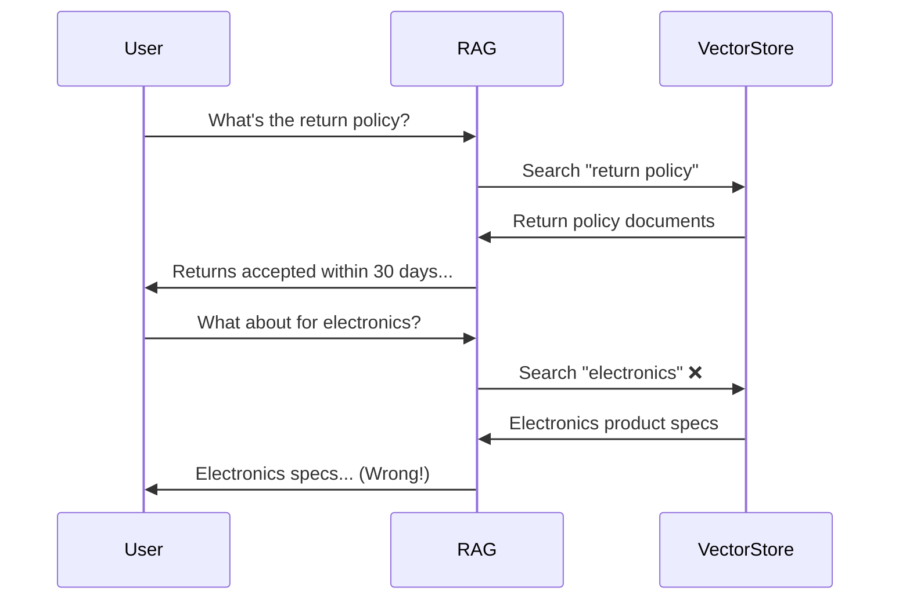
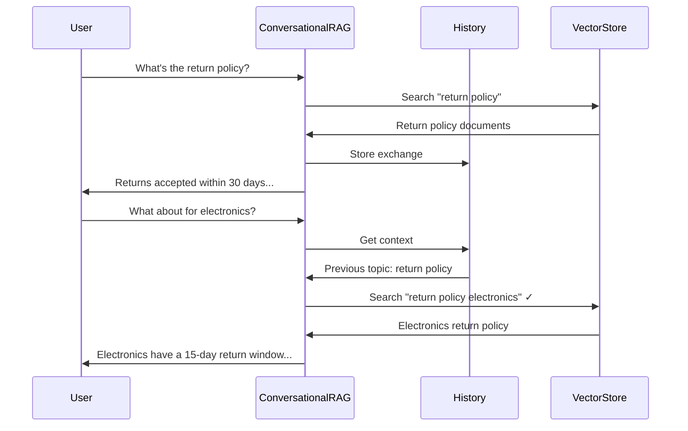

# Conversational RAG

## Introduction

Standard RAG treats each query independently—perfect for one-off questions, but awkward for conversations. When a user asks "What's the return policy?" and then follows up with "What about for electronics?", the system needs to understand that "electronics" refers to the return policy context.

Conversational RAG adds memory and context tracking to maintain coherent multi-turn dialogues. This transforms RAG from a question-answering system into an intelligent assistant that remembers what you've discussed.

### What We'll Cover

- Conversation history management
- Context-aware query reformulation
- Memory strategies for long conversations
- Building conversational RAG with LangChain and LangGraph
- Production patterns for chat applications

### Prerequisites

- Understanding of basic RAG
- Familiarity with LangChain
- Experience with chat applications

---

## The Conversation Challenge

### Why Standard RAG Fails



### Conversational RAG Solution



---

## History-Aware Retrieval

The key is reformulating follow-up queries using conversation context:

```python
from langchain_openai import ChatOpenAI, OpenAIEmbeddings
from langchain_core.prompts import ChatPromptTemplate, MessagesPlaceholder
from langchain_core.messages import HumanMessage, AIMessage
from langchain_core.vectorstores import InMemoryVectorStore
from langchain.chains import create_history_aware_retriever

llm = ChatOpenAI(model="gpt-4o-mini", temperature=0)
embeddings = OpenAIEmbeddings(model="text-embedding-3-small")

# Setup vector store
vector_store = InMemoryVectorStore(embeddings)
documents = [
    "General return policy: Items can be returned within 30 days of purchase.",
    "Electronics return policy: Electronics must be returned within 15 days.",
    "Clothing return policy: Clothing can be returned within 60 days if unworn.",
    "Refund processing takes 5-7 business days after we receive the item.",
    "Free return shipping is available for all orders over $50.",
]
vector_store.add_texts(documents)
retriever = vector_store.as_retriever(search_kwargs={"k": 3})

# Create history-aware retriever
contextualize_q_system_prompt = """Given a chat history and the latest user question 
which might reference context in the chat history, formulate a standalone question 
which can be understood without the chat history. Do NOT answer the question, 
just reformulate it if needed and otherwise return it as is."""

contextualize_q_prompt = ChatPromptTemplate.from_messages([
    ("system", contextualize_q_system_prompt),
    MessagesPlaceholder("chat_history"),
    ("human", "{input}"),
])

history_aware_retriever = create_history_aware_retriever(
    llm, retriever, contextualize_q_prompt
)

# Test with history
chat_history = [
    HumanMessage(content="What's the return policy?"),
    AIMessage(content="Items can be returned within 30 days of purchase.")
]

# This reformulates "What about for electronics?" → 
# "What is the return policy for electronics?"
docs = history_aware_retriever.invoke({
    "input": "What about for electronics?",
    "chat_history": chat_history
})

for doc in docs:
    print(doc.page_content)
# "Electronics return policy: Electronics must be returned within 15 days."
```

---

## Complete Conversational RAG Chain

LangChain provides a built-in chain for conversational RAG:

```python
from langchain.chains import create_retrieval_chain
from langchain.chains.combine_documents import create_stuff_documents_chain

# System prompt for the QA chain
system_prompt = """You are a helpful customer service assistant. 
Answer the user's question based on the provided context.
If you don't know the answer, say so politely.

Context:
{context}"""

qa_prompt = ChatPromptTemplate.from_messages([
    ("system", system_prompt),
    MessagesPlaceholder("chat_history"),
    ("human", "{input}"),
])

# Create the QA chain
question_answer_chain = create_stuff_documents_chain(llm, qa_prompt)

# Combine with history-aware retriever
conversational_rag_chain = create_retrieval_chain(
    history_aware_retriever, 
    question_answer_chain
)

# Use the chain
chat_history = []

def chat(user_input: str) -> str:
    """Send a message and get a response."""
    result = conversational_rag_chain.invoke({
        "input": user_input,
        "chat_history": chat_history
    })
    
    # Update history
    chat_history.append(HumanMessage(content=user_input))
    chat_history.append(AIMessage(content=result["answer"]))
    
    return result["answer"]

# Conversation
print(chat("What's the return policy?"))
# "Items can be returned within 30 days of purchase."

print(chat("What about for electronics?"))
# "Electronics must be returned within 15 days."

print(chat("And how long do refunds take?"))
# "Refund processing takes 5-7 business days after we receive the item."
```

---

## LangGraph Conversational RAG

For more control, build conversational RAG with LangGraph:

```python
from typing import Annotated, TypedDict
from langgraph.graph import StateGraph, START, END
from langgraph.graph.message import add_messages
from langgraph.checkpoint.memory import MemorySaver
from langchain_core.messages import BaseMessage, SystemMessage

class ConversationalRAGState(TypedDict):
    """State for conversational RAG."""
    messages: Annotated[list[BaseMessage], add_messages]
    context: str

def reformulate_query(state: ConversationalRAGState) -> ConversationalRAGState:
    """Reformulate the latest query using conversation context."""
    messages = state["messages"]
    
    # Get the latest user message
    latest_query = messages[-1].content
    
    # If there's history, reformulate
    if len(messages) > 1:
        history = messages[:-1]
        
        reformulate_prompt = f"""Given this conversation history:
{format_messages(history)}

Reformulate this follow-up question as a standalone question:
"{latest_query}"

Standalone question:"""
        
        reformulated = llm.invoke(reformulate_prompt).content
    else:
        reformulated = latest_query
    
    # Store reformulated query for retrieval
    return {"reformulated_query": reformulated}

def retrieve(state: ConversationalRAGState) -> ConversationalRAGState:
    """Retrieve documents for the (reformulated) query."""
    query = state.get("reformulated_query", state["messages"][-1].content)
    docs = retriever.invoke(query)
    context = "\n\n".join([doc.page_content for doc in docs])
    return {"context": context}

def generate(state: ConversationalRAGState) -> ConversationalRAGState:
    """Generate response using context and history."""
    system = SystemMessage(content=f"""You are a helpful assistant.
Answer based on this context:

{state['context']}

If the context doesn't contain the answer, say so.""")
    
    response = llm.invoke([system] + state["messages"])
    return {"messages": [response]}

def format_messages(messages: list[BaseMessage]) -> str:
    """Format message history as string."""
    formatted = []
    for msg in messages:
        role = "User" if isinstance(msg, HumanMessage) else "Assistant"
        formatted.append(f"{role}: {msg.content}")
    return "\n".join(formatted)

# Build the graph
graph = StateGraph(ConversationalRAGState)

graph.add_node("reformulate", reformulate_query)
graph.add_node("retrieve", retrieve)
graph.add_node("generate", generate)

graph.add_edge(START, "reformulate")
graph.add_edge("reformulate", "retrieve")
graph.add_edge("retrieve", "generate")
graph.add_edge("generate", END)

# Add memory for persistence across invocations
memory = MemorySaver()
conversational_rag = graph.compile(checkpointer=memory)

# Use with thread ID for conversation tracking
config = {"configurable": {"thread_id": "user-123"}}

# First message
result = conversational_rag.invoke(
    {"messages": [HumanMessage(content="What's the return policy?")]},
    config=config
)
print(result["messages"][-1].content)

# Follow-up (context maintained via checkpointer)
result = conversational_rag.invoke(
    {"messages": [HumanMessage(content="What about electronics?")]},
    config=config
)
print(result["messages"][-1].content)
```

---

## Memory Strategies

### Short-Term Memory (Window)

Keep only the last N messages:

```python
class WindowMemory:
    """Keep the last N messages."""
    
    def __init__(self, window_size: int = 10):
        self.window_size = window_size
        self.messages = []
    
    def add(self, message: BaseMessage):
        """Add a message, maintaining window size."""
        self.messages.append(message)
        if len(self.messages) > self.window_size:
            self.messages = self.messages[-self.window_size:]
    
    def get_history(self) -> list[BaseMessage]:
        """Get current message history."""
        return self.messages.copy()
    
    def clear(self):
        """Clear the memory."""
        self.messages = []
```

### Token-Based Memory

Limit memory by token count rather than message count:

```python
import tiktoken

class TokenMemory:
    """Keep messages up to a token limit."""
    
    def __init__(self, max_tokens: int = 4000, model: str = "gpt-4o-mini"):
        self.max_tokens = max_tokens
        self.encoding = tiktoken.encoding_for_model(model)
        self.messages = []
    
    def _count_tokens(self, messages: list[BaseMessage]) -> int:
        """Count tokens in messages."""
        text = " ".join([m.content for m in messages])
        return len(self.encoding.encode(text))
    
    def add(self, message: BaseMessage):
        """Add message, trimming old messages if needed."""
        self.messages.append(message)
        
        # Trim from the front until under limit
        while self._count_tokens(self.messages) > self.max_tokens and len(self.messages) > 1:
            self.messages.pop(0)
    
    def get_history(self) -> list[BaseMessage]:
        return self.messages.copy()
```

### Summarized Memory

Summarize old conversations to maintain context while saving tokens:

```python
class SummarizedMemory:
    """Summarize old messages to save tokens."""
    
    def __init__(self, summary_threshold: int = 10):
        self.summary_threshold = summary_threshold
        self.summary = ""
        self.recent_messages = []
    
    def add(self, message: BaseMessage):
        """Add message, summarizing if threshold reached."""
        self.recent_messages.append(message)
        
        if len(self.recent_messages) > self.summary_threshold:
            self._summarize()
    
    def _summarize(self):
        """Summarize old messages."""
        to_summarize = self.recent_messages[:-4]  # Keep last 4
        
        prompt = f"""Summarize this conversation concisely:

{format_messages(to_summarize)}

Summary:"""
        
        new_summary = llm.invoke(prompt).content
        
        if self.summary:
            self.summary = f"{self.summary}\n\n{new_summary}"
        else:
            self.summary = new_summary
        
        self.recent_messages = self.recent_messages[-4:]
    
    def get_context(self) -> str:
        """Get summary + recent messages."""
        parts = []
        if self.summary:
            parts.append(f"Previous conversation summary:\n{self.summary}")
        if self.recent_messages:
            parts.append(f"Recent messages:\n{format_messages(self.recent_messages)}")
        return "\n\n".join(parts)
```

---

## Handling Conversation Patterns

### Topic Switching

Detect when users change topics:

```python
from pydantic import BaseModel, Field

class TopicAnalysis(BaseModel):
    """Analysis of topic continuity."""
    is_topic_switch: bool = Field(description="Whether user changed topics")
    new_topic: str = Field(description="The new topic if switched, else current topic")
    requires_new_retrieval: bool = Field(description="Whether new retrieval is needed")

topic_analyzer = llm.with_structured_output(TopicAnalysis)

def analyze_topic(current_topic: str, new_message: str, history: list[BaseMessage]) -> TopicAnalysis:
    """Analyze if the topic has changed."""
    prompt = f"""Analyze if this message continues the current topic or switches.

Current topic: {current_topic}

Recent history:
{format_messages(history[-4:])}

New message: {new_message}

Determine if this is a topic switch and if new retrieval is needed."""
    
    return topic_analyzer.invoke(prompt)
```

### Clarification Handling

When queries are ambiguous:

```python
class ClarificationCheck(BaseModel):
    """Check if clarification is needed."""
    needs_clarification: bool
    clarifying_question: str = ""
    ambiguous_terms: list[str] = []

def check_for_ambiguity(query: str, context: str) -> ClarificationCheck:
    """Check if the query is ambiguous given the context."""
    prompt = f"""Given this context and query, determine if clarification is needed.

Context:
{context}

Query: {query}

Is the query clear, or does it need clarification?"""
    
    checker = llm.with_structured_output(ClarificationCheck)
    return checker.invoke(prompt)
```

---

## Production Patterns

### Conversation Management

```python
from datetime import datetime
import json

class ConversationManager:
    """Manage multiple conversations with persistence."""
    
    def __init__(self, storage_path: str = "./conversations"):
        self.storage_path = storage_path
        self.active_conversations = {}
    
    def get_or_create_conversation(self, conversation_id: str) -> dict:
        """Get existing or create new conversation."""
        if conversation_id in self.active_conversations:
            return self.active_conversations[conversation_id]
        
        conversation = {
            "id": conversation_id,
            "messages": [],
            "created_at": datetime.now().isoformat(),
            "metadata": {}
        }
        self.active_conversations[conversation_id] = conversation
        return conversation
    
    def add_message(self, conversation_id: str, role: str, content: str):
        """Add a message to a conversation."""
        conversation = self.get_or_create_conversation(conversation_id)
        conversation["messages"].append({
            "role": role,
            "content": content,
            "timestamp": datetime.now().isoformat()
        })
        conversation["last_updated"] = datetime.now().isoformat()
    
    def get_history_as_messages(self, conversation_id: str) -> list[BaseMessage]:
        """Get conversation history as LangChain messages."""
        conversation = self.get_or_create_conversation(conversation_id)
        messages = []
        for msg in conversation["messages"]:
            if msg["role"] == "user":
                messages.append(HumanMessage(content=msg["content"]))
            else:
                messages.append(AIMessage(content=msg["content"]))
        return messages
    
    def save_conversation(self, conversation_id: str):
        """Persist conversation to storage."""
        conversation = self.active_conversations.get(conversation_id)
        if conversation:
            path = f"{self.storage_path}/{conversation_id}.json"
            with open(path, "w") as f:
                json.dump(conversation, f, indent=2)
```

### Streaming Responses

```python
async def stream_conversational_response(
    user_input: str, 
    chat_history: list[BaseMessage]
) -> str:
    """Stream a conversational RAG response."""
    
    # First, get context (non-streaming)
    docs = await history_aware_retriever.ainvoke({
        "input": user_input,
        "chat_history": chat_history
    })
    context = "\n\n".join([doc.page_content for doc in docs])
    
    # Then stream the response
    messages = chat_history + [HumanMessage(content=user_input)]
    system = SystemMessage(content=f"Context:\n{context}")
    
    full_response = ""
    async for chunk in llm.astream([system] + messages):
        content = chunk.content
        print(content, end="", flush=True)
        full_response += content
    
    print()  # Newline
    return full_response
```

---

## Memory with LangGraph

LangGraph's built-in checkpointing handles conversation persistence:

```python
from langgraph.checkpoint.sqlite import SqliteSaver
from langgraph.checkpoint.postgres import PostgresSaver

# SQLite for development
sqlite_memory = SqliteSaver.from_conn_string("./conversations.db")

# PostgreSQL for production
# postgres_memory = PostgresSaver.from_conn_string(os.environ["DATABASE_URL"])

# Compile graph with persistent memory
conversational_rag = graph.compile(checkpointer=sqlite_memory)

# Each conversation has its own thread
def chat_with_user(user_id: str, message: str) -> str:
    """Chat with conversation tracking per user."""
    config = {"configurable": {"thread_id": f"user-{user_id}"}}
    
    result = conversational_rag.invoke(
        {"messages": [HumanMessage(content=message)]},
        config=config
    )
    
    return result["messages"][-1].content

# Different users, different conversations
chat_with_user("alice", "What's the return policy?")
chat_with_user("bob", "How do I reset my device?")
chat_with_user("alice", "What about electronics?")  # Continues Alice's conversation
```

---

## Hands-On Exercise

Build a conversational RAG chatbot with:

1. **History-aware retrieval** — Reformulate queries using context
2. **Memory management** — Token-limited conversation memory
3. **Multi-user support** — Track separate conversations per user
4. **Graceful topic switching** — Handle topic changes naturally

<details>
<summary>💡 Hints</summary>

- Use `create_history_aware_retriever` for query reformulation
- Implement token-based memory with tiktoken
- Use thread IDs for user separation
- Consider storing important facts from each conversation

</details>

<details>
<summary>✅ Solution Outline</summary>

```python
# 1. Create history-aware retriever with contextualize prompt
# 2. Implement TokenMemory class for memory management
# 3. Use LangGraph with checkpointer for persistence
# 4. Add topic analysis for smooth transitions
# See implementation above for details
```

</details>

---

## Summary

✅ Conversational RAG adds memory to maintain multi-turn dialogue context  
✅ History-aware retrieval reformulates follow-up queries automatically  
✅ Memory strategies balance context retention with token limits  
✅ LangGraph checkpointing enables persistent conversation storage  
✅ Production systems need conversation management and streaming  

**Next:** [Deep Research APIs](./09-deep-research-apis.md) — OpenAI and Gemini autonomous research agents

---

## Further Reading

- [LangChain Conversational RAG Tutorial](https://python.langchain.com/docs/tutorials/qa_chat_history/) — Official documentation
- [LangGraph Memory](https://langchain-ai.github.io/langgraph/concepts/persistence/) — Persistence and checkpointing
- [Chat History Management](https://python.langchain.com/docs/how_to/message_history/) — Managing message history

<!-- 
Sources Consulted:
- LangChain Conversational RAG: https://python.langchain.com/docs/tutorials/qa_chat_history/
- LangGraph Persistence: https://langchain-ai.github.io/langgraph/concepts/persistence/
- LangChain Message History: https://python.langchain.com/docs/how_to/message_history/
-->
