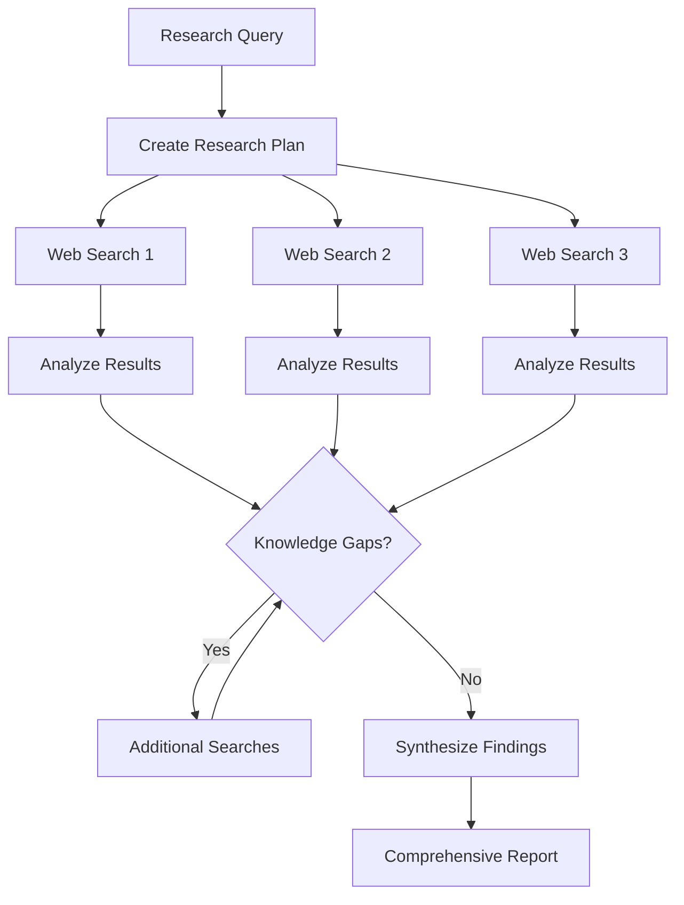

# Deep Research APIs

## Introduction

Traditional RAG retrieves from your documents. Advanced RAG patterns add self-correction and web fallback. But what about questions that require *hours* of research—competitive analysis, literature reviews, market research? This is where Deep Research APIs come in.

OpenAI's deep research capability and Google's Gemini Deep Research are autonomous research agents that browse the web, synthesize information from dozens of sources, and produce comprehensive reports. They represent the cutting edge of retrieval-augmented generation.

### What We'll Cover

- Understanding deep research capabilities
- OpenAI's Responses API with web search
- Gemini Deep Research API
- Building research workflows
- When to use deep research vs. standard RAG

### Prerequisites

- Understanding of RAG fundamentals
- API experience with OpenAI or Google AI
- Familiarity with async programming

---

## What is Deep Research?

### Beyond Single-Query RAG

Deep research agents perform what would take a human researcher hours:



### Comparison

| Aspect | Standard RAG | CRAG with Web | Deep Research |
|--------|-------------|---------------|---------------|
| **Sources** | Your documents | Documents + web fallback | Extensive web research |
| **Depth** | Single query | Single query + fallback | Multi-step research |
| **Time** | 1-5 seconds | 5-15 seconds | 1-10+ minutes |
| **Output** | Brief answer | Answer with sources | Comprehensive report |
| **Use case** | Quick facts | General Q&A | Research tasks |

---

## OpenAI Responses API

OpenAI's Responses API includes a `web_search` tool that enables agentic web research.

### Basic Web Search

```python
from openai import OpenAI

client = OpenAI()

response = client.responses.create(
    model="gpt-4o",
    tools=[{"type": "web_search"}],
    input="What are the latest developments in quantum computing in 2025?"
)

print(response.output_text)
# Comprehensive answer with information from web sources

# Access citations
for annotation in response.output[0].content[0].annotations:
    if annotation.type == "url_citation":
        print(f"Source: {annotation.url}")
```

### Deep Research Mode

For more comprehensive research, configure the search for depth:

```python
response = client.responses.create(
    model="gpt-4o",
    tools=[{
        "type": "web_search",
        "search_context_size": "high"  # More context from each search
    }],
    input="""Conduct a comprehensive analysis of the current state 
    of large language model fine-tuning techniques. Cover:
    1. Popular methods (LoRA, QLoRA, full fine-tuning)
    2. Recent papers and developments
    3. Cost and compute comparisons
    4. Best practices for different use cases""",
)

print(response.output_text)
```

### Streaming for Long Research

Deep research can take time. Use streaming for progress updates:

```python
import asyncio
from openai import AsyncOpenAI

async def deep_research_streaming(query: str):
    """Run deep research with streaming output."""
    client = AsyncOpenAI()
    
    async with client.responses.stream(
        model="gpt-4o",
        tools=[{"type": "web_search"}],
        input=query
    ) as stream:
        async for event in stream:
            if hasattr(event, 'type'):
                if event.type == 'response.output_text.delta':
                    print(event.delta, end='', flush=True)
                elif event.type == 'response.tool_call.web_search.searching':
                    print(f"\n🔍 Searching: {event.query}\n")
    
    print()  # Final newline

# Run research
asyncio.run(deep_research_streaming(
    "What are the top AI startups to watch in 2026?"
))
```

### Research with Specific Instructions

```python
response = client.responses.create(
    model="gpt-4o",
    tools=[{"type": "web_search"}],
    instructions="""You are a research analyst. When conducting research:
    1. Look for primary sources and official announcements
    2. Cross-reference claims across multiple sources
    3. Note publication dates and prioritize recent information
    4. Be skeptical of unverified claims
    5. Clearly cite all sources used""",
    input="""Research the competitive landscape of AI code assistants.
    Compare GitHub Copilot, Cursor, and other major players.
    Focus on: features, pricing, market share, and recent developments."""
)

print(response.output_text)
```

---

## Gemini Deep Research

Google's Gemini offers a dedicated deep research capability that creates multi-step research plans and synthesizes findings into comprehensive reports.

### Basic Deep Research

```python
from google import genai
from google.genai import types

client = genai.Client()

response = client.models.generate_content(
    model="gemini-2.0-flash",
    contents="Research the impact of AI on software development jobs in 2025",
    config=types.GenerateContentConfig(
        tools=[types.Tool(google_search=types.GoogleSearch())]
    )
)

print(response.text)
```

### Deep Research with Planning

For more comprehensive research, Gemini creates and executes a research plan:

```python
from google import genai
from google.genai import types
import asyncio

async def gemini_deep_research(query: str) -> str:
    """Run Gemini deep research."""
    client = genai.Client()
    
    # Start deep research task
    response = await client.aio.models.generate_content(
        model="gemini-2.0-flash-thinking-exp",  # Thinking model for research
        contents=query,
        config=types.GenerateContentConfig(
            tools=[types.Tool(google_search=types.GoogleSearch())],
            system_instruction="""You are a thorough research assistant.
            Create a research plan, search for information systematically,
            and synthesize findings into a comprehensive report with citations."""
        )
    )
    
    return response.text

# Run research
result = asyncio.run(gemini_deep_research(
    """Analyze the current state of retrieval-augmented generation (RAG).
    Cover: major approaches, recent innovations, leading frameworks,
    and predictions for 2026."""
))
print(result)
```

### Streaming Research Progress

```python
async def stream_gemini_research(query: str):
    """Stream Gemini research with progress updates."""
    client = genai.Client()
    
    async for chunk in client.aio.models.generate_content_stream(
        model="gemini-2.0-flash",
        contents=query,
        config=types.GenerateContentConfig(
            tools=[types.Tool(google_search=types.GoogleSearch())]
        )
    ):
        if chunk.text:
            print(chunk.text, end='', flush=True)
    
    print()

asyncio.run(stream_gemini_research("What are the top trends in AI for 2026?"))
```

---

## Building Research Workflows

### Research Pipeline with LangChain

Combine deep research APIs with your own processing:

```python
from langchain_openai import ChatOpenAI
from langchain_core.prompts import ChatPromptTemplate
from pydantic import BaseModel, Field
from openai import OpenAI

class ResearchPlan(BaseModel):
    """A structured research plan."""
    main_question: str
    sub_questions: list[str]
    key_areas: list[str]
    expected_sources: list[str]

class ResearchReport(BaseModel):
    """Structured research output."""
    executive_summary: str
    key_findings: list[str]
    detailed_analysis: str
    sources: list[str]
    limitations: str
    recommendations: list[str]

llm = ChatOpenAI(model="gpt-4o-mini", temperature=0)
openai_client = OpenAI()

async def research_workflow(query: str) -> ResearchReport:
    """Complete research workflow."""
    
    # Step 1: Create research plan
    planner = llm.with_structured_output(ResearchPlan)
    plan = planner.invoke(
        f"Create a research plan for: {query}"
    )
    print(f"📋 Research Plan: {len(plan.sub_questions)} sub-questions")
    
    # Step 2: Execute research for each sub-question
    findings = []
    for sq in plan.sub_questions:
        print(f"🔍 Researching: {sq[:50]}...")
        
        response = openai_client.responses.create(
            model="gpt-4o",
            tools=[{"type": "web_search"}],
            input=sq
        )
        findings.append({
            "question": sq,
            "answer": response.output_text,
            "sources": [
                a.url for a in response.output[0].content[0].annotations
                if hasattr(a, 'url')
            ]
        })
    
    # Step 3: Synthesize findings
    print("📝 Synthesizing findings...")
    
    synthesis_prompt = f"""Synthesize these research findings into a comprehensive report.

Original Query: {query}

Findings:
{format_findings(findings)}

Create a structured report with executive summary, key findings, 
detailed analysis, sources, limitations, and recommendations."""
    
    reporter = llm.with_structured_output(ResearchReport)
    report = reporter.invoke(synthesis_prompt)
    
    return report

def format_findings(findings: list[dict]) -> str:
    """Format findings for synthesis."""
    parts = []
    for f in findings:
        parts.append(f"Question: {f['question']}")
        parts.append(f"Answer: {f['answer']}")
        parts.append(f"Sources: {', '.join(f['sources'][:3])}")
        parts.append("")
    return "\n".join(parts)
```

### Multi-Agent Research

Use multiple specialized agents for comprehensive research:

```python
from typing import Literal

class ResearchAgent:
    """Specialized research agent."""
    
    def __init__(self, specialty: str, instructions: str):
        self.specialty = specialty
        self.instructions = instructions
        self.client = OpenAI()
    
    def research(self, query: str) -> str:
        """Conduct specialized research."""
        response = self.client.responses.create(
            model="gpt-4o",
            tools=[{"type": "web_search"}],
            instructions=self.instructions,
            input=query
        )
        return response.output_text

# Create specialized agents
agents = {
    "technical": ResearchAgent(
        "technical",
        "Focus on technical details, implementations, and specifications."
    ),
    "business": ResearchAgent(
        "business", 
        "Focus on business implications, market analysis, and competitive landscape."
    ),
    "academic": ResearchAgent(
        "academic",
        "Focus on academic papers, research findings, and theoretical foundations."
    )
}

async def multi_agent_research(query: str) -> dict:
    """Research using multiple specialized agents."""
    results = {}
    
    for name, agent in agents.items():
        print(f"🤖 {name.title()} agent researching...")
        results[name] = agent.research(query)
    
    # Combine perspectives
    combined = f"""Research findings from multiple perspectives:

TECHNICAL ANALYSIS:
{results['technical']}

BUSINESS ANALYSIS:
{results['business']}

ACADEMIC ANALYSIS:
{results['academic']}"""
    
    # Final synthesis
    synthesis = llm.invoke(
        f"Synthesize these multi-perspective findings into a unified report:\n\n{combined}"
    )
    
    return {
        "perspectives": results,
        "synthesis": synthesis.content
    }
```

---

## When to Use Deep Research

### Decision Matrix

| Scenario | Recommended Approach |
|----------|---------------------|
| Quick factual question | Standard RAG |
| Question needing current info | CRAG with web fallback |
| Competitive analysis | Deep Research |
| Literature review | Deep Research |
| Market research | Deep Research |
| Technical comparison | Deep Research |
| Simple product FAQ | Standard RAG |
| Breaking news | CRAG with web fallback |

### Cost Considerations

| Approach | Approximate Cost | Time |
|----------|-----------------|------|
| Standard RAG | $0.01-0.05 | 1-3 sec |
| CRAG | $0.05-0.15 | 5-15 sec |
| Deep Research | $0.50-5.00+ | 1-10+ min |

### Use Deep Research When

✅ Quality matters more than speed  
✅ Comprehensive coverage is required  
✅ Multiple sources need synthesis  
✅ User expects a detailed report  
✅ Topic is complex or evolving  

### Avoid Deep Research When

❌ Real-time response is needed  
❌ Simple factual questions  
❌ Information is in your knowledge base  
❌ Cost is a primary concern  
❌ High-volume queries  

---

## Production Patterns

### Async Research Queue

For production systems, queue research requests:

```python
import asyncio
from datetime import datetime

class ResearchQueue:
    """Queue for managing deep research requests."""
    
    def __init__(self, max_concurrent: int = 3):
        self.queue = asyncio.Queue()
        self.max_concurrent = max_concurrent
        self.active = 0
        self.results = {}
    
    async def submit(self, research_id: str, query: str):
        """Submit a research request."""
        await self.queue.put({
            "id": research_id,
            "query": query,
            "submitted": datetime.now().isoformat()
        })
        self.results[research_id] = {"status": "queued"}
    
    async def process(self):
        """Process queued research requests."""
        while True:
            if self.active >= self.max_concurrent:
                await asyncio.sleep(1)
                continue
            
            try:
                request = await asyncio.wait_for(
                    self.queue.get(), 
                    timeout=1.0
                )
                self.active += 1
                asyncio.create_task(self._do_research(request))
            except asyncio.TimeoutError:
                continue
    
    async def _do_research(self, request: dict):
        """Execute a research request."""
        research_id = request["id"]
        self.results[research_id] = {"status": "in_progress"}
        
        try:
            result = await run_deep_research(request["query"])
            self.results[research_id] = {
                "status": "complete",
                "result": result,
                "completed": datetime.now().isoformat()
            }
        except Exception as e:
            self.results[research_id] = {
                "status": "error",
                "error": str(e)
            }
        finally:
            self.active -= 1
    
    def get_status(self, research_id: str) -> dict:
        """Get status of a research request."""
        return self.results.get(research_id, {"status": "not_found"})
```

### Caching Research Results

```python
from datetime import datetime, timedelta
import hashlib
import json

class ResearchCache:
    """Cache for research results."""
    
    def __init__(self, ttl_hours: int = 24):
        self.cache = {}
        self.ttl = timedelta(hours=ttl_hours)
    
    def _hash_query(self, query: str) -> str:
        """Create hash of query for cache key."""
        return hashlib.md5(query.lower().strip().encode()).hexdigest()
    
    def get(self, query: str) -> dict | None:
        """Get cached result if fresh."""
        key = self._hash_query(query)
        
        if key not in self.cache:
            return None
        
        entry = self.cache[key]
        if datetime.now() - entry["timestamp"] > self.ttl:
            del self.cache[key]
            return None
        
        return entry["result"]
    
    def set(self, query: str, result: dict):
        """Cache a research result."""
        key = self._hash_query(query)
        self.cache[key] = {
            "result": result,
            "timestamp": datetime.now()
        }
    
    async def get_or_research(self, query: str) -> dict:
        """Get from cache or conduct new research."""
        cached = self.get(query)
        if cached:
            print("📦 Using cached research")
            return cached
        
        print("🔬 Conducting new research")
        result = await run_deep_research(query)
        self.set(query, result)
        return result
```

---

## Hands-On Exercise

Build a deep research system with:

1. **Research planning** — Break complex queries into sub-questions
2. **Multi-source research** — Use both OpenAI and web search
3. **Synthesis** — Combine findings into a structured report
4. **Caching** — Cache results to avoid repeated research

<details>
<summary>💡 Hints</summary>

- Use structured output for research plans
- Parallelize sub-question research where possible
- Include source tracking throughout
- Consider freshness requirements for caching

</details>

<details>
<summary>✅ Solution Outline</summary>

```python
# 1. Create ResearchPlan model for query decomposition
# 2. Implement research_sub_question using OpenAI Responses API
# 3. Parallel research all sub-questions with asyncio.gather
# 4. Synthesize with structured output for ResearchReport
# 5. Add caching layer with appropriate TTL
# See implementation above for details
```

</details>

---

## Summary

✅ Deep Research APIs conduct autonomous, multi-step web research  
✅ OpenAI's Responses API with web_search enables real-time research  
✅ Gemini Deep Research creates and executes research plans  
✅ Research workflows can combine multiple agents and perspectives  
✅ Production systems need queuing, caching, and progress tracking  

**Congratulations!** You've completed the Advanced RAG Patterns module. You now understand how to build sophisticated RAG systems from simple chains to autonomous research agents.

---

## Further Reading

- [OpenAI Responses API](https://platform.openai.com/docs/api-reference/responses) — Official documentation
- [Gemini Deep Research](https://ai.google.dev/gemini-api/docs/deep-research) — Google's research API
- [Tavily AI Search](https://tavily.com/) — Alternative research API
- [Perplexity API](https://www.perplexity.ai/) — Another deep research option

<!-- 
Sources Consulted:
- OpenAI Responses API: https://platform.openai.com/docs/api-reference/responses
- Gemini Deep Research: https://ai.google.dev/gemini-api/docs/deep-research
- OpenAI Web Search: https://platform.openai.com/docs/guides/tools-web-search
-->
