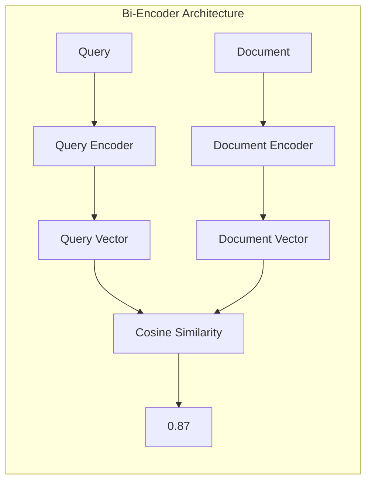
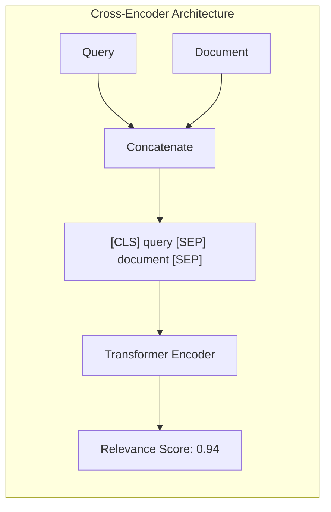
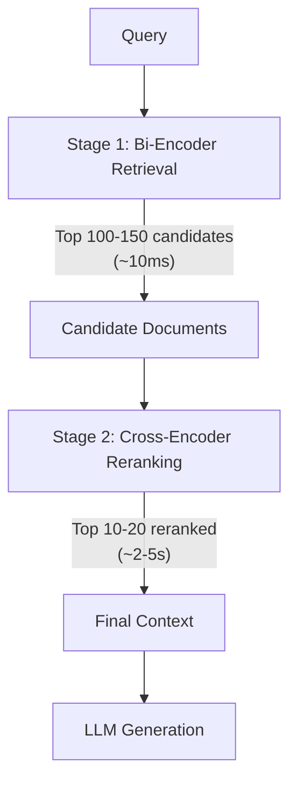

# Why Reranking Matters

## Introduction

Vector similarity search is incredibly fast—but that speed comes at the cost of precision. When you retrieve the top 100 documents from a vector database, the ordering is approximate. A document at position 50 might actually be more relevant than the one at position 5. Reranking fixes this.

This lesson explains the fundamental precision problem with embedding-based retrieval and introduces the two-stage retrieval pattern that achieves both speed and accuracy.

---

## The Precision Problem

### How Bi-Encoders Work

Standard embedding models are **bi-encoders**: they encode queries and documents independently, then compare the resulting vectors using cosine similarity.



**Key insight**: The query and document never "see" each other during encoding. The encoder must compress all meaning into a fixed-size vector without knowing what it will be compared against.

### Why This Limits Precision

Consider the query "Python creator" and these documents:

| Document | Bi-Encoder Score | True Relevance |
|----------|-----------------|----------------|
| "Guido van Rossum created Python in 1991" | 0.89 | ⭐⭐⭐ High |
| "Python is a popular programming language" | 0.91 | ⭐ Low |
| "The Python snake is found in Asia and Africa" | 0.85 | ❌ None |

The generic "Python is popular" document scores higher because "Python" and "programming" are common terms with strong embeddings—even though it doesn't answer the question.

### The Numbers

| Retrieval Method | Precision@10 | Recall@10 |
|------------------|--------------|-----------|
| Bi-encoder only | 0.65 | 0.82 |
| + Cross-encoder reranking | 0.85 | 0.82 |

Reranking improves precision by **30%** without sacrificing recall.

---

## Cross-Encoder Architecture

Cross-encoders solve the precision problem by processing query and document **together**:



### Why Cross-Encoders Are More Accurate

1. **Token-level interaction**: Every query token attends to every document token
2. **Context-aware**: The model understands "Python" means the language when the query mentions "creator"
3. **Learned relevance**: Trained specifically to predict relevance, not general similarity

### The Trade-off

| Property | Bi-Encoder | Cross-Encoder |
|----------|------------|---------------|
| **Encoding** | Independent | Joint |
| **Precomputation** | ✅ Yes | ❌ No |
| **Search 1M docs** | ~1ms | ~14 hours |
| **Score 100 docs** | Already done | ~5 seconds |
| **Accuracy** | Good | Excellent |

Cross-encoders can't be used for initial retrieval—they're too slow. But they're perfect for re-scoring a small candidate set.

---

## The Two-Stage Pattern

The solution: combine both approaches.



### Stage 1: Fast Retrieval

- Use bi-encoder embeddings and vector search
- Retrieve 100-150 candidates (over-fetch)
- Latency: ~10-50ms for millions of documents
- Purpose: High recall, catch all potentially relevant docs

### Stage 2: Precise Reranking

- Use cross-encoder to score each candidate
- Re-order by relevance score
- Select top 10-20 for LLM context
- Latency: ~2-5 seconds for 100 candidates
- Purpose: High precision, best docs first

### Why Over-Fetch?

If you only retrieve 10 documents initially, a relevant document at position 15 is lost forever. By retrieving 100-150 candidates, you ensure high recall—then reranking surfaces the truly relevant ones.

---

## Impact on RAG Quality

### Anthropic's Contextual Retrieval Study

Anthropic's 2024 research on contextual retrieval showed:

| Configuration | Failure Rate |
|---------------|--------------|
| Baseline RAG | 22% |
| + Contextual embeddings | 15% |
| + Reranking | 8% |
| + Both | **3%** |

**Key finding**: Reranking alone reduced failure rate by **67%** (from 22% to 8%).

### Why Reranking Helps RAG So Much

1. **Better context**: Most relevant documents are at the top
2. **Less noise**: Irrelevant documents are pushed down or excluded
3. **Position bias**: LLMs pay more attention to content at the start of context
4. **Efficiency**: Smaller context windows with higher signal

---

## When to Use Reranking

### Good Candidates for Reranking

- **Knowledge-intensive queries**: Technical documentation, legal, medical
- **Ambiguous terms**: Queries with multiple possible meanings
- **Precision-critical applications**: Customer support, compliance
- **Small candidate sets**: When you can afford the latency

### When to Skip Reranking

- **Real-time chat**: Sub-second latency requirements
- **Simple lookups**: FAQ-style queries with clear matches
- **High-volume, low-stakes**: Recommendations, casual search
- **Cost-sensitive**: Reranking APIs have per-query costs

---

## Code Example: Before and After

```python
from langchain_openai import OpenAIEmbeddings
from langchain_core.vectorstores import InMemoryVectorStore
import cohere

# Setup
documents = [
    "Guido van Rossum created Python in 1991.",
    "Python is a popular programming language.",
    "The Python snake is found in tropical regions.",
    "Van Rossum worked at Google and Dropbox.",
    "Programming languages include Java, C++, and Python.",
]

embeddings = OpenAIEmbeddings(model="text-embedding-3-small")
vector_store = InMemoryVectorStore(embeddings)
vector_store.add_texts(documents)

query = "Who created Python?"

# Stage 1: Bi-encoder retrieval
initial_results = vector_store.similarity_search(query, k=5)
print("=== Before Reranking ===")
for i, doc in enumerate(initial_results, 1):
    print(f"{i}. {doc.page_content}")

# Stage 2: Cross-encoder reranking
co = cohere.ClientV2()
reranked = co.rerank(
    model="rerank-v4.0-pro",
    query=query,
    documents=[d.page_content for d in initial_results],
    top_n=3,
    return_documents=True
)

print("\n=== After Reranking ===")
for i, r in enumerate(reranked.results, 1):
    print(f"{i}. [{r.relevance_score:.3f}] {r.document.text}")
```

**Output:**
```
=== Before Reranking ===
1. Python is a popular programming language.
2. Programming languages include Java, C++, and Python.
3. Guido van Rossum created Python in 1991.
4. The Python snake is found in tropical regions.
5. Van Rossum worked at Google and Dropbox.

=== After Reranking ===
1. [0.943] Guido van Rossum created Python in 1991.
2. [0.521] Van Rossum worked at Google and Dropbox.
3. [0.234] Python is a popular programming language.
```

The correct answer jumped from position 3 to position 1.

---

## Summary

✅ Bi-encoders are fast but sacrifice precision due to independent encoding  
✅ Cross-encoders achieve higher accuracy by processing query + document together  
✅ Two-stage retrieval combines speed (bi-encoder) and accuracy (cross-encoder)  
✅ Reranking improves RAG precision by ~67% according to Anthropic's research  
✅ Over-fetch candidates (100-150) to ensure high recall before reranking  

---

**Next:** [Cross-Encoder Reranking](./02-cross-encoder-reranking.md) — Deep dive into cross-encoder architecture and implementation
