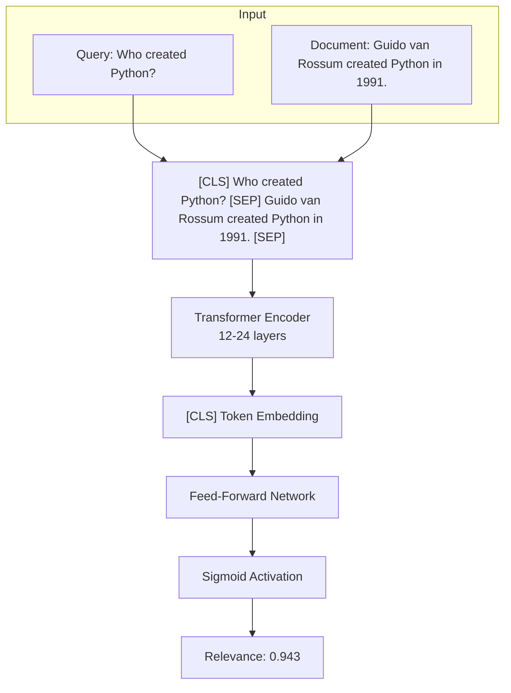
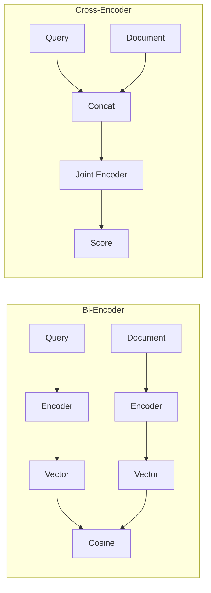

# Cross-Encoder Reranking

## Introduction

Cross-encoders are the secret weapon of modern retrieval systems. Unlike bi-encoders that compress queries and documents into independent vectors, cross-encoders process them together—enabling deep token-level interaction that produces far more accurate relevance scores.

This lesson explores how cross-encoders work, when to use them, and how to implement them with popular libraries.

---

## How Cross-Encoders Work

### Architecture Deep Dive

A cross-encoder takes a query-document pair as a single input and outputs a relevance score:



### Token-Level Attention

The key advantage: every token can attend to every other token across the query-document boundary.

```
Query:    Who    created   Python  ?
           ↕↘    ↕↘        ↕↘      ↕
Document: Guido  van       Rossum  created  Python  in  1991
           ↕↗    ↕↗        ↕↗      ↕↗       ↕↗      ↕↗  ↕↗
```

When "created" in the query attends to "Guido van Rossum" and "created" in the document, the model understands this is about Python's creator—not just documents containing the word "Python."

---

## Bi-Encoder vs Cross-Encoder Comparison

| Aspect | Bi-Encoder | Cross-Encoder |
|--------|------------|---------------|
| **Input** | Query OR Document | Query AND Document |
| **Output** | Vector embedding | Scalar score |
| **Precompute docs?** | ✅ Yes | ❌ No |
| **Batch queries?** | ✅ Yes | ⚠️ Limited |
| **Token interaction** | None (post-hoc) | Full attention |
| **Accuracy** | Good | Excellent |
| **Latency per doc** | ~0.001ms | ~50ms |

### Visualization



---

## Popular Cross-Encoder Models

### Sentence-Transformers Models

| Model | Base | Training Data | Best For |
|-------|------|---------------|----------|
| `cross-encoder/ms-marco-MiniLM-L-6-v2` | MiniLM | MS MARCO | Fast, general |
| `cross-encoder/ms-marco-MiniLM-L-12-v2` | MiniLM | MS MARCO | Balanced |
| `cross-encoder/ms-marco-electra-base` | ELECTRA | MS MARCO | Higher accuracy |
| `BAAI/bge-reranker-base` | XLM-RoBERTa | Multi-dataset | Multilingual |
| `BAAI/bge-reranker-large` | XLM-RoBERTa | Multi-dataset | Best accuracy |

### API-Based Rerankers

| Provider | Model | Max Tokens | Features |
|----------|-------|------------|----------|
| Cohere | rerank-v4.0-pro | 32,768 | Structured data, 100+ languages |
| Voyage | rerank-2.5 | 32,000 | Instruction-following |
| Jina | jina-reranker-v2-base | 8,192 | Multilingual, open weights |

---

## Implementation with Sentence-Transformers

### Basic Usage

```python
from sentence_transformers import CrossEncoder

# Load model
model = CrossEncoder('cross-encoder/ms-marco-MiniLM-L-6-v2')

# Query and documents
query = "What is the capital of France?"
documents = [
    "Paris is the capital of France and its largest city.",
    "France is a country in Western Europe.",
    "The Eiffel Tower is located in Paris.",
    "Berlin is the capital of Germany.",
]

# Create query-document pairs
pairs = [[query, doc] for doc in documents]

# Get relevance scores
scores = model.predict(pairs)

# Sort by score
ranked = sorted(zip(documents, scores), key=lambda x: x[1], reverse=True)

for doc, score in ranked:
    print(f"[{score:.4f}] {doc}")
```

**Output:**
```
[0.9847] Paris is the capital of France and its largest city.
[0.2341] The Eiffel Tower is located in Paris.
[0.0892] France is a country in Western Europe.
[0.0023] Berlin is the capital of Germany.
```

### Batch Processing for Efficiency

```python
from sentence_transformers import CrossEncoder
import numpy as np

model = CrossEncoder('BAAI/bge-reranker-large', max_length=512)

def rerank_documents(
    query: str,
    documents: list[str],
    top_k: int = 10,
    batch_size: int = 32
) -> list[tuple[str, float]]:
    """
    Rerank documents with batched inference.
    
    Args:
        query: Search query
        documents: List of documents to rerank
        top_k: Number of top results to return
        batch_size: Batch size for inference
    
    Returns:
        List of (document, score) tuples
    """
    # Create pairs
    pairs = [[query, doc] for doc in documents]
    
    # Score in batches
    all_scores = []
    for i in range(0, len(pairs), batch_size):
        batch = pairs[i:i + batch_size]
        scores = model.predict(batch, show_progress_bar=False)
        all_scores.extend(scores)
    
    # Rank by score
    ranked_indices = np.argsort(all_scores)[::-1][:top_k]
    
    return [
        (documents[idx], all_scores[idx])
        for idx in ranked_indices
    ]

# Usage
results = rerank_documents(
    query="machine learning applications",
    documents=my_documents,
    top_k=10
)
```

---

## LangChain Integration

### Using CrossEncoderReranker

```python
from langchain.retrievers import ContextualCompressionRetriever
from langchain_community.cross_encoders import HuggingFaceCrossEncoder
from langchain.retrievers.document_compressors import CrossEncoderReranker
from langchain_openai import OpenAIEmbeddings
from langchain_core.vectorstores import InMemoryVectorStore

# Setup vector store
embeddings = OpenAIEmbeddings(model="text-embedding-3-small")
vector_store = InMemoryVectorStore(embeddings)
vector_store.add_texts([
    "The quick brown fox jumps over the lazy dog.",
    "Machine learning is a subset of artificial intelligence.",
    "Python was created by Guido van Rossum.",
    "Deep learning uses neural networks with many layers.",
    "Natural language processing enables text understanding.",
])

# Create base retriever
base_retriever = vector_store.as_retriever(search_kwargs={"k": 5})

# Setup cross-encoder reranker
cross_encoder = HuggingFaceCrossEncoder(model_name="BAAI/bge-reranker-base")
reranker = CrossEncoderReranker(model=cross_encoder, top_n=3)

# Create compression retriever
reranking_retriever = ContextualCompressionRetriever(
    base_compressor=reranker,
    base_retriever=base_retriever
)

# Query
docs = reranking_retriever.invoke("Who invented Python?")
for doc in docs:
    print(doc.page_content)
```

---

## Performance Optimization

### GPU Acceleration

```python
from sentence_transformers import CrossEncoder
import torch

# Check GPU availability
device = "cuda" if torch.cuda.is_available() else "cpu"
print(f"Using device: {device}")

# Load model on GPU
model = CrossEncoder(
    'BAAI/bge-reranker-large',
    max_length=512,
    device=device
)

# Larger batch sizes on GPU
batch_size = 64 if device == "cuda" else 16
```

### Async Processing

```python
import asyncio
from concurrent.futures import ThreadPoolExecutor
from sentence_transformers import CrossEncoder

class AsyncCrossEncoder:
    def __init__(self, model_name: str, max_workers: int = 4):
        self.model = CrossEncoder(model_name)
        self.executor = ThreadPoolExecutor(max_workers=max_workers)
    
    async def rerank_async(
        self,
        query: str,
        documents: list[str],
        top_k: int = 10
    ) -> list[tuple[str, float]]:
        """Async reranking for concurrent requests."""
        loop = asyncio.get_event_loop()
        
        def _rerank():
            pairs = [[query, doc] for doc in documents]
            scores = self.model.predict(pairs)
            ranked = sorted(
                zip(documents, scores),
                key=lambda x: x[1],
                reverse=True
            )
            return ranked[:top_k]
        
        return await loop.run_in_executor(self.executor, _rerank)

# Usage
async def main():
    reranker = AsyncCrossEncoder('cross-encoder/ms-marco-MiniLM-L-6-v2')
    
    # Process multiple queries concurrently
    queries = ["query 1", "query 2", "query 3"]
    doc_lists = [[...], [...], [...]]
    
    results = await asyncio.gather(*[
        reranker.rerank_async(q, docs)
        for q, docs in zip(queries, doc_lists)
    ])
    
    return results
```

### Caching Strategies

```python
from functools import lru_cache
import hashlib

class CachedCrossEncoder:
    def __init__(self, model_name: str, cache_size: int = 1000):
        self.model = CrossEncoder(model_name)
        self.cache_size = cache_size
        self._cache = {}
    
    def _cache_key(self, query: str, document: str) -> str:
        """Create deterministic cache key."""
        content = f"{query}|||{document}"
        return hashlib.md5(content.encode()).hexdigest()
    
    def score_pair(self, query: str, document: str) -> float:
        """Score with caching."""
        key = self._cache_key(query, document)
        
        if key in self._cache:
            return self._cache[key]
        
        score = self.model.predict([[query, document]])[0]
        
        # LRU-style eviction
        if len(self._cache) >= self.cache_size:
            oldest_key = next(iter(self._cache))
            del self._cache[oldest_key]
        
        self._cache[key] = score
        return score
    
    def rerank(
        self,
        query: str,
        documents: list[str],
        top_k: int = 10
    ) -> list[tuple[str, float]]:
        """Rerank with caching for repeated queries."""
        # Check cache first
        cached_scores = []
        uncached_pairs = []
        uncached_indices = []
        
        for i, doc in enumerate(documents):
            key = self._cache_key(query, doc)
            if key in self._cache:
                cached_scores.append((i, self._cache[key]))
            else:
                uncached_pairs.append([query, doc])
                uncached_indices.append(i)
        
        # Score uncached pairs in batch
        if uncached_pairs:
            new_scores = self.model.predict(uncached_pairs)
            for idx, score in zip(uncached_indices, new_scores):
                key = self._cache_key(query, documents[idx])
                self._cache[key] = score
                cached_scores.append((idx, score))
        
        # Sort and return top-k
        cached_scores.sort(key=lambda x: x[1], reverse=True)
        return [
            (documents[idx], score)
            for idx, score in cached_scores[:top_k]
        ]
```

---

## Latency Benchmarks

### Local Cross-Encoder Performance

| Model | Documents | GPU (A100) | GPU (T4) | CPU |
|-------|-----------|------------|----------|-----|
| MiniLM-L-6 | 100 | 45ms | 120ms | 800ms |
| MiniLM-L-12 | 100 | 85ms | 220ms | 1.5s |
| BGE-base | 100 | 95ms | 250ms | 1.8s |
| BGE-large | 100 | 180ms | 480ms | 3.5s |

### API-Based Reranker Performance

| Provider | Model | 100 Documents | Includes Network |
|----------|-------|---------------|------------------|
| Cohere | rerank-v4.0-pro | ~800ms | Yes |
| Cohere | rerank-v4.0-fast | ~400ms | Yes |
| Voyage | rerank-2.5 | ~600ms | Yes |

---

## When to Use Local vs API

### Use Local Cross-Encoders When

- **High volume**: Thousands of queries per minute
- **Low latency**: Need sub-100ms response
- **GPU available**: Have inference infrastructure
- **Cost-sensitive**: Want to avoid per-query fees
- **Data privacy**: Can't send data to external APIs

### Use API Rerankers When

- **Quick start**: No infrastructure setup needed
- **State-of-the-art**: Latest models without training
- **Scalability**: Don't want to manage GPU clusters
- **Multilingual**: Need 100+ language support
- **Structured data**: JSON/YAML handling built-in

---

## Summary

✅ Cross-encoders process query + document together for higher accuracy  
✅ Token-level attention enables understanding of query-document relationships  
✅ Sentence-transformers provides easy local cross-encoder implementation  
✅ LangChain's `ContextualCompressionRetriever` integrates reranking into pipelines  
✅ GPU acceleration and caching significantly improve throughput  
✅ Choose local vs API based on volume, latency, and infrastructure requirements  

---

**Next:** [Cohere Rerank](./03-cohere-rerank.md) — Production-grade reranking with Cohere's v4.0 API
