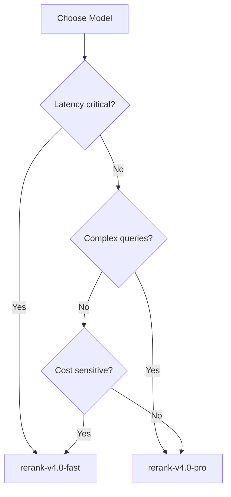

# Cohere Rerank

## Introduction

Cohere Rerank is the industry-standard API for production reranking. The v4.0 models support 100+ languages, handle structured data (JSON, YAML, code), and offer both high-quality and fast inference options. This lesson covers everything you need to integrate Cohere Rerank into your RAG pipeline.

---

## Model Options

| Model | Context Length | Best For | Latency |
|-------|---------------|----------|---------|
| `rerank-v4.0-pro` | 32,768 tokens | Highest quality, complex queries | Higher |
| `rerank-v4.0-fast` | 32,768 tokens | Balance of speed and quality | Lower |
| `rerank-v3.5` | 4,096 tokens | Legacy support | Medium |

### Choosing the Right Model



---

## Basic Usage

### Setup

```bash
pip install cohere
```

```python
import cohere
import os

# Option 1: Environment variable (recommended)
# export COHERE_API_KEY=your_api_key
co = cohere.ClientV2()

# Option 2: Explicit API key
co = cohere.ClientV2(api_key="your_api_key")
```

### Simple Reranking

```python
import cohere

co = cohere.ClientV2()

query = "What is the capital of the United States?"
documents = [
    "Carson City is the capital city of Nevada.",
    "The Commonwealth of the Northern Mariana Islands has Saipan as its capital.",
    "Charlotte Amalie is the capital of the US Virgin Islands.",
    "Washington, D.C. is the capital of the United States.",
    "Capital punishment has existed in the United States since colonial times.",
]

results = co.rerank(
    model="rerank-v4.0-pro",
    query=query,
    documents=documents,
    top_n=3,
    return_documents=True
)

for result in results.results:
    print(f"Index: {result.index}")
    print(f"Score: {result.relevance_score:.4f}")
    print(f"Text: {result.document.text}")
    print()
```

**Output:**
```
Index: 3
Score: 0.9433
Text: Washington, D.C. is the capital of the United States.

Index: 2
Score: 0.6221
Text: Charlotte Amalie is the capital of the US Virgin Islands.

Index: 1
Score: 0.5054
Text: The Commonwealth of the Northern Mariana Islands has Saipan as its capital.
```

---

## Response Structure

```python
# V2RerankResponse structure
results.results  # List of RerankResult objects

# Each RerankResult contains:
result.index            # Original document index
result.relevance_score  # Score from 0.0 to 1.0
result.document         # Only if return_documents=True
result.document.text    # The document text
```

### Understanding Scores

| Score Range | Interpretation |
|-------------|----------------|
| 0.9 - 1.0 | Highly relevant, direct answer |
| 0.7 - 0.9 | Relevant, contains useful information |
| 0.4 - 0.7 | Somewhat relevant, tangentially related |
| 0.0 - 0.4 | Low relevance, likely noise |

---

## Structured Data Reranking

Cohere Rerank v4.0 excels at structured data when formatted as YAML:

### Product Data Example

```python
import yaml
import cohere

co = cohere.ClientV2()

query = "Which laptop has the best battery life for travel?"

products = [
    {
        "Name": "ProBook Ultra",
        "Battery": "72Wh",
        "Battery_Life": "Up to 18 hours",
        "Weight": "1.2kg",
        "Price": "$1,299"
    },
    {
        "Name": "WorkStation Pro",
        "Battery": "56Wh",
        "Battery_Life": "Up to 8 hours",
        "Weight": "2.1kg",
        "Price": "$1,899"
    },
    {
        "Name": "TravelMate X1",
        "Battery": "65Wh",
        "Battery_Life": "Up to 24 hours",
        "Weight": "0.98kg",
        "Price": "$1,499"
    },
    {
        "Name": "Budget Laptop",
        "Battery": "42Wh",
        "Battery_Life": "Up to 6 hours",
        "Weight": "1.8kg",
        "Price": "$599"
    }
]

# Convert to YAML (preserve key order!)
yaml_docs = [yaml.dump(p, sort_keys=False) for p in products]

results = co.rerank(
    model="rerank-v4.0-pro",
    query=query,
    documents=yaml_docs,
    top_n=4
)

print("Rankings for: Best battery life for travel\n")
for i, r in enumerate(results.results, 1):
    product = products[r.index]
    print(f"{i}. {product['Name']}")
    print(f"   Score: {r.relevance_score:.4f}")
    print(f"   Battery: {product['Battery_Life']}, Weight: {product['Weight']}")
    print()
```

**Output:**
```
Rankings for: Best battery life for travel

1. TravelMate X1
   Score: 0.9847
   Battery: Up to 24 hours, Weight: 0.98kg

2. ProBook Ultra
   Score: 0.8234
   Battery: Up to 18 hours, Weight: 1.2kg

3. WorkStation Pro
   Score: 0.3421
   Battery: Up to 8 hours, Weight: 2.1kg

4. Budget Laptop
   Score: 0.1892
   Battery: Up to 6 hours, Weight: 1.8kg
```

### Why YAML Over JSON?

- More readable for the model
- Preserves semantic structure
- Better key-value understanding
- **Important**: Use `sort_keys=False` to preserve logical ordering

---

## Multilingual Reranking

Cohere Rerank supports 100+ languages with no configuration needed:

```python
import cohere

co = cohere.ClientV2()

# Query in English, documents in multiple languages
query = "What is artificial intelligence?"

documents = [
    "Artificial intelligence is the simulation of human intelligence by machines.",  # English
    "L'intelligence artificielle est la simulation de l'intelligence humaine par des machines.",  # French
    "人工智能是机器对人类智能的模拟。",  # Chinese
    "La inteligencia artificial es la simulación de la inteligencia humana por máquinas.",  # Spanish
    "Künstliche Intelligenz ist die Simulation menschlicher Intelligenz durch Maschinen.",  # German
]

results = co.rerank(
    model="rerank-v4.0-pro",
    query=query,
    documents=documents,
    top_n=5,
    return_documents=True
)

for r in results.results:
    print(f"[{r.relevance_score:.3f}] {r.document.text[:60]}...")
```

All documents score similarly high because they contain the same information in different languages.

---

## LangChain Integration

### Basic Integration

```python
from langchain_cohere import CohereRerank
from langchain.retrievers import ContextualCompressionRetriever
from langchain_openai import OpenAIEmbeddings
from langchain_core.vectorstores import InMemoryVectorStore

# Setup vector store
embeddings = OpenAIEmbeddings(model="text-embedding-3-small")
vector_store = InMemoryVectorStore(embeddings)
vector_store.add_texts([
    "Python was created by Guido van Rossum in 1991.",
    "JavaScript was created by Brendan Eich in 1995.",
    "TypeScript was developed by Microsoft in 2012.",
    "Rust was designed by Graydon Hoare at Mozilla.",
    "Go was created at Google by Robert Griesemer.",
])

# Create base retriever
base_retriever = vector_store.as_retriever(search_kwargs={"k": 5})

# Add Cohere reranking
reranker = CohereRerank(
    model="rerank-v4.0-pro",
    top_n=3
)

reranking_retriever = ContextualCompressionRetriever(
    base_compressor=reranker,
    base_retriever=base_retriever
)

# Use in queries
docs = reranking_retriever.invoke("When was Python created?")
for doc in docs:
    print(doc.page_content)
```

### Full RAG Pipeline

```python
from langchain_cohere import CohereRerank
from langchain.retrievers import ContextualCompressionRetriever
from langchain_openai import ChatOpenAI, OpenAIEmbeddings
from langchain_core.vectorstores import InMemoryVectorStore
from langchain_core.prompts import ChatPromptTemplate
from langchain_core.runnables import RunnablePassthrough
from langchain_core.output_parsers import StrOutputParser

# Components
embeddings = OpenAIEmbeddings(model="text-embedding-3-small")
vector_store = InMemoryVectorStore(embeddings)
llm = ChatOpenAI(model="gpt-4o-mini")

# Add documents
vector_store.add_texts([
    "The Eiffel Tower was completed in 1889 for the World's Fair.",
    "Paris is the capital and most populous city of France.",
    "The Louvre Museum is the world's largest art museum.",
    "France is known for its wine, cheese, and cuisine.",
    "The French Revolution began in 1789.",
])

# Retriever with reranking
base_retriever = vector_store.as_retriever(search_kwargs={"k": 5})
reranker = CohereRerank(model="rerank-v4.0-pro", top_n=3)
retriever = ContextualCompressionRetriever(
    base_compressor=reranker,
    base_retriever=base_retriever
)

# RAG prompt
prompt = ChatPromptTemplate.from_template("""
Answer the question based on the following context:

Context:
{context}

Question: {question}

Answer:
""")

def format_docs(docs):
    return "\n\n".join(doc.page_content for doc in docs)

# RAG chain
rag_chain = (
    {"context": retriever | format_docs, "question": RunnablePassthrough()}
    | prompt
    | llm
    | StrOutputParser()
)

# Query
answer = rag_chain.invoke("When was the Eiffel Tower built?")
print(answer)
```

---

## Advanced Parameters

### Controlling Output

```python
results = co.rerank(
    model="rerank-v4.0-pro",
    query=query,
    documents=documents,
    
    # Number of results to return
    top_n=10,  # Default: returns all documents
    
    # Include document text in response
    return_documents=True,  # Default: False
    
    # Maximum tokens per document (truncates if exceeded)
    max_tokens_per_doc=4096,  # Optional
)
```

### Handling Long Documents

```python
def rerank_with_chunking(
    query: str,
    long_documents: list[str],
    max_tokens: int = 4096,
    top_n: int = 10
) -> list[dict]:
    """
    Rerank long documents by chunking and taking max score per doc.
    """
    from tiktoken import encoding_for_model
    
    enc = encoding_for_model("gpt-4")
    co = cohere.ClientV2()
    
    # Chunk documents
    chunks = []
    chunk_to_doc = []
    
    for doc_idx, doc in enumerate(long_documents):
        tokens = enc.encode(doc)
        
        if len(tokens) <= max_tokens:
            chunks.append(doc)
            chunk_to_doc.append(doc_idx)
        else:
            # Split into chunks with overlap
            for i in range(0, len(tokens), max_tokens - 200):
                chunk_tokens = tokens[i:i + max_tokens]
                chunks.append(enc.decode(chunk_tokens))
                chunk_to_doc.append(doc_idx)
    
    # Rerank all chunks
    results = co.rerank(
        model="rerank-v4.0-pro",
        query=query,
        documents=chunks,
        top_n=len(chunks)
    )
    
    # Aggregate: max score per document
    doc_scores = {}
    for r in results.results:
        doc_idx = chunk_to_doc[r.index]
        if doc_idx not in doc_scores or r.relevance_score > doc_scores[doc_idx]:
            doc_scores[doc_idx] = r.relevance_score
    
    # Sort and return
    ranked = sorted(doc_scores.items(), key=lambda x: x[1], reverse=True)
    return [
        {"document": long_documents[idx], "score": score}
        for idx, score in ranked[:top_n]
    ]
```

---

## Error Handling

```python
import cohere
from cohere.errors import TooManyRequestsError, BadRequestError

co = cohere.ClientV2()

def safe_rerank(
    query: str,
    documents: list[str],
    max_retries: int = 3
) -> list[dict]:
    """Rerank with error handling and retries."""
    import time
    
    for attempt in range(max_retries):
        try:
            results = co.rerank(
                model="rerank-v4.0-pro",
                query=query,
                documents=documents,
                top_n=10,
                return_documents=True
            )
            return [
                {"index": r.index, "score": r.relevance_score, "text": r.document.text}
                for r in results.results
            ]
            
        except TooManyRequestsError:
            # Rate limited - exponential backoff
            wait_time = 2 ** attempt
            print(f"Rate limited, waiting {wait_time}s...")
            time.sleep(wait_time)
            
        except BadRequestError as e:
            # Invalid input - don't retry
            print(f"Bad request: {e}")
            raise
            
        except Exception as e:
            # Other errors - retry with backoff
            if attempt < max_retries - 1:
                time.sleep(2 ** attempt)
            else:
                raise
    
    return []
```

---

## Cost Optimization

### Pricing

| Model | Price per 1K Searches |
|-------|----------------------|
| rerank-v4.0-pro | $2.00 |
| rerank-v4.0-fast | $1.00 |
| rerank-v3.5 | $1.00 |

### Cost Reduction Strategies

```python
import hashlib
from functools import lru_cache

class CostOptimizedReranker:
    def __init__(self):
        self.co = cohere.ClientV2()
        self.cache = {}
    
    def _cache_key(self, query: str, docs: tuple) -> str:
        content = query + "|||" + "|||".join(docs[:3])  # Use first 3 docs for key
        return hashlib.md5(content.encode()).hexdigest()
    
    def rerank(
        self,
        query: str,
        documents: list[str],
        use_cache: bool = True,
        use_fast_model: bool = False
    ) -> list[dict]:
        """
        Cost-optimized reranking with caching and model selection.
        """
        # Check cache
        if use_cache:
            key = self._cache_key(query, tuple(documents))
            if key in self.cache:
                return self.cache[key]
        
        # Choose model based on requirements
        model = "rerank-v4.0-fast" if use_fast_model else "rerank-v4.0-pro"
        
        # Limit documents to reduce cost
        max_docs = 100  # Reranking 100 vs 200 docs halves cost
        docs_to_rerank = documents[:max_docs]
        
        results = self.co.rerank(
            model=model,
            query=query,
            documents=docs_to_rerank,
            top_n=10
        )
        
        output = [
            {"index": r.index, "score": r.relevance_score}
            for r in results.results
        ]
        
        # Cache results
        if use_cache:
            self.cache[key] = output
        
        return output
```

---

## Best Practices

### Do's

1. **Batch similar queries** — Group queries when possible
2. **Cache results** — Same query + docs = same results
3. **Use fast model** — For high-volume, latency-sensitive apps
4. **Pre-filter** — Use metadata filters before expensive reranking
5. **Set appropriate top_n** — Don't request more results than needed

### Don'ts

1. **Don't rerank too few** — Less than 20 candidates limits improvement
2. **Don't rerank too many** — Over 200 candidates has diminishing returns
3. **Don't skip error handling** — Rate limits happen
4. **Don't ignore scores** — Use thresholds to filter low-relevance results

---

## Summary

✅ Cohere Rerank v4.0 offers pro (quality) and fast (latency) options  
✅ 32K token context supports long documents  
✅ YAML formatting improves structured data reranking  
✅ 100+ languages supported with no configuration  
✅ LangChain integration via `CohereRerank` and `ContextualCompressionRetriever`  
✅ Cache and batch to optimize costs  

---

**Next:** [Voyage Reranker](./04-voyage-reranker.md) — Alternative reranking API with instruction-following capabilities
