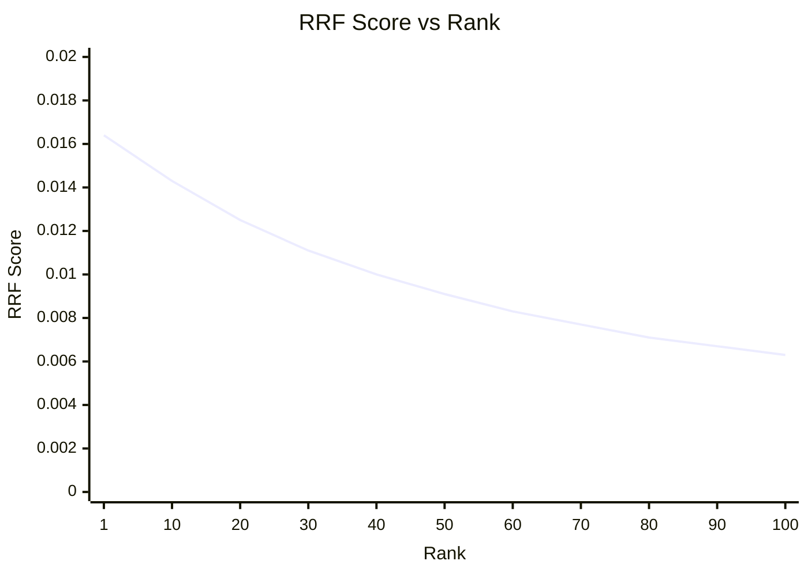

# Reciprocal Rank Fusion (RRF)

## Introduction

When you combine results from multiple retrieval methods—semantic search, keyword search, metadata filters—you need a way to merge the ranked lists. **Reciprocal Rank Fusion (RRF)** is the most popular algorithm for this because it's simple, effective, and robust to different scoring scales.

RRF doesn't care about raw scores. It only looks at rank positions, making it perfect for combining results from systems with incompatible scoring (cosine similarity vs BM25 scores).

---

## The Problem: Incompatible Scores

Consider combining semantic and keyword search results:

| Document | Semantic Score | Keyword Score (BM25) |
|----------|---------------|---------------------|
| Doc A | 0.89 | 12.4 |
| Doc B | 0.92 | 8.1 |
| Doc C | 0.71 | 15.2 |

How do you compare 0.89 (cosine similarity) with 12.4 (BM25)? Simple averaging or weighted sums don't work because the scales are completely different.

---

## How RRF Works

RRF assigns scores based on **rank position**, not raw scores:

$$RRF(d) = \sum_{r \in R} \frac{1}{k + rank_r(d)}$$

Where:
- $d$ is a document
- $R$ is the set of ranked lists to merge
- $rank_r(d)$ is the position of document $d$ in ranked list $r$ (1-indexed)
- $k$ is a smoothing constant (typically 60)

### Why k = 60?

The constant $k$ prevents high ranks from dominating:

| Rank | RRF Score (k=1) | RRF Score (k=60) |
|------|-----------------|------------------|
| 1 | 0.500 | 0.0164 |
| 2 | 0.333 | 0.0161 |
| 10 | 0.091 | 0.0143 |
| 50 | 0.020 | 0.0091 |
| 100 | 0.010 | 0.0063 |

With $k=60$, position 1 is only 2.6x more valuable than position 100. With $k=1$, it would be 50x more valuable.



---

## Basic Implementation

```python
from collections import defaultdict

def reciprocal_rank_fusion(
    ranked_lists: list[list[str]], 
    k: int = 60
) -> list[tuple[str, float]]:
    """
    Merge multiple ranked lists using Reciprocal Rank Fusion.
    
    Args:
        ranked_lists: List of ranked document lists (most relevant first)
        k: Smoothing constant (default 60)
    
    Returns:
        List of (document, score) tuples sorted by fused score
    """
    rrf_scores = defaultdict(float)
    
    for ranked_list in ranked_lists:
        for rank, doc in enumerate(ranked_list, start=1):
            rrf_scores[doc] += 1 / (k + rank)
    
    # Sort by score descending
    return sorted(rrf_scores.items(), key=lambda x: x[1], reverse=True)
```

### Example

```python
# Semantic search results (most relevant first)
semantic_results = ["doc_a", "doc_b", "doc_c", "doc_d", "doc_e"]

# Keyword search results (most relevant first)
keyword_results = ["doc_c", "doc_f", "doc_a", "doc_g", "doc_b"]

fused = reciprocal_rank_fusion([semantic_results, keyword_results], k=60)

print("Fused Rankings:")
for doc, score in fused[:7]:
    print(f"  {doc}: {score:.6f}")
```

**Output:**
```
Fused Rankings:
  doc_a: 0.032787  (semantic rank 1 + keyword rank 3)
  doc_c: 0.032787  (semantic rank 3 + keyword rank 1)
  doc_b: 0.032258  (semantic rank 2 + keyword rank 5)
  doc_f: 0.016129  (keyword rank 2 only)
  doc_d: 0.015625  (semantic rank 4 only)
  doc_g: 0.015385  (keyword rank 4 only)
  doc_e: 0.015152  (semantic rank 5 only)
```

**Key insight**: `doc_a` and `doc_c` tie because (rank 1 + rank 3) = (rank 3 + rank 1).

---

## Weighted RRF

Give different weights to different retrieval methods:

```python
def weighted_rrf(
    ranked_lists: list[list[str]],
    weights: list[float],
    k: int = 60
) -> list[tuple[str, float]]:
    """
    RRF with per-list weights.
    
    Args:
        ranked_lists: List of ranked document lists
        weights: Weight for each list (should sum to 1 for normalization)
        k: Smoothing constant
    
    Returns:
        Fused and sorted results
    """
    if len(ranked_lists) != len(weights):
        raise ValueError("Must have one weight per ranked list")
    
    rrf_scores = defaultdict(float)
    
    for ranked_list, weight in zip(ranked_lists, weights):
        for rank, doc in enumerate(ranked_list, start=1):
            rrf_scores[doc] += weight * (1 / (k + rank))
    
    return sorted(rrf_scores.items(), key=lambda x: x[1], reverse=True)

# Example: Weight semantic search higher
fused = weighted_rrf(
    ranked_lists=[semantic_results, keyword_results],
    weights=[0.7, 0.3],  # 70% semantic, 30% keyword
    k=60
)
```

### Choosing Weights

| Use Case | Semantic Weight | Keyword Weight |
|----------|-----------------|----------------|
| **Conceptual queries** | 0.8 | 0.2 |
| **Exact match important** | 0.3 | 0.7 |
| **Balanced** | 0.5 | 0.5 |
| **Technical docs** | 0.4 | 0.6 |
| **Conversational** | 0.7 | 0.3 |

---

## Multi-Source RRF

Extend to more than two sources:

```python
def multi_source_rrf(
    sources: dict[str, list[str]],
    weights: dict[str, float] = None,
    k: int = 60
) -> list[tuple[str, float]]:
    """
    RRF across multiple named sources with optional weights.
    
    Args:
        sources: Dict mapping source name to ranked results
        weights: Optional dict mapping source name to weight
        k: Smoothing constant
    
    Returns:
        Fused and sorted results
    """
    if weights is None:
        weights = {name: 1.0 for name in sources}
    
    rrf_scores = defaultdict(float)
    
    for source_name, ranked_list in sources.items():
        weight = weights.get(source_name, 1.0)
        for rank, doc in enumerate(ranked_list, start=1):
            rrf_scores[doc] += weight * (1 / (k + rank))
    
    return sorted(rrf_scores.items(), key=lambda x: x[1], reverse=True)

# Example: Combine three sources
sources = {
    "semantic": ["doc_a", "doc_b", "doc_c"],
    "keyword": ["doc_c", "doc_d", "doc_a"],
    "metadata": ["doc_e", "doc_a", "doc_f"],  # e.g., by recency
}

weights = {
    "semantic": 0.5,
    "keyword": 0.3,
    "metadata": 0.2,
}

fused = multi_source_rrf(sources, weights)
```

---

## Production Implementation

### With Document Objects

```python
from dataclasses import dataclass
from typing import Any
from collections import defaultdict

@dataclass
class Document:
    id: str
    content: str
    metadata: dict[str, Any] = None
    score: float = 0.0

def rrf_documents(
    document_lists: list[list[Document]],
    weights: list[float] = None,
    k: int = 60,
    top_n: int = None
) -> list[Document]:
    """
    RRF fusion for Document objects.
    
    Args:
        document_lists: Lists of Document objects (ranked by relevance)
        weights: Optional weights per list
        k: Smoothing constant
        top_n: Maximum results to return
    
    Returns:
        Fused list of Documents with updated scores
    """
    if weights is None:
        weights = [1.0] * len(document_lists)
    
    # Map doc_id -> Document (keep first occurrence)
    doc_map: dict[str, Document] = {}
    rrf_scores: dict[str, float] = defaultdict(float)
    
    for doc_list, weight in zip(document_lists, weights):
        for rank, doc in enumerate(doc_list, start=1):
            # Store document reference
            if doc.id not in doc_map:
                doc_map[doc.id] = doc
            
            # Accumulate RRF score
            rrf_scores[doc.id] += weight * (1 / (k + rank))
    
    # Build result list
    results = []
    for doc_id, score in sorted(rrf_scores.items(), key=lambda x: x[1], reverse=True):
        doc = doc_map[doc_id]
        doc.score = score
        results.append(doc)
        
        if top_n and len(results) >= top_n:
            break
    
    return results
```

### Thread-Safe RRF Service

```python
import threading
from collections import defaultdict
from typing import Optional

class RRFService:
    """Thread-safe RRF fusion service."""
    
    def __init__(self, default_k: int = 60):
        self.default_k = default_k
        self._lock = threading.Lock()
    
    def fuse(
        self,
        ranked_lists: list[list[str]],
        weights: Optional[list[float]] = None,
        k: Optional[int] = None,
        top_n: Optional[int] = None
    ) -> list[tuple[str, float]]:
        """
        Thread-safe RRF fusion.
        """
        k = k or self.default_k
        
        if weights is None:
            weights = [1.0] * len(ranked_lists)
        
        with self._lock:
            scores = defaultdict(float)
            
            for ranked_list, weight in zip(ranked_lists, weights):
                for rank, doc in enumerate(ranked_list, start=1):
                    scores[doc] += weight * (1 / (k + rank))
            
            sorted_results = sorted(
                scores.items(),
                key=lambda x: x[1],
                reverse=True
            )
            
            if top_n:
                sorted_results = sorted_results[:top_n]
            
            return sorted_results
    
    def fuse_with_metadata(
        self,
        ranked_lists: list[list[dict]],
        id_field: str = "id",
        weights: Optional[list[float]] = None,
        k: Optional[int] = None
    ) -> list[dict]:
        """
        RRF fusion preserving document metadata.
        
        Each dict in ranked_lists should have an 'id' field.
        """
        k = k or self.default_k
        
        if weights is None:
            weights = [1.0] * len(ranked_lists)
        
        doc_map = {}  # id -> full doc dict
        scores = defaultdict(float)
        
        for ranked_list, weight in zip(ranked_lists, weights):
            for rank, doc in enumerate(ranked_list, start=1):
                doc_id = doc[id_field]
                
                if doc_id not in doc_map:
                    doc_map[doc_id] = doc.copy()
                
                scores[doc_id] += weight * (1 / (k + rank))
        
        # Build result with scores
        results = []
        for doc_id, score in sorted(scores.items(), key=lambda x: x[1], reverse=True):
            result = doc_map[doc_id]
            result["rrf_score"] = score
            results.append(result)
        
        return results
```

---

## RRF in Practice

### Azure AI Search Implementation

Azure AI Search uses RRF for hybrid search by default:

```
// Azure Search API (conceptual)
{
  "search": "machine learning",
  "queryType": "semantic",
  "semanticConfiguration": "my-config",
  "searchMode": "all",
  
  // RRF fusion happens automatically
  // between keyword and semantic results
}
```

### LangChain Ensemble Retriever

```python
from langchain.retrievers import EnsembleRetriever
from langchain_community.retrievers import BM25Retriever
from langchain_openai import OpenAIEmbeddings
from langchain_core.vectorstores import InMemoryVectorStore

# Setup retrievers
documents = [
    "Python was created by Guido van Rossum.",
    "JavaScript is the language of the web.",
    "Machine learning uses statistical algorithms.",
]

# BM25 (keyword)
bm25_retriever = BM25Retriever.from_texts(documents)
bm25_retriever.k = 5

# Vector (semantic)
embeddings = OpenAIEmbeddings(model="text-embedding-3-small")
vector_store = InMemoryVectorStore(embeddings)
vector_store.add_texts(documents)
vector_retriever = vector_store.as_retriever(search_kwargs={"k": 5})

# Ensemble with RRF
ensemble_retriever = EnsembleRetriever(
    retrievers=[bm25_retriever, vector_retriever],
    weights=[0.4, 0.6]  # Weighted RRF
)

# Query
results = ensemble_retriever.invoke("Who created Python?")
```

---

## Tuning k Parameter

### Effect of Different k Values

| k Value | Behavior |
|---------|----------|
| **k=1** | High ranks dominate heavily |
| **k=20** | Moderate preference for high ranks |
| **k=60** | Standard, balanced fusion |
| **k=100** | Even more uniform weighting |

### Experimentation

```python
def compare_k_values(
    ranked_lists: list[list[str]],
    k_values: list[int] = [1, 20, 60, 100]
) -> dict[int, list[tuple[str, float]]]:
    """Compare RRF results across different k values."""
    results = {}
    
    for k in k_values:
        fused = reciprocal_rank_fusion(ranked_lists, k=k)
        results[k] = fused[:10]  # Top 10
    
    return results

# Compare
comparisons = compare_k_values([semantic_results, keyword_results])

for k, results in comparisons.items():
    print(f"\n=== k={k} ===")
    for doc, score in results[:5]:
        print(f"  {doc}: {score:.6f}")
```

---

## Summary

✅ RRF merges ranked lists using position, not raw scores  
✅ Formula: $RRF(d) = \sum \frac{1}{k + rank}$ with $k$ typically 60  
✅ Robust to incompatible scoring scales (cosine vs BM25)  
✅ Weighted RRF lets you prioritize certain retrieval methods  
✅ Multi-source RRF extends to any number of retrievers  
✅ Azure AI Search and LangChain use RRF for hybrid search  

---

**Next:** [Distribution-Based Score Fusion](./06-distribution-based-score-fusion.md) — Alternative fusion when you have access to raw scores
