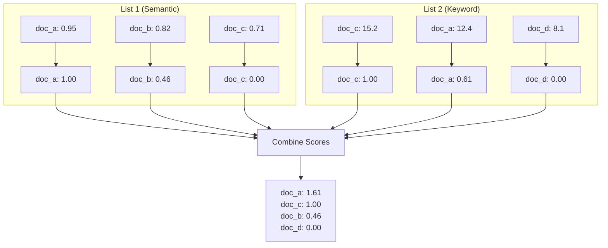

# Distribution-Based Score Fusion (DBSF)

## Introduction

While RRF ignores raw scores and uses only rank positions, **Distribution-Based Score Fusion (DBSF)** takes the opposite approach: it normalizes raw scores to a common scale and then combines them. This preserves score magnitude information that RRF discards.

DBSF is useful when score differences matter—when a document with a 0.95 score should rank higher than one with 0.91, even if they're both in the top 5.

---

## When to Use DBSF vs RRF

| Scenario | Best Choice |
|----------|-------------|
| Incompatible scoring systems | RRF |
| Scores have meaning within lists | DBSF |
| Need to preserve score magnitude | DBSF |
| Quick, simple fusion | RRF |
| Multiple sources with similar scales | DBSF |
| Unknown score distributions | RRF |

---

## How DBSF Works

### Step 1: Normalize Scores

Convert each score list to a [0, 1] range using min-max normalization:

$$normalized = \frac{score - min}{max - min}$$

### Step 2: Combine Scores

For each document, sum (or weighted sum) its normalized scores across lists.

### Step 3: Sort and Rank

Order by combined score descending.



---

## Basic Implementation

```python
from collections import defaultdict

def distribution_based_score_fusion(
    score_lists: list[list[tuple[str, float]]],
    weights: list[float] = None
) -> list[tuple[str, float]]:
    """
    Merge scored results using Distribution-Based Score Fusion.
    
    Args:
        score_lists: List of (doc_id, score) lists
        weights: Optional weights for each list (default: equal)
    
    Returns:
        Fused and sorted results as (doc_id, score) tuples
    """
    if weights is None:
        weights = [1.0] * len(score_lists)
    
    # Normalize each list to [0, 1]
    normalized_lists = []
    
    for scores in score_lists:
        if not scores:
            normalized_lists.append([])
            continue
        
        values = [s[1] for s in scores]
        min_score = min(values)
        max_score = max(values)
        score_range = max_score - min_score
        
        if score_range == 0:
            # All scores identical - normalize to 1.0
            normalized = [(doc, 1.0) for doc, _ in scores]
        else:
            normalized = [
                (doc, (score - min_score) / score_range)
                for doc, score in scores
            ]
        
        normalized_lists.append(normalized)
    
    # Combine weighted scores
    combined = defaultdict(float)
    
    for norm_list, weight in zip(normalized_lists, weights):
        for doc, score in norm_list:
            combined[doc] += weight * score
    
    # Sort by combined score
    return sorted(combined.items(), key=lambda x: x[1], reverse=True)
```

### Example

```python
# Semantic search results (cosine similarity)
semantic_scores = [
    ("doc_a", 0.95),
    ("doc_b", 0.82),
    ("doc_c", 0.71),
]

# Keyword search results (BM25 scores)
keyword_scores = [
    ("doc_c", 15.2),
    ("doc_a", 12.4),
    ("doc_d", 8.1),
]

# Fuse with equal weights
fused = distribution_based_score_fusion(
    [semantic_scores, keyword_scores],
    weights=[0.5, 0.5]
)

print("DBSF Rankings:")
for doc, score in fused:
    print(f"  {doc}: {score:.4f}")
```

**Output:**
```
DBSF Rankings:
  doc_a: 0.8028  (semantic: 1.0 × 0.5, keyword: 0.61 × 0.5)
  doc_c: 0.5000  (semantic: 0.0 × 0.5, keyword: 1.0 × 0.5)
  doc_b: 0.2292  (semantic: 0.46 × 0.5, keyword: 0.0 × 0.5)
  doc_d: 0.0000  (semantic: 0.0 × 0.5, keyword: 0.0 × 0.5)
```

---

## Advanced DBSF Variants

### Z-Score Normalization

For Gaussian-distributed scores, z-score normalization can be more appropriate:

```python
import statistics

def zscore_fusion(
    score_lists: list[list[tuple[str, float]]],
    weights: list[float] = None
) -> list[tuple[str, float]]:
    """
    DBSF using z-score normalization.
    
    Better for normally distributed scores.
    """
    if weights is None:
        weights = [1.0] * len(score_lists)
    
    normalized_lists = []
    
    for scores in score_lists:
        if len(scores) < 2:
            normalized_lists.append([(doc, 0.0) for doc, _ in scores])
            continue
        
        values = [s[1] for s in scores]
        mean = statistics.mean(values)
        stdev = statistics.stdev(values)
        
        if stdev == 0:
            normalized = [(doc, 0.0) for doc, _ in scores]
        else:
            normalized = [
                (doc, (score - mean) / stdev)
                for doc, score in scores
            ]
        
        normalized_lists.append(normalized)
    
    # Combine
    combined = defaultdict(float)
    for norm_list, weight in zip(normalized_lists, weights):
        for doc, score in norm_list:
            combined[doc] += weight * score
    
    return sorted(combined.items(), key=lambda x: x[1], reverse=True)
```

### Sigmoid Normalization

Compress scores to [0, 1] using sigmoid function:

```python
import math

def sigmoid_fusion(
    score_lists: list[list[tuple[str, float]]],
    weights: list[float] = None,
    temperature: float = 1.0
) -> list[tuple[str, float]]:
    """
    DBSF using sigmoid normalization.
    
    Args:
        temperature: Controls sigmoid steepness (lower = steeper)
    """
    if weights is None:
        weights = [1.0] * len(score_lists)
    
    def sigmoid(x: float, temp: float) -> float:
        return 1 / (1 + math.exp(-x / temp))
    
    normalized_lists = []
    
    for scores in score_lists:
        if not scores:
            normalized_lists.append([])
            continue
        
        # Center scores around 0
        values = [s[1] for s in scores]
        mean = sum(values) / len(values)
        
        normalized = [
            (doc, sigmoid(score - mean, temperature))
            for doc, score in scores
        ]
        normalized_lists.append(normalized)
    
    # Combine
    combined = defaultdict(float)
    for norm_list, weight in zip(normalized_lists, weights):
        for doc, score in norm_list:
            combined[doc] += weight * score
    
    return sorted(combined.items(), key=lambda x: x[1], reverse=True)
```

---

## DBSF with Document Objects

```python
from dataclasses import dataclass, field
from typing import Any
from collections import defaultdict

@dataclass
class ScoredDocument:
    id: str
    content: str
    score: float = 0.0
    metadata: dict[str, Any] = field(default_factory=dict)
    source_scores: dict[str, float] = field(default_factory=dict)

def dbsf_documents(
    document_lists: list[list[ScoredDocument]],
    source_names: list[str],
    weights: list[float] = None
) -> list[ScoredDocument]:
    """
    DBSF for ScoredDocument objects, preserving source scores.
    
    Args:
        document_lists: Lists of scored documents
        source_names: Name for each source (for tracking)
        weights: Optional weights per source
    
    Returns:
        Fused documents with combined scores
    """
    if weights is None:
        weights = [1.0] * len(document_lists)
    
    doc_map: dict[str, ScoredDocument] = {}
    normalized_scores: dict[str, dict[str, float]] = defaultdict(dict)
    
    # Normalize each source
    for source_name, doc_list, weight in zip(source_names, document_lists, weights):
        if not doc_list:
            continue
        
        scores = [doc.score for doc in doc_list]
        min_score = min(scores)
        max_score = max(scores)
        score_range = max_score - min_score if max_score > min_score else 1.0
        
        for doc in doc_list:
            # Store document
            if doc.id not in doc_map:
                doc_map[doc.id] = ScoredDocument(
                    id=doc.id,
                    content=doc.content,
                    metadata=doc.metadata.copy()
                )
            
            # Normalize and store
            norm_score = (doc.score - min_score) / score_range if score_range > 0 else 1.0
            normalized_scores[doc.id][source_name] = norm_score * weight
    
    # Combine and update documents
    for doc_id, source_dict in normalized_scores.items():
        doc = doc_map[doc_id]
        doc.source_scores = {k: v for k, v in source_dict.items()}
        doc.score = sum(source_dict.values())
    
    # Sort and return
    return sorted(doc_map.values(), key=lambda d: d.score, reverse=True)

# Usage example
semantic_docs = [
    ScoredDocument(id="a", content="...", score=0.95),
    ScoredDocument(id="b", content="...", score=0.82),
]

keyword_docs = [
    ScoredDocument(id="b", content="...", score=15.2),
    ScoredDocument(id="c", content="...", score=12.1),
]

fused = dbsf_documents(
    [semantic_docs, keyword_docs],
    source_names=["semantic", "keyword"],
    weights=[0.6, 0.4]
)

for doc in fused:
    print(f"{doc.id}: {doc.score:.4f}")
    print(f"  Sources: {doc.source_scores}")
```

---

## Combining DBSF and RRF

Use both methods and compare, or combine them:

```python
def hybrid_fusion(
    score_lists: list[list[tuple[str, float]]],
    weights: list[float] = None,
    rrf_weight: float = 0.5,
    dbsf_weight: float = 0.5,
    k: int = 60
) -> list[tuple[str, float]]:
    """
    Combine RRF and DBSF for robust fusion.
    
    This captures both rank-based and score-based signals.
    """
    # Get RRF scores
    ranked_lists = [
        [doc for doc, _ in sorted(scores, key=lambda x: x[1], reverse=True)]
        for scores in score_lists
    ]
    
    rrf_results = {}
    for ranked_list in ranked_lists:
        for rank, doc in enumerate(ranked_list, start=1):
            if doc not in rrf_results:
                rrf_results[doc] = 0.0
            rrf_results[doc] += 1 / (k + rank)
    
    # Normalize RRF scores to [0, 1]
    if rrf_results:
        max_rrf = max(rrf_results.values())
        rrf_results = {doc: score / max_rrf for doc, score in rrf_results.items()}
    
    # Get DBSF scores
    dbsf_results = dict(distribution_based_score_fusion(score_lists, weights))
    
    # Normalize DBSF scores to [0, 1]
    if dbsf_results:
        max_dbsf = max(dbsf_results.values())
        if max_dbsf > 0:
            dbsf_results = {doc: score / max_dbsf for doc, score in dbsf_results.items()}
    
    # Combine
    all_docs = set(rrf_results.keys()) | set(dbsf_results.keys())
    combined = {}
    
    for doc in all_docs:
        rrf_score = rrf_results.get(doc, 0.0)
        dbsf_score = dbsf_results.get(doc, 0.0)
        combined[doc] = rrf_weight * rrf_score + dbsf_weight * dbsf_score
    
    return sorted(combined.items(), key=lambda x: x[1], reverse=True)
```

---

## Handling Edge Cases

### Missing Documents

```python
def robust_dbsf(
    score_lists: list[list[tuple[str, float]]],
    weights: list[float] = None,
    missing_score: float = 0.0
) -> list[tuple[str, float]]:
    """
    DBSF with explicit handling for documents missing from some lists.
    
    Args:
        missing_score: Score to assign when doc not in a list (0.0 = neutral)
    """
    if weights is None:
        weights = [1.0] * len(score_lists)
    
    # Collect all documents
    all_docs = set()
    for scores in score_lists:
        all_docs.update(doc for doc, _ in scores)
    
    # Normalize each list
    normalized_lists = []
    for scores in score_lists:
        score_dict = dict(scores)
        
        if not scores:
            normalized_lists.append({doc: missing_score for doc in all_docs})
            continue
        
        values = [s for s in score_dict.values()]
        min_s, max_s = min(values), max(values)
        range_s = max_s - min_s if max_s > min_s else 1.0
        
        normalized = {}
        for doc in all_docs:
            if doc in score_dict:
                normalized[doc] = (score_dict[doc] - min_s) / range_s
            else:
                normalized[doc] = missing_score
        
        normalized_lists.append(normalized)
    
    # Combine
    combined = {}
    for doc in all_docs:
        combined[doc] = sum(
            weight * norm_list.get(doc, missing_score)
            for norm_list, weight in zip(normalized_lists, weights)
        )
    
    return sorted(combined.items(), key=lambda x: x[1], reverse=True)
```

### Empty Lists

```python
def safe_dbsf(
    score_lists: list[list[tuple[str, float]]],
    weights: list[float] = None,
    min_lists: int = 1
) -> list[tuple[str, float]]:
    """
    DBSF that handles empty lists gracefully.
    
    Args:
        min_lists: Minimum non-empty lists required
    """
    non_empty = [(scores, w) for scores, w in zip(score_lists, weights or [1.0] * len(score_lists)) if scores]
    
    if len(non_empty) < min_lists:
        return []
    
    filtered_scores = [s for s, _ in non_empty]
    filtered_weights = [w for _, w in non_empty]
    
    # Renormalize weights
    total_weight = sum(filtered_weights)
    filtered_weights = [w / total_weight for w in filtered_weights]
    
    return distribution_based_score_fusion(filtered_scores, filtered_weights)
```

---

## Performance Comparison

```python
import time
import random
import string

def benchmark_fusion_methods(
    n_docs: int = 1000,
    n_lists: int = 3,
    n_iterations: int = 100
) -> dict[str, float]:
    """
    Benchmark RRF vs DBSF performance.
    """
    # Generate test data
    def random_scores(n: int) -> list[tuple[str, float]]:
        docs = [''.join(random.choices(string.ascii_lowercase, k=8)) for _ in range(n)]
        scores = [random.random() for _ in range(n)]
        return list(zip(docs, scores))
    
    score_lists = [random_scores(n_docs) for _ in range(n_lists)]
    ranked_lists = [
        [doc for doc, _ in sorted(scores, key=lambda x: x[1], reverse=True)]
        for scores in score_lists
    ]
    
    results = {}
    
    # Benchmark RRF
    start = time.perf_counter()
    for _ in range(n_iterations):
        reciprocal_rank_fusion(ranked_lists)
    results["rrf"] = (time.perf_counter() - start) / n_iterations
    
    # Benchmark DBSF
    start = time.perf_counter()
    for _ in range(n_iterations):
        distribution_based_score_fusion(score_lists)
    results["dbsf"] = (time.perf_counter() - start) / n_iterations
    
    return results

# Run benchmark
# benchmarks = benchmark_fusion_methods()
# print(f"RRF: {benchmarks['rrf']*1000:.2f}ms")
# print(f"DBSF: {benchmarks['dbsf']*1000:.2f}ms")
```

Typical results:
- **RRF**: ~2ms per fusion (1000 docs, 3 lists)
- **DBSF**: ~3ms per fusion (1000 docs, 3 lists)

Both are fast enough for production use.

---

## Summary

✅ DBSF normalizes scores to [0, 1] before combining  
✅ Preserves score magnitude information that RRF discards  
✅ Use min-max, z-score, or sigmoid normalization depending on distribution  
✅ Handle missing documents with explicit default scores  
✅ Combine DBSF and RRF for hybrid fusion  
✅ Both methods are fast enough for production (~2-3ms)  

---

**Next:** [Hybrid Reranking Pipeline](./07-hybrid-reranking-pipeline.md) — Complete pipeline combining everything together
