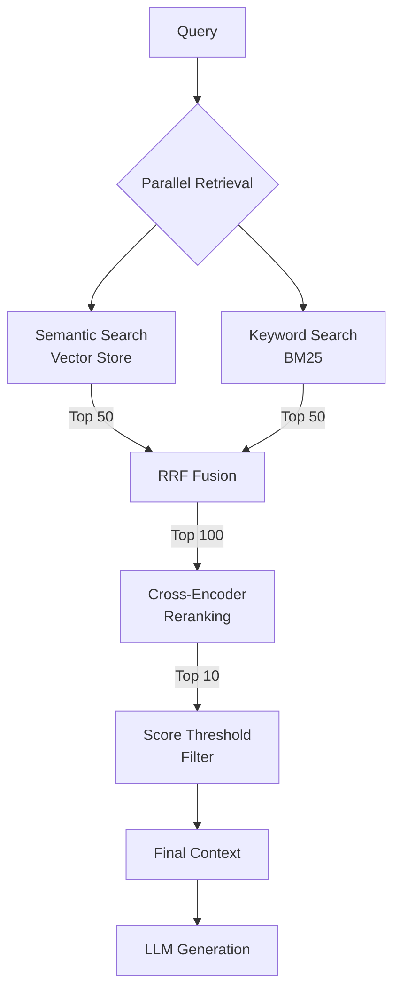

# Hybrid Reranking Pipeline

## Introduction

You've learned the individual components: bi-encoder retrieval, cross-encoder reranking, RRF, and DBSF. Now it's time to combine them into a complete **hybrid reranking pipeline** that achieves both high recall and high precision.

This lesson builds a production-ready pipeline that:
1. Retrieves candidates from multiple sources (semantic + keyword)
2. Fuses results using RRF
3. Reranks with a cross-encoder
4. Returns top results for generation

---

## Pipeline Architecture



---

## Complete Implementation

### Core Pipeline Class

```python
import cohere
from langchain_openai import OpenAIEmbeddings
from langchain_core.vectorstores import InMemoryVectorStore
from langchain_community.retrievers import BM25Retriever
from langchain_core.documents import Document
from collections import defaultdict
from dataclasses import dataclass
from typing import Optional
import time

@dataclass
class RetrievalResult:
    """Result from the hybrid retrieval pipeline."""
    document: str
    rerank_score: float
    metadata: dict
    retrieval_sources: list[str]

class HybridRetrievalPipeline:
    """
    Production hybrid retrieval with RRF fusion and reranking.
    
    Combines:
    - Semantic search (OpenAI embeddings)
    - Keyword search (BM25)
    - RRF score fusion
    - Cohere cross-encoder reranking
    """
    
    def __init__(
        self,
        documents: list[str],
        metadatas: list[dict] = None,
        embedding_model: str = "text-embedding-3-small",
        rerank_model: str = "rerank-v4.0-pro"
    ):
        self.documents = documents
        self.metadatas = metadatas or [{} for _ in documents]
        self.rerank_model = rerank_model
        
        # Initialize Cohere
        self.cohere = cohere.ClientV2()
        
        # Initialize embeddings and vector store
        self.embeddings = OpenAIEmbeddings(model=embedding_model)
        self.vector_store = InMemoryVectorStore(self.embeddings)
        
        # Add documents to vector store
        self.vector_store.add_texts(documents, metadatas=self.metadatas)
        
        # Initialize BM25
        self.bm25 = BM25Retriever.from_texts(
            documents,
            metadatas=self.metadatas
        )
    
    def retrieve(
        self,
        query: str,
        semantic_k: int = 50,
        keyword_k: int = 50,
        fusion_k: int = 60,
        rerank_candidates: int = 100,
        final_k: int = 10,
        score_threshold: float = None,
        semantic_weight: float = 0.5,
        keyword_weight: float = 0.5
    ) -> list[RetrievalResult]:
        """
        Execute hybrid retrieval pipeline.
        
        Args:
            query: Search query
            semantic_k: Candidates from semantic search
            keyword_k: Candidates from keyword search
            fusion_k: RRF k parameter
            rerank_candidates: Max candidates for reranking
            final_k: Final number of results
            score_threshold: Optional minimum rerank score
            semantic_weight: Weight for semantic results in RRF
            keyword_weight: Weight for keyword results in RRF
        
        Returns:
            List of RetrievalResult objects
        """
        # Stage 1: Parallel retrieval
        semantic_docs = self.vector_store.similarity_search(query, k=semantic_k)
        
        self.bm25.k = keyword_k
        keyword_docs = self.bm25.invoke(query)
        
        # Track which source each doc came from
        doc_sources = defaultdict(list)
        for doc in semantic_docs:
            doc_sources[doc.page_content].append("semantic")
        for doc in keyword_docs:
            doc_sources[doc.page_content].append("keyword")
        
        # Stage 2: RRF Fusion
        semantic_texts = [d.page_content for d in semantic_docs]
        keyword_texts = [d.page_content for d in keyword_docs]
        
        fused = self._weighted_rrf(
            [semantic_texts, keyword_texts],
            [semantic_weight, keyword_weight],
            k=fusion_k
        )
        
        # Get candidates for reranking
        candidates = [doc for doc, _ in fused[:rerank_candidates]]
        
        if not candidates:
            return []
        
        # Stage 3: Reranking
        rerank_results = self.cohere.rerank(
            model=self.rerank_model,
            query=query,
            documents=candidates,
            top_n=final_k if not score_threshold else len(candidates),
            return_documents=True
        )
        
        # Stage 4: Build results with threshold filtering
        results = []
        for r in rerank_results.results:
            if score_threshold and r.relevance_score < score_threshold:
                continue
            
            doc_text = r.document.text
            
            # Find metadata
            doc_idx = self.documents.index(doc_text) if doc_text in self.documents else -1
            metadata = self.metadatas[doc_idx] if doc_idx >= 0 else {}
            
            results.append(RetrievalResult(
                document=doc_text,
                rerank_score=r.relevance_score,
                metadata=metadata,
                retrieval_sources=doc_sources.get(doc_text, ["unknown"])
            ))
            
            if len(results) >= final_k:
                break
        
        return results
    
    def _weighted_rrf(
        self,
        ranked_lists: list[list[str]],
        weights: list[float],
        k: int = 60
    ) -> list[tuple[str, float]]:
        """Weighted Reciprocal Rank Fusion."""
        scores = defaultdict(float)
        
        for ranked_list, weight in zip(ranked_lists, weights):
            for rank, doc in enumerate(ranked_list, start=1):
                scores[doc] += weight * (1 / (k + rank))
        
        return sorted(scores.items(), key=lambda x: x[1], reverse=True)
```

### Usage Example

```python
# Sample documents
documents = [
    "Python was created by Guido van Rossum in 1991.",
    "JavaScript was created by Brendan Eich at Netscape in 1995.",
    "The Python programming language emphasizes code readability.",
    "Guido van Rossum worked at Google from 2005 to 2012.",
    "Python supports multiple programming paradigms.",
    "Machine learning is a subset of artificial intelligence.",
    "Deep learning uses neural networks with many layers.",
    "Natural language processing enables text understanding.",
]

metadatas = [
    {"source": "wiki", "year": 2023},
    {"source": "wiki", "year": 2023},
    {"source": "docs", "year": 2024},
    {"source": "wiki", "year": 2023},
    {"source": "docs", "year": 2024},
    {"source": "textbook", "year": 2022},
    {"source": "textbook", "year": 2022},
    {"source": "paper", "year": 2023},
]

# Initialize pipeline
pipeline = HybridRetrievalPipeline(
    documents=documents,
    metadatas=metadatas,
    rerank_model="rerank-v4.0-pro"
)

# Query
results = pipeline.retrieve(
    query="Who created Python?",
    semantic_k=5,
    keyword_k=5,
    final_k=3,
    score_threshold=0.3
)

# Display results
for i, r in enumerate(results, 1):
    print(f"\n{i}. Score: {r.rerank_score:.4f}")
    print(f"   Sources: {r.retrieval_sources}")
    print(f"   Text: {r.document}")
```

**Output:**
```
1. Score: 0.9423
   Sources: ['semantic', 'keyword']
   Text: Python was created by Guido van Rossum in 1991.

2. Score: 0.7821
   Sources: ['semantic']
   Text: Guido van Rossum worked at Google from 2005 to 2012.

3. Score: 0.4234
   Sources: ['semantic', 'keyword']
   Text: The Python programming language emphasizes code readability.
```

---

## Async Pipeline

For high-throughput applications:

```python
import asyncio
from concurrent.futures import ThreadPoolExecutor
import cohere
from langchain_openai import OpenAIEmbeddings
from langchain_core.vectorstores import InMemoryVectorStore
from langchain_community.retrievers import BM25Retriever
from collections import defaultdict

class AsyncHybridPipeline:
    """Async hybrid retrieval for concurrent queries."""
    
    def __init__(
        self,
        documents: list[str],
        max_workers: int = 4
    ):
        self.documents = documents
        self.executor = ThreadPoolExecutor(max_workers=max_workers)
        
        # Initialize components
        self.cohere = cohere.ClientV2()
        embeddings = OpenAIEmbeddings(model="text-embedding-3-small")
        
        self.vector_store = InMemoryVectorStore(embeddings)
        self.vector_store.add_texts(documents)
        
        self.bm25 = BM25Retriever.from_texts(documents)
        self.bm25.k = 50
    
    async def retrieve_async(
        self,
        query: str,
        final_k: int = 10
    ) -> list[dict]:
        """Async retrieval with concurrent search."""
        loop = asyncio.get_event_loop()
        
        # Parallel retrieval
        semantic_task = loop.run_in_executor(
            self.executor,
            lambda: self.vector_store.similarity_search(query, k=50)
        )
        
        keyword_task = loop.run_in_executor(
            self.executor,
            lambda: self.bm25.invoke(query)
        )
        
        semantic_docs, keyword_docs = await asyncio.gather(
            semantic_task, keyword_task
        )
        
        # Fusion
        semantic_texts = [d.page_content for d in semantic_docs]
        keyword_texts = [d.page_content for d in keyword_docs]
        fused = self._rrf([semantic_texts, keyword_texts])
        
        candidates = [doc for doc, _ in fused[:100]]
        
        if not candidates:
            return []
        
        # Reranking (sync - API call)
        rerank_results = await loop.run_in_executor(
            self.executor,
            lambda: self.cohere.rerank(
                model="rerank-v4.0-fast",
                query=query,
                documents=candidates,
                top_n=final_k,
                return_documents=True
            )
        )
        
        return [
            {"document": r.document.text, "score": r.relevance_score}
            for r in rerank_results.results
        ]
    
    def _rrf(self, lists: list[list[str]], k: int = 60) -> list[tuple[str, float]]:
        scores = defaultdict(float)
        for ranked_list in lists:
            for rank, doc in enumerate(ranked_list, start=1):
                scores[doc] += 1 / (k + rank)
        return sorted(scores.items(), key=lambda x: x[1], reverse=True)
    
    async def batch_retrieve(
        self,
        queries: list[str],
        final_k: int = 10
    ) -> list[list[dict]]:
        """Retrieve for multiple queries concurrently."""
        tasks = [self.retrieve_async(q, final_k) for q in queries]
        return await asyncio.gather(*tasks)

# Usage
async def main():
    pipeline = AsyncHybridPipeline(documents)
    
    # Single query
    results = await pipeline.retrieve_async("Who created Python?")
    
    # Batch queries
    queries = ["Who created Python?", "What is machine learning?"]
    batch_results = await pipeline.batch_retrieve(queries)
    
    return results, batch_results

# results = asyncio.run(main())
```

---

## LangChain Integration

### Custom Retriever Class

```python
from langchain_core.retrievers import BaseRetriever
from langchain_core.documents import Document
from langchain_core.callbacks import CallbackManagerForRetrieverRun
from langchain_cohere import CohereRerank
from langchain.retrievers import EnsembleRetriever, ContextualCompressionRetriever
from langchain_community.retrievers import BM25Retriever
from langchain_openai import OpenAIEmbeddings
from langchain_core.vectorstores import InMemoryVectorStore
from pydantic import Field
from typing import Optional

class HybridRerankerRetriever(BaseRetriever):
    """
    LangChain-compatible hybrid retriever with reranking.
    """
    
    vector_store: InMemoryVectorStore
    bm25_retriever: BM25Retriever
    reranker: CohereRerank
    
    semantic_k: int = 50
    keyword_k: int = 50
    semantic_weight: float = 0.6
    keyword_weight: float = 0.4
    final_k: int = 10
    
    class Config:
        arbitrary_types_allowed = True
    
    def _get_relevant_documents(
        self,
        query: str,
        *,
        run_manager: CallbackManagerForRetrieverRun = None
    ) -> list[Document]:
        # Create ensemble retriever
        vector_retriever = self.vector_store.as_retriever(
            search_kwargs={"k": self.semantic_k}
        )
        self.bm25_retriever.k = self.keyword_k
        
        ensemble = EnsembleRetriever(
            retrievers=[vector_retriever, self.bm25_retriever],
            weights=[self.semantic_weight, self.keyword_weight]
        )
        
        # Add reranking
        compression_retriever = ContextualCompressionRetriever(
            base_compressor=self.reranker,
            base_retriever=ensemble
        )
        
        return compression_retriever.invoke(query)[:self.final_k]

# Factory function
def create_hybrid_retriever(
    documents: list[str],
    metadatas: list[dict] = None
) -> HybridRerankerRetriever:
    """Create a hybrid retriever with reranking."""
    embeddings = OpenAIEmbeddings(model="text-embedding-3-small")
    
    vector_store = InMemoryVectorStore(embeddings)
    vector_store.add_texts(documents, metadatas=metadatas)
    
    bm25 = BM25Retriever.from_texts(documents, metadatas=metadatas)
    reranker = CohereRerank(model="rerank-v4.0-pro", top_n=10)
    
    return HybridRerankerRetriever(
        vector_store=vector_store,
        bm25_retriever=bm25,
        reranker=reranker
    )

# Usage
retriever = create_hybrid_retriever(documents)
docs = retriever.invoke("Who created Python?")
```

### Full RAG Chain

```python
from langchain_openai import ChatOpenAI
from langchain_core.prompts import ChatPromptTemplate
from langchain_core.runnables import RunnablePassthrough
from langchain_core.output_parsers import StrOutputParser

def create_hybrid_rag_chain(documents: list[str]):
    """Create a complete RAG chain with hybrid retrieval."""
    
    # Create retriever
    retriever = create_hybrid_retriever(documents)
    
    # LLM
    llm = ChatOpenAI(model="gpt-4o-mini", temperature=0)
    
    # Prompt
    prompt = ChatPromptTemplate.from_template("""
Answer the question based on the following context. 
If the answer isn't in the context, say "I don't have enough information."

Context:
{context}

Question: {question}

Answer:
""")
    
    # Format documents
    def format_docs(docs):
        return "\n\n".join(doc.page_content for doc in docs)
    
    # Chain
    chain = (
        {"context": retriever | format_docs, "question": RunnablePassthrough()}
        | prompt
        | llm
        | StrOutputParser()
    )
    
    return chain

# Usage
chain = create_hybrid_rag_chain(documents)
answer = chain.invoke("Who created Python and when?")
print(answer)
```

---

## Monitoring and Debugging

### Pipeline with Logging

```python
import logging
import time
from dataclasses import dataclass

logging.basicConfig(level=logging.INFO)
logger = logging.getLogger(__name__)

@dataclass
class PipelineMetrics:
    semantic_time_ms: float
    keyword_time_ms: float
    fusion_time_ms: float
    rerank_time_ms: float
    total_time_ms: float
    semantic_count: int
    keyword_count: int
    fused_count: int
    final_count: int

class MonitoredHybridPipeline(HybridRetrievalPipeline):
    """Pipeline with performance monitoring."""
    
    def retrieve_with_metrics(
        self,
        query: str,
        **kwargs
    ) -> tuple[list[RetrievalResult], PipelineMetrics]:
        """Retrieve with detailed timing metrics."""
        
        start_total = time.perf_counter()
        
        # Semantic search
        start = time.perf_counter()
        semantic_docs = self.vector_store.similarity_search(
            query, k=kwargs.get("semantic_k", 50)
        )
        semantic_time = (time.perf_counter() - start) * 1000
        
        # Keyword search
        start = time.perf_counter()
        self.bm25.k = kwargs.get("keyword_k", 50)
        keyword_docs = self.bm25.invoke(query)
        keyword_time = (time.perf_counter() - start) * 1000
        
        # Fusion
        start = time.perf_counter()
        semantic_texts = [d.page_content for d in semantic_docs]
        keyword_texts = [d.page_content for d in keyword_docs]
        fused = self._weighted_rrf(
            [semantic_texts, keyword_texts],
            [kwargs.get("semantic_weight", 0.5), kwargs.get("keyword_weight", 0.5)],
            k=kwargs.get("fusion_k", 60)
        )
        fusion_time = (time.perf_counter() - start) * 1000
        
        # Reranking
        candidates = [doc for doc, _ in fused[:kwargs.get("rerank_candidates", 100)]]
        
        start = time.perf_counter()
        if candidates:
            rerank_results = self.cohere.rerank(
                model=self.rerank_model,
                query=query,
                documents=candidates,
                top_n=kwargs.get("final_k", 10),
                return_documents=True
            )
        else:
            rerank_results = type('obj', (object,), {'results': []})()
        rerank_time = (time.perf_counter() - start) * 1000
        
        total_time = (time.perf_counter() - start_total) * 1000
        
        # Build results
        results = [
            RetrievalResult(
                document=r.document.text,
                rerank_score=r.relevance_score,
                metadata={},
                retrieval_sources=[]
            )
            for r in rerank_results.results
        ]
        
        metrics = PipelineMetrics(
            semantic_time_ms=semantic_time,
            keyword_time_ms=keyword_time,
            fusion_time_ms=fusion_time,
            rerank_time_ms=rerank_time,
            total_time_ms=total_time,
            semantic_count=len(semantic_docs),
            keyword_count=len(keyword_docs),
            fused_count=len(fused),
            final_count=len(results)
        )
        
        logger.info(f"Pipeline metrics: {metrics}")
        
        return results, metrics

# Usage
pipeline = MonitoredHybridPipeline(documents)
results, metrics = pipeline.retrieve_with_metrics("Who created Python?")

print(f"\nPipeline Timing:")
print(f"  Semantic search: {metrics.semantic_time_ms:.1f}ms ({metrics.semantic_count} docs)")
print(f"  Keyword search: {metrics.keyword_time_ms:.1f}ms ({metrics.keyword_count} docs)")
print(f"  Fusion: {metrics.fusion_time_ms:.1f}ms ({metrics.fused_count} docs)")
print(f"  Reranking: {metrics.rerank_time_ms:.1f}ms ({metrics.final_count} docs)")
print(f"  Total: {metrics.total_time_ms:.1f}ms")
```

---

## Configuration Options

### Environment-Based Configuration

```python
from dataclasses import dataclass, field
import os

@dataclass
class PipelineConfig:
    """Configuration for hybrid retrieval pipeline."""
    
    # Embedding settings
    embedding_model: str = field(
        default_factory=lambda: os.getenv("EMBEDDING_MODEL", "text-embedding-3-small")
    )
    
    # Reranking settings
    rerank_model: str = field(
        default_factory=lambda: os.getenv("RERANK_MODEL", "rerank-v4.0-pro")
    )
    
    # Retrieval counts
    semantic_k: int = 50
    keyword_k: int = 50
    rerank_candidates: int = 100
    final_k: int = 10
    
    # Fusion settings
    fusion_k: int = 60
    semantic_weight: float = 0.6
    keyword_weight: float = 0.4
    
    # Quality settings
    score_threshold: float = None
    
    @classmethod
    def from_env(cls) -> "PipelineConfig":
        """Load configuration from environment variables."""
        return cls(
            embedding_model=os.getenv("EMBEDDING_MODEL", "text-embedding-3-small"),
            rerank_model=os.getenv("RERANK_MODEL", "rerank-v4.0-pro"),
            semantic_k=int(os.getenv("SEMANTIC_K", "50")),
            keyword_k=int(os.getenv("KEYWORD_K", "50")),
            final_k=int(os.getenv("FINAL_K", "10")),
            semantic_weight=float(os.getenv("SEMANTIC_WEIGHT", "0.6")),
            keyword_weight=float(os.getenv("KEYWORD_WEIGHT", "0.4")),
        )

# Usage
config = PipelineConfig.from_env()
pipeline = HybridRetrievalPipeline(documents)
results = pipeline.retrieve(
    query="Who created Python?",
    semantic_k=config.semantic_k,
    keyword_k=config.keyword_k,
    final_k=config.final_k,
    semantic_weight=config.semantic_weight,
    keyword_weight=config.keyword_weight,
)
```

---

## Summary

✅ Complete pipeline combines semantic + keyword + RRF + reranking  
✅ Parallel retrieval improves latency  
✅ Weighted RRF lets you tune semantic vs keyword importance  
✅ Score thresholds filter low-relevance results  
✅ Async implementation handles concurrent queries  
✅ LangChain integration enables easy RAG chain building  
✅ Monitoring tracks per-stage performance  

---

**Next:** [Evaluation & Optimization](./08-evaluation-optimization.md) — Measuring impact and reducing costs
