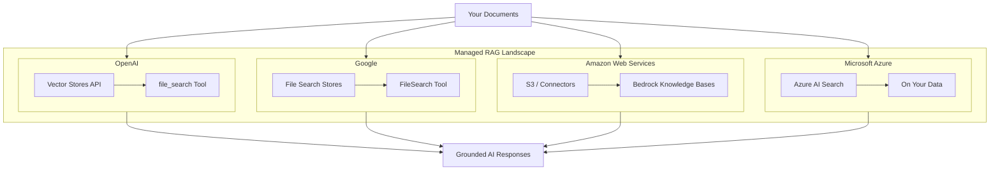
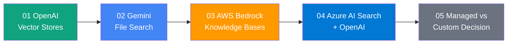

# Managed RAG Services

## Section Overview

Building a RAG pipeline from scratch requires assembling multiple components: document parsing, chunking, embedding generation, vector storage, retrieval, reranking, and prompt augmentation. Every major cloud AI provider now offers **managed RAG services** that handle most or all of these steps automatically—letting you go from documents to AI-powered answers in minutes instead of weeks.

These managed services trade customization for simplicity. They handle infrastructure, scaling, embedding generation, and index management behind the scenes. The question isn't whether managed RAG is "good enough"—it's whether the trade-offs align with your specific requirements.



---

## What You'll Learn

| Lesson | Topic | Description |
|--------|-------|-------------|
| 01 | [OpenAI Vector Stores API](./01-openai-vector-stores-api.md) | Managed vector storage, auto-chunking, file_search tool, and attribute filtering |
| 02 | [Gemini File Search](./02-gemini-file-search.md) | File Search Stores, upload and indexing, metadata filtering, and citations |
| 03 | [AWS Bedrock Knowledge Bases](./03-aws-bedrock-knowledge-bases.md) | S3 data sources, chunking strategies, vector store backends, and Retrieve API |
| 04 | [Azure AI Search + OpenAI](./04-azure-ai-search-openai.md) | Cognitive search, hybrid search types, On Your Data, and semantic ranking |
| 05 | [Managed vs Custom Decision Framework](./05-managed-vs-custom-decision-framework.md) | When to use managed services, migration paths, cost analysis, and hybrid approaches |

---

## Prerequisites

Before starting this section, you should understand:

- **Basic RAG pipeline** — The query → retrieve → generate pattern (Lessons 1–6)
- **Embedding fundamentals** — How text becomes vectors (Unit 7)
- **Vector database concepts** — Storing and searching embeddings (Lesson 3)
- **Chunking strategies** — How documents are split for retrieval (Lesson 8)

---

## Key Concepts

### What Makes RAG "Managed"?

In a custom RAG pipeline, you control every component:

```
Documents → [Your Parser] → [Your Chunker] → [Your Embedder] → [Your Vector DB] → [Your Retriever] → [Your LLM]
```

In a managed RAG pipeline, the provider handles most components:

```
Documents → [Upload API] → [Managed Pipeline] → [Grounded Response]
```

### The Managed RAG Stack

| Component | What You Handle | What the Provider Handles |
|-----------|----------------|--------------------------|
| **Documents** | Upload files or connect data sources | Parsing, format conversion |
| **Chunking** | Choose strategy (or use defaults) | Execution, overlap management |
| **Embeddings** | Nothing (automatic) | Model selection, generation, storage |
| **Vector Storage** | Nothing (managed) | Indexing, scaling, availability |
| **Retrieval** | Query parameters | Search execution, ranking |
| **Augmentation** | System prompts | Context injection, citation |

### Platform Comparison at a Glance

| Feature | OpenAI Vector Stores | Gemini File Search | AWS Bedrock KB | Azure AI Search |
|---------|---------------------|--------------------|----------------|-----------------|
| **Setup complexity** | Very low | Very low | Medium | Medium-high |
| **Default chunking** | 800 tokens / 400 overlap | Auto (configurable) | Multiple strategies | 1,024 tokens |
| **Supported formats** | 20+ file types | PDF, DOCX, TXT, etc. | S3 + connectors | 6 file types |
| **Metadata filtering** | ✅ Attribute filtering | ✅ Custom metadata | ✅ Implicit filters | ✅ Security filters |
| **Pricing model** | $0.10/GB/day storage | Free storage, embedding cost | Per-query + storage | Tiered service SKUs |
| **Search type** | Semantic + keyword | Semantic | Hybrid (configurable) | Keyword + semantic + vector + hybrid |
| **Built-in reranking** | ❌ | ❌ | ✅ Reranker models | ✅ Semantic ranking |
| **Source citations** | ✅ File citations | ✅ Grounding metadata | ✅ Source attribution | ✅ Document references |
| **Best for** | Quick prototypes, chatbots | Google ecosystem, simple RAG | Enterprise AWS workloads | Enterprise Azure workloads |

---

## Learning Path



Start with the platform you're most likely to use, or work through all five to understand the full landscape before making architectural decisions.
