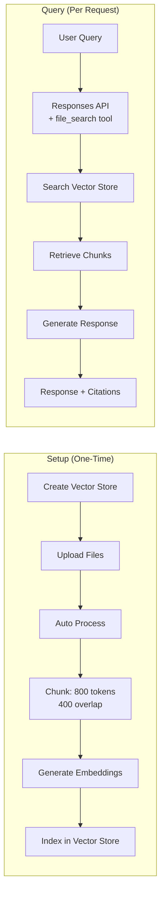

# OpenAI Vector Stores API

## Introduction

OpenAI's Vector Stores API is the simplest path from documents to AI-powered answers. Upload a file, and OpenAI automatically parses it, chunks it, generates embeddings, and stores everything in a managed vector database. When you use the `file_search` tool in the Responses API, the model searches your vector store, retrieves relevant chunks, and generates a grounded response with file citations—all in a single API call.

No embedding model to choose. No vector database to manage. No chunking code to write. The entire RAG pipeline collapses into three steps: create a vector store, upload files, and ask questions.

---

## Architecture Overview



The Vector Stores API handles both halves automatically. You only interact with the Setup and Query interfaces.

---

## Creating a Vector Store

A vector store is a named container for your indexed files. You can create multiple vector stores to organize different knowledge domains.

### Basic Creation

```python
from openai import OpenAI

client = OpenAI()

# Create a vector store with a descriptive name
vector_store = client.vector_stores.create(
    name="Product Documentation"
)

print(f"Vector store ID: {vector_store.id}")
print(f"Status: {vector_store.status}")
# Output:
# Vector store ID: vs_abc123
# Status: completed
```

### With Expiration Policy

Vector stores cost $0.10/GB/day after your first free GB. Set expiration policies to control costs:

```python
vector_store = client.vector_stores.create(
    name="Quarterly Reports Q1 2025",
    expires_after={
        "anchor": "last_active_at",
        "days": 30  # Auto-delete 30 days after last use
    }
)

print(f"Expires at: {vector_store.expires_at}")
```

The `anchor` field determines when the countdown starts:
- `last_active_at` — Timer resets each time the store is searched
- This prevents deletion of actively-used stores while cleaning up abandoned ones

### With Metadata

Attach up to 16 key-value pairs for organization:

```python
vector_store = client.vector_stores.create(
    name="Legal Contracts 2025",
    metadata={
        "department": "legal",
        "year": "2025",
        "sensitivity": "confidential"
    }
)
```

---

## Uploading Files

Once you have a vector store, upload files to it. OpenAI supports 20+ file types including PDF, DOCX, TXT, MD, HTML, JSON, and source code files.

### Upload and Poll

The `upload_and_poll` method uploads a file and waits for indexing to complete:

```python
# Upload a single file
with open("product_manual.pdf", "rb") as f:
    file = client.vector_stores.files.upload_and_poll(
        vector_store_id=vector_store.id,
        file=f
    )

print(f"File ID: {file.id}")
print(f"Status: {file.status}")
print(f"Bytes: {file.usage_bytes}")
# Output:
# File ID: file-abc123
# Status: completed
# Bytes: 45320
```

### Upload Multiple Files

For batch uploads, upload files individually and track progress:

```python
import os

doc_directory = "./knowledge_base"
uploaded_files = []

for filename in os.listdir(doc_directory):
    filepath = os.path.join(doc_directory, filename)
    
    with open(filepath, "rb") as f:
        file = client.vector_stores.files.upload_and_poll(
            vector_store_id=vector_store.id,
            file=f
        )
        uploaded_files.append(file)
        print(f"✓ Uploaded: {filename} ({file.status})")

print(f"\nTotal files: {len(uploaded_files)}")
```

### Custom Chunking Strategy

By default, OpenAI chunks files into **800-token segments with 400-token overlap**. You can customize this per file:

```python
# Upload with custom chunking
with open("long_technical_doc.pdf", "rb") as f:
    file = client.vector_stores.files.upload_and_poll(
        vector_store_id=vector_store.id,
        file=f,
        chunking_strategy={
            "type": "static",
            "static": {
                "max_chunk_size_tokens": 1600,   # Larger chunks
                "chunk_overlap_tokens": 400       # Same overlap
            }
        }
    )
```

### Chunking Strategy Comparison

| Strategy | Chunk Size | Overlap | Best For |
|----------|-----------|---------|----------|
| **Auto** (default) | 800 tokens | 400 tokens | General purpose, most documents |
| **Static** (custom) | 100–4096 tokens | 0–chunk_size | Fine-tuning for specific content |

**When to customize chunking:**
- **Larger chunks (1600+)**: Long-form technical docs where context matters
- **Smaller chunks (200–400)**: FAQ-style content with short, discrete answers
- **More overlap**: Documents where information flows across boundaries
- **Less overlap**: Self-contained sections (numbered lists, glossary entries)

---

## Setting File Attributes

File attributes enable metadata filtering during search. Set them when uploading or update later:

```python
# Set attributes on a file for filtering
client.vector_stores.files.update(
    vector_store_id=vector_store.id,
    file_id=file.id,
    attributes={
        "category": "technical",
        "product": "widget-pro",
        "version": "3.2",
        "audience": "developer"
    }
)
```

Attributes support string, number, and boolean values. You can have up to 16 attributes per file.

---

## Searching with file_search

The `file_search` tool integrates vector stores directly into the Responses API. The model decides when to search and generates responses with citations.

### Basic Search

```python
response = client.responses.create(
    model="gpt-4.1",
    input="How do I configure the widget dashboard?",
    tools=[{
        "type": "file_search",
        "vector_store_ids": [vector_store.id]
    }]
)

# The response includes grounded text with citations
print(response.output_text)
```

### With Metadata Filtering

Filter search results by file attributes:

```python
response = client.responses.create(
    model="gpt-4.1",
    input="What changed in version 3.2?",
    tools=[{
        "type": "file_search",
        "vector_store_ids": [vector_store.id],
        "filters": {
            "type": "and",
            "filters": [
                {
                    "type": "eq",
                    "key": "product",
                    "value": "widget-pro"
                },
                {
                    "type": "eq",
                    "key": "version",
                    "value": "3.2"
                }
            ]
        }
    }]
)
```

### Available Filter Operators

| Operator | Description | Example |
|----------|-------------|---------|
| `eq` | Equals | `{"type": "eq", "key": "category", "value": "technical"}` |
| `ne` | Not equals | `{"type": "ne", "key": "status", "value": "archived"}` |
| `gt` / `gte` | Greater than (or equal) | `{"type": "gte", "key": "year", "value": 2024}` |
| `lt` / `lte` | Less than (or equal) | `{"type": "lt", "key": "priority", "value": 3}` |
| `in` | Value in list | `{"type": "in", "key": "category", "value": ["blog", "docs"]}` |
| `and` / `or` | Compound filters | Combine multiple conditions |

### Limiting Results

Control how many chunks the model retrieves:

```python
response = client.responses.create(
    model="gpt-4.1",
    input="Summarize the key features",
    tools=[{
        "type": "file_search",
        "vector_store_ids": [vector_store.id],
        "max_num_results": 5  # Default: 10, Range: 1-50
    }]
)
```

Fewer results = lower latency and token usage, but potentially less comprehensive answers.

### Including Search Results

By default, the `file_search_call` output doesn't include the raw search results. Include them for debugging or custom processing:

```python
response = client.responses.create(
    model="gpt-4.1",
    input="What is the return policy?",
    tools=[{
        "type": "file_search",
        "vector_store_ids": [vector_store.id]
    }],
    include=["file_search_call.results"]
)

# Access the search results
for output in response.output:
    if output.type == "file_search_call":
        for result in output.results:
            print(f"File: {result.filename}")
            print(f"Score: {result.score:.3f}")
            print(f"Text: {result.text[:100]}...")
            print("---")
```

---

## Understanding the Response

The `file_search` tool returns two output items:

### 1. File Search Call

```json
{
    "type": "file_search_call",
    "id": "fs_abc123",
    "status": "completed",
    "queries": ["return policy", "refund process"]
}
```

The model may generate **multiple search queries** from a single user input to improve coverage.

### 2. Message with Citations

```json
{
    "type": "message",
    "content": [
        {
            "type": "output_text",
            "text": "The return policy allows returns within 30 days...",
            "annotations": [
                {
                    "type": "file_citation",
                    "index": 52,
                    "file_id": "file-abc123",
                    "filename": "return_policy.pdf"
                }
            ]
        }
    ]
}
```

Each annotation includes:
- **`index`** — Character position in the response text where the citation applies
- **`file_id`** — The source file ID for traceability
- **`filename`** — The original filename for display

---

## Direct Vector Store Search

You can also search vector stores directly, without involving the LLM:

```python
# Direct search — returns raw chunks without LLM processing
results = client.vector_stores.search(
    vector_store_id=vector_store.id,
    query="deployment configuration",
    max_num_results=10,
    rewrite_query=True  # Let OpenAI optimize the query
)

for result in results.data:
    print(f"File: {result.filename} (Score: {result.score:.3f})")
    print(f"Attributes: {result.attributes}")
    for content in result.content:
        print(f"Text: {content.text[:200]}...")
    print("---")
```

### When to Use Direct Search

| Use Case | file_search Tool | Direct Search API |
|----------|-----------------|-------------------|
| Chat with documents | ✅ Best choice | ❌ No LLM response |
| Retrieval for custom pipeline | ❌ Coupled to OpenAI LLM | ✅ Get chunks for any LLM |
| Debugging relevance | ⚠️ Limited visibility | ✅ See all scores and chunks |
| Building custom UI | ❌ Response is text | ✅ Structured result objects |

---

## Managing Vector Stores

### List All Vector Stores

```python
stores = client.vector_stores.list(limit=20, order="desc")

for store in stores.data:
    print(f"{store.name}: {store.file_counts.completed} files, "
          f"{store.usage_bytes / 1024:.1f} KB")
```

### Check File Counts

```python
store = client.vector_stores.retrieve(vector_store_id="vs_abc123")

print(f"Name: {store.name}")
print(f"Status: {store.status}")
print(f"Files completed: {store.file_counts.completed}")
print(f"Files in progress: {store.file_counts.in_progress}")
print(f"Files failed: {store.file_counts.failed}")
print(f"Total bytes: {store.usage_bytes}")
```

### Delete a Vector Store

```python
# Delete vector store (removes all indexed data)
client.vector_stores.delete(vector_store_id="vs_abc123")
```

> **Warning**: Deleting a vector store removes all indexed data permanently. The original files remain in your OpenAI files storage, but the chunked and embedded data is gone.

---

## Pricing and Cost Optimization

### Pricing Structure

| Component | Cost | Notes |
|-----------|------|-------|
| **Storage** | First 1 GB free, then $0.10/GB/day | Measured by indexed data size |
| **File upload** | Free | No per-file charge |
| **Search queries** | Included in model usage | Tokens used for retrieval count toward model costs |
| **Embedding generation** | Included | No separate embedding charge |

### Cost Optimization Strategies

```python
# 1. Set expiration policies to auto-clean unused stores
vector_store = client.vector_stores.create(
    name="Temp Research",
    expires_after={"anchor": "last_active_at", "days": 7}
)

# 2. Monitor storage usage
stores = client.vector_stores.list()
total_bytes = sum(s.usage_bytes for s in stores.data)
total_gb = total_bytes / (1024 ** 3)
daily_cost = max(0, total_gb - 1) * 0.10  # First GB free
print(f"Total storage: {total_gb:.2f} GB")
print(f"Estimated daily cost: ${daily_cost:.2f}")

# 3. Remove unused files
files = client.vector_stores.files.list(vector_store_id="vs_abc123")
for f in files.data:
    if f.status == "failed":
        client.vector_stores.files.delete(
            vector_store_id="vs_abc123",
            file_id=f.id
        )
        print(f"Removed failed file: {f.id}")
```

### Cost Example

| Scenario | Storage | Monthly Cost |
|----------|---------|-------------|
| Small prototype (100 docs, ~500 MB) | < 1 GB | **Free** |
| Medium app (1,000 docs, ~3 GB) | 3 GB | ~$6.00/month |
| Large knowledge base (10,000 docs, ~20 GB) | 20 GB | ~$57.00/month |

---

## Complete Example: Document Q&A System

```python
from openai import OpenAI

client = OpenAI()


def create_knowledge_base(
    name: str,
    file_paths: list[str],
    expiry_days: int = 30
) -> str:
    """Create a vector store and upload documents."""
    # Create vector store with expiration
    store = client.vector_stores.create(
        name=name,
        expires_after={"anchor": "last_active_at", "days": expiry_days}
    )
    
    # Upload all files
    for path in file_paths:
        with open(path, "rb") as f:
            result = client.vector_stores.files.upload_and_poll(
                vector_store_id=store.id,
                file=f
            )
            status = "✓" if result.status == "completed" else "✗"
            print(f"  {status} {path}")
    
    # Verify
    store = client.vector_stores.retrieve(vector_store_id=store.id)
    print(f"\nKnowledge base '{name}' ready:")
    print(f"  Files: {store.file_counts.completed}/{store.file_counts.total}")
    print(f"  Size: {store.usage_bytes / 1024:.1f} KB")
    
    return store.id


def ask_documents(
    store_id: str,
    question: str,
    filters: dict | None = None,
    max_results: int = 10
) -> str:
    """Ask a question against the knowledge base."""
    tool_config = {
        "type": "file_search",
        "vector_store_ids": [store_id],
        "max_num_results": max_results
    }
    
    if filters:
        tool_config["filters"] = filters
    
    response = client.responses.create(
        model="gpt-4.1",
        input=question,
        tools=[tool_config],
        include=["file_search_call.results"]
    )
    
    # Extract citations
    citations = []
    for output in response.output:
        if output.type == "message":
            for content in output.content:
                if hasattr(content, "annotations"):
                    for ann in content.annotations:
                        if ann.type == "file_citation":
                            citations.append(ann.filename)
    
    unique_citations = list(set(citations))
    answer = response.output_text
    
    if unique_citations:
        answer += f"\n\nSources: {', '.join(unique_citations)}"
    
    return answer


# Usage
store_id = create_knowledge_base(
    name="Product Docs v3",
    file_paths=[
        "docs/getting_started.md",
        "docs/api_reference.pdf",
        "docs/troubleshooting.md",
        "docs/release_notes.txt"
    ]
)

answer = ask_documents(
    store_id=store_id,
    question="How do I authenticate with the API?"
)
print(answer)
```

---

## Limitations and Considerations

| Limitation | Details |
|-----------|---------|
| **Max file size** | 512 MB per file, 100 MB for certain formats |
| **Max files per store** | 10,000 files |
| **Chunk size range** | 100–4,096 tokens (static strategy) |
| **Max attributes per file** | 16 key-value pairs |
| **Max metadata key length** | 64 characters |
| **Max metadata value length** | 512 characters |
| **Supported file types** | 20+ types (PDF, DOCX, TXT, MD, HTML, JSON, code files) |
| **Rate limits** | Tier 1: 100 RPM, Tier 2–3: 500 RPM, Tier 4–5: 1000 RPM |
| **No custom embedding model** | Uses OpenAI's embedding model (not configurable) |
| **No cross-region** | Data stored in OpenAI's infrastructure |

---

## Summary

OpenAI's Vector Stores API is the fastest path to managed RAG:

- **Three-step setup**: Create store → upload files → query with `file_search`
- **Auto-chunking**: 800-token chunks with 400-token overlap by default, customizable per file
- **Attribute filtering**: Filter search by metadata using boolean operators
- **Built-in citations**: Every response includes file citations for traceability
- **Direct search**: Use the Search API for custom pipelines or debugging
- **Cost-effective**: First 1 GB free, then $0.10/GB/day with expiration policies for cleanup

The trade-off is clear: you sacrifice control over embedding models, retrieval algorithms, and infrastructure in exchange for remarkable simplicity. For prototypes, chatbots, and applications where speed-to-market matters more than customization, OpenAI Vector Stores is hard to beat.
