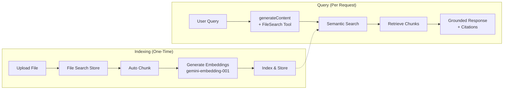

# Gemini File Search

## Introduction

Google's Gemini File Search tool provides a managed RAG solution built directly into the Gemini API. Upload your documents to a **File Search Store**, and Gemini automatically chunks them, generates embeddings using `gemini-embedding-001`, indexes them, and makes them searchable. When you include the `FileSearch` tool in a `generateContent` call, the model retrieves relevant chunks from your store and generates grounded responses with citations.

What sets Gemini File Search apart is its pricing model: **storage is free**, and **query-time embeddings are free**. You only pay for the initial embedding generation when files are indexed ($0.15 per 1M tokens) plus normal model input/output token costs. For applications with large document stores and infrequent updates, this makes Gemini File Search exceptionally cost-effective.

---

## Architecture Overview



Key distinction: The raw file uploaded via the Files API is **deleted after 48 hours**, but the chunked and embedded data in the File Search Store **persists indefinitely** until you manually delete it.

---

## Creating a File Search Store

A File Search Store is a container for your document embeddings. Store names are globally scoped.

### Basic Creation

```python
from google import genai

client = genai.Client()

# Create a File Search Store
file_search_store = client.file_search_stores.create(
    config={"display_name": "product-documentation"}
)

print(f"Store name: {file_search_store.name}")
print(f"Display name: {file_search_store.display_name}")
```

### Managing Stores

```python
# List all File Search Stores
for store in client.file_search_stores.list():
    print(f"  {store.display_name} → {store.name}")

# Get a specific store
my_store = client.file_search_stores.get(
    name="fileSearchStores/product-documentation"
)

# Delete a store (force=True removes all documents)
client.file_search_stores.delete(
    name="fileSearchStores/old-store",
    config={"force": True}
)
```

---

## Uploading Files

Gemini offers two upload methods: **direct upload** (file goes straight to the store) and **import** (upload to Files API first, then import into the store).

### Method 1: Direct Upload to Store

The simplest approach—upload and index in one step:

```python
from google import genai
import time

client = genai.Client()

# Create store first
file_search_store = client.file_search_stores.create(
    config={"display_name": "my-knowledge-base"}
)

# Upload directly to the store
operation = client.file_search_stores.upload_to_file_search_store(
    file="product_manual.pdf",
    file_search_store_name=file_search_store.name,
    config={
        "display_name": "Product Manual v3.2"
    }
)

# Poll until indexing completes
while not operation.done:
    time.sleep(5)
    operation = client.operations.get(operation)

print("File indexed successfully!")
```

### Method 2: Upload Then Import

Use this when you want to reuse the same file across multiple stores:

```python
from google import genai
import time

client = genai.Client()

# Step 1: Upload to Files API
sample_file = client.files.upload(
    file="research_paper.pdf",
    config={"name": "research_paper_2025"}
)

# Step 2: Import into File Search Store
operation = client.file_search_stores.import_file(
    file_search_store_name=file_search_store.name,
    file_name=sample_file.name
)

# Poll until complete
while not operation.done:
    time.sleep(5)
    operation = client.operations.get(operation)

print("Import complete!")
```

> **Important**: Files uploaded via the Files API are deleted after 48 hours. However, the data imported into the File Search Store persists indefinitely.

### Upload Method Comparison

| Method | Use Case | File Lifetime |
|--------|----------|---------------|
| **Direct upload** | One store, simple workflow | Store only (no temp file) |
| **Upload + Import** | Share across stores, add metadata | File: 48h, Store: indefinite |

---

## Chunking Configuration

Gemini automatically chunks uploaded files, but you can customize the strategy:

```python
from google import genai
import time

client = genai.Client()

# Upload with custom chunking
operation = client.file_search_stores.upload_to_file_search_store(
    file_search_store_name=file_search_store.name,
    file="technical_specification.pdf",
    config={
        "display_name": "Tech Spec",
        "chunking_config": {
            "white_space_config": {
                "max_tokens_per_chunk": 200,
                "max_overlap_tokens": 20
            }
        }
    }
)

while not operation.done:
    time.sleep(5)
    operation = client.operations.get(operation)

print("Custom chunking complete!")
```

### Chunking Parameters

| Parameter | Default | Range | Description |
|-----------|---------|-------|-------------|
| `max_tokens_per_chunk` | Auto | Varies | Maximum tokens in each chunk |
| `max_overlap_tokens` | Auto | Varies | Overlap between consecutive chunks |

**Chunking guidance:**
- **Smaller chunks (100–200 tokens)**: FAQ pages, glossaries, short factual content
- **Larger chunks (500–1000 tokens)**: Technical documentation, narrative content
- **More overlap**: When context flows between sections
- **Less overlap**: When sections are self-contained

---

## File Metadata and Filtering

Add custom metadata to files for targeted search:

### Setting Metadata

```python
# Import a file with custom metadata
operation = client.file_search_stores.import_file(
    file_search_store_name=file_search_store.name,
    file_name=sample_file.name,
    custom_metadata=[
        {"key": "author", "string_value": "Jane Smith"},
        {"key": "year", "numeric_value": 2025},
        {"key": "category", "string_value": "technical"},
        {"key": "version", "numeric_value": 3.2}
    ]
)
```

### Filtering by Metadata

Use metadata filters to search only a subset of documents:

```python
from google.genai import types

response = client.models.generate_content(
    model="gemini-3-flash-preview",
    contents="What are the new features in the latest version?",
    config=types.GenerateContentConfig(
        tools=[
            types.Tool(
                file_search=types.FileSearch(
                    file_search_store_names=[file_search_store.name],
                    metadata_filter="category=technical AND year>=2025"
                )
            )
        ]
    )
)

print(response.text)
```

The `metadata_filter` follows the [AIP-160 filter syntax](https://google.aip.dev/160):

| Filter | Example |
|--------|---------|
| Equality | `author="Jane Smith"` |
| Comparison | `year>=2024` |
| AND | `category=technical AND year>=2025` |
| OR | `category=blog OR category=docs` |

---

## Querying with File Search

### Basic Query

```python
from google import genai
from google.genai import types

client = genai.Client()

response = client.models.generate_content(
    model="gemini-3-flash-preview",
    contents="How do I configure the authentication module?",
    config=types.GenerateContentConfig(
        tools=[
            types.Tool(
                file_search=types.FileSearch(
                    file_search_store_names=[file_search_store.name]
                )
            )
        ]
    )
)

print(response.text)
```

### Searching Multiple Stores

You can search across multiple File Search Stores in a single query:

```python
response = client.models.generate_content(
    model="gemini-3-flash-preview",
    contents="Compare the pricing between our products",
    config=types.GenerateContentConfig(
        tools=[
            types.Tool(
                file_search=types.FileSearch(
                    file_search_store_names=[
                        store_products.name,
                        store_pricing.name
                    ]
                )
            )
        ]
    )
)
```

---

## Citations and Grounding Metadata

Gemini File Search provides structured citation data through `grounding_metadata`:

```python
# Access grounding metadata
response = client.models.generate_content(
    model="gemini-3-flash-preview",
    contents="What is the refund policy?",
    config=types.GenerateContentConfig(
        tools=[
            types.Tool(
                file_search=types.FileSearch(
                    file_search_store_names=[file_search_store.name]
                )
            )
        ]
    )
)

# Print the response text
print(response.text)

# Access citation details
grounding = response.candidates[0].grounding_metadata
if grounding:
    print("\n--- Citations ---")
    
    # Source chunks
    if grounding.grounding_chunks:
        for i, chunk in enumerate(grounding.grounding_chunks):
            print(f"Source {i + 1}: {chunk.web.title if chunk.web else 'File'}")
    
    # Text-to-source mappings
    if grounding.grounding_supports:
        for support in grounding.grounding_supports:
            text = support.segment.text
            sources = support.grounding_chunk_indices
            print(f"'{text[:60]}...' → Sources: {sources}")
```

### Citation Structure

```json
{
    "groundingMetadata": {
        "groundingChunks": [
            {
                "retrievedContext": {
                    "uri": "fileSearchStores/.../documents/...",
                    "title": "refund_policy.pdf"
                }
            }
        ],
        "groundingSupports": [
            {
                "segment": {
                    "startIndex": 0,
                    "endIndex": 85,
                    "text": "Our refund policy allows returns within 30 days..."
                },
                "groundingChunkIndices": [0]
            }
        ]
    }
}
```

---

## Combining with Structured Output

Starting with Gemini 3 models, you can use File Search with structured output for machine-readable responses:

```python
from pydantic import BaseModel, Field
from google.genai import types

class ProductInfo(BaseModel):
    name: str = Field(description="Product name")
    version: str = Field(description="Latest version")
    price: str = Field(description="Price information")
    features: list[str] = Field(description="Key features")

response = client.models.generate_content(
    model="gemini-3-flash-preview",
    contents="Get me the details about Widget Pro",
    config=types.GenerateContentConfig(
        tools=[
            types.Tool(
                file_search=types.FileSearch(
                    file_search_store_names=[file_search_store.name]
                )
            )
        ],
        response_mime_type="application/json",
        response_schema=ProductInfo.model_json_schema()
    )
)

product = ProductInfo.model_validate_json(response.text)
print(f"Product: {product.name} v{product.version}")
print(f"Price: {product.price}")
print(f"Features: {', '.join(product.features)}")
```

---

## Managing Documents

### List Documents in a Store

```python
for doc in client.file_search_stores.documents.list(
    parent=file_search_store.name
):
    print(f"  {doc.name} — {doc.display_name}")
```

### Get Document Details

```python
doc = client.file_search_stores.documents.get(
    name=f"{file_search_store.name}/documents/my_doc"
)
print(f"Display name: {doc.display_name}")
```

### Delete a Document

```python
client.file_search_stores.documents.delete(
    name=f"{file_search_store.name}/documents/old_doc"
)
```

---

## Supported Models and File Types

### Supported Models

| Model | File Search Support |
|-------|-------------------|
| gemini-3-pro-preview | ✅ |
| gemini-3-flash-preview | ✅ |
| gemini-2.5-pro | ✅ |
| gemini-2.5-flash-lite | ✅ |

### Supported File Types

| Category | Formats |
|----------|---------|
| **Documents** | PDF, DOCX, PPTX, XLSX |
| **Text** | TXT, MD, HTML, CSV, XML, JSON |
| **Code** | PY, JS, TS, JAVA, C, CPP, and more |

---

## Pricing

Gemini File Search has one of the most developer-friendly pricing models:

| Component | Cost |
|-----------|------|
| **Storage** | **Free** |
| **Embedding at indexing** | $0.15 per 1M tokens |
| **Embedding at query time** | **Free** |
| **Retrieved document tokens** | Regular context token pricing |
| **Model input/output** | Standard Gemini model pricing |

### Storage Limits by Tier

| Tier | Maximum File Search Store Size |
|------|-------------------------------|
| Free | 1 GB |
| Tier 1 | 10 GB |
| Tier 2 | 100 GB |
| Tier 3 | 1 TB |

> **Tip**: The storage limit is based on input data **plus** generated embeddings, which is typically ~3× the raw input size. A 10 GB raw dataset requires ~30 GB of storage capacity.

### Cost Comparison Example

| Scenario | OpenAI Vector Stores | Gemini File Search |
|----------|---------------------|--------------------|
| 5 GB docs, stored 30 days | ~$12.00/month | ~$0.75 one-time indexing |
| 20 GB docs, stored 30 days | ~$57.00/month | ~$3.00 one-time indexing |
| 50 GB docs, stored 90 days | ~$435.00 total | ~$7.50 one-time indexing |

*Gemini's free storage and free query-time embeddings make it significantly cheaper for large, long-lived knowledge bases.*

---

## Limitations

| Limitation | Details |
|-----------|---------|
| **Max file size** | 100 MB per document |
| **Store size recommendation** | Under 20 GB for optimal latency |
| **No Live API support** | File Search not available in Live API |
| **No tool combinations** | Cannot combine with Google Search grounding or URL Context |
| **No TTL** | Embeddings persist until manually deleted |
| **Globally scoped names** | Store names must be unique across all users |
| **Embedding model** | Fixed to `gemini-embedding-001` (not configurable) |

---

## Complete Example: Research Assistant

```python
from google import genai
from google.genai import types
import time
import os


def create_research_store(
    name: str,
    file_paths: list[str],
    chunking: dict | None = None
) -> str:
    """Create a File Search Store and upload research papers."""
    client = genai.Client()
    
    # Create the store
    store = client.file_search_stores.create(
        config={"display_name": name}
    )
    print(f"Created store: {store.name}")
    
    # Upload each file
    for path in file_paths:
        config = {"display_name": os.path.basename(path)}
        if chunking:
            config["chunking_config"] = chunking
        
        operation = client.file_search_stores.upload_to_file_search_store(
            file=path,
            file_search_store_name=store.name,
            config=config
        )
        
        while not operation.done:
            time.sleep(5)
            operation = client.operations.get(operation)
        
        print(f"  ✓ Indexed: {os.path.basename(path)}")
    
    return store.name


def research_query(
    store_name: str,
    question: str,
    model: str = "gemini-3-flash-preview"
) -> dict:
    """Query the research store and return answer with citations."""
    client = genai.Client()
    
    response = client.models.generate_content(
        model=model,
        contents=question,
        config=types.GenerateContentConfig(
            tools=[
                types.Tool(
                    file_search=types.FileSearch(
                        file_search_store_names=[store_name]
                    )
                )
            ]
        )
    )
    
    # Extract citations
    citations = []
    grounding = response.candidates[0].grounding_metadata
    if grounding and grounding.grounding_chunks:
        for chunk in grounding.grounding_chunks:
            if hasattr(chunk, "retrieved_context"):
                citations.append(chunk.retrieved_context.title)
    
    return {
        "answer": response.text,
        "citations": list(set(citations)),
        "model": model
    }


# Usage
store_name = create_research_store(
    name="ai-research-2025",
    file_paths=[
        "papers/attention_is_all_you_need.pdf",
        "papers/rag_survey_2025.pdf",
        "papers/scaling_laws.pdf"
    ],
    chunking={
        "white_space_config": {
            "max_tokens_per_chunk": 500,
            "max_overlap_tokens": 50
        }
    }
)

result = research_query(
    store_name=store_name,
    question="How do scaling laws affect model performance?"
)

print(f"Answer: {result['answer']}")
print(f"Sources: {', '.join(result['citations'])}")
```

---

## Summary

Gemini File Search stands out in the managed RAG landscape for three reasons:

- **Free storage**: No per-GB daily charges, embeddings persist indefinitely at no cost
- **Simple API**: Create store → upload files → query with `FileSearch` tool
- **Rich citations**: Structured `grounding_metadata` maps response text to source documents
- **Metadata filtering**: Custom key-value metadata with AIP-160 filter syntax
- **Structured output**: Combine File Search with JSON schemas for machine-readable responses
- **Configurable chunking**: Customize `max_tokens_per_chunk` and overlap per file

The main trade-off is ecosystem lock-in: File Search only works with Gemini models and cannot be combined with other Gemini tools like Google Search grounding. But for applications built on the Google AI ecosystem, it's the most cost-effective managed RAG solution available.
