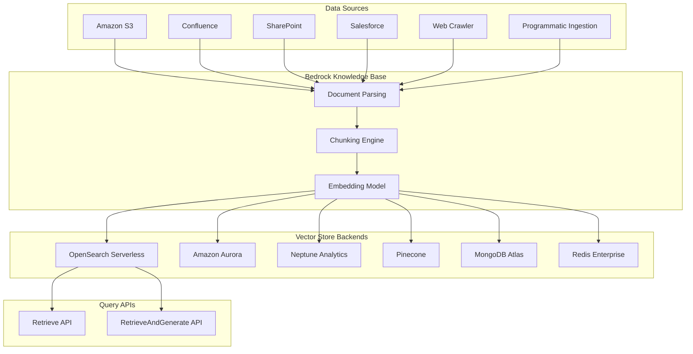
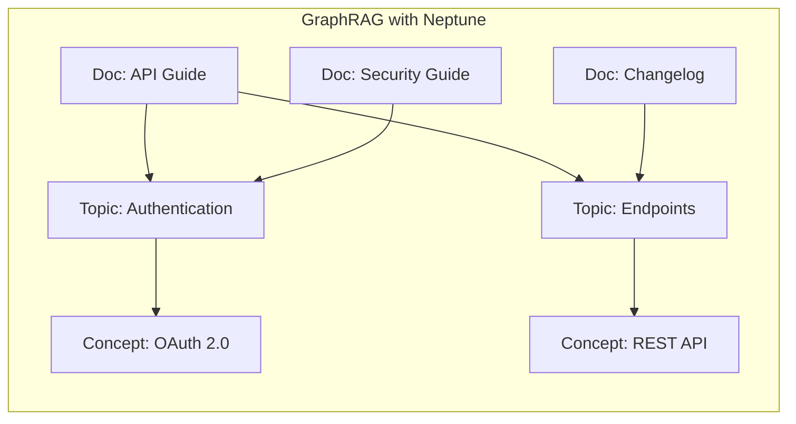

# AWS Bedrock Knowledge Bases

## Introduction

Amazon Bedrock Knowledge Bases is a fully managed RAG service that connects foundation models (FMs) to your enterprise data. Unlike the simpler upload-and-query APIs from OpenAI and Gemini, Bedrock Knowledge Bases provides an **enterprise-grade pipeline** with support for multiple data source connectors, multiple vector store backends, advanced chunking strategies, built-in reranking, and integration with Bedrock Agents.

The service handles the entire RAG workflow: ingestion from data sources like S3, automatic parsing and chunking, embedding generation, vector storage, retrieval, and prompt augmentation. It also supports **structured data** through natural language to SQL, and **multimodal data** including images, charts, and tables through Bedrock Data Automation.

---

## Architecture Overview



---

## Setting Up a Knowledge Base

### Step 1: Create the Knowledge Base (Console)

The easiest way to get started is through the AWS Console:

1. Navigate to **Amazon Bedrock** → **Knowledge Bases**
2. Click **Create knowledge base**
3. Configure:
   - **Name**: Descriptive name for your knowledge base
   - **IAM Role**: Service role with S3 and Bedrock permissions
   - **Embedding model**: Choose from available Bedrock embedding models
   - **Vector store**: Select or create a vector store backend

### Step 2: Configure with boto3 (SDK)

For programmatic setup, use the Bedrock Agent SDK:

```python
import boto3
import json

bedrock_agent = boto3.client("bedrock-agent", region_name="us-east-1")

# Create a knowledge base
response = bedrock_agent.create_knowledge_base(
    name="product-documentation",
    description="Product docs and support articles",
    roleArn="arn:aws:iam::123456789012:role/BedrockKBRole",
    knowledgeBaseConfiguration={
        "type": "VECTOR",
        "vectorKnowledgeBaseConfiguration": {
            "embeddingModelArn": (
                "arn:aws:bedrock:us-east-1::foundation-model/"
                "amazon.titan-embed-text-v2:0"
            )
        }
    },
    storageConfiguration={
        "type": "OPENSEARCH_SERVERLESS",
        "opensearchServerlessConfiguration": {
            "collectionArn": "arn:aws:aoss:us-east-1:123456789012:collection/abc123",
            "vectorIndexName": "product-docs-index",
            "fieldMapping": {
                "vectorField": "embedding",
                "textField": "text",
                "metadataField": "metadata"
            }
        }
    }
)

kb_id = response["knowledgeBase"]["knowledgeBaseId"]
print(f"Knowledge Base ID: {kb_id}")
```

---

## Data Sources

Bedrock Knowledge Bases supports multiple data source connectors that automatically sync and index your content.

### Amazon S3 (Most Common)

```python
# Add an S3 data source
response = bedrock_agent.create_data_source(
    knowledgeBaseId=kb_id,
    name="s3-product-docs",
    dataSourceConfiguration={
        "type": "S3",
        "s3Configuration": {
            "bucketArn": "arn:aws:s3:::my-docs-bucket",
            "inclusionPrefixes": ["docs/", "guides/"],  # Only index these folders
        }
    },
    vectorIngestionConfiguration={
        "chunkingConfiguration": {
            "chunkingStrategy": "FIXED_SIZE",
            "fixedSizeChunkingConfiguration": {
                "maxTokens": 512,
                "overlapPercentage": 20
            }
        }
    }
)

data_source_id = response["dataSource"]["dataSourceId"]
print(f"Data Source ID: {data_source_id}")
```

### Starting an Ingestion Job

After adding a data source, trigger ingestion to process and index the documents:

```python
# Start ingestion (sync data source)
response = bedrock_agent.start_ingestion_job(
    knowledgeBaseId=kb_id,
    dataSourceId=data_source_id
)

job_id = response["ingestionJob"]["ingestionJobId"]
print(f"Ingestion job started: {job_id}")

# Poll for completion
import time

while True:
    job = bedrock_agent.get_ingestion_job(
        knowledgeBaseId=kb_id,
        dataSourceId=data_source_id,
        ingestionJobId=job_id
    )
    status = job["ingestionJob"]["status"]
    print(f"Status: {status}")
    
    if status in ["COMPLETE", "FAILED"]:
        break
    time.sleep(10)

# Check statistics
stats = job["ingestionJob"]["statistics"]
print(f"Documents scanned: {stats['numberOfDocumentsScanned']}")
print(f"Documents indexed: {stats['numberOfNewDocumentsIndexed']}")
print(f"Documents failed: {stats['numberOfDocumentsFailed']}")
```

### Supported Data Source Connectors

| Connector | Description | Auto-Sync |
|-----------|-------------|-----------|
| **Amazon S3** | Files in S3 buckets with prefix filtering | ✅ On-demand or scheduled |
| **Confluence** | Confluence spaces and pages | ✅ Automatic |
| **SharePoint** | SharePoint sites and document libraries | ✅ Automatic |
| **Salesforce** | Salesforce knowledge articles and objects | ✅ Automatic |
| **Web Crawler** | Crawl and index web pages (preview) | ✅ On-demand |
| **Programmatic** | Push documents via API for streaming/custom sources | Manual |

---

## Chunking Strategies

Bedrock offers the most flexible chunking options of any managed RAG service:

### Fixed-Size Chunking

Split documents into equal-sized chunks with configurable overlap:

```python
chunking_config = {
    "chunkingStrategy": "FIXED_SIZE",
    "fixedSizeChunkingConfiguration": {
        "maxTokens": 512,        # 100-8192 tokens
        "overlapPercentage": 20   # 0-99%
    }
}
```

### Semantic Chunking

Group text by semantic similarity—keeps related content together:

```python
chunking_config = {
    "chunkingStrategy": "SEMANTIC",
    "semanticChunkingConfiguration": {
        "maxTokens": 512,
        "bufferSize": 0,           # Sentences before/after for context
        "breakpointPercentileThreshold": 95  # Higher = fewer breaks
    }
}
```

### Hierarchical Chunking

Create parent-child chunk relationships for multi-level retrieval:

```python
chunking_config = {
    "chunkingStrategy": "HIERARCHICAL",
    "hierarchicalChunkingConfiguration": {
        "levelConfigurations": [
            {"maxTokens": 1500},   # Parent chunks (more context)
            {"maxTokens": 300}     # Child chunks (precise matching)
        ],
        "overlapTokens": 60
    }
}
```

### No Chunking

Use documents as-is (each document is one chunk):

```python
chunking_config = {
    "chunkingStrategy": "NONE"
}
```

### Custom Chunking (Lambda)

Write your own chunking logic with an AWS Lambda function:

```python
chunking_config = {
    "chunkingStrategy": "CUSTOM_TRANSFORMATION",
    "customTransformationConfiguration": {
        "transformations": [
            {
                "transformationFunction": {
                    "transformationLambdaConfiguration": {
                        "lambdaArn": "arn:aws:lambda:us-east-1:123456789012:function:my-chunker"
                    }
                }
            }
        ],
        "intermediateStorage": {
            "s3Location": {
                "uri": "s3://my-bucket/chunking-intermediate/"
            }
        }
    }
}
```

### Chunking Strategy Comparison

| Strategy | Best For | Pros | Cons |
|----------|---------|------|------|
| **Fixed-size** | General purpose | Predictable, simple | May split context |
| **Semantic** | Technical docs | Preserves meaning | Slower processing |
| **Hierarchical** | Complex documents | Multi-level retrieval | Higher storage |
| **None** | Short documents | Zero processing | Poor for long docs |
| **Custom Lambda** | Special formats | Full control | Requires code |

---

## Vector Store Backends

Bedrock Knowledge Bases supports multiple vector store options:

| Backend | Type | Best For | Key Feature |
|---------|------|----------|-------------|
| **OpenSearch Serverless** | Managed | Default choice, most features | Serverless scaling |
| **Amazon Aurora** | Managed DB | Existing Aurora users | SQL + vector in one DB |
| **Neptune Analytics** | Graph DB | Knowledge graphs, relationships | GraphRAG support |
| **Pinecone** | Third-party | Existing Pinecone users | Best vector performance |
| **MongoDB Atlas** | Third-party | Existing MongoDB users | Document + vector |
| **Redis Enterprise Cloud** | Third-party | Low-latency requirements | Fastest queries |

### Neptune Analytics and GraphRAG

When using Neptune Analytics as the backend, Bedrock automatically creates **knowledge graphs** linking related content:



GraphRAG improves retrieval for questions that span multiple documents by following relationship links between content.

---

## Querying: Retrieve API

The Retrieve API returns relevant document chunks without generating a response:

```python
bedrock_runtime = boto3.client(
    "bedrock-agent-runtime",
    region_name="us-east-1"
)

# Retrieve relevant chunks
response = bedrock_runtime.retrieve(
    knowledgeBaseId=kb_id,
    retrievalQuery={
        "text": "How do I configure authentication?"
    },
    retrievalConfiguration={
        "vectorSearchConfiguration": {
            "numberOfResults": 10  # 1-100
        }
    }
)

# Process results
for result in response["retrievalResults"]:
    print(f"Score: {result['score']:.3f}")
    print(f"Text: {result['content']['text'][:200]}...")
    
    # Source attribution
    location = result["location"]
    if location["type"] == "S3":
        print(f"Source: {location['s3Location']['uri']}")
    print("---")
```

### Retrieve API with Metadata Filtering

```python
response = bedrock_runtime.retrieve(
    knowledgeBaseId=kb_id,
    retrievalQuery={
        "text": "deployment best practices"
    },
    retrievalConfiguration={
        "vectorSearchConfiguration": {
            "numberOfResults": 10,
            "filter": {
                "andAll": [
                    {
                        "equals": {
                            "key": "category",
                            "value": "devops"
                        }
                    },
                    {
                        "greaterThan": {
                            "key": "year",
                            "value": 2024
                        }
                    }
                ]
            }
        }
    }
)
```

### Available Filter Operators

| Operator | Description |
|----------|-------------|
| `equals` | Exact match |
| `notEquals` | Not equal |
| `greaterThan` / `greaterThanOrEquals` | Numeric comparison |
| `lessThan` / `lessThanOrEquals` | Numeric comparison |
| `in` / `notIn` | Value in list |
| `startsWith` | String prefix match |
| `listContains` | List contains value |
| `stringContains` | Substring match |
| `andAll` / `orAll` | Compound filters |

---

## Querying: RetrieveAndGenerate API

The RetrieveAndGenerate API handles the full RAG pipeline—retrieval plus LLM response generation:

```python
# Full RAG pipeline in one call
response = bedrock_runtime.retrieve_and_generate(
    input={
        "text": "What are the best practices for API authentication?"
    },
    retrieveAndGenerateConfiguration={
        "type": "KNOWLEDGE_BASE",
        "knowledgeBaseConfiguration": {
            "knowledgeBaseId": kb_id,
            "modelArn": (
                "arn:aws:bedrock:us-east-1::foundation-model/"
                "anthropic.claude-sonnet-4-20250514"
            ),
            "retrievalConfiguration": {
                "vectorSearchConfiguration": {
                    "numberOfResults": 5
                }
            }
        }
    }
)

# The response includes generated text and citations
print("Answer:", response["output"]["text"])

# Source citations
for citation in response["citations"]:
    for ref in citation["retrievedReferences"]:
        location = ref["location"]
        if location["type"] == "S3":
            print(f"  Source: {location['s3Location']['uri']}")
```

### With Session Context

Bedrock Knowledge Bases supports multi-turn conversations with built-in session management:

```python
# First turn
response = bedrock_runtime.retrieve_and_generate(
    input={"text": "What authentication methods are supported?"},
    retrieveAndGenerateConfiguration={
        "type": "KNOWLEDGE_BASE",
        "knowledgeBaseConfiguration": {
            "knowledgeBaseId": kb_id,
            "modelArn": model_arn
        }
    }
)

session_id = response["sessionId"]

# Follow-up turn (uses session context)
response = bedrock_runtime.retrieve_and_generate(
    input={"text": "Which one is most secure?"},
    sessionId=session_id,  # Continues the conversation
    retrieveAndGenerateConfiguration={
        "type": "KNOWLEDGE_BASE",
        "knowledgeBaseConfiguration": {
            "knowledgeBaseId": kb_id,
            "modelArn": model_arn
        }
    }
)

print(response["output"]["text"])
```

---

## Document-Level RAG (Single Document)

For quick Q&A over a single document without setting up a vector store:

```python
# Ask questions about a single document
response = bedrock_runtime.retrieve_and_generate(
    input={"text": "Summarize the key findings"},
    retrieveAndGenerateConfiguration={
        "type": "EXTERNAL_SOURCES",
        "externalSourcesConfiguration": {
            "modelArn": model_arn,
            "sources": [
                {
                    "sourceType": "S3",
                    "s3Location": {
                        "uri": "s3://my-bucket/reports/q1_report.pdf"
                    }
                }
            ]
        }
    }
)

print(response["output"]["text"])
```

This is useful for ad-hoc analysis without the overhead of creating a full knowledge base.

---

## Built-in Reranking

Bedrock Knowledge Bases includes reranker models to improve retrieval relevance:

```python
response = bedrock_runtime.retrieve(
    knowledgeBaseId=kb_id,
    retrievalQuery={"text": "error handling best practices"},
    retrievalConfiguration={
        "vectorSearchConfiguration": {
            "numberOfResults": 20,  # Retrieve more initially
            "rerankingConfiguration": {
                "type": "BEDROCK_RERANKING_MODEL",
                "bedrockRerankingModelConfiguration": {
                    "modelArn": (
                        "arn:aws:bedrock:us-east-1::foundation-model/"
                        "amazon.rerank-v1:0"
                    ),
                    "numberOfRerankedResults": 5  # Return top 5 after reranking
                }
            }
        }
    }
)
```

The reranker retrieves a larger set of candidates, then re-scores them for better precision—similar to the two-stage retrieval pattern covered in Lesson 11.

---

## Multimodal Support

Bedrock Knowledge Bases can process and retrieve multimodal content:

- **Images and diagrams** embedded in documents
- **Tables and charts** with complex layouts
- **Visually rich PDFs** with mixed content

Configure a parser for multimodal documents:

```python
data_source_config = {
    "type": "S3",
    "s3Configuration": {
        "bucketArn": "arn:aws:s3:::my-docs-bucket"
    }
}

# Use Bedrock Data Automation for multimodal parsing
parsing_config = {
    "parsingStrategy": "BEDROCK_DATA_AUTOMATION",
    "bedrockDataAutomationConfiguration": {
        "parsingModality": "MULTIMODAL"
    }
}
```

---

## Pricing

Bedrock Knowledge Bases pricing has multiple components:

| Component | Cost |
|-----------|------|
| **Embedding generation** | Per model pricing (e.g., Titan Embed v2) |
| **Vector store** | Backend-specific (OpenSearch Serverless, Pinecone, etc.) |
| **Retrieve API** | $0.005 per 1,000 retrievals |
| **RetrieveAndGenerate** | Retrieval cost + FM inference cost |
| **Reranking** | Additional per-query cost |
| **Data source sync** | Included (no additional charge) |

### Cost Optimization Tips

1. **Choose the right vector store**: OpenSearch Serverless has minimum costs (~$700/month for 2 OCU). For smaller workloads, consider Pinecone's free tier or Aurora
2. **Optimize chunk size**: Larger chunks = fewer vectors = lower storage cost
3. **Use metadata filters**: Reduce the search space to lower retrieval latency and cost
4. **Schedule syncs**: Don't sync more often than your data changes
5. **Use the Retrieve API**: Skip LLM costs when you only need chunks

---

## Limitations and Considerations

| Limitation | Details |
|-----------|---------|
| **Region availability** | Available in select AWS regions |
| **Supported file types** | PDF, TXT, MD, HTML, DOCX, CSV, XLS, XLSX |
| **Max file size** | 50 MB per file |
| **Max documents** | 100,000 per data source |
| **Vector store requirement** | Must provision a vector store separately (except for single-doc RAG) |
| **Minimum cost** | OpenSearch Serverless has ~$700/month minimum |
| **Sync latency** | Minutes to hours depending on data volume |
| **Embedding models** | Limited to Bedrock-supported models |

---

## Complete Example: Enterprise Knowledge Base

```python
import boto3
import time

bedrock_agent = boto3.client("bedrock-agent", region_name="us-east-1")
bedrock_runtime = boto3.client("bedrock-agent-runtime", region_name="us-east-1")


def create_enterprise_kb(
    name: str,
    bucket_arn: str,
    prefixes: list[str],
    role_arn: str,
    collection_arn: str,
    index_name: str
) -> tuple[str, str]:
    """Create a knowledge base with S3 data source."""
    
    # Create knowledge base
    kb_response = bedrock_agent.create_knowledge_base(
        name=name,
        description=f"Enterprise KB: {name}",
        roleArn=role_arn,
        knowledgeBaseConfiguration={
            "type": "VECTOR",
            "vectorKnowledgeBaseConfiguration": {
                "embeddingModelArn": (
                    "arn:aws:bedrock:us-east-1::foundation-model/"
                    "amazon.titan-embed-text-v2:0"
                )
            }
        },
        storageConfiguration={
            "type": "OPENSEARCH_SERVERLESS",
            "opensearchServerlessConfiguration": {
                "collectionArn": collection_arn,
                "vectorIndexName": index_name,
                "fieldMapping": {
                    "vectorField": "embedding",
                    "textField": "text",
                    "metadataField": "metadata"
                }
            }
        }
    )
    
    kb_id = kb_response["knowledgeBase"]["knowledgeBaseId"]
    print(f"✓ Created KB: {kb_id}")
    
    # Add S3 data source with semantic chunking
    ds_response = bedrock_agent.create_data_source(
        knowledgeBaseId=kb_id,
        name=f"{name}-s3-source",
        dataSourceConfiguration={
            "type": "S3",
            "s3Configuration": {
                "bucketArn": bucket_arn,
                "inclusionPrefixes": prefixes
            }
        },
        vectorIngestionConfiguration={
            "chunkingConfiguration": {
                "chunkingStrategy": "SEMANTIC",
                "semanticChunkingConfiguration": {
                    "maxTokens": 512,
                    "bufferSize": 0,
                    "breakpointPercentileThreshold": 95
                }
            }
        }
    )
    
    ds_id = ds_response["dataSource"]["dataSourceId"]
    print(f"✓ Created data source: {ds_id}")
    
    return kb_id, ds_id


def sync_and_wait(kb_id: str, ds_id: str) -> dict:
    """Trigger sync and wait for completion."""
    response = bedrock_agent.start_ingestion_job(
        knowledgeBaseId=kb_id,
        dataSourceId=ds_id
    )
    
    job_id = response["ingestionJob"]["ingestionJobId"]
    print(f"Syncing... (job: {job_id})")
    
    while True:
        job = bedrock_agent.get_ingestion_job(
            knowledgeBaseId=kb_id,
            dataSourceId=ds_id,
            ingestionJobId=job_id
        )
        status = job["ingestionJob"]["status"]
        
        if status == "COMPLETE":
            stats = job["ingestionJob"]["statistics"]
            print(f"✓ Sync complete: {stats['numberOfNewDocumentsIndexed']} docs indexed")
            return stats
        elif status == "FAILED":
            raise RuntimeError(f"Sync failed: {job['ingestionJob']}")
        
        time.sleep(15)


def query_kb(
    kb_id: str,
    question: str,
    model_id: str = "anthropic.claude-sonnet-4-20250514",
    num_results: int = 5,
    session_id: str | None = None
) -> dict:
    """Query the knowledge base with RAG."""
    config = {
        "type": "KNOWLEDGE_BASE",
        "knowledgeBaseConfiguration": {
            "knowledgeBaseId": kb_id,
            "modelArn": f"arn:aws:bedrock:us-east-1::foundation-model/{model_id}",
            "retrievalConfiguration": {
                "vectorSearchConfiguration": {
                    "numberOfResults": num_results
                }
            }
        }
    }
    
    kwargs = {
        "input": {"text": question},
        "retrieveAndGenerateConfiguration": config
    }
    
    if session_id:
        kwargs["sessionId"] = session_id
    
    response = bedrock_runtime.retrieve_and_generate(**kwargs)
    
    # Extract sources
    sources = []
    for citation in response.get("citations", []):
        for ref in citation.get("retrievedReferences", []):
            loc = ref.get("location", {})
            if loc.get("type") == "S3":
                sources.append(loc["s3Location"]["uri"])
    
    return {
        "answer": response["output"]["text"],
        "sources": list(set(sources)),
        "session_id": response.get("sessionId")
    }


# Usage
kb_id, ds_id = create_enterprise_kb(
    name="product-docs",
    bucket_arn="arn:aws:s3:::my-company-docs",
    prefixes=["products/", "guides/"],
    role_arn="arn:aws:iam::123456789012:role/BedrockKBRole",
    collection_arn="arn:aws:aoss:us-east-1:123456789012:collection/abc",
    index_name="product-docs-idx"
)

# Sync data
sync_and_wait(kb_id, ds_id)

# Query
result = query_kb(kb_id, "How do I set up single sign-on?")
print(f"Answer: {result['answer']}")
print(f"Sources: {result['sources']}")
```

---

## Summary

AWS Bedrock Knowledge Bases is the most feature-rich managed RAG service:

- **Multiple data sources**: S3, Confluence, SharePoint, Salesforce, Web Crawler, and programmatic ingestion
- **5 chunking strategies**: Fixed, semantic, hierarchical, none, and custom Lambda
- **6 vector store backends**: OpenSearch Serverless, Aurora, Neptune, Pinecone, MongoDB Atlas, Redis
- **Two query APIs**: Retrieve (chunks only) and RetrieveAndGenerate (full RAG)
- **Built-in reranking**: Amazon Rerank model for improved precision
- **Session management**: Multi-turn conversations with automatic context
- **GraphRAG**: Knowledge graph relationships through Neptune Analytics
- **Multimodal**: Process images, tables, and charts in documents

The trade-off is complexity and cost. Bedrock Knowledge Bases requires more setup than OpenAI or Gemini—you need to provision a vector store, configure IAM roles, and manage data source syncs. OpenSearch Serverless alone starts at ~$700/month. But for enterprise workloads that need multiple data connectors, fine-grained chunking control, and integration with the broader AWS ecosystem, it's the most complete solution.
