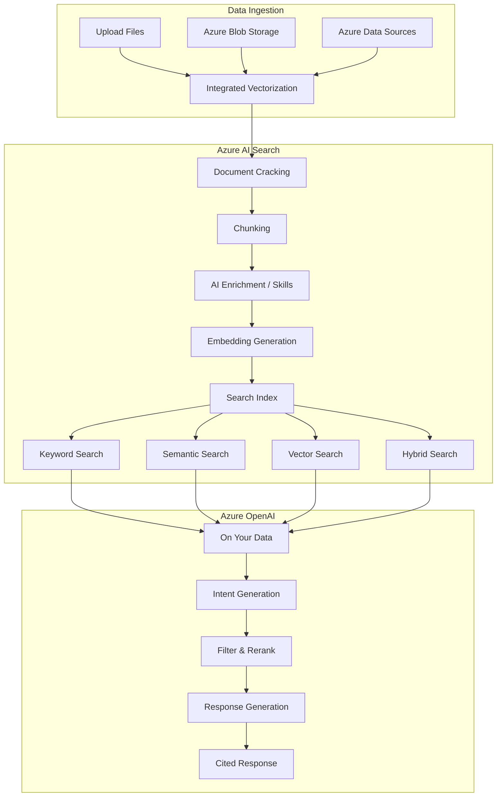
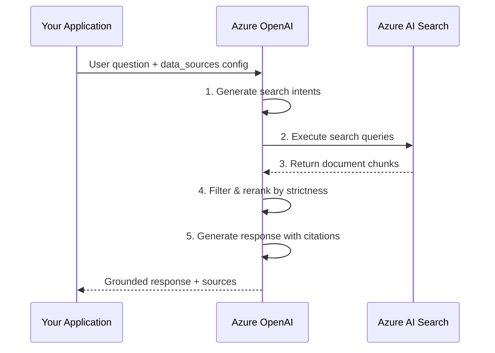
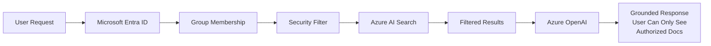

# Azure AI Search + OpenAI

## Introduction

Azure AI Search (formerly Azure Cognitive Search) is Microsoft's enterprise search platform that combines full-text search, vector search, semantic ranking, and hybrid search in a single service. When paired with Azure OpenAI through the **"On Your Data"** feature, it becomes a fully managed RAG solution that handles ingestion, chunking, embedding, retrieval, and response generation.

What makes Azure AI Search unique is its **depth of search capabilities**. While other managed RAG services offer basic semantic search, Azure AI Search provides five search modes (keyword, semantic, vector, hybrid, and hybrid + semantic), built-in semantic reranking, document-level access control with Microsoft Entra ID, and integration across the Microsoft ecosystem—from SharePoint to Copilot Studio.

---

## Architecture Overview



---

## Search Types

Azure AI Search offers five search modes, each building on the previous:

### 1. Keyword Search

Traditional full-text search using BM25 scoring:

```json
{
    "search": "authentication configuration",
    "searchMode": "all",
    "queryType": "full"
}
```

- **How it works**: Tokenizes query and documents, matches terms using inverted indexes
- **Best for**: Exact term matching, known terminology
- **Cost**: No additional pricing

### 2. Semantic Search

Uses AI models to understand query meaning and rerank results:

```json
{
    "search": "how do I set up login for my app",
    "queryType": "semantic",
    "semanticConfiguration": "my-semantic-config"
}
```

- **How it works**: After initial BM25 retrieval, a reranker model re-scores results based on semantic understanding
- **Best for**: Natural language queries, questions
- **Cost**: Additional pricing for semantic search usage

### 3. Vector Search

Similarity search using embeddings:

```json
{
    "vectorQueries": [{
        "kind": "text",
        "text": "authentication best practices",
        "fields": "contentVector",
        "k": 10
    }]
}
```

- **How it works**: Converts query to embedding, finds nearest vectors in the index
- **Best for**: Conceptual similarity, cross-lingual search
- **Cost**: Embedding model costs (text-embedding-ada-002 or newer)

### 4. Hybrid Search (Vector + Keyword)

Combines BM25 and vector search using Reciprocal Rank Fusion:

```json
{
    "search": "authentication setup guide",
    "vectorQueries": [{
        "kind": "text",
        "text": "authentication setup guide",
        "fields": "contentVector",
        "k": 10
    }]
}
```

- **How it works**: Runs both keyword and vector search, merges results using RRF
- **Best for**: Best general-purpose retrieval quality
- **Cost**: Embedding model costs

### 5. Hybrid + Semantic (Recommended)

The full stack: keyword + vector + semantic reranking:

- **How it works**: Hybrid retrieval followed by semantic reranking for maximum precision
- **Best for**: Production RAG applications
- **Cost**: Embedding model + semantic search pricing

### Search Type Comparison

| Search Type | Precision | Recall | Latency | Cost |
|------------|-----------|--------|---------|------|
| Keyword | Medium | Medium | Lowest | Free |
| Semantic | High | Medium | Low | + Semantic pricing |
| Vector | Medium-High | High | Medium | + Embedding model |
| Hybrid | High | Highest | Medium | + Embedding model |
| Hybrid + Semantic | Highest | Highest | Medium | + Both |

---

## Azure OpenAI On Your Data

The "On Your Data" feature connects Azure OpenAI models to Azure AI Search for managed RAG:

### Basic Setup with Python SDK

```python
from openai import AzureOpenAI

client = AzureOpenAI(
    azure_endpoint="https://my-openai.openai.azure.com/",
    api_key="your-api-key",
    api_version="2024-10-21"
)

response = client.chat.completions.create(
    model="gpt-4o",  # Your deployed model name
    messages=[
        {"role": "system", "content": "You are a helpful assistant."},
        {"role": "user", "content": "How do I configure authentication?"}
    ],
    extra_body={
        "data_sources": [
            {
                "type": "azure_search",
                "parameters": {
                    "endpoint": "https://my-search.search.windows.net",
                    "index_name": "product-docs-index",
                    "authentication": {
                        "type": "api_key",
                        "key": "your-search-api-key"
                    },
                    "query_type": "vector_semantic_hybrid",
                    "embedding_dependency": {
                        "type": "deployment_name",
                        "deployment_name": "text-embedding-ada-002"
                    },
                    "semantic_configuration": "my-semantic-config"
                }
            }
        ]
    }
)

# Response includes grounded answer
print(response.choices[0].message.content)

# Access citations
context = response.choices[0].message.context
if context:
    for citation in context.get("citations", []):
        print(f"Source: {citation['filepath']}")
        print(f"Content: {citation['content'][:100]}...")
```

### The RAG Pipeline Under the Hood

When you use On Your Data, Azure OpenAI executes a multi-step pipeline:



1. **Intent generation**: The model analyzes the user's query and generates one or more search queries
2. **Retrieval**: Search queries are sent to Azure AI Search
3. **Filtering**: Results are filtered by strictness threshold
4. **Reranking**: Remaining results are reranked by relevance
5. **Generation**: Retrieved chunks + user question → grounded response with citations

---

## Data Ingestion

### Upload Files via Foundry Portal

The simplest approach: upload files through the Microsoft Foundry portal (formerly Azure AI Studio):

1. Go to **Foundry portal** → **Chat playground**
2. Click **Add your data**
3. Select data source type
4. Upload files or connect to existing data
5. Configure chunking and indexing

### Programmatic Ingestion

Use the Azure AI Search SDK for programmatic control:

```python
from azure.search.documents.indexes import SearchIndexClient
from azure.search.documents.indexes.models import (
    SearchIndex,
    SimpleField,
    SearchableField,
    SearchFieldDataType,
    VectorSearch,
    HnswAlgorithmConfiguration,
    VectorSearchProfile,
    SearchField
)
from azure.core.credentials import AzureKeyCredential

# Create search index with vector fields
index_client = SearchIndexClient(
    endpoint="https://my-search.search.windows.net",
    credential=AzureKeyCredential("your-search-admin-key")
)

# Define the index schema
index = SearchIndex(
    name="product-docs",
    fields=[
        SimpleField(
            name="id",
            type=SearchFieldDataType.String,
            key=True
        ),
        SearchableField(
            name="content",
            type=SearchFieldDataType.String
        ),
        SimpleField(
            name="title",
            type=SearchFieldDataType.String,
            filterable=True
        ),
        SimpleField(
            name="category",
            type=SearchFieldDataType.String,
            filterable=True,
            facetable=True
        ),
        SearchField(
            name="contentVector",
            type=SearchFieldDataType.Collection(
                SearchFieldDataType.Single
            ),
            searchable=True,
            vector_search_dimensions=1536,
            vector_search_profile_name="my-vector-profile"
        )
    ],
    vector_search=VectorSearch(
        algorithms=[
            HnswAlgorithmConfiguration(name="my-hnsw")
        ],
        profiles=[
            VectorSearchProfile(
                name="my-vector-profile",
                algorithm_configuration_name="my-hnsw"
            )
        ]
    )
)

index_client.create_or_update_index(index)
print("Index created!")
```

### Integrated Vectorization

As of September 2024, Azure AI Search uses **integrated vectorization** for ingestion. This automatically handles chunking and embedding using built-in skills:

```python
from azure.search.documents.indexes.models import (
    SearchIndexer,
    SearchIndexerDataSourceConnection,
    SearchIndexerSkillset
)

# The ingestion pipeline creates:
# 1. {job-id}-index       - The search index
# 2. {job-id}-indexer     - The indexer (if scheduled)
# 3. {job-id}-datasource  - The data source connection
```

---

## Runtime Parameters

Fine-tune retrieval behavior without re-indexing:

### Strictness

Controls how aggressively results are filtered by similarity score:

| Strictness | Behavior | Use Case |
|-----------|----------|----------|
| **1** (Lowest) | Minimal filtering, more documents included | Broad exploratory queries |
| **3** (Default) | Balanced filtering | General purpose |
| **5** (Highest) | Aggressive filtering, only highly relevant docs | Precision-critical applications |

### Retrieved Documents (topNDocuments)

Controls how many document chunks are sent to the LLM:

| Value | Token Impact | Quality Impact |
|-------|-------------|----------------|
| **3** | Lower token usage | May miss relevant context |
| **5** (Default) | Balanced | Good for most use cases |
| **10** | Higher token usage | Better for complex questions |
| **20** | Highest token usage | When documents are highly fragmented |

### Limit Responses to Your Data (inScope)

| Setting | Behavior |
|---------|----------|
| `true` (Default) | Model only answers from retrieved documents |
| `false` | Model can supplement with its own knowledge |

```python
response = client.chat.completions.create(
    model="gpt-4o",
    messages=[{"role": "user", "content": "What is our SLA?"}],
    extra_body={
        "data_sources": [{
            "type": "azure_search",
            "parameters": {
                "endpoint": search_endpoint,
                "index_name": "docs-index",
                "authentication": {"type": "api_key", "key": search_key},
                "query_type": "vector_semantic_hybrid",
                "strictness": 4,           # Higher precision
                "top_n_documents": 8,      # More context
                "in_scope": True,          # Only use retrieved docs
                "embedding_dependency": {
                    "type": "deployment_name",
                    "deployment_name": "text-embedding-ada-002"
                },
                "semantic_configuration": "my-semantic-config"
            }
        }]
    }
)
```

---

## Chunk Size Configuration

Azure AI Search uses a default chunk size of **1,024 tokens**. Available options:

| Chunk Size | Best For |
|-----------|----------|
| **256 tokens** | FAQ, short facts, granular answers |
| **512 tokens** | Balanced for most content |
| **1,024 tokens** (Default) | General purpose |
| **1,536 tokens** | Contextual documents, narratives |

**Tuning guidance:**
- Getting too many "I don't know" responses? → Try **256 or 512** (more granular)
- Answers missing context? → Try **1,536** (more context per chunk)
- Runtime parameters (strictness, topN) should be adjusted **before** changing chunk size, since re-chunking requires re-ingestion

---

## Document-Level Access Control

Azure AI Search supports restricting document access based on Microsoft Entra ID (Azure AD) group membership:



When enabled:
1. User's Entra ID groups are resolved at query time
2. A security filter is automatically applied to the search
3. Only documents the user is authorized to see are retrieved
4. The LLM only generates responses from authorized content

This is critical for enterprise deployments where different teams should only access their own documents.

---

## Deployment Options

Azure OpenAI On Your Data supports multiple deployment targets:

| Target | Description |
|--------|-------------|
| **Web App** | Deploy a chat interface as an Azure Web App |
| **Copilot Studio** | Create a copilot for Teams, websites, Dynamics 365 |
| **Teams App** | Deploy directly as a Microsoft Teams app |
| **REST API** | Integrate into any custom application |
| **SDK** | Python, JavaScript, .NET, Java SDKs |

### Streaming Responses

Enable streaming for better perceived performance:

```python
response = client.chat.completions.create(
    model="gpt-4o",
    messages=[{"role": "user", "content": "Explain our pricing tiers"}],
    stream=True,
    extra_body={
        "data_sources": [{
            "type": "azure_search",
            "parameters": {
                "endpoint": search_endpoint,
                "index_name": "docs-index",
                "authentication": {"type": "api_key", "key": search_key},
                "query_type": "semantic",
                "semantic_configuration": "my-semantic-config"
            }
        }]
    }
)

for chunk in response:
    if chunk.choices and chunk.choices[0].delta.content:
        print(chunk.choices[0].delta.content, end="", flush=True)
```

---

## Agentic Retrieval (Preview)

Azure AI Search now offers **agentic retrieval**—a multi-query pipeline designed for agent-to-agent workflows:

| Feature | Classic Search | Agentic Retrieval |
|---------|---------------|-------------------|
| **Search target** | Single index | Knowledge base (multiple sources) |
| **Query plan** | No plan, direct request | LLM-assisted query planning |
| **Response** | Flat search results | LLM-formulated answer + references |
| **Best for** | App search, simple RAG | Complex agent workflows |

Agentic retrieval decomposes complex questions into sub-queries, retrieves from multiple knowledge sources in parallel, and synthesizes a comprehensive answer.

---

## Pricing

Azure AI Search pricing is tier-based:

| SKU | Monthly Cost | Storage | Partitions | Features |
|-----|-------------|---------|-----------|----------|
| **Free** | $0 | 50 MB | 1 | Basic features only |
| **Basic** | ~$75 | 2 GB per partition | 3 max | Semantic search enabled |
| **Standard S1** | ~$250 | 25 GB per partition | 12 max | Full features |
| **Standard S2** | ~$1,000 | 100 GB per partition | 12 max | Higher limits |
| **Standard S3** | ~$2,000 | 200 GB per partition | 12 max | Highest capacity |

Additional costs:
- **Semantic search**: Additional per-query pricing
- **Azure OpenAI**: Model inference costs (per token)
- **Embedding model**: text-embedding-ada-002 or similar (per token)

---

## Supported File Types

| Format | Extension |
|--------|-----------|
| Plain text | `.txt` |
| Markdown | `.md` |
| HTML | `.html` |
| Word | `.docx` |
| PowerPoint | `.pptx` |
| PDF | `.pdf` |

> **Tip**: For documents with complex formatting (tables, columns, bullet points), use the [data preparation script](https://github.com/microsoft/sample-app-aoai-chatGPT/tree/main/scripts) to optimize extraction quality.

---

## Limitations

| Limitation | Details |
|-----------|---------|
| **Supported models** | GPT-35-Turbo, GPT-4, GPT-4o, GPT-4o-mini (no o1/o3/GPT-5) |
| **Embedding model** | Only `text-embedding-ada-002` for On Your Data vector search |
| **Region restrictions** | Available in select Azure regions |
| **Max system message** | 400–4,000 tokens depending on model |
| **Function calling conflict** | `data_sources` and `tools` cannot be used simultaneously |
| **SKU requirement** | Basic or higher required for semantic/vector search |
| **6 file types** | Fewer supported formats than other providers |

---

## Summary

Azure AI Search + OpenAI is the most enterprise-ready managed RAG solution:

- **5 search modes**: Keyword, semantic, vector, hybrid, and hybrid + semantic
- **Built-in semantic reranking**: AI-powered relevance improvement beyond basic similarity
- **Document-level access control**: Microsoft Entra ID integration for per-user document filtering
- **Multiple deployment targets**: Web apps, Copilot Studio, Teams, REST API
- **Runtime tuning**: Adjust strictness, topN documents, and scope without re-indexing
- **Integrated vectorization**: Automatic chunking and embedding during ingestion
- **Agentic retrieval** (preview): Multi-source, LLM-planned query decomposition

The trade-off is complexity and cost. Azure AI Search requires understanding of SKU tiers, index schemas, field mappings, and the broader Azure ecosystem. The minimum viable setup costs more than OpenAI or Gemini alternatives. But for organizations already in the Microsoft ecosystem that need enterprise security, access control, and the most flexible search capabilities, Azure AI Search is the natural choice.
