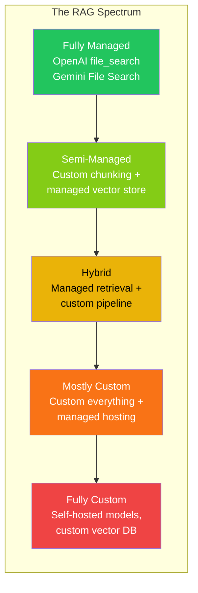
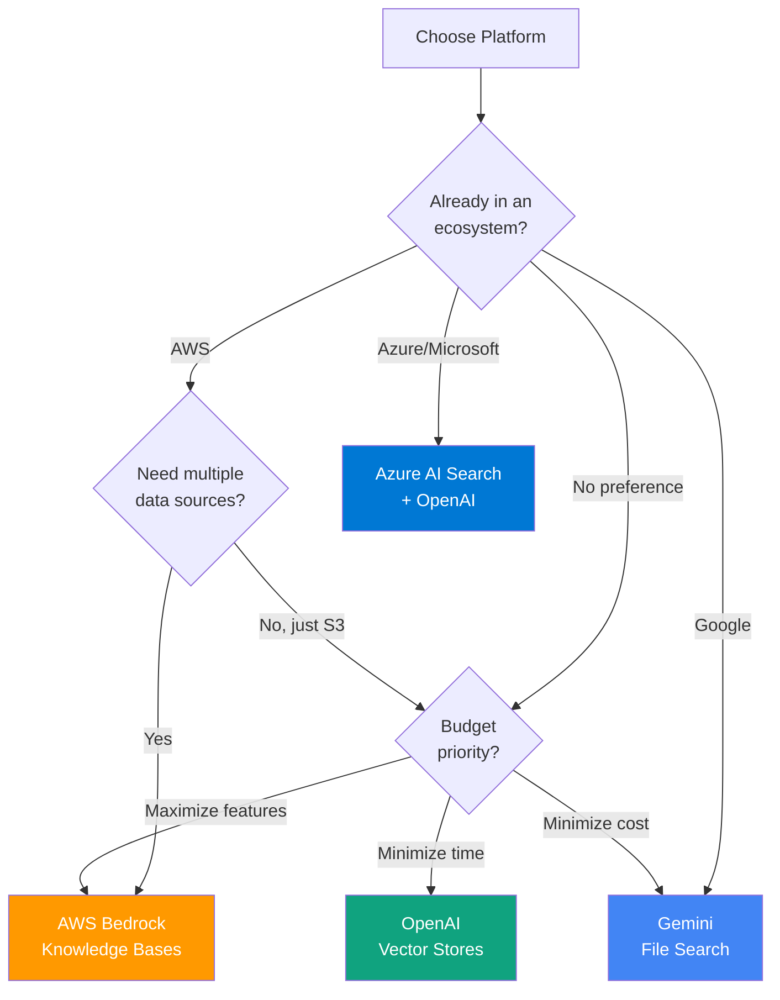
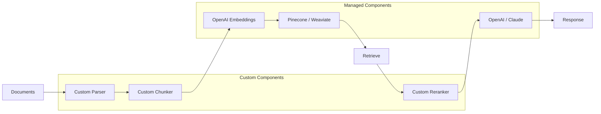
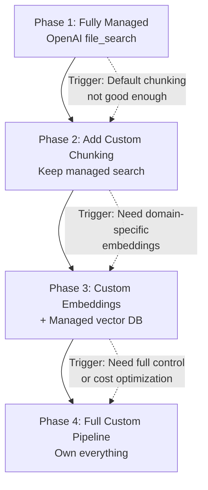

# Managed vs Custom Decision Framework

## Introduction

You've now seen four managed RAG services: OpenAI Vector Stores, Gemini File Search, AWS Bedrock Knowledge Bases, and Azure AI Search. Each eliminates significant engineering effort—but they also limit what you can control. The question every team faces is: **should we use a managed service, build a custom pipeline, or create a hybrid?**

There's no universal answer. The right choice depends on your data complexity, scale requirements, cost constraints, team expertise, and how much control you need over each component. This lesson provides a structured decision framework to help you choose—and a migration path if your needs evolve.

---

## The Build vs Buy Spectrum

RAG isn't a binary choice between "fully managed" and "fully custom." Most production systems fall somewhere on a spectrum:



| Level | Setup Time | Control | Maintenance | Example |
|-------|-----------|---------|-------------|---------|
| **Fully managed** | Hours | Low | None | OpenAI file_search |
| **Semi-managed** | Days | Medium | Low | Custom chunker + Pinecone |
| **Hybrid** | 1–2 weeks | Medium-High | Medium | Managed retrieval + custom reranking |
| **Mostly custom** | 2–4 weeks | High | High | LangChain + self-hosted Qdrant |
| **Fully custom** | Months | Full | Very High | Custom models + infrastructure |

---

## Decision Criteria Matrix

Score each criterion from 1 (favors managed) to 5 (favors custom) based on your requirements:

### 1. Time to Market

| Scenario | Score | Recommendation |
|----------|-------|---------------|
| Need it working this week | 1 | Managed |
| Have 2–4 weeks | 3 | Hybrid possible |
| Months of development time | 5 | Custom viable |

### 2. Data Complexity

| Scenario | Score | Recommendation |
|----------|-------|---------------|
| Simple text documents (PDF, DOCX) | 1 | Managed handles this well |
| Mixed formats with some structure | 3 | May need custom parsing |
| Complex multimodal, domain-specific formats | 5 | Custom parsing required |

### 3. Retrieval Quality Requirements

| Scenario | Score | Recommendation |
|----------|-------|---------------|
| Good enough for chatbot / FAQ | 1 | Managed defaults work |
| Need consistent high precision | 3 | Hybrid with custom reranking |
| Mission-critical accuracy (legal, medical) | 5 | Custom pipeline with evaluation |

### 4. Scale

| Scenario | Score | Recommendation |
|----------|-------|---------------|
| < 1,000 documents | 1 | Managed, any provider |
| 1,000–100,000 documents | 3 | Managed with tuning, or hybrid |
| > 100,000 documents, high QPS | 5 | Custom for performance control |

### 5. Cost Sensitivity

| Scenario | Score | Recommendation |
|----------|-------|---------------|
| Cost is secondary to speed | 1 | Managed |
| Need predictable costs at scale | 3 | Hybrid or self-hosted vector DB |
| Must minimize per-query cost | 5 | Custom (self-hosted models) |

### 6. Customization Needs

| Scenario | Score | Recommendation |
|----------|-------|---------------|
| Default chunking and search are fine | 1 | Managed |
| Need custom chunking or metadata | 3 | Managed with config, or hybrid |
| Need custom embeddings, retrieval, reranking | 5 | Custom pipeline |

### Scoring Guide

| Total Score (6–30) | Recommendation |
|--------------------|---------------|
| **6–12** | Go managed — speed and simplicity matter most |
| **13–20** | Consider hybrid — managed base with custom components |
| **21–30** | Build custom — your requirements justify the investment |

---

## Platform Selection Guide

Once you've decided on managed (or hybrid), choose the right platform:



### Quick Platform Summary

| Criteria | OpenAI | Gemini | AWS Bedrock | Azure AI Search |
|----------|--------|--------|-------------|-----------------|
| **Fastest setup** | ✅ Best | ✅ Great | ⚠️ Complex | ⚠️ Complex |
| **Lowest cost** | ⚠️ Storage fees | ✅ Free storage | ❌ High minimum | ❌ Tiered SKUs |
| **Most features** | ⚠️ Basic | ⚠️ Basic | ✅ Most complete | ✅ Search-rich |
| **Best search quality** | Good | Good | Good + reranking | ✅ Best (semantic + hybrid) |
| **Enterprise security** | ⚠️ Limited | ⚠️ Limited | ✅ IAM + VPC | ✅ Entra ID + RBAC |
| **Data connectors** | Files only | Files only | ✅ S3, Confluence, SharePoint | ✅ Blob, uploads, URLs |
| **Ecosystem lock-in** | OpenAI models | Gemini models | AWS services | Azure services |

---

## Cost Analysis: Managed vs Custom

### Scenario: 10,000 Documents (~5 GB)

#### Managed Costs (Monthly)

| Provider | Storage | Retrieval | Embedding | Total |
|----------|---------|-----------|-----------|-------|
| **OpenAI Vector Stores** | $12/mo | Included in model usage | Included | ~$12 + model costs |
| **Gemini File Search** | Free | Context tokens | $0.75 (one-time) | ~$0 + model costs |
| **AWS Bedrock KB** | ~$700+ (OpenSearch min) | $0.005/1K queries | Titan Embed costs | ~$750+ |
| **Azure AI Search** | ~$75–250 (Basic–S1) | Included in SKU | Ada-002 costs | ~$100–300 |

#### Custom Pipeline Costs (Monthly)

| Component | Self-Hosted | Managed Service |
|-----------|------------|-----------------|
| **Vector DB** | $50–200 (VPS) | $75–300 (Pinecone/Weaviate Cloud) |
| **Embedding model** | $0 (local) or $5–20 (API) | $5–20 (API) |
| **Reranking** | $0 (local) or $10–30 (API) | $10–30 (API) |
| **Compute** | $100–500 (GPU optional) | $50–200 (serverless) |
| **Maintenance** | $2,000–5,000 (engineer time) | $500–1,000 (engineer time) |
| **Total** | ~$2,200–5,700 | ~$640–1,550 |

**Key insight**: Managed RAG is almost always cheaper **if** you include engineering time. Custom RAG becomes cost-effective at very high scale or when the managed pricing model doesn't fit.

---

## When Managed Services Win

### ✅ Use Managed When:

1. **Prototyping or MVP**: Get a working RAG system in hours, not weeks
2. **Simple document types**: PDFs, text files, and standard formats
3. **Small to medium scale**: Under 100,000 documents
4. **Limited RAG expertise**: Team doesn't have vector search or retrieval experience
5. **Standard retrieval needs**: Default chunking and search are good enough
6. **Single-provider ecosystem**: Already committed to OpenAI/Google/AWS/Azure
7. **Rapid iteration**: Need to add/remove documents frequently

### Example: Customer Support Bot

```python
# Managed approach: 15 minutes to working prototype
from openai import OpenAI

client = OpenAI()

# Create knowledge base
store = client.vector_stores.create(name="support-docs")
for doc in ["faq.pdf", "troubleshooting.md", "pricing.txt"]:
    with open(doc, "rb") as f:
        client.vector_stores.files.upload_and_poll(
            vector_store_id=store.id, file=f
        )

# Query
response = client.responses.create(
    model="gpt-4.1",
    input="How do I reset my password?",
    tools=[{"type": "file_search", "vector_store_ids": [store.id]}]
)
print(response.output_text)
# Done. Working RAG in 15 minutes.
```

---

## When Custom Pipelines Win

### ✅ Use Custom When:

1. **Domain-specific parsing**: Legal citations, medical records, code repositories
2. **Custom embedding models**: Fine-tuned or domain-specific embeddings
3. **Complex retrieval logic**: Multi-stage retrieval, query routing, parent-child documents
4. **Advanced reranking**: Custom reranking models or multi-signal fusion
5. **Multi-tenancy requirements**: Strict data isolation between customers
6. **Cost optimization at scale**: Per-query costs must be minimized
7. **Regulatory compliance**: Data must stay on-premises or in specific regions
8. **Full observability**: Need detailed metrics on every pipeline component

### Example: Legal Document Retrieval

```python
# Custom approach: Needed for domain-specific requirements
from sentence_transformers import SentenceTransformer
from qdrant_client import QdrantClient
import cohere

# Domain-specific embedding model
embedder = SentenceTransformer("legal-bert-base-uncased")

# Self-hosted vector database
qdrant = QdrantClient(host="localhost", port=6333)

# Custom chunking for legal documents
def chunk_legal_document(text: str) -> list[dict]:
    """Split by section headers, preserve citation chains."""
    sections = split_by_legal_sections(text)  # Custom logic
    chunks = []
    for section in sections:
        chunks.append({
            "text": section.text,
            "metadata": {
                "section_type": section.type,  # "statute", "case_law", "opinion"
                "citations": extract_citations(section.text),
                "jurisdiction": section.jurisdiction
            }
        })
    return chunks

# Custom retrieval with citation-aware reranking
def retrieve_legal(query: str, jurisdiction: str = None) -> list:
    """Multi-stage retrieval with legal-specific logic."""
    # Stage 1: Dense retrieval
    query_vector = embedder.encode(query)
    dense_results = qdrant.search(
        collection_name="legal_docs",
        query_vector=query_vector,
        limit=50,
        query_filter={"jurisdiction": jurisdiction} if jurisdiction else None
    )
    
    # Stage 2: Citation chain expansion
    expanded = expand_citation_chains(dense_results)
    
    # Stage 3: Cross-encoder reranking
    co = cohere.Client()
    reranked = co.rerank(
        model="rerank-v3.5",
        query=query,
        documents=[r.text for r in expanded],
        top_n=10
    )
    
    return reranked

# This level of customization isn't possible with managed services
```

---

## The Hybrid Approach

Many production systems combine managed and custom components:



### Common Hybrid Patterns

| Pattern | Custom | Managed | Use Case |
|---------|--------|---------|----------|
| **Custom ingestion** | Parsing, chunking | Embedding, storage, retrieval | Domain-specific documents |
| **Custom retrieval** | Query routing, reranking | Storage, embedding | Complex query patterns |
| **Custom generation** | Prompt engineering, guardrails | Retrieval, embedding | Safety-critical applications |
| **Custom evaluation** | Quality metrics, A/B testing | Everything else | Iterative improvement |

### Hybrid Example: Custom Chunking + Managed Search

```python
from openai import OpenAI
import tiktoken

client = OpenAI()
encoder = tiktoken.encoding_for_model("gpt-4")


def smart_chunk(text: str, max_tokens: int = 500) -> list[str]:
    """Custom semantic chunking for technical docs."""
    # Split by headers and meaningful boundaries
    sections = text.split("\n## ")
    chunks = []
    
    for section in sections:
        tokens = encoder.encode(section)
        if len(tokens) <= max_tokens:
            chunks.append(section)
        else:
            # Sub-chunk by paragraphs
            paragraphs = section.split("\n\n")
            current_chunk = []
            current_tokens = 0
            
            for para in paragraphs:
                para_tokens = len(encoder.encode(para))
                if current_tokens + para_tokens > max_tokens:
                    chunks.append("\n\n".join(current_chunk))
                    current_chunk = [para]
                    current_tokens = para_tokens
                else:
                    current_chunk.append(para)
                    current_tokens += para_tokens
            
            if current_chunk:
                chunks.append("\n\n".join(current_chunk))
    
    return chunks


# Custom chunk, then use managed store
store = client.vector_stores.create(name="custom-chunked-docs")

for doc_path in document_paths:
    with open(doc_path) as f:
        text = f.read()
    
    chunks = smart_chunk(text)
    
    # Save chunks as individual files for upload
    for i, chunk in enumerate(chunks):
        chunk_path = f"/tmp/chunk_{i}.txt"
        with open(chunk_path, "w") as f:
            f.write(chunk)
        
        with open(chunk_path, "rb") as f:
            client.vector_stores.files.upload_and_poll(
                vector_store_id=store.id,
                file=f
            )
```

---

## Migration Paths

### Managed → Custom (Growing Out)



**Migration triggers:**
1. **Default chunking hurts quality** → Add custom chunking, keep managed search
2. **Generic embeddings miss domain nuance** → Switch to custom or fine-tuned embeddings
3. **Retrieval quality plateaus** → Add custom reranking layer
4. **Cost becomes prohibitive at scale** → Self-host components
5. **Compliance requires data control** → Move to self-hosted infrastructure

### Custom → Managed (Simplifying)

Sometimes teams over-engineer their RAG pipeline:

**Signs you should simplify:**
- Spending more time on infrastructure than improving quality
- Custom pipeline achieves similar quality to managed services
- Team spending > 20% of time on RAG maintenance
- Scale doesn't justify the complexity

---

## Decision Checklist

Use this checklist to make your final decision:

```
□ Time constraint
  → Need it in < 1 week?                    → Managed
  → Have > 1 month?                          → Custom viable

□ Data complexity
  → Standard text documents?                 → Managed
  → Domain-specific or multimodal?           → Custom or hybrid

□ Team expertise
  → No ML/retrieval experience?              → Managed
  → Strong engineering team?                 → Custom viable

□ Budget
  → Can afford managed service pricing?      → Managed
  → Need to minimize per-query cost?         → Custom at scale

□ Quality requirements
  → "Good enough" is acceptable?             → Managed
  → Need domain-specific precision?          → Custom

□ Ecosystem
  → Already using a cloud provider?          → That provider's managed service
  → Multi-cloud or cloud-agnostic?           → Custom or OpenAI/Gemini

□ Compliance
  → No data residency requirements?          → Managed
  → Must control data location?              → Custom or enterprise managed
```

---

## Summary

The managed vs custom decision comes down to four factors:

| Factor | Favors Managed | Favors Custom |
|--------|---------------|---------------|
| **Speed** | Get to production in hours | Weeks to months of development |
| **Cost at small scale** | Cheaper (no engineering overhead) | More expensive (build + maintain) |
| **Cost at large scale** | Per-query fees add up | Self-hosted reduces per-query cost |
| **Control** | Limited to provider's options | Full control over every component |

**Start managed, go custom only when you hit a wall.** Most teams overestimate their need for customization. A managed service with well-tuned parameters often achieves 90% of the quality of a fully custom pipeline at 10% of the engineering cost.

The best RAG system is the one that's deployed and iterating on real user feedback—not the one with the most sophisticated architecture sitting in a development branch.
