# Grounding with Web Search

## Section Overview

Traditional RAG retrieves answers from **your** documents—private databases, uploaded PDFs, internal knowledge bases. But what happens when a user asks about something that happened yesterday? Or needs a stock price from five minutes ago? Your static vector store has no answer.

**Grounding with web search** extends RAG to the entire internet. Instead of searching only your private documents, the AI model can execute live Google or Bing searches, process the results, and generate responses with source citations—all in a single API call. Both Google's Gemini and OpenAI's GPT models now offer this as a built-in tool, requiring no custom search infrastructure.

The implications are significant: you can build AI applications that combine the accuracy of real-time web data with the relevance of your private knowledge, creating systems that are never out of date.

```mermaid
flowchart TB
    subgraph "Traditional RAG"
        direction LR
        Q1[User Query] --> VDB[(Vector Database)]
        VDB --> R1[Retrieved Chunks]
        R1 --> LLM1[LLM]
        LLM1 --> A1[Response]
    end
    
    subgraph "Web-Grounded RAG"
        direction LR
        Q2[User Query] --> DECIDE{Model Decides}
        DECIDE -->|Needs fresh data| WEB[🌐 Web Search]
        DECIDE -->|Has knowledge| DIRECT[Direct Answer]
        WEB --> RESULTS[Search Results<br>+ Citations]
        RESULTS --> LLM2[LLM]
        DIRECT --> LLM2
        LLM2 --> A2[Grounded Response<br>with Sources]
    end
    
    subgraph "Hybrid: Web + Private"
        direction LR
        Q3[User Query] --> ROUTER{Query Router}
        ROUTER -->|Real-time data| WEB2[🌐 Web Search]
        ROUTER -->|Internal data| VDB2[(Private<br>Vector Store)]
        WEB2 --> MERGE[Merge & Prioritize]
        VDB2 --> MERGE
        MERGE --> LLM3[LLM]
        LLM3 --> A3[Complete Response<br>Web + Private Sources]
    end
```



---

## What You'll Learn

| Lesson | Topic | Description |
|--------|-------|-------------|
| 01 | [Gemini Google Search Grounding](./01-gemini-google-search-grounding.md) | Enable Google Search as a tool, grounding metadata, citations, supported models, and per-query billing |
| 02 | [OpenAI Web Search](./02-openai-web-search.md) | Responses API web_search tool, inline citations, domain filtering, user location, and search modes |
| 03 | [How Grounding Works](./03-how-grounding-works.md) | The 5-step grounding pipeline, model search decisions, multi-query strategies, and citation mapping |
| 04 | [Combining Web and Private Knowledge](./04-combining-web-and-private-knowledge.md) | Query routing, merging web + internal results, freshness weighting, and conflict resolution |
| 05 | [Real-Time RAG Use Cases](./05-real-time-rag-use-cases.md) | Current events, financial data, weather, news, production patterns, and cost optimization |

---

## Prerequisites

Before starting this section, you should understand:

- **Basic RAG pipeline** — The query → retrieve → generate pattern (Lessons 1–6)
- **API integration basics** — Making API calls with Python (Unit 4)
- **Prompt engineering** — How context affects LLM responses (Unit 6)
- **Managed RAG concepts** — Platform-provided RAG tools (Lesson 12)

---

## Key Concepts

### What Is "Grounding"?

**Grounding** connects an AI model to external, verifiable information sources. Instead of relying solely on training data (which has a knowledge cutoff), the model retrieves real-time facts and cites where they came from.

| Aspect | Without Grounding | With Grounding |
|--------|-------------------|----------------|
| **Data freshness** | Limited to training cutoff | Real-time web results |
| **Source attribution** | No citations | Automatic URL citations |
| **Hallucination risk** | Higher for recent events | Reduced—answers backed by sources |
| **Knowledge scope** | Training data only | Entire searchable web |
| **Cost** | Token costs only | Token costs + search fees |

### Web Grounding vs. Traditional RAG

These aren't competing approaches—they solve different problems:

```mermaid
flowchart LR
    subgraph "Traditional RAG"
        PRIVATE[Your Documents]
        PRIVATE --> |Chunked & Embedded| VSTORE[(Vector Store)]
        VSTORE --> |Semantic Search| CHUNKS[Relevant Chunks]
    end
    
    subgraph "Web Grounding"
        INTERNET[🌐 Entire Web]
        INTERNET --> |Live Search| PAGES[Web Pages<br>+ Metadata]
    end
    
    CHUNKS --> BEST["Best For:<br>• Private data<br>• Consistent results<br>• Lower latency<br>• Cost predictability"]
    PAGES --> BEST2["Best For:<br>• Current events<br>• Real-time data<br>• Broad topics<br>• Verification"]
```



| Feature | Traditional RAG | Web Grounding |
|---------|----------------|---------------|
| **Data source** | Your uploaded documents | Public web pages |
| **Freshness** | As recent as last index update | Real-time |
| **Control** | Full control over content | No control over web content |
| **Privacy** | Data stays private | Queries sent to search engine |
| **Latency** | Fast (local vector search) | Slower (web search + processing) |
| **Cost model** | Embedding + storage + tokens | Per-search-query fees + tokens |
| **Consistency** | Same docs = same results | Web results change over time |

### Provider Landscape

Two major providers offer built-in web search grounding:

| Feature | Gemini (Google Search) | OpenAI (Web Search) |
|---------|----------------------|---------------------|
| **API** | `google.genai` with `google_search` tool | Responses API with `web_search` tool |
| **Search engine** | Google Search | OpenAI's web index |
| **Citation format** | `groundingMetadata` with chunks + supports | `url_citation` annotations |
| **Domain filtering** | Not available | Up to 100 allowed domains |
| **User location** | Not available | Country, city, region, timezone |
| **Billing model (latest)** | Per search query ($14/1K queries, Gemini 3) | Per search call ($10/1K calls + search content tokens) |
| **Free tier** | 5,000 queries/month (Gemini 3) | None |
| **Older model billing** | Per grounded prompt ($35/1K prompts, Gemini 2.5) | N/A |

---

## How Web Grounding Fits in the RAG Spectrum

Web search grounding occupies a specific position in the broader RAG architecture space:

```mermaid
flowchart TB
    subgraph "RAG Architecture Spectrum"
        direction LR
        
        BASIC["Basic RAG<br>───────<br>Static docs<br>Vector search<br>Single retrieval"]
        
        ADVANCED["Advanced RAG<br>───────<br>Multi-stage<br>Reranking<br>Query expansion"]
        
        MANAGED["Managed RAG<br>───────<br>Cloud platforms<br>Auto-pipeline<br>Lesson 12"]
        
        GROUNDED["Web Grounding<br>───────<br>Live search<br>Real-time data<br>This lesson"]
        
        HYBRID["Hybrid RAG<br>───────<br>Web + Private<br>Query routing<br>Full coverage"]
        
        BASIC --> ADVANCED --> MANAGED --> GROUNDED --> HYBRID
    end
```



---

## Section Roadmap


1. **Start with Gemini** — Learn Google Search grounding with the simplest integration
2. **Compare with OpenAI** — See how the same concept works in the Responses API
3. **Understand the internals** — How models decide when and what to search
4. **Combine both worlds** — Merge web results with your private knowledge base
5. **Apply to real scenarios** — Build production systems for real-time information needs

---

## Quick Start Example

Here's a taste of web grounding in action—the same question answered two ways:

### Gemini with Google Search

```python
from google import genai
from google.genai import types

client = genai.Client()

response = client.models.generate_content(
    model="gemini-2.5-flash",
    contents="What significant tech announcements were made this week?",
    config=types.GenerateContentConfig(
        tools=[types.Tool(google_search=types.GoogleSearch())]
    ),
)

print(response.text)
# Real-time answer with current events, grounded in Google Search results

# Check what searches were performed
for query in response.candidates[0].grounding_metadata.web_search_queries:
    print(f"  Searched: {query}")
```

### OpenAI with Web Search

```python
from openai import OpenAI

client = OpenAI()

response = client.responses.create(
    model="gpt-4.1",
    tools=[{"type": "web_search"}],
    input="What significant tech announcements were made this week?",
)

print(response.output_text)
# Real-time answer with inline citations [1], [2], etc.

# Check citations
for item in response.output:
    if item.type == "message":
        for annotation in item.content[0].annotations:
            if annotation.type == "url_citation":
                print(f"  Source: {annotation.title} — {annotation.url}")
```

Both return current, cited answers—but through different APIs and billing models. The following lessons explore each in depth.
