# Gemini Google Search Grounding

## Introduction

Google's Gemini API offers the most direct path to web-grounded AI responses. By enabling the `google_search` tool, you give Gemini access to Google Search itself—the same search engine that indexes billions of web pages. The model decides when a search would improve its answer, automatically generates search queries, processes the results, and returns a grounded response with structured citation metadata.

The integration is remarkably simple: add one tool to your API configuration, and every response can draw on real-time web information. No search API keys, no result parsing, no custom retrieval code. The model handles the entire search-retrieve-synthesize pipeline internally.

This lesson covers the complete Gemini Google Search grounding workflow—from basic setup through advanced citation handling, supported models, billing, and production considerations.

---

## Basic Setup

### Installation and Configuration

First, install the Google Gen AI SDK:

```bash
pip install google-genai
```

Set your API key (get one free at [Google AI Studio](https://aistudio.google.com/apikey)):

```bash
export GOOGLE_API_KEY="your-api-key-here"
```

### Your First Grounded Query

```python
from google import genai
from google.genai import types

# Initialize client (reads GOOGLE_API_KEY from environment)
client = genai.Client()

# Create the Google Search tool
grounding_tool = types.Tool(
    google_search=types.GoogleSearch()
)

# Create configuration with the tool
config = types.GenerateContentConfig(
    tools=[grounding_tool]
)

# Make a grounded request
response = client.models.generate_content(
    model="gemini-2.5-flash",
    contents="Who won the most recent Formula 1 Grand Prix?",
    config=config,
)

print(response.text)
# Output: Real-time answer about the latest F1 race,
# grounded in current Google Search results
```

That's it. Three objects—`Tool`, `Config`, `generate_content`—and you have a web-grounded AI response.

### Understanding the Components

```mermaid
flowchart LR
    subgraph "Setup Objects"
        TOOL["types.Tool(<br>google_search=<br>types.GoogleSearch()<br>)"]
        CONFIG["types.GenerateContentConfig(<br>tools=[grounding_tool]<br>)"]
    end
    
    subgraph "API Call"
        CALL["client.models.generate_content(<br>model='gemini-2.5-flash',<br>contents='...',<br>config=config<br>)"]
    end
    
    TOOL --> CONFIG --> CALL
    
    subgraph "Response"
        TEXT[response.text]
        META[response.candidates[0]<br>.grounding_metadata]
    end
    
    CALL --> TEXT
    CALL --> META
```

| Component | Purpose |
|-----------|---------|
| `types.GoogleSearch()` | Declares the Google Search capability (no parameters needed) |
| `types.Tool(google_search=...)` | Wraps it as a tool the model can use |
| `types.GenerateContentConfig(tools=[...])` | Attaches tools to the request configuration |
| `generate_content()` | Makes the API call with model, prompt, and config |

---

## The Grounding Response

When Gemini uses Google Search, the response contains both the text answer and structured `groundingMetadata`. This metadata is the key to building rich citation experiences.

### Response Structure

```python
response = client.models.generate_content(
    model="gemini-2.5-flash",
    contents="What is the current population of Tokyo?",
    config=config,
)

# The text response
print(response.text)
# "The population of the Greater Tokyo Area is approximately 
#  37.4 million people as of 2024, making it the most populous 
#  metropolitan area in the world."

# Access grounding metadata
metadata = response.candidates[0].grounding_metadata

# What searches were performed?
print("Search queries:")
for query in metadata.web_search_queries:
    print(f"  • {query}")
# Output:
#   • Tokyo population 2024
#   • Greater Tokyo Area population

# What sources were found?
print("\nSources:")
for chunk in metadata.grounding_chunks:
    print(f"  • {chunk.web.title}: {chunk.web.uri}")
# Output:
#   • worldpopulationreview.com: https://vertexaisearch.cloud.google.com/...
#   • macrotrends.net: https://vertexaisearch.cloud.google.com/...
```

### Complete Metadata Structure

The `groundingMetadata` object contains four key fields:

```mermaid
flowchart TB
    META[groundingMetadata]
    
    META --> WSQ["webSearchQueries<br>─────────<br>Array of search queries<br>the model executed"]
    
    META --> SEP["searchEntryPoint<br>─────────<br>HTML/CSS for the required<br>Google Search suggestion widget"]
    
    META --> GC["groundingChunks<br>─────────<br>Array of web sources<br>with uri and title"]
    
    META --> GS["groundingSupports<br>─────────<br>Maps text segments<br>to source chunks"]
```



| Field | Type | Description |
|-------|------|-------------|
| `webSearchQueries` | `list[str]` | The search queries the model generated and executed |
| `searchEntryPoint` | `object` | HTML and CSS for the required Search Suggestions widget |
| `groundingChunks` | `list[GroundingChunk]` | Web sources with `web.uri` and `web.title` |
| `groundingSupports` | `list[GroundingSupport]` | Links text segments to their source chunks |

### Exploring groundingChunks

Each `groundingChunk` represents one web source the model used:

```python
metadata = response.candidates[0].grounding_metadata

for i, chunk in enumerate(metadata.grounding_chunks):
    print(f"Source [{i}]:")
    print(f"  Title: {chunk.web.title}")
    print(f"  URI:   {chunk.web.uri}")
    print()

# Output:
# Source [0]:
#   Title: aljazeera.com
#   URI:   https://vertexaisearch.cloud.google.com/grounding-api-redirect/...
#
# Source [1]:
#   Title: uefa.com
#   URI:   https://vertexaisearch.cloud.google.com/grounding-api-redirect/...
```

> **Note:** The URIs route through Google's Vertex AI Search redirect service. These are the links you should use in citations—they resolve to the actual web pages.

### Exploring groundingSupports

The `groundingSupports` array is the **citation mapping**—it connects specific text segments in the response to their source chunks:

```python
metadata = response.candidates[0].grounding_metadata

for support in metadata.grounding_supports:
    # The text segment this support covers
    segment = support.segment
    print(f"Text: \"{segment.text}\"")
    print(f"  Range: characters {segment.start_index} to {segment.end_index}")
    
    # Which sources back this segment
    for idx in support.grounding_chunk_indices:
        chunk = metadata.grounding_chunks[idx]
        print(f"  Source [{idx}]: {chunk.web.title}")
    print()

# Output:
# Text: "Spain won Euro 2024, defeating England 2-1 in the final."
#   Range: characters 0 to 85
#   Source [0]: aljazeera.com
#
# Text: "This victory marks Spain's record fourth European Championship title."
#   Range: characters 86 to 210
#   Source [0]: aljazeera.com
#   Source [1]: uefa.com
```

This structure lets you build **inline citations** where each claim links to its specific source.

---

## Building Inline Citations

The API gives you raw citation data. You need to process it to create user-friendly inline citations. Here's the standard pattern from Google's documentation:

```python
def add_citations(response):
    """Convert grounding metadata into inline citations.
    
    Processes groundingSupports in reverse order to avoid
    shifting character indices when inserting citation text.
    """
    text = response.text
    supports = response.candidates[0].grounding_metadata.grounding_supports
    chunks = response.candidates[0].grounding_metadata.grounding_chunks

    # Sort by end_index descending to prevent index shifting
    sorted_supports = sorted(
        supports,
        key=lambda s: s.segment.end_index,
        reverse=True,
    )

    for support in sorted_supports:
        end_index = support.segment.end_index
        
        if support.grounding_chunk_indices:
            # Build citation links: [1](url1), [2](url2)
            citation_links = []
            for i in support.grounding_chunk_indices:
                if i < len(chunks):
                    uri = chunks[i].web.uri
                    citation_links.append(f"[{i + 1}]({uri})")

            citation_string = ", ".join(citation_links)
            # Insert citations at the end of the supported text
            text = text[:end_index] + citation_string + text[end_index:]

    return text


# Usage
response = client.models.generate_content(
    model="gemini-2.5-flash",
    contents="Who won Euro 2024?",
    config=config,
)

cited_text = add_citations(response)
print(cited_text)
# Output:
# Spain won Euro 2024, defeating England 2-1 in the final.[1](https://...),
# [2](https://...) This victory marks Spain's record fourth European 
# Championship title.[1](https://...), [3](https://...)
```

### Why Reverse Order?

The function sorts supports by `end_index` in **descending** order. This is critical: when you insert citation text (like `[1](url)`), it shifts all subsequent character positions. By processing from the end of the text backward, earlier indices remain valid.

```mermaid
flowchart TB
    subgraph "Wrong: Forward Order"
        A1["'Spain won Euro 2024.'<br>Insert [1] at position 21"] 
        A2["'Spain won Euro 2024.[1] This marks...'<br>❌ Position 45 is now shifted!"]
        A1 --> A2
    end
    
    subgraph "Correct: Reverse Order"
        B1["'...marks Spain's title.'<br>Insert [2] at position 85"]
        B2["'Spain won Euro 2024.'<br>Insert [1] at position 21<br>✅ Earlier index unaffected"]
        B1 --> B2
    end
```



---

## Search Entry Point (Required Display)

Google's Terms of Service require you to display a **Search Suggestions widget** when using grounding. The `searchEntryPoint` field contains pre-rendered HTML and CSS for this:

```python
metadata = response.candidates[0].grounding_metadata

if metadata.search_entry_point:
    html_content = metadata.search_entry_point.rendered_content
    # This contains HTML + CSS for the Google Search suggestion widget
    # You MUST display this in your application's UI
    print("Search widget HTML length:", len(html_content))
```

> **Important:** Displaying the search entry point is a **requirement**, not a suggestion. Review the [Gemini API Terms of Service](https://ai.google.dev/gemini-api/terms#grounding-with-google-search) for full compliance details.

---

## Supported Models

Not all Gemini models support Google Search grounding. Here's the current landscape:

| Model | Google Search | Notes |
|-------|:------------:|-------|
| Gemini 3 Pro | ✅ | Latest, per-query billing |
| Gemini 3 Flash | ✅ | Per-query billing, free tier for Standard |
| Gemini 2.5 Pro | ✅ | Per-prompt billing |
| Gemini 2.5 Flash | ✅ | Per-prompt billing, free tier available |
| Gemini 2.5 Flash-Lite | ✅ | Per-prompt billing, most cost-effective |
| Gemini 2.0 Flash | ✅ | Per-prompt billing |
| Gemini 2.0 Flash-Lite | ❌ | No search grounding support |
| Gemma 3 / 3n | ❌ | Open models, no search grounding |

> **Note:** Older models use a `google_search_retrieval` tool. For all current models, use the `google_search` tool as shown in this lesson.

### Model Selection for Grounding

```python
# Latest and most capable
response = client.models.generate_content(
    model="gemini-2.5-pro",  # Best quality, higher cost
    contents="Explain the latest developments in quantum computing",
    config=config,
)

# Fast and cost-effective
response = client.models.generate_content(
    model="gemini-2.5-flash",  # Good balance of speed and quality
    contents="What's the weather forecast for London today?",
    config=config,
)

# Budget-friendly
response = client.models.generate_content(
    model="gemini-2.5-flash-lite",  # Lowest cost with grounding
    contents="Who won the game last night?",
    config=config,
)
```

---

## Combining with Other Tools

Google Search grounding can be used alongside other Gemini tools:

### With URL Context

Ground responses in both web search results **and** specific URLs you provide:

```python
from google.genai import types

config = types.GenerateContentConfig(
    tools=[
        types.Tool(google_search=types.GoogleSearch()),
        types.Tool(url_context=types.UrlContext(
            urls=["https://blog.example.com/our-product-roadmap-2025"]
        )),
    ]
)

response = client.models.generate_content(
    model="gemini-2.5-flash",
    contents="How does our product roadmap compare to industry trends?",
    config=config,
)
```

### With Code Execution

Combine web data retrieval with code execution for data analysis:

```python
config = types.GenerateContentConfig(
    tools=[
        types.Tool(google_search=types.GoogleSearch()),
        types.Tool(code_execution=types.ToolCodeExecution()),
    ]
)

response = client.models.generate_content(
    model="gemini-2.5-flash",
    contents="Find the current GDP of the top 5 economies and create a comparison chart",
    config=config,
)
```

---

## Billing and Pricing

Google Search grounding pricing changed significantly between Gemini model generations. Understanding this is critical for cost planning.

### Gemini 3 Models: Per-Query Billing

With Gemini 3, you're billed for each **search query** the model executes:

```mermaid
flowchart LR
    PROMPT[Your Prompt] --> MODEL[Gemini 3]
    MODEL --> |"Query 1: 'Euro 2024 winner'"| SEARCH1[Google Search]
    MODEL --> |"Query 2: 'Spain vs England final score'"| SEARCH2[Google Search]
    
    SEARCH1 --> BILL["💰 2 search queries billed"]
    SEARCH2 --> BILL
```



- A single prompt can trigger **multiple** search queries
- Each unique query is billed separately
- Empty/null queries are excluded from billing
- **Pricing:** $14 per 1,000 search queries
- **Free tier:** 5,000 queries per month (Paid plan)

### Gemini 2.5 and Older: Per-Prompt Billing

With Gemini 2.5 and earlier models, billing is per **grounded prompt**—regardless of how many searches the model performs:

```mermaid
flowchart LR
    PROMPT[Your Prompt] --> MODEL[Gemini 2.5]
    MODEL --> |"Query 1"| SEARCH1[Google Search]
    MODEL --> |"Query 2"| SEARCH2[Google Search]
    MODEL --> |"Query 3"| SEARCH3[Google Search]
    
    SEARCH1 --> BILL["💰 1 grounded prompt billed<br>(regardless of query count)"]
    SEARCH2 --> BILL
    SEARCH3 --> BILL
```



- **Pricing:** $35 per 1,000 grounded prompts
- **Free tier:** 1,500 requests per day (Paid plan); 500 requests per day (Free plan)

### Pricing Comparison Table

| Aspect | Gemini 3 | Gemini 2.5 | Gemini 2.0 Flash |
|--------|----------|------------|------------------|
| **Billing unit** | Per search query | Per grounded prompt | Per grounded prompt |
| **Paid price** | $14 / 1K queries | $35 / 1K prompts | $35 / 1K prompts |
| **Free tier** | 5,000 queries/month | 1,500 RPD | 1,500 RPD |
| **Free plan** | Standard tier (free) | 500 RPD | 500 RPD |
| **Multi-query cost** | Increases with queries | Same regardless | Same regardless |

### Cost Estimation Example

```python
# Scenario: 10,000 user questions per month
# Average 1.5 search queries per question

# Gemini 3 Flash
gemini3_queries = 10_000 * 1.5  # 15,000 queries
gemini3_billable = 15_000 - 5_000  # 10,000 (after free tier)
gemini3_cost = (10_000 / 1_000) * 14  # $140/month

# Gemini 2.5 Flash  
gemini25_prompts = 10_000  # 10,000 prompts
gemini25_daily = 10_000 / 30  # ~333/day (under 1,500 free limit!)
gemini25_cost = 0  # $0/month if under daily free limit

print(f"Gemini 3 Flash: ${gemini3_cost:.2f}/month")
print(f"Gemini 2.5 Flash: ${gemini25_cost:.2f}/month")
# Gemini 3 Flash: $140.00/month
# Gemini 2.5 Flash: $0.00/month (under daily free limit)
```

> **Key Insight:** For moderate volumes, Gemini 2.5 with its daily free limit can be significantly cheaper. Gemini 3's per-query billing becomes more predictable at scale but can cost more for multi-query prompts.

---

## Checking If Search Was Used

The model doesn't always search—it decides based on the prompt. You should check whether grounding was actually used:

```python
def analyze_grounding(response):
    """Check if and how grounding was used in a response."""
    candidate = response.candidates[0]
    metadata = candidate.grounding_metadata
    
    if not metadata:
        print("⚠️ No grounding metadata — model answered from knowledge")
        return
    
    if not metadata.grounding_chunks:
        print("ℹ️ Grounding metadata present but no web sources used")
        return
    
    print("✅ Response is grounded with web search")
    print(f"   Queries executed: {len(metadata.web_search_queries)}")
    print(f"   Sources found: {len(metadata.grounding_chunks)}")
    print(f"   Text segments supported: {len(metadata.grounding_supports)}")
    
    # Show queries
    for q in metadata.web_search_queries:
        print(f"   🔍 \"{q}\"")
    
    # Show sources
    for chunk in metadata.grounding_chunks:
        print(f"   📄 {chunk.web.title}")


# Test with different prompts
prompts = [
    "What is 2 + 2?",                          # Likely no search
    "What happened in tech news today?",         # Likely searches
    "Explain how Python decorators work",        # May or may not search
]

for prompt in prompts:
    print(f"\nPrompt: \"{prompt}\"")
    response = client.models.generate_content(
        model="gemini-2.5-flash",
        contents=prompt,
        config=config,
    )
    analyze_grounding(response)
```

---

## Error Handling

Search grounding can fail for various reasons. Build resilient applications:

```python
from google import genai
from google.genai import types

client = genai.Client()

def grounded_query(prompt: str, model: str = "gemini-2.5-flash") -> dict:
    """Make a grounded query with comprehensive error handling.
    
    Returns:
        dict with 'text', 'grounded' (bool), 'sources' (list), 'error' (str or None)
    """
    config = types.GenerateContentConfig(
        tools=[types.Tool(google_search=types.GoogleSearch())]
    )
    
    try:
        response = client.models.generate_content(
            model=model,
            contents=prompt,
            config=config,
        )
        
        # Check for blocked responses
        if not response.candidates:
            return {
                "text": None,
                "grounded": False,
                "sources": [],
                "error": "Response was blocked by safety filters",
            }
        
        candidate = response.candidates[0]
        metadata = candidate.grounding_metadata
        
        # Check if grounding was used
        sources = []
        if metadata and metadata.grounding_chunks:
            sources = [
                {"title": c.web.title, "uri": c.web.uri}
                for c in metadata.grounding_chunks
            ]
        
        return {
            "text": response.text,
            "grounded": len(sources) > 0,
            "sources": sources,
            "error": None,
        }
        
    except Exception as e:
        error_msg = str(e)
        
        # Common error patterns
        if "RESOURCE_EXHAUSTED" in error_msg:
            return {"text": None, "grounded": False, "sources": [],
                    "error": "Rate limit exceeded — wait and retry"}
        elif "INVALID_ARGUMENT" in error_msg:
            return {"text": None, "grounded": False, "sources": [],
                    "error": "Invalid request — check model and parameters"}
        elif "PERMISSION_DENIED" in error_msg:
            return {"text": None, "grounded": False, "sources": [],
                    "error": "API key invalid or grounding not enabled"}
        else:
            return {"text": None, "grounded": False, "sources": [],
                    "error": f"Unexpected error: {error_msg}"}


# Usage
result = grounded_query("What are today's top headlines?")

if result["error"]:
    print(f"❌ Error: {result['error']}")
elif result["grounded"]:
    print(f"✅ {result['text']}")
    print(f"📚 Sources: {len(result['sources'])}")
else:
    print(f"ℹ️ {result['text']} (not grounded)")
```

---

## Streaming Grounded Responses

For better user experience, stream responses as they're generated. Note that grounding metadata is only available in the **final** chunk:

```python
from google import genai
from google.genai import types

client = genai.Client()

config = types.GenerateContentConfig(
    tools=[types.Tool(google_search=types.GoogleSearch())]
)

# Stream the response
print("Response: ", end="", flush=True)
metadata = None

for chunk in client.models.generate_content_stream(
    model="gemini-2.5-flash",
    contents="What are the latest developments in renewable energy?",
    config=config,
):
    # Print text as it arrives
    if chunk.text:
        print(chunk.text, end="", flush=True)
    
    # Capture grounding metadata from the final chunk
    if chunk.candidates and chunk.candidates[0].grounding_metadata:
        metadata = chunk.candidates[0].grounding_metadata

print("\n")

# Process citations after streaming completes
if metadata and metadata.grounding_chunks:
    print("─" * 50)
    print("Sources:")
    for i, source in enumerate(metadata.grounding_chunks):
        print(f"  [{i+1}] {source.web.title}")
```

---

## Production Best Practices

### 1. Cache Responses for Repeated Queries

Search grounding costs per query. Cache responses to avoid redundant searches:

```python
import hashlib
import json
import time

class GroundedCache:
    """Simple in-memory cache for grounded responses."""
    
    def __init__(self, ttl_seconds: int = 300):
        self.cache = {}
        self.ttl = ttl_seconds
    
    def _key(self, prompt: str, model: str) -> str:
        return hashlib.sha256(f"{model}:{prompt}".encode()).hexdigest()
    
    def get(self, prompt: str, model: str) -> dict | None:
        key = self._key(prompt, model)
        if key in self.cache:
            entry = self.cache[key]
            if time.time() - entry["timestamp"] < self.ttl:
                return entry["result"]
            del self.cache[key]
        return None
    
    def set(self, prompt: str, model: str, result: dict):
        key = self._key(prompt, model)
        self.cache[key] = {
            "result": result,
            "timestamp": time.time(),
        }

# Usage
cache = GroundedCache(ttl_seconds=600)  # 10-minute cache

def cached_grounded_query(prompt, model="gemini-2.5-flash"):
    cached = cache.get(prompt, model)
    if cached:
        print("📦 Cache hit")
        return cached
    
    result = grounded_query(prompt, model)
    if result["text"] and not result["error"]:
        cache.set(prompt, model, result)
    return result
```

### 2. Use the Right Model for the Job

```python
# High-stakes queries: Use Pro for best quality
result = grounded_query(
    "What are the current FDA guidelines for drug X?",
    model="gemini-2.5-pro",
)

# Quick lookups: Use Flash for speed
result = grounded_query(
    "What's the current Bitcoin price?",
    model="gemini-2.5-flash",
)

# High-volume, simple queries: Use Flash-Lite for cost
result = grounded_query(
    "Who won the game last night?",
    model="gemini-2.5-flash-lite",
)
```

### 3. Validate Grounding Before Trusting

```python
def is_well_grounded(response) -> bool:
    """Check if a response has sufficient grounding support."""
    metadata = response.candidates[0].grounding_metadata
    
    if not metadata or not metadata.grounding_supports:
        return False
    
    # Check that most of the response text is backed by sources
    total_text_len = len(response.text)
    supported_chars = sum(
        s.segment.end_index - s.segment.start_index
        for s in metadata.grounding_supports
    )
    
    coverage = supported_chars / total_text_len if total_text_len > 0 else 0
    
    # Require at least 60% of text to be grounded
    return coverage >= 0.6
```

---

## Common Patterns

### Grounded Q&A Bot

```python
from google import genai
from google.genai import types

client = genai.Client()

def ask_with_sources(question: str) -> str:
    """Answer a question with web sources, formatted for display."""
    config = types.GenerateContentConfig(
        tools=[types.Tool(google_search=types.GoogleSearch())]
    )
    
    response = client.models.generate_content(
        model="gemini-2.5-flash",
        contents=question,
        config=config,
    )
    
    # Build formatted response
    output = [response.text, ""]
    
    metadata = response.candidates[0].grounding_metadata
    if metadata and metadata.grounding_chunks:
        output.append("📚 Sources:")
        seen_titles = set()
        for chunk in metadata.grounding_chunks:
            if chunk.web.title not in seen_titles:
                output.append(f"  • {chunk.web.title}")
                seen_titles.add(chunk.web.title)
    
    return "\n".join(output)

# Usage
print(ask_with_sources("What are the latest breakthroughs in cancer research?"))
```

### Grounded Fact-Checker

```python
def fact_check(claim: str) -> dict:
    """Check a claim against current web sources."""
    config = types.GenerateContentConfig(
        tools=[types.Tool(google_search=types.GoogleSearch())]
    )
    
    prompt = f"""Fact-check the following claim using web search.
    
Claim: "{claim}"

Provide:
1. Verdict: TRUE, FALSE, PARTIALLY TRUE, or UNVERIFIABLE
2. Key findings from web sources
3. Important context or nuance"""
    
    response = client.models.generate_content(
        model="gemini-2.5-flash",
        contents=prompt,
        config=config,
    )
    
    metadata = response.candidates[0].grounding_metadata
    sources = []
    if metadata and metadata.grounding_chunks:
        sources = [c.web.title for c in metadata.grounding_chunks]
    
    return {
        "claim": claim,
        "analysis": response.text,
        "sources_consulted": sources,
        "grounded": len(sources) > 0,
    }

# Usage
result = fact_check("The global average temperature in 2024 was the highest ever recorded")
print(result["analysis"])
print(f"Sources: {', '.join(result['sources_consulted'])}")
```

---

## Summary

| Concept | Details |
|---------|---------|
| **Setup** | `types.Tool(google_search=types.GoogleSearch())` → `GenerateContentConfig` → `generate_content()` |
| **Response** | Text + `groundingMetadata` with queries, chunks, supports, and search entry point |
| **Citations** | `groundingChunks` (sources) + `groundingSupports` (text-to-source mapping) |
| **Search entry point** | Required HTML widget you must display per Terms of Service |
| **Gemini 3 billing** | $14 / 1K search queries; 5,000 free/month |
| **Gemini 2.5 billing** | $35 / 1K grounded prompts; 1,500 free RPD |
| **Supported models** | Gemini 3 Pro/Flash, 2.5 Pro/Flash/Flash-Lite, 2.0 Flash |
| **Tool combinations** | Works with URL Context, Code Execution |
| **Model decides** | The model autonomously determines when to search |

---

## Next Steps

- **Next Lesson:** [OpenAI Web Search](./02-openai-web-search.md) — Compare Google's approach with OpenAI's web search tool in the Responses API
- **Later:** [How Grounding Works](./03-how-grounding-works.md) — Understand the internal 5-step pipeline both providers use
