# OpenAI Web Search

## Introduction

OpenAI's web search tool gives GPT models access to up-to-date information from the internet, with automatic source citations. Available through the Responses API, it works similarly to Gemini's Google Search grounding—but with distinct features like domain filtering, user location targeting, and different search modes for reasoning vs. non-reasoning models.

Unlike Gemini's single integration approach, OpenAI offers **three tiers** of web search: quick lookups for non-reasoning models, agentic search for reasoning models that plan their own search strategy, and deep research for extended multi-source investigations. This lesson covers each tier and the features that make OpenAI's web search unique.

---

## Basic Setup

### Installation

```bash
pip install openai
```

Set your API key:

```bash
export OPENAI_API_KEY="your-api-key-here"
```

### Your First Web Search Query

```python
from openai import OpenAI

client = OpenAI()

response = client.responses.create(
    model="gpt-4.1",
    tools=[{"type": "web_search"}],
    input="What were the major tech announcements this week?",
)

print(response.output_text)
# Real-time answer with inline citations like [1], [2], etc.
```

That's it—add `{"type": "web_search"}` to the `tools` array, and the model can search the web when it decides a search would help.

---

## Three Modes of Web Search

OpenAI provides three distinct approaches to web search, each suited to different use cases:

```mermaid
flowchart TB
    subgraph "Non-Reasoning Search"
        NR_Q[Query] --> NR_SEARCH[Web Search Tool]
        NR_SEARCH --> NR_RESULTS[Top Results]
        NR_RESULTS --> NR_ANSWER[Quick Answer]
        NR_NOTE["⚡ Fast, simple lookups<br>Models: gpt-4.1, gpt-4.1-mini"]
    end
    
    subgraph "Agentic Search (Reasoning)"
        AG_Q[Query] --> AG_THINK[Chain of Thought]
        AG_THINK --> AG_S1[Search 1]
        AG_S1 --> AG_ANALYZE[Analyze Results]
        AG_ANALYZE --> AG_S2[Search 2?]
        AG_S2 --> AG_ANSWER[Thorough Answer]
        AG_NOTE["🧠 Multi-step, self-directed<br>Models: gpt-5, o4-mini"]
    end
    
    subgraph "Deep Research"
        DR_Q[Query] --> DR_PLAN[Research Plan]
        DR_PLAN --> DR_MULTI[Hundreds of Sources]
        DR_MULTI --> DR_SYNTH[Synthesize]
        DR_SYNTH --> DR_REPORT[Detailed Report]
        DR_NOTE["📚 Extended investigation<br>Models: o3-deep-research"]
    end
```



### 1. Non-Reasoning Web Search

The simplest mode. The model sends the query to the web search tool, gets results, and responds. No internal planning—fast and direct.

```python
# Quick lookup — non-reasoning model
response = client.responses.create(
    model="gpt-4.1-mini",  # Non-reasoning model
    tools=[{"type": "web_search"}],
    input="What's the current price of Bitcoin?",
)

print(response.output_text)
```

### 2. Agentic Search with Reasoning

Reasoning models like GPT-5 and o4-mini manage their own search strategy. They can search, analyze results, and decide whether to search again—all within their chain of thought.

```python
# Complex query — reasoning model manages search
response = client.responses.create(
    model="gpt-5",
    reasoning={"effort": "medium"},
    tools=[{"type": "web_search"}],
    input="Compare the AI strategies of Google, Microsoft, and Meta in 2025. What are each company's key advantages?",
)

print(response.output_text)
# The model may execute multiple searches, analyze results,
# and synthesize a comprehensive comparison
```

### 3. Deep Research

For extended investigations that can take several minutes, deep research models search hundreds of sources:

```python
# Deep research — extended investigation
response = client.responses.create(
    model="o3-deep-research",
    tools=[{"type": "web_search"}],
    input="What are the most promising approaches to room-temperature superconductivity? Evaluate the evidence for each.",
)

print(response.output_text)
# Detailed, multi-source report with extensive citations
```

---

## Output Structure and Citations

Web search responses contain two key output items:

### Response Structure

```mermaid
flowchart TB
    RESPONSE[Response Output]
    
    RESPONSE --> WSC["web_search_call<br>─────────<br>• id: search call ID<br>• status: completed<br>• action: search / open_page / find_in_page"]
    
    RESPONSE --> MSG["message<br>─────────<br>• content[0].text: answer text<br>• content[0].annotations: url_citations"]
    
    WSC --> ACTIONS["Actions:<br>• search — web search<br>• open_page — open a URL<br>• find_in_page — search within page"]
    
    MSG --> ANNOT["url_citation:<br>• url<br>• title<br>• start_index<br>• end_index"]
```



### Accessing the Full Response

```python
response = client.responses.create(
    model="gpt-4.1",
    tools=[{"type": "web_search"}],
    input="Who won the Oscar for Best Picture this year?",
)

# Iterate through output items
for item in response.output:
    if item.type == "web_search_call":
        print(f"🔍 Search call: {item.id}")
        print(f"   Status: {item.status}")
        
    elif item.type == "message":
        # The text response
        text = item.content[0].text
        print(f"\n📝 Answer: {text[:200]}...")
        
        # The citations
        annotations = item.content[0].annotations
        print(f"\n📚 Citations ({len(annotations)}):")
        for ann in annotations:
            if ann.type == "url_citation":
                print(f"   [{ann.start_index}-{ann.end_index}]")
                print(f"   Title: {ann.title}")
                print(f"   URL:   {ann.url}")
```

### Citation Format Comparison

OpenAI's `url_citation` annotations are similar to Gemini's `groundingSupports`, but structured differently:

| Aspect | OpenAI `url_citation` | Gemini `groundingSupports` |
|--------|----------------------|---------------------------|
| **Location** | `annotations` on content | Separate `grounding_supports` array |
| **Text mapping** | `start_index` + `end_index` on annotation | `segment.start_index` + `segment.end_index` |
| **Source reference** | Direct `url` + `title` on annotation | `grounding_chunk_indices` → `grounding_chunks` |
| **Inline display** | Model includes `[1]`, `[2]` in text | You build citations from metadata |

### Processing Citations

```python
def extract_citations(response) -> list[dict]:
    """Extract all citations from an OpenAI web search response."""
    citations = []
    
    for item in response.output:
        if item.type == "message":
            for annotation in item.content[0].annotations:
                if annotation.type == "url_citation":
                    citations.append({
                        "title": annotation.title,
                        "url": annotation.url,
                        "start": annotation.start_index,
                        "end": annotation.end_index,
                        # Extract the cited text
                        "cited_text": item.content[0].text[
                            annotation.start_index:annotation.end_index
                        ],
                    })
    
    return citations


# Usage
response = client.responses.create(
    model="gpt-4.1",
    tools=[{"type": "web_search"}],
    input="What are the latest Mars exploration milestones?",
)

citations = extract_citations(response)
for c in citations:
    print(f"📄 {c['title']}")
    print(f"   URL: {c['url']}")
    print(f"   Referenced text: \"{c['cited_text'][:80]}...\"")
    print()
```

---

## Domain Filtering

A powerful feature unique to OpenAI: restrict web search results to specific domains. This is essential for applications that need to cite only authoritative sources.

```python
# Only search medical authority sites
response = client.responses.create(
    model="gpt-4.1",
    tools=[{
        "type": "web_search",
        "filters": {
            "allowed_domains": [
                "pubmed.ncbi.nlm.nih.gov",
                "clinicaltrials.gov",
                "www.who.int",
                "www.cdc.gov",
                "www.fda.gov",
            ]
        }
    }],
    input="What are the current treatment guidelines for type 2 diabetes?",
)

print(response.output_text)
# Answer sourced ONLY from PubMed, ClinicalTrials.gov, WHO, CDC, FDA
```

### Domain Filtering Rules

| Rule | Example | Notes |
|------|---------|-------|
| Omit `http://` or `https://` | `openai.com` not `https://openai.com` | Protocol is stripped |
| Subdomains included | `openai.com` matches `docs.openai.com` | Automatic subdomain inclusion |
| Maximum 100 domains | Up to 100 entries in `allowed_domains` | Hard limit |
| Responses API only | Not available in Chat Completions | API restriction |

### Use Cases for Domain Filtering

```python
# Legal research — only official court and legal databases
legal_response = client.responses.create(
    model="gpt-4.1",
    tools=[{
        "type": "web_search",
        "filters": {
            "allowed_domains": [
                "supreme.justia.com",
                "law.cornell.edu",
                "scholar.google.com",
            ]
        }
    }],
    input="What are recent Supreme Court decisions on data privacy?",
)

# Financial analysis — only verified financial sources
finance_response = client.responses.create(
    model="gpt-4.1",
    tools=[{
        "type": "web_search",
        "filters": {
            "allowed_domains": [
                "sec.gov",
                "finance.yahoo.com",
                "reuters.com",
                "bloomberg.com",
            ]
        }
    }],
    input="What were Apple's latest quarterly earnings?",
)
```

---

## Sources Field

While citations show the most relevant references, the `sources` field reveals **all** URLs the model consulted. This gives full transparency into the search process:

```python
# Request sources in the response
response = client.responses.create(
    model="gpt-4.1",
    tools=[{"type": "web_search"}],
    include=["web_search_call.action.sources"],
    input="What are the health benefits of intermittent fasting?",
)

# Access all sources
for item in response.output:
    if item.type == "web_search_call":
        if hasattr(item, 'action') and item.action:
            for source in item.action.sources:
                print(f"  📖 {source.url}")
                print(f"     Title: {source.title}")
```

### Sources vs. Citations

```mermaid
flowchart LR
    SEARCH[Web Search] --> ALL["All Sources (10-20+)<br>Every URL consulted"]
    ALL --> CITED["Citations (3-5)<br>Most relevant refs<br>shown in answer"]
    
    ALL --> |"Includes"| FEEDS["Real-time feeds:<br>• oai-sports<br>• oai-weather<br>• oai-finance"]
```



| Aspect | Sources | Citations |
|--------|---------|-----------|
| **Scope** | All URLs consulted | Only most relevant |
| **Count** | Often 10-20+ | Usually 3-5 |
| **Access** | Requires `include` parameter | Always in annotations |
| **Real-time feeds** | Shows labeled feeds | May reference feed data |

---

## User Location

Refine search results based on geography. Useful for location-specific queries:

```python
response = client.responses.create(
    model="gpt-4.1",
    tools=[{
        "type": "web_search",
        "user_location": {
            "type": "approximate",
            "country": "GB",          # ISO country code
            "city": "London",         # Free text
            "region": "London",       # Free text
            "timezone": "Europe/London",  # IANA timezone
        }
    }],
    input="What are the best restaurants near me?",
)

print(response.output_text)
# Results tailored to London, UK
```

### Location Parameters

| Parameter | Format | Example | Required |
|-----------|--------|---------|----------|
| `type` | String literal | `"approximate"` | Yes |
| `country` | ISO 3166-1 alpha-2 | `"US"`, `"GB"`, `"JP"` | No |
| `city` | Free text | `"San Francisco"` | No |
| `region` | Free text | `"California"` | No |
| `timezone` | IANA timezone | `"America/Los_Angeles"` | No |

> **Note:** User location is **not** supported for deep research models.

---

## Live Internet Access Control

Control whether web search fetches live content or uses only cached/indexed results:

```python
# Default: Live access (fetches current web content)
live_response = client.responses.create(
    model="gpt-4.1",
    tools=[{"type": "web_search"}],  # external_web_access defaults to True
    input="What is the latest SpaceX launch status?",
)

# Offline mode: Only cached/indexed results
cached_response = client.responses.create(
    model="gpt-4.1",
    tools=[{
        "type": "web_search",
        "external_web_access": False,  # Cache-only mode
    }],
    input="What is the latest SpaceX launch status?",
)
```

### When to Use Offline Mode

| Use Case | Live Access | Offline Mode |
|----------|:----------:|:------------:|
| Breaking news | ✅ | ❌ |
| General knowledge | ✅ | ✅ |
| Reproducible results | ❌ | ✅ |
| Testing/development | ❌ | ✅ |
| Rate-limited scenarios | ❌ | ✅ |

---

## Chat Completions Compatibility

Web search is also available in the Chat Completions API through specialized search models:

```python
# Chat Completions API — search-specific models
response = client.chat.completions.create(
    model="gpt-4o-search-preview",  # Search-specific model
    messages=[{
        "role": "user",
        "content": "What happened in the stock market today?",
    }],
)

print(response.choices[0].message.content)
```

### API Comparison

| Feature | Responses API | Chat Completions API |
|---------|:------------:|:-------------------:|
| **Tool name** | `web_search` | N/A (model-level) |
| **Domain filtering** | ✅ | ❌ |
| **User location** | ✅ | ❌ |
| **Sources field** | ✅ | ❌ |
| **Live access control** | ✅ | ❌ |
| **Models** | All supported models | `gpt-5-search-api`, `gpt-4o-search-preview`, `gpt-4o-mini-search-preview` |
| **Recommendation** | ✅ Preferred | Legacy support |

---

## Billing and Pricing

OpenAI web search has two cost components:


### Pricing Details

| Component | Price | Notes |
|-----------|-------|-------|
| **Tool calls** (web_search, all models) | $10 / 1,000 calls | Per search execution |
| **Tool calls** (web_search_preview, reasoning) | $10 / 1,000 calls | Same rate |
| **Tool calls** (web_search_preview, non-reasoning) | $25 / 1,000 calls | Higher rate for preview |
| **Search content tokens** | Model's input token rate | Tokens from search results |
| **Special case:** gpt-4o-mini / gpt-4.1-mini | Fixed 8,000 input tokens per call | Flat block per search |

### Cost Estimation

```python
# Cost estimation for web search usage
def estimate_web_search_cost(
    monthly_searches: int,
    model: str = "gpt-4.1",
    avg_search_content_tokens: int = 4000,
) -> dict:
    """Estimate monthly web search costs."""
    
    # Tool call cost: $10 per 1,000 calls
    tool_cost = (monthly_searches / 1000) * 10
    
    # Search content token cost (varies by model)
    model_input_rates = {
        "gpt-4.1": 2.00,         # per 1M tokens
        "gpt-4.1-mini": 0.40,    # per 1M tokens (fixed 8K block)
        "gpt-4.1-nano": 0.10,    # per 1M tokens
        "gpt-5": 1.25,           # per 1M tokens
        "gpt-4o": 2.50,          # per 1M tokens
    }
    
    rate = model_input_rates.get(model, 2.00)
    
    if model in ("gpt-4o-mini", "gpt-4.1-mini"):
        # Fixed 8K tokens per call
        token_cost = (monthly_searches * 8000 / 1_000_000) * rate
    else:
        token_cost = (monthly_searches * avg_search_content_tokens / 1_000_000) * rate
    
    return {
        "monthly_searches": monthly_searches,
        "model": model,
        "tool_call_cost": round(tool_cost, 2),
        "token_cost": round(token_cost, 2),
        "total_cost": round(tool_cost + token_cost, 2),
        "cost_per_search": round((tool_cost + token_cost) / monthly_searches, 4),
    }


# Example calculations
for model in ["gpt-4.1-mini", "gpt-4.1", "gpt-5"]:
    costs = estimate_web_search_cost(10_000, model=model)
    print(f"{costs['model']:>15}: ${costs['total_cost']:.2f}/month "
          f"(${costs['cost_per_search']:.4f}/search)")

# Output:
#   gpt-4.1-mini: $132.00/month ($0.0132/search)
#         gpt-4.1: $180.00/month ($0.0180/search)
#           gpt-5: $150.00/month ($0.0150/search)
```

### Gemini vs. OpenAI Cost Comparison

| Metric | Gemini 3 Flash | Gemini 2.5 Flash | OpenAI gpt-4.1-mini |
|--------|---------------|------------------|---------------------|
| **Billing unit** | Per search query | Per grounded prompt | Per search call + tokens |
| **Base price** | $14/1K queries | $35/1K prompts | $10/1K calls + tokens |
| **Free tier** | 5,000 queries/month | 1,500 RPD | None |
| **10K searches/month** | ~$140 (after free) | ~$0 (under daily limit) | ~$132 (mini) |
| **Multi-search prompts** | Cost increases | Same cost | Each call billed |

---

## Error Handling

```python
from openai import OpenAI, APIError, RateLimitError

client = OpenAI()

def web_search_query(
    prompt: str,
    model: str = "gpt-4.1",
    allowed_domains: list[str] | None = None,
) -> dict:
    """Execute a web search query with error handling.
    
    Returns dict with text, citations, and error info.
    """
    tools_config = [{"type": "web_search"}]
    
    if allowed_domains:
        tools_config = [{
            "type": "web_search",
            "filters": {"allowed_domains": allowed_domains},
        }]
    
    try:
        response = client.responses.create(
            model=model,
            tools=tools_config,
            input=prompt,
        )
        
        # Extract citations
        citations = []
        for item in response.output:
            if item.type == "message":
                for ann in item.content[0].annotations:
                    if ann.type == "url_citation":
                        citations.append({
                            "title": ann.title,
                            "url": ann.url,
                        })
        
        return {
            "text": response.output_text,
            "citations": citations,
            "searched": any(
                item.type == "web_search_call" for item in response.output
            ),
            "error": None,
        }
        
    except RateLimitError:
        return {
            "text": None, "citations": [], "searched": False,
            "error": "Rate limit exceeded — implement backoff and retry",
        }
    except APIError as e:
        return {
            "text": None, "citations": [], "searched": False,
            "error": f"API error ({e.status_code}): {e.message}",
        }
    except Exception as e:
        return {
            "text": None, "citations": [], "searched": False,
            "error": f"Unexpected: {str(e)}",
        }


# Usage
result = web_search_query("What are today's top headlines?")

if result["error"]:
    print(f"❌ {result['error']}")
else:
    print(result["text"])
    if result["citations"]:
        print(f"\n📚 {len(result['citations'])} sources cited")
```

---

## Streaming Web Search Responses

Stream responses for better UX. Search calls appear before the message text:

```python
from openai import OpenAI

client = OpenAI()

stream = client.responses.create(
    model="gpt-4.1",
    tools=[{"type": "web_search"}],
    input="What's happening in the AI industry today?",
    stream=True,
)

print("Searching...", flush=True)

for event in stream:
    # Detect when search starts
    if event.type == "response.web_search_call.searching":
        print("🔍 Searching the web...", flush=True)
    
    # Detect when search completes
    elif event.type == "response.web_search_call.completed":
        print("✅ Search complete, generating response...\n", flush=True)
    
    # Stream text as it arrives
    elif event.type == "response.output_text.delta":
        print(event.delta, end="", flush=True)

print()  # Final newline
```

---

## Common Patterns

### Verified News Aggregator

```python
def get_verified_news(topic: str, trusted_sources: list[str]) -> dict:
    """Get news on a topic from trusted sources only."""
    result = web_search_query(
        prompt=f"What are the latest developments regarding: {topic}",
        model="gpt-4.1",
        allowed_domains=trusted_sources,
    )
    return result


# Usage
news = get_verified_news(
    topic="artificial intelligence regulation",
    trusted_sources=[
        "reuters.com",
        "apnews.com",
        "bbc.com",
        "nytimes.com",
        "washingtonpost.com",
    ],
)
print(news["text"])
```

### Competitive Intelligence

```python
def competitive_analysis(company: str) -> dict:
    """Gather recent competitive intelligence about a company."""
    response = client.responses.create(
        model="gpt-5",
        reasoning={"effort": "medium"},
        tools=[{"type": "web_search"}],
        input=f"""Research the following about {company}:
1. Latest product announcements (last 30 days)
2. Recent partnerships or acquisitions
3. Key executive statements about strategy
4. Analyst sentiment and stock performance

Provide specific dates and sources for each finding.""",
    )
    
    citations = []
    for item in response.output:
        if item.type == "message":
            for ann in item.content[0].annotations:
                if ann.type == "url_citation":
                    citations.append({"title": ann.title, "url": ann.url})
    
    return {
        "analysis": response.output_text,
        "sources": citations,
    }

# Usage
intel = competitive_analysis("OpenAI")
print(intel["analysis"])
print(f"\n📚 {len(intel['sources'])} sources used")
```

---

## Limitations

Understanding current limitations helps you design robust applications:

| Limitation | Details |
|-----------|---------|
| **Model restrictions** | Not supported on gpt-5 with `minimal` reasoning or gpt-4.1-nano |
| **Context window** | Web search caps context at 128K tokens (even for models with larger windows) |
| **Deep research location** | User location not supported for deep research models |
| **Domain filtering** | Responses API only, not Chat Completions |
| **No free tier** | Unlike Gemini, all searches incur costs |
| **Result variability** | Web content changes, so same query may yield different results |

---

## Summary

| Feature | Details |
|---------|---------|
| **API** | Responses API with `tools: [{"type": "web_search"}]` |
| **Search modes** | Non-reasoning (quick), Agentic (reasoning), Deep research |
| **Citations** | `url_citation` annotations with `url`, `title`, `start_index`, `end_index` |
| **Domain filtering** | Up to 100 `allowed_domains` (Responses API only) |
| **User location** | Country, city, region, timezone for geo-targeted results |
| **Live access** | `external_web_access: false` for cache-only mode |
| **Pricing** | $10/1K calls + search content tokens at model rates |
| **Chat Completions** | Available via `gpt-5-search-api`, `gpt-4o-search-preview` models |
| **Streaming** | Supported with search status events |

---

## Next Steps

- **Next Lesson:** [How Grounding Works](./03-how-grounding-works.md) — Understand the internal pipeline both Gemini and OpenAI use to decide when and how to search
- **Compare:** Review [Gemini Google Search Grounding](./01-gemini-google-search-grounding.md) to understand the differences between the two providers
