# How Grounding Works

## Introduction

In the previous two lessons, you learned **how to use** web search grounding with Gemini and OpenAI. This lesson explores **how it works under the hood**—the internal pipeline that transforms a user question into a web-grounded, cited response.

Understanding this pipeline is crucial for production applications. When you know *why* a model searches (or doesn't), *how* it generates queries, and *how* it maps citations to text, you can debug unexpected behavior, optimize costs, and design better prompts that leverage grounding effectively.

---

## The 5-Step Grounding Pipeline

Both Gemini and OpenAI follow the same fundamental pipeline, though they implement it differently:


Let's examine each step in detail.

---

## Step 1: Prompt Analysis — Does the Model Search?

The model doesn't search for every query. It makes a decision based on the prompt content, and this decision is the most important factor in your grounding costs.

### When Models Typically Search

```mermaid
flowchart TB
    PROMPT[User Prompt]
    
    PROMPT --> SEARCH_YES["✅ Likely Searches"]
    PROMPT --> SEARCH_NO["❌ Likely Skips Search"]
    PROMPT --> SEARCH_MAYBE["⚠️ Depends on Phrasing"]
    
    SEARCH_YES --> |Examples| YES_LIST["• 'What happened today in...'<br>• 'Current price of...'<br>• 'Latest news about...'<br>• 'Who won the game last night?'<br>• 'What is the weather in...'"]
    
    SEARCH_NO --> |Examples| NO_LIST["• 'What is 2 + 2?'<br>• 'Explain photosynthesis'<br>• 'Write a Python function to...'<br>• 'Translate this to French'<br>• 'What is the capital of France?'"]
    
    SEARCH_MAYBE --> |Examples| MAYBE_LIST["• 'What is the population of Tokyo?'<br>• 'Tell me about quantum computing'<br>• 'Best practices for REST APIs'<br>• 'How does CRISPR work?'"]
```



### Decision Factors

| Factor | Triggers Search | Skips Search |
|--------|:--------------:|:------------:|
| **Temporal signals** | "today", "this week", "latest", "current" | "what is", "explain", "how does" |
| **Real-time data** | Prices, scores, weather, stock quotes | Math, definitions, code generation |
| **Named events** | "2025 election", "recent earthquake" | "World War 2", "French Revolution" |
| **Knowledge confidence** | Obscure/niche topics | Well-known facts |
| **Recency requirement** | Information likely to change | Stable, timeless knowledge |

### Testing Search Behavior

You can verify whether the model actually searched by checking the response metadata:

```python
from google import genai
from google.genai import types

client = genai.Client()

config = types.GenerateContentConfig(
    tools=[types.Tool(google_search=types.GoogleSearch())]
)

test_prompts = [
    "What is 2 + 2?",                           # Won't search
    "What happened in tech news today?",          # Will search
    "Explain how neural networks work",           # Probably won't search
    "What is the current Bitcoin price?",          # Will search
    "Who is the current president of France?",     # Might search
]

for prompt in test_prompts:
    response = client.models.generate_content(
        model="gemini-2.5-flash",
        contents=prompt,
        config=config,
    )
    
    metadata = response.candidates[0].grounding_metadata
    searched = bool(metadata and metadata.grounding_chunks)
    queries = metadata.web_search_queries if metadata else []
    
    status = "🔍 Searched" if searched else "💭 From knowledge"
    print(f"{status}: \"{prompt}\"")
    if queries:
        for q in queries:
            print(f"   Query: \"{q}\"")
    print()
```

### Influencing Search Behavior

While you can't force the model to search (or not), you can influence its decision through prompt design:

```python
# Encourage search with temporal language
prompt_searches = "What are the LATEST developments in renewable energy this week?"

# Discourage search with knowledge-based framing
prompt_no_search = "From your training data, explain the general principles of renewable energy."

# Explicitly request current data
prompt_explicit = "Search the web and tell me what renewable energy news was published today."
```

---

## Step 2: Query Generation — What Does the Model Search For?

When the model decides to search, it generates one or more search queries optimized for the search engine. This is a critical step—the quality of queries directly affects result quality.

### Single vs. Multi-Query


### How Queries Differ from Prompts

The model doesn't search with your exact prompt. It generates **search-optimized queries**:

| Your Prompt | Generated Search Queries |
|-------------|------------------------|
| "What significant tech announcements were made this week?" | `"tech announcements this week"`, `"technology news latest"` |
| "Is it going to rain in London tomorrow?" | `"London weather forecast tomorrow"` |
| "How did Apple stock perform compared to Microsoft this quarter?" | `"Apple stock price Q1 2025"`, `"Microsoft stock price Q1 2025"` |

### Observing Generated Queries

**Gemini** — queries are in `webSearchQueries`:

```python
metadata = response.candidates[0].grounding_metadata
for query in metadata.web_search_queries:
    print(f"  🔍 {query}")
```

**OpenAI** — queries appear in `web_search_call` action (when available):

```python
for item in response.output:
    if item.type == "web_search_call":
        if hasattr(item, 'action') and item.action:
            if hasattr(item.action, 'queries'):
                for q in item.action.queries:
                    print(f"  🔍 {q}")
```

### Multi-Query Cost Implications

Multiple queries have different cost impacts depending on the provider:

| Scenario | Gemini 3 Cost | Gemini 2.5 Cost | OpenAI Cost |
|----------|:------------:|:--------------:|:-----------:|
| 1 query per prompt | 1 query billed | 1 prompt billed | 1 call billed |
| 3 queries per prompt | 3 queries billed | 1 prompt billed | 1 call billed |
| 5 queries per prompt | 5 queries billed | 1 prompt billed | 1 call billed |

> **Key insight:** Gemini 3's per-query billing means complex prompts that trigger multiple searches cost more. Gemini 2.5 and OpenAI bill per prompt/call regardless of internal query count.

---

## Step 3: Search Execution — What Happens Behind the Scenes

The generated queries are executed against the provider's search infrastructure:

```mermaid
flowchart TB
    subgraph "Gemini Search Execution"
        GQ[Generated Queries] --> GOOGLE[Google Search Index]
        GOOGLE --> GRESULTS["Search Results:<br>• Web page URLs<br>• Page titles<br>• Content snippets<br>• Metadata"]
        GRESULTS --> GREDIRECT["URLs via<br>vertexaisearch.cloud.google.com<br>redirect service"]
    end
    
    subgraph "OpenAI Search Execution"
        OQ[Generated Queries] --> OINDEX[OpenAI Web Index]
        OQ --> OACTIONS["Actions:<br>• search — query the index<br>• open_page — visit a URL<br>• find_in_page — search within"]
        OINDEX --> ORESULTS["Search Results:<br>• Web page content<br>• Page titles<br>• Source URLs<br>• Real-time feeds"]
    end
```



### Key Differences in Search Execution

| Aspect | Gemini | OpenAI |
|--------|--------|--------|
| **Search engine** | Google Search (public index) | OpenAI's own web index |
| **Result format** | Grounding chunks with redirect URIs | Direct URLs with annotations |
| **Search actions** | Search only | Search + open_page + find_in_page |
| **Real-time feeds** | Via Google Search | Labeled feeds (sports, weather, finance) |
| **Redirect layer** | Yes (vertexaisearch.cloud.google.com) | No (direct URLs) |

### OpenAI's Additional Actions

Reasoning models (GPT-5, o4-mini) support three search actions:


This multi-step approach lets reasoning models **dig deeper** into search results—opening promising pages and searching within them for specific information.

---

## Step 4: Result Processing — How the Model Synthesizes

After receiving search results, the model processes and synthesizes information. This is where grounding transforms raw web data into coherent, cited responses.

### The Synthesis Process


### What the Model Does with Search Results

1. **Relevance filtering** — Discards irrelevant results and extracts only pertinent information
2. **Information extraction** — Pulls key facts, numbers, dates, and quotes from web pages
3. **Cross-referencing** — Compares information across multiple sources for accuracy
4. **Conflict resolution** — When sources disagree, typically favors more authoritative or recent sources
5. **Synthesis** — Combines information into a natural language response
6. **Source tracking** — Maintains which claims came from which sources throughout

### Why Results Vary

The same query can produce different responses over time:

| Factor | Impact |
|--------|--------|
| **Web content changes** | Pages are updated, published, or removed |
| **Search ranking changes** | Different pages may rank higher at different times |
| **Model non-determinism** | Temperature and sampling affect synthesis |
| **Multi-query ordering** | Order of query execution can affect context |
| **Geographic variation** | Search results may vary by data center location |

---

## Step 5: Citation Mapping — Connecting Claims to Sources

The final step is creating the structured citation data that connects specific text segments to their web sources. This is where Gemini and OpenAI diverge significantly.

### Gemini's Citation Architecture

Gemini uses a **two-layer** citation system:


**You build citations yourself** using the chunk indices:

```python
# Gemini: Manual citation construction
metadata = response.candidates[0].grounding_metadata

for support in metadata.grounding_supports:
    text_segment = support.segment.text
    source_indices = support.grounding_chunk_indices
    
    sources = [
        metadata.grounding_chunks[i].web.title
        for i in source_indices
    ]
    
    print(f"Claim: \"{text_segment}\"")
    print(f"  Backed by: {', '.join(sources)}")
```

### OpenAI's Citation Architecture

OpenAI uses **inline annotations** directly on the text:


**The model inserts citation markers `[1]`, `[2]`** directly into the text:

```python
# OpenAI: Citations are pre-built
for item in response.output:
    if item.type == "message":
        text = item.content[0].text
        # Text already contains [1], [2], etc.
        
        for ann in item.content[0].annotations:
            print(f"[{ann.start_index}-{ann.end_index}]: {ann.title}")
            print(f"  URL: {ann.url}")
```

### Side-by-Side Comparison

| Aspect | Gemini | OpenAI |
|--------|--------|--------|
| **Citation in text** | Not included; you add them | Pre-included as `[1]`, `[2]` |
| **Source data** | Separate `groundingChunks` array | On each `url_citation` annotation |
| **Text-to-source link** | `groundingSupports` → chunk indices | `start_index`/`end_index` on annotation |
| **Multiple sources per claim** | Yes (multiple chunk indices) | One annotation per citation marker |
| **Implementation effort** | More work (build citations) | Less work (citations pre-built) |
| **Customization** | Full control over citation format | Limited to annotation data |

---

## Understanding Search Decisions in Practice

### Building a Grounding Debugger

```python
from google import genai
from google.genai import types

client = genai.Client()

def debug_grounding(prompt: str, model: str = "gemini-2.5-flash") -> dict:
    """Analyze the complete grounding pipeline for a prompt."""
    config = types.GenerateContentConfig(
        tools=[types.Tool(google_search=types.GoogleSearch())]
    )
    
    response = client.models.generate_content(
        model=model,
        contents=prompt,
        config=config,
    )
    
    metadata = response.candidates[0].grounding_metadata
    
    # Analyze each step
    analysis = {
        "prompt": prompt,
        "model": model,
        "step1_searched": False,
        "step2_queries": [],
        "step3_sources_found": 0,
        "step4_text_length": len(response.text),
        "step5_citations": {
            "supported_segments": 0,
            "total_chars_supported": 0,
            "coverage_percent": 0,
        },
    }
    
    if metadata:
        # Step 1: Did it search?
        analysis["step1_searched"] = bool(metadata.grounding_chunks)
        
        # Step 2: What queries?
        if metadata.web_search_queries:
            analysis["step2_queries"] = list(metadata.web_search_queries)
        
        # Step 3: How many sources?
        if metadata.grounding_chunks:
            analysis["step3_sources_found"] = len(metadata.grounding_chunks)
        
        # Step 5: Citation coverage
        if metadata.grounding_supports:
            supported_chars = sum(
                s.segment.end_index - s.segment.start_index
                for s in metadata.grounding_supports
            )
            analysis["step5_citations"] = {
                "supported_segments": len(metadata.grounding_supports),
                "total_chars_supported": supported_chars,
                "coverage_percent": round(
                    (supported_chars / len(response.text)) * 100, 1
                ) if response.text else 0,
            }
    
    return analysis


def print_debug(analysis: dict):
    """Pretty-print grounding analysis."""
    print(f"📝 Prompt: \"{analysis['prompt']}\"")
    print(f"🤖 Model: {analysis['model']}")
    print(f"")
    print(f"Step 1 - Search Decision: {'🔍 Searched' if analysis['step1_searched'] else '💭 No search'}")
    print(f"Step 2 - Queries: {analysis['step2_queries'] or 'None'}")
    print(f"Step 3 - Sources: {analysis['step3_sources_found']}")
    print(f"Step 4 - Response: {analysis['step4_text_length']} characters")
    
    cit = analysis['step5_citations']
    print(f"Step 5 - Citations: {cit['supported_segments']} segments, "
          f"{cit['coverage_percent']}% coverage")
    print("─" * 60)


# Test various prompt types
test_cases = [
    "What is photosynthesis?",
    "What are today's top tech headlines?",
    "Compare the GDP of US and China in 2024",
    "Write a haiku about rain",
    "What was announced at the latest Apple event?",
]

for prompt in test_cases:
    analysis = debug_grounding(prompt)
    print_debug(analysis)
```

---

## When Models Get It Wrong

Grounding isn't perfect. Understanding failure modes helps you build more robust systems:

### Common Failure Modes


| Failure Mode | Example | Mitigation |
|-------------|---------|------------|
| **False confidence** | Model answers "The price is $X" from training data instead of searching | Use temporal keywords: "current", "today's", "latest" |
| **Unnecessary search** | Searches for "What is 2+2" costing you money | Check if grounding was used and alert on trivial queries |
| **Poor query generation** | User asks about "Apple's M5 chip" but model searches "apple fruit" | Provide context in your prompts |
| **Selective citation** | Response claims something without linking to any source | Validate citation coverage (see debugger above) |
| **Stale results** | Search returns weeks-old cached content | For OpenAI, ensure `external_web_access` is `true` |

### Building a Grounding Quality Checker

```python
def check_grounding_quality(response, min_coverage: float = 0.5) -> dict:
    """Assess the quality of grounding in a response.
    
    Args:
        response: Gemini API response
        min_coverage: Minimum fraction of text that should be grounded
    
    Returns:
        Dict with quality assessment
    """
    issues = []
    metadata = response.candidates[0].grounding_metadata
    
    # Check 1: Was grounding used at all?
    if not metadata or not metadata.grounding_chunks:
        issues.append("NO_GROUNDING: Response not grounded despite tool being enabled")
        return {"quality": "poor", "issues": issues, "coverage": 0}
    
    # Check 2: Citation coverage
    if metadata.grounding_supports:
        supported_chars = sum(
            s.segment.end_index - s.segment.start_index
            for s in metadata.grounding_supports
        )
        coverage = supported_chars / len(response.text) if response.text else 0
    else:
        coverage = 0
        issues.append("NO_SUPPORTS: Sources found but no text segments mapped")
    
    if coverage < min_coverage:
        issues.append(
            f"LOW_COVERAGE: Only {coverage:.0%} of text is grounded "
            f"(minimum: {min_coverage:.0%})"
        )
    
    # Check 3: Source diversity
    unique_titles = set(c.web.title for c in metadata.grounding_chunks)
    if len(unique_titles) == 1:
        issues.append("SINGLE_SOURCE: All claims backed by one source")
    
    # Check 4: Query count vs source count
    query_count = len(metadata.web_search_queries) if metadata.web_search_queries else 0
    source_count = len(metadata.grounding_chunks)
    if query_count > 0 and source_count == 0:
        issues.append("EMPTY_RESULTS: Searches executed but no sources found")
    
    # Overall quality
    if not issues:
        quality = "excellent"
    elif len(issues) == 1 and "LOW_COVERAGE" in issues[0]:
        quality = "acceptable"
    else:
        quality = "poor"
    
    return {
        "quality": quality,
        "coverage": round(coverage, 3),
        "sources": len(unique_titles),
        "queries": query_count,
        "issues": issues,
    }
```

---

## Optimizing for Grounding

### Prompt Engineering for Better Grounding

```python
# ❌ Vague — model may not search
prompt_bad = "Tell me about climate change"

# ✅ Specific with temporal signal — model will search
prompt_good = "What were the key findings from the latest UN climate report published this year?"

# ❌ Too broad — poor query generation
prompt_bad2 = "What's happening in the world?"

# ✅ Focused — better search queries
prompt_good2 = "What are the top 3 international news stories from the past 24 hours?"

# ❌ Ambiguous entity
prompt_bad3 = "How is Apple doing?"

# ✅ Clear entity + specific metric
prompt_good3 = "What was Apple Inc's revenue in their most recent quarterly earnings report?"
```

### Controlling Search Behavior

While neither provider offers a direct "force search" parameter, you can influence behavior:

```python
# Technique 1: System instruction (Gemini)
config = types.GenerateContentConfig(
    tools=[types.Tool(google_search=types.GoogleSearch())],
    system_instruction=(
        "Always use Google Search to verify facts before responding. "
        "Never answer factual questions from memory alone."
    ),
)

# Technique 2: Prompt framing
prompt = """Search the web and answer the following question.
Include the search sources you found.

Question: What is the current inflation rate in the United States?"""
```

---

## Performance Considerations

### Latency Impact

Web search adds latency to every grounded response:


| Configuration | Typical Latency | Use Case |
|--------------|:--------------:|----------|
| No grounding | 1–3 seconds | Known facts, creative tasks |
| Single search | 3–6 seconds | Simple lookups |
| Multi-search | 5–10 seconds | Complex queries |
| Deep research (OpenAI) | 1–5 minutes | Extended investigations |

### Latency Mitigation Strategies

```python
import asyncio
import time

# Strategy 1: Set timeout expectations
async def grounded_with_timeout(prompt, timeout=10):
    """Query with timeout for grounding responses."""
    try:
        result = await asyncio.wait_for(
            asyncio.to_thread(
                client.models.generate_content,
                model="gemini-2.5-flash",
                contents=prompt,
                config=config,
            ),
            timeout=timeout,
        )
        return result
    except asyncio.TimeoutError:
        # Fall back to non-grounded response
        return client.models.generate_content(
            model="gemini-2.5-flash",
            contents=prompt,
        )

# Strategy 2: Parallel grounding (pre-search likely queries)
def parallel_ground(prompts: list[str]) -> list:
    """Execute multiple grounding queries in parallel."""
    import concurrent.futures
    
    with concurrent.futures.ThreadPoolExecutor(max_workers=5) as executor:
        futures = {
            executor.submit(
                client.models.generate_content,
                model="gemini-2.5-flash",
                contents=prompt,
                config=config,
            ): prompt for prompt in prompts
        }
        
        results = []
        for future in concurrent.futures.as_completed(futures):
            prompt = futures[future]
            try:
                response = future.result()
                results.append((prompt, response))
            except Exception as e:
                results.append((prompt, None))
        
        return results
```

---

## Summary

| Pipeline Step | What Happens | Key Insight |
|--------------|-------------|-------------|
| **1. Prompt Analysis** | Model decides whether to search | Temporal keywords trigger search; use them intentionally |
| **2. Query Generation** | Model creates search-optimized queries | Queries differ from your prompt; can be multiple per request |
| **3. Search Execution** | Queries hit Google/OpenAI search index | Gemini uses Google Search; OpenAI uses its own index |
| **4. Result Processing** | Model extracts, cross-references, synthesizes | Information is filtered and combined from multiple sources |
| **5. Citation Mapping** | Claims are linked to sources | Gemini: 2-layer (chunks + supports); OpenAI: inline annotations |

### Provider Comparison

| Aspect | Gemini | OpenAI |
|--------|--------|--------|
| **Search decision** | Automatic (model decides) | Automatic (model decides) |
| **Multi-query** | Yes (costs more on Gemini 3) | Yes (reasoning models plan multi-step) |
| **Search actions** | Search only | Search + open_page + find_in_page |
| **Citation building** | You build from metadata | Pre-built inline citations |
| **Quality checking** | Check `grounding_supports` coverage | Check `annotations` coverage |

---

## Next Steps

- **Next Lesson:** [Combining Web and Private Knowledge](./04-combining-web-and-private-knowledge.md) — Build hybrid systems that merge web search results with your internal documents
- **Practice:** Use the grounding debugger to analyze how different prompt styles affect search behavior
