# Combining Web and Private Knowledge

## Introduction

Web search grounding answers questions about the world. Traditional RAG answers questions about **your** data. But many real-world applications need both—a customer support bot that knows your product documentation *and* can look up the latest industry news, or a research assistant that searches your internal papers *and* checks the latest publications online.

This lesson covers how to build **hybrid RAG systems** that combine web search with private knowledge bases. You'll learn query routing strategies, result merging techniques, conflict resolution, and practical implementation patterns using both Gemini and OpenAI.

---

## The Hybrid Architecture


### Why Not Just One or the Other?

| Scenario | Web Only | Private RAG Only | Hybrid ✅ |
|----------|:--------:|:----------------:|:---------:|
| "What's our refund policy?" | ❌ Not on web | ✅ In docs | ✅ Best answer |
| "What did the CEO say at CES?" | ✅ News coverage | ❌ Not in docs | ✅ Best answer |
| "How does our pricing compare to competitors?" | ⚠️ Partial (competitors) | ⚠️ Partial (our pricing) | ✅ Complete answer |
| "Is our product compliant with the new EU regulation?" | ⚠️ Regulation details | ⚠️ Product details | ✅ Both combined |

---

## Query Routing Strategies

The most important design decision is how to route queries to the right source. There are several approaches, from simple to sophisticated.

### Strategy 1: Keyword-Based Routing

The simplest approach—use keyword patterns to decide where to search:

```python
import re

def keyword_router(query: str) -> str:
    """Route queries based on keyword patterns.
    
    Returns: 'web', 'private', or 'both'
    """
    query_lower = query.lower()
    
    # Temporal keywords → web search
    web_signals = [
        r'\b(today|yesterday|this week|this month|latest|current|recent)\b',
        r'\b(news|announcement|update|breaking)\b',
        r'\b(price|stock|weather|forecast)\b',
        r'\b(compare.*(?:competitor|industry|market))\b',
    ]
    
    # Internal keywords → private RAG
    private_signals = [
        r'\b(our|internal|company|team|department)\b',
        r'\b(policy|procedure|guideline|handbook)\b',
        r'\b(employee|customer|account|order)\b',
        r'\b(documentation|docs|api|sdk)\b',
    ]
    
    web_score = sum(
        1 for pattern in web_signals if re.search(pattern, query_lower)
    )
    private_score = sum(
        1 for pattern in private_signals if re.search(pattern, query_lower)
    )
    
    if web_score > 0 and private_score > 0:
        return "both"
    elif web_score > private_score:
        return "web"
    elif private_score > web_score:
        return "private"
    else:
        return "private"  # Default to private


# Test
queries = [
    "What is our refund policy?",                    # → private
    "What happened in tech news today?",             # → web
    "How does our pricing compare to competitors?",  # → both
    "Where is the API documentation?",               # → private
]

for q in queries:
    route = keyword_router(q)
    print(f"  [{route:>7}] {q}")
```

### Strategy 2: LLM-Based Routing

Use the LLM itself to classify queries—more accurate but adds latency and cost:

```python
from google import genai
from google.genai import types
import json

client = genai.Client()

def llm_router(query: str) -> dict:
    """Use LLM to classify query routing with confidence."""
    
    routing_prompt = f"""Classify this user query for a company AI assistant.
Determine which data sources are needed to answer it.

Query: "{query}"

Respond with JSON only:
{{
    "route": "web" | "private" | "both",
    "confidence": 0.0 to 1.0,
    "reasoning": "brief explanation"
}}

Guidelines:
- "web": Needs current/real-time information from the internet
- "private": Needs company-internal information (docs, policies, data)
- "both": Needs information from both sources to fully answer"""

    response = client.models.generate_content(
        model="gemini-2.5-flash",
        contents=routing_prompt,
        config=types.GenerateContentConfig(
            response_mime_type="application/json",
        ),
    )
    
    return json.loads(response.text)


# Usage
result = llm_router("How does our product compare to the latest competitor releases?")
print(f"Route: {result['route']}")
print(f"Confidence: {result['confidence']}")
print(f"Reasoning: {result['reasoning']}")
# Route: both
# Confidence: 0.95
# Reasoning: "Needs internal product data AND current competitor information"
```

### Strategy 3: Embedding-Based Routing

Use embedding similarity to determine if the query matches your private knowledge base:

```python
import numpy as np

def embedding_router(
    query: str,
    private_index,
    similarity_threshold: float = 0.75,
) -> str:
    """Route based on similarity to private knowledge base.
    
    If query is similar to private docs → private
    If not → web (the topic isn't in our docs)
    """
    # Search private index
    results = private_index.search(query, top_k=3)
    
    if not results:
        return "web"
    
    # Check best similarity score
    best_score = results[0]["score"]
    
    if best_score >= similarity_threshold:
        return "private"
    elif best_score >= 0.5:
        return "both"  # Partial match — supplement with web
    else:
        return "web"   # Query is outside our knowledge base
```

### Comparison of Routing Strategies

| Strategy | Accuracy | Latency | Cost | Best For |
|----------|:--------:|:-------:|:----:|----------|
| **Keyword** | Medium | ~0ms | Free | Simple apps, predictable queries |
| **LLM** | High | ~1-2s | Per-call | Complex routing, varied queries |
| **Embedding** | High | ~50ms | Minimal | Large knowledge bases, semantic matching |
| **Hybrid** | Highest | ~100ms | Low | Production systems |

---

## Parallel Retrieval

When the router decides "both" sources are needed, retrieve from web and private stores simultaneously:

```python
import concurrent.futures
from google import genai
from google.genai import types

client = genai.Client()

def retrieve_from_web(query: str) -> dict:
    """Get web search results via Gemini grounding."""
    config = types.GenerateContentConfig(
        tools=[types.Tool(google_search=types.GoogleSearch())],
        system_instruction=(
            "Search the web and provide factual information with sources. "
            "Focus on recent, authoritative content."
        ),
    )
    
    response = client.models.generate_content(
        model="gemini-2.5-flash",
        contents=query,
        config=config,
    )
    
    metadata = response.candidates[0].grounding_metadata
    sources = []
    if metadata and metadata.grounding_chunks:
        sources = [
            {"title": c.web.title, "uri": c.web.uri, "type": "web"}
            for c in metadata.grounding_chunks
        ]
    
    return {
        "text": response.text,
        "sources": sources,
        "source_type": "web",
    }


def retrieve_from_private(query: str, vector_store) -> dict:
    """Get results from private vector store."""
    results = vector_store.search(query, top_k=5)
    
    context_chunks = []
    sources = []
    for r in results:
        context_chunks.append(r["text"])
        sources.append({
            "title": r["metadata"].get("filename", "Internal Document"),
            "uri": r["metadata"].get("path", ""),
            "type": "private",
            "score": r["score"],
        })
    
    return {
        "text": "\n\n".join(context_chunks),
        "sources": sources,
        "source_type": "private",
    }


def hybrid_retrieve(query: str, vector_store) -> dict:
    """Retrieve from both web and private sources in parallel."""
    with concurrent.futures.ThreadPoolExecutor(max_workers=2) as executor:
        web_future = executor.submit(retrieve_from_web, query)
        private_future = executor.submit(retrieve_from_private, query, vector_store)
        
        web_result = web_future.result(timeout=15)
        private_result = private_future.result(timeout=5)
    
    return {
        "web": web_result,
        "private": private_result,
    }
```

---

## Result Merging and Priority Weighting

After retrieving from both sources, you need to merge results intelligently. Not all information is equally valuable—freshness, authority, and relevance all matter.

### Freshness-Based Weighting

```mermaid
flowchart LR
    subgraph "Priority Weights"
        direction TB
        W1["🌐 Web Results<br>Weight: 0.8 for time-sensitive<br>Weight: 0.3 for general"]
        W2["📁 Private Results<br>Weight: 0.9 for company-specific<br>Weight: 0.4 for general"]
    end
    
    subgraph "Merged Context"
        CONTEXT["Weighted, Ordered Context<br>Highest priority first"]
    end
    
    W1 --> CONTEXT
    W2 --> CONTEXT
```



```python
from datetime import datetime

def merge_results(
    web_result: dict,
    private_result: dict,
    query_type: str = "general",
) -> dict:
    """Merge web and private results with priority weighting.
    
    Args:
        web_result: Results from web search
        private_result: Results from private RAG
        query_type: 'time_sensitive', 'company_specific', or 'general'
    """
    # Define weights based on query type
    weights = {
        "time_sensitive": {"web": 0.8, "private": 0.3},
        "company_specific": {"web": 0.3, "private": 0.9},
        "general": {"web": 0.5, "private": 0.6},  # Slight private preference
    }
    
    w = weights.get(query_type, weights["general"])
    
    # Build merged context with source attribution
    merged_context = []
    
    # Add private results with weight
    if private_result["text"]:
        merged_context.append({
            "text": private_result["text"],
            "weight": w["private"],
            "source_type": "internal",
            "sources": private_result["sources"],
        })
    
    # Add web results with weight
    if web_result["text"]:
        merged_context.append({
            "text": web_result["text"],
            "weight": w["web"],
            "source_type": "web",
            "sources": web_result["sources"],
        })
    
    # Sort by weight (highest priority first)
    merged_context.sort(key=lambda x: x["weight"], reverse=True)
    
    return {
        "contexts": merged_context,
        "total_sources": sum(len(c["sources"]) for c in merged_context),
        "query_type": query_type,
    }
```

### Generating the Final Response

```python
def generate_hybrid_response(
    query: str,
    merged: dict,
) -> str:
    """Generate a response from merged web + private contexts."""
    
    # Build context prompt
    context_parts = []
    for ctx in merged["contexts"]:
        source_label = "INTERNAL DOCUMENTS" if ctx["source_type"] == "internal" else "WEB SEARCH RESULTS"
        priority = "HIGH" if ctx["weight"] >= 0.7 else "MEDIUM" if ctx["weight"] >= 0.4 else "LOW"
        
        context_parts.append(
            f"--- {source_label} (Priority: {priority}) ---\n{ctx['text']}"
        )
    
    combined_context = "\n\n".join(context_parts)
    
    prompt = f"""Answer the user's question using the provided context from multiple sources.

RULES:
1. Prioritize HIGH priority sources over LOW priority ones
2. When internal documents and web sources agree, state the fact confidently
3. When they conflict, note the discrepancy and explain which is more authoritative
4. Clearly indicate which information comes from internal docs vs. web sources
5. If neither source adequately answers, say so

CONTEXT:
{combined_context}

USER QUESTION: {query}

ANSWER:"""
    
    response = client.models.generate_content(
        model="gemini-2.5-flash",
        contents=prompt,
    )
    
    return response.text
```

---

## Conflict Resolution

When web and private sources disagree, you need strategies to handle the conflict:


### Implementing Conflict Detection

```python
def detect_conflicts(
    web_text: str,
    private_text: str,
    query: str,
) -> dict:
    """Use LLM to detect conflicts between web and private sources."""
    
    prompt = f"""Compare these two information sources for conflicts or contradictions.

SOURCE A (Internal Documents):
{private_text[:2000]}

SOURCE B (Web Search):
{web_text[:2000]}

QUESTION: {query}

Analyze:
1. Do the sources agree, partially agree, or contradict?
2. If they conflict, what specifically differs?
3. Which source is likely more authoritative for this question?

Respond as JSON:
{{
    "agreement": "agree" | "partial" | "conflict",
    "conflicts": ["list of specific conflicts"],
    "recommended_source": "internal" | "web" | "both",
    "reasoning": "why this recommendation"
}}"""
    
    response = client.models.generate_content(
        model="gemini-2.5-flash",
        contents=prompt,
        config=types.GenerateContentConfig(
            response_mime_type="application/json",
        ),
    )
    
    return json.loads(response.text)


# Usage
conflict_analysis = detect_conflicts(
    web_text="The company reported Q3 revenue of $5.2 billion...",
    private_text="Our Q3 revenue was $5.18 billion (preliminary)...",
    query="What was our Q3 revenue?",
)

print(f"Agreement: {conflict_analysis['agreement']}")
print(f"Recommended: {conflict_analysis['recommended_source']}")
```

### Conflict Resolution Rules

| Scenario | Resolution | Example |
|----------|-----------|---------|
| **Internal data, internal question** | Trust internal | "Our refund policy is..." |
| **External data, external question** | Trust web | "The EU regulation says..." |
| **Price/stock data** | Trust web (more current) | "Current stock price is..." |
| **Company policy** | Trust internal (authoritative) | "Our SLA guarantees..." |
| **Numerical discrepancy** | Flag for review | "Internal says $5.18B, reports say $5.2B" |
| **Both uncertain** | Present both with caveats | "Sources suggest..." |

---

## Complete Hybrid RAG Pipeline

Here's a production-ready hybrid pipeline that ties all the concepts together:

```python
from google import genai
from google.genai import types
import json
import concurrent.futures

client = genai.Client()

class HybridRAG:
    """Complete hybrid RAG system combining web search and private knowledge."""
    
    def __init__(self, vector_store, model: str = "gemini-2.5-flash"):
        self.vector_store = vector_store
        self.model = model
        self.grounding_config = types.GenerateContentConfig(
            tools=[types.Tool(google_search=types.GoogleSearch())]
        )
    
    def route(self, query: str) -> str:
        """Determine query routing."""
        routing_prompt = f"""Classify this query's data needs. Respond with one word only.

- "web" = needs current internet information (news, prices, recent events)
- "private" = needs company/internal information (docs, policies, data)
- "both" = needs information from both sources

Query: "{query}"

Answer:"""
        
        response = client.models.generate_content(
            model=self.model,
            contents=routing_prompt,
        )
        
        route = response.text.strip().lower()
        return route if route in ("web", "private", "both") else "both"
    
    def search_web(self, query: str) -> dict:
        """Search the web via grounding."""
        response = client.models.generate_content(
            model=self.model,
            contents=query,
            config=self.grounding_config,
        )
        
        metadata = response.candidates[0].grounding_metadata
        sources = []
        if metadata and metadata.grounding_chunks:
            sources = [
                {"title": c.web.title, "uri": c.web.uri, "type": "web"}
                for c in metadata.grounding_chunks
            ]
        
        return {"text": response.text, "sources": sources}
    
    def search_private(self, query: str) -> dict:
        """Search private knowledge base."""
        results = self.vector_store.search(query, top_k=5)
        
        chunks = [r["text"] for r in results]
        sources = [
            {
                "title": r["metadata"].get("filename", "Internal"),
                "uri": r["metadata"].get("path", ""),
                "type": "private",
            }
            for r in results
        ]
        
        return {"text": "\n\n".join(chunks), "sources": sources}
    
    def answer(self, query: str) -> dict:
        """Complete hybrid RAG pipeline."""
        # Step 1: Route
        route = self.route(query)
        
        # Step 2: Retrieve
        web_result = None
        private_result = None
        
        if route in ("web", "both"):
            if route == "both":
                # Parallel retrieval
                with concurrent.futures.ThreadPoolExecutor(max_workers=2) as executor:
                    web_future = executor.submit(self.search_web, query)
                    private_future = executor.submit(self.search_private, query)
                    web_result = web_future.result(timeout=15)
                    private_result = private_future.result(timeout=5)
            else:
                web_result = self.search_web(query)
        else:
            private_result = self.search_private(query)
        
        # Step 3: Build context
        context_parts = []
        all_sources = []
        
        if private_result and private_result["text"]:
            context_parts.append(
                f"=== INTERNAL DOCUMENTS ===\n{private_result['text']}"
            )
            all_sources.extend(private_result["sources"])
        
        if web_result and web_result["text"]:
            context_parts.append(
                f"=== WEB SEARCH RESULTS ===\n{web_result['text']}"
            )
            all_sources.extend(web_result["sources"])
        
        # Step 4: Generate response
        final_prompt = f"""Using the context below, answer the user's question.
Clearly attribute information to its source (internal docs or web).
If sources conflict, note the discrepancy.

{chr(10).join(context_parts)}

Question: {query}"""
        
        response = client.models.generate_content(
            model=self.model,
            contents=final_prompt,
        )
        
        return {
            "answer": response.text,
            "route": route,
            "sources": all_sources,
            "web_used": web_result is not None,
            "private_used": private_result is not None,
        }


# Usage
# hybrid = HybridRAG(vector_store=my_vector_store)
# result = hybrid.answer("How does our pricing compare to the latest competitor offerings?")
# print(f"Route: {result['route']}")
# print(f"Sources: {len(result['sources'])} ({sum(1 for s in result['sources'] if s['type'] == 'web')} web, "
#        f"{sum(1 for s in result['sources'] if s['type'] == 'private')} private)")
# print(f"\n{result['answer']}")
```

---

## OpenAI Hybrid Approach

The same pattern works with OpenAI, combining web search with file search:

```python
from openai import OpenAI

client = OpenAI()

def openai_hybrid_search(
    query: str,
    vector_store_id: str,
    use_web: bool = True,
    use_private: bool = True,
    allowed_domains: list[str] | None = None,
) -> dict:
    """Hybrid search using OpenAI's web search + file search tools."""
    
    tools = []
    
    if use_web:
        web_tool = {"type": "web_search"}
        if allowed_domains:
            web_tool["filters"] = {"allowed_domains": allowed_domains}
        tools.append(web_tool)
    
    if use_private:
        tools.append({
            "type": "file_search",
            "vector_store_ids": [vector_store_id],
        })
    
    response = client.responses.create(
        model="gpt-4.1",
        tools=tools,
        input=query,
        instructions=(
            "Use both web search and file search to answer comprehensively. "
            "Clearly distinguish between information from uploaded documents "
            "and information from web sources."
        ),
    )
    
    # Categorize sources
    web_citations = []
    file_citations = []
    
    for item in response.output:
        if item.type == "message":
            for ann in item.content[0].annotations:
                if ann.type == "url_citation":
                    web_citations.append({
                        "title": ann.title,
                        "url": ann.url,
                    })
                elif ann.type == "file_citation":
                    file_citations.append({
                        "file_id": ann.file_id,
                        "quote": ann.quote,
                    })
    
    return {
        "answer": response.output_text,
        "web_sources": web_citations,
        "file_sources": file_citations,
    }


# Usage
result = openai_hybrid_search(
    query="How does our API rate limiting compare to industry best practices?",
    vector_store_id="vs_abc123",
    allowed_domains=["aws.amazon.com", "cloud.google.com", "learn.microsoft.com"],
)

print(result["answer"])
print(f"\n🌐 Web sources: {len(result['web_sources'])}")
print(f"📁 File sources: {len(result['file_sources'])}")
```

---

## Architecture Decision Guide

```mermaid
flowchart TB
    START[Choose Hybrid Architecture]
    
    START --> Q1{How complex are<br>your queries?}
    
    Q1 -->|Simple, predictable| KEYWORD[Keyword Router<br>+ Sequential Retrieval]
    Q1 -->|Varied, unpredictable| Q2{Budget for<br>routing calls?}
    
    Q2 -->|Yes| LLM_ROUTE[LLM Router<br>+ Parallel Retrieval]
    Q2 -->|Minimal| EMB_ROUTE[Embedding Router<br>+ Parallel Retrieval]
    
    KEYWORD --> Q3{Need conflict<br>resolution?}
    LLM_ROUTE --> Q3
    EMB_ROUTE --> Q3
    
    Q3 -->|Yes| FULL[Full Pipeline<br>Route → Retrieve → Detect → Resolve → Generate]
    Q3 -->|No| SIMPLE[Simple Pipeline<br>Route → Retrieve → Merge → Generate]
```



| Architecture | Latency | Cost | Accuracy | Complexity |
|-------------|:-------:|:----:|:--------:|:----------:|
| **Keyword router + sequential** | Low | Low | Medium | Low |
| **Embedding router + parallel** | Medium | Low | High | Medium |
| **LLM router + parallel** | High | Medium | Highest | High |
| **Always both + merge** | High | Highest | High | Medium |

---

## Summary

| Concept | Details |
|---------|---------|
| **Query routing** | Keyword (fast), LLM (accurate), Embedding (semantic), or hybrid |
| **Parallel retrieval** | Use `concurrent.futures` to search web + private simultaneously |
| **Result merging** | Weight by query type: time-sensitive favors web, company-specific favors private |
| **Conflict resolution** | Detect with LLM, resolve by source authority and recency |
| **Gemini hybrid** | `google_search` tool + custom vector store search |
| **OpenAI hybrid** | `web_search` + `file_search` tools in same request |
| **Production pattern** | Route → Retrieve (parallel) → Merge → Detect conflicts → Generate |

---

## Next Steps

- **Next Lesson:** [Real-Time RAG Use Cases](./05-real-time-rag-use-cases.md) — Apply hybrid patterns to practical scenarios like financial data, news, weather, and competitive intelligence
- **Practice:** Build a hybrid system with your own documents and test different routing strategies
