# Real-Time RAG Use Cases

## Introduction

Throughout this section, you've learned the tools (Gemini Google Search, OpenAI Web Search), the mechanics (the 5-step grounding pipeline), and the architecture (hybrid web + private knowledge). This final lesson brings everything together with **practical, production-ready use cases** for real-time RAG.

Real-time RAG shines where traditional RAG fails: questions about events that happened after your last index update, data that changes minute-by-minute, and topics where freshness determines accuracy. We'll examine specific domains, implementation patterns, and the cost/latency trade-offs you need to consider for each.

---

## Use Case Categories

```mermaid
flowchart TB
    subgraph "Real-Time RAG Use Cases"
        direction TB
        
        subgraph TIME["⏰ Time-Sensitive"]
            NEWS[Breaking News]
            EVENTS[Live Events]
            WEATHER[Weather]
        end
        
        subgraph DATA["📊 Data-Driven"]
            FINANCE[Financial Markets]
            SPORTS[Sports Scores]
            METRICS[Live Metrics]
        end
        
        subgraph INTEL["🔍 Intelligence"]
            COMPETITIVE[Competitive Intel]
            RESEARCH[Research Updates]
            REGULATORY[Regulatory Changes]
        end
        
        subgraph SUPPORT["💬 Support"]
            CUSTOMER[Customer Support]
            TECH[Tech Support]
            FAQ[Dynamic FAQ]
        end
    end
```



---

## 1. Current Events and News

The most straightforward real-time RAG application—answering questions about things that just happened.

### News Monitoring Bot

```python
from google import genai
from google.genai import types

client = genai.Client()

class NewsMonitor:
    """Monitor and summarize current news on specific topics."""
    
    def __init__(self, model: str = "gemini-2.5-flash"):
        self.model = model
        self.config = types.GenerateContentConfig(
            tools=[types.Tool(google_search=types.GoogleSearch())],
            system_instruction=(
                "You are a news analyst. Provide factual summaries "
                "with specific dates and source attribution. "
                "Focus on developments from the past 24-48 hours."
            ),
        )
    
    def get_headlines(self, topic: str, count: int = 5) -> dict:
        """Get latest headlines on a topic."""
        prompt = f"""What are the {count} most significant news stories about 
"{topic}" from the past 24 hours? For each, provide:
- Headline summary
- Key details
- When it was reported"""
        
        response = client.models.generate_content(
            model=self.model,
            contents=prompt,
            config=self.config,
        )
        
        metadata = response.candidates[0].grounding_metadata
        sources = []
        if metadata and metadata.grounding_chunks:
            sources = [c.web.title for c in metadata.grounding_chunks]
        
        return {
            "topic": topic,
            "summary": response.text,
            "sources": sources,
        }
    
    def track_developing_story(self, story: str) -> dict:
        """Get the latest updates on a developing story."""
        prompt = f"""What are the LATEST updates on this developing story:
"{story}"

Provide a chronological timeline of the most recent developments.
Include specific times/dates when available."""
        
        response = client.models.generate_content(
            model=self.model,
            contents=prompt,
            config=self.config,
        )
        
        return {
            "story": story,
            "updates": response.text,
        }


# Usage
monitor = NewsMonitor()

# Daily briefing
headlines = monitor.get_headlines("artificial intelligence")
print(headlines["summary"])

# Track a developing story
updates = monitor.track_developing_story(
    "EU AI Act implementation and enforcement"
)
print(updates["updates"])
```

### OpenAI News Search with Trusted Sources

```python
from openai import OpenAI

client = OpenAI()

def verified_news_search(
    topic: str,
    trusted_sources: list[str] | None = None,
) -> dict:
    """Search news from verified sources only."""
    
    # Default trusted news sources
    if trusted_sources is None:
        trusted_sources = [
            "reuters.com",
            "apnews.com",
            "bbc.com",
            "nytimes.com",
            "washingtonpost.com",
            "theguardian.com",
        ]
    
    response = client.responses.create(
        model="gpt-4.1",
        tools=[{
            "type": "web_search",
            "filters": {
                "allowed_domains": trusted_sources,
            },
        }],
        input=f"Latest news about {topic}. Provide specific facts and dates.",
    )
    
    citations = []
    for item in response.output:
        if item.type == "message":
            for ann in item.content[0].annotations:
                if ann.type == "url_citation":
                    citations.append({
                        "title": ann.title,
                        "url": ann.url,
                    })
    
    return {
        "summary": response.output_text,
        "citations": citations,
        "trusted_only": True,
    }


# Usage
news = verified_news_search("climate change policy")
print(news["summary"])
print(f"\n📰 Sourced from {len(news['citations'])} trusted outlets")
```

---

## 2. Financial Data and Market Information

Financial data is inherently real-time. Prices, earnings reports, and market events change constantly.

### Market Research Assistant

```python
from google import genai
from google.genai import types

client = genai.Client()

class MarketResearch:
    """Financial market research using web-grounded AI."""
    
    def __init__(self):
        self.config = types.GenerateContentConfig(
            tools=[types.Tool(google_search=types.GoogleSearch())],
            system_instruction=(
                "You are a financial research assistant. "
                "Always provide specific numbers, dates, and sources. "
                "Include disclaimers that this is not financial advice. "
                "Search for the most recent data available."
            ),
        )
    
    def company_snapshot(self, company: str) -> dict:
        """Get current financial snapshot of a company."""
        prompt = f"""Provide a current financial snapshot of {company}:
1. Current stock price and today's change
2. Market capitalization
3. Most recent quarterly revenue
4. Key recent announcements or events
5. Analyst consensus (if available)

Use the most recent data available."""
        
        response = client.models.generate_content(
            model="gemini-2.5-flash",
            contents=prompt,
            config=self.config,
        )
        
        return {
            "company": company,
            "snapshot": response.text,
            "disclaimer": "This is for informational purposes only, not financial advice.",
        }
    
    def earnings_summary(self, company: str) -> dict:
        """Summarize the latest earnings report."""
        prompt = f"""Summarize {company}'s most recent quarterly earnings report:
- Revenue vs. expectations
- EPS vs. expectations  
- Key guidance or outlook
- Notable commentary from leadership
- Stock reaction"""
        
        response = client.models.generate_content(
            model="gemini-2.5-flash",
            contents=prompt,
            config=self.config,
        )
        
        return {
            "company": company,
            "earnings": response.text,
        }
    
    def sector_comparison(self, sector: str, companies: list[str]) -> dict:
        """Compare companies within a sector."""
        company_list = ", ".join(companies)
        prompt = f"""Compare these {sector} companies: {company_list}

Create a comparison covering:
1. Current market cap
2. Recent revenue growth
3. Key competitive advantages
4. Recent strategic moves

Present as a structured comparison."""
        
        response = client.models.generate_content(
            model="gemini-2.5-pro",  # Use Pro for complex analysis
            contents=prompt,
            config=self.config,
        )
        
        return {
            "sector": sector,
            "companies": companies,
            "comparison": response.text,
        }


# Usage
research = MarketResearch()

# Quick snapshot
snapshot = research.company_snapshot("NVIDIA")
print(snapshot["snapshot"])
print(f"\n⚠️ {snapshot['disclaimer']}")

# Sector comparison
comparison = research.sector_comparison(
    sector="Cloud Computing",
    companies=["AWS (Amazon)", "Azure (Microsoft)", "Google Cloud"],
)
print(comparison["comparison"])
```

> **Important:** Financial data from web search may have slight delays. For actual trading decisions, always use dedicated financial data APIs (Alpha Vantage, Bloomberg, etc.) with real-time feeds.

---

## 3. Weather and Environmental Data

Weather is a classic real-time use case—forecasts change hourly and location matters.

### Location-Aware Weather Assistant (OpenAI)

```python
from openai import OpenAI

client = OpenAI()

def get_weather(
    location: str,
    country_code: str = "US",
    city: str | None = None,
) -> dict:
    """Get weather using location-targeted web search."""
    
    # Use user location for better local results
    location_config = {
        "type": "approximate",
        "country": country_code,
    }
    if city:
        location_config["city"] = city
    
    response = client.responses.create(
        model="gpt-4.1-mini",  # Fast model for simple lookups
        tools=[{
            "type": "web_search",
            "user_location": location_config,
        }],
        input=f"What is the current weather and 3-day forecast for {location}? Include temperature, conditions, and any weather alerts.",
    )
    
    return {
        "location": location,
        "forecast": response.output_text,
    }


# Usage
weather = get_weather(
    location="London",
    country_code="GB",
    city="London",
)
print(weather["forecast"])
```

---

## 4. Sports and Live Events

Sports scores and live event results are inherently time-sensitive:

```python
from google import genai
from google.genai import types

client = genai.Client()

def sports_update(query: str) -> dict:
    """Get sports scores and updates."""
    config = types.GenerateContentConfig(
        tools=[types.Tool(google_search=types.GoogleSearch())],
        system_instruction=(
            "You are a sports reporter. Provide accurate scores, "
            "statistics, and results. Always include the date/time "
            "of events. Use specific numbers."
        ),
    )
    
    response = client.models.generate_content(
        model="gemini-2.5-flash",
        contents=query,
        config=config,
    )
    
    return {
        "query": query,
        "update": response.text,
    }


# Usage examples
results = sports_update("What were yesterday's Premier League results?")
print(results["update"])

standings = sports_update("Current NBA standings for the Eastern Conference")
print(standings["update"])
```

---

## 5. Competitive Intelligence

Combining web search with internal knowledge for competitive analysis:

```python
from google import genai
from google.genai import types

client = genai.Client()

class CompetitiveIntel:
    """Competitive intelligence using web grounding."""
    
    def __init__(self):
        self.config = types.GenerateContentConfig(
            tools=[types.Tool(google_search=types.GoogleSearch())],
        )
    
    def competitor_monitor(
        self,
        competitor: str,
        aspects: list[str] | None = None,
    ) -> dict:
        """Monitor competitor activity."""
        if aspects is None:
            aspects = [
                "product launches",
                "partnerships",
                "leadership changes",
                "pricing changes",
                "market expansion",
            ]
        
        aspect_list = "\n".join(f"- {a}" for a in aspects)
        
        prompt = f"""Research the latest activities of {competitor} 
in the following areas:
{aspect_list}

Focus on developments from the past 30 days.
Provide specific dates and sources for each finding.
If no recent activity, say so."""
        
        response = client.models.generate_content(
            model="gemini-2.5-pro",
            contents=prompt,
            config=self.config,
        )
        
        metadata = response.candidates[0].grounding_metadata
        sources = []
        if metadata and metadata.grounding_chunks:
            sources = [
                {"title": c.web.title, "uri": c.web.uri}
                for c in metadata.grounding_chunks
            ]
        
        return {
            "competitor": competitor,
            "intelligence": response.text,
            "sources": sources,
            "source_count": len(sources),
        }
    
    def market_landscape(self, industry: str) -> dict:
        """Get current market landscape for an industry."""
        prompt = f"""Provide a current market landscape analysis for the 
{industry} industry:

1. Market size and growth trends
2. Top players and market share
3. Recent significant developments
4. Emerging trends and technologies
5. Key challenges and opportunities

Use the most recent available data and cite sources."""
        
        response = client.models.generate_content(
            model="gemini-2.5-pro",
            contents=prompt,
            config=self.config,
        )
        
        return {
            "industry": industry,
            "landscape": response.text,
        }


# Usage
intel = CompetitiveIntel()

# Monitor a competitor
report = intel.competitor_monitor("Anthropic")
print(report["intelligence"])
print(f"\n📚 Based on {report['source_count']} sources")

# Market landscape
landscape = intel.market_landscape("Enterprise AI")
print(landscape["landscape"])
```

---

## 6. Research and Regulatory Updates

Keeping up with academic research and regulatory changes:

```python
from openai import OpenAI

client = OpenAI()

def research_update(
    topic: str,
    sources: list[str] | None = None,
) -> dict:
    """Get latest research updates from academic sources."""
    
    if sources is None:
        sources = [
            "arxiv.org",
            "scholar.google.com",
            "nature.com",
            "science.org",
            "pubmed.ncbi.nlm.nih.gov",
        ]
    
    response = client.responses.create(
        model="gpt-4.1",
        tools=[{
            "type": "web_search",
            "filters": {"allowed_domains": sources},
        }],
        input=f"""What are the most significant recent research papers 
and findings about {topic}? 

Focus on papers from the last 3 months.
Include: authors, publication date, key findings, and significance.""",
    )
    
    citations = []
    for item in response.output:
        if item.type == "message":
            for ann in item.content[0].annotations:
                if ann.type == "url_citation":
                    citations.append({
                        "title": ann.title,
                        "url": ann.url,
                    })
    
    return {
        "topic": topic,
        "findings": response.output_text,
        "papers_cited": citations,
    }


def regulatory_check(
    regulation_topic: str,
    jurisdictions: list[str] | None = None,
) -> dict:
    """Check for regulatory updates."""
    
    jurisdiction_text = ""
    if jurisdictions:
        jurisdiction_text = f" in {', '.join(jurisdictions)}"
    
    response = client.responses.create(
        model="gpt-4.1",
        tools=[{"type": "web_search"}],
        input=f"""What are the latest regulatory developments regarding 
{regulation_topic}{jurisdiction_text}?

Include:
- New regulations or amendments
- Enforcement actions
- Compliance deadlines
- Official guidance documents""",
    )
    
    return {
        "topic": regulation_topic,
        "updates": response.output_text,
    }


# Usage
research = research_update("large language model alignment")
print(research["findings"])
print(f"\n📄 {len(research['papers_cited'])} papers cited")

regulatory = regulatory_check(
    "AI regulation",
    jurisdictions=["European Union", "United States", "United Kingdom"],
)
print(regulatory["updates"])
```

---

## When to Use Web Grounding vs. Traditional RAG

Not every application needs web grounding. Here's a decision framework:


### Decision Matrix

| Scenario | Recommended Approach | Why |
|----------|---------------------|-----|
| Internal documentation Q&A | Traditional RAG | Data is private, doesn't change hourly |
| Customer support with product docs | Traditional RAG | Consistent answers from controlled content |
| Current events chatbot | Web Grounding | Content changes constantly |
| Financial dashboard | Web Grounding | Real-time data needed |
| Legal research assistant | Hybrid | Need both case law (private) and recent rulings (web) |
| Product comparison tool | Hybrid | Need internal specs + competitor updates |
| Code documentation search | Traditional RAG | Source code doesn't change via web |
| Academic research assistant | Web Grounding | New papers published daily |

---

## Cost Optimization Strategies

Real-time RAG can get expensive. Here are proven strategies to control costs:

### 1. Tiered Search Strategy

```python
class TieredSearch:
    """Use expensive grounding only when necessary."""
    
    def __init__(self, client, cache_ttl: int = 300):
        self.client = client
        self.cache = {}
        self.cache_ttl = cache_ttl
    
    def answer(self, query: str) -> dict:
        """Tier 1: Cache → Tier 2: Knowledge → Tier 3: Web Search."""
        
        # Tier 1: Check cache (free)
        cached = self._check_cache(query)
        if cached:
            return {"answer": cached, "tier": "cache", "cost": 0}
        
        # Tier 2: Try without web search (cheap)
        response = self.client.models.generate_content(
            model="gemini-2.5-flash",
            contents=query,
        )
        
        # Check confidence — if model seems certain, skip web search
        if self._is_confident(response.text, query):
            self._cache(query, response.text)
            return {"answer": response.text, "tier": "knowledge", "cost": "tokens_only"}
        
        # Tier 3: Web search (expensive)
        config = types.GenerateContentConfig(
            tools=[types.Tool(google_search=types.GoogleSearch())]
        )
        response = self.client.models.generate_content(
            model="gemini-2.5-flash",
            contents=query,
            config=config,
        )
        
        self._cache(query, response.text)
        return {"answer": response.text, "tier": "web_search", "cost": "tokens+search"}
    
    def _is_confident(self, answer: str, query: str) -> bool:
        """Heuristic: does the answer seem confident without hedging?"""
        uncertainty_markers = [
            "I don't have", "I'm not sure", "as of my", 
            "I cannot access", "my training data",
            "I don't have access to real-time",
        ]
        return not any(marker in answer.lower() for marker in uncertainty_markers)
    
    def _check_cache(self, query: str) -> str | None:
        import hashlib, time
        key = hashlib.sha256(query.encode()).hexdigest()
        if key in self.cache:
            if time.time() - self.cache[key]["time"] < self.cache_ttl:
                return self.cache[key]["answer"]
        return None
    
    def _cache(self, query: str, answer: str):
        import hashlib, time
        key = hashlib.sha256(query.encode()).hexdigest()
        self.cache[key] = {"answer": answer, "time": time.time()}
```

### 2. Model Selection by Query Importance

```python
# High-stakes: Use Pro model with thorough search
# Low-stakes: Use Flash-Lite for quick lookups

def cost_aware_search(query: str, importance: str = "normal") -> dict:
    """Select model and approach based on query importance."""
    
    models = {
        "critical": "gemini-2.5-pro",       # Best quality, highest cost
        "normal": "gemini-2.5-flash",       # Good balance
        "casual": "gemini-2.5-flash-lite",  # Cheapest with grounding
    }
    
    model = models.get(importance, models["normal"])
    
    config = types.GenerateContentConfig(
        tools=[types.Tool(google_search=types.GoogleSearch())]
    )
    
    response = client.models.generate_content(
        model=model,
        contents=query,
        config=config,
    )
    
    return {
        "answer": response.text,
        "model": model,
        "importance": importance,
    }
```

### 3. Batch and Schedule Non-Urgent Queries

```python
import time
from collections import deque

class BatchSearchScheduler:
    """Batch non-urgent queries to reduce search costs."""
    
    def __init__(self, batch_size: int = 10, max_wait: int = 60):
        self.queue = deque()
        self.batch_size = batch_size
        self.max_wait = max_wait  # seconds
    
    def add_query(self, query: str, callback):
        """Add a query to the batch queue."""
        self.queue.append({
            "query": query,
            "callback": callback,
            "added": time.time(),
        })
        
        # Process if batch is full
        if len(self.queue) >= self.batch_size:
            self._process_batch()
    
    def _process_batch(self):
        """Process a batch of queries together."""
        batch = []
        while self.queue and len(batch) < self.batch_size:
            batch.append(self.queue.popleft())
        
        # Combine queries into a single grounded request
        combined_queries = "\n".join(
            f"{i+1}. {item['query']}" for i, item in enumerate(batch)
        )
        
        prompt = f"""Answer each of these questions with current information:

{combined_queries}

Provide numbered answers corresponding to each question."""
        
        config = types.GenerateContentConfig(
            tools=[types.Tool(google_search=types.GoogleSearch())]
        )
        
        response = client.models.generate_content(
            model="gemini-2.5-flash",
            contents=prompt,
            config=config,
        )
        
        # One grounded call instead of N separate calls
        for item in batch:
            item["callback"](response.text)
```

### Cost Comparison Summary

| Strategy | Monthly Cost (10K queries) | Quality | Latency |
|----------|:---------:|:-------:|:-------:|
| **Every query → web search** | $140–350 | Highest | 3–6s |
| **Tiered (cache + knowledge + web)** | $40–100 | High | 0–6s |
| **Model tiering (Lite/Flash/Pro)** | $50–200 | Varies | 2–8s |
| **Batch scheduling** | $30–80 | High | Higher |
| **Traditional RAG only** | $5–20 | Limited | 1–3s |

---

## Production Architecture


### Production Checklist

| Concern | Implementation |
|---------|---------------|
| **Caching** | TTL-based cache (5-10 min for real-time, hours for general) |
| **Rate limiting** | Limit searches per user/minute to control costs |
| **Fallback** | Non-grounded response if search fails or times out |
| **Monitoring** | Track search rate, cache hit ratio, latency, cost per query |
| **Quality** | Validate grounding coverage before returning response |
| **Compliance** | Display Gemini Search Entry Point widget per ToS |
| **Error handling** | Retry with exponential backoff for rate limits |
| **Cost alerts** | Set budget alerts for search API spending |

---

## Summary

| Use Case | Best Provider | Recommended Model | Key Feature |
|----------|:------------:|:-----------------:|-------------|
| **Breaking news** | Either | Flash/4.1-mini | Speed |
| **Financial data** | Either | Flash/4.1 | Accuracy |
| **Weather** | OpenAI | gpt-4.1-mini | User location |
| **Sports scores** | Either | Flash-Lite/4.1-mini | Cost |
| **Competitive intel** | Gemini | Pro | Depth |
| **Research updates** | OpenAI | gpt-4.1 | Domain filtering |
| **Regulatory** | OpenAI | gpt-4.1 | Domain filtering |
| **Internal + current** | Both | Flash/4.1 | Hybrid pipeline |

### Cost Optimization Takeaways

1. **Cache aggressively** — Most queries don't need fresh results every time
2. **Tier your search** — Try knowledge-only first, upgrade to web if needed
3. **Right-size models** — Use Flash-Lite for simple lookups, Pro only for complex analysis
4. **Batch when possible** — Combine multiple queries into single grounded calls
5. **Set budgets** — Monitor and alert on search API spending

---

## Section Complete

You've completed the **Grounding with Web Search** section! Here's what you've learned:

| Lesson | Key Takeaway |
|--------|-------------|
| [01 - Gemini Google Search](./01-gemini-google-search-grounding.md) | `types.Tool(google_search=types.GoogleSearch())` enables grounding with structured citation metadata |
| [02 - OpenAI Web Search](./02-openai-web-search.md) | Responses API `web_search` tool with domain filtering, user location, and inline citations |
| [03 - How Grounding Works](./03-how-grounding-works.md) | 5-step pipeline: Analyze → Generate queries → Search → Process → Cite |
| [04 - Combining Web + Private](./04-combining-web-and-private-knowledge.md) | Query routing, parallel retrieval, result merging, conflict resolution |
| [05 - Real-Time Use Cases](./05-real-time-rag-use-cases.md) | Production patterns for news, finance, weather, sports, research, and competitive intel |

---

## Next Steps

- **Next Lesson:** [ColBERT & Multi-Vector Retrieval](../14-colbert-multi-vector-retrieval.md) — Learn about late interaction models that offer token-level matching for superior retrieval quality
- **Practice:** Build a hybrid RAG system for your domain that combines web search with your own documents
- **Explore:** Try Gemini's URL Context tool alongside Google Search for grounding in specific web pages + general search
