# ColBERT & Multi-Vector Retrieval

## Section Overview

Standard RAG pipelines compress every document—regardless of length or complexity—into a **single embedding vector**. A 500-word product description and a 10,000-word research paper each become one point in vector space. This works surprisingly well for simple queries, but it introduces a fundamental bottleneck: a single vector cannot capture every nuance, subtopic, and detail that a rich document contains.

**ColBERT** (Contextualized Late Interaction over BERT) takes a radically different approach. Instead of collapsing a document into one vector, ColBERT creates a **separate embedding for every token** in the document. A 200-token passage becomes 200 individual embeddings, each carrying contextual meaning from the surrounding text. At search time, each query token finds its best-matching document token, and these fine-grained matches are aggregated into a final relevance score. This "late interaction" mechanism preserves the detail that single-vector models lose.

The results are significant: ColBERT consistently outperforms dense retrieval models on complex queries, generalizes better to new domains without fine-tuning, and provides explainable relevance scores—you can see exactly which document tokens matched which query tokens. With libraries like **RAGatouille**, using ColBERT is now as simple as three lines of Python.

```mermaid
flowchart TB
    subgraph "Single-Vector Retrieval (Dense)"
        direction LR
        Q1["Query: 'climate change<br>ocean acidification'"] --> QE1["Query Encoder"]
        QE1 --> QV1["1 Query Vector<br>[0.12, -0.45, ...]"]
        D1["Document<br>(500 tokens)"] --> DE1["Document Encoder"]
        DE1 --> DV1["1 Document Vector<br>[0.08, -0.39, ...]"]
        QV1 --> CS1["Cosine<br>Similarity"]
        DV1 --> CS1
        CS1 --> S1["Score: 0.82"]
    end

    subgraph "Multi-Vector Retrieval (ColBERT)"
        direction LR
        Q2["Query: 'climate change<br>ocean acidification'"] --> QE2["Query Encoder"]
        QE2 --> QV2["Per-Token Vectors<br>climate → [...]<br>change → [...]<br>ocean → [...]<br>acidification → [...]"]
        D2["Document<br>(500 tokens)"] --> DE2["Document Encoder"]
        DE2 --> DV2["Per-Token Vectors<br>500 embeddings<br>one per token"]
        QV2 --> MS["MaxSim<br>per query token"]
        DV2 --> MS
        MS --> S2["Score: Σ MaxSim<br>= 14.73"]
    end
    
    style S1 fill:#f9a825,color:#000
    style S2 fill:#2e7d32,color:#fff
```



---

## What You'll Learn

| Lesson | Topic | Description |
|--------|-------|-------------|
| 01 | [ColBERT Architecture](./01-colbert-architecture.md) | How late interaction works—token-level embeddings, query/document encoders, MaxSim scoring, and why delaying interaction preserves fine-grained matching |
| 02 | [Advantages Over Single-Vector](./02-advantages-over-single-vector.md) | Why multi-vector retrieval handles long documents, complex queries, and domain generalization better than bi-encoders |
| 03 | [ColBERTv2 & RAGatouille](./03-colbertv2-and-ragatouille.md) | ColBERTv2's residual compression and PLAID engine, plus the RAGatouille Python library for easy indexing and retrieval |
| 04 | [Multi-Vector Representations](./04-multi-vector-representations.md) | How documents become bags of embeddings, late fusion scoring, compression strategies, and storage-vs-accuracy trade-offs |
| 05 | [When to Use ColBERT](./05-when-to-use-colbert.md) | Decision framework for choosing ColBERT over dense retrieval—use cases, hybrid architectures, and production considerations |

---

## Prerequisites

Before starting this section, you should be comfortable with:

- **Embeddings fundamentals** — What vector embeddings are and how they represent meaning (Unit 7)
- **Dense retrieval** — How bi-encoder models generate single-vector embeddings for search (Lessons 1–4 of this unit)
- **Vector databases** — Basic indexing and similarity search with vector stores (Lesson 5)
- **Python basics** — Functions, classes, pip installs, and working with dictionaries

---

## Key Concepts at a Glance

### The Retrieval Spectrum

Understanding where ColBERT fits requires seeing the full spectrum of retrieval approaches:

```mermaid
flowchart LR
    subgraph "Speed ←→ Quality Spectrum"
        BM25["🔤 BM25<br>Keyword Matching<br>───────────<br>Fast ✅<br>No semantics ❌"]
        BI["📊 Bi-Encoder<br>Single Vector<br>───────────<br>Fast ✅<br>Semantic ✅<br>Lossy ❌"]
        COLBERT["🎯 ColBERT<br>Multi-Vector<br>───────────<br>Medium speed<br>Semantic ✅<br>Fine-grained ✅"]
        CE["🔬 Cross-Encoder<br>Full Interaction<br>───────────<br>Slow ❌<br>Semantic ✅<br>Most accurate ✅"]
    end
    
    BM25 --> BI --> COLBERT --> CE
```



| Approach | Vectors per Document | Interaction | Speed | Quality | Use Case |
|----------|---------------------|-------------|-------|---------|----------|
| **BM25** | Sparse term frequencies | None | ⚡ Fastest | Good baseline | Keyword-heavy queries |
| **Bi-Encoder** | 1 dense vector | None (pre-computed) | ⚡ Fast | Good | General semantic search |
| **ColBERT** | N vectors (one per token) | Late (at query time) | 🔄 Medium | Very high | Complex/long-doc queries |
| **Cross-Encoder** | N/A (joint encoding) | Early (full) | 🐢 Slow | Highest | Re-ranking top results |

### Why "Late" Interaction Matters

The word "late" in late interaction describes **when** query and document representations interact:

- **No interaction** (bi-encoder): Query and document are independently encoded into single vectors. Similarity = cosine of two vectors. Fast but loses fine-grained information.
- **Early interaction** (cross-encoder): Query and document are concatenated and processed together through the full model. Maximum quality but cannot pre-compute document representations—must re-run the model for every query-document pair.
- **Late interaction** (ColBERT): Query and document are **independently encoded** (like bi-encoders), but into **multiple vectors** (one per token). Interaction happens **after** encoding—each query token finds its best match among document tokens. This preserves fine-grained matching while still allowing document pre-computation.

### The MaxSim Operation

ColBERT's scoring mechanism is elegantly simple:

1. **Encode the query** → N query token embeddings
2. **Look up the document** → M pre-computed document token embeddings  
3. **For each query token**, find the **maximum similarity** (MaxSim) with any document token
4. **Sum** all MaxSim scores → final relevance score

```
Score(Q, D) = Σᵢ maxⱼ (Qᵢ · Dⱼ)

Where:
  Q = [q₁, q₂, ..., qₙ]  (query token embeddings)
  D = [d₁, d₂, ..., dₘ]  (document token embeddings)
  Qᵢ · Dⱼ = cosine similarity between query token i and document token j
```

This means every query concept finds its best match in the document, even if the document discusses many other topics. A query about "ocean acidification" will find the specific paragraph about pH changes in a long climate science paper, rather than relying on the paper's overall embedding.

---

## Quick Start: ColBERT Retrieval with RAGatouille

Here's a complete working example to see ColBERT in action:

```python
# pip install ragatouille

from ragatouille import RAGPretrainedModel

# Load the pretrained ColBERTv2 model
RAG = RAGPretrainedModel.from_pretrained("colbert-ir/colbertv2.0")

# Sample documents about different topics
documents = [
    "Climate change is causing ocean temperatures to rise, leading to coral "
    "bleaching events worldwide. Ocean acidification, caused by CO2 absorption, "
    "threatens marine ecosystems and shellfish populations.",
    
    "The stock market experienced significant volatility in 2024, with tech "
    "stocks leading gains while energy sectors faced headwinds from changing "
    "regulatory environments.",
    
    "Machine learning models require large datasets for training. Transfer "
    "learning allows models pre-trained on one task to be fine-tuned for "
    "another, reducing data requirements significantly.",
    
    "Coral reefs support approximately 25% of all marine species despite "
    "covering less than 1% of the ocean floor. Rising sea temperatures and "
    "acidification are the primary threats to reef ecosystems.",
]

# Create an index (ColBERT handles tokenization, embedding, and compression)
index_path = RAG.index(
    index_name="climate_demo",
    collection=documents,
)

# Search with a complex, multi-faceted query
results = RAG.search(
    query="How does carbon dioxide affect ocean chemistry and marine life?",
    k=3
)

# Results include content, score, and rank
for result in results:
    print(f"Rank {result['rank']} (score: {result['score']:.2f})")
    print(f"  {result['content'][:100]}...")
    print()
```

**Why ColBERT excels here**: The query mentions "carbon dioxide," "ocean chemistry," and "marine life"—three distinct concepts. A single-vector model must compress the query into one point and hope the closest document vector captures all three. ColBERT matches each concept independently: "carbon dioxide" → "CO2 absorption," "ocean chemistry" → "acidification," and "marine life" → "marine ecosystems." The document about coral reefs and acidification scores high because it matches on multiple specific concepts, not just overall topic similarity.

---

## Section Roadmap


**Start with [Lesson 01: ColBERT Architecture →](./01-colbert-architecture.md)** to understand how late interaction works at the token level.

---

## Key Terminology

| Term | Definition |
|------|------------|
| **Late Interaction** | Query-document comparison that happens after independent encoding, preserving token-level detail |
| **MaxSim** | Maximum Similarity—for each query token, find its highest-scoring match in the document |
| **Bag of Embeddings** | Representing a document as a collection of individual token embeddings rather than one vector |
| **Residual Compression** | ColBERTv2's technique for compressing token embeddings by storing only differences from centroids |
| **PLAID** | Performance-optimized Late Interaction Driver—ColBERTv2's fast retrieval engine |
| **RAGatouille** | Python library that makes ColBERT easy to use in RAG pipelines |
| **Bi-Encoder** | A model that encodes query and document independently into single vectors |
| **Cross-Encoder** | A model that processes query and document together for maximum accuracy but low speed |
| **Denoised Supervision** | ColBERTv2's improved training strategy using cross-encoder distillation for better negatives |
| **Query Augmentation** | ColBERT's technique of padding queries with [MASK] tokens for uniform processing |

---

*Next: [ColBERT Architecture →](./01-colbert-architecture.md)*
