# ColBERT Architecture

## Introduction

Every retrieval model must answer one fundamental question: **how do you determine if a document is relevant to a query?** The answer to this question defines the model's architecture and determines its trade-offs between speed, accuracy, and scalability.

Most modern retrieval systems use **bi-encoders** (also called dense retrievers): they compress queries and documents into single vectors and measure relevance with cosine similarity. This is fast—you can pre-compute all document vectors and search in milliseconds—but it forces hundreds or thousands of words into a single point in vector space. Important details inevitably get lost.

**Cross-encoders** take the opposite approach: they feed the query and document together through a transformer model, allowing full attention between every query token and every document token. This produces highly accurate relevance scores but is catastrophically slow for retrieval—you must run the entire model for every query-document pair.

**ColBERT** (Contextualized Late Interaction over BERT) finds the sweet spot between these extremes. It independently encodes queries and documents (like a bi-encoder) but produces **one embedding per token** instead of one per document (like a cross-encoder's attention granularity). The "interaction" between query and document happens **late**—after both are fully encoded—through a simple but powerful MaxSim operation.

### Prerequisites

- Understanding of embeddings and vector similarity (Unit 7)
- Familiarity with BERT and transformer architecture concepts (Unit 3)
- Basic understanding of information retrieval concepts (Lessons 1–4)

### What You'll Learn

- How ColBERT encodes queries and documents into token-level embeddings
- The MaxSim scoring mechanism and why it preserves fine-grained matching
- How late interaction balances speed and quality
- The mathematical foundations behind ColBERT's relevance scoring
- How query augmentation with [MASK] tokens improves recall

---

## The Interaction Spectrum

To understand ColBERT, you need to see where it sits on the spectrum of query-document interaction models:

```mermaid
flowchart TB
    subgraph "No Interaction: Bi-Encoder"
        direction LR
        Q1["Query"] --> EQ1["BERT<br>Encoder"]
        EQ1 --> V1["Single Vector<br>[0.12, -0.45, ...]"]
        D1["Document"] --> ED1["BERT<br>Encoder"]
        ED1 --> V2["Single Vector<br>[0.08, -0.39, ...]"]
        V1 --> COS["cos(q, d)"]
        V2 --> COS
        COS --> S1["Score"]
    end

    subgraph "Late Interaction: ColBERT"
        direction LR
        Q2["Query"] --> EQ2["BERT<br>Encoder"]
        EQ2 --> V3["Token Vectors<br>q₁, q₂, ..., qₙ"]
        D2["Document"] --> ED2["BERT<br>Encoder"]
        ED2 --> V4["Token Vectors<br>d₁, d₂, ..., dₘ"]
        V3 --> MAXSIM["MaxSim<br>per query token"]
        V4 --> MAXSIM
        MAXSIM --> S2["Σ MaxSim"]
    end

    subgraph "Full Interaction: Cross-Encoder"
        direction LR
        Q3["Query"] --> CONCAT["[CLS] Query [SEP]<br>Document [SEP]"]
        D3["Document"] --> CONCAT
        CONCAT --> BERT["Full BERT<br>All-to-All Attention"]
        BERT --> S3["Relevance<br>Score"]
    end
```



| Property | Bi-Encoder | ColBERT | Cross-Encoder |
|----------|-----------|---------|---------------|
| **Document pre-computation** | ✅ Yes (1 vector) | ✅ Yes (N vectors) | ❌ No |
| **Interaction timing** | None | Late (post-encoding) | Early (during encoding) |
| **Granularity** | Document-level | Token-level | Full attention |
| **Speed at query time** | ⚡ ~1ms | 🔄 ~10-50ms | 🐢 ~100ms+ per pair |
| **Quality (MRR@10)** | 0.33-0.36 | 0.39-0.40 | 0.39-0.41 |
| **Scalability** | Millions+ docs | Millions+ docs | Top-100 re-ranking |

The key insight: ColBERT achieves **near cross-encoder quality** with **near bi-encoder speed**. It's the best of both worlds.

---

## How ColBERT Encodes Queries

ColBERT uses BERT as its backbone encoder, but the way it handles queries is unique:

### Step 1: Tokenization and Special Tokens

```
Original query: "How does ocean acidification affect coral reefs?"

After tokenization:
[CLS] [Q] how does ocean acid ##ification affect coral reefs ? [MASK] [MASK] ... [MASK]
  ↑    ↑                                                         ↑
  BERT  ColBERT's                                            Padded to N_q
  token special                                               (default: 32)
        query marker
```

Three important elements:

1. **[CLS] token**: Standard BERT classification token
2. **[Q] token**: ColBERT-specific marker that tells the model "this is a query" (as opposed to a document)
3. **[MASK] padding**: If the query has fewer than $N_q$ tokens (default 32), it's padded with BERT's [MASK] tokens

### Step 2: BERT Encoding + Linear Projection

The padded sequence passes through BERT, producing a contextualized embedding for each token. These embeddings are then projected through a linear layer to reduce dimensionality (from BERT's 768 dimensions to ColBERT's 128 dimensions) and normalized:

$$E_q = \text{Normalize}(\text{Linear}(\text{BERT}([\text{CLS}], [\text{Q}], q_0, q_1, \ldots, q_l, [\text{MASK}], \ldots, [\text{MASK}])))$$

The output is a **matrix** of shape $(N_q, 128)$—one 128-dimensional vector per query token.

```python
# Conceptual representation of query encoding
import torch

def encode_query(query_text: str, bert_model, linear_layer, n_q: int = 32):
    """Encode a query into N_q token-level embeddings."""
    # Step 1: Tokenize with special tokens
    tokens = tokenizer.tokenize(query_text)
    input_ids = [CLS_ID, Q_ID] + tokenizer.convert_tokens_to_ids(tokens)
    
    # Step 2: Pad with [MASK] to length N_q
    while len(input_ids) < n_q:
        input_ids.append(MASK_ID)
    
    # Truncate if too long
    input_ids = input_ids[:n_q]
    
    # Step 3: Pass through BERT
    # Shape: (1, N_q, 768)
    bert_output = bert_model(torch.tensor([input_ids])).last_hidden_state
    
    # Step 4: Project to 128 dimensions and normalize
    # Shape: (1, N_q, 128)
    projected = linear_layer(bert_output)
    normalized = torch.nn.functional.normalize(projected, p=2, dim=-1)
    
    return normalized  # Shape: (N_q, 128) - one vector per token
```

### Why [MASK] Padding? Query Augmentation

The [MASK] tokens aren't just padding—they serve a critical purpose called **query augmentation**. Because BERT's self-attention mechanism processes [MASK] tokens in context with the actual query tokens, the [MASK] embeddings learn to represent **potential query expansions**:

```mermaid
flowchart LR
    subgraph "Query: 'climate change'"
        Q1["climate"] --> A["Self-Attention"]
        Q2["change"] --> A
        M1["[MASK]₁"] --> A
        M2["[MASK]₂"] --> A
        M3["[MASK]₃"] --> A
        A --> E1["climate<br>embedding"]
        A --> E2["change<br>embedding"]
        A --> E3["[MASK]₁ →<br>'warming'?"]
        A --> E4["[MASK]₂ →<br>'global'?"]
        A --> E5["[MASK]₃ →<br>'environment'?"]
    end
```



Through training, [MASK] tokens learn to represent terms that are **semantically related** to the query but not explicitly mentioned. This is similar to pseudo-relevance feedback in traditional IR—the model implicitly expands the query with related concepts, improving recall without any additional computation.

---

## How ColBERT Encodes Documents

Document encoding follows a similar process but with two key differences:

1. **No [MASK] padding**: Documents are not padded to a fixed length
2. **[D] marker**: A `[D]` token replaces `[Q]` to indicate "this is a document"

```
Original document: "Ocean acidification threatens coral reef ecosystems..."

After tokenization:
[CLS] [D] ocean acid ##ification threatens coral reef eco ##systems ...
  ↑    ↑
  BERT  ColBERT's
  token document marker
```

$$E_d = \text{Filter}(\text{Normalize}(\text{Linear}(\text{BERT}([\text{CLS}], [\text{D}], d_0, d_1, \ldots, d_n))))$$

The output is a **matrix** of shape $(N_d, 128)$ where $N_d$ is the number of tokens in the document (up to 512 for ColBERTv1/v2, or 8192 for models like Jina-ColBERT).

```python
def encode_document(doc_text: str, bert_model, linear_layer):
    """Encode a document into token-level embeddings."""
    # Step 1: Tokenize with special tokens
    tokens = tokenizer.tokenize(doc_text)
    input_ids = [CLS_ID, D_ID] + tokenizer.convert_tokens_to_ids(tokens)
    
    # Step 2: No padding! Documents use their natural length
    # But truncate if exceeding max length (512 for ColBERTv2)
    input_ids = input_ids[:512]
    
    # Step 3: Pass through BERT
    # Shape: (1, N_d, 768)
    bert_output = bert_model(torch.tensor([input_ids])).last_hidden_state
    
    # Step 4: Project and normalize
    # Shape: (1, N_d, 128)
    projected = linear_layer(bert_output)
    normalized = torch.nn.functional.normalize(projected, p=2, dim=-1)
    
    # Step 5: Optional - filter punctuation tokens
    # (Reduces storage with minimal quality impact)
    
    return normalized  # Shape: (N_d, 128) - one vector per document token
```

### The Critical Advantage: Pre-Computation

Because document encoding is **independent** of the query (unlike cross-encoders), all document embeddings can be **pre-computed offline** and stored in an index. At query time, only the query needs to be encoded through BERT. This is what makes ColBERT practical for large-scale retrieval:

```mermaid
flowchart TB
    subgraph "Offline: Index Time"
        D1["Doc 1"] --> ENC["BERT +<br>Linear"]
        D2["Doc 2"] --> ENC
        D3["Doc N"] --> ENC
        ENC --> IDX["Index<br>──────<br>Doc 1: [e₁, e₂, ..., e₅₀]<br>Doc 2: [e₁, e₂, ..., e₃₀]<br>Doc N: [e₁, e₂, ..., e₈₀]"]
    end
    
    subgraph "Online: Query Time"
        Q["Query"] --> QENC["BERT +<br>Linear<br>(~10ms)"]
        QENC --> QTOK["q₁, q₂, ..., q₃₂"]
        QTOK --> SEARCH["MaxSim<br>Search"]
        IDX --> SEARCH
        SEARCH --> TOP["Top-K<br>Results"]
    end
```



---

## The MaxSim Scoring Mechanism

MaxSim is the heart of ColBERT's late interaction. It's where the "magic" happens—fine-grained matching between query and document tokens:

### Step-by-Step MaxSim

For a query $Q$ with tokens $\{q_1, q_2, \ldots, q_n\}$ and a document $D$ with tokens $\{d_1, d_2, \ldots, d_m\}$:

$$S(Q, D) = \sum_{i=1}^{n} \max_{j \in \{1, \ldots, m\}} (q_i \cdot d_j)$$

In plain English:

1. **For each query token** $q_i$, compute its similarity with **every** document token
2. **Keep only the maximum** similarity (the best match for that query token)
3. **Sum** all the maximum similarities to get the final document score

### Visual Example

```
Query:    "How does CO2 affect ocean chemistry?"
Document: "Carbon dioxide dissolves in seawater, forming carbonic acid, 
           which lowers pH levels in the ocean."

MaxSim Computation:
┌─────────────┬──────────┬────────────┬──────────┬───────────┬──────────┐
│ Query Token │ carbon   │ dioxide    │ seawater │ carbonic  │ ocean    │
│             │ dioxide  │ dissolves  │ forming  │ acid      │ pH       │
├─────────────┼──────────┼────────────┼──────────┼───────────┼──────────┤
│ CO2         │ 0.91 ✓   │ 0.85       │ 0.20     │ 0.72      │ 0.15    │
│ affect      │ 0.10     │ 0.12       │ 0.15     │ 0.08      │ 0.22 ✓  │
│ ocean       │ 0.15     │ 0.10       │ 0.88     │ 0.12      │ 0.95 ✓  │
│ chemistry   │ 0.30     │ 0.25       │ 0.20     │ 0.87 ✓    │ 0.72    │
├─────────────┼──────────┴────────────┴──────────┴───────────┴──────────┤
│ MaxSim Sum  │ 0.91 + 0.22 + 0.95 + 0.87 = 2.95                      │
└─────────────┴────────────────────────────────────────────────────────┘

Each query token finds its BEST match anywhere in the document.
"CO2" matches "carbon dioxide" (0.91) — semantic match!
"ocean" matches "ocean" (0.95) — exact match!
"chemistry" matches "carbonic acid" (0.87) — conceptual match!
```

### MaxSim in PyTorch

```python
import torch

def maxsim_score(
    query_embeddings: torch.Tensor,   # Shape: (num_query_tokens, 128)
    doc_embeddings: torch.Tensor       # Shape: (num_doc_tokens, 128)
) -> float:
    """
    Compute ColBERT's MaxSim relevance score.
    
    For each query token, find the maximum cosine similarity
    with any document token, then sum all maxima.
    """
    # Step 1: Compute all pairwise similarities
    # Shape: (num_query_tokens, num_doc_tokens)
    similarity_matrix = torch.matmul(
        query_embeddings,           # (n, 128)
        doc_embeddings.transpose(0, 1)  # (128, m)
    )
    
    # Step 2: For each query token, take the max similarity
    # Shape: (num_query_tokens,)
    max_similarities = similarity_matrix.max(dim=1).values
    
    # Step 3: Sum all max similarities
    score = max_similarities.sum().item()
    
    return score


# Example usage with batch scoring
def score_multiple_documents(
    query_embeddings: torch.Tensor,    # (n, 128)
    documents: list[torch.Tensor]      # List of (m_i, 128) tensors
) -> list[float]:
    """Score multiple documents against a single query."""
    scores = []
    for doc_emb in documents:
        score = maxsim_score(query_embeddings, doc_emb)
        scores.append(score)
    
    # Sort by score descending
    ranked = sorted(
        enumerate(scores), 
        key=lambda x: x[1], 
        reverse=True
    )
    return ranked
```

### Why MaxSim Works So Well

The MaxSim operation has several elegant properties:

1. **Every query concept gets a vote**: Each query token independently finds its best match. A multi-faceted query like "climate change ocean acidification coral reefs" evaluates each concept separately against the document.

2. **Robust to document length**: A long document with one highly relevant paragraph scores well because MaxSim finds the matching tokens in that paragraph. Irrelevant sections don't dilute the score (unlike averaging in single-vector models).

3. **Semantic matching built-in**: Because the token embeddings come from BERT, "CO2" can match "carbon dioxide" and "acidification" can match "pH reduction"—the matching is semantic, not lexical.

4. **Explainable relevance**: You can inspect which document tokens each query token matched. This creates a natural explanation for why a document was retrieved.

---

## ColBERT's Training Process

ColBERT is trained using a **pairwise ranking loss** on query-document triples:

### Training Data Format

Each training example is a triple $(q, d^+, d^-)$:
- $q$: a query
- $d^+$: a relevant (positive) document
- $d^-$: a non-relevant (negative) document

### Loss Function

The model is trained to score relevant documents higher than non-relevant ones:

$$\mathcal{L} = \max(0, 1 - S(q, d^+) + S(q, d^-))$$

Where $S(q, d)$ is the MaxSim score. This **pairwise softmax cross-entropy loss** pushes the model to increase the gap between positive and negative document scores.

```mermaid
flowchart LR
    Q["Query q"] --> ENC_Q["Query<br>Encoder"]
    ENC_Q --> QE["q₁, q₂, ..., qₙ"]
    
    DP["Doc d⁺<br>(relevant)"] --> ENC_D["Doc<br>Encoder"]
    ENC_D --> DPE["d⁺₁, d⁺₂, ..., d⁺ₘ"]
    
    DN["Doc d⁻<br>(irrelevant)"] --> ENC_D
    ENC_D --> DNE["d⁻₁, d⁻₂, ..., d⁻ₖ"]
    
    QE --> MS1["MaxSim(q, d⁺)"]
    DPE --> MS1
    MS1 --> LOSS["Loss = max(0,<br>1 - S⁺ + S⁻)"]
    
    QE --> MS2["MaxSim(q, d⁻)"]
    DNE --> MS2
    MS2 --> LOSS
    
    LOSS --> BACK["Backprop:<br>Update BERT +<br>Linear weights"]
```



### Key Training Details

| Parameter | Value | Purpose |
|-----------|-------|---------|
| **Base model** | `bert-base-uncased` | 12-layer transformer encoder |
| **Embedding dimension** | 128 | Projected from BERT's 768 |
| **Max query length ($N_q$)** | 32 tokens | Fixed with [MASK] padding |
| **Max doc length** | 180–512 tokens | Depends on version |
| **Learning rate** | $3 \times 10^{-6}$ | Fine-tuning rate |
| **Batch size** | 32 | Query-document triples |
| **Training dataset** | MS MARCO | ~500K queries, 8.8M passages |
| **Training iterations** | 200,000 | ~12 hours on 4 GPUs |

### Shared Encoder, Different Behavior

Both query and document encoders share the **same BERT model** and **same linear projection layer**. The difference comes from the special tokens ([Q] vs [D]) and the padding strategy ([MASK] padding for queries only). This parameter sharing is efficient and ensures queries and documents live in the same embedding space.

---

## End-to-End Retrieval Pipeline

ColBERT's full retrieval pipeline works in two phases:

### Phase 1: Candidate Generation

Rather than computing MaxSim against every document in the collection (which would be slow), ColBERT first identifies candidate documents using approximate nearest neighbor search on individual token embeddings:

```mermaid
flowchart TB
    Q["Query: 'ocean acidification'"] --> QE["Encode Query<br>→ 32 token embeddings"]
    QE --> ANN["ANN Search<br>(FAISS/PLAID)"]
    
    subgraph "Full Index (millions of token embeddings)"
        IDX["All document token embeddings<br>organized by centroid clusters"]
    end
    
    IDX --> ANN
    ANN --> CAND["Candidate Documents<br>(top ~1000)"]
    CAND --> MAXSIM["Full MaxSim<br>Scoring"]
    MAXSIM --> TOP["Top-K Results<br>(e.g., top 10)"]
```



1. Each query token embedding is used to find the nearest document token embeddings via ANN search
2. Documents containing those tokens become candidates
3. Full MaxSim scoring is computed only for candidate documents

### Phase 2: Full MaxSim Re-Ranking

For each candidate document, the full MaxSim computation runs to produce the final ranking. This is fast because:
- Only ~1000 candidates (not millions)
- Document embeddings are pre-computed and stored
- MaxSim is a simple matrix multiplication + max + sum

```python
# Pseudo-code for ColBERT's two-phase retrieval
def retrieve(query: str, index, k: int = 10):
    """ColBERT's end-to-end retrieval."""
    
    # Phase 1: Encode query and find candidates
    query_embeddings = encode_query(query)  # (32, 128)
    
    # Use each query token to find nearest document tokens
    candidate_doc_ids = set()
    for q_token_emb in query_embeddings:
        # ANN search returns (doc_id, token_position) pairs
        nearest = index.ann_search(q_token_emb, n_probe=10)
        for doc_id, _ in nearest:
            candidate_doc_ids.add(doc_id)
    
    # Phase 2: Full MaxSim scoring on candidates
    scores = {}
    for doc_id in candidate_doc_ids:
        doc_embeddings = index.get_doc_embeddings(doc_id)
        scores[doc_id] = maxsim_score(query_embeddings, doc_embeddings)
    
    # Return top-k by score
    ranked = sorted(scores.items(), key=lambda x: x[1], reverse=True)
    return ranked[:k]
```

---

## How ColBERT Compares in Practice

### Speed Comparison

Here's what happens when you scale each approach to 8.8 million passages (MS MARCO):

| Model | Latency per Query | FLOPs per Query | Can Pre-compute Docs? |
|-------|-------------------|-----------------|----------------------|
| **BM25** | ~5ms | Minimal | N/A (term frequencies) |
| **Bi-Encoder** (DPR) | ~10ms | Low | ✅ Yes |
| **ColBERT** | ~30-60ms | Medium | ✅ Yes |
| **BERT Re-ranker** (top-100) | ~1500ms | Very high | ❌ No |
| **BERT Re-ranker** (top-1000) | ~15000ms | Extreme | ❌ No |

ColBERT is ~50× faster than a cross-encoder re-ranking 1000 documents, while achieving comparable quality.

### Quality Comparison (MS MARCO)

| Model | MRR@10 | Recall@50 | Recall@1000 |
|-------|--------|-----------|-------------|
| BM25 | 0.187 | — | 0.857 |
| ANCE (bi-encoder) | 0.330 | — | 0.959 |
| ColBERT | 0.360 | 0.829 | 0.968 |
| ColBERTv2 | 0.397 | — | 0.984 |
| BERT re-ranker | 0.395 | — | (depends on retriever) |

ColBERTv2's Recall@1000 of 0.984 means it finds 98.4% of all relevant documents in its top 1000—better than virtually any other retrieval model.

---

## Summary

| Concept | Key Takeaway |
|---------|-------------|
| **Late interaction** | Query and document are encoded independently, then interact at the token level after encoding |
| **Token-level embeddings** | Each token gets its own contextualized 128-dim vector, not collapsed into one per document |
| **MaxSim scoring** | For each query token, find best-matching document token; sum all maxima for final score |
| **Query augmentation** | [MASK] padding lets query tokens learn implicit expansions via BERT's attention |
| **Pre-computation** | Document embeddings computed offline; only query encoding needed at search time |
| **Two-phase retrieval** | ANN search for candidates → full MaxSim for final ranking |
| **Speed vs quality** | Near cross-encoder quality (~0.397 MRR@10) at near bi-encoder speed (~30-60ms) |

---

## Practice Exercises

1. **Trace MaxSim by hand**: Given a 3-token query and a 5-token document with random similarity values, compute the MaxSim score step-by-step
2. **Compare embedding counts**: Calculate how many embeddings ColBERT stores for a corpus of 1 million documents averaging 200 tokens each. Compare to a bi-encoder's storage
3. **Implement a toy MaxSim**: Write a Python function that takes two numpy arrays (query embeddings and document embeddings) and returns the MaxSim score
4. **Analyze query augmentation**: Why might [MASK] tokens at position 5 in a 3-word query learn different representations than [MASK] tokens at position 30?

---

*Next: [Advantages Over Single-Vector Retrieval →](./02-advantages-over-single-vector.md)*
