# Advantages Over Single-Vector Retrieval

## Introduction

Single-vector retrieval (bi-encoder / dense retrieval) has become the default approach in modern RAG pipelines. Models like OpenAI's `text-embedding-3-small`, Cohere's `embed-v3`, and open-source alternatives like `bge-large` compress entire documents into one embedding vector. For many use cases, this works remarkably well—but it has fundamental limitations that become apparent as your documents get longer, your queries get more complex, and your accuracy requirements get stricter.

ColBERT's multi-vector approach addresses each of these limitations systematically. This lesson examines exactly **where** single-vector retrieval breaks down, **why** it breaks down, and **how** ColBERT's late interaction mechanism solves each problem.

### Prerequisites

- Understanding of ColBERT's architecture and MaxSim scoring (Lesson 01)
- Experience with bi-encoder retrieval systems (Lessons 1–4)
- Basic understanding of embedding dimensions and similarity search

### What You'll Learn

- Why single-vector models struggle with long documents
- How ColBERT provides more precise matching for complex queries
- Why multi-vector retrieval generalizes better to unseen domains
- How ColBERT enables explainable relevance scoring
- Quantitative benchmarks comparing the approaches

---

## The Information Bottleneck Problem

The fundamental issue with single-vector retrieval is **information compression**. When you encode a 500-token document into a single 1536-dimensional vector (OpenAI's default), you're compressing 500 × 768 BERT dimensions = 384,000 numbers into 1,536 numbers. That's a **250× compression ratio**.

For short, focused documents—like a product title or a FAQ answer—this compression works because the document has one clear meaning. But for rich, multi-topic documents, critical information is inevitably lost.

```mermaid
flowchart TB
    subgraph "Single-Vector: Information Loss"
        DOC1["📄 Research Paper (5,000 tokens)<br>─────────────────<br>• Introduction to climate change<br>• Ocean acidification data<br>• Coral reef mortality rates<br>• Policy recommendations<br>• Future projections<br>• References"]
        DOC1 --> COMPRESS["Compress into<br>ONE vector<br>(1,536 dims)"]
        COMPRESS --> VEC1["[0.12, -0.45, 0.33, ...]<br>──────────────────<br>❌ Which topic does this<br>vector represent?<br>❌ All topics averaged<br>into mush"]
    end
    
    subgraph "ColBERT: Information Preserved"
        DOC2["📄 Same Research Paper"]
        DOC2 --> TOKEN["One embedding<br>per token"]
        TOKEN --> VECS["climate → [0.92, ...]<br>acidification → [0.13, ...]<br>coral → [0.78, ...]<br>mortality → [0.55, ...]<br>policy → [0.34, ...]<br>... (5,000 vectors)"]
        VECS --> MATCH["Each query concept<br>finds its specific match"]
    end
```



### The Averaging Effect

Single-vector models effectively **average** the meaning of all tokens in a document. Consider a legal contract that discusses payment terms, liability clauses, termination conditions, and intellectual property rights. The single embedding becomes a blurry average of all four topics. A query about "liability for data breaches" must hope that the averaged vector still sits close enough to a query vector about liability—even though liability was only 10% of the document's content.

```python
# Conceptual demonstration of the averaging problem

# A document about multiple topics
document = """
Climate change is driven by greenhouse gas emissions.
Ocean acidification lowers pH levels in marine environments.  
Coral reef bleaching events have increased 300% since 1980.
Government policy should target net-zero emissions by 2050.
Renewable energy investment grew 40% year-over-year.
"""

# Single-vector: one embedding for everything
# The vector is a weighted average of ALL these topics
single_vector = embed(document)  # Shape: (1536,)
# This vector is "about" everything and "strongly about" nothing

# ColBERT: separate embeddings per token
# Each topic retains its own representation
colbert_vectors = colbert_embed(document)  # Shape: (~80, 128)
# "acidification" has its own vector
# "coral" has its own vector
# "renewable energy" has its own vector
# Each can be matched independently
```

---

## Advantage 1: Better Handling of Long Documents

Long documents amplify the information bottleneck. As document length increases, single-vector models face two compounding problems:

### Problem: Signal Dilution

When a relevant paragraph is buried in a 10-page document, its contribution to the overall embedding gets diluted by the other 9 pages of less-relevant content:

| Document Length | Relevant Content | Signal Ratio | Single-Vector Impact |
|----------------|-----------------|--------------|---------------------|
| 100 tokens | 100 tokens (entire doc) | 100% | ✅ Full signal |
| 500 tokens | 100 tokens | 20% | ⚠️ Diluted |
| 2,000 tokens | 100 tokens | 5% | ❌ Heavily diluted |
| 10,000 tokens | 100 tokens | 1% | ❌ Nearly lost |

### ColBERT's Solution: Token-Level Matching

ColBERT doesn't suffer from signal dilution because MaxSim finds the **best-matching tokens** regardless of where they appear in the document:

```python
# Simulating signal dilution vs. ColBERT resilience

def single_vector_similarity(query_vec, doc_vec):
    """Single vector: one cosine similarity."""
    return cosine_similarity(query_vec, doc_vec)
    # If relevant content is 5% of the doc, the embedding
    # is 95% "about other things" → low similarity

def colbert_maxsim(query_tokens, doc_tokens):
    """ColBERT: find best match per query token."""
    score = 0
    for q_token in query_tokens:
        best_match = max(
            cosine_similarity(q_token, d_token) 
            for d_token in doc_tokens
        )
        score += best_match
    return score
    # Even if relevant tokens are 5% of the doc,
    # MaxSim finds them and scores them highly
```

### Benchmark: Long Document Retrieval

Research across multiple benchmarks shows ColBERT's advantage grows with document length:

| Dataset | Avg Doc Length | Bi-Encoder (nDCG@10) | ColBERT (nDCG@10) | Improvement |
|---------|---------------|---------------------|-------------------|-------------|
| MS MARCO | 56 tokens | 0.334 | 0.397 | +18.9% |
| NQ (Natural Questions) | 100 tokens | 0.541 | 0.561 | +3.7% |
| HotpotQA | 200+ tokens | 0.614 | 0.675 | +9.9% |
| NFCorpus (medical) | 300+ tokens | 0.325 | 0.338 | +4.0% |
| LoTTE (long text) | 1,000+ tokens | 0.743 | 0.837 | +12.7% |

The pattern is clear: **the longer the documents, the bigger ColBERT's advantage**.

---

## Advantage 2: More Precise Matching

Single-vector models treat relevance as a binary question: "Is this document's vector close to the query's vector?" ColBERT answers a more nuanced question: "Does this document contain specific information matching each part of the query?"

### Multi-Faceted Queries

Consider the query: **"What are the environmental and economic impacts of deforestation in the Amazon?"**

This query has three distinct facets:
1. **Environmental impacts** of deforestation
2. **Economic impacts** of deforestation
3. **Amazon** specifically

```mermaid
flowchart TB
    QUERY["Query: 'environmental and economic<br>impacts of deforestation in Amazon'"]
    
    subgraph "Single-Vector Approach"
        QV["One query vector<br>(average of all facets)"]
        D_A["Doc A: Amazon deforestation<br>rates over time<br>Score: 0.78"]
        D_B["Doc B: Economic analysis of<br>tropical timber industry<br>Score: 0.75"]
        D_C["Doc C: Environmental and economic<br>impacts of Amazon deforestation<br>Score: 0.76"]
        QV --> D_A
        QV --> D_B
        QV --> D_C
    end
    
    subgraph "ColBERT Approach"
        Q1["'environmental' token"]
        Q2["'economic' token"]
        Q3["'deforestation' token"]
        Q4["'Amazon' token"]
        
        Q1 -->|"MaxSim: 0.92"| DC["Doc C: matches ALL facets"]
        Q2 -->|"MaxSim: 0.89"| DC
        Q3 -->|"MaxSim: 0.95"| DC
        Q4 -->|"MaxSim: 0.97"| DC
        DC -->|"Total: 3.73 ✅"| RANK["Clearly #1"]
    end
```



In the single-vector case, all three documents score similarly because they're each "about" the general topic. In ColBERT's case, Document C scores dramatically higher because it matches **all four facets** of the query, while Documents A and B each miss one or two facets.

### Negation and Contrast

Single-vector models infamously struggle with negation. "I love dogs" and "I don't love dogs" produce nearly identical embeddings because the vectors are dominated by the shared tokens. ColBERT handles this better because each token—including "don't"—gets its own embedding:

```python
# Demonstrating ColBERT's advantage with nuanced queries

queries_and_expected = [
    # Query, Expected top document
    ("renewable energy benefits", "Doc about solar power advantages"),
    ("renewable energy drawbacks", "Doc about solar power challenges"),
    # Single-vector models often return the same doc for both!
    
    ("countries that allow cryptocurrency", "Doc about crypto-legal countries"),
    ("countries that ban cryptocurrency", "Doc about crypto-banned countries"),
    # ColBERT: "allow" vs "ban" tokens differentiate these
]
```

---

## Advantage 3: Explainable Relevance

One of ColBERT's most underappreciated advantages is **explainability**. Because the score is computed as a sum of individual token-level matches, you can inspect exactly **why** a document was retrieved.

### Building a Relevance Explanation

```python
import torch
from typing import NamedTuple

class TokenMatch(NamedTuple):
    query_token: str
    doc_token: str
    similarity: float

def explain_relevance(
    query_tokens: list[str],
    query_embeddings: torch.Tensor,    # (n, 128)
    doc_tokens: list[str],
    doc_embeddings: torch.Tensor,      # (m, 128)
) -> list[TokenMatch]:
    """
    Explain why ColBERT scored a document for a given query.
    Returns the best-matching document token for each query token.
    """
    explanations = []
    
    # Compute full similarity matrix
    sim_matrix = torch.matmul(
        query_embeddings,
        doc_embeddings.transpose(0, 1)
    )  # Shape: (n, m)
    
    for i, q_token in enumerate(query_tokens):
        # Find best matching document token
        best_doc_idx = sim_matrix[i].argmax().item()
        best_score = sim_matrix[i, best_doc_idx].item()
        
        explanations.append(TokenMatch(
            query_token=q_token,
            doc_token=doc_tokens[best_doc_idx],
            similarity=best_score,
        ))
    
    return explanations


# Example output:
# Query: "How does climate change affect marine biodiversity?"
# 
# Explanation:
# ┌──────────────────┬─────────────────┬────────────┐
# │ Query Token      │ Best Doc Match  │ Similarity │
# ├──────────────────┼─────────────────┼────────────┤
# │ climate          │ climate         │ 0.98       │
# │ change           │ warming         │ 0.85       │
# │ affect           │ impacts         │ 0.79       │
# │ marine           │ ocean           │ 0.91       │
# │ biodiversity     │ species         │ 0.83       │
# │ [MASK]           │ ecosystem       │ 0.72       │
# │ [MASK]           │ coral           │ 0.68       │
# └──────────────────┴─────────────────┴────────────┘
# 
# Notice: [MASK] tokens learned to match related concepts!
```

### Why Explainability Matters

| Scenario | Value of Explainability |
|----------|----------------------|
| **Legal discovery** | Must justify why a document was deemed relevant to a case |
| **Medical research** | Need to verify that retrieved papers match specific conditions |
| **Compliance** | Auditors need to understand why certain documents were flagged |
| **Debugging RAG** | Developers can see which query terms failed to match |
| **User trust** | Show users "matched because: X, Y, Z" instead of a black-box score |

With single-vector retrieval, you get a cosine similarity of 0.82—but **no explanation** of what drove that score. With ColBERT, you get a detailed token-by-token breakdown.

---

## Advantage 4: Higher Recall for Complex Queries

**Recall** measures the fraction of all relevant documents that your system finds. For complex queries—those with multiple required concepts—ColBERT's token-level matching provides significantly higher recall.

### Why Complex Queries Break Single-Vector Models

Consider a query that requires matching on three specific concepts: a disease name, a treatment, and a side effect. With single-vector retrieval:

```mermaid
flowchart TB
    Q["Query: 'metformin treatment<br>for type 2 diabetes<br>gastrointestinal side effects'"]
    
    subgraph "Single-Vector Failure Mode"
        QV["Query Vector<br>(average of all 3 concepts)"]
        QV --> DOC_A["Doc about metformin dosing<br>(matches concept 1 & 2)<br>cosine: 0.81"]
        QV --> DOC_B["Doc about GI side effects<br>of various drugs<br>cosine: 0.79"]
        QV --> DOC_C["Doc about metformin GI effects<br>in type 2 diabetes<br>cosine: 0.80"]
    end
    
    NOTE["❌ All three documents score similarly!<br>The perfect match (Doc C) doesn't<br>stand out because averaging<br>blurs the specificity"]
    
    style NOTE fill:#c62828,color:#fff
```



With ColBERT, Doc C scores dramatically higher because it matches **all three** concepts at the token level, while Docs A and B each miss one concept.

### Recall Comparison Across Query Types

| Query Type | Example | Bi-Encoder Recall@10 | ColBERT Recall@10 | Delta |
|------------|---------|---------------------|-------------------|-------|
| **Simple (1 concept)** | "What is photosynthesis?" | 0.85 | 0.88 | +3% |
| **Moderate (2 concepts)** | "photosynthesis in desert plants" | 0.72 | 0.82 | +14% |
| **Complex (3+ concepts)** | "C4 photosynthesis adaptation in desert succulents" | 0.55 | 0.76 | +38% |
| **Multi-hop** | "How do C4 plants in the Sahara conserve water?" | 0.42 | 0.68 | +62% |

The improvement grows with query complexity because each additional concept benefits from independent token-level matching.

---

## Advantage 5: Superior Domain Generalization

Perhaps ColBERT's most surprising advantage is how well it **generalizes** to new domains without any fine-tuning. A ColBERT model trained on MS MARCO (web search queries) performs competitively on medical, legal, scientific, and financial retrieval tasks—often outperforming domain-specific bi-encoder models.

### Why ColBERT Generalizes Better

The explanation lies in the nature of what each model must learn:


The key insight from Benjamin Clavié (RAGatouille's creator):

> "ColBERT doesn't need to cram every possible meaning into a single vector. It just needs to capture the meaning of a few tokens at a time. This is a fundamentally easier learning task that transfers better across domains."

### Zero-Shot BEIR Benchmark Results

The BEIR benchmark tests models on domains they were **not trained on**. ColBERT's generalization advantage is clear:

| Domain (Dataset) | Bi-Encoder (nDCG@10) | ColBERTv2 (nDCG@10) | ColBERT Advantage |
|-------------------|---------------------|---------------------|-------------------|
| **Bio-Medical** (NFCorpus) | 0.305 | 0.338 | +10.8% |
| **Scientific** (SciFact) | 0.657 | 0.701 | +6.7% |
| **Financial** (FiQA) | 0.318 | 0.368 | +15.7% |
| **Legal** (Signal-1M) | — | Higher | Significant |
| **Question Answering** (NQ) | 0.526 | 0.549 | +4.4% |
| **Fact Verification** (FEVER) | 0.725 | 0.795 | +9.7% |
| **Argument** (ArguAna) | 0.465 | 0.494 | +6.2% |
| **Duplicate Detection** (Quora) | 0.823 | 0.855 | +3.9% |

ColBERTv2 outperforms bi-encoders on **every single domain** in zero-shot evaluation, with the largest gains on the most specialized domains (financial, biomedical).

---

## The Trade-Offs: Where Single-Vector Wins

ColBERT isn't universally better. There are valid reasons to use single-vector retrieval:

### Storage Requirements

| Approach | Storage per 100-Token Document | For 1M Documents |
|----------|-------------------------------|-------------------|
| **Bi-Encoder** (1536-dim) | 6 KB | ~6 GB |
| **ColBERT** (100 × 128-dim, fp16) | 25.6 KB | ~25.6 GB |
| **ColBERTv2** (compressed) | 4-8 KB | ~4-8 GB |

ColBERTv2's residual compression brings storage close to bi-encoder levels, but raw ColBERT requires 4× more storage.

### Ecosystem and Simplicity

| Factor | Bi-Encoder | ColBERT |
|--------|-----------|---------|
| **Vector DB support** | Every major DB | Limited (Vespa, custom) |
| **API availability** | OpenAI, Cohere, etc. | Self-hosted primarily |
| **Ease of setup** | `pip install` + API key | Model download + indexing |
| **Managed services** | Pinecone, Weaviate, etc. | Few managed options |
| **Community resources** | Extensive | Growing |

### Decision Summary

```mermaid
flowchart TB
    START["Choose Retrieval Approach"] --> Q1{"Long documents<br>> 500 tokens?"}
    Q1 -->|Yes| COLBERT["Consider ColBERT ✅"]
    Q1 -->|No| Q2{"Complex multi-faceted<br>queries?"}
    Q2 -->|Yes| COLBERT
    Q2 -->|No| Q3{"Need explainability?"}
    Q3 -->|Yes| COLBERT
    Q3 -->|No| Q4{"Strict accuracy<br>requirements?"}
    Q4 -->|Yes| COLBERT
    Q4 -->|No| BIENC["Bi-Encoder is fine ✅"]
    
    style COLBERT fill:#2e7d32,color:#fff
    style BIENC fill:#1565c0,color:#fff
```



---

## Summary

| Advantage | Why It Matters | How ColBERT Achieves It |
|-----------|---------------|----------------------|
| **Long document handling** | No signal dilution as docs get longer | MaxSim finds relevant tokens regardless of position |
| **Precise matching** | Multi-faceted queries match all concepts independently | Each query token searches the full document independently |
| **Explainability** | See exactly which tokens drove the retrieval decision | Token-to-token similarity matrix is fully inspectable |
| **Higher recall** | Complex queries find more relevant documents | Independent token matching means each concept gets evaluated |
| **Domain generalization** | Works on medical, legal, scientific domains without fine-tuning | Token-level matching is a fundamentally easier transfer task |

The trade-offs—more storage, fewer managed services, more complex setup—are real but shrinking. ColBERTv2's compression reduces storage by 6-10×, and libraries like RAGatouille make setup as simple as three lines of code.

---

## Practice Exercises

1. **Information bottleneck calculation**: A document has 1,000 unique tokens. Calculate the compression ratio for a 768-dim bi-encoder vs. ColBERT with 128-dim per token. What percentage of information capacity is preserved in each case?

2. **Query complexity analysis**: Write three queries of increasing complexity (1, 2, and 3+ facets) for a topic of your choice. For each, identify which facets a single-vector model might miss and which ColBERT would capture.

3. **Explainability prototype**: Using cosine similarity on random vectors, build a mock `explain_relevance` function that shows which query terms matched which document terms.

4. **Trade-off evaluation**: For your current RAG project (or a hypothetical one), evaluate whether ColBERT's advantages outweigh its trade-offs. Consider document length, query complexity, accuracy requirements, and infrastructure constraints.

---

*Next: [ColBERTv2 & RAGatouille →](./03-colbertv2-and-ragatouille.md)*
